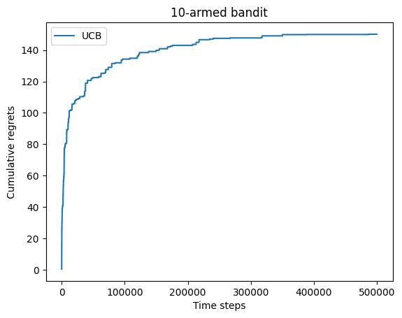

# RL学习笔记 - 上篇

## 缘起

笔者国庆节返校的某个晚课上看[动手学强化学习](https://hrl.boyuai.com/)看得要睡着了，因此准备在这里整理一下笔记让自己打起精神。

笔记的风格和我的其他博客差不多，以打通思路的推理为主，不会搞复制粘贴，因为我看那个教程后面写得有点点缺乏线索……

最近天天看网上 RL 来 RL 去的，一开始不知所云，现在力求搞懂，因此有空就来更新一下~

笔记主要是针对上面那个教程的，大体上也照着其思路写，但是调整了部分顺序和详略以符合我个人的思路线索，也参考了西湖大学赵世钰的《强化学习的数学原理》作为一部分的知识与理论补充。在此向诸位前辈以及 Anna's Archive 致敬。

如果本学期或以后有时间，可以搓一个自动躲弹幕的 THARL (TouHou Agent through Reinforced Learning) 项目来玩玩。

## 第一章

简单回顾一下一般的有监督学习任务，我们的目标是经验风险最小化，也就是

$$
\mathrm{arg}\min_{\theta\quad} \mathbb{E}_{x,t\sim p(x,t)}[\mathcal{L(\theta;x,t)}]
$$

这里的 $\theta$ 就是网络参数，也就是我们的优化对象；$x,t\sim p(x,t)$ 就是从样本与标签的联合分布中采样一个（样本，标签）对，作为我们的训练数据。在这个数据上面，我们需要定义一个损失函数 $\mathcal{L}(\theta;x,t)$ 用来表征我们的网络 $\theta$ 能不能尽可能将 $x$ 映射到 $t$。最后我们要针对全部（或者对于基于小批量梯度的优化器而言，只需要针对一部分）的经验样本计算出来的损失对其进行最小化。

而强化学习和它有相似也有不同。一个 Agent 处于某个状态 $s_{t-1}$，基于自我策略 $\pi$ 做出动作 $a_i$，从而转移到新的状态 $s_t$。这个过程会得到对应的奖励或者惩罚，这种反馈是基于环境固有的。譬如一个下国际象棋的 Agent，会选择将某个位置的国王移到另外一个位置，如果它能够以此避开将军，则能获得一点奖励；如果不能避开或者陷入了不合法的移动，则获得负奖励也就是惩罚（这里的奖励是基于**决策**的）。通过象棋规则带来的约束，就可以使得该 Agent 高效进行学习规则。更进一步，通过设计子力，棋局价值等更高级的奖励（这里的奖励是基于**状态**的），我们就可以让这个 Agent 学习如何赢棋，最后打败国际象棋大师卡斯帕罗夫……

刚刚的过程就描述了 RL 的一步过程，模型探索并从错误中学习。我们现在就可以明确 RL 的目标所在——通过这样一个过程，不断**优化**策略使得自己每一次行动都能规避惩罚并获取**最多**奖励。当然模型的策略并不一定会均等地覆盖所有可能的动作空间，而是对不同的状态和行动有不同的概率出现，也就可以建模成一个分布，被称作其策略的占用度量 $\rho_\pi$。我们希望在这个活动范围内，能够以优化策略的方式最大化奖励 $r$，也就是

$$
\mathrm{arg}\max_{\pi\quad} \mathbb{E}_{s,a\sim \rho_\pi(s,a)}[r(s,a)]
$$

很像吧，其实形式上可以说和有监督学习没有什么区别，但是区别还是比较大，比如说一个模型可以探索的策略的占用度量会随着策略改变而改变；而我们也不是基于奖励函数直接就来算梯度做梯度上升（有的操作可能没梯度呢）。

不过其实最大的区别是序列性，因为强化学习一步步的转移是有序的，不像端到端学习那样可以随机抽样本算梯度。

## 第二章

### 问题的引入

本章聚焦 RL 的第一个经典问题：多臂老虎机问题。但是我觉得这个其实不像老虎机，因为要老虎机付费使用但是这个问题赠送了免费额度，因此不如把这个问题建模如下：

你作为一个新人，被舞萌痴好友安利来到了机厅。舞萌的新人可以有免费打歌的额度，我们考虑你有 $T$ 次机会免费打歌。由于你是新人并不理解舞萌的谱面难度如何，但是那些简单铺面跟着按还是可以的，因此对于 $K$ 个谱面，你有 $p_i$ 的概率通过（$i=1\dots K$），也就是服从伯努利分布，但是你并不知道这个概率具体的值，只有每一次玩某个谱面，通过和不通过的区别。

你仅仅是体验，所以只要通过谱面即可，现在你想要**使你合计获得的的通过次数最大化**，可以选择什么策略？

### 权衡

这里的权衡很简单，一方面，我们会消耗有限的机会去获取对谱面通过概率的估计值 $\hat p_i$，但是一旦我们足够相信自己的估计，我们就可以逮着那个最大概率使劲薅~

我们可以控制一个比例 $\epsilon$ 来权衡到底是走稳健流去接着打自己目前估计出概率最高的谱子，或者探索一下其他谱子万一自己只是一开始手感不好呢……

所以我们每一步生成一个随机数 $r\in U(0,1)$，然后根据 $\epsilon$，进行下面的决策：

$$
\mathrm{Choice\ of\ index}=
\begin{cases}
    i\mathrm{\ \ for\ \ arg}\max_{i} \hat p_i,\quad &r>\epsilon\\
    \mathrm{Randomly},&r\le \epsilon
\end{cases}
$$

当然每一次选择之后要更新估计的概率池子。

我们怎么看这个策略是否足够好呢，其实可以量化它与我们先验知道的最优解之间的差距，这被称作**懊悔（Regret）**。

这个算法只有一个超参数可调，也就是 $\epsilon$，首先我们可能会选择一个固定的值：

但是可见，随着尝试次数的增加，懊悔值也在增加！为什么？当我们积累了足够多的尝试之后，其实已经有足够理由去认为频率是概率的合理估计了，这个时候还以一个固定比例进行随机尝试，就很愚蠢了，假设我们的估计已经收敛，但是每一步增长的懊悔值期望为 $\epsilon\times\dfrac{K-1}{K}$，则总的懊悔值就是 $\epsilon T$ 的量级，随着尝试次数线性增长。

那怎么搞呢？我们肯定是让 $\epsilon$ 衰减，但是怎么衰减呢？

我们把总懊悔分割成两个部分，第一个是随机抽出来的懊悔，第二个是固定抽出来的懊悔。对于**能够收敛到最优概率的情况**，总懊悔就取决于第一部分，而第一部分能产生的懊悔期望值是固定可以计算的，即：

$$
\sum_i^T \epsilon_i = O(F(T))\implies \mathrm{Acc.\ Reg.}=O(F(T))
$$

也就是说，我们选取 $\epsilon_i$ 作为收敛的级数，就可以让累积懊悔也收敛。

上面那个式子可以用实验验证，刚刚我们看到了 $\epsilon$ 是常数的情况，如果换成 $\epsilon_i=1/i$，就可见累积懊悔是对数级增长，而换成 $\epsilon_i=1/i^2$ 或者 $\epsilon_i=\exp(-i)$ 就可以观察到累积懊悔收敛到常数。

但是前提是**能够收敛到最优概率**上！

所以我认为课件上“很难找到合适的衰减规划”这句话只说了一半。这个问题的概率可能更加不确定，需要更稳健的打法（毕竟刚刚的分析建立在第二部分的懊悔收敛到0的情况，如果衰减太快可能没法收敛到最优，不能保证收敛性），而在差异大，更简单的情况下，我觉得取指数衰减基本上可以通杀了。

但问题没有消失：如果一开始陷入局部最优了，那你这不就炸了吗，所以有没有更稳健的打法，能够保证累积懊悔能够收敛到一个趋势呢。

### 平衡探索和利用

下面介绍 UCB 算法，也就是置信上界法，在引入这个方法之前，我们还是回到之前的那个问题，即：当我们有一系列抽样结果之后，我们是将其视作真实分布进行“利用”，还是认为证据不足而去“探索”新的数据呢？

这就引出了一个问题：怎么样刻画这个“认为证据不足”？也就是在多大的概率下，我们可以断言这个建模足够拟合原有分布？

我们有 Hoeffding's inequality，它能告诉我们答案：考虑 $[0,1]$ 内独立同分布的随机变量 $x_1,\dots, x_n$，以样本均值 $\bar x$ 为原分布均值 $\mu$ 的建模，并且引入容差或者说不确定度 $u$，则有以下的概率不等式：

$$
P(\mu >\bar x + u) \le \exp(-2nu^2)
$$

把这个不等式翻译到问题里面，也就是对于某谱面 $a$，为了控制估计值和真实值之差大于不确定度的概率 $P(\mu_a >\bar x_a + u_a)$，我们可以控制其上界 $\exp(-2nu_a^2)$，把它限制在容忍的概率值 $p$ 内。

既然我们已经能够控制逼近均值的精度，那我们可以直接利用估计值的最大值 $\mathrm{arg}\max_a\bar x_a + u_a$ 来做选择，这就和前面的概率贪心做法有本质不同：即使最坏情况 $\exp(-2nu_a^2)=p$，我们也可以取 $u_a=\sqrt{- \dfrac{\log p}{2n}}$，随着 $n$ 的增长，让 $p\to 0$ 就可以实现对分布精确均值的收敛。

这就是 UCB 算法的流程了。具体而言：

- 为了让 $p\to 0$，我们取 $p=1/n$，然后根据现有的均值计算这个**期望奖励上界** $U_a(t)=\bar x_a(t)+u(t)=\bar x_a(t)+\sqrt{\dfrac{\log n}{2(n+1)}}$。
- 求使其最大的那个 $i$ 作为选择。
- 选择后，更新均值为 $\bar x_i(t+1)$。

自然我们也可以改变均值和不确定度两者的配比。

课件里面给出了其累积懊悔是 $O(\log n)$ 级别的结论。事实上，我们对比一下先前的讨论，可以看到虽然其时间复杂度更高，但是可以保证渐进收敛不会炸，如果把一开始那个随机 ε-贪心策略的不收敛情况考虑进来，其实累积的期望懊悔也是线性增长的。有没有可能有更好的算法呢？

没可能了。Lai 和 Robbins 已经证明了[累积懊悔的下界是对数级的]()。我之前也考虑过让 $p$ 趋于 $0$ 的速度更快，理论和实验都表明但任何阶数更高的尝试都不能避免探索过少的问题。（如果想做实验的话可以把几个臂的概率差调小一点，这样就更容易让模型收敛到错误的臂上面）

也就是说这个问题是**有解的**，无论是 UCB 算法还是 ε-贪心策略，控制到对数阶就可以做到**探索和利用的平衡**。

教程最后还介绍了 Thompson 采样算法，其实有点像蒙特卡罗采样。刚刚我们是用样本均值估计实际分布均值，而这个算法是根据样本分布估计实际分布。我们的直觉是，$\alpha+\beta -2$ 次抽样里面，出现了 $\alpha-1$ 次通过和 $\beta - 1$ 次不通过，每一次服从概率 $p$ 的伯努利分布，那么总概率和 $p^{\alpha-1}(1-p)^{\beta-1}$ 成比例。这个形式和 Beta 分布也是成比例的，为此可以选择利用 Beta 分布为目标的概率分布进行建模，然后求均值，就可以找 argmax 做决策了。

这个算法的想法就更精妙一些，不是先解耦探索和利用两步再进行平衡，而是通过引入一个优秀的归纳偏置，即 Beta 分布，而不同的抽取次数和结果对“探索”和“利用”的共同影响，自然在这个分布里面得到了一体化的建模。这个思想其实和从 GAN 到 VAE 的思想很像。

[这篇文章](https://www.microsoft.com/en-us/research/wp-content/uploads/2016/02/thompson.pdf)表明了 Thompson 采样算法在阶数上也是渐进最优的，并且常数甚至还要低一些。

### 总结

这个名叫**多臂老虎机**的问题展示了强化学习需要权衡的一个问题，感性地理解就是选择更激进或更保守的策略，用术语讲就叫平衡探索和利用。在端到端学习中，我们遇到的类似问题是收敛到鞍点或局部最小，为此我们引入了随机性来解决——可以看到，在强化学习中，我们也只不过是换了种利用随机性的方式而已。

## 第三章

第三章主要讲的是马尔可夫过程，首先是比较简单的 Markov 奖励过程 MRP。

### MRP

我们考虑一个图 $G$，使用邻接矩阵来 $\mathcal{P}$ 描述。具体而言，我们有节点列表 $s_i$ 代表当时的**状态**，而 $\mathcal{P}_{ij}$ 表征从状态 $s_i$ 跳到状态 $s_j$ 的概率。

对于每一个状态 $s$，我们可以确定状态本身的奖励 $R=r(s)$。也就是说我们有了一个带点权和边权的有向图。

由于转移概率已经给定，我们需要解决的问题是**选择一个起始的状态，能够使得累积的期望奖励最大**。

但是这个表述有一个隐含的问题：如果所有状态的奖励都是正数，并且大小不一，理论上所有状态累积的奖励都能无上限地增长！

因此我们需要引入一个**衰减因子** $\gamma$ 用来控制。具体而言，这个值越大，模型越关注长期奖励，越小模型越关注短期奖励。

这样，$t$ 时刻从某个状态 $s$ 出发，我们就能够产生一条路径。每一次走一步，就能够产生一个奖励的序列 $R_t,R_{t+1},\dots$。而这条路径的奖励就是 $G_t=R_t+\gamma R_{t+1}+\dots$

由于状态的转移是基于概率的，因此每一次产生的路径都不一样，因此我们需要求期望。我们把这个目标叫做某个状态的**价值** $V(s)$，也就是

$$
\begin{align*}
    V(s)&=\mathbb{E}[G_t|S_t=s]\\
    &=\mathbb{E}[R_t+\gamma R_{t+1}+\dots|S_t=s]\\
    &=R_t+\gamma\mathbb{E}[R_{t+1}+\gamma R_{t+2}+\dots|S_t=s]\\
    &=R_t+\gamma\mathbb{E}[G_{t+1}+\dots|S_t=s]\\
    &=R_t+\gamma\sum_{s_i\in S} p(s_i|s)V(s_i)
\end{align*}
$$

不好意思哈哈，你看这事搞得，怎么一不小心就把 MRP 的贝尔曼方程也一并推导了出来呢……

让我们来解读一下吧。$R_t$ 就是当前状态 $s$ 的奖励 $r(s)$，而后面那个求和就是计算从当前状态转移到下一状态的概率乘以下一状态的价值函数，也就是所有下一个状态的**期望价值**，最后乘以衰减系数 $\gamma$。

式子的意图还是相当明晰的，甚至我们可以基于转移矩阵把这个贝尔曼方程写成矩阵形式：

$$
V=R+\gamma \mathcal PV\\
\implies V=(I-\gamma \mathcal P)^{-1}R
$$

这样我们就可以以 $O(n^3)$ 的时间复杂度精确求得 $V$ 而能够得到每个状态的期望价值了。

让我们假设一种单回合的塔防游戏，你有 $n$ 个格子，每个格子可以选择放 $k$ 种等级的防御塔，防御塔的等级之和不大于一个给定值。放好之后，敌人来袭，敌人的攻击有概率使得你的防御塔降级或者直接被破坏。需要求解一个最优的放置策略，让自己保留的防御塔等级之和最大。

这是一个非常贴合刚刚提到的 MRP 过程的场景。但是如果你要对此进行精确求解，计算量会达到 $n^3k^3$，即使有 50 个格子 8 种等级，也至少需要计算 64M 次。

并且一开始我们还可能不知道毁伤和击毁的概率，这就需要更大量的计算进行采样。

因此我们需要更高效却不那么精确的算法！具体怎么搞，且听下回分解。

### MDP

我们注意到 MRP 类似于“一锤子的买卖”，确定一个状态后，就随着状态转移矩阵在那里随波逐流了。能不能更有主见一点，让模型进行每一步的决策呢？可以的，这就是 Markov 决策过程 MDP。

从定义上，我们可以对刚刚的 MRP 进行修改。首先状态转移矩阵 $\mathcal{P}$ 就变成了一个形状为 `[N, N, A]` 的三维张量，用数学语言说就是 $P(s_i|s_j,a)$ 表示从 $s_j$ 出发采取动作 $a$ 能够到达的概率。我第一次看感觉很离谱，比如动作 $a$ 就是从 $s_j$ 到 $s_i$，一个确定性的东西为什么要引入概率呢？其实有一个模型叫做冰湖模型，即使我们采取了这样直接的动作，也有可能滑到其他状态去。

对应的，我们也可以把奖励改成矩阵 $r(s,a)$，通过增加对动作的奖励，我们可以修改模型对某些特定动作的偏好。当然我们也可以不加，纯目标导向。

接下来就涉及到最核心的部分：**策略**。智能体的策略是基于状态的行动，也就是 $\pi(a|s)=P(A_t=a|S_t=s)$。如果智能体采用随机的策略，那 $\pi$ 就刻画其分布；如果智能体采用确定的策略，那这个分布就变成单点分布。这个分布将状态空间映射到动作空间，自然我们可以使用一个神经网络来拟合这个分布。这就是**深度强化学习**。

现在，我们可以写出基于策略 $\pi$ 的状态价值函数：

$$
V^\pi(s)=\mathbb{E}_{a\sim\pi(a|s)}[G_t|S_t=s]
$$

然后我们可以把这个式子针对每个动作拆开，定义**动作价值函数**为某个动作的价值，也就是**这个动作的回报**加上**动作之后的期望状态价值**：

$$
Q^\pi(s,a)=\mathbb{E}[G_t|S_t=s,A_t=a]=r(s,a)+\gamma\sum_{s_i\in S}p(s_i|s,a)V^\pi(s_i)
$$

注意到这个时候 $Q^\pi$ 和 $V^\pi$ 相互依赖，为了像之前的 MRP 一样能够写成方程的形式进行求解，我们需要改写成让它们**依赖于自身**的**自举**形式：

$$
\begin{align*}
    V^\pi(s)&=\sum_{a\in A}\pi(a|s)Q^\pi(s,a)\\
    &=\sum_{a\in A}\pi(a|s)\left(r(s,a)+\gamma\sum_{s_i\in S}p(s_i|s,a)V^\pi(s_i)\right)\\
    Q^\pi(s,a)&=r(s,a)+\gamma\sum_{s_i\in S}p(s_i|s,a)V^\pi(s_i)\\
    &=r(s,a)+\gamma\sum_{s_i\in S}p(s_i|s,a)\sum_{a\in A}\pi(a|s_i)Q^\pi(s_i,a)
\end{align*}
$$

这被叫做**贝尔曼期望方程**。

对于一个确定的策略 $\pi(a|s)$，我们可以通过**边缘化**的方式将 MDP 转换成已知求解方式的 MRP 来求解。具体而言，某个状态的期望奖励和期望的转移概率可以通过全期望（概率）公式进行计算：

$$
\begin{align*}
    \hat r(s)&=\sum_{a\in A}\pi(a|s)r(s,a)\\
    \hat P(s_i,s)&=\sum_{a\in A}\pi(a|s)P(s_i|s,a)
\end{align*}
$$

简单说，就是利用分布 $\pi(a|s)$ 作为权重进行加权，将奖励矩阵的 $a$ 维度拍到 $s$ 维度上面，将转移张量的 $a$ 维度拍到 $s\times s$ 矩阵上面。这样我们就可以转化成 MDP 来求解每一个状态的价值了。

自然这样做需要我们明确除了 $V^\pi$ 和 $Q^\pi$ 外的策略分布、状态转移矩阵和奖励函数，但一般而言，这些东西基本上都是黑盒，因此我们需要进行采样。也就是基于策略 $\pi$ 采样状态路径，并计算估计的 $V^\pi(s)$。

知道了某个策略 $\pi$ 对应的状态价值 $V^\pi(s)$ 之后，我们就可以考虑优化这个策略，让其价值尽可能高，也就是**贝尔曼最优方程**：

$$
\begin{align*}
    V^*(s)&=\max_{a\in A}\left(r(s,a)+\gamma\sum_{s_i\in S}p(s_i|s,a)V^*(s_i)\right)\\
    Q^*(s,a)&=r(s,a)+\gamma\sum_{s_i\in S}p(s_i|s,a)\max_{a\in A}Q^*(s_i,a)
\end{align*}
$$

和之前的贝尔曼期望方程比较，其实就是把 $\sum_{a\in A}\pi(a|s_i)$ 换成了 $\max_{a\in A}$，也就是从**求期望**变成了**取最优**。

下面的任务，就是对这个贝尔曼最优方程进行求解了。

精确解法请看第四章，基于随机化采样的各种算法请看第三点五章和第五章。

## 第三点五章

本章是补充内容，旨在补充讲解蒙特卡洛方法，对应原教程 3.5 节。《动手学强化学习》没有这一章特别详细的内容，提了一嘴之后就在那纠结占用度量，但是我觉得占用度量不是一个特别值得单独讨论的点，因此我就跳过了，本章基于《强化学习的数学原理》补充。

### 回顾

从最抽象的意义上说，假设我们有一个随机初始化的策略，怎么样找到最优策略呢？对于状态 $s$，策略给出动作 $a$，我们肯定首先要足够肯定**当前状态对应这个动作的价值是多少**，更要肯定**这个动作是不是带来最大价值的动作**。

回忆一下——这不就是第二章我们讨论过的**多臂老虎机**问题吗！

### 迁移

让我们试图把最简单的ε-贪婪算法迁移到这个场景来。

从一个初始的状态-动作组 $(s,a)$ 开始，我们可以产生长度 $T$ 的一系列状态-动作组。倒过来看，我们可以层层向外去累计价值。具体而言，比如说状态-动作组 $(s_{t},a_{t})$ 能产生的奖励 $R_{t}$ 就是 $r(s_{t},a_{t})$，而此时的累积奖励 $G_{t}=\gamma G_{t+1}+R_{t+1}$，就可以倒着一步步求出来。也就是说，走这一趟我们可以求得这个路径为状态-动作组 $(s_{t},a_{t})$ 带来的总的奖励 $R$。

进而，行动的价值函数 $Q(s_t,a_t)$ 就是状态-动作组 $(s_{t},a_{t})$ 对应的 $G$ 的期望，那么计算路径访问的这个组的次数 $N_{s_t,a_t}$，用 $R$ 除以这个次数，就可以得到 $Q$ 的期望值了。

按先前的贝尔曼最优方程，那我就直接选能使得 $Q$ 最大的行动就行了啊……对吗？

现在的问题是，对于状态 $s_t$，我们可以计算对应各个动作估计的价值函数，但这终究是估计，需要**平衡探索与利用**，也就是说，我们不能硬取 $\max$ 变成纯贪心，而是选择采用**ε-贪婪策略**：把 $\max$ 的那个动作的概率设置成 $1-\dfrac{|A(s_t)|-1}{|A(s_t)|}\epsilon$，其他动作的概率设置成 $\dfrac{1}{|A(s_t)|}\epsilon$。

让我们来看看具体的算法流程吧：

### 算法

这个算法叫做 MC ε-Greedy。让我们理一下算法流程：

- 需要策略 $\pi$，动作价值函数 $Q(s,a)$，每对的累计奖励 $R(s,a)=0$ 和计数函数 $N(s,a)=0$
- 开始采样：
- 从某个随机选择的状态-动作对 $(s_0,a_0)$ 开始，采样一个长度为 $T$ 的序列。
- 初始化累计奖励 $G=0$
  - 对于 $t=T-1,T-2,\dots,0$：
  - 计算序列累计奖励 $G\leftarrow \gamma G+r(s_t,a_t)$
  - 计算状态-动作对的累积奖励 $R(s_t,a_t)\leftarrow R(s_t,a_t)+G$，更新计数函数 $N(s_t,a_t)\leftarrow N(s_t,a_t)+1$
  - 计算期望值 $Q(s_t,a_t)=\dfrac{R(s_t,a_t)}{N(s_t,a_t)}$
  - 改进策略：如果这个 $a_t$ 能够使 $Q$ 更大，就把这个动作的概率 $\pi(a=a_t|s_t)$ 设置成 $1-\dfrac{|A(s_t)|-1}{|A(s_t)|}\epsilon$，其他动作的概率 $\pi(a\ne a_t|s_t)$ 设置成 $\dfrac{1}{|A(s_t)|}\epsilon$。
- 重复上述过程，达到设定的采样次数就停止。

这个模型是**无模型**的策略改进算法。也就是说我们可以不先验地预知环境带来的状态转移概率，而是通过采样的序列和对应的奖励来进行学习。同时，我们不知道最后得到的策略是否是最优的。

接下来我们要看的算法是**有模型**的算法，基于给定的状态转移矩阵、奖励函数和策略分布。此时我们能够**确定地**得到最优策略。

## 第四章

本章介绍的是动态规划算法，虽然叫这个名字，但其实是贪心算法。

### 策略迭代

策略迭代分为两个过程：策略评估和策略提升。

#### 策略评估

一开始的讨论中，我们得到了 MDP 的贝尔曼期望方程：

$$
V^\pi(s)=\sum_{a\in A}\pi(a|s)\left(r(s,a)+\gamma\sum_{s_i\in S}p(s_i|s,a)V^\pi(s_i)\right)
$$

之前我们提到，要把这个贝尔曼期望方程写成**自举**的形式，尽管我们并不能像 MRP 一样直接进行解析求解，但注意到这个东西很像**不动点迭代**，也就是说，对于 $V^\pi$ 而言，我们根据上面的方程左边赋给右边，直到差值小于容差 $\theta$，就可以计算出当前策略下的全部状态价值 $V^*(s)$ 了。

#### 策略提升

这一步我们直接可以从贝尔曼最优方程导出，对于状态 $s$：

$$
\pi^*(a|s)=a\mathrm{\quad s.t.\quad}\max_{a\in A}\left(r(s,a)+\gamma\sum_{s_i\in S}p(s_i|s,a)V^*(s_i)\right)
$$

由于策略提升之后，基于策略的状态价值函数就改变了，因此需要重新进行策略评估。

策略提升的终点就是没有更优的策略可以提升了，也就是得到了最优策略。

### 价值迭代

我们重新审视一下刚刚利用贝尔曼最优方程的地方，可以发现我们其实把那个 $\max$ 的值给丢了，只去找最大的行动去了。

但其实这个值就是当前的最优价值！如果利用好这个信息参与迭代，肯定比重新来做策略评估快。

也就是说，我们只需要对刚刚的策略评估进行一点点修改：

$$
V^*(s)=\max_{a\in A}\left(r(s,a)+\gamma\sum_{s_i\in S}p(s_i|s,a)V^*(s_i)\right)
$$

对这个状态价值函数进行不动点迭代，直到收敛，就能更快地收敛到最优价值。

最后，我们像先前的策略提升一样，求出这个 $\max$ 对应的各个状态的行动即可。

### 收敛性证明

请参阅任何一本强化学习教材。这里实在不想纠结于数学的细节了，实际应用上根本不可能有这么简单的白盒场景，而一般的深度强化学习方法还不一定保证收敛呢，这里推导这么多不是扯淡吗……

## 第五章

本章讲解时序差分算法，主要是 Sarsa 算法和 Q-learning 算法。在我看来，这两种算法都是基于先前的 MC ε-Greedy 算法的改进。在蒙特卡洛算法中，我们有下面的操作：

- 计算序列累计奖励 $G\leftarrow \gamma G+r(s_t,a_t)$
- 计算状态-动作对的累积奖励 $R(s_t,a_t)\leftarrow R(s_t,a_t)+G$，更新计数函数 $N(s_t,a_t)\leftarrow N(s_t,a_t)+1$
- 计算期望值 $Q(s_t,a_t)=\dfrac{R(s_t,a_t)}{N(s_t,a_t)}$

实际上，$Q$ 的更新式子写开，就是：

$$
\begin{align*}
    Q'(s_t,a_t)&=\dfrac{R'(s_t,a_t)}{N'(s_t,a_t)}\\
    &=\dfrac{R(s_t,a_t)+\gamma G+r(s_t,a_t)}{N'(s_t,a_t)}\\
    &=\dfrac{N'(s_t,a_t)-1}{N'(s_t,a_t)}Q(s_t,a_t)+\dfrac{\gamma G+r(s_t,a_t)}{N'(s_t,a_t)}\\
    &=Q(s_t,a_t)+\dfrac{1}{N'(s_t,a_t)}[\gamma G+r(s_t,a_t)-Q(s_t,a_t)]
\end{align*}
$$

考虑到我们不一定要像 MC ε-Greedy 那样倒着计算某个序列的累积奖励，这就意味着序列长度 $N$ 和累计奖励 $G$ 是难以获知的，为此，我们需要用一些已知量进行合理替代。

一方面，序列长度未知，我们就可以用一个类似端到端学习的学习率的量 $\alpha$ 来代替 $\dfrac{1}{N'(s_t,a_t)}$。另一方面，既然 $G$ 是进行动作 $(s_t,a_t)\to s_{t+1}$ 后的累积奖励，那么根据**自举形式**的贝尔曼方程，我们就可以利用目标状态 $s_{t+1}$ 的动作价值函数来估计这个累积奖励了。这就是**时序差分算法**的含义。也就是

$$
Q'(s_t,a_t)=Q(s_t,a_t)+\alpha[\gamma Q(s_{t+1},a_{t+1})+r(s_t,a_t)-Q(s_t,a_t)]
$$

现在唯一不知道的就是 $a_{t+1}$ 怎么个取法了，而它的取法就基本上决定了本章的 Sarsa 算法和 Q-learning 算法的分野。

### Sarsa 算法

Sarsa 算法的思想是，既然我要平衡探索和利用，那 $a_{t+1}$ 也可以利用 ε-Greedy 策略进行生成。具体而言的算法流程：

- 初始化动作价值函数 $Q(s,a)$
- 基于给定的序列采样次数 $T$ 开始循环：
  - 选择初始状态 $s$
  - 在 $s$ 的动作空间内，基于多臂老虎机的 ε-Greedy 策略选择一个动作 $a$。
  - 基于设定的时间步 $N$ 开始循环：
    - 基于动作 $a$ 转移到状态 $s'$，并获得环境奖励 $r(s,a)$
    - 在 $s'$ 的动作空间内，基于多臂老虎机的 ε-Greedy 策略选择一个动作 $a'$。
    - 进行时序差分估计：$Q(s,a)\leftarrow Q(s,a)+\alpha[\gamma Q(s',a')+r(s,a)-Q(s,a)]$
    - 执行更新：$s\leftarrow s',a\leftarrow a'$

利用 $Q(s',a')$ 对 $Q(s_{t+1},a_{t+1})$ 进行单步估计是相对比较“慢”的，这是因为 MC 方法固有的特性，因此为了获取更多的数据进行更准确的估计，我们可以把  $Q(s_{t+1},a_{t+1})$ 拆开：

$$
\gamma Q(s_{t+1},a_{t+1})=\gamma r(s_{t+1},a_{t+1})+\gamma^2 (s_{t+2},a_{t+2})+\cdots+\gamma^n Q(s_{t+n},a_{t+n})
$$

这就是**多步 Sarsa 算法**。具体流程如下：

- 初始化动作价值函数 $Q(s,a)$
- 基于给定的序列采样次数 $T$ 开始循环：
  - 选择初始状态 $s$
  - 在 $s$ 的动作空间内，基于多臂老虎机的 ε-Greedy 策略选择一个动作 $a$。
  - 基于设定的总时间步 $N$ 开始循环：
  - 初始化累积奖励 $R=0$
    - 基于设定的 Sarsa 步数 $n$ 从 $i = 1$ 开始循环：
      - 基于动作 $a$ 转移到状态 $s'$，并获得环境奖励 $r(s_i,a_i)$
      - 在 $s'$ 的动作空间内，基于多臂老虎机的 ε-Greedy 策略选择一个动作 $a'$。
      - 执行更新：$s\leftarrow s',a\leftarrow a'$
    - 计算累计奖励 $R=\gamma^{n+1}Q(s',a')+\sum_{i=1}^{n}\gamma^i r(s_i,a_i)$
    - 进行时序差分估计：$Q(s,a)\leftarrow Q(s,a)+\alpha[R+r(s,a)-Q(s,a)]$
    - 执行更新：$s\leftarrow s',a\leftarrow a'$

可以看到总时间步不变但多步 Sarsa 算法的估计更精确，收敛也更快。

### Q-learning 算法

Q-learning 算法选择直接基于贝尔曼最优方程进行估计，因此 $a_{t+1}$ 可以直接选择 $\max_{a_{t+1}\in A(s_{t+1})} Q(s_{t+1},a_{t+1})$。但是你可能就要问，说好的“探索与利用的平衡”呢？别急，这就是它作为**离线策略算法**的精髓，先看算法：

- 初始化动作价值函数 $Q(s,a)$
- 基于给定的序列采样次数 $T$ 开始循环：
  - 选择初始状态 $s$
  - 基于设定的时间步 $N$ 开始循环：
    - 在 $s$ 的动作空间内，基于多臂老虎机的 ε-Greedy 策略选择一个动作 $a$。
    - 基于动作 $a$ 转移到状态 $s'$，并获得环境奖励 $r(s,a)$
    - 进行时序差分估计：$Q(s,a)\leftarrow Q(s,a)+\alpha[\gamma \max_{a'}Q(s',a')+r(s,a)-Q(s,a)]$
    - 执行更新：$s\leftarrow s'$

看，我们是通过第一个 ε-Greedy 策略来保证这个平衡的，因为**你并没有用到这个 max 操作来进行动作选择，而只是去估计动作价值**，这就意味着不会因为 max 而“有失偏颇”。回顾一下多臂老虎机里面，正是因为我们基于估计的最大值进行了**选择**，才会一步错步步错。

在这个场景里面，**所有动作的选择都是基于正确的 ε-Greedy 策略进行的**，而这才能够保证“探索与利用的平衡”。

### 在线和离线

这里的“在线”和“离线”其实和 OI 语境的用法类似。在 OI 里面对于多个查询，“离线”做法就是先暂存所有查询，通过分块排序等方式能够使得处理查询的效率更高（莫队算法）；“在线”做法就是强制一个查询对应一个结果，一般可以通过答案互相异或一下来保证查询到结果的顺序性。

在 RL 领域，刚刚提到的 Sarsa 算法就是一个**在线策略算法**，“在线”的意思就是必须直接利用当前的动作对 $Q$ 进行更新，也就是说更新 $Q(s,a)$ 需要 $(s,a,s',a',r)$ 这个五元组，而 $(s',a')$ 又会变成新的 $(s,a)$，这就要求一种顺序性。一条道走到黑，不撞南墙不回头。

而 Q-learning 对 $Q(s,a)$ 的更新只需要 $(s,a,s',r)$ 四元组，我们**不需要直接利用当前的动作来做更新**，甚至我们可以通过多个并行的训练场获取大量的 $(s,a,s',r)$ 四元组数据，然后相互交换数据，由于这种顺序性被打破了，因此就是**离线策略算法**。甚至我们可以手动采样这一四元组而不更新，最后再依靠数据计算 $Q$ 的估计值，这有点像先前的 MC ε-Greedy，但也是离线 RL 的雏形。

## 结语

在本篇笔记中，我们从 0 开始建立了强化学习的基本框架。我们从最简单的 ε-Greedy 策略出发，了解了马尔可夫决策过程，经历了各种贝尔曼方程的推导，最终抵达了 Sarsa 算法和 Q-learning 算法的里程碑。

Q-learning 是一个很重要的算法。在下一篇笔记中，我们将基于这个祖师爷，理清楚从 Q-learning 到 Dyna-Q 再到 DQN 及其改进算法的完整演变流程。Q 将会是下一篇笔记的核心字母。而我们的认知也会从传统的强化学习逐步走向深度强化学习。
