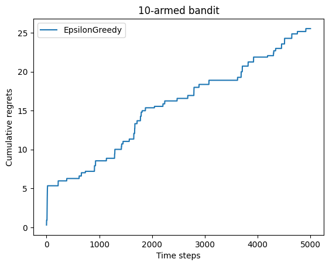

# RL学习笔记

## 缘起

笔者看[动手学强化学习](https://hrl.boyuai.com/)看得要睡着了，因此准备在这里整理一下笔记让自己打起精神。天天看网上 RL 来 RL 去的，不知所云，因此有空就来更新一下~

笔记主要是针对上面那本教材的。如果本学期或以后有时间，可以搓一个自动躲弹幕的 THARL (TouHou Agent through Reinforced Learning) 项目来玩玩。

## 第一章

简单回顾一下一般的有监督学习任务，我们的目标是经验风险最小化，也就是

$$
\mathrm{arg}\min_{\theta\quad} \mathbb{E}_{x,t\sim p(x,t)}[\mathcal{L(\theta;x,t)}]
$$

这里的 $\theta$ 就是网络参数，也就是我们的优化对象；$x,t\sim p(x,t)$ 就是从样本与标签的联合分布中采样一个（样本，标签）对，作为我们的训练数据。在这个数据上面，我们需要定义一个损失函数 $\mathcal{L}(\theta;x,t)$ 用来表征我们的网络 $\theta$ 能不能尽可能将 $x$ 映射到 $t$。最后我们要针对全部（或者对于基于小批量梯度的优化器而言，只需要针对一部分）的经验样本计算出来的损失对其进行最小化。

而强化学习和它有相似也有不同。一个 Agent 处于某个状态 $s_{t-1}$，基于自我策略 $\pi$ 做出动作 $a_i$，从而转移到新的状态 $s_t$。这个过程会得到对应的奖励或者惩罚，这种反馈是基于环境固有的。譬如一个下国际象棋的 Agent，会选择将某个位置的国王移到另外一个位置，如果它能够以此避开将军，则能获得一点奖励；如果不能避开或者陷入了不合法的移动，则获得负奖励也就是惩罚（这里的奖励是基于**决策**的）。通过象棋规则带来的约束，就可以使得该 Agent 高效进行学习规则。更进一步，通过设计子力，棋局价值等更高级的奖励（这里的奖励是基于**状态**的），我们就可以让这个 Agent 学习如何赢棋，最后打败国际象棋大师卡斯帕罗夫……

刚刚的过程就描述了 RL 的一步过程，模型探索并从错误中学习。我们现在就可以明确 RL 的目标所在——通过这样一个过程，不断**优化**策略使得自己每一次行动都能规避惩罚并获取**最多**奖励。当然模型的策略并不一定会均等地覆盖所有可能的动作空间，而是对不同的状态和行动有不同的概率出现，也就可以建模成一个分布，被称作其策略的占用度量 $\rho_\pi$。我们希望在这个活动范围内，能够以优化策略的方式最大化奖励 $r$，也就是

$$
\mathrm{arg}\max_{\pi\quad} \mathbb{E}_{s,a\sim \rho_\pi(s,a)}[r(s,a)]
$$

很像吧，其实形式上可以说和有监督学习没有什么区别，但是区别还是比较大，比如说一个模型可以探索的策略的占用度量会随着策略改变而改变；而我们也不是基于奖励函数直接就来算梯度做梯度上升（有的操作可能没梯度呢）。

不过其实最大的区别是序列性，因为强化学习一步步的转移是有序的，不像端到端学习那样可以随机抽样本算梯度。

## 第二章

### 问题的引入

本章聚焦 RL 的第一个经典问题：多臂老虎机问题。但是我觉得这个其实不像老虎机，因为要老虎机付费使用但是这个问题赠送了免费额度，因此不如把这个问题建模如下：

你作为一个新人，被舞萌痴好友安利来到了机厅。舞萌的新人可以有免费打歌的额度，我们考虑你有 $T$ 次机会免费打歌。由于你是新人并不理解舞萌的谱面难度如何，但是那些简单铺面跟着按还是可以的，因此对于 $K$ 个谱面，你有 $p_i$ 的概率通过（$i=1\dots K$），也就是服从伯努利分布，但是你并不知道这个概率具体的值，只有每一次玩某个谱面，通过和不通过的区别。

你仅仅是体验，所以只要通过谱面即可，现在你想要**使你合计获得的的通过次数最大化**，可以选择什么策略？

### 权衡

这里的权衡很简单，一方面，我们会消耗有限的机会去获取对谱面通过概率的估计值 $\hat p_i$，但是一旦我们足够相信自己的估计，我们就可以逮着那个最大概率使劲薅~

我们可以控制一个比例 $\epsilon$ 来权衡到底是走稳健流去接着打自己目前估计出概率最高的谱子，或者探索一下其他谱子万一自己只是一开始手感不好呢……

所以我们每一步生成一个随机数 $r\in U(0,1)$，然后根据 $\epsilon$，进行下面的决策：

$$
\mathrm{Choice\ of\ index}=
\begin{cases}
    i\mathrm{\ \ for\ \ arg}\max_{i} \hat p_i,\quad &r>\epsilon\\
    \mathrm{Randomly},&r\le \epsilon
\end{cases}
$$

当然每一次选择之后要更新估计的概率池子。

我们怎么看这个策略是否足够好呢，其实可以量化它与我们先验知道的最优解之间的差距，这被称作**懊悔（Regret）**。

这个算法只有一个超参数可调，也就是 $\epsilon$，首先我们可能会选择一个固定的值：

但是可见，随着尝试次数的增加，懊悔值也在增加！为什么？当我们积累了足够多的尝试之后，其实已经有足够理由去认为频率是概率的合理估计了，这个时候还以一个固定比例进行随机尝试，就很愚蠢了，假设我们的估计已经收敛，但是每一步增长的懊悔值期望为 $\epsilon\times\dfrac{K-1}{K}$，则总的懊悔值就是 $\epsilon T$ 的量级，随着尝试次数线性增长。

那怎么搞呢？我们肯定是让 $\epsilon$ 衰减，但是怎么衰减呢？

我们把总懊悔分割成两个部分，第一个是随机抽出来的懊悔，第二个是固定抽出来的懊悔。对于能够收敛到最优概率的情况，总懊悔就取决于第一部分，而第一部分能产生的懊悔期望值是固定可以计算的，即：

$$
\sum_i^T \epsilon_i = O(F(T))\implies \mathrm{Acc.\ Reg.}=O(F(T))
$$

也就是说，我们选取 $\epsilon_i$ 作为收敛的级数，就可以让累积懊悔也收敛。

上面那个式子可以用实验验证，刚刚我们看到了 $\epsilon$ 是常数的情况，如果换成 $\epsilon_i=1/i$，就可见累积懊悔是对数级增长，而换成 $\epsilon_i=1/i^2$ 或者 $\epsilon_i=\exp(-i)$ 就可以观察到累积懊悔收敛到常数。

所以我认为课件上“很难找到合适的衰减规划”这句话有待商榷。除非说这个问题更加不确定，需要更稳健的打法（毕竟刚刚的分析建立在第二部分的懊悔收敛到0的情况，如果衰减太快可能没法收敛到最优，不能保证收敛性），要不然我觉得取指数衰减基本上可以通杀了。