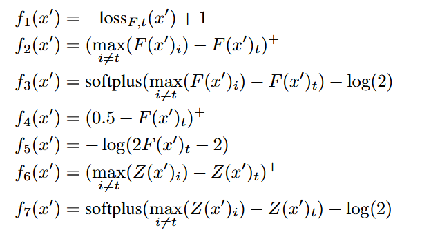
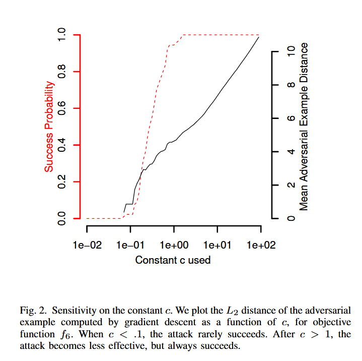
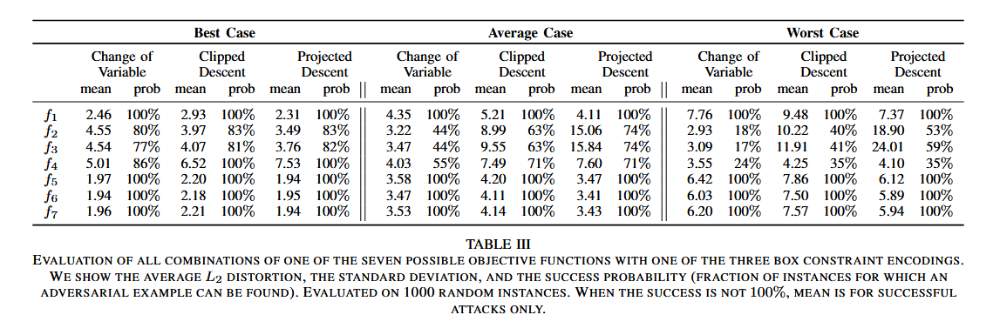
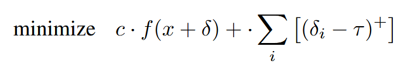
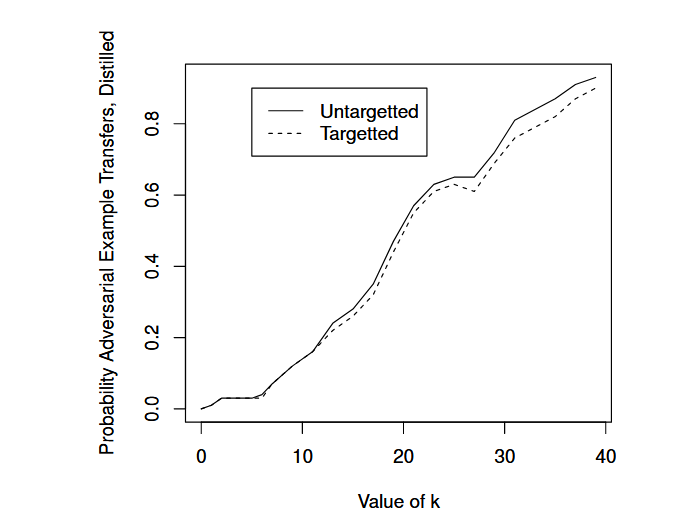

# C&W 攻击

[文章](https://ieeexplore.ieee.org/stamp/stamp.jsp?tp=&arnumber=7958570&tag=1) 发表在 IEEE S&P 2017，两位作者都来自加州大学伯克利分校。

本来文章是想针对性提出一种攻击方式来让防御性蒸馏（defensive distillation）破防，不过我觉得攻击方式和一些工程技巧才是重点，因此本文不会太多提及这一（pwned!）的防御方式。

## 正则化

这篇笔记接续上面两篇笔记。让我们来理一下思路：FGSM 攻击引入了梯度上升作为单步的攻击方式，PGD 引入了迭代的对抗样本生成。在 PGD 的笔记中，笔者还讨论了针对攻击的“正则化”问题，也就是需要在某种意义上为人类感知建模，从而控制对抗样本生成处于一种乱乎人之不察的效果。但当时的讨论尚且粗浅，处于一种定性的级别。

在笔者看来，C&W 攻击正是将这种正则化约束给“形式化”了，从而可以实打实地用优化器来跑。

让我们来看看具体是怎么形式化的：原论文的第五节，作者给出了这个量化标准：

$$
\begin{align*}
    &\min\mathcal{D}(x, x+\delta)\\
    &C(x+\delta) = t\\
    &x+\delta\in[0,1]^n
\end{align*}
$$

第一行表征的是，扰动不能太大，也就是引入一个 $\mathcal{D}$ 来约束扰动的大小。在实践上，就一般使用方便的范数约束了，即 $L_0$, $L_2$, $L_\infty$ 等范数。

第二行要求攻击成功，将扰动后的样本分类为新的类别 $t$。容易看出这个要求和第一行是拮抗的。

最后一行是可行性约束。因为图像本身有灰阶约束 $[0,255]$，超过的值都会被截断。

后面作者进一步明晰了什么是所谓的“攻击成功”。作为一个优化目标它必须完全可导。为此作者给出了许多种形式的指标：

具体的 notation 请参考原文。它们的共性是，如果攻击后的样本越倾向于被网络分类为 $t$ 类别，则值越小（但是截断到 0）。$F$ 和 $Z$ 分别对应 softmax 和未 softmax 的输出逻辑值。因为本文主要是要破防御性蒸馏的甲，而防御性蒸馏只是重新约束了一下 softmax 的输出 logits，所以如果不取 softmax 的攻击理论上说效果就会好些。

然后很自然地我们引入一个参数 $c$ 来平衡前两行的指标，这就得到了我们的优化目标：

$$
\mathcal{L}_{\mathrm{Adversarial}}=\|\delta\|_L+c\cdot f(x+\delta)
$$

为了解决值裁切问题，C&W 攻击引入了换元法，也就是让

$$
\tilde x=\dfrac 12(\tanh w+1)
$$

其中 $w$ 是一个无约束的自由变量。这样硬裁切就变成了天然纳入约束的自由优化问题。

最后我们就得到了攻击使用的损失：

$$
\mathcal{L}_{\mathrm{Adversarial}}=\|\dfrac 12(\tanh w+1)-x\|_L+c\cdot f(\dfrac 12(\tanh w+1))
$$

其中 $x$ 是原样本，$w$ 是无约束的自由变量。范数约束可以选择 $L_0$, $L_2$, $L_\infty$ 等，而 $f$ 可以选择上面的诸多 $f_i$。我们可以通过基于梯度的优化器如 Adam 等，对这一损失进行优化，最后还原得到对抗样本。

## 消融实验

针对诸多参数的选择，作者进行了大量的消融实验。所以这篇文章能发 S&P 而不是 ICLR 是有理由的……

对 $c$ 的选择上，下图体现了样本距离和攻击效果之间的拮抗关系。

图中可以读出在这种情况下作者建议 $c\in(0.1,1)$，具体的最佳 $c$ 值可以通过二分法等方法进行搜索。

下表展示了作者对 $f$ 所做的消融实验。

这里的三个 case 对应的是对攻击的要求。Best case 只要求给出最容易攻击的类别； Average case 需要随机选择类别并攻击；Worst case 要求对所有的错误类别进行攻击。

图表显示， $f_6$ 的效果是最好的。

最后作者讨论了对范数的选择。对于 $L_2$ 范数而言，没有什么特别的问题，直接优化就行了，只不过作者介绍了随机启动的方法，这个我们在 PGD 的笔记中已经介绍过了。

$L_0$ 范数有点难搞。$L_0$ 范数统计有多少像素被修改，而这显然是不可导的。因此，作者选择了多步迭代的方法计算。首先使用基于 $L_2$ 范数的攻击在可行域内得到单步的攻击图像，然后从可行域中丢弃扰动与梯度之积（$\delta\cdot g$）最小的像素 $i$，直到 $L_2$ 范数攻击无法找到可行解。对于最有效的 $c$ 的搜索，作者仍然选择了倍增+二分的搜索方式。

最后，作者实验了基于 $L_\infty$ 范数的攻击。根据我们先前的讨论，基于这个范数的攻击在样本上会显示为“大色块，小差异”的特征，因而比较有效。但基于梯度的优化方法会导致扰动量一直在 $0.5$ 附近正负横跳（符号函数是很坏的优化目标，因为除了零点附近，其他位置没有梯度惩罚）

为此作者使用下面的损失函数：

其中 $\tau$ 初始为 $1$，随着 $\delta_i$ 的变小，直到都小于 $\tau$ 之后，就自乘 0.9 实现趋于 0 的指数衰减。实质上就是通过衰减的 $\tau$ 来渐进符号函数的约束。对 $c$ 的选择类似。

## 对抗训练

文章其实本来是来怼防御性蒸馏这种声称可以抵抗攻击的训练方式的。作者意在提出足够强的一种攻击来证明这种方法本质上并不能增强网络的抵抗性。

作者在剩下的篇幅中证明了其提出的 C&W 攻击足以攻破防御性蒸馏，并验证了其对抗样本的可迁移性。为了在可迁移的情况下继续破防，我们需要让预测输出的差异足够大，大到一个我们手动设定的 $\kappa$ 值：

$
f (x') = \max(\max\{Z(x'_t) : i \ne t\} − Z(x_i'), −κ)
$

实验表明这个值越大破甲的效果越好：

