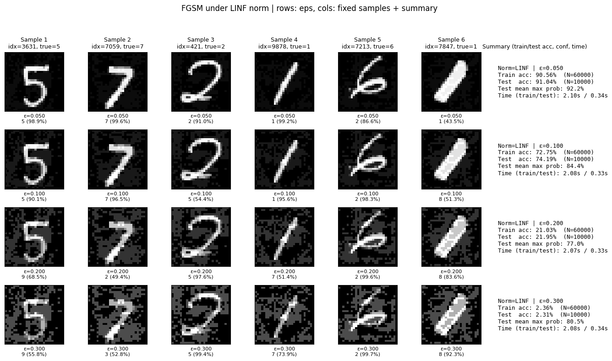
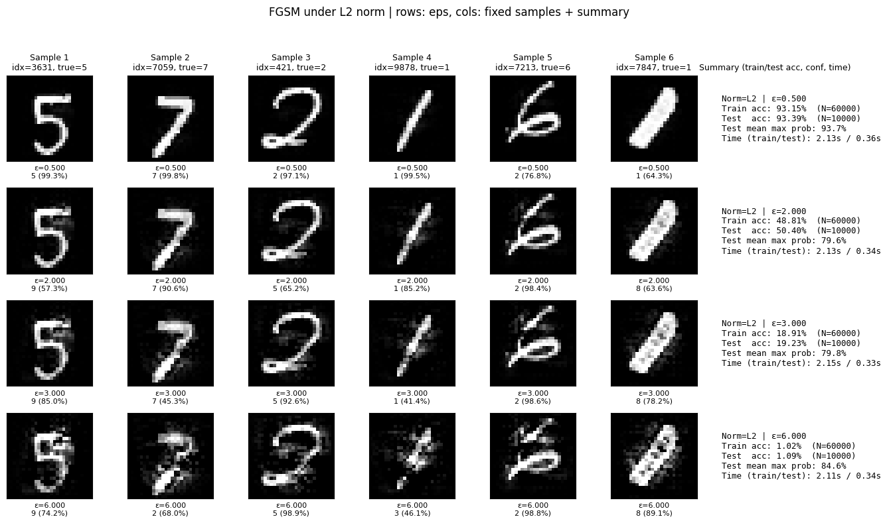
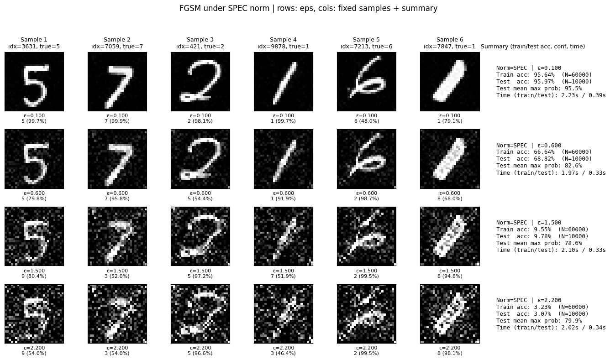
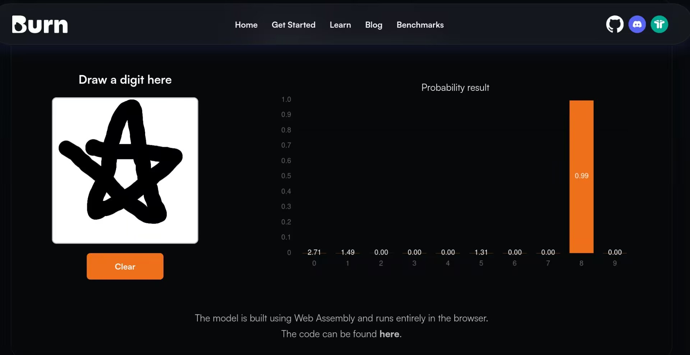

# FGSM 攻击

[文章](https://arxiv.org/abs/1412.6572) 发表在 ICLR 2015，作者是 GAN 的提出者 Ian Goodfellow。

本文的行文思路肯定和原论文不一样，要不然白写了……而且我觉得原论文蛮像那种知乎专栏文章，挺好读的，以前的 ICLR 这么好发吗😱😱😱

## 攻击方式

FGSM 攻击是一种**白盒攻击**，必须拿到模型对输入的梯度，也就是

$$
g_x=\nabla_x \mathcal L(\theta;x)
$$

这里很微妙的一点是，在优化器领域，我们是基于计算

$$
g_\theta=\nabla_\theta \mathcal L(\theta;x)
$$

来实现对参数的快速更新的。这里的“快速”意即利用尽可能少的迭代次数得到尽可能小的损失，即让模型参数 $\theta$ 在固定的输入 $x$ 构建的损失地形上实现快速下降。

FGSM 也是类似，不过此时我们面对一个训练好的（固定的）模型 $\theta$，需要构建 $x$ 来更改输出。此时我们的目标是**利用尽可能少的迭代次数得到尽可能大的损失**。当然迭代法会在后面介绍，FGSM 作为一种古老的攻击方法，是**单步**的。

一个相当朴素的思路是，我们在单步内**直接选取梯度变化最大的那个方向进行上升**，也就是：

$$
\tilde x_{L_2}=x+\epsilon g_x
$$

这里的 $\epsilon$ 可以类比于学习率。

如果对现代优化器理论比较熟悉的话，可能会考虑 Adam 优化器对应的 signSGD，或者是 Muon 的 $\mathrm{msign}(M)=UV^\top$，但它们更多依赖于**更广阔的损失地形视野**，或许在单步下没那么有效？换句话说，我们对梯度其实有三种比较经典的约束形式：

$$
\begin{align*}
    \tilde x_{L_2}&=x+\epsilon g_x/\|g_x\|\\
    \tilde x_{L_\infty}&=x+\epsilon \mathrm{sign}(g_x)\\
    \tilde x_{L_\mathrm{spec}}&=x+\epsilon \mathrm{msign}(g_x)
\end{align*}
$$

这里选择 $L_2$ 范数作为约束只是因为比较“经典”，其实也可以拿着 $L_p$ 范数来说事的。

我个人更倾向于把它们叫做**不同范数约束下的 FGSM 攻击**，尽管 FGSM 全称是 Fast Gradient **Sign** Method……

到底选择哪个范数进行约束，我们放在后面讲。下面一节我们来聊聊这一攻击方式的另外一种看待视角。

## 线性角度

这个视角是原论文的第三节给出来的。由于深层神经网络依赖矩阵乘法，因此考虑矩阵某一列 $w^\top$ 和扰动后的输入 $\tilde x=x+\eta$ 相乘：

$$
w^\top\tilde x=w^\top x+w^\top\eta
$$

那你问我 $\eta$ 取哪个方向可以使得扰动项最大化呢？这不就是高中大家都学过的**柯西不等式**嘛——如果扰动项和 $w$ “平行”的时候能够最大化。

这里的平行要打引号，因为严格意义上说它的意思是要让下面的等号取到：

$$
|\langle u,v\rangle|\le\|u\|\cdot\|v\|
$$

而不同的内积又为空间赋予了不同的范数。

好，我们似乎就可以得到：取矩阵元素乘以 $\epsilon$，然后考虑一下内积约束，就可以了……对吗？

大错特错！谁告诉你，**深度神经网络就是线性的矩阵乘法的**？！

正是引入了非线性，神经网络才具有丰富的拟合能力哦。

事实上，原论文这一段的意思是，**如果神经网络在样本附近近似线性，那么它可以被相当高效地扰动**！

为什么呢？我们来估算一下 $w^\top\eta$。假定 $w\sim\mathcal{N}(0,I_n)$，$\eta=\epsilon w$，那么这个点乘的结果就是 $\epsilon n\mathrm{Var}[w_i]=\epsilon n$，也就是说维度越高，即使保持一个比较小的 $\epsilon$，也可以积累起很大的扰动。

原论文这一节里面是这样说明的：

> If $w$ has $n$ dimensions and the average magnitude of an element of the weight vector is $m$, then the activation will grow by $\epsilon mn$.

这里是拿 $\eta=\mathrm{sign}(w)$ 算的，但是按理说一个降维映射的中间层，其参数大小分布理应近似服从正态分布的，这里取符号函数相当于把这个扰动项全都变成正值，也就是单算大于 0 的部分的均值。因此这里的 "average magnitude" 还不能理解成均值而是绝对值的均值……

这也就导致了基于 ReLU 的浅层神经网络相当容易被攻击，而基于 sigmoid 的神经网络呢？嘿嘿想逃是逃不掉的——为了防止梯度消失，你在训练的时候就要把权重压到 0 附近，这正是 sigmoid 近似线性的地方。

## 范数选择

这一节我们来讨论一下为什么这个方法叫 FGSM 而不是 FGM 或者其他，也就是为什么原作者要选择使用**符号函数**。

这里我在 MNIST 上训练了一个 LeNet 来可视化一下。（原论文还使用了更大规模的数据集如 CIFAR-10 和 ImageNet 等，我这边为了方便就直接在笔记本上面跑咯）

训练的参数是：学习率 5e-4 跑 5 个 epoch，无任何数据增强，训练集准确率 0.9756，测试集准确率 0.9775。

如下，是使用 $L_\infty$ 范数约束的结果：



$L_2$ 范数：



谱范数：



让我们把目光聚焦在最下面一列，可见 $L_2$ 范数主要是对样本边缘添加一坨不可名状的笔触，谱范数引入的扰动几乎侵蚀了整幅图像，而 $L_\infty$ 的效果是最好的，只是引入了大幅度的灰色色块，原始的数字完全可以被人类辨认而模型几乎完全失效。

事实上的确，无穷范数是这几个里面**最适合单步攻击**的。我们怎么在理论上理解呢？原论文没有解释，在这里斗胆给出我的理解：可以看到为了达到相近的攻击效果，$L_2$ 范数和谱范数的 $\epsilon$ 都要开特别大，因为对应的**一小部分的像素**贡献了较大的扰动，但是图像的色阶是有上限的，扰动封顶之后，就只好让其他贡献小的像素强行拉大，最后导致对原图像的破坏相当大；而符号函数可以让所有有贡献的像素都拉平到一个水平，这就意味着我可以让几乎全图的像素都对扰动项进行贡献。

## “对抗样本”和“垃圾样本”

很多网上的博客在前面就结束了，不过原论文的这一部分讨论的附录还是很有启发性的。

缘起是某同学 ~~COS成东风谷早苗~~ 在一个线上的 MNIST 分类器上面画了个星星，结果这个分类器（应该也是 LeNet 之类的）煞有介事地以一个很高的置信度认为这个星星是数字 8。



（早苗请自行想象）

原论文认为神经网络不同于 RBF 网络，它们分别在 P-R 曲线的两端：

- 神经网络，如 LeNet 等，倾向于**高召回，低精确**，这就意味着其面对星星这种完全不同于数字的“垃圾样本”而言，仍然会以一个很高的置信度来试图分类。
- RBF 网络倾向于**低召回，高精确**，也就是更谨慎，可能有些数字没法分类，但是对于非数字的样本，会坚定地给出低置信度的打分。

原论文认为，正是因为神经网络的局部线性，导致了这一倾向，而在“垃圾样本”中精心选择的那些和原输入相差无几的“对抗样本”，成为了威胁其准确率的毒药。

原论文还基于生成的对抗样本的原理对网络训练做了正则化，并表示这比基于 Dropout 的正则化效果更好。

## 附录

可视化使用的代码如下：

<details>

<summary> 代码 </summary>

```python
# -*- coding: utf-8 -*-
import time
import random
import numpy as np
import torch
import torch.nn as nn
import torch.nn.functional as F
from torchvision import datasets, transforms
from torch.utils.data import DataLoader
import matplotlib.pyplot as plt

# ========== Reproducibility ==========
def set_seed(seed=0):
    random.seed(seed)
    np.random.seed(seed)
    torch.manual_seed(seed)

set_seed(0)
device = torch.device("cpu")

# ========== Model: Small LeNet ==========
class LeNet(nn.Module):
    def __init__(self):
        super().__init__()
        self.conv1 = nn.Conv2d(1, 6, 5)     # 28 -> 24
        self.pool = nn.MaxPool2d(2, 2)      # 24 -> 12
        self.conv2 = nn.Conv2d(6, 16, 5)    # 12 -> 8
        # 8 -> 4 after pool
        self.fc1 = nn.Linear(16 * 4 * 4, 120)
        self.fc2 = nn.Linear(120, 84)
        self.fc3 = nn.Linear(84, 10)

    def forward(self, x):
        x = F.relu(self.conv1(x))
        x = self.pool(x)               # 12x12
        x = F.relu(self.conv2(x))
        x = self.pool(x)               # 4x4
        x = torch.flatten(x, 1)        # B x (16*4*4)
        x = F.relu(self.fc1(x))
        x = F.relu(self.fc2(x))
        x = self.fc3(x)                # logits
        return x

# ========== Data ==========
transform = transforms.ToTensor()  # pixels in [0,1]
train_set = datasets.MNIST(root="./data", train=True, download=True, transform=transform)
test_set  = datasets.MNIST(root="./data", train=False, download=True, transform=transform)
train_loader = DataLoader(train_set, batch_size=256, shuffle=True, num_workers=2, pin_memory=False)
test_loader  = DataLoader(test_set,  batch_size=256, shuffle=False, num_workers=2, pin_memory=False)

# ========== Train / Eval ==========
def train(model, loader, epochs=5, lr=5e-4):
    model.train()
    opt = torch.optim.Adam(model.parameters(), lr=lr)
    for ep in range(epochs):
        total, correct, loss_sum = 0, 0, 0.0
        for x, y in loader:
            x, y = x.to(device), y.to(device)
            logits = model(x)
            loss = F.cross_entropy(logits, y)
            opt.zero_grad()
            loss.backward()
            opt.step()
            loss_sum += loss.item() * x.size(0)
            pred = logits.argmax(dim=1)
            correct += (pred == y).sum().item()
            total += x.size(0)
        print(f"Epoch {ep+1}/{epochs} - loss={loss_sum/total:.4f} acc={correct/total:.4f}")

@torch.no_grad()
def eval_clean_acc(model, loader):
    model.eval()
    total, correct = 0, 0
    for x, y in loader:
        x, y = x.to(device), y.to(device)
        logits = model(x)
        pred = logits.argmax(dim=1)
        total += x.size(0)
        correct += (pred == y).sum().item()
    return correct / total

# ========== Gradient + FGSM directions ==========
def grad_wrt_x(model, x, y):
    model.eval()
    x = x.clone().detach().to(device)
    x.requires_grad_(True)
    with torch.enable_grad():  # 确保构建计算图
        logits = model(x)
        loss = F.cross_entropy(logits, y.to(device))
        model.zero_grad(set_to_none=True)
        loss.backward()
        g = x.grad.detach()
    return g, logits.detach()

def dir_linf(g):
    return g.sign()

def dir_l2(g, eps=1e-12):
    g_flat = g.view(g.size(0), -1)
    g_norm = g_flat.norm(p=2, dim=1).view(-1, 1, 1, 1)
    return g / (g_norm + eps)

def dir_spec(g):
    # per-sample SVD on 28x28
    B, C, H, W = g.shape
    assert (C, H, W) == (1, 28, 28), "This demo assumes MNIST 1x28x28"
    d = torch.zeros_like(g)
    for i in range(B):
        Gi = g[i, 0]
        U, S, Vh = torch.linalg.svd(Gi, full_matrices=False)
        d[i, 0] = U @ Vh
    return d

def get_direction(method, g):
    if method == "linf":
        return dir_linf(g)
    elif method == "l2":
        return dir_l2(g)
    elif method == "spec":
        return dir_spec(g)
    else:
        raise ValueError("Unknown method")

# ========== Attack evaluation over a loader for a list of eps ==========
@torch.no_grad()
def eval_attack_grid(model, loader, method, eps_list):
    """
    Returns dict with per-eps: acc, mean_maxprob, mean_trueprob, time_sec
    """
    model.eval()
    eps_list = list(eps_list)
    K = len(eps_list)
    total = 0
    correct = [0 for _ in range(K)]
    sum_maxprob = [0.0 for _ in range(K)]
    sum_trueprob = [0.0 for _ in range(K)]
    times = [0.0 for _ in range(K)]

    for x, y in loader:
        x, y = x.to(device), y.to(device)
        # get gradient once per batch
        torch.set_grad_enabled(True)
        g, _ = grad_wrt_x(model, x, y)
        d = get_direction(method, g)
        torch.set_grad_enabled(False)

        for j, eps in enumerate(eps_list):
            t0 = time.perf_counter()
            x_adv = torch.clamp(x + eps * d, 0.0, 1.0)
            logits = model(x_adv)
            probs = logits.softmax(dim=1)
            pred = probs.argmax(dim=1)

            correct[j] += (pred == y).sum().item()
            sum_maxprob[j] += probs.max(dim=1).values.sum().item()
            sum_trueprob[j] += probs[torch.arange(y.size(0)), y].sum().item()
            times[j] += (time.perf_counter() - t0)

        total += x.size(0)

    out = []
    for j, eps in enumerate(eps_list):
        out.append({
            "eps": float(eps),
            "acc": correct[j] / total,
            "mean_maxprob": sum_maxprob[j] / total,
            "mean_trueprob": sum_trueprob[j] / total,
            "time_sec": times[j],
            "n_total": total
        })
    return out

# ========== Fixed sample picker ==========
@torch.no_grad()
def pick_fixed_samples(model, dataset, k=6, seed=0):
    """
    Pick k correctly-classified test samples with fixed seed; returns indices list.
    """
    set_seed(seed)
    idxs = list(range(len(dataset)))
    random.shuffle(idxs)
    chosen = []
    for idx in idxs:
        x, y = dataset[idx]
        x_in = x.unsqueeze(0).to(device)
        logits = model(x_in)
        pred = logits.argmax(dim=1).item()
        if pred == y:
            chosen.append(idx)
        if len(chosen) >= k:
            break
    return chosen

# ========== Build visualization figure per method ==========
@torch.no_grad()
def visualize_method(
    model, dataset, method, eps_list, fixed_indices,
    train_stats, test_stats, figsize_scale=2.0
):
    """
    Build a big figure:
      rows = len(eps_list)
      cols = len(fixed_indices) + 1 (last col is metrics summary)
    Each cell (sample) shows x_adv at the given eps; last col shows train/test acc, conf, time.
    """
    k = len(fixed_indices)
    R = len(eps_list)
    C = k + 1
    fig_w = max(8, int(figsize_scale * C))
    fig_h = max(4, int(figsize_scale * R))
    fig, axes = plt.subplots(R, C, figsize=(fig_w, fig_h))
    if R == 1:
        axes = np.expand_dims(axes, axis=0)
    if C == 1:
        axes = np.expand_dims(axes, axis=1)

    # Header titles (top row)
    for j, idx in enumerate(fixed_indices):
        x0, y0 = dataset[idx]
        # show clean label in column title
        axes[0, j].set_title(f"Sample {j+1}\nidx={idx}, true={y0}", fontsize=9)

    axes[0, -1].set_title("Summary (train/test acc, conf, time)", fontsize=9)

    # For each eps row
    for r, eps in enumerate(eps_list):
        # Left side: adversarial images for fixed samples
        for c, idx in enumerate(fixed_indices):
            x0, y0 = dataset[idx]
            x = x0.unsqueeze(0).to(device)
            y = torch.tensor([y0], dtype=torch.long).to(device)
            # grad & direction for this single sample
            g, _ = grad_wrt_x(model, x, y)
            d = get_direction(method, g)
            x_adv = torch.clamp(x + eps * d, 0.0, 1.0)
            logits = model(x_adv)
            probs = logits.softmax(dim=1)
            conf, pred = probs.max(dim=1)
            ax = axes[r, c]
            ax.imshow(x_adv[0, 0].cpu(), cmap="gray", vmin=0, vmax=1)
            ax.set_xticks([]); ax.set_yticks([])
            ax.set_xlabel(f"ε={eps:.3f}\n{pred.item()} ({conf.item()*100:.1f}%)", fontsize=8)

        # Rightmost summary cell
        ax_sum = axes[r, -1]
        ax_sum.axis("off")
        tr = train_stats[r]; te = test_stats[r]
        text = (
            f"Norm={method.upper()} | ε={eps:.3f}\n"
            f"Train acc: {tr['acc']*100:.2f}%  (N={tr['n_total']})\n"
            f"Test  acc: {te['acc']*100:.2f}%  (N={te['n_total']})\n"
            f"Test mean max prob: {te['mean_maxprob']*100:.1f}%\n"
            f"Time (train/test): {tr['time_sec']:.2f}s / {te['time_sec']:.2f}s"
        )
        ax_sum.text(0.02, 0.5, text, va="center", ha="left", fontsize=9, family="monospace")

    fig.suptitle(f"FGSM under {method.upper()} norm | rows: eps, cols: fixed samples + summary", fontsize=12)
    fig.tight_layout(rect=[0, 0, 1, 0.95])
    plt.show()

# ========== Main Pipeline ==========
if __name__ == "__main__":
    set_seed(0)
    model = LeNet().to(device)

    print("Training LeNet on MNIST (CPU)...")
    train(model, train_loader, epochs=5, lr=5e-4)

    clean_train_acc = eval_clean_acc(model, train_loader)
    clean_test_acc  = eval_clean_acc(model, test_loader)
    print(f"Clean acc - train={clean_train_acc:.4f}, test={clean_test_acc:.4f}")

    # ---- Define epsilon grids per norm ----
    eps_grid = {
        "linf": [0.05, 0.10, 0.20, 0.30],
        "l2":   [0.50, 2.00, 3.00, 6.00],
        "spec": [0.10, 0.60, 1.50, 2.20],
    }

    # ---- Pick fixed samples (from test set) ----
    fixed_indices = pick_fixed_samples(model, test_set, k=6, seed=0)
    print("Fixed sample indices (test set):", fixed_indices)

    # ---- For each norm: evaluate grid on train/test, then visualize ----
    for method, eps_list in eps_grid.items():
        print(f"\n=== Evaluating {method.upper()} with eps list: {eps_list} ===")
        train_stats = eval_attack_grid(model, train_loader, method, eps_list)
        test_stats  = eval_attack_grid(model, test_loader,  method, eps_list)

        # Console summary
        print("eps | train_acc | test_acc | test_mean_max_prob | time_train(s) | time_test(s)")
        for tr, te in zip(train_stats, test_stats):
            print(f"{te['eps']:.3f} | {tr['acc']*100:8.2f}% | {te['acc']*100:7.2f}% | "
                  f"{te['mean_maxprob']*100:7.2f}% | {tr['time_sec']:.2f} | {te['time_sec']:.2f}")

        # Visualization big figure
        visualize_method(
            model, test_set, method, eps_list, fixed_indices,
            train_stats, test_stats, figsize_scale=2.0
        )
```

</details>
