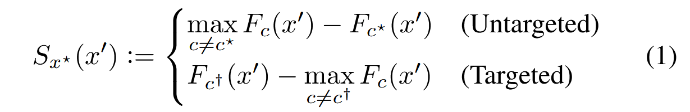
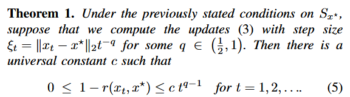
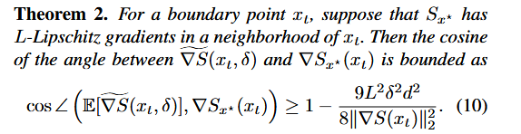
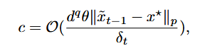
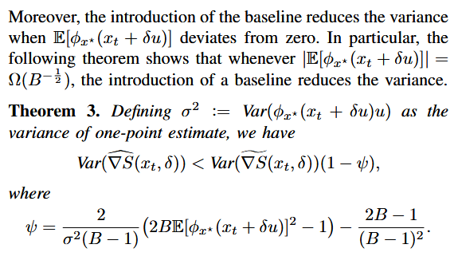

# HSJA 攻击

[文章](https://arxiv.org/pdf/1904.02144) 作者是来自加州大学伯克利分校。

和我们之前做笔记的 FGSM, PGD, C&W 攻击不一样，HSJA 攻击是一种**黑盒攻击**。但其实本质上和白盒攻击区别没有那么大。

回顾我们之前在 C&W 的动机角度聊过的，一次理想的攻击需要追求两个拮抗的目标：使模型出错（分为有目标和无目标攻击）和扰动尽可能小（肉眼难以发觉）。为此我们将这两个指标量化，第一个目标用 $f$ 函数指示，第二个目标使用范数约束。最后**利用模型的梯度信息**进行优化。

现在模型变成黑盒了，拿不到梯度信息了，咋办？

HSJA 提出的方案是：利用先分类结果重构梯度信息，然后再逼近原始图像。

## 二分逼近

首先需要明确的是，如果我们对图像做任何扰动之后，标签没有发生任何改变，这就意味着我们不能从中获取任何（梯度）信息。因此我们首先需要做的是把图像**移动到决策边界**。

假设我们有源图像 $x^*$，目标图像 $x$，其输出符合我们的需要。如果我们要进行有目标攻击，我们大可以把 $x$ 设置为我们需要的类别图像；如果是无目标攻击，我们可以倍增加噪直到获取到一个差异的分类。现在我们要基于这两个样本来找到决策边界。

很自然地，我们会使用二分法。我们定义一个指标函数 $\phi(x_t)$，为 $-1$ 代表分为原类别，为 $1$ 代表分为目标类别。对于 $\alpha\in (0,1)$，定义

$$
x(\alpha)=\alpha x+(1-\alpha)x^*
$$

通过对 $\alpha$ 做二分法（也就是在 $L$ 范数下投影到线段中点），就可以在满足 $L$ 范数精度小于阈值 $\theta$ 内找到刚刚好使得 $\phi$ 改变的 $\hat\alpha$。

我们将这个流程抽象成一个函数，接受 $x,x^*,\theta, L$，分别代表输入图像，目标图像，估计的决策边界宽度（也就是二分阈值）以及约束的范数，最后输出的是 $\hat x=x(\hat\alpha)$，和输入目标样本的分类一致但更靠近决策边界。

## 估计边界梯度

类似于 C&W 攻击，我们需要定义一个基于决策的损失函数，通过最优化这个损失函数，来实现成功的攻击。

对于有目标 $c^\dagger$ 的攻击，我们需要最大化这个类别的 logits 而最小化其他类别的 logits；对于无目标 $c^*$ 的攻击，我们需要最大化其他类别的 logits 而最小化这个类别的 logits。也就是原文的式 (1)：

我们的目的就是在 $S$ 上做梯度上升，而现在的问题是，我们只有样本的分类信息（也就是 $\phi$ 就是 $S$ 的符号函数），我们需要基于此估计梯度信息。

现在，基于二分法，我们有了一个在边界的样本 $\hat x$，我们可以在上面进行扰动，为此，我们首先生成一个在单位球上均匀分布的样本集合（可以通过正态分布投影到超球面，也可以通过基于拒绝采样的 Marsaglia 算法）得到 $u_0, \dots, u_B$，然后我们进行扰动，也就是计算

$$
S_i = \phi(x+\delta u_i)=-1\mathrm{\ or\ } 1
$$

下面我们要基于此来估计梯度了。首先计算 $S_i$ 的均值

$$
\bar S=\dfrac{1}{B}\sum_{i=1}^B S_i
$$

这表征此样本的一个基线估计，然后我们计算估计的梯度：

$$
\hat g=\dfrac{1}{B-1}\sum_{i=1}^B(S_i-\bar{S})u_i
$$

这里的 $B-1$ 就是利用的无偏估计，虽然我觉得用处不大，因为我们马上就要归一化：

$$
v=\mathrm{normalized}_L(\hat g)
$$

## 迭代求解

现在，我们已经在决策边界处获得了一个候选点 $\hat x$ 以及该点的估计梯度方向 $v$，下面我们要根据这些信息进行进一步的迭代求解。

和 PGD 等其他基于梯度的方法类似，我们也进行投影梯度下降，不过这里的梯度是我们估计的梯度 $v$。因此现在选择一个参数 $\xi$ 计算

$$
\tilde{x}=\hat x+\xi v
$$

但是有可能用力过猛飞出目标样本的决策边界了……因此我们要折半 $\xi$ 使得其保留在原有的边界内。

这个 $\tilde x$ 就是相对原始的目标样本 $x$ 更优的目标了（因为我们沿着梯度的方向走了一步），因此，我们持续进行迭代，直到达到最大的次数限制或者已经收敛而不再变化。

最后，为了我们可以再进行一次二分搜索，使得输出 $\hat x$ 在决策边界上，而更靠近原始样本 $x^*$。

其实这个有点类似于 EM 算法这种交替的流程，或者类似于 GAN 的训练。首先通过二分找到靠近决策边界的对抗样本来减少扰动，然后估计梯度来优化对抗样本的分类置信度，如此交替进行。

## 参数设置与收敛性分析

刚刚对算法只是模糊地提点了一下，下面我们来详细讨论一下刚刚算法里面提到的一堆参数的设置，这决定了算法的收敛性。

首先，作者针对基于梯度的一般迭代过程给出了定理一：

这里 $\xi_t$ 就是往梯度方向移动的步长，离目标越近，时间越久，步长越小，因此用图中的式子进行建模，最后可以得到源图像和对抗样本的余弦相似度可以被 bound 进这个范围内，为了尽可能使得余弦相似度快速收敛，选择 $q=\dfrac 12$。于是就有了：

$$
\xi_t = \dfrac{\|x_t-x^*\|_p}{\sqrt t}
$$

紧接着，作者又约束了估计梯度和真实梯度的相似性，通过这个夹角余弦值衡量：

由此，作者要推导 $\delta$ 和 $\theta$ 的变化式，我们先来感性理解一下，$\delta$ 是扰动的探测步长，当我们很接近源图像时，应该更精细地估计梯度，也就是同样带一个 $\|x_t-x^*\|_p$ 来做保证收敛。

事实上，作者考虑了 $S_{x^*}(x_t+\delta_t u)$ 在 $x_t$ 处的泰勒展开，只对一阶项里面，分为原类别的球冠做分析，最后得到落入球冠的概率和 $c$ 有关，并得到了 $c$ 的估计：

为了让近似误差和维度无关，这个概率要控制在 $\mathcal O(1)$ 的级别，结合上定理 2 出现的 $(\delta d)^2$，作者选择

$$
\theta=d^{-q-1},\quad \delta_t=d^{-1}\|x_t-x^*\|_p
$$

最后，基于定理 3，可以得到梯度估计的方差大概是 $\mathcal{O}(B^{-2})$，因此作者选择 $B_t=B_0\sqrt t$，能够使得方差以 $t^{-1}$ 的阶下降。

## 执行流程

基本上要点都理清楚了，下面让 LLM 整理一下流程吧：

### 初始化

- **无目标攻击**：从原始样本 $x^*$ 开始，通过添加均匀随机噪声生成初始样本 $x_0$ ，使得 $\phi_{x^*}(x_0) = 1$ （即模型误分类）。
- **有目标攻击**：从测试集中随机选择一个属于目标类别的样本作为初始点 $x_0$ ，使得 $\phi_{x^*}(x_0) = 1$ 。
- 设置初始批量大小 $B = 100$ ，并随迭代次数 $t$ 以 $\sqrt{t}$ 速率增加，以降低方差。

### 迭代过程（对于每个迭代 $t = 0, 1, 2, \ldots$ ）

直到达到最大查询次数 $T$ 或收敛，执行以下步骤：

#### **步骤A: 边界搜索（Binary Search）**

- 目的：将当前点 $x_t$ 精确地投影到决策边界上，确保 $\phi_{x^*}(x_t) = 1$ 。
- 使用**算法1（Bin-Search）**：
  - 输入：当前点 $x_t$ 和原始点 $x^*$ ，其中 $\phi_{x^*}(x_t) = 1$ ， $\phi_{x^*}(x^*) = -1$。
  - 过程：
    - 设置 $\alpha_l = 0$ ， $\alpha_u = 1$ 。
    - 当 $|\alpha_u - \alpha_l| > \theta$ （阈值设为 $\theta = d^{-q-1}$ ，其中 $q = 1 - 1/p$ ）时：
      - 计算中点 $\alpha_m = (\alpha_l + \alpha_u)/2$ 。
      - 计算投影点 $x_m = \Pi_{x^*, \alpha_m}(x_t)$ （根据距离度量选择投影方式）。
      - 如果 $\phi_{x^*}(x_m) = 1$ ，则更新 $\alpha_u = \alpha_m$ ；否则更新 $\alpha_l = \alpha_m$ 。
    - 输出投影点 $x_t' = \Pi_{x^*, \alpha_u}(x_t)$ ，作为新的边界点。

#### **步骤B: 梯度方向估计**

- 目的：在边界点 $x_t$ 处估计梯度方向 $\nabla S_{x^*}(x_t)$ 。
- 使用蒙特卡洛估计：
  - 生成 $B$ 个随机向量 $\{u_b\}_{b=1}^B$ ，服从单位球面上的均匀分布。
  - 计算梯度估计：
    
    $$
    \widehat{\nabla S}(x_t, \delta_t) = \frac{1}{B-1} \sum_{b=1}^{B} \left( \phi_{x^*}(x_t + \delta_t u_b) - \overline{\phi_{x^*}} \right) u_b
    $$

    其中， $\overline{\phi_{x^*}} = \frac{1}{B} \sum_{b=1}^{B} \phi_{x^*}(x_t + \delta_t u_b)$ 是基线，用于减少方差。
  - 扰动大小 $\delta_t$ 的选择：
    
    $$
    \delta_t = d^{-1} \| \tilde{x}_{t-1} - x^* \|_p
    $$

    其中 $d$ 是输入维度， $p$ 是距离范数。

#### **步骤C: 步长搜索（Geometric Progression）**

- 目的：确定沿梯度方向的步长，使得更新后的样本仍处于目标侧。
- 计算更新方向：
  - 对于ℓ₂攻击： $v_t = \widehat{\nabla S}(x_t, \delta_t) / \| \widehat{\nabla S}(x_t, \delta_t) \|_2$
  - 对于ℓ∞攻击： $v_t = \text{sign}(\widehat{\nabla S}(x_t, \delta_t))$
- 初始步长： $\xi_t = \| x_t - x^* \|_p / \sqrt{t}$ （基于Theorem 1的理论建议）。
- 通过几何级数调整步长：
  - 计算候选点： $\tilde{x}_t = x_t + \xi_t v_t$ 
  - 如果 $\phi_{x^*}(\tilde{x}_t) = -1$ ，则将步长减半（ $\xi_t \leftarrow \xi_t / 2$ ），重复直到 $\phi_{x^*}(\tilde{x}_t) = 1$ 。

#### **步骤D: 投影回边界**

- 目的：将更新后的点 $\tilde{x}_t$ 投影回决策边界，得到下一迭代点 $x_{t+1}$ 。
- 使用**算法1（Bin-Search）**，输入为 $\tilde{x}_t$ 和 $x^*$ ，输出投影点 $x_{t+1}$ 。
- 投影方式取决于距离度量：
  - ℓ₂投影： $\Pi_{x^*, \alpha_t}^2(\tilde{x}_t) = \alpha_t x^* + (1 - \alpha_t) \tilde{x}_t$
  - ℓ∞投影：对每个像素裁剪到区间 $[x_i^* - c, x_i^* + c]$ ，其中 $c = \alpha_t \| \tilde{x}_t - x^* \|_\infty$