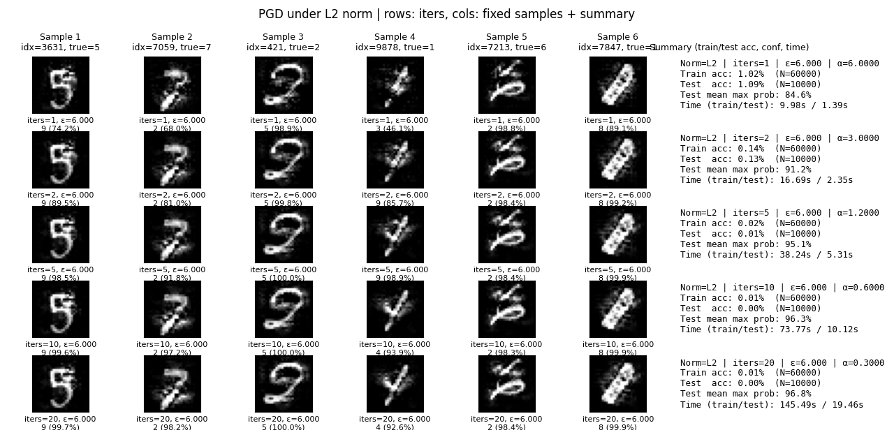

# PGD 攻击

[文章](https://arxiv.org/abs/1706.06083) 发表在 ICLR 2018。作者单位都是 MIT。

上次写 FGSM 的笔记的时候就发现，其实市面上的大部分博客这些二手知识**无法得到广泛的同行评议**（一些知名的博客如算法竞赛选手的或者领域内专家的除外，但初级学习者的博客情况就尤为严重），因此其正确性难以保证。

因此本文力求从原论文入手开始阅读并进行相关笔记，写好之后也丢给 GPT-5-high 进行初步审读。当然，更欢迎列位人类看官批评指正。

## 迭代攻击

在上一篇 FGSM 的笔记中，我们得到攻击的**单步扰动**方式：

$$
\begin{align*}
    \tilde x_{L_2}&=x+\epsilon g_x/\|g_x\|\\
    \tilde x_{L_\infty}&=x+\epsilon \mathrm{sign}(g_x)\\
    \tilde x_{L_\mathrm{spec}}&=x+\epsilon \mathrm{msign}(g_x)
\end{align*}
$$

并且，FGSM 方法选择无穷范数作为最后使用的范数。受到优化器理论的启发，我们可以对此进行迭代：

$$
x_{t+1}=\mathrm{Clip}_{x\in\mathcal{S}}(x_t+\alpha \mathrm{normalized}_L(g_x) )
$$

为了对标 FGSM 的扰动 $\epsilon$，假设迭代步数 $T$ 则总扰动 $\alpha T=\epsilon$。

这里引入了裁切，一方面就如同之前提到的，图像具有一个最大的灰阶，不能超过；另一方面是，我们不能让扰动过大，而是尽可能构造那种“看起来差不多”但却可以对输出造成很大干扰的样本，因此我们需要把诸 $x$ 约束在一个可行域 $\mathcal{S}$ 里面，而最简单的约束方式就是直接对数值裁剪到符合条件。

为了统一说明，这里使用 $\mathrm{normalized}_L(g_x)$ 来表征样本梯度在 $L$ 范数下的归一化向量，具体的计算方式如前。这就是 $L$ 范数意义下的**投影梯度下降**（projected gradient descent, PGD）。这样看是不是很像 SGD 呢？——那我们其实还可以接着套优化器理论，SGD 引入了动量，那 PGD 也可以引入动量，OK 于是你发明了 [MI-FGSM](https://arxiv.org/abs/1710.06081) 然后中了 CVPR 2018，然后你还可以引入 Nesterov 加速梯度，并美美水一篇[文章](https://arxiv.org/abs/2105.05029)放在 arXiv 上面……

## 理论框架

PGD 这篇文章的着眼点并不完全是提出 PGD 这个方法而是提供一个攻防的整体框架。虽然我觉得这个框架就是抄的 GAN 的损失函数……不过让我们先来看看吧。

作者给出的框架分成两部分，第一部分是作为攻击者，我们考虑一个可行的扰动集合 $\delta\in\mathcal{S}$，需要最大化损失也就是

$$
\max_{\delta\in\mathcal{S}}\mathcal{L}(\theta;x+\delta,y)
$$

第二部分是作为防御方，需要针对攻击做出防御，也就是对于正确的分类样本-标签对分布 $(x,y)\sim\mathcal{D}$ 要最小化攻击效果：

$$
\min_{\theta}\mathbb{E}_{(x,y)\sim\mathcal{D}}[\max_{\delta\in\mathcal{S}}\mathcal{L}(\theta;x+\delta,y)]
$$

然后整个攻防过程就抽象成了这么一个鞍点上的 min-max 博弈。

就 PGD 而言，我们可以将其视作损失地形下的梯度提升。就足够小的 $\epsilon$ 和足够多的迭代步数而言，其正如 SGD 一般能得到一个足够高的损失高地。也就是说 PGD 是利用一阶梯度信息的**很强的攻击方法**。

由于刚刚那个攻防过程的外层就是一般的风险最小化式子，可以通过一般的优化器进行训练。而内层可以利用 PGD 得到最有效的梯度上升。因此文章得出利用 PGD 进行对抗训练，可以实现较好的防御效果。关于这一部分的理论论证，作者利用了丹斯金定理在附录 A 进行了证明。

此外文章还花篇幅讨论了网络容量和对抗训练的关系。由于对抗样本实质上是试图在真实样本附近添加扰动而预期跨过决策边界。因此对抗训练会使得决策边界相当复杂，需要网络具有更强大的拟合能力。

## 效果

当我们控制总的更新量不变时，控制更精细的迭代量会使得在肉眼区别不大的情况下得到更好的攻击效果，这就是多步迭代的威力。比如无穷范数约束下的 PGD 从迭代 0 步到20步，只是灰色色块边缘稍有模糊。

## 关于谱范数的一些注解：算法和动机

眼尖的读者可能会注意到，这里的谱范数的攻击图像和之前 FGSM 的攻击图像有些不大一样。

这是因为 GPU 相对较难并行地对矩阵做 SVD，这就导致吞吐率很低。在 GAN 的训练中使用的谱归一化采用幂迭代的方式进行计算，但这对于每个 Batch 都有很大变化的输入而言也是相对低效的。

因此我们采用在 Muon 优化器里面已经验证过的方式，即使用 Newton-Schulz 迭代高效近似 $UV^\top$。它只需迭代几次 $MM^\top$ 的计算即可快速进行谱归一化，时间复杂度尽管仍然是 $O(n^3)$ 但是这个过程只依赖矩阵乘法、数乘与加和，相当适用于 GPU 计算，常数小的同时有着相当高的吞吐率。

具体而言，跑全量数据的对抗样本生成，谱范数约束迭代 20 次，在 P100 GPU 上这个方法耗时是训练集 20.72s 以及测试集 3.52s，而在 Intel i5 1135G7 CPU 上的耗时如上图。有理由相信基于 CPU 的 SVD 方法将更慢。

关于具体的理论推导和代码实现以及相关参数的求解，请参考“优化器”类别中的“符号梯度下降”一文。

最后尚未提及的一点是对于张量，其梯度的“谱范数”是未定义的。具体怎么把张量变成矩阵就见仁见智了，比如可以按通道分别抽取最后两个维度，等等。

我在这一系列里面固执地引入谱范数约束的梯度上升攻击，恰恰是想发掘一些有意思的点——可以看到谱范数在大规模神经网络参数优化问题下表现极佳，具有相当强悍的收敛速率。但是到了**对抗样本生成领域**就表现得相当拉了。一开始我是觉得，神经网络的优化问题是简单的梯度下降而对抗样本生成是简单的梯度上升，只不过一个针对网络参数，一个针对样本输入罢了。

而正是这一点点的区别造就了很大的不一样。我们面对一个图片或者说基于原有样本生成的对抗样本，其语义信息应当是基本上完整保留的，这就决定了我们的扰动要么是**难以察觉的**，要么是**误导人眼**的——本质上这是一个对对抗样本生成的一个**相当强的正则化约束**！

由此才决定了为何我们在梯度上升对抗样本生成中，无穷范数的效果是“看起来”最好的。
