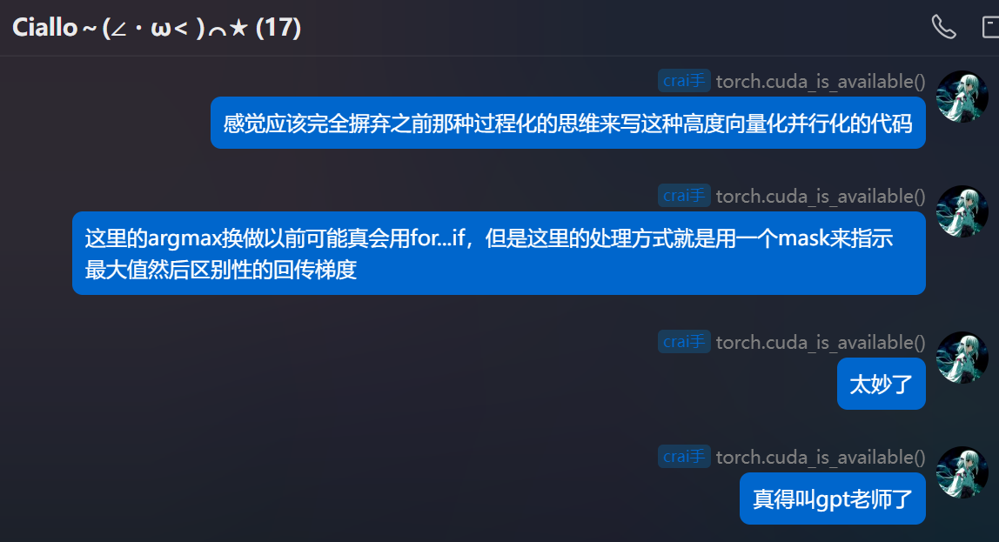
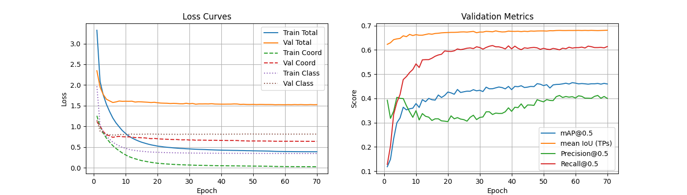
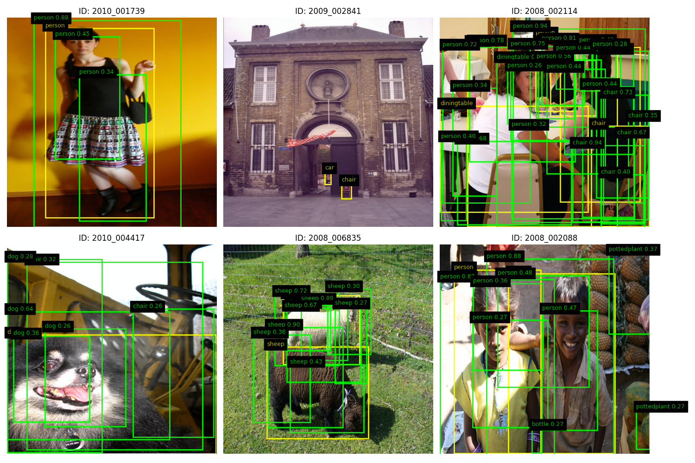

# 图像语义分割和目标检测相关模型复现手记

## 语义分割

语义分割的难点在于输出到和原图**分辨率一致**的特征图。因此不管是 FCN, U-Net 还是 Deeplab 等网络，关键点主要在于**下采样和上采样的信息流动**。一方面，我们需要利用下采样来获取特征图进行分割分类，这要求下采样过程能够高效提取信息；另一方面，我们还需要对下采样之后的结果进行解码，这又要求下采样不能丢弃太多信息，同时还需要引入编码器的中间结果来提供额外的信息。为此便有了跳跃连接、空洞卷积等核心操作。

虽然都是某种意义上的“生成模型”，这一部分的模型就没有 VAE 等模型那样强的数学，而是偏重于工程实现。

本文对语义分割主要介绍 FCN、U-Net、Deeplab 和 Segment Anything Model(SAM) 等。SAM 由于其规模，对数据集生成和预训练的算力要求巨大，因此只做论文阅读而不做复现。

### FCN

#### 架构

（其实我本来想直接上 U-Net 的，因为我一开始读 FCN 文章的时候就对这个架构有两个疑点，结果发现 U-Net 都能解决……）

本文主要复现的是 FCN-8s。它的前半截编码器部分是 VGG-16，于是我们又可以快乐地使用 ImageNet 预训练权重了。先回顾一下 VGG-16 的结构：

```mermaid
%%{init: {'theme': 'dark', 'themeVariables': { 'darkMode': true, 'primaryColor': '#1e1e2e', 'edgeLabelBackground':'#313244', 'tertiaryColor': '#181825'}}}%%
graph LR
    %% Styling definitions
    classDef box fill:#313244,stroke:#cdd6f4,stroke-width:2px,color:#cdd6f4,radius:8px;
    classDef input fill:#585b70,stroke:#89b4fa,stroke-width:2px,color:#cdd6f4;
    classDef output fill:#313244,stroke:#f38ba8,stroke-width:2px,color:#cdd6f4;
    classDef result fill:#45475a,stroke:#a6e3a1,stroke-width:2px,color:#cdd6f4;
    classDef conv fill:#313244,stroke:#74c7ec,stroke-width:2px,color:#cdd6f4;

    %% Input Layer
    subgraph Input["Input"]
        A[("3 @ 224×224")]
    end
    class Input input;

    %% Initial Convolution
    subgraph InitConv["Convolution Block 1"]
        B["Conv2d <br> 3x64 x 3×3"] 
        C["Conv2d <br> 64x64 x 3×3"] 
        D["Maxpool 1<br>stride = 2"]
    end
    A --> B
    B --> C --> D
    class InitConv conv;

    %% Layer 1 (2× BasicBlock without downsample)
    subgraph Layer1["Convolution Block 2"]
        F["Conv2d <br> 64x128 x 3×3"] 
        GG["Conv2d <br> 128x128 x 3×3"] 
        G["Maxpool 2<br>stride = 2"]
    end
    D --> |64 @ 112×112| F
    F --> GG --> G
    class Layer1 conv;

    %% Layer 2 (2× BasicBlock with downsample in first block)
    subgraph Layer2["Convolution Block 3"]
        H["Conv2d <br> 128x256 x 3×3"]
        I["Conv2d <br> 256x256 x 3×3"]
        J["Maxpool 3<br>stride = 2"]
    end
    G --> |128 @ 56×56| H
    H --> I --> J
    class Layer2 conv;

    %% Layer 3 (2× BasicBlock with downsample in first block)
    subgraph Layer3["Convolution Block 4"]
        K["Conv2d <br> 256x512 x 3×3"]
        L["Conv2d <br> 512x512 x 3×3"]
        M["Maxpool 4<br>stride = 2"]
    end
    J --> |256 @ 28×28| K
    K --> L --> M
    class Layer3 conv;

    %% Layer 4 (2× BasicBlock with downsample in first block)
    subgraph Layer4["Convolution Block 5"]
        N["Conv2d <br> 512x512 x 3×3"]
        O["Conv2d <br> 512x512 x 3×3"]
        P["Maxpool 5<br>stride = 2"]
    end
    M --> |512 @ 14×14| N
    N --> O --> P
    class Layer4 conv;

    %% Global Pooling and FC
    subgraph PoolFC["GAP & Classfiaction"]
        Q["Flatten <br> or GAP"]
        S["Linear Layers"]
    end
    P --> |512 @ 7x7| Q --> S
    class PoolFC box;

    %% Output Layer
    subgraph Output["output"]
        T[("1000")]
    end
    S --> T
    class Output output;

    %% Styling
    style A stroke-dasharray: 5 5
    style T stroke:#a6e3a1,stroke-width:3px
```



这里我们取到 `Maxpool 5` 之前的地方就够了，这样 VGG-16 的输出就是一张 `512@7x7` 的低分辨率特征图。然后 FCN 在这里就出现了几个变体（或者说一个演进的过程）：

首先考虑把这个特征图直接上采样到 224x224，我们肯定不能直接用什么线性插值、立方插值、Lanczos 插值等算法，因为它只是插值而不引入新信息。这就要祭出我们在 DC-GAN 以及 SRCNN 等生成式模型里面见到的 `ConvTranspose2d` 了。之前在分类模型下面没有细讲，这里简要介绍一下：`ConvTranspose2d` 的原理是在原有像素的四周均匀插 0 得到和目标大小一致的大图，然后再在这个大图上面做正常卷积。

于是我们通过步长为 32 的转置卷积一次性将 `512@7x7` 的特征图上采样到 `n@224x224`，得到我们的目标图像。这便是 FCN-32s。这里的 32 就是转置卷积的步长，s 就是 stride 的意思。

很显然，这个 `512@7x7` 的特征图剩下的信息相比于原图已经很少了，而我们的目标是要实现**像素级**的分割，为此，FCN 提出了跳跃连接的概念：既然编码器像一个“漏斗”一样去压榨特征，那么我取压榨之前具有更丰富信息的特征图，和我后面转置卷积上采样得到的特征图一融合，不就行了嘛。这便是 FCN 提出的跳跃连接思想。（其实和 ResNet 的残差连接有点像）

这样，我们就不一次性暴力恢复，而是先利用步长为 2 的转置卷积将 `512@7x7` 的特征图上采样到 `n@14x14`，其中 n 是类别数，也就是和 `Maxpool 4` 的输出尺寸一致。这样，前一个阶段的信息经过一个 1x1 卷积合并通道之后，就可以直接融合了。而这引发了我对于 FCN 架构的第一个疑点——FCN 的论文说是将两个特征图**相加**。但是我认为在通道维直接**拼接**，可能效果更好，因为对于特征图相加之后进行的卷积操作 C1 而言，我们总能设计一个卷积核使得拼接特征图再进行卷积操作 C2 的输出和相加后进行 C1 的输出完全一样，这意味着拼接再卷积作为一个张量到张量的映射集合，其“维度”是大于相加再卷积的，因而有能力承载更多的特征。不过，我们先按照原论文来，进行相加操作，得到 `n@14x14` 的特征图。最后，我们实施一次步长为 16 的转置卷积，上采样到 `n@224x224`，由于这一步步长为 16，所以叫 FCN-16s。

这样，FCN-8s 的意思就很简单了。我们对 `n@14x14` 的特征图进行一次步长为 2 的转置卷积，再同 `Maxpool 3` 的输出特征图相加得到 `n@28x28` 的特征图，再实施一次步长为 8 的转置卷积，上采样到 `n@224x224` 即可。

FCN 的论文只做到 8s，为什么不接着往后面做呢？这就是我的第二个疑点。如果逐层应用跳跃连接，也就是 `n@28x28` 到 `n@56x56` 到 `n@112x112` 再到 `n@224x224`，每一步都以**拼接**的方式实现跳跃连接，那么我们几乎就发明了 U-Net。

下面是 FCN-8s 的架构：

```mermaid
%%{init: {'theme': 'dark', 'themeVariables': { 'darkMode': true, 'primaryColor': '#1e1e2e', 'edgeLabelBackground':'#313244', 'tertiaryColor': '#181825'}}}%%
graph LR
    %% Styling definitions
    classDef box fill:#313244,stroke:#cdd6f4,stroke-width:2px,color:#cdd6f4,radius:8px;
    classDef input fill:#585b70,stroke:#89b4fa,stroke-width:2px,color:#cdd6f4;
    classDef output fill:#313244,stroke:#f38ba8,stroke-width:2px,color:#cdd6f4;
    classDef result fill:#45475a,stroke:#a6e3a1,stroke-width:2px,color:#cdd6f4;
    classDef conv fill:#313244,stroke:#74c7ec,stroke-width:2px,color:#cdd6f4;
    classDef skip fill:#313244,stroke:#cba6f7,stroke-width:2px,color:#cdd6f4;
    classDef upsample fill:#313244,stroke:#f5c2e7,stroke-width:2px,color:#cdd6f4;

    %% Input Layer
    subgraph Input["Input"]
        A[("3 @ 224×224")]
    end
    class Input input;

    %% VGG-16 Backbone (until pool5)
    subgraph Backbone["VGG-16 Backbone"]
        %% Block 1
        subgraph Block1["Block 1"]
            B["Conv 3x64<br>3×3"]
            C["Conv 64x64<br>3×3"]
            D["MaxPool<br>2×2 stride=2"]
        end
        
        %% Block 2
        subgraph Block2["Block 2"]
            E["Conv 64x128<br>3×3"]
            F["Conv 128x128<br>3×3"]
            G["MaxPool<br>2×2 stride=2"]
        end
        
        %% Block 3
        subgraph Block3["Block 3"]
            H["Conv 128x256<br>3×3"]
            I["Conv 256x256<br>3×3"]
            J["Conv 256x256<br>3×3"]
            K["MaxPool<br>2×2 stride=2<br>(pool3)"]
        end
        
        %% Block 4
        subgraph Block4["Block 4"]
            L["Conv 256x512<br>3×3"]
            M["Conv 512x512<br>3×3"]
            N["Conv 512x512<br>3×3"]
            O["MaxPool<br>2×2 stride=2<br>(pool4)"]
        end
        
        %% Block 5
        subgraph Block5["Block 5"]
            P["Conv 512x512<br>3×3"]
            Q["Conv 512x512<br>3×3"]
            R["Conv 512x512<br>3×3"]
            S["MaxPool<br>2×2 stride=2<br>(pool5)"]
        end
    end
    
    A --> B
    B --> C --> D
    D --> E
    E --> F --> G
    G --> H
    H --> I --> J --> K
    K --> L
    L --> M --> N --> O
    O --> P
    P --> Q --> R --> S
    
    class Backbone conv;
    class Block1,Block2,Block3,Block4,Block5 box;

    %% FCN-8s Specific Layers
    subgraph FCN["FCN-8s Head"]
        %% 1x1 Convs to reduce channels to num_classes
        T["1×1 Conv<br>512→n"]
        U["1×1 Conv<br>512→n"]
        V["1×1 Conv<br>256→n"]
        
        %% 2x Upsampling
        W["2x Upsample<br>transposed conv"]
        X["2x Upsample<br>transposed conv"]
        
        %% Skip connections and addition
        Y["Add<br>pool4 + 2x(pool5)"]
        Z["Add<br>pool3 + 2x(combined)"]
        
        %% Final 8x Upsampling
        AA["8x Upsample<br>transposed conv"]
    end
    
    S --> T
    O --> U
    K --> V
    T --> W
    W --> Y
    U --> Y
    Y --> X
    X --> Z
    V --> Z
    Z --> AA
    
    class FCN skip;
    class T,U,V conv;
    class W,X,AA upsample;
    class Y,Z result;

    %% Output Layer
    subgraph Output["Output"]
        AB[("n @ 224×224<br>(Segmentation Mask)")]
    end
    AA --> AB
    class Output output;

    %% Styling
    style A stroke-dasharray: 5 5
    style AB stroke:#a6e3a1,stroke-width:3px
    
    %% Skip connection annotations
    linkStyle 15 stroke:#cba6f7,stroke-width:2px,stroke-dasharray: 5 5;
    linkStyle 16 stroke:#cba6f7,stroke-width:2px,stroke-dasharray: 5 5;
```



#### 指标

先前的图像分类任务里面，我们基本上没有去衡量除了准确率和损失之外的其他指标，但是语义分割和目标检测这一块，我们就不仅要关注类别对不对，更要关注分割/检测是否到位。

让我们来回顾一下概率论课程中的参数推断，里面提到两种错误：**拒真**和**取伪**（或者叫假阳假阴或者第一类错误第二类错误什么的），如果我们把这两种错误的频数和两种正确的频数放到一起，就得到了**混淆矩阵**：

||预测为真|预测为假|总和|
|:-:|:-:|:-:|:-:|
|实际为真|真阳性 TP|假阴性 FN|真样本数 T|
|实际为假|假阳性 FP|真阴性 TN|假样本数 F|
|总和|阳性数 P|阴性数 N|总数 S|

那么我们就可以以此来评估模型性能了：

$$
\begin{align*}
    \mathrm{Acc.}&=\frac{\mathrm{TP}+\mathrm{FN}}{\mathrm{S}}\\
    \mathrm{Prec.}&=\frac{\mathrm{TP}}{\mathrm{P}}=1-\frac{\mathrm{FP}}{\mathrm{P}}\\
    \mathrm{Recall}&=\frac{\mathrm{TP}}{\mathrm{TP}+\mathrm{FN}}
\end{align*}
$$

第一个是**准确率**即预测正确占总数的比例。第二个是**精准率**，越高说明假阴性/假阳性的占比越低。最后一个是**召回率**，可以理解成在预测正确的情况下，模型有多大意愿给出阴性/阳性结果。在语义分割的语境下，我们在单张图片的像素意义上计算这些指标，也就是说我们可以得到像素准确率 PA。


如图，假设黑圈是 ground truth 而白圈是 prediction，那么以上三个率就能可视化了。

如果做的是像 Pascal VOC 这样的多类别语义分割，我们给每个类别都计算 PA，然后求平均，就得到一个总的计算准确率的指标：平均类别像素准确率 mPA。

另一方面，我们其实希望白圈和黑圈尽可能重合，其实就是**相交得更多，不属于相交的部分更少**。为此，我们可以引入一个指标来衡量：交并比 IoU，也就是 II 区域的面积除以 I、II 和 III 区域的面积之和。

$$
\mathrm{IoU}=\dfrac{\mathrm{TP}}{\mathrm{T}+\mathrm{P}-\mathrm{TP}}
$$

同样的，我们可以计算类别平均交并比 mIoU。

下面的代码就实现了基于混淆矩阵计算 PA 和 mIoU。

```python
def compute_metrics(hist):
    pixel_accuracy = np.diag(hist).sum() / hist.sum() # 对角线元素都是预测正确的
    iou = np.diag(hist) / (hist.sum(axis=1) + hist.sum(axis=0) - np.diag(hist))
    # 忽略NaN值（例如某个类别在验证集中从未出现过）
    miou = np.nanmean(iou)
    return pixel_accuracy, miou
```

FCN 的损失函数当简单：其实我们等于是**对一个和原图尺寸一致的像素阵列做独立的分类**，那么和分类任务一样，**直接沿用交叉熵损失即可**！

#### 实现细节

这里的细节主要是来讲 FCN-8s 这个类的具体实现。

```python
class FCN8s(nn.Module):
    def __init__(self, num_classes):
        super(FCN8s, self).__init__()
        # 预训练 VGG16
        vgg = vgg16(weights=VGG16_Weights.IMAGENET1K_V1)
        features = vgg.features
        
        # 提取不同阶段的特征图
        # 在 PyTorch 的实现中，VGG 的连续卷积-池化操作是保存在 vgg.features 这个 list 里面
        # [64, 64, 'M', 128, 128, 'M', 256, 256, 256, 'M', 512, 512, 512, 'M', 512, 512, 512, 'M'] 其中 M 就是 Maxpool
        # 由于这个 list 被封印进 nn.Sequnential 里面，所以可以直接调用，输出就是特征图
        self.pool3_features = features[:17]   # 到 pool3
        self.pool4_features = features[17:24] # 到 pool4
        self.pool5_features = features[24:]   # 到 pool5
        
        # 全连接层改为卷积层（FCN）
        # VGG 的第一个 Linear: 512@7x7 -> 4096@7x7
        # 当然这里为了适应任意宽度的输出，可以使用 GAP
        # 不过我们可以利用上 VGG 的预训练权重，比起重新训效果肯定更好
        self.fc6 = nn.Conv2d(512, 4096, kernel_size=7, padding=3)
        self.relu6 = nn.ReLU(inplace=True)
        self.drop6 = nn.Dropout2d()
        
        # VGG 的第二个 Linear: 4096@7x7 -> 4096@7x7
        # 仍然是拷贝权重然后 reshape 到卷积核
        self.fc7 = nn.Conv2d(4096, 4096, kernel_size=1)
        self.relu7 = nn.ReLU(inplace=True)
        self.drop7 = nn.Dropout2d()
        
        # 仍然是靠 1x1 卷积负责得到一个 num_classes@7x7 的分类得分
        self.score_fr = nn.Conv2d(4096, num_classes, kernel_size=1)
        
        # 通过 1x1 卷积得到 num_classes@HxW 的特征图用于跳跃连接
        self.score_pool3 = nn.Conv2d(256, num_classes, kernel_size=1)
        self.score_pool4 = nn.Conv2d(512, num_classes, kernel_size=1)
        
        # 上采样层
        self.upscore2 = nn.ConvTranspose2d(num_classes, num_classes, kernel_size=4, stride=2, padding=1, bias=False)
        self.upscore_pool4 = nn.ConvTranspose2d(num_classes, num_classes, kernel_size=4, stride=2, padding=1, bias=False)

        # 将 VGG classifier 的 fc6/fc7 预训练权重拷贝到卷积层
        with torch.no_grad():
            # vgg.classifier: [Linear(25088,4096), ReLU, Dropout, Linear(4096,4096), ReLU, Dropout, Linear(4096,1000)]
            # view(4096, 512, 7, 7) 操作就是把 25088x4096 的线性层 reshape 到这个形状的张量
            fc6_w = vgg.classifier[0].weight.view(4096, 512, 7, 7)
            fc6_b = vgg.classifier[0].bias
            self.fc6.weight.copy_(fc6_w)
            self.fc6.bias.copy_(fc6_b)

            # 这里也是同样的操作转换成张量
            fc7_w = vgg.classifier[3].weight.view(4096, 4096, 1, 1)
            fc7_b = vgg.classifier[3].bias
            self.fc7.weight.copy_(fc7_w)
            self.fc7.bias.copy_(fc7_b)

        # 反卷积层用双线性插值进行初始化
        # 反卷积的初始化的细节在后面说明
        with torch.no_grad():
            self.upscore2.weight.copy_(bilinear_kernel(num_classes, num_classes, 4))
            self.upscore_pool4.weight.copy_(bilinear_kernel(num_classes, num_classes, 4))

    def forward(self, x):
        input_size = x.shape[2:] # (B, C, H, W) -> (H, W)
        
        # 直接得到 pool3, pool4, pool5 后的特征图
        pool3 = self.pool3_features(x)
        pool4 = self.pool4_features(pool3)
        pool5 = self.pool5_features(pool4)
        
        # 1x1 卷积得到我们需要的 num_classes@7x7 的特征图
        h = self.relu6(self.fc6(pool5))
        h = self.drop6(h)
        h = self.relu7(self.fc7(h))
        h = self.drop7(h)
        h = self.score_fr(h)

        # 第一次上采样通过转置卷积输出宽高扩张一倍的特征图
        upscore2 = self.upscore2(h)
        
        # 跳连 pool4
        score_pool4 = self.score_pool4(pool4)
        # 这里用双线性插值适应特征图大小
        upscore2 = F.interpolate(upscore2, size=score_pool4.size()[2:], mode='bilinear', align_corners=False)
        fuse_pool4 = upscore2 + score_pool4
        
        # 第二次上采样通过转置卷积输出宽高扩张一倍的特征图
        upscore_pool4 = self.upscore_pool4(fuse_pool4)
        
        # 跳连 pool3
        score_pool3 = self.score_pool3(pool3)
        # 同样使用双线性插值适应大小
        upscore_pool4 = F.interpolate(upscore_pool4, size=score_pool3.size()[2:], mode='bilinear', align_corners=False)
        fuse_pool3 = upscore_pool4 + score_pool3
        
        # 最终上采样到输入尺寸，直接插值，省时高效
        out = F.interpolate(fuse_pool3, size=input_size, mode='bilinear', align_corners=False)
        return out
```

可以看到除开之前提到的整体架构以外，代码还有一些小细节。

首先是**反卷积的双线性插值初始化**。这一部分代码如下：

```python
def bilinear_kernel(in_channels, out_channels, kernel_size):
    """生成双线性插值的反卷积初始化权重"""
    factor = (kernel_size + 1) // 2
    if kernel_size % 2 == 1:
        center = factor - 1
    else:
        center = factor - 0.5
    og = np.ogrid[:kernel_size, :kernel_size] # 生成两个二维数组，分别表示行和列的索引网格。
    filt = (1 - abs(og[0] - center) / factor) * (1 - abs(og[1] - center) / factor)
    weight = np.zeros((in_channels, out_channels, kernel_size, kernel_size), dtype=np.float32)
    for i in range(min(in_channels, out_channels)):
        weight[i, i, :, :] = filt
    return torch.from_numpy(weight)
```

这里关键是 `filt` 的计算，本质上就是卷积核内部计算对应的行到边界的归一化曼哈顿距离乘以对应的列到边界的归一化曼哈顿距离。对于从小图到大图的转置卷积而言，大图里面两个源于小图的像素之间的像素，就可以根据到这两个像素的曼哈顿距离作为比例来混合得到。也就是说即使我们还没有从网络里面学到任何知识，这个卷积核至少还可以不破坏原有信息而直接插值放大。同时本来 FCN 的卷积核就需要对特征图进行放大，这无疑是相比随机初始化更高效的初始化方法。

下面是完整的训练代码，关于数据加载和增强的大量工程性代码就不细讲了。不过，代码里的数据增强还是比较有效。

<details>

<summary> FCN-8s 完整训练代码 </summary>

```python
import os
import time
import warnings
warnings.filterwarnings("ignore", "(Possibly )?corrupt EXIF data", UserWarning)

import numpy as np
from PIL import Image
import matplotlib.pyplot as plt
from tqdm.notebook import tqdm

import torch
import torch.nn as nn
import torch.optim as optim
import torch.nn.functional as F
from torch.utils.data import Dataset, DataLoader, ConcatDataset
import torchvision.transforms as T
from torchvision.models import vgg16, VGG16_Weights
import itertools as it

# -------------------- 配置 --------------------
DEVICE = "cuda" if torch.cuda.is_available() else "cpu"
USE_AMP = True  # 固定用 CUDA AMP

# Kaggle 路径
VOC2007_ROOT = "/kaggle/input/pascal-voc-2007/VOCtrainval_06-Nov-2007/VOCdevkit/VOC2007"
VOC2007_ROOT_ALT = "/kaggle/input/pascal-voc-2007/VOCdevkit/VOC2007"
if not os.path.isdir(VOC2007_ROOT) and os.path.isdir(VOC2007_ROOT_ALT):
    VOC2007_ROOT = VOC2007_ROOT_ALT

VOC2012_ROOT = "/kaggle/input/pascal-voc-2012/VOC2012"

NUM_CLASSES = 21
BATCH_SIZE = 16
VAL_BATCH_SIZE = 1
NUM_WORKERS = 6

LEARNING_RATE = 7.5e-5
WEIGHT_DECAY = 1e-4
EPOCHS = 50

# 评估加速开关
EVAL_COMPUTE_LOSS = False     # True 会计算 val loss，稍慢
EVAL_MAX_BATCHES = None       # 限制评估批次数；None 表示全量
EVAL_MAX_IMAGES = None        # 限制评估图片数；None 表示全量
EVAL_PROGRESS = True          # 保留 tqdm 进度条

SAVE_DIR = "/kaggle/working"
BEST_PATH_VOC = os.path.join(SAVE_DIR, "fcn8s_best_voc2012val.pth")
LATEST_PATH = os.path.join(SAVE_DIR, "fcn8s_latest.pth")
VIS_DIR = os.path.join(SAVE_DIR, "vis_voc_val")

print(f"Using device: {DEVICE}")
if DEVICE == "cuda":
    torch.backends.cudnn.benchmark = True

# PASCAL VOC 颜色映射 (RGB) 用于可视化
VOC_COLORMAP = [
    [0, 0, 0], [128, 0, 0], [0, 128, 0], [128, 128, 0], [0, 0, 128],
    [128, 0, 128], [0, 128, 128], [128, 128, 128], [64, 0, 0], [192, 0, 0],
    [64, 128, 0], [192, 128, 0], [64, 0, 128], [192, 0, 128], [64, 128, 128],
    [192, 128, 128], [0, 64, 0], [128, 64, 0], [0, 192, 0], [128, 192, 0],
    [0, 64, 128]
]

# -------------------- 数据集（VOC） --------------------
class VOCSegmentationDataset(Dataset):
    """
    用于 VOC2007/VOC2012 的语义分割数据。
    若缺少 ImageSets/Segmentation/{split}.txt，将回退到扫描 SegmentationClass 目录。
    """
    def __init__(self, root, image_set="train", transforms=None, strict=True):
        self.root = root
        self.transforms = transforms
        self.image_set = image_set

        image_dir = os.path.join(root, "JPEGImages")
        mask_dir = os.path.join(root, "SegmentationClass")
        split_file = os.path.join(root, "ImageSets", "Segmentation", f"{image_set}.txt")

        assert os.path.isdir(image_dir), f"Image dir not found: {image_dir}"
        if not os.path.isdir(mask_dir):
            if strict:
                raise FileNotFoundError(f"SegmentationClass not found: {mask_dir}")
            else:
                print(f"[Warning] SegmentationClass not found in {root}, dataset will be empty.")
        self.image_dir = image_dir
        self.mask_dir = mask_dir

        ids = []
        if os.path.isfile(split_file):
            with open(split_file, "r") as f:
                ids = [line.strip() for line in f if line.strip()]
        else:
            if os.path.isdir(mask_dir):
                ids = [os.path.splitext(fn)[0] for fn in os.listdir(mask_dir) if fn.endswith(".png")]
            else:
                ids = []

        self.image_paths, self.mask_paths = [], []
        for id_ in ids:
            ip = os.path.join(image_dir, f"{id_}.jpg")
            mp = os.path.join(mask_dir, f"{id_}.png")
            if os.path.isfile(ip) and os.path.isfile(mp):
                self.image_paths.append(ip)
                self.mask_paths.append(mp)
        if len(self.image_paths) == 0:
            print(f"[Warning] Empty dataset for root={root}, split={image_set}. Check masks/splits.")

    def __len__(self):
        return len(self.image_paths)

    def __getitem__(self, idx):
        image = Image.open(self.image_paths[idx]).convert("RGB")
        mask = Image.open(self.mask_paths[idx])  # palette 索引

        if self.transforms is not None:
            image, target = self.transforms(image, mask)
        else:
            img = T.functional.to_tensor(image)
            img = T.functional.normalize(img, (0.485, 0.456, 0.406), (0.229, 0.224, 0.225))
            target = torch.from_numpy(np.array(mask, dtype=np.uint8)).long()
            image, target = img, target
        return image, target

# -------------------- 数据增强与预处理 --------------------
class SegmentationTransforms:
    def __init__(self, is_train=True, base_size=520, crop_size=480,
                 color_jitter=True, add_noise_prob=0.15, noise_std=0.03):
        self.is_train = is_train
        self.base_size = base_size
        self.crop_size = crop_size
        self.mean = (0.485, 0.456, 0.406)
        self.std = (0.229, 0.224, 0.225)
        self.color_jitter = T.ColorJitter(0.4, 0.4, 0.4, 0.1) if color_jitter and is_train else None
        self.add_noise_prob = add_noise_prob if is_train else 0.0
        self.noise_std = noise_std

    def __call__(self, img, mask):
        if self.is_train:
            # 1) 随机缩放短边到 [0.5, 2.0] * base_size
            scale = np.random.uniform(0.5, 2.0)
            short = int(self.base_size * scale)
            w, h = img.size
            if w < h:
                ow, oh = short, int(short * h / w)
            else:
                oh, ow = short, int(short * w / h)
            img = img.resize((ow, oh), Image.BILINEAR)
            mask = mask.resize((ow, oh), Image.NEAREST)

            # 2) 若小于 crop_size，右下角 padding（mask 用 255）
            pad_w = max(0, self.crop_size - img.size[0])
            pad_h = max(0, self.crop_size - img.size[1])
            if pad_w > 0 or pad_h > 0:
                img = T.functional.pad(img, (0, 0, pad_w, pad_h), fill=0)
                mask = T.functional.pad(mask, (0, 0, pad_w, pad_h), fill=255)

            # 3) 随机裁剪
            w, h = img.size
            x1 = np.random.randint(0, w - self.crop_size + 1)
            y1 = np.random.randint(0, h - self.crop_size + 1)
            img = img.crop((x1, y1, x1 + self.crop_size, y1 + self.crop_size))
            mask = mask.crop((x1, y1, x1 + self.crop_size, y1 + self.crop_size))

            # 4) 随机水平翻转
            if np.random.rand() > 0.5:
                img = T.functional.hflip(img)
                mask = T.functional.hflip(mask)

            # 5) 颜色抖动
            if self.color_jitter is not None:
                img = self.color_jitter(img)

        # 转 Tensor
        img = T.functional.to_tensor(img)

        # 可选噪声（归一化前）
        if self.is_train and np.random.rand() < self.add_noise_prob:
            noise = torch.randn_like(img) * self.noise_std
            img = torch.clamp(img + noise, 0.0, 1.0)

        # 标准化
        img = T.functional.normalize(img, self.mean, self.std)

        # 直接把 palette/L 索引图转成类别 id（0..20，255 忽略）
        target = torch.from_numpy(np.array(mask, dtype=np.uint8)).long()
        return img, target

# -------------------- 模型（FCN-8s） --------------------
def bilinear_kernel(in_channels, out_channels, kernel_size):
    factor = (kernel_size + 1) // 2
    center = factor - 1 if kernel_size % 2 == 1 else factor - 0.5
    og = np.ogrid[:kernel_size, :kernel_size]
    filt = (1 - abs(og[0] - center) / factor) * (1 - abs(og[1] - center) / factor)
    weight = np.zeros((in_channels, out_channels, kernel_size, kernel_size), dtype=np.float32)
    for i in range(min(in_channels, out_channels)):
        weight[i, i, :, :] = filt
    return torch.from_numpy(weight)

class FCN8s(nn.Module):
    def __init__(self, num_classes):
        super(FCN8s, self).__init__()
        vgg = vgg16(weights=VGG16_Weights.IMAGENET1K_V1)
        features = vgg.features

        self.pool3_features = features[:17]
        self.pool4_features = features[17:24]
        self.pool5_features = features[24:]

        self.fc6 = nn.Conv2d(512, 4096, kernel_size=7, padding=3)
        self.relu6 = nn.ReLU(inplace=True)
        self.drop6 = nn.Dropout2d()

        self.fc7 = nn.Conv2d(4096, 4096, kernel_size=1)
        self.relu7 = nn.ReLU(inplace=True)
        self.drop7 = nn.Dropout2d()

        self.score_fr = nn.Conv2d(4096, num_classes, kernel_size=1)
        self.score_pool3 = nn.Conv2d(256, num_classes, kernel_size=1)
        self.score_pool4 = nn.Conv2d(512, num_classes, kernel_size=1)

        self.upscore2 = nn.ConvTranspose2d(num_classes, num_classes, kernel_size=4, stride=2, padding=1, bias=False)
        self.upscore_pool4 = nn.ConvTranspose2d(num_classes, num_classes, kernel_size=4, stride=2, padding=1, bias=False)

        with torch.no_grad():
            fc6_w = vgg.classifier[0].weight.view(4096, 512, 7, 7)
            fc6_b = vgg.classifier[0].bias
            self.fc6.weight.copy_(fc6_w)
            self.fc6.bias.copy_(fc6_b)

            fc7_w = vgg.classifier[3].weight.view(4096, 4096, 1, 1)
            fc7_b = vgg.classifier[3].bias
            self.fc7.weight.copy_(fc7_w)
            self.fc7.bias.copy_(fc7_b)

            self.upscore2.weight.copy_(bilinear_kernel(NUM_CLASSES, NUM_CLASSES, 4))
            self.upscore_pool4.weight.copy_(bilinear_kernel(NUM_CLASSES, NUM_CLASSES, 4))

    def forward(self, x):
        input_size = x.shape[2:]
        pool3 = self.pool3_features(x)
        pool4 = self.pool4_features(pool3)
        pool5 = self.pool5_features(pool4)

        h = self.relu6(self.fc6(pool5))
        h = self.drop6(h)
        h = self.relu7(self.fc7(h))
        h = self.drop7(h)

        h = self.score_fr(h)
        upscore2 = self.upscore2(h)

        score_pool4 = self.score_pool4(pool4)
        upscore2 = F.interpolate(upscore2, size=score_pool4.size()[2:], mode='bilinear', align_corners=False)
        fuse_pool4 = upscore2 + score_pool4

        upscore_pool4 = self.upscore_pool4(fuse_pool4)

        score_pool3 = self.score_pool3(pool3)
        upscore_pool4 = F.interpolate(upscore_pool4, size=score_pool3.size()[2:], mode='bilinear', align_corners=False)
        fuse_pool3 = upscore_pool4 + score_pool3

        out = F.interpolate(fuse_pool3, size=input_size, mode='bilinear', align_corners=False)
        return out

# -------------------- 评估指标 --------------------
def compute_metrics(hist):
    pixel_accuracy = np.diag(hist).sum() / hist.sum() if hist.sum() > 0 else 0.0
    denom = (hist.sum(axis=1) + hist.sum(axis=0) - np.diag(hist))
    iou = np.divide(np.diag(hist), denom, out=np.full_like(np.diag(hist, k=0), np.nan, dtype=float), where=denom!=0)
    miou = np.nanmean(iou)
    return pixel_accuracy, miou

# -------------------- 训练 / 验证 --------------------
def train_one_epoch(model, optimizer, criterion, data_loader, device, scaler, lr_scheduler, grad_clip=1.0):
    model.train()
    total_loss = 0
    progress_bar = tqdm(data_loader, desc="Training", leave=False)
    for images, targets in progress_bar:
        images = images.to(device)
        targets = targets.to(device)

        optimizer.zero_grad()
        with torch.amp.autocast(device_type='cuda'):
            outputs = model(images)
            loss = criterion(outputs, targets)

        scaler.scale(loss).backward()
        scaler.unscale_(optimizer)
        if grad_clip is not None and grad_clip > 0:
            nn.utils.clip_grad_norm_(model.parameters(), grad_clip)

        scaler.step(optimizer)
        scaler.update()

        lr_scheduler.step()

        total_loss += loss.item()
        progress_bar.set_postfix(
            loss=f'{loss.item():.4f}',
            lr=f'{optimizer.param_groups[0]["lr"]:.2e}/{optimizer.param_groups[1]["lr"]:.2e}'
        )
    return total_loss / len(data_loader)

@torch.no_grad()
def evaluate_fast(model, criterion, data_loader, device, num_classes,
                  compute_loss=False, max_batches=None, max_images=None, progress=True):
    model.eval()
    total_loss = 0.0
    seen_images = 0
    batches = 0

    conf = torch.zeros((num_classes, num_classes), dtype=torch.int64, device=device)
    iterator = tqdm(data_loader, desc="Evaluating", leave=False) if progress else data_loader

    with torch.inference_mode():
        for images, targets in iterator:
            images = images.to(device, non_blocking=True)
            targets = targets.to(device, non_blocking=True)

            with torch.amp.autocast(device_type='cuda'):
                outputs = model(images)
                if compute_loss:
                    loss = criterion(outputs, targets)
                    total_loss += loss.item()

            preds = outputs.argmax(1)
            valid = targets != 255
            if valid.any():
                n = num_classes
                t = targets[valid].to(torch.int64)
                p = preds[valid].to(torch.int64)
                k = (t * n + p).view(-1)
                conf += torch.bincount(k, minlength=n*n).view(n, n)

            batches += 1
            seen_images += images.size(0)

            if (max_batches is not None and batches >= max_batches) or \
               (max_images is not None and seen_images >= max_images):
                break

    conf_f = conf.to(torch.float32)
    total = conf_f.sum()
    pixel_acc = (torch.diag(conf_f).sum() / total).item() if total > 0 else 0.0
    denom = (conf_f.sum(dim=1) + conf_f.sum(dim=0) - torch.diag(conf_f))
    iou = torch.where(denom > 0, torch.diag(conf_f) / denom, torch.full_like(denom, float('nan')))
    miou = torch.nanmean(iou).item()

    avg_loss = (total_loss / batches) if compute_loss and batches > 0 else float('nan')
    return avg_loss, pixel_acc, miou

# -------------------- 可视化 --------------------
def decode_segmap(image, nc=21, void_value=255, void_color=(0, 0, 0)):
    lut = np.zeros((256, 3), dtype=np.uint8)
    lut[:nc] = np.array(VOC_COLORMAP, dtype=np.uint8)
    lut[void_value] = np.array(void_color, dtype=np.uint8)
    return lut[image]

def denormalize(tensor):
    mean = np.array([0.485, 0.456, 0.406])
    std = np.array([0.229, 0.224, 0.225])
    arr = tensor.detach().cpu().numpy().transpose(1, 2, 0)
    arr = std * arr + mean
    return np.clip(arr, 0, 1)

@torch.no_grad()
def visualize_predictions(model, data_loader, device, num_images=20, save_dir=VIS_DIR, overlay_alpha=0.6):
    os.makedirs(save_dir, exist_ok=True)
    model.eval()
    shown = 0

    for images, targets in data_loader:
        images = images.to(device)
        with torch.amp.autocast(device_type='cuda'):
            outputs = model(images)

        preds = torch.argmax(outputs, dim=1).cpu().numpy()
        images_cpu = images.cpu()
        targets_np = targets.cpu().numpy()

        bsz = images_cpu.shape[0]
        for i in range(bsz):
            if shown >= num_images: break

            original_img = denormalize(images_cpu[i])
            gt_mask_rgb = decode_segmap(targets_np[i])
            pred_mask_rgb = decode_segmap(preds[i])

            fig, axes = plt.subplots(1, 4, figsize=(20, 5))
            axes[0].imshow(original_img); axes[0].set_title("Original"); axes[0].axis('off')
            axes[1].imshow(gt_mask_rgb);  axes[1].set_title("Ground Truth"); axes[1].axis('off')
            axes[2].imshow(pred_mask_rgb);axes[2].set_title("Prediction");   axes[2].axis('off')
            axes[3].imshow(original_img); axes[3].imshow(pred_mask_rgb, alpha=overlay_alpha)
            axes[3].set_title("Overlay"); axes[3].axis('off')
            plt.tight_layout()

            out_path = os.path.join(save_dir, f'result_{shown:03d}.png')
            plt.savefig(out_path, dpi=150, bbox_inches='tight')
            plt.close(fig)
            shown += 1
        if shown >= num_images: break

    print(f"可视化结果保存在: {os.path.abspath(save_dir)}（共 {shown} 张）")

# -------------------- 准备数据与模型 --------------------
# 训练集：VOC2007 trainval + VOC2012 train（若 2007 不可用，则仅 2012）
train_sets = []

# VOC2007 trainval（若存在分割标注）
if os.path.isdir(VOC2007_ROOT):
    try:
        train_07 = VOCSegmentationDataset(
            VOC2007_ROOT, image_set='trainval',
            transforms=SegmentationTransforms(is_train=True, base_size=520, crop_size=480),
            strict=False
        )
        if len(train_07) > 0:
            train_sets.append(train_07)
            print(f"VOC2007 trainval 可用: {len(train_07)} 样本")
        else:
            print("VOC2007 trainval 无可用分割样本，跳过 2007。")
    except Exception as e:
        print(f"加载 VOC2007 失败，跳过：{e}")
else:
    print(f"未找到 VOC2007 路径：{VOC2007_ROOT}（将仅使用 VOC2012 训练）")

# VOC2012 train
train_12 = VOCSegmentationDataset(
    VOC2012_ROOT, image_set='train',
    transforms=SegmentationTransforms(is_train=True, base_size=520, crop_size=480),
    strict=True
)
print(f"VOC2012 train: {len(train_12)} 样本")
train_sets.append(train_12)

# 合并训练集
if len(train_sets) == 1:
    train_dataset = train_sets[0]
else:
    train_dataset = ConcatDataset(train_sets)

# 验证：VOC2012 val
val_dataset_voc = VOCSegmentationDataset(
    VOC2012_ROOT, image_set='val',
    transforms=SegmentationTransforms(is_train=False, base_size=520, crop_size=480),
    strict=True
)

train_loader = DataLoader(
    train_dataset, batch_size=BATCH_SIZE, shuffle=True,
    num_workers=NUM_WORKERS, pin_memory=True, persistent_workers=True
)
val_loader_voc = DataLoader(
    val_dataset_voc, batch_size=VAL_BATCH_SIZE, shuffle=False,
    num_workers=NUM_WORKERS, pin_memory=True, persistent_workers=True
)

print(f"训练集总样本数: {len(train_dataset)}")
print(f"验证集样本数 (VOC2012 val): {len(val_dataset_voc)}")

model = FCN8s(num_classes=NUM_CLASSES).to(DEVICE)
criterion = nn.CrossEntropyLoss(ignore_index=255)

# 参数分组 + poly 学习率
base_lr = LEARNING_RATE
new_lr = LEARNING_RATE * 10
new_modules = [model.score_fr, model.score_pool3, model.score_pool4, model.upscore2, model.upscore_pool4]
optimizer = optim.AdamW([
    {'params': it.chain(model.pool3_features.parameters(),
                        model.pool4_features.parameters(),
                        model.pool5_features.parameters(),
                        model.fc6.parameters(),
                        model.fc7.parameters()), 'lr': base_lr},
    {'params': it.chain(*(m.parameters() for m in new_modules)), 'lr': new_lr},
], weight_decay=WEIGHT_DECAY)

max_iter = EPOCHS * len(train_loader)
def poly_lr_lambda(it_idx):
    return (1 - it_idx / max_iter) ** 0.9
lr_scheduler = optim.lr_scheduler.LambdaLR(optimizer, lr_lambda=poly_lr_lambda)

# AMP Scaler（固定 cuda）
scaler = torch.amp.GradScaler('cuda')

# 记录与保存
history = {'train_loss': [], 'val_loss': [], 'val_pa': [], 'val_miou': []}
best_miou_voc = -1.0
os.makedirs(SAVE_DIR, exist_ok=True)

# -------------------- 训练循环 --------------------
print("开始训练...")
start_time = time.time()

for epoch in range(EPOCHS):
    train_loss = train_one_epoch(model, optimizer, criterion, train_loader, DEVICE, scaler, lr_scheduler)

    val_loss_voc, val_pa_voc, val_miou_voc = evaluate_fast(
        model, criterion, val_loader_voc, DEVICE, NUM_CLASSES,
        compute_loss=EVAL_COMPUTE_LOSS,
        max_batches=EVAL_MAX_BATCHES,
        max_images=EVAL_MAX_IMAGES,
        progress=EVAL_PROGRESS
    )

    history['train_loss'].append(train_loss)
    history['val_loss'].append(val_loss_voc)
    history['val_pa'].append(val_pa_voc)
    history['val_miou'].append(val_miou_voc)

    if val_miou_voc > best_miou_voc:
        best_miou_voc = val_miou_voc
        torch.save({
            'epoch': epoch + 1,
            'model_state': model.state_dict(),
            'optimizer_state': optimizer.state_dict(),
            'miou_voc': best_miou_voc,
            'config': {
                'base_lr': base_lr, 'new_lr': new_lr, 'weight_decay': WEIGHT_DECAY,
                'epochs': EPOCHS, 'batch_size': BATCH_SIZE
            }
        }, BEST_PATH_VOC)

    val_loss_str = f"{val_loss_voc:.4f}" if EVAL_COMPUTE_LOSS else "n/a"
    print(
        f"Epoch {epoch+1}/{EPOCHS} | "
        f"Train Loss: {train_loss:.4f} | "
        f"VOC Val: Loss {val_loss_str}, PA {val_pa_voc:.4f}, mIoU {val_miou_voc:.4f} | "
        f"Best VOC mIoU: {best_miou_voc:.4f}"
    )

end_time = time.time()
print(f"\n训练完成！总耗时: {(end_time - start_time) / 60:.2f} 分钟")
print("\n--- 最终评估指标 (VOC2012 val) ---")
final_loss_str = f"{history['val_loss'][-1]:.4f}" if EVAL_COMPUTE_LOSS else "n/a"
print(f"Val Loss: {final_loss_str} | PA: {history['val_pa'][-1]:.4f} | mIoU: {history['val_miou'][-1]:.4f}")
print(f"最优权重已保存至: {BEST_PATH_VOC}")

# 保存当前（latest）
torch.save(model.state_dict(), LATEST_PATH)
print(f"已保存当前模型权重到: {LATEST_PATH}")

# 加载最优权重用于可视化
if os.path.isfile(BEST_PATH_VOC):
    ckpt_voc = torch.load(BEST_PATH_VOC, map_location=torch.device(DEVICE))
    model.load_state_dict(ckpt_voc['model_state'])
    print(f"\n已加载 VOC 最优权重进行可视化: {BEST_PATH_VOC} (epoch={ckpt_voc.get('epoch','?')}, mIoU_VOC={ckpt_voc.get('miou_voc', 0):.4f})")
else:
    print("\n未找到 VOC 最优权重，使用当前模型进行可视化。")

print("\n--- 可视化预测结果 (VOC2012 val) ---")
visualize_predictions(model, val_loader_voc, DEVICE, num_images=20, save_dir=VIS_DIR)
```

</details>

#### 训练结果


在 Pascal VOC 07+12 上训练 50 个 Epoch，总用时 7796.3s，mIoU 达到 0.6277，像素准确率达到 0.9065，已经超过了原论文的指标。


### U-Net

#### 原理

我们实践刚刚在 FCN-8s 里面提到的更改，也就是把网络结构改对称，并且跳跃连接由相加再在通道维拼接，最后加数据增强即可。

其实从 FCN 到 U-Net，有点类似于从 ResNet 到 DenseNet。

```python
# 基本的双卷积块，负责整合拼接之后的通道维。
class DoubleConv(nn.Module):
    def __init__(self, in_ch, out_ch, p=0.1):
        super().__init__()
        self.block = nn.Sequential(
            nn.Conv2d(in_ch, out_ch, kernel_size=3, padding=1, bias=False),
            nn.BatchNorm2d(out_ch),
            nn.ReLU(inplace=True),
            nn.Conv2d(out_ch, out_ch, kernel_size=3, padding=1, bias=False),
            nn.BatchNorm2d(out_ch),
            nn.ReLU(inplace=True),
            nn.Dropout2d(p),
        )

    def forward(self, x):
        return self.block(x)


class UNetVGG16(nn.Module):
    def __init__(self, num_classes):
        super().__init__()
        # 预训练 VGG16 编码器
        vgg = vgg16(weights=VGG16_Weights.IMAGENET1K_V1)
        features = vgg.features

        # 这里保持 4 次下采样，方式在 FCN-8s 里面已经有介绍过。
        self.conv1 = features[:4]
        self.pool1 = features[4]
        self.conv2 = features[5:9]
        self.pool2 = features[9]
        self.conv3 = features[10:16]
        self.pool3 = features[16]
        self.conv4 = features[17:23]
        self.pool4 = features[23]
        self.conv5 = features[24:30]
        # 这里不含 pool5，我们不想让网络的参数过大，因此只到 conv5 的特征图就够了。
        # 同时一个典型的 U-Net 有 4 个跳跃连接就足矣。
        # 但是相比于之前的 FCN-8s，实际上参数量小了很多。
        # 因为 FCN-8s 基本上用到了 VGG 的所有预训练权重。
        # 所以最后效果是以比 FCN-8s 少了五分之四的参数，换取了 9% 的 mIoU 降幅。

        # 上采样：在 U-Net 里面基本上已经舍弃了转置卷积，而是直接上采样再做卷积。
        # 其实效果和转置卷积还差不多，但省参数和计算量。
        self.up4 = nn.Sequential(
            nn.Upsample(scale_factor=2, mode='bilinear', align_corners=False),
            nn.Conv2d(512, 512, kernel_size=1, bias=False),
            nn.BatchNorm2d(512),
            nn.ReLU(inplace=True),
        )
        # 解码器就是跳跃连接之后做双卷积。
        self.dec4 = DoubleConv(512 + 512, 512)

        # 后面这些上采样+解码就依葫芦画瓢了，只需要更改通道数而已。
        self.up3 = nn.Sequential(
            nn.Upsample(scale_factor=2, mode='bilinear', align_corners=False),
            nn.Conv2d(512, 256, kernel_size=1, bias=False),
            nn.BatchNorm2d(256),
            nn.ReLU(inplace=True),
        )
        self.dec3 = DoubleConv(256 + 256, 256)

        self.up2 = nn.Sequential(
            nn.Upsample(scale_factor=2, mode='bilinear', align_corners=False),
            nn.Conv2d(256, 128, kernel_size=1, bias=False),
            nn.BatchNorm2d(128),
            nn.ReLU(inplace=True),
        )
        self.dec2 = DoubleConv(128 + 128, 128)

        self.up1 = nn.Sequential(
            nn.Upsample(scale_factor=2, mode='bilinear', align_corners=False),
            nn.Conv2d(128, 64, kernel_size=1, bias=False),
            nn.BatchNorm2d(64),
            nn.ReLU(inplace=True),
        )
        self.dec1 = DoubleConv(64 + 64, 64)

        # 输出层
        self.out_conv = nn.Conv2d(64, num_classes, kernel_size=1)

    @staticmethod
    def _align(x, ref):
        # 对齐尺寸，避免奇偶数导致的 1px 误差
        if x.shape[2:] != ref.shape[2:]:
            x = F.interpolate(x, size=ref.shape[2:], mode='bilinear', align_corners=False)
        return x

    def forward(self, x):
        # 编码器，C 表示通道数，后面的分数代表特征图相对原图的尺寸之比。
        x1 = self.conv1(x)           # C=64,   1/1
        p1 = self.pool1(x1)          #         1/2

        x2 = self.conv2(p1)          # C=128,  1/2
        p2 = self.pool2(x2)          #         1/4

        x3 = self.conv3(p2)          # C=256,  1/4
        p3 = self.pool3(x3)          #         1/8

        x4 = self.conv4(p3)          # C=512,  1/8
        p4 = self.pool4(x4)          #        1/16

        x5 = self.conv5(p4)          # C=512, 1/16 (bottleneck)

        # 解码器
        u4 = self.up4(x5)            # -> 1/8
        u4 = self._align(u4, x4)
        d4 = self.dec4(torch.cat([u4, x4], dim=1))   # C=512

        u3 = self.up3(d4)            # -> 1/4
        u3 = self._align(u3, x3)
        d3 = self.dec3(torch.cat([u3, x3], dim=1))   # C=256

        u2 = self.up2(d3)            # -> 1/2
        u2 = self._align(u2, x2)
        d2 = self.dec2(torch.cat([u2, x2], dim=1))   # C=128

        u1 = self.up1(d2)            # -> 1/1
        u1 = self._align(u1, x1)
        d1 = self.dec1(torch.cat([u1, x1], dim=1))   # C=64

        out = self.out_conv(d1)      # -> num_classes@HxW
        return out
```

#### 训练代码

<details>

<summary> U-Net 的训练代码 </summary>

```python
import numpy as np
from PIL import Image
import matplotlib.pyplot as plt
from tqdm.notebook import tqdm

import torch
import torch.nn as nn
import torch.optim as optim
import torch.nn.functional as F
from torch.utils.data import Dataset, DataLoader, ConcatDataset
import torchvision.transforms as T
from torchvision.models import vgg16, VGG16_Weights
import itertools as it

# -------------------- 配置 --------------------
DEVICE = "cuda" if torch.cuda.is_available() else "cpu"
USE_AMP = True  # 固定用 CUDA AMP

# Kaggle 常见路径（可按需修改）
VOC2007_ROOT = "/kaggle/input/pascal-voc-2007/VOCtrainval_06-Nov-2007/VOCdevkit/VOC2007"
VOC2007_ROOT_ALT = "/kaggle/input/pascal-voc-2007/VOCdevkit/VOC2007"
if not os.path.isdir(VOC2007_ROOT) and os.path.isdir(VOC2007_ROOT_ALT):
    VOC2007_ROOT = VOC2007_ROOT_ALT

VOC2012_ROOT = "/kaggle/input/pascal-voc-2012/VOC2012"

NUM_CLASSES = 21
BATCH_SIZE = 16
VAL_BATCH_SIZE = 1  # 你要手调就改这里（>1 时需自己加 padding collate）
NUM_WORKERS = 6

LEARNING_RATE = 7.5e-5
WEIGHT_DECAY = 1e-4
EPOCHS = 80

# 评估加速开关
EVAL_COMPUTE_LOSS = False     # True 会计算 val loss，稍慢
EVAL_MAX_BATCHES = None       # 限制评估批次数；None 表示全量
EVAL_MAX_IMAGES = None         # 限制评估图片数；None 表示全量
EVAL_PROGRESS = True          # 保留 tqdm 进度条

SAVE_DIR = "/kaggle/working"
BEST_PATH_VOC = os.path.join(SAVE_DIR, "fcn8s_best_voc2012val.pth")
LATEST_PATH = os.path.join(SAVE_DIR, "fcn8s_latest.pth")
VIS_DIR = os.path.join(SAVE_DIR, "vis_voc_val")

print(f"Using device: {DEVICE}")
if DEVICE == "cuda":
    torch.backends.cudnn.benchmark = True

# PASCAL VOC 颜色映射 (RGB) 用于可视化
VOC_COLORMAP = [
    [0, 0, 0], [128, 0, 0], [0, 128, 0], [128, 128, 0], [0, 0, 128],
    [128, 0, 128], [0, 128, 128], [128, 128, 128], [64, 0, 0], [192, 0, 0],
    [64, 128, 0], [192, 128, 0], [64, 0, 128], [192, 0, 128], [64, 128, 128],
    [192, 128, 128], [0, 64, 0], [128, 64, 0], [0, 192, 0], [128, 192, 0],
    [0, 64, 128]
]

# -------------------- 数据集（VOC） --------------------
class VOCSegmentationDataset(Dataset):
    """
    用于 VOC2007/VOC2012 的语义分割数据。
    若缺少 ImageSets/Segmentation/{split}.txt，将回退到扫描 SegmentationClass 目录。
    """
    def __init__(self, root, image_set="train", transforms=None, strict=True):
        self.root = root
        self.transforms = transforms
        self.image_set = image_set

        image_dir = os.path.join(root, "JPEGImages")
        mask_dir = os.path.join(root, "SegmentationClass")
        split_file = os.path.join(root, "ImageSets", "Segmentation", f"{image_set}.txt")

        assert os.path.isdir(image_dir), f"Image dir not found: {image_dir}"
        if not os.path.isdir(mask_dir):
            if strict:
                raise FileNotFoundError(f"SegmentationClass not found: {mask_dir}")
            else:
                print(f"[Warning] SegmentationClass not found in {root}, dataset will be empty.")
        self.image_dir = image_dir
        self.mask_dir = mask_dir

        ids = []
        if os.path.isfile(split_file):
            with open(split_file, "r") as f:
                ids = [line.strip() for line in f if line.strip()]
        else:
            if os.path.isdir(mask_dir):
                ids = [os.path.splitext(fn)[0] for fn in os.listdir(mask_dir) if fn.endswith(".png")]
            else:
                ids = []

        self.image_paths, self.mask_paths = [], []
        for id_ in ids:
            ip = os.path.join(image_dir, f"{id_}.jpg")
            mp = os.path.join(mask_dir, f"{id_}.png")
            if os.path.isfile(ip) and os.path.isfile(mp):
                self.image_paths.append(ip)
                self.mask_paths.append(mp)
        if len(self.image_paths) == 0:
            print(f"[Warning] Empty dataset for root={root}, split={image_set}. Check masks/splits.")

    def __len__(self):
        return len(self.image_paths)

    def __getitem__(self, idx):
        image = Image.open(self.image_paths[idx]).convert("RGB")
        mask = Image.open(self.mask_paths[idx])  # palette 索引

        if self.transforms is not None:
            image, target = self.transforms(image, mask)
        else:
            img = T.functional.to_tensor(image)
            img = T.functional.normalize(img, (0.485, 0.456, 0.406), (0.229, 0.224, 0.225))
            target = torch.from_numpy(np.array(mask, dtype=np.uint8)).long()
            image, target = img, target
        return image, target

# -------------------- 数据增强与预处理 --------------------
class SegmentationTransforms:
    def __init__(self, is_train=True, base_size=520, crop_size=480,
                 color_jitter=True, add_noise_prob=0.0, noise_std=0.03):  # 关闭噪声：默认 0.0
        self.is_train = is_train
        self.base_size = base_size
        self.crop_size = crop_size
        self.mean = (0.485, 0.456, 0.406)
        self.std = (0.229, 0.224, 0.225)
        self.color_jitter = T.ColorJitter(0.4, 0.4, 0.4, 0.1) if color_jitter and is_train else None
        self.add_noise_prob = add_noise_prob if is_train else 0.0
        self.noise_std = noise_std

    def __call__(self, img, mask):
        if self.is_train:
            # 1) 随机缩放短边到 [0.5, 2.0] * base_size
            scale = np.random.uniform(0.5, 2.0)
            short = int(self.base_size * scale)
            w, h = img.size
            if w < h:
                ow, oh = short, int(short * h / w)
            else:
                oh, ow = short, int(short * w / h)
            img = img.resize((ow, oh), Image.BILINEAR)
            mask = mask.resize((ow, oh), Image.NEAREST)

            # 2) 若小于 crop_size，右下角 padding（mask 用 255）
            pad_w = max(0, self.crop_size - img.size[0])
            pad_h = max(0, self.crop_size - img.size[1])
            if pad_w > 0 or pad_h > 0:
                img = T.functional.pad(img, (0, 0, pad_w, pad_h), fill=0)
                mask = T.functional.pad(mask, (0, 0, pad_w, pad_h), fill=255)

            # 3) 随机裁剪
            w, h = img.size
            x1 = np.random.randint(0, w - self.crop_size + 1)
            y1 = np.random.randint(0, h - self.crop_size + 1)
            img = img.crop((x1, y1, x1 + self.crop_size, y1 + self.crop_size))
            mask = mask.crop((x1, y1, x1 + self.crop_size, y1 + self.crop_size))

            # 4) 随机水平翻转
            if np.random.rand() > 0.5:
                img = T.functional.hflip(img)
                mask = T.functional.hflip(mask)

            # 5) 颜色抖动
            if self.color_jitter is not None:
                img = self.color_jitter(img)

        # 转 Tensor
        img = T.functional.to_tensor(img)

        # 可选噪声（现已关闭，默认 add_noise_prob=0.0）
        if self.is_train and np.random.rand() < self.add_noise_prob:
            noise = torch.randn_like(img) * self.noise_std
            img = torch.clamp(img + noise, 0.0, 1.0)

        # 标准化
        img = T.functional.normalize(img, self.mean, self.std)

        # 直接把 palette/L 索引图转成类别 id（0..20，255 忽略）
        target = torch.from_numpy(np.array(mask, dtype=np.uint8)).long()
        return img, target

# -------------------- 模型（U-Net） --------------------
def bilinear_kernel(in_channels, out_channels, kernel_size):
    factor = (kernel_size + 1) // 2
    center = factor - 1 if kernel_size % 2 == 1 else factor - 0.5
    og = np.ogrid[:kernel_size, :kernel_size]
    filt = (1 - abs(og[0] - center) / factor) * (1 - abs(og[1] - center) / factor)
    weight = np.zeros((in_channels, out_channels, kernel_size, kernel_size), dtype=np.float32)
    for i in range(min(in_channels, out_channels)):
        weight[i, i, :, :] = filt
    return torch.from_numpy(weight)

# 解码器 DoubleConv：加 BN + Dropout2d
class DoubleConv(nn.Module):
    def __init__(self, in_ch, out_ch, p=0.1):
        super().__init__()
        self.block = nn.Sequential(
            nn.Conv2d(in_ch, out_ch, kernel_size=3, padding=1, bias=False),
            nn.BatchNorm2d(out_ch),
            nn.ReLU(inplace=True),
            nn.Conv2d(out_ch, out_ch, kernel_size=3, padding=1, bias=False),
            nn.BatchNorm2d(out_ch),
            nn.ReLU(inplace=True),
            nn.Dropout2d(p),
        )

    def forward(self, x):
        return self.block(x)


class UNetVGG16(nn.Module):
    def __init__(self, num_classes):
        super().__init__()
        # 预训练 VGG16 编码器
        vgg = vgg16(weights=VGG16_Weights.IMAGENET1K_V1)
        features = vgg.features

        # 拆分为“卷积块 + 池化”，并移除 pool5（保持 4 次下采样）
        self.conv1 = features[:4]
        self.pool1 = features[4]
        self.conv2 = features[5:9]
        self.pool2 = features[9]
        self.conv3 = features[10:16]
        self.pool3 = features[16]
        self.conv4 = features[17:23]
        self.pool4 = features[23]
        self.conv5 = features[24:30]  # 不含 pool5

        # 解码器：上采样改为“插值 + 卷积(BN+ReLU)” + 拼接 + 双卷积(DoubleConv: BN+Dropout)
        self.up4 = nn.Sequential(
            nn.Upsample(scale_factor=2, mode='bilinear', align_corners=False),
            nn.Conv2d(512, 512, kernel_size=1, bias=False),
            nn.BatchNorm2d(512),
            nn.ReLU(inplace=True),
        )
        self.dec4 = DoubleConv(512 + 512, 512)

        self.up3 = nn.Sequential(
            nn.Upsample(scale_factor=2, mode='bilinear', align_corners=False),
            nn.Conv2d(512, 256, kernel_size=1, bias=False),
            nn.BatchNorm2d(256),
            nn.ReLU(inplace=True),
        )
        self.dec3 = DoubleConv(256 + 256, 256)

        self.up2 = nn.Sequential(
            nn.Upsample(scale_factor=2, mode='bilinear', align_corners=False),
            nn.Conv2d(256, 128, kernel_size=1, bias=False),
            nn.BatchNorm2d(128),
            nn.ReLU(inplace=True),
        )
        self.dec2 = DoubleConv(128 + 128, 128)

        self.up1 = nn.Sequential(
            nn.Upsample(scale_factor=2, mode='bilinear', align_corners=False),
            nn.Conv2d(128, 64, kernel_size=1, bias=False),
            nn.BatchNorm2d(64),
            nn.ReLU(inplace=True),
        )
        self.dec1 = DoubleConv(64 + 64, 64)

        # 输出层
        self.out_conv = nn.Conv2d(64, num_classes, kernel_size=1)

    @staticmethod
    def _align(x, ref):
        # 对齐尺寸，避免奇偶数导致的 1px 误差
        if x.shape[2:] != ref.shape[2:]:
            x = F.interpolate(x, size=ref.shape[2:], mode='bilinear', align_corners=False)
        return x

    def forward(self, x):
        # 编码器
        x1 = self.conv1(x)           # C=64,   1/1
        p1 = self.pool1(x1)          #        1/2

        x2 = self.conv2(p1)          # C=128,  1/2
        p2 = self.pool2(x2)          #        1/4

        x3 = self.conv3(p2)          # C=256,  1/4
        p3 = self.pool3(x3)          #        1/8

        x4 = self.conv4(p3)          # C=512,  1/8
        p4 = self.pool4(x4)          #        1/16

        x5 = self.conv5(p4)          # C=512,  1/16 (bottleneck)

        # 解码器（U-Net）
        u4 = self.up4(x5)            # -> 1/8
        u4 = self._align(u4, x4)
        d4 = self.dec4(torch.cat([u4, x4], dim=1))   # C=512

        u3 = self.up3(d4)            # -> 1/4
        u3 = self._align(u3, x3)
        d3 = self.dec3(torch.cat([u3, x3], dim=1))   # C=256

        u2 = self.up2(d3)            # -> 1/2
        u2 = self._align(u2, x2)
        d2 = self.dec2(torch.cat([u2, x2], dim=1))   # C=128

        u1 = self.up1(d2)            # -> 1/1
        u1 = self._align(u1, x1)
        d1 = self.dec1(torch.cat([u1, x1], dim=1))   # C=64

        out = self.out_conv(d1)      # -> num_classes@HxW
        return out

# -------------------- 评估指标 --------------------
def compute_metrics(hist):
    pixel_accuracy = np.diag(hist).sum() / hist.sum() if hist.sum() > 0 else 0.0
    denom = (hist.sum(axis=1) + hist.sum(axis=0) - np.diag(hist))
    iou = np.divide(np.diag(hist), denom, out=np.full_like(np.diag(hist, k=0), np.nan, dtype=float), where=denom!=0)
    miou = np.nanmean(iou)
    return pixel_accuracy, miou

# -------------------- 训练 / 验证 --------------------
def train_one_epoch(model, optimizer, criterion, data_loader, device, scaler, lr_scheduler, grad_clip=1.0):
    model.train()
    total_loss = 0
    progress_bar = tqdm(data_loader, desc="Training", leave=False)
    for images, targets in progress_bar:
        images = images.to(device)
        targets = targets.to(device)

        optimizer.zero_grad()
        with torch.amp.autocast(device_type='cuda'):
            outputs = model(images)
            loss = criterion(outputs, targets)

        scaler.scale(loss).backward()
        scaler.unscale_(optimizer)
        if grad_clip is not None and grad_clip > 0:
            nn.utils.clip_grad_norm_(model.parameters(), grad_clip)

        scaler.step(optimizer)
        scaler.update()

        lr_scheduler.step()

        total_loss += loss.item()
        progress_bar.set_postfix(
            loss=f'{loss.item():.4f}',
            lr=f'{optimizer.param_groups[0]["lr"]:.2e}/{optimizer.param_groups[1]["lr"]:.2e}'
        )
    return total_loss / len(data_loader)

@torch.no_grad()
def evaluate_fast(model, criterion, data_loader, device, num_classes,
                  compute_loss=False, max_batches=None, max_images=None, progress=True):
    model.eval()
    total_loss = 0.0
    seen_images = 0
    batches = 0

    conf = torch.zeros((num_classes, num_classes), dtype=torch.int64, device=device)
    iterator = tqdm(data_loader, desc="Evaluating", leave=False) if progress else data_loader

    with torch.inference_mode():
        for images, targets in iterator:
            images = images.to(device, non_blocking=True)
            targets = targets.to(device, non_blocking=True)

            with torch.amp.autocast(device_type='cuda'):
                outputs = model(images)
                if compute_loss:
                    loss = criterion(outputs, targets)
                    total_loss += loss.item()

            preds = outputs.argmax(1)
            valid = targets != 255
            if valid.any():
                n = num_classes
                t = targets[valid].to(torch.int64)
                p = preds[valid].to(torch.int64)
                k = (t * n + p).view(-1)
                conf += torch.bincount(k, minlength=n*n).view(n, n)

            batches += 1
            seen_images += images.size(0)

            if (max_batches is not None and batches >= max_batches) or \
               (max_images is not None and seen_images >= max_images):
                break

    conf_f = conf.to(torch.float32)
    total = conf_f.sum()
    pixel_acc = (torch.diag(conf_f).sum() / total).item() if total > 0 else 0.0
    denom = (conf_f.sum(dim=1) + conf_f.sum(dim=0) - torch.diag(conf_f))
    iou = torch.where(denom > 0, torch.diag(conf_f) / denom, torch.full_like(denom, float('nan')))
    miou = torch.nanmean(iou).item()

    avg_loss = (total_loss / batches) if compute_loss and batches > 0 else float('nan')
    return avg_loss, pixel_acc, miou

# -------------------- 可视化 --------------------
def decode_segmap(image, nc=21, void_value=255, void_color=(0, 0, 0)):
    lut = np.zeros((256, 3), dtype=np.uint8)
    lut[:nc] = np.array(VOC_COLORMAP, dtype=np.uint8)
    lut[void_value] = np.array(void_color, dtype=np.uint8)
    return lut[image]

def denormalize(tensor):
    mean = np.array([0.485, 0.456, 0.406])
    std = np.array([0.229, 0.224, 0.225])
    arr = tensor.detach().cpu().numpy().transpose(1, 2, 0)
    arr = std * arr + mean
    return np.clip(arr, 0, 1)

@torch.no_grad()
def visualize_predictions(model, data_loader, device, num_images=20, save_dir=VIS_DIR, overlay_alpha=0.6):
    os.makedirs(save_dir, exist_ok=True)
    model.eval()
    shown = 0

    for images, targets in data_loader:
        images = images.to(device)
        with torch.amp.autocast(device_type='cuda'):
            outputs = model(images)

        preds = torch.argmax(outputs, dim=1).cpu().numpy()
        images_cpu = images.cpu()
        targets_np = targets.cpu().numpy()

        bsz = images_cpu.shape[0]
        for i in range(bsz):
            if shown >= num_images: break

            original_img = denormalize(images_cpu[i])
            gt_mask_rgb = decode_segmap(targets_np[i])
            pred_mask_rgb = decode_segmap(preds[i])

            fig, axes = plt.subplots(1, 4, figsize=(20, 5))
            axes[0].imshow(original_img); axes[0].set_title("Original"); axes[0].axis('off')
            axes[1].imshow(gt_mask_rgb);  axes[1].set_title("Ground Truth"); axes[1].axis('off')
            axes[2].imshow(pred_mask_rgb);axes[2].set_title("Prediction");   axes[2].axis('off')
            axes[3].imshow(original_img); axes[3].imshow(pred_mask_rgb, alpha=overlay_alpha)
            axes[3].set_title("Overlay"); axes[3].axis('off')
            plt.tight_layout()

            out_path = os.path.join(save_dir, f'result_{shown:03d}.png')
            plt.savefig(out_path, dpi=150, bbox_inches='tight')
            plt.close(fig)
            shown += 1
        if shown >= num_images: break

    print(f"可视化结果保存在: {os.path.abspath(save_dir)}（共 {shown} 张）")

# -------------------- 准备数据与模型 --------------------
# 训练集：VOC2007 trainval + VOC2012 train（若 2007 不可用，则仅 2012）
train_sets = []

# VOC2007 trainval（若存在分割标注）
if os.path.isdir(VOC2007_ROOT):
    try:
        train_07 = VOCSegmentationDataset(
            VOC2007_ROOT, image_set='trainval',
            transforms=SegmentationTransforms(is_train=True, base_size=520, crop_size=480),  # 已默认关闭噪声
            strict=False
        )
        if len(train_07) > 0:
            train_sets.append(train_07)
            print(f"VOC2007 trainval 可用: {len(train_07)} 样本")
        else:
            print("VOC2007 trainval 无可用分割样本，跳过 2007。")
    except Exception as e:
        print(f"加载 VOC2007 失败，跳过：{e}")
else:
    print(f"未找到 VOC2007 路径：{VOC2007_ROOT}（将仅使用 VOC2012 训练）")

# VOC2012 train
train_12 = VOCSegmentationDataset(
    VOC2012_ROOT, image_set='train',
    transforms=SegmentationTransforms(is_train=True, base_size=520, crop_size=480),  # 已默认关闭噪声
    strict=True
)
print(f"VOC2012 train: {len(train_12)} 样本")
train_sets.append(train_12)

# 合并训练集
if len(train_sets) == 1:
    train_dataset = train_sets[0]
else:
    train_dataset = ConcatDataset(train_sets)

# 验证：VOC2012 val
val_dataset_voc = VOCSegmentationDataset(
    VOC2012_ROOT, image_set='val',
    transforms=SegmentationTransforms(is_train=False, base_size=520, crop_size=480),
    strict=True
)

train_loader = DataLoader(
    train_dataset, batch_size=BATCH_SIZE, shuffle=True,
    num_workers=NUM_WORKERS, pin_memory=True, persistent_workers=True
)
val_loader = DataLoader(
    val_dataset_voc, batch_size=VAL_BATCH_SIZE, shuffle=False,
    num_workers=NUM_WORKERS, pin_memory=True, persistent_workers=True
)

print(f"训练集总样本数: {len(train_dataset)}")
print(f"验证集样本数 (VOC2012 val): {len(val_dataset_voc)}")

model = UNetVGG16(num_classes=NUM_CLASSES).to(DEVICE)
criterion = nn.CrossEntropyLoss(ignore_index=255)

# 参数分组 + poly 学习率
base_lr = LEARNING_RATE
new_lr  = LEARNING_RATE * 10

# 预训练的编码器（VGG16 features）
encoder_modules = [model.conv1, model.conv2, model.conv3, model.conv4, model.conv5]

# 新初始化的解码器与输出层
new_modules = [
    model.up4, model.dec4,
    model.up3, model.dec3,
    model.up2, model.dec2,
    model.up1, model.dec1,
    model.out_conv
]

optimizer = optim.AdamW([
    {'params': it.chain(*(m.parameters() for m in encoder_modules)), 'lr': base_lr},
    {'params': it.chain(*(m.parameters() for m in new_modules)), 'lr': new_lr},
], weight_decay=WEIGHT_DECAY)

max_iter = EPOCHS * len(train_loader)
def poly_lr_lambda(it_idx):
    return (1 - it_idx / max_iter) ** 0.9

lr_scheduler = optim.lr_scheduler.LambdaLR(optimizer, lr_lambda=poly_lr_lambda)

# AMP Scaler（固定 cuda）
scaler = torch.amp.GradScaler('cuda')

# 记录与保存
history = {'train_loss': [], 'val_loss': [], 'val_pa': [], 'val_miou': []}
best_miou_voc = -1.0
os.makedirs(SAVE_DIR, exist_ok=True)

# -------------------- 训练循环 --------------------
print("开始训练...")
start_time = time.time()

for epoch in range(EPOCHS):
    train_loss = train_one_epoch(model, optimizer, criterion, train_loader, DEVICE, scaler, lr_scheduler)

    val_loss_voc, val_pa_voc, val_miou_voc = evaluate_fast(
        model, criterion, val_loader, DEVICE, NUM_CLASSES,
        compute_loss=EVAL_COMPUTE_LOSS,
        max_batches=EVAL_MAX_BATCHES,
        max_images=EVAL_MAX_IMAGES,
        progress=EVAL_PROGRESS
    )

    history['train_loss'].append(train_loss)
    history['val_loss'].append(val_loss_voc)
    history['val_pa'].append(val_pa_voc)
    history['val_miou'].append(val_miou_voc)

    if val_miou_voc > best_miou_voc:
        best_miou_voc = val_miou_voc
        torch.save({
            'epoch': epoch + 1,
            'model_state': model.state_dict(),
            'optimizer_state': optimizer.state_dict(),
            'miou_voc': best_miou_voc,
            'config': {
                'base_lr': base_lr, 'new_lr': new_lr, 'weight_decay': WEIGHT_DECAY,
                'epochs': EPOCHS, 'batch_size': BATCH_SIZE
            }
        }, BEST_PATH_VOC)

    val_loss_str = f"{val_loss_voc:.4f}" if EVAL_COMPUTE_LOSS else "n/a"
    print(
        f"Epoch {epoch+1}/{EPOCHS} | "
        f"Train Loss: {train_loss:.4f} | "
        f"VOC Val: Loss {val_loss_str}, PA {val_pa_voc:.4f}, mIoU {val_miou_voc:.4f} | "
        f"Best VOC mIoU: {best_miou_voc:.4f}"
    )

end_time = time.time()
print(f"\n训练完成！总耗时: {(end_time - start_time) / 60:.2f} 分钟")
print("\n--- 最终评估指标 (VOC2012 val) ---")
final_loss_str = f"{history['val_loss'][-1]:.4f}" if EVAL_COMPUTE_LOSS else "n/a"
print(f"Val Loss: {final_loss_str} | PA: {history['val_pa'][-1]:.4f} | mIoU: {history['val_miou'][-1]:.4f}")
print(f"最优权重已保存至: {BEST_PATH_VOC}")

# 保存当前（latest）
torch.save(model.state_dict(), LATEST_PATH)
print(f"已保存当前模型权重到: {LATEST_PATH}")

# 加载最优权重用于可视化
if os.path.isfile(BEST_PATH_VOC):
    ckpt_voc = torch.load(BEST_PATH_VOC, map_location=torch.device(DEVICE))
    model.load_state_dict(ckpt_voc['model_state'])
    print(f"\n已加载 VOC 最优权重进行可视化: {BEST_PATH_VOC} (epoch={ckpt_voc.get('epoch','?')}, mIoU_VOC={ckpt_voc.get('miou_voc', 0):.4f})")
else:
    print("\n未找到 VOC 最优权重，使用当前模型进行可视化。")

print("\n--- 可视化预测结果 (VOC2012 val) ---")
visualize_predictions(model, val_loader, DEVICE, num_images=20, save_dir=VIS_DIR)
```

</details>

#### 结果

在 Pascal VOC 07+12 上训练 80 个 Epoch，耗时 19332s，最后的 mIoU 为 0.5342。诶，您别瞧这 mIoU 还打不过 FCN-8s，那边可是用上了 VGG 预训练参数的大头——也就是 pool5 之后的两个线性层啊！


下面是几个样例图像：


### 碎碎念

记得当时学数字逻辑的时候，老是有题目来考察多路选择器 MUX，也就是根据 n 个输入端高低电平，把它看作一个二进制数 x，从而激活第 x 个输出端。这种题目一般不会让多路选择器做自己的本职工作，而是利用自己可以进行从二进制编码到逻辑最小项的“译码”来干花活——比如搓一个全加器。

其实全卷积架构也是如此。单纯做语义分割，还是太限制它的发挥了。事实上它展示了一种**像素级的编码器——解码器**的通用架构，从而可以用在各种**生成式任务**上面。无论是 VAE 还是 DC-GAN，我们都在其中看到了反卷积的应用；而大名鼎鼎的 DDPM，其生成正是使用了 U-Net 架构。

## 目标检测

目标检测的的目的在于**打目标框**。如下图所示：


如何生成这一目标框呢？古早的理论 R-CNN 认为：我们已经有了强大的图像**分类网络**了，那么我们只需要每次选取图像的一部分丢给分类网络，再取预测概率最高的那个框即可。这样做确实很有道理，但是对于一个很大的图像，比如我的相机拍摄的 5424x3612 的下面这张图像：


如果还是用 R-CNN 的方法做，难点在于：已知 R-CNN 在 ImageNet 的 224x224 上面都要生成接近 2000 个框，那么在刚刚那张图下面就要生成 780910 个框！假设每个框推理时间 1ms，且全部都能以批量 128 数据并行，仍然需要 6s 才能完成基础的推理，而且这还不包含后续的 NMS 等操作。在后面我们会看到，YOLO v1 把框的数量压缩到了 38265 个（按每个 cell 32px 算），也就是 R-CNN 的二十分之一。也就是说 0.3s 就可以出图，这就使得**实时**目标检测成为可能。


（番外：SCP-CN-2999 是我心目中的中分十佳文档之一。如果你厌烦了对人工智能的弗洛肯斯坦叙事，并认为那些人与人工智能合作共生的点子是阿西莫夫时代就玩烂了的东西，那么欢迎阅读[这篇文档](https://scp-wiki-cn.wikidot.com/scp-cn-2999)。）

### YOLO v1

#### 模型架构

那么，YOLO 采用了什么方法来缩减目标框呢？不像 R-CNN 一样选择先学习目标框的位置分布再启发式地搜寻，YOLO 选择**端到端**的方式获得目标框。比如有一张 224x224 的 ImageNet 图像，我们首先可以划分一个 7x7 的网格，每个小格子的边长是 32px。对于这个 32x32 的小图像干什么呢？难道是像 R-CNN 一样直接分类吗？不然。

俗语有言，“管中窥豹，可见一斑”。我们考虑某一个物体的**中心**落入了这个格子里面，那么这个格子就很可能有一部分信息知道这个物体是什么。换句话说，对于这七七四十九个格子，我们让每一个格子都来看看落在格子里的是什么东西，也就是给出类别的预测概率。另一方面，一个格子的信息基本上也差不多能让我们知道这个物体大概的尺寸如何，比如说格子里面有个人脸，那么往下画一个6~8头身的框基本上就没错了。具体到底是几头身，模型不确定，那就六头身七头身八头身都试一下，多打几个框，总有一个能蒙对。

用形式化的语言来说，也就是每个格子负责预测 $B$ 个框，每个框有 $x,y,w,h$ 四个参数，对应框的中心点相对图像左上角的坐标 $x,y$ 与框的尺寸 $w,h$，这四个参数全部根据图像尺寸归一化到 $[0,1]$ 之间方便反向传播。同时，框打的准不准，还需要一个置信度 $c$ 来衡量。具体解释在下一段。同时 YOLO v1 假定一个框里面只有一个物体，所以还要给出物体所属的各类别的概率（下一段再解释）。以在 Pascal VOC 上训练的 YOLO v1 来说，一张图片画成 $S\times S$ 也就是 7x7 的网格，每个网格负责对格子里面的内容打框。一个格子打两个框，还负责输出 20 个类别，那么一个格子的输出就是 $2\times 5+20=30$ 维的向量，而整个网络的输出就是一个 `(7,7,30)` 的张量。

刚刚提到打框使用的是**置信度**。我们知道打框无非就是要**打的准**，不仅位置要准，识别也要准。位置准不准很简单，只需要用真实框和预测框的 IoU 就可以了。而由于一般的网络只能识别**类别是什么**而不能识别**类别是否存在**（之前看到某同学给一个 MNIST 分类器喂了一个五角星，然后模型煞有介事的给出了类别 8 的高达 99% 的分类概率），于是我们还需要引入一个判断是否存在待分类对象的概率 $P(\mathrm{Obj})$，乘起来就得到**置信度**了：$c=P(\mathrm{Obj})\times \mathrm{IoU}$。这代表**模型对得到的这个框的信心**。也就是框里面有物体并且预测和真实越接近，这个框就越可信。当然这只是我们的一厢情愿，具体的置信度还需要反向传播来算出来。

而类别概率其实是一个**条件概率**，是在这个格子里面有对象的条件下，对对象 $i$ 的分类概率 $P(\mathrm{Class}_i|\mathrm{Obj})$。对于每一个框，我们把它的置信度乘上分类概率的向量，可以得到一个得分：$s=P(\mathrm{Class}_i|\mathrm{Obj})\times P(\mathrm{Obj})\times \mathrm{IoU}=P(\mathrm{Class}_i\mathrm{\ with\ Obj\ exists})\times \mathrm{IoU}$。这个得分代表了对于每一个类别，模型得到的框的**质量**。理想情况下对于背景格子而言，$s$ 应该是全零向量；而对于中心落在这个格子里面的真实的框而言，$s$ 应该是一个 one-hot 向量，其中 1 对应的就是那个真实框的类别。这样在推理时，对于模型得到的诸多框而言，我们只需要根据得分排序，就可以筛选出最好的那些框了。

“每个格子只预测一个类别”固然简化了模型，但也很有可能带来信息的损失，具体表现为，YOLO v1 在小物体的预测上力不从心。因为这对单类别预测来说，似乎是一种干扰。

#### 损失函数

下面我们需要指标来评估这个模型打框的质量如何，这样才能让模型反向传播实现进化。

首先我们来看损失函数。我们来回顾一下打框的几个要素：首先定中心点坐标，然后算框的尺寸，给出置信度，最后一部分是概率。其中每一个要素都要兼顾。

首先我们要确定对于每一个格子而言，它的框在预测什么。YOLO v1 为了简化，首先对于每个格子先筛一遍，找到那个**中心点落在这个格子里面的真实框**(a ground truth)，如果有真实框（原论文叫这个物体出现在格子里面），我们用 $1_{i}^\mathrm{obj}$ 来指示格子 $i$ 有物体出现在这个格子里面。

下面，既然我们已经有了一个真实框，就可以选**格子里面和它 IoU 最大的那个预测框**(the predictor responsible for the ground truth)进行配对，我们把那个真实框叫做“目标框”(the ground truth)（原论文叫做这个预测框负责这个真实框，也就是负责它的目标框）。

我们用指标 $1_{ij}^\mathrm{obj}$ 表示第 $i$ 个格子的第 $j$ 个框存在一个对应的目标框，这就说明这个框是和它格子的真实框 IoU 最大的那个框。如果不存在目标框，就使用 $1_{ij}^\mathrm{noobj}$ 来指示，说明它的 IoU 不是最大的，或者它对应的格子根本没有真实框。下面我们就可以计算**框的损失**：

对于第 $i$ 个格子的第 $j$ 个框，其中心点的误差，我们可以直接用预测框中心点到目标框中心点距离模长的平方衡量：

$$
\mathcal{L}_\mathrm{center}=\sum_i^{S^2}\sum_j^{B} 1_{ij}^\mathrm{obj}\left[(x_{ij}-x_{ij}^{\mathrm{true}})^2+(y_{ij}-y_{ij}^{\mathrm{true}})^2\right]
$$

而尺寸上的误差如果仍然是直接相减再求平方的算法，会导致**相同的误差对大框的惩罚不合理地大于小框**，因为从观感和尺度而言，同样是 10px 的差值，对于大框而言无足轻重，对于小框却是很大的偏移。也就是说我们需要把对大框的衡量尺度调小而对小框的衡量尺度调大。其实 $x^{1/p}(p>1)$ 就能做到这个映射，在论文里面，取到的是 $p=2$。现在就可以类似地写出尺寸的损失了：

$$
\mathcal{L}_\mathrm{size}=\sum_i^{S^2}\sum_j^{B}1_{ij}^\mathrm{obj}\left[(\sqrt {w_{ij}}-\sqrt{w_{ij}^{\mathrm{true}}})^2+(\sqrt{h_{ij}}-\sqrt{h_{ij}^{\mathrm{true}}})^2\right]
$$

下一部分是置信度的损失。我们知道对于每一个框，理想的置信度如下：

$$
c_{ij}^\mathrm{ideal}=\left\{
\begin{align*}
    &\mathrm{IoU}^{\mathrm{true}}_{\mathrm{pred}},&1_{ij}^\mathrm{obj}=1\\
    &0,&1_{ij}^\mathrm{noobj}=1
\end{align*}\right.
$$

这里的置信度损失的关键是要**分辨正确的目标和背景**，如果前面两项损失都很低，IoU 自然相当高，所以这里的关键就是，对于预测框而言，我们需要让它相对对应的目标框的置信度尽量高（对应目标，是正样本），而如果没有对应的目标框，则置信度尽量低（对应背景或者非最优的预测框，是负样本）。

正样本和负样本的损失计算就是把刚刚的式子拆开，仍旧使用 MSE。刚刚提到我们需要让不同的预测框置信度有高低的分配，我们可以直接让需要拉高置信度的，拉到 $1$，需要压低的，压到 $0$：

$$
\begin{align*}
    \mathcal{L}_{\mathrm{P}}&=\sum_i^{S^2}\sum_j^{B}1_{ij}^\mathrm{obj}\left(c_{ij}-1\right)^2\\
    \mathcal{L}_{\mathrm{N}}&=\sum_i^{S^2}\sum_j^{B}1_{ij}^\mathrm{noobj}\left(c_{ij}-0\right)^2
\end{align*}
$$

最后就是分类误差了。由于分类是由格子进行的，因此这一部分是**格子的损失**。回忆一下，我们之前使用 $1_{i}^\mathrm{obj}$ 来指示某个格子有对应框的中心点落到格子里面。原论文还是用的 MSE，不过我觉得分类任务用交叉熵显然更合适：

$$
\mathcal{L}_{\mathrm{class}}=\sum_i ^{S^2}1_{i}^\mathrm{obj}CE(p_i||\mathrm{one\_hot}_i^{\mathrm{obj}})
$$

最后把他们加权起来：

$$
\mathcal{L}_{\mathrm{YOLO}}=\lambda_{\mathrm{coord}}(\mathcal{L}_\mathrm{center}+\mathcal{L}_\mathrm{size})+\mathcal{L}_{\mathrm{P}}+\lambda_{\mathrm{noobj}}\mathcal{L}_{\mathrm{N}}+\mathcal{L}_{\mathrm{class}}
$$

这个加权也是有说法的。我们的优先级是打框打到位，要不然后面的置信度这些都是扯淡，因此要给 $\lambda_{\mathrm{coord}}$ 一个大权重，论文里面给到了 $5$，而且由于一个图背景肯定多于目标，因此总的 $\mathcal{L}_{\mathrm{N}}$ 肯定相当高，导致模型倾向于压置信分，把所有的框都预测成背景，因此我们需要控制这部分损失，给 $\lambda_{\mathrm{noobj}}$ 一个小权重，论文里面给到 $0.5$。

最后总结一下计算流程：

对于拿到的图片，先过网络推理得到 `(S, S, B*5+C)` 的预测张量。然后扫一遍所有格子：

- 如果有个真实框 T 的中心落在格子 $i$ 里面了：
    - 此时 $1_i^{\mathrm{obj}}=1$
    - 从格子 $i$ 的 $B$ 个框里面找到和 T 的 IoU 最大的框 $j$，此时 $1_{ij}^{\mathrm{obj}}=1$
    - 对于这个框，计算 $\mathcal{L}_1=\lambda_{\mathrm{coord}}(\mathcal{L}_\mathrm{center}+\mathcal{L}_\mathrm{size})+\mathcal{L}_{\mathrm{P}}$
    - 对于剩下的 $B-1$ 个框，计算 $\mathcal{L}_2=\lambda_{\mathrm{noobj}}\sum^{B-1}\mathcal{L}_{\mathrm{N}}$
    - 对于这个格子的类别概率向量 $p_i$，和 T 的类别做交叉熵，即计算 $\mathcal{L}_{\mathrm{class}}=\sum_i ^{S^2}CE(p_i||\mathrm{one\_hot}_i^{\mathrm{T}})$
    - 格子的总损失 $\mathcal{L}_{\mathrm{objcell}}=\mathcal{L}_1+\mathcal{L}_2+\mathcal{L}_{\mathrm{class}}$
- 如果没有：
    - 此时 $1_i^{\mathrm{obj}}=0$
    - 只需对所有框求和： $\mathcal{L}_{\mathrm{noobjcell}}=\mathcal{L}_2=\lambda_{\mathrm{noobj}}\sum^{B}\mathcal{L}_{\mathrm{N}}$

最后可以得到整个图片的损失：$\mathcal{L}_{\mathrm{YOLO}}=\sum\mathcal{L}_{\mathrm{objcell}}+\sum\mathcal{L}_{\mathrm{noobjcell}}$。

如果你是像我一样从过程式的 C/C++ 开始接触程序设计语言的，大概会觉得这就是一个 for-if 就能解决的事。但是如果你读了下面的损失函数代码就会发现**完全不是这样做的**，而是一种接近**函数式**的思想。

如果想感受这种范式转移 (Paradigm Shift) 带来的震撼，强烈推荐阅读下面计算损失使用的代码。配合这首 Paradigm Shift 食用更佳哦~

<div style="text-align: center; margin: 20px 0;">
    <iframe frameborder="no" border="0" marginwidth="0" marginheight="0" width=330 height=86 src="//music.163.com/outchain/player?type=2&id=419116089&auto=0&height=66" style="border: 0px solid #ccc;"></iframe>
</div>

最后值得一提的是，“选取IoU最大的框”这个操作似乎因为涉及到 `argmax` 操作而**不可导**，但是由于我们对不同的情况分配了不同的损失，因此我们事实上执行的操作是**对最大框**利用 $\mathcal{L}_1$ 回传梯度而对其他框利用 $\mathcal{L}_{\mathrm{N}}$ 回传梯度，也就是通过条件判断来构建不同的损失路径，这样整个网络就完全可导了。这一点写成代码也是有说法的，请看 VCR：



#### 网络结构

YOLO v1 使用自研架构 Darknet 来实现打框。他们在 ImageNet 上面预训练了特征提取器，然后替换分类头改为输出 `(S, S, B*5+C)` 的预测张量，再在 VOC 07+12 上面训练。由于 Darknet 的预训练权重没有公开（只公开了在目标检测数据上面微调好的），我们在这里使用 torchvision 开源的 ResNet-18 在 ImageNet 上面的预训练权重作为骨干网。当然这个网络的参数量完全比不过 Darknet。

#### mAP

我们知道一个格子可以有多个框，不同的框有不同的置信度。对于一个给定的 IoU 阈值，比如说 0.5，我们可以通过选择置信度阈值来筛选框，也就是说我们可以把同时符合下面三个条件的框视作**TP**而这个格子打的其他框视作**FP**：预测类别和真实类别一致、相对真实框的 IoU 满足 IoU 阈值以及满足置信度阈值。然后我们就可以得到混淆矩阵，从而得到 P-R 曲线也就是**精准率-召回率曲线**。

我们按等间隔采样 11 个召回率（事实上真实P-R分布别不可能等间隔，但是我们插值即可），计算对应精确率的平均，就得到了**平均精确率**也就是 AP，由于我们设置的 IoU 阈值是 0.5，所以写作 AP@0.5，同样的对类别做平均就得到了我们主要的评价指标 mAP@0.5。从几何意义上讲，是在近似计算 P-R 曲线下的面积（也就是 AUC）。

因为一般精确率和召回率是反向变化的，所以这个分数越高，一方面意味着它打框有基本的准确度，但是更意味着模型**在类别预测上**越好。

#### 训练

下面的代码，主要是在 VOC 07+12 上训练 YOLO v1 (ResNet-18 backbone) 并进行验证和评估。由于 ResNet-18 的参数量小且不是为了目标检测而优化的（因为 Darknet 用上了多尺度卷积核，通道数也更宽从而更适合像 FCN 一样输出 `(S, S, 5*B+C)` 的“特征图”，其实某种意义上用 VGG 或者 GoogLeNet 都更适合，但是参数量更大），所以只能获得 mAP@0.5 = 0.4723，具体的结果如下：





下面给出模型类的定义：

```python
class YOLOv1ResNet18(nn.Module):
    def __init__(self, s=7, b=2, c=20, pretrained=True):
        super().__init__()
        self.S, self.B, self.C = s, b, c
        backbone = resnet18(weights=ResNet18_Weights.IMAGENET1K_V1 if pretrained else None)
        # 下面就是预训练的权重
        self.stem = nn.Sequential(
            backbone.conv1, backbone.bn1, backbone.relu, backbone.maxpool,
            backbone.layer1, backbone.layer2, backbone.layer3, backbone.layer4
        )
        # 扩展到 1024 通道，为输出 (7,7,30) 的张量做准备。 
        # 由于输出已经是 512@7x7 的了，其实相当于我们准备整合到 30@7x7
        self.reduce = nn.Sequential(
            nn.Conv2d(512, 1024, kernel_size=3, stride=2, padding=1, bias=False),
            nn.BatchNorm2d(1024),
            nn.LeakyReLU(0.1, inplace=True)
        )
        out_ch = b*5 + c
        # 双卷积到输出通道，这两部分都没有用上预训练权重，也导致 mAP 比较低
        # Leakly ReLU 和论文一致
        self.head = nn.Sequential(
            nn.Conv2d(1024, 1024, kernel_size=3, padding=1, bias=False),
            nn.BatchNorm2d(1024),
            nn.LeakyReLU(0.1, inplace=True),
            nn.Conv2d(1024, out_ch, kernel_size=1)
        )

    def forward(self, x):
        x = self.stem(x)     # [N,512,14,14]
        x = self.reduce(x)   # [N,1024,7,7]
        x = self.head(x)     # [N,(B*5+C),7,7]
        x = x.permute(0, 2, 3, 1).contiguous() # [N,7,7,(B*5+C)]
        # 这里由于置换了张量维，所以.contiguous()一下让内存连续。
        return x
```

下面是重头戏，我们的损失函数。

代码比较长，因为我具体分析了蛮多细节，因此折叠了一下。

<details>

<summary> YOLO v1 loss 详细的实现 </summary>

```python
class YoloV1Loss(nn.Module):
    def __init__(self, s=7, b=2, c=20, lambda_coord=5.0, lambda_noobj=0.5,
                 ignore_iou_thresh=0.5, cls_label_smooth=0.0):
        super().__init__()
        # 定义 YOLO v1 损失函数的超参数
        # S 表示网格的尺寸，即将图像划分为 S×S 个格子
        self.S, self.B, self.C = s, b, c
        # 坐标损失的权重系数，用于增强坐标预测的重要性
        self.lambda_coord = lambda_coord
        # 无目标置信度损失的权重系数，用于降低背景预测的权重
        self.lambda_noobj = lambda_noobj
        # IoU 忽略阈值，虽然原始的 YOLO 损失没有，但是下面会用到的神奇妙妙参数
        self.ignore_iou_thresh = ignore_iou_thresh
        # 分类标签平滑系数，用于防止过拟合
        self.cls_label_smooth = cls_label_smooth

    def forward(self, pred, target):
        """
        前向传播函数，计算 YOLO v1 的总损失及各个组成部分的损失值。
        
        pred: 网络输出的预测张量，形状为 [N, S, S, B*5+C]
        target: 真实标签张量，形状为 [N, S, S, 5+C]，包含归一化的中心坐标、宽高、置信度和类别 one-hot 编码
        """
        # 获取批量大小 (N)、网格尺寸 (S)、每个格子的预测框数量 (B) 和类别数量 (C)
        N, S, B, C = pred.size(0), self.S, self.B, self.C
        device = pred.device

        # 将预测张量重塑为 [N, S, S, B*5 + C] 的形状
        pred = pred.view(N, S, S, B*5 + C)
        # 提取预测框部分并重塑为 [N, S, S, B, 5]，包含每个预测框的 (x, y, w, h, conf) 原始值
        pred_boxes = pred[...,:B*5].view(N, S, S, B, 5)
        # 提取类别预测部分，形状为 [N, S, S, C]
        pred_cls_logits = pred[...,B*5:]

        # 从目标张量中提取真实边界框的坐标、置信度和类别信息
        # t_xywh 包含归一化的中心坐标和宽高，形状为 [N, S, S, 4]
        t_xywh = target[...,:4]
        # t_obj 表示每个格子是否存在目标，形状为 [N, S, S]
        # 这个就对应原论文的 1^obj_i
        t_obj  = target[...,4]
        # t_cls 表示每个格子的类别 one-hot 编码，形状为 [N, S, S, C]
        t_cls  = target[...,5:]

        # 生成网格坐标，用于将预测的相对坐标转换为绝对坐标
        # 创建 [0, 1, ..., S-1] 的序列，表示网格的索引
        gxv = torch.arange(S, device=device, dtype=torch.float32)
        gyv = torch.arange(S, device=device, dtype=torch.float32)
        # 生成网格的 x 和 y 坐标矩阵，形状均为 [S, S]
        gy, gx = torch.meshgrid(gyv, gxv, indexing='ij')
        # 扩展维度以便后续广播操作，形状变为 [1, S, S, 1]
        gx = gx[None, :, :, None]
        gy = gy[None, :, :, None]

        # 对预测的边界框参数进行解码和激活
        # 使用 sigmoid 函数将 x 和 y 的预测值约束到 [0,1] 范围内，表示相对于格子左上角的偏移
        px = torch.sigmoid(pred_boxes[...,0])
        py = torch.sigmoid(pred_boxes[...,1])
        # 使用 softplus 激活函数处理宽高预测值，然后平方并裁剪到 [1e-6, 1.0] 范围内，确保数值稳定性
        # 这里使用 softplus 加上平方是为了确保宽高为正值，并且抑制特别大的框
        # 具体来说，softplus 函数可以平滑地将负值映射到正值（softplus(x)=log(1+exp(x))），而平方操作则进一步放大了小值的影响
        # 实践下来，这样处理的效果会更好一些
        pw = F.softplus(pred_boxes[...,2]).pow(2).clamp(1e-6, 1.0)
        ph = F.softplus(pred_boxes[...,3]).pow(2).clamp(1e-6, 1.0)
        # 使用 sigmoid 函数将置信度预测值约束到 [0,1] 范围内
        pconf = torch.sigmoid(pred_boxes[...,4])
        # 现在，我们就得到了每一个预测框的中心坐标 (px, py), 宽高 (pw, ph) 和置信度 pconf
        # 这里预测的 (px, py) 是相对于格子左上角的偏移，(pw, ph) 是经过特殊处理的宽高
        # 它们都是相对于输入图像尺寸归一化的值

        # 将预测的相对坐标转换为绝对坐标
        # 相对坐标就是相对于【格子】左上角的偏移
        # 绝对坐标是相对于【整个图像】的左上角的偏移，还要除以 S 进行归一化
        #
        # -----------------------------------------------
        # 
        # 这里的坐标转换过程比较复杂，值得详细解释一下：
        # 计算预测框的中心点绝对坐标，通过将格子索引加上偏移量并除以网格尺寸进行归一化
        # px 的形状为 [N, S, S, B]，gx 的形状为 [1, S, S, 1]，通过广播机制进行加法
        # 这个机制的操作过程具体是：gx 在第一个维度上面复制 N 份，在最后一个维度上复制 B 份
        # 这样 gx 的形状就变成了 [N, S, S, B]，然后就可以和 px 每个位置对齐相加了
        # 这一套操作下来，其实就是从一开始的一维 [S] 的向量 gxv，通过 meshgrid 在第二个维度上复制 S 份
        # 变成了二维的 [S, S] 矩阵 gx，再分别添加两个维度并复制 N 和 B 份，变成了 [N, S, S, B] 的广播后张量
        # 最后和 px 相加，得到每个预测框的绝对中心坐标
        pcx = (gx + px) / float(S)
        # 对 y 坐标同理，最后除以 S 进行归一化
        pcy = (gy + py) / float(S)
        # 组合预测框的中心坐标和宽高，形状为 [N, S, S, B, 4]
        # dim =-1 表示在最后一个维度上进行堆叠
        p_cxcywh = torch.stack([pcx.expand_as(px), pcy.expand_as(py), pw, ph], dim=-1)
        # 将 (cx, cy, w, h) 格式的边界框转换为 (x1, y1, x2, y2) 格式，并裁剪到 [0,1] 范围内
        p_xyxy = cxcywh_to_xyxy(p_cxcywh).clamp(0, 1)
        # 现在，我们就得到了每一个预测框的绝对坐标 p_xyxy，形状为 [N, S, S, B, 4]

        # 对真实边界框坐标进行解码和归一化处理
        # 从目标张量中提取真实边界框的 (x, y, w, h) 坐标
        # 这里 tw, th 使用 clamp 限制在 [1e-6, 1.0] 范围内，防止数值不稳定
        # tx 的形状为 [N, S, S, 1]，与 gx 形状兼容，其他类似
        tx, ty, tw, th = t_xywh[...,0], t_xywh[...,1], t_xywh[...,2].clamp(1e-6,1.0), t_xywh[...,3].clamp(1e-6,1.0)
        # 计算真实边界框的中心坐标 (tcx, tcy)，通过将格子索引加上偏移量并除以网格尺寸进行归一化
        # 这里 gx.squeeze(-1) 是把最后一个维度挤掉，变成 [1, S, S] 的形状
        # 这个时候你就要问了，为什么不直接用 gx 和 gy 呢？当然可以！广播机制和之前完全一样。
        # 这里保留是因为这个代码不是我写的，我猜测gpt是为了让形状更清晰一些
        # 然后通过广播机制和 tx 的形状 [N, S, S, 1] 进行相加后再进行归一化，具体机制同上
        tcx = (gx.squeeze(-1) + tx) / float(S)
        tcy = (gy.squeeze(-1) + ty) / float(S)
        # 将中心坐标和宽高组合成 (tcx, tcy, tw, th) 格式，形状为 [N, S, S, 4]
        t_cxcywh = torch.stack([tcx,tcy,tw,th], dim=-1)
        # 将 (tcx, tcy, tw, th) 转换为 (x1, y1, x2, y2) 格式，并裁剪到 [0, 1] 范围内
        t_xyxy = cxcywh_to_xyxy(t_cxcywh).clamp(0, 1)
        # 现在，我们就得到了每一个真实框的绝对坐标 t_xyxy，形状为 [N, S, S, 4]
        
        # 下面，就可以计算框的损失了。

        # 计算每个预测框与对应格子中真实框的 IoU
        # 扩展真实框张量以便与每个预测框计算 IoU，形状变为 [N, S, S, B, 4]
        # 这一行代码的操作是把 t_xyxy 在最后一个维度上面添加一个维度，然后在这个维度上复制 B 份
        # 这样 t_xyxy_exp 的形状就变成了 [N, S, S, B, 4]，然后就可以和 p_xyxy 每个位置对齐计算 IoU 了
        t_xyxy_exp = t_xyxy.unsqueeze(3).expand(-1,-1,-1,B,-1)
        # 计算所有预测框与对应真实框的 IoU，形状为 [N, S, S, B]
        iou_all = iou_xyxy_aligned(p_xyxy, t_xyxy_exp)

        # 下面我们要根据 iou_all 来决定哪些框负责预测，哪些框不负责预测

        # 构建负责预测的掩码，用于标识每个格子中与真实框 IoU 最大的预测框
        # obj_cells 表示存在目标的格子，形状为 [N, S, S]
        # 这个就是论文中的 1^obj_i
        obj_cells = t_obj
        # 将无目标格子的 IoU 设置为 -1，以便后续处理，形状是 [N, S, S, B]
        iou_all_masked = iou_all.masked_fill(obj_cells.unsqueeze(-1)==0, -1.0)
        # 获取每个格子中 IoU 最大的预测框索引，形状为 [N, S, S]
        best_box_idx = iou_all_masked.argmax(dim=-1)
        # 构建负责预测的掩码，形状为 [N, S, S, B]，其中负责预测的框位置为 1，其余为 0
        # 这个就是论文中的 1^obj_ij
        resp_mask = F.one_hot(best_box_idx, num_classes=B).float() * obj_cells.unsqueeze(-1)

        # 计算坐标损失，包括中心点坐标和宽高的损失
        # 对宽高取平方根以平衡大小框的损失贡献
        # 这一部分对应的 L_coord 和 L_size
        # w,h 的形状均为 [N, S, S, B]，但其实有意义的只有负责预测的框，也就是 IoU 最大的那个框
        # 相当于这部分计算里面 (B-1)/B 的部分是没有意义的
        # 但是由于后面乘上了 resp_mask，所以这些无意义的部分损失直接置零了，梯度不会回传
        # 这个时候你就要问了，为什么不来个 for-if 来避免计算这些无意义的部分呢？
        # 这样做的原因是，for-if 会导致计算图断裂，没法子求导了，而且逐元素分支预测慢死……
        # 反观计算这些无意义的部分也不会特别影响效率，毕竟 B 一般都比较小，而且可以数据并行计算
        # 这里加上一个很小的数值 1e-6 还是为了防止数值不稳定
        sqrt_pw, sqrt_ph = torch.sqrt(pw + 1e-6), torch.sqrt(ph + 1e-6)
        sqrt_tw, sqrt_th = torch.sqrt(tw + 1e-6), torch.sqrt(th + 1e-6)
        # 计算中心点 x 坐标的损失，仅对负责预测的框计算
        coord_x_loss = ((px - tx.unsqueeze(-1))**2) * resp_mask
        # 计算中心点 y 坐标的损失，仅对负责预测的框计算
        coord_y_loss = ((py - ty.unsqueeze(-1))**2) * resp_mask
        # 计算宽度的损失，使用平方根处理后的值
        coord_w_loss = ((sqrt_pw - sqrt_tw.unsqueeze(-1))**2) * resp_mask
        # 计算高度的损失，使用平方根处理后的值
        coord_h_loss = ((sqrt_ph - sqrt_th.unsqueeze(-1))**2) * resp_mask

        # 计算有目标置信度损失，目标值为预测框与真实框的 IoU，对应 L_P
        # 那你就要问了，这 IoU 又不可导了，怎么办？
        # 其实也没事，因为我们只是用它来作为一个常数目标值，又不是真的要优化它
        # 反而，我们还需要使用 detach 来防止梯度回传
        iou_target = iou_all.detach()
        # 计算有目标置信度损失，仅对负责预测的框计算
        conf_obj_terms = ((pconf - iou_target)**2) * resp_mask

        # 构建无目标掩码，包括非负责预测框和纯粹无目标的格子，对应 L_N
        # 非负责预测框掩码：存在目标的格子中不负责预测的框
        # 这个就是论文中的 1^noobj_ij
        not_resp_mask = obj_cells.unsqueeze(-1) * (1.0 - resp_mask)
        # 纯粹无目标格子掩码：不存在目标的格子中的所有预测框
        # 类比一下可以叫做 1^noobj_i
        noobj_cells_mask = (1.0 - obj_cells).unsqueeze(-1).expand_as(pconf)

        # 构建忽略掩码，用于处理与真实框 IoU 较高的无目标预测框
        # 在 YOLO 训练中，有些预测框与真实框的 IoU 较高但并不是负责预测的框
        # 这些框不应该被惩罚为无目标，因为它们的预测实际上"接近"某个真实目标
        # 我们不能否定它们的努力，因此使用 ignore_iou_thresh 作为阈值来识别这些框
        ignore_mask = torch.zeros_like(pconf)
        # 使用 torch.no_grad() 确保在这个计算过程中不生成梯度
        # 因为我们只是用它来构建一个掩码，来进行选择性的损失计算和梯度回传
        # 掩码本身不需要梯度，而且里面涉及到的 argmax 也是不可导的
        with torch.no_grad():
            # 遍历批次中的每个样本
            for n in range(N):
                # 获取当前样本中存在目标的网格位置的掩码，形状为 [S, S]
                # 这里的机制是 obj_cells[n] 是 [S, S] 的张量
                # obj_cells[n] > 0 会得到一个布尔张量，形状也是 [S, S]
                # 这个布尔张量表示哪些格子是有目标的
                obj_mask_n = obj_cells[n] > 0
                # 提取当前样本中所有真实框的坐标
                # 由于 t_xyxy[n] 是 [S, S, 4] 的张量，所以可以直接索引
                # 那你就要问了，gt_n 的形状是 [S, S, 4] 吗？
                # 不是的，因为 obj_mask_n 是布尔索引，所以会把所有为 True 的位置都提取出来
                # 单独放进第一个维度，所以最终 gt_n 的形状是 [num_gt, 4]，其中 num_gt 是当前样本中真实框的数量
                gt_n = t_xyxy[n][obj_mask_n]
                # 将当前样本的所有预测框重塑为 [S*S*B, 4] 的形状
                # .reshape(-1, 4) 会将 [S, S, B, 4] 变成 [S*S*B, 4]
                # -1 就是让前面的维度都堆在一起
                pred_n = p_xyxy[n].reshape(-1, 4)
                # 检查当前样本中是否存在真实框
                # .numel() 会返回张量中元素的总数量
                if gt_n.numel() == 0:
                    # 如果没有真实框，所有预测框的最大 IoU 设为 0
                    max_iou = torch.zeros(pred_n.size(0), device=device)
                else:
                    # 计算所有预测框与所有真实框的 IoU，得到 [num_pred, num_gt] 的 IoU 矩阵
                    ious = box_iou_xyxy(pred_n, gt_n)
                    # 获取每个预测框与所有真实框的最大 IoU [num_pred]
                    max_iou = ious.max(dim=1).values
                # 将最大 IoU 超过阈值的预测框标记为忽略 (1.0)，否则为 0
                # 也就是我们只需要对那些 IoU 较低的预测框计算无目标损失 L_N
                # 其他框我们就忽略掉，不计算损失，肯定它们的劳动成果
                # 然后将标记重塑为 [S, S, B] 的形状，与 ignore_mask 的当前样本形状匹配
                ign = (max_iou >= self.ignore_iou_thresh).float().view(S, S, B)
                # 将当前样本的忽略掩码赋值给 ignore_mask
                ignore_mask[n] = ign
            # 还有个问题，我们之前讨论过：为什么在这里还在用 for-if 这么低效的方案呢？
            # 因为每个图像的 num_gt 也就是物品个数不一样，没法在维度上对齐
            # 强行对齐也不是不可以，但是你还是要遍历一遍，效率差不了多少
            # 并且这时候你就等着 CUDA out of memory 吧

        # 计算无目标置信度损失，不包括被忽略的预测框，也就是 L_N
        # 无目标损失包括两部分：非负责预测框 (not_resp_mask) 和无目标格子中的所有预测框 (noobj_cells_mask)
        # 但需要排除那些与真实框 IoU 较高而被忽略的预测框 (乘以 (1.0 - ignore_mask))
        conf_noobj_terms = ((pconf - 0.0)**2) * (not_resp_mask + noobj_cells_mask) * (1.0 - ignore_mask)

        # 对框的损失计算完毕，下面是对格子的损失。

        # 计算分类损失，仅对存在目标的格子计算交叉熵损失
        # 首先计算存在目标的格子数量，用于后续归一化，使用 clamp(min=1.0) 防止除零
        num_objcells = obj_cells.sum().clamp(min=1.0)
        # 从 one-hot 编码的真实标签中获取类别索引，形状为 [N, S, S]
        t_cls_idx = t_cls.argmax(dim=-1)
        # 构建存在目标的布尔掩码，形状为 [N, S, S]，用于索引存在目标的格子
        obj_mask_bool = (obj_cells > 0)
        
        # 检查是否存在至少一个包含目标的格子
        if obj_mask_bool.any():
            # 计算交叉熵损失，使用标签平滑
            # 首先从预测的分类logits中提取存在目标的格子部分，并重塑为 [N*S*S, C] 形状
            # 同时从真实标签中提取对应的类别索引，并重塑为 [N*S*S] 形状
            ce = F.cross_entropy(
                pred_cls_logits[obj_mask_bool].reshape(-1, C),
                t_cls_idx[obj_mask_bool].long().reshape(-1),
                reduction='sum',  # 使用求和而不是均值，因为后面会除以 num_objcells
                label_smoothing=self.cls_label_smooth  # 应用标签平滑
            )
            # 将交叉熵损失除以存在目标的格子数量，得到平均分类损失
            class_loss = ce / num_objcells
        else:
            # 如果没有存在目标的格子，将分类损失设为 0
            class_loss = torch.tensor(0.0, device=device)

        # 对各个损失组件进行归一化处理
        # 计算负责预测的框数量，用于坐标损失和有目标置信度损失的归一化
        num_resp = resp_mask.sum().clamp(min=1.0)
        # 计算需要计算无目标损失的框数量，包括非负责预测框和无目标格子中的预测框
        # 但要排除被忽略的预测框 (乘以 (1.0 - ignore_mask))
        num_noobj = ( ((not_resp_mask + noobj_cells_mask) * (1.0 - ignore_mask)).sum() ).clamp(min=1.0)

        # 计算加权后的坐标损失，包括中心点坐标和宽高损失
        # 使用 lambda_coord 增强坐标预测的重要性
        coord_loss = self.lambda_coord * (
            coord_x_loss.sum() + coord_y_loss.sum() + 
            coord_w_loss.sum() + coord_h_loss.sum()
        ) / num_resp
        
        # 计算有目标置信度损失，使用负责预测的框数量进行归一化
        conf_obj_loss = conf_obj_terms.sum() / num_resp
        
        # 计算加权后的无目标置信度损失
        # 使用 lambda_noobj 降低背景预测的权重，避免背景主导训练过程
        conf_noobj_loss = self.lambda_noobj * conf_noobj_terms.sum() / num_noobj

        # 计算总损失，将所有损失组件相加
        total_loss = coord_loss + conf_obj_loss + conf_noobj_loss + class_loss

        # 构建损失字典，用于记录各个损失组件的值
        # 使用 detach().item() 将张量转换为 Python 数值，避免在日志记录中保留计算图
        loss_dict = {
            'loss_total': total_loss.detach().item(),          # 总损失
            'loss_coord': coord_loss.detach().item(),          # 坐标损失
            'loss_conf_obj': conf_obj_loss.detach().item(),    # 有目标置信度损失
            'loss_conf_noobj': conf_noobj_loss.detach().item(),# 无目标置信度损失
            'loss_class': class_loss.detach().item(),          # 分类损失
        }
        
        # 返回总损失和损失字典
        return total_loss, loss_dict
```


</details>

#### 推理与评估

唯一值得一提的就是推理时使用的 NMS 手段。由于打框的时候模型想提高召回（尤其在我们之前魔改过的 YOLO Loss 里面），就会给同一个目标打很多相互重叠的框，于是我们就需要对这些框进行筛选。

首先评判一个框好不好最佳标准是**置信度** $c$，因此我们按置信度排序，最高的框就是质量最好的框。我们记录下来。接下来我们不能保留太多重叠的框，就丢弃和这个最佳框 IoU 大于某个阈值 `NMS_IoU` 的所有框。然后对剩下的框（不含那个最佳框）重复执行刚刚的排序——丢弃操作。最后记录下来的所有框就是筛选好的框了。

这叫做 Non-Max Suppression(NMS)，非极大值抑制。

其他的内容，请具体看代码吧。这里没有给 `yolo_decode` 函数，因为解码的部分在 `YOLOV1Loss` 类里面已经有呈现了。

<details>

<summary> 利用 NMS 评估 mAP, P-R 等指标 </summary>

```python
def nms_classwise(dets, iou_thr=0.45):
    """
    按类别进行非极大值抑制 (NMS)，去除重叠度高的检测框
    
    Args:
        dets: 检测结果张量，形状为 [num_detections, 6]，每行包含 [x1, y1, x2, y2, score, class]
        iou_thr: IoU 阈值，用于判断两个框是否重叠过高，默认为 0.45
        
    Returns:
        经过 NMS 处理后的检测结果张量
    """
    # 检查是否有检测结果
    if dets.numel() == 0:
        return dets
        
    out = []
    # 对每个类别单独处理
    for cls in dets[:,5].unique():
        cls = int(cls.item())
        # 创建当前类别的掩码
        mask = dets[:,5] == cls
        # 提取当前类别的检测结果
        d = dets[mask]
        # 使用 TorchVision 的 NMS 函数进行非极大值抑制
        # 注意：这里应用了 NMS，这是去除重叠框的关键步骤
        # NMS 会保留得分最高的框，并移除与其 IoU 超过阈值的其他框
        keep_idx = torchvision.ops.nms(d[:, :4], d[:, 4], iou_thr)
        # 将保留的检测结果添加到输出列表
        out.append(d[keep_idx])
        
    # 合并所有类别的检测结果
    return torch.cat(out, dim=0) if out else dets

def evaluate_map_pr(dataset, model, device, conf_thresh=1e-4, nms_iou=0.45, iou_match=0.5, subsample=None):
    """
    全面评估 YOLO 模型的性能，计算 mAP (mean Average Precision) 和精确率-召回率指标
    
    Args:
        dataset: 评估数据集，应提供图像和标注
        model: 训练好的 YOLO 模型
        device: 计算设备 ('cpu' 或 'cuda')
        conf_thresh: 置信度阈值，过滤低置信度预测框，默认 1e-4
        nms_iou: NMS 操作的 IoU 阈值，用于去除重叠框，默认 0.45
        iou_match: 判断预测框与真实框匹配的 IoU 阈值，默认 0.5 (PASCAL VOC 标准)
        subsample: 评估子集大小，用于快速验证，默认评估全部数据
        
    Returns:
        dict: 包含多种评估指标的字典
    """
    # 设置模型为评估模式，关闭 dropout 和 batch normalization 的随机性
    model.eval()
    
    # 创建数据加载器，设置合适的批量大小和工作线程数
    loader = DataLoader(dataset, batch_size=8, shuffle=False, num_workers=NUM_WORKERS,
                        pin_memory=PIN_MEMORY, persistent_workers=False, collate_fn=collate_fn)
    
    # 初始化数据结构存储所有真实框和预测框
    # all_gts: 按类别组织的真实框，结构为 {class_id: {image_id: [bboxes]}}
    # all_preds: 按类别组织的预测框，结构为 {class_id: [(image_id, confidence, bbox)]}
    all_gts = {c: {} for c in range(C_global)}
    all_preds = {c: [] for c in range(C_global)}

    # 使用无梯度计算和自动混合精度（如果启用）以提高效率
    with torch.no_grad(), torch.amp.autocast(device_type='cuda', enabled=AUTOCAST_ENABLED):
        processed = 0  # 已处理图像计数器
        
        # 使用进度条遍历数据加载器
        for images, targets, gts, ids in tqdm(loader, desc='Eval', leave=False):
            # 将图像数据转移到指定设备（CPU/GPU）
            images = images.to(device, non_blocking=True)
            
            # 前向传播获取模型预测
            preds = model(images)
            
            # 解码原始预测输出，转换为边界框格式
            dets_batch = yolo_decode(preds, conf_thresh=conf_thresh)
            
            # 处理批次中的每个图像
            for bi, dets in enumerate(dets_batch):
                # 对检测结果应用非极大值抑制 (NMS)，去除重叠框
                # 这是评估流程中的关键步骤，确保每个目标只有一个最佳预测框
                dets = nms_classwise(dets.detach().cpu(), iou_thr=nms_iou)
                
                # 获取当前图像的ID和真实标注
                img_id = ids[bi]
                gt = gts[bi].cpu()  # 真实标注，格式为 [x1, y1, x2, y2, class]
                
                # 存储真实框信息到全局数据结构
                for g in gt:
                    x1, y1, x2, y2, cls = g.tolist()
                    # 初始化该类别的图像字典（如果不存在）
                    if img_id not in all_gts[int(cls)]:
                        all_gts[int(cls)][img_id] = []
                    # 添加真实框坐标
                    all_gts[int(cls)][img_id].append([x1, y1, x2, y2])
                
                # 存储预测框信息到全局数据结构
                for d in dets:
                    x1, y1, x2, y2, score, cls = d.tolist()
                    all_preds[int(cls)].append((img_id, score, [x1, y1, x2, y2]))
            
            # 更新已处理图像计数
            processed += len(ids)
            
            # 如果设置了子采样且已达到采样数量，提前终止评估
            if subsample is not None and processed >= subsample:
                break

    # 初始化评估指标
    aps = []  # 存储每个类别的 AP (Average Precision)
    iou_list = []  # 存储所有匹配框的 IoU 值，用于计算平均 IoU
    tp_total = fp_total = fn_total = 0  # 全局的真正例、假正例、假反例计数

    # 对每个类别单独计算评估指标
    for cls in range(C_global):
        # 按置信度降序排序当前类别的所有预测框
        # 这是计算 PR 曲线的关键步骤，因为我们需要按置信度从高到低处理预测
        preds = sorted(all_preds[cls], key=lambda x: -x[1])
        
        # 获取当前类别的所有真实框，按图像分组
        gt_per_image = all_gts[cls]
        
        # 创建匹配标记字典，记录每个真实框是否已被预测框匹配
        # 结构: {image_id: numpy_array_of_booleans}
        gt_matched = {}
        for img_id, boxes in gt_per_image.items():
            gt_matched[img_id] = np.zeros(len(boxes), dtype=bool)

        # 初始化真正例(TP)、假正例(FP)和得分列表
        TPs, FPs, scores = [], [], []
        
        # 按置信度从高到低遍历所有预测框
        for (img_id, score, box) in preds:
            scores.append(score)  # 记录当前预测框的得分
            
            # 获取当前图像中该类别的所有真实框
            gt_boxes = gt_per_image.get(img_id, [])
            
            # 如果当前图像没有该类别的真实框，所有预测都是假正例(FP)
            if len(gt_boxes) == 0:
                TPs.append(0)
                FPs.append(1)
                continue
                
            # 计算当前预测框与所有真实框的 IoU
            box_t = torch.tensor([box], dtype=torch.float32)  # 当前预测框
            gt_t = torch.tensor(gt_boxes, dtype=torch.float32)  # 所有真实框
            
            # 计算 IoU 矩阵并获取最大值和索引
            ious = box_iou_xyxy(box_t, gt_t).squeeze(0).numpy()
            best_idx = ious.argmax()  # 最高 IoU 的索引
            best_iou = ious[best_idx]  # 最高 IoU 值
            
            # 判断是否为真正例(TP)的条件：
            # 1. IoU 超过匹配阈值 (通常为 0.5)
            # 2. 对应的真实框尚未被匹配
            if best_iou >= iou_match and not gt_matched[img_id][best_idx]:
                TPs.append(1)  # 真正例
                FPs.append(0)  # 不是假正例
                gt_matched[img_id][best_idx] = True  # 标记该真实框已被匹配
                iou_list.append(best_iou)  # 记录匹配框的 IoU
            else:
                TPs.append(0)  # 不是真正例
                FPs.append(1)  # 假正例

        # 转换为 numpy 数组以便向量化计算
        TPs, FPs, scores = np.array(TPs), np.array(FPs), np.array(scores)
        
        # 计算累积真正例和假正例数量
        cum_TP = np.cumsum(TPs)
        cum_FP = np.cumsum(FPs)
        
        # 计算当前类别的真实框总数
        total_gts = sum(len(v) for v in gt_per_image.values())
        
        # 如果没有真实框，AP 设为 0
        if total_gts == 0:
            aps.append(0.0)
            continue

        # 计算召回率和精确率曲线
        # 召回率 = 真正例数 / 总真实框数
        recalls = cum_TP / (total_gts + 1e-8)
        
        # 精确率 = 真正例数 / (真正例数 + 假正例数)
        precisions = cum_TP / (cum_TP + cum_FP + 1e-8)

        # 使用 11点插值法计算 AP (Average Precision)
        # 这是 PASCAL VOC 挑战赛的标准评估方法
        ap = 0.0
        for t in np.linspace(0, 1, 11):  # 在 [0, 1] 区间均匀取11个点
            # 对于每个召回率阈值 t，找到所有召回率 ≥ t 的精确率最大值
            p = precisions[recalls >= t].max() if np.any(recalls >= t) else 0.0
            ap += p / 11.0  # 平均这些精确率值
        
        aps.append(ap)  # 记录当前类别的 AP

        # 计算置信度阈值 0.5 下的 TP, FP, FN
        # 这在实践中很有用，因为它反映了模型在实际应用中的性能
        mask = scores >= 0.5  # 选择置信度 ≥ 0.5 的预测
        tp = int(TPs[mask].sum())  # 真正例数
        fp = int(FPs[mask].sum())  # 假正例数
        fn = total_gts - tp  # 假反例数 = 总真实框数 - 真正例数
        
        # 累加到全局计数
        tp_total += tp
        fp_total += fp
        fn_total += fn

    # 计算最终评估指标
    # mAP: 所有类别 AP 的平均值，是目标检测的主要评估指标
    mAP = float(np.mean(aps)) if len(aps) else 0.0
    
    # 平均 IoU: 所有匹配框的 IoU 平均值，反映定位精度
    mean_iou_matched = float(np.mean(iou_list)) if len(iou_list) else 0.0
    
    # 置信度阈值 0.5 下的精确率和召回率
    precision_05 = tp_total / (tp_total + fp_total + 1e-8)
    recall_05 = tp_total / (tp_total + fn_total + 1e-8)

    # 返回包含所有评估指标的字典
    return {
        'mAP_50': mAP,  # 使用 IoU 阈值 0.5 的 mAP
        'mean_iou_matched': mean_iou_matched,  # 匹配框的平均 IoU
        'precision@0.5': precision_05,  # 置信度阈值 0.5 下的精确率
        'recall@0.5': recall_05,  # 置信度阈值 0.5 下的召回率
        'AP_per_class': aps  # 每个类别的 AP 值，用于分析类别特异性性能
    }
```

</details>

#### 可视化

这里实现了通过摄像头视频流进行**实时目标检测**。

<details>

<summary> 实时目标检测使用的代码 </summary>

```python
import os
import math
import time
from pathlib import Path

import numpy as np
import cv2
import torch
import torch.nn as nn
import torch.nn.functional as F
from torchvision import transforms
from torchvision.models import resnet18, ResNet18_Weights
from torchvision.models import regnet_y_1_6gf, RegNet_Y_1_6GF_Weights

# --------------------
# 全局配置 (仅保留推理必要参数)
# --------------------
S = 7   # 网格大小
B = 2   # 每个网格的边界框数量
C = 20  # VOC类别数量
IMG_SIZE = 448  # 输入图像尺寸
DEVICE = 'cuda' if torch.cuda.is_available() else 'xpu' if torch.xpu.is_available() else 'cpu'
AUTOCAST_ENABLED = (DEVICE == 'cuda' or DEVICE == 'xpu')

# VOC类别映射
VOC_CLASSES = [
    'aeroplane','bicycle','bird','boat','bottle','bus','car','cat','chair',
    'cow','diningtable','dog','horse','motorbike','person','pottedplant',
    'sheep','sofa','train','tvmonitor'
]
CLASS_TO_IDX = {c:i for i,c in enumerate(VOC_CLASSES)}
IDX_TO_CLASS = {i:c for c,i in CLASS_TO_IDX.items()}

# --------------------
# 边界框工具函数
# --------------------
def box_iou_xyxy(boxes1, boxes2):
    # boxes1: [N, 4], boxes2: [M, 4]
    N = boxes1.size(0)
    M = boxes2.size(0)
    if N == 0 or M == 0:
        return torch.zeros((N, M), device=boxes1.device)
    lt = torch.max(boxes1[:, None, :2], boxes2[:, :2])   # [N,M,2]
    rb = torch.min(boxes1[:, None, 2:], boxes2[:, 2:])   # [N,M,2]
    wh = (rb - lt).clamp(min=0)
    inter = wh[:, :, 0] * wh[:, :, 1]
    area1 = (boxes1[:, 2] - boxes1[:, 0]).clamp(min=0) * (boxes1[:, 3] - boxes1[:, 1]).clamp(min=0)
    area2 = (boxes2[:, 2] - boxes2[:, 0]).clamp(min=0) * (boxes2[:, 3] - boxes2[:, 1]).clamp(min=0)
    union = area1[:, None] + area2 - inter
    iou = inter / (union + 1e-8)
    return iou

def cxcywh_to_xyxy(boxes):
    cx, cy, w, h = boxes[..., 0], boxes[..., 1], boxes[..., 2], boxes[..., 3]
    x1 = (cx - w / 2.0)
    y1 = (cy - h / 2.0)
    x2 = (cx + w / 2.0)
    y2 = (cy + h / 2.0)
    return torch.stack([x1, y1, x2, y2], dim=-1)

# --------------------
# YOLOv1模型定义
# --------------------
class YOLOv1ResNet18(nn.Module):
    def __init__(self, s=7, b=2, c=20, pretrained=True):
        super().__init__()
        self.S, self.B, self.C = s, b, c
        backbone = resnet18(weights=ResNet18_Weights.IMAGENET1K_V1 if pretrained else None)
        self.stem = nn.Sequential(
            backbone.conv1, backbone.bn1, backbone.relu, backbone.maxpool,
            backbone.layer1, backbone.layer2, backbone.layer3, backbone.layer4
        )
        self.reduce = nn.Sequential(
            nn.Conv2d(512, 1024, kernel_size=3, stride=2, padding=1, bias=False),
            nn.BatchNorm2d(1024),
            nn.LeakyReLU(0.1, inplace=True)
        )
        out_ch = b*5 + c
        self.head = nn.Sequential(
            nn.Conv2d(1024, 1024, kernel_size=3, padding=1, bias=False),
            nn.BatchNorm2d(1024),
            nn.LeakyReLU(0.1, inplace=True),
            nn.Conv2d(1024, out_ch, kernel_size=1)
        )

    def forward(self, x):
        x = self.stem(x)     # [N,512,14,14] 输入为448x448时
        x = self.reduce(x)   # [N,1024,7,7]
        x = self.head(x)     # [N,(B*5+C),7,7]
        x = x.permute(0, 2, 3, 1).contiguous()
        return x  # [N,S,S,B*5+C]

# --------------------
# 预测解码与后处理
# --------------------
def yolo_decode(pred, conf_thresh=0.05):
    """将模型输出解码为边界框 [x1,y1,x2,y2,score,cls] (归一化坐标)"""
    N = pred.size(0)
    pred = pred.view(N, S, S, B*5+C)
    boxes = pred[...,:B*5].view(N, S, S, B, 5)
    cls_logits = pred[...,B*5:]  # [N,S,S,C]
    cls_prob = F.softmax(cls_logits, dim=-1)

    # 生成网格坐标
    grid_x = torch.arange(S, device=pred.device).float()
    grid_y = torch.arange(S, device=pred.device).float()
    gy, gx = torch.meshgrid(grid_y, grid_x, indexing='ij')
    gx = gx[None, :, :, None]
    gy = gy[None, :, :, None]

    # 解码边界框
    px = boxes[...,0].sigmoid()
    py = boxes[...,1].sigmoid()
    pw = F.softplus(boxes[...,2]).pow(2).clamp(min=1e-6, max=1.0)
    ph = F.softplus(boxes[...,3]).pow(2).clamp(min=1e-6, max=1.0)
    pconf = boxes[...,4].sigmoid()

    # 转换为归一化坐标
    pcx = (gx + px) / float(S)
    pcy = (gy + py) / float(S)
    p_cxcywh = torch.stack([pcx.expand_as(px), pcy.expand_as(py), pw, ph], dim=-1)
    p_xyxy = cxcywh_to_xyxy(p_cxcywh).clamp(0, 1)

    dets_per_image = []
    for n in range(N):
        boxes_n = p_xyxy[n].view(-1, 4)      # [S*S*B,4]
        conf_n = pconf[n].view(-1, 1)        # [S*S*B,1]
        cls_prob_n = cls_prob[n].view(S*S, C)
        cls_prob_expand = cls_prob_n.repeat_interleave(B, dim=0)  # [S*S*B,C]
        scores = conf_n * cls_prob_expand                          # [S*S*B,C]
        max_scores, max_cls = scores.max(dim=1)
        keep = max_scores > conf_thresh
        
        if keep.sum() == 0:
            dets_per_image.append(torch.zeros((0,6), device=pred.device))
            continue
            
        boxes_keep = boxes_n[keep]
        scores_keep = max_scores[keep]
        cls_keep = max_cls[keep].float()
        dets = torch.cat([boxes_keep, scores_keep.unsqueeze(1), cls_keep.unsqueeze(1)], dim=1)
        dets_per_image.append(dets)
        
    return dets_per_image

def nms_classwise(dets, iou_thr=0.45):
    """按类别进行非极大值抑制"""
    if dets.numel() == 0:
        return dets
    out = []
    for cls in dets[:,5].unique():
        cls = int(cls.item())
        mask = dets[:,5] == cls
        class_dets = dets[mask]
        keep_idx = torchvision.ops.nms(class_dets[:, :4], class_dets[:, 4], iou_thr)
        out.append(class_dets[keep_idx])
    return torch.cat(out, dim=0) if len(out) else dets

# --------------------
# 摄像头实时检测功能
# --------------------
def preprocess_frame(frame, img_size=448):
    """预处理摄像头帧用于模型输入"""
    # 调整大小
    frame_resized = cv2.resize(frame, (img_size, img_size))
    # BGR转RGB
    frame_rgb = cv2.cvtColor(frame_resized, cv2.COLOR_BGR2RGB)
    # 转换为张量并归一化
    frame_tensor = torch.from_numpy(frame_rgb).permute(2, 0, 1).float() / 255.0
    # 应用ImageNet标准化
    normalize = transforms.Normalize(
        mean=[0.485, 0.456, 0.406],
        std=[0.229, 0.224, 0.225]
    )
    frame_tensor = normalize(frame_tensor)
    # 添加批次维度
    return frame_tensor.unsqueeze(0)

def draw_detections(frame, detections, img_size):
    """在原始帧上绘制检测结果"""
    h, w = frame.shape[:2]
    for det in detections:
        x1, y1, x2, y2, score, cls_idx = det
        # 将归一化坐标转换为原始图像尺寸
        x1 = int(x1 * w)
        y1 = int(y1 * h)
        x2 = int(x2 * w)
        y2 = int(y2 * h)
        
        # 绘制边界框
        cv2.rectangle(frame, (x1, y1), (x2, y2), (0, 255, 0), 2)
        # 绘制类别和置信度
        cls_name = IDX_TO_CLASS[int(cls_idx)]
        label = f"{cls_name} {score:.2f}"
        cv2.putText(frame, label, (x1, max(0, y1-10)), 
                   cv2.FONT_HERSHEY_SIMPLEX, 0.5, (0, 255, 0), 2)
    return frame

def run_camera_detection(model, fps=15, conf_thresh=0.6, nms_iou=0.45):
    """运行摄像头实时检测"""
    # 打开摄像头
    cap = cv2.VideoCapture(0)
    if not cap.isOpened():
        print("无法打开摄像头")
        return
        
    # 设置摄像头参数
    cap.set(cv2.CAP_PROP_FRAME_WIDTH, 1280)
    cap.set(cv2.CAP_PROP_FRAME_HEIGHT, 720)
    cap.set(cv2.CAP_PROP_FPS, fps)
    
    model.eval()
    model.to(DEVICE)
    print("开始实时检测 (按 'q' 退出)")
    
    try:
        while True:
            start_time = time.time()
            
            # 读取一帧
            ret, frame = cap.read()
            if not ret:
                print("无法获取视频帧")
                break
                
            # 预处理
            input_tensor = preprocess_frame(frame, IMG_SIZE).to(DEVICE)
            
            # 模型推理
            with torch.no_grad(), torch.amp.autocast(device_type='cuda' if DEVICE == 'cuda' else 'cpu', 
                                                  enabled=AUTOCAST_ENABLED):
                pred = model(input_tensor)
            
            # 解码和后处理
            dets = yolo_decode(pred, conf_thresh=conf_thresh)[0].detach().cpu()
            dets = nms_classwise(dets, iou_thr=nms_iou)
            
            # 绘制检测结果
            frame_with_dets = draw_detections(frame, dets, IMG_SIZE)
            
            # 计算并显示FPS
            elapsed = time.time() - start_time
            current_fps = 1.0 / elapsed if elapsed > 0 else 0
            cv2.putText(frame_with_dets, f"FPS: {current_fps:.1f}", (10, 30),
                       cv2.FONT_HERSHEY_SIMPLEX, 1, (0, 0, 255), 2)
            
            # 显示结果
            cv2.imshow("YOLOv1 Real-time Detection", frame_with_dets)
            
            # 按'q'退出
            if cv2.waitKey(1) & 0xFF == ord('q'):
                break
                
    finally:
        cap.release()
        cv2.destroyAllWindows()

# --------------------
# 主函数 - 加载模型并启动检测
# --------------------
def main():
    # 创建模型
    model = YOLOv1ResNet18(s=S, b=B, c=C, pretrained=True)

    # 加载权重
    checkpoint_path = './yolov1_resnet18_voc0712.pth'
    if os.path.exists(checkpoint_path):
        checkpoint = torch.load(checkpoint_path, map_location=torch.device(DEVICE))
        # 加载模型权重
        model.load_state_dict(checkpoint['model_state_dict'])
        print(f"成功加载模型权重: {checkpoint_path}")
    else:
        print(f"警告: 未找到模型权重文件 {checkpoint_path}，使用随机权重")
    
    # 启动摄像头检测
    run_camera_detection(
        model,
        fps=15,           # 目标帧率
        conf_thresh=0.50, # 置信度阈值
        nms_iou=0.45      # NMS的IOU阈值
    )

if __name__ == "__main__":
    print(f"using device: {DEVICE}")
    import torchvision  # 延迟导入，仅在主程序运行时需要
    print("初始化完毕，开始加载权重...")
    main()
```

</details>

最后在真实世界样本的检测效果如下：（帧率很低是由于笔记本没有独显导致只能在 CPU 上面推理）

|||
|:-:|:-:|
|||
|||
|||