# 图像语义分割和目标检测相关模型复现手记

## 语义分割

### FCN

#### 架构

（其实我本来想直接上 U-Net 的，因为我一开始读 FCN 文章的时候就对这个架构有两个疑点，结果发现 U-Net 都能解决……）

本文主要复现的是 FCN-8s。它的前半截编码器部分是 VGG-16，于是我们又可以快乐地使用 ImageNet 预训练权重了。先回顾一下 VGG-16 的结构：

这里我们取到 `Maxpool 5` 之前的地方就够了，这样 VGG-16 的输出就是一张 `512@7x7` 的低分辨率特征图。然后 FCN 在这里就出现了几个变体（或者说一个演进的过程）：

首先考虑把这个特征图直接上采样到 224x224，我们肯定不能用什么线性插值、立方插值、Lanczos 插值等算法，因为它只是插值而不引入新信息。这就要祭出我们在 DC-GAN 以及 SRCNN 等生成式模型里面见到的 `ConvTranspose2d` 了。之前在分类模型下面没有细讲，这里简要介绍一下：`ConvTranspose2d` 的原理是在原有像素的四周均匀插 `0` 得到和目标大小一致的大图，然后再在这个大图上面做正常卷积。

于是我们通过步长为 32 的转置卷积一次性将 `512@7x7` 的特征图上采样到 `3@224x224`，得到我们的目标图像。这便是 FCN-32s。这里的 32 就是转置卷积的步长。

很显然，这个 `512@7x7` 的特征图剩下的信息相比于原图已经很少了，而我们的目标是要实现**像素级**的分割，为此，FCN 提出了跳跃连接的概念：既然编码器像一个“漏斗”一样去压榨特征，那么我取压榨之前具有更丰富信息的特征图，和我后面转置卷积上采样得到的特征图一融合，不就行了嘛。这便是 FCN 提出的跳跃连接思想。（其实和 ResNet 的残差连接有点像）

这样，我们就不一次性暴力恢复，而是先利用步长为 2 的转置卷积将 `512@7x7` 的特征图上采样到 `512@14x14`，也就是和 `Maxpool 4` 的输出形状一致。这样就可以和前一个阶段的信息直接融合了。而这引发了我对于 FCN 架构的第一个疑点——FCN 的论文说是将两个特征图**相加**。但是我认为在通道维直接**拼接**，可能效果更好，因为对于特征图相加之后进行的卷积操作 C1 而言，我们总能设计一个卷积核使得拼接特征图再进行卷积操作 C2 的输出和相加后进行 C1 的输出完全一样，这意味着拼接再卷积作为一个张量到张量的映射集合，其“维度”是大于相加再卷积的，因而有能力承载更多的特征。不过，我们先按照原论文来，进行相加操作，得到 `512@14x14` 的特征图。最后，我们实施一次步长为 16 的转置卷积，上采样到 `3@224x224`，由于这一步步长为 16，所以叫 FCN-16s。

这样，FCN-8s 的意思就很简单了。我们对 `512@14x14` 的特征图进行一次步长为 2 的转置卷积，再同 `Maxpool 3` 的输出特征图相加得到 `256@28x28` 的特征图再实施一次步长为 8 的转置卷积，上采样到 `3@224x224` 即可。

FCN 的论文只做到 8s，为什么不接着往后面做呢？这就是我的第二个疑点。如果逐层应用跳跃连接，也就是 `256@28x28` 到 `128@56x56` 到 `64@112x112` 再到 `3@224x224`，每一步都以**拼接**的方式实现跳跃连接，那么我们几乎就发明了 U-Net。

下面是 FCN-8s 的架构：

```mermaid
%%{init: {'theme': 'dark', 'themeVariables': { 'darkMode': true, 'primaryColor': '#1e1e2e', 'edgeLabelBackground':'#313244', 'tertiaryColor': '#181825'}}}%%
graph LR
    %% Styling definitions
    classDef box fill:#313244,stroke:#cdd6f4,stroke-width:2px,color:#cdd6f4,radius:8px;
    classDef input fill:#585b70,stroke:#89b4fa,stroke-width:2px,color:#cdd6f4;
    classDef output fill:#313244,stroke:#f38ba8,stroke-width:2px,color:#cdd6f4;
    classDef result fill:#45475a,stroke:#a6e3a1,stroke-width:2px,color:#cdd6f4;
    classDef conv fill:#313244,stroke:#74c7ec,stroke-width:2px,color:#cdd6f4;
    classDef skip fill:#313244,stroke:#cba6f7,stroke-width:2px,color:#cdd6f4;
    classDef upsample fill:#313244,stroke:#f5c2e7,stroke-width:2px,color:#cdd6f4;

    %% Input Layer
    subgraph Input["Input"]
        A[("3 @ 224×224")]
    end
    class Input input;

    %% VGG-16 Backbone (until pool5)
    subgraph Backbone["VGG-16 Backbone"]
        %% Block 1
        subgraph Block1["Block 1"]
            B["Conv 3x64<br>3×3"]
            C["Conv 64x64<br>3×3"]
            D["MaxPool<br>2×2 stride=2"]
        end
        
        %% Block 2
        subgraph Block2["Block 2"]
            E["Conv 64x128<br>3×3"]
            F["Conv 128x128<br>3×3"]
            G["MaxPool<br>2×2 stride=2"]
        end
        
        %% Block 3
        subgraph Block3["Block 3"]
            H["Conv 128x256<br>3×3"]
            I["Conv 256x256<br>3×3"]
            J["Conv 256x256<br>3×3"]
            K["MaxPool<br>2×2 stride=2<br>(pool3)"]
        end
        
        %% Block 4
        subgraph Block4["Block 4"]
            L["Conv 256x512<br>3×3"]
            M["Conv 512x512<br>3×3"]
            N["Conv 512x512<br>3×3"]
            O["MaxPool<br>2×2 stride=2<br>(pool4)"]
        end
        
        %% Block 5
        subgraph Block5["Block 5"]
            P["Conv 512x512<br>3×3"]
            Q["Conv 512x512<br>3×3"]
            R["Conv 512x512<br>3×3"]
            S["MaxPool<br>2×2 stride=2<br>(pool5)"]
        end
    end
    
    A --> B
    B --> C --> D
    D --> E
    E --> F --> G
    G --> H
    H --> I --> J --> K
    K --> L
    L --> M --> N --> O
    O --> P
    P --> Q --> R --> S
    
    class Backbone conv;
    class Block1,Block2,Block3,Block4,Block5 box;

    %% FCN-8s Specific Layers
    subgraph FCN["FCN-8s Head"]
        %% 1x1 Convs to reduce channels to num_classes
        T["1×1 Conv<br>512→n"]
        U["1×1 Conv<br>512→n"]
        V["1×1 Conv<br>256→n"]
        
        %% 2x Upsampling
        W["2x Upsample<br>transposed conv"]
        X["2x Upsample<br>transposed conv"]
        
        %% Skip connections and addition
        Y["Add<br>pool4 + 2x(pool5)"]
        Z["Add<br>pool3 + 2x(combined)"]
        
        %% Final 8x Upsampling
        AA["8x Upsample<br>transposed conv"]
    end
    
    S --> T
    O --> U
    K --> V
    T --> W
    W --> Y
    U --> Y
    Y --> X
    X --> Z
    V --> Z
    Z --> AA
    
    class FCN skip;
    class T,U,V conv;
    class W,X,AA upsample;
    class Y,Z result;

    %% Output Layer
    subgraph Output["Output"]
        AB[("n @ 224×224<br>(Segmentation Mask)")]
    end
    AA --> AB
    class Output output;

    %% Styling
    style A stroke-dasharray: 5 5
    style AB stroke:#a6e3a1,stroke-width:3px
    
    %% Skip connection annotations
    linkStyle 15 stroke:#cba6f7,stroke-width:2px,stroke-dasharray: 5 5;
    linkStyle 16 stroke:#cba6f7,stroke-width:2px,stroke-dasharray: 5 5;
```

#### 指标

先前的图像分类任务里面，我们基本上没有去衡量除了准确率和损失之外的其他指标，但是语义分割和目标检测这一块，我们就不仅要关注类别对不对，更要关注分割/检测是否到位。

让我们来回顾一下概率论课程中的参数推断，里面提到两种错误：**拒真**和**取伪**（或者叫假阳假阴或者第一类错误第二类错误什么的），如果我们把这两种错误的频数和两种正确的频数放到一起，就得到了**混淆矩阵**：

||预测为真|预测为假|总和|
|:-:|:-:|:-:|:-:|
|实际为真|真阳性 TP|假阴性 TN|真样本数 T|
|实际为假|假阳性 FP|真阴性 FN|假样本数 F|
|总和|阳性数 P|阴性数 N|总数 S|

那么我们就可以以此来评估模型性能了：

$$
\mathrm{Acc.}=\frac{\mathrm{TP}+\mathrm{FN}}{\mathrm{S}}\\
\mathrm{Prec.}=\frac{\mathrm{TP}}{\mathrm{P}}=1-\frac{\mathrm{FP}}{\mathrm{P}}\\
\mathrm{Recall}=\frac{\mathrm{TP}}{\mathrm{TP}+\mathrm{FN}}
$$

第一个是**准确率**即预测正确占总数的比例。第二个是**精准率**，越高说明假阴性/假阳性的占比越低。最后一个是**召回率**，可以理解成在预测正确的情况下，模型有多大意愿给出阴性/阳性结果。在语义分割的语境下，我们在单张图片的像素意义上计算这些指标，也就是说我们可以得到像素准确率 PA。

如图，假设黑圈是 ground truth 而白圈是 prediction，那么以上三个率就很能可视化了。

如果做的是像 Pascal VOC 这样的多类别语义分割，我们给每个类别都计算 PA，然后求平均，就得到一个总的计算准确率的指标：平均类别像素准确率 mPA。

另一方面，我们其实希望白圈和黑圈尽可能重合，其实就是**相交得更多，不属于相交的部分更少**。为此，我们可以引入一个指标来衡量：交并比 IoU，也就是 II 区域的面积除以 I、II 和 III 区域的面积之和。同样的，我们可以计算类别平均交并比 mIoU。

FCN 的损失函数当简单：其实我们等于是**对一个和原图尺寸一致的像素阵列做独立的分类**，那么和分类任务一样，**直接沿用交叉熵损失即可**！

#### 实现细节