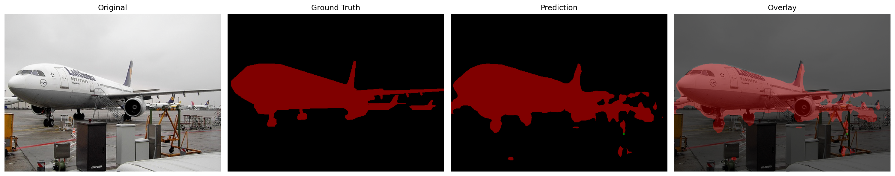
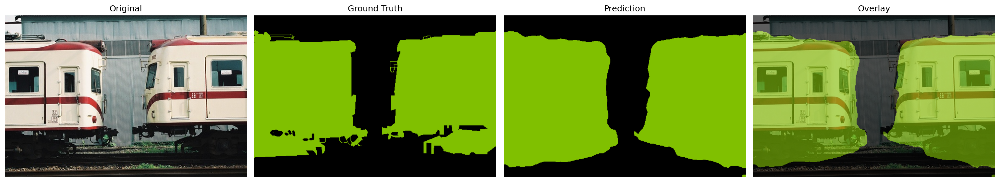
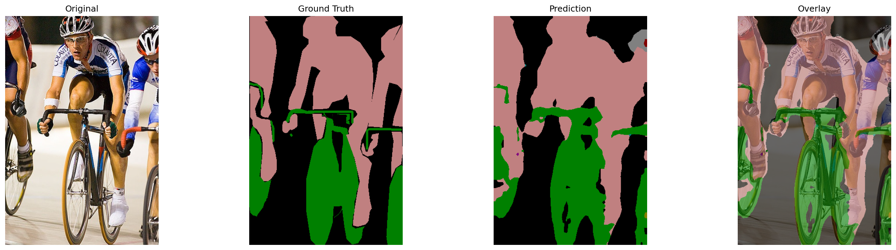
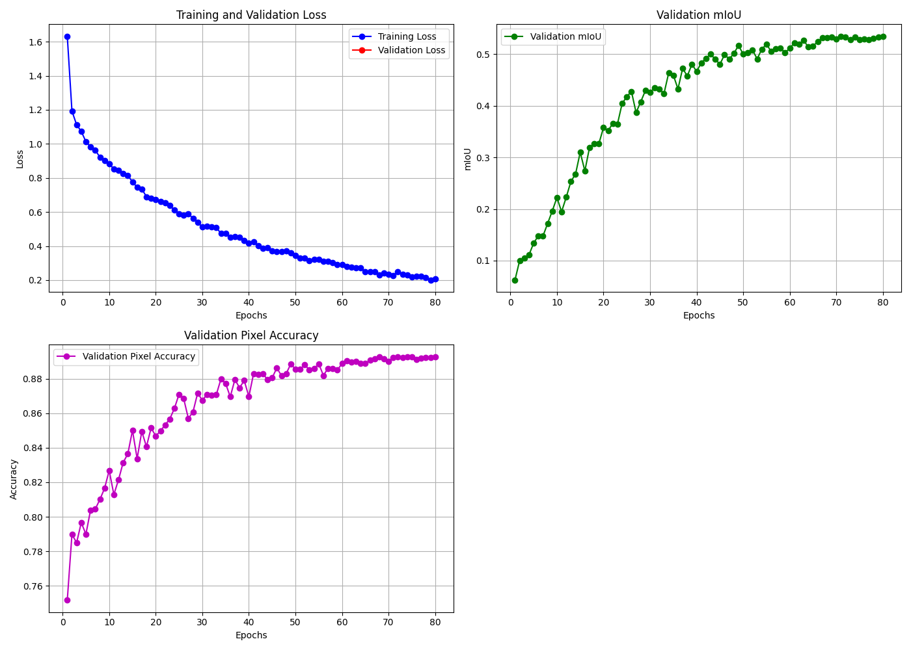
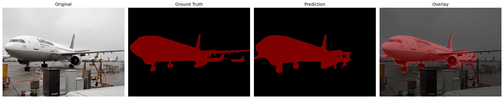
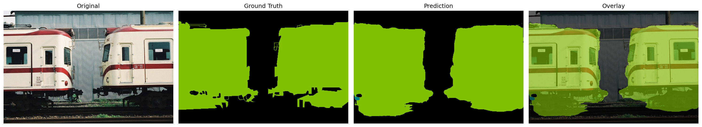
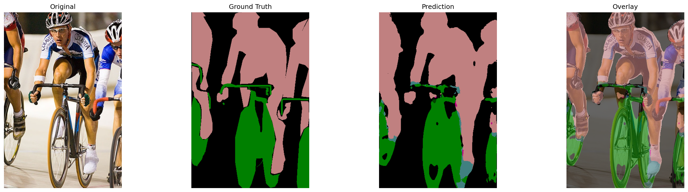
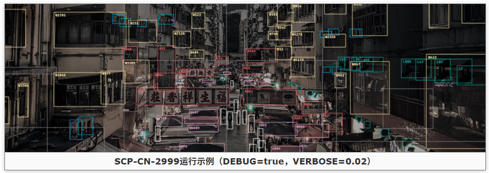
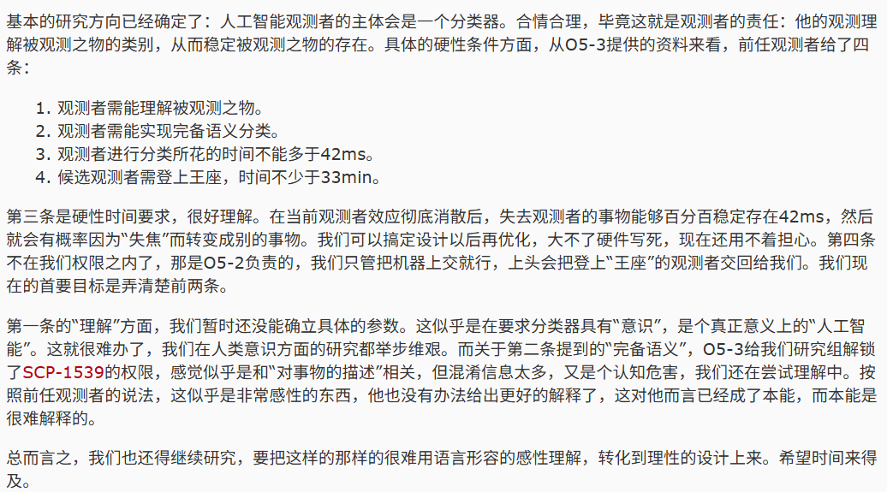

# 图像语义分割和目标检测相关模型复现手记

## 语义分割

语义分割的难点在于输出到和原图**分辨率一致**的特征图。因此不管是 FCN, U-Net 还是 Deeplab 等网络，关键点主要在于**下采样和上采样的信息流动**。一方面，我们需要利用下采样来获取特征图进行分割分类，这要求下采样过程能够高效提取信息；另一方面，我们还需要对下采样之后的结果进行解码，这又要求下采样不能丢弃太多信息，同时还需要引入编码器的中间结果来提供额外的信息。为此便有了跳跃连接、空洞卷积等核心操作。

虽然都是某种意义上的“生成模型”，这一部分的模型就没有 VAE 等模型那样强的数学，而是偏重于工程实现。

本文对语义分割主要介绍 FCN、U-Net、Deeplab 和 Segment Anything Model(SAM) 等。SAM 由于其规模，对数据集生成和预训练的算力要求巨大，因此只做论文阅读而不做复现。

### FCN

#### 架构

（其实我本来想直接上 U-Net 的，因为我一开始读 FCN 文章的时候就对这个架构有两个疑点，结果发现 U-Net 都能解决……）

本文主要复现的是 FCN-8s。它的前半截编码器部分是 VGG-16，于是我们又可以快乐地使用 ImageNet 预训练权重了。先回顾一下 VGG-16 的结构：


这里我们取到 `Maxpool 5` 之前的地方就够了，这样 VGG-16 的输出就是一张 `512@7x7` 的低分辨率特征图。然后 FCN 在这里就出现了几个变体（或者说一个演进的过程）：

首先考虑把这个特征图直接上采样到 224x224，我们肯定不能直接用什么线性插值、立方插值、Lanczos 插值等算法，因为它只是插值而不引入新信息。这就要祭出我们在 DC-GAN 以及 SRCNN 等生成式模型里面见到的 `ConvTranspose2d` 了。之前在分类模型下面没有细讲，这里简要介绍一下：`ConvTranspose2d` 的原理是在原有像素的四周均匀插 0 得到和目标大小一致的大图，然后再在这个大图上面做正常卷积。

于是我们通过步长为 32 的转置卷积一次性将 `512@7x7` 的特征图上采样到 `n@224x224`，得到我们的目标图像。这便是 FCN-32s。这里的 32 就是转置卷积的步长，s 就是 stride 的意思。

很显然，这个 `512@7x7` 的特征图剩下的信息相比于原图已经很少了，而我们的目标是要实现**像素级**的分割，为此，FCN 提出了跳跃连接的概念：既然编码器像一个“漏斗”一样去压榨特征，那么我取压榨之前具有更丰富信息的特征图，和我后面转置卷积上采样得到的特征图一融合，不就行了嘛。这便是 FCN 提出的跳跃连接思想。（其实和 ResNet 的残差连接有点像）

这样，我们就不一次性暴力恢复，而是先利用步长为 2 的转置卷积将 `512@7x7` 的特征图上采样到 `n@14x14`，其中 n 是类别数，也就是和 `Maxpool 4` 的输出尺寸一致。这样，前一个阶段的信息经过一个 1x1 卷积合并通道之后，就可以直接融合了。而这引发了我对于 FCN 架构的第一个疑点——FCN 的论文说是将两个特征图**相加**。但是我认为在通道维直接**拼接**，可能效果更好，因为对于特征图相加之后进行的卷积操作 C1 而言，我们总能设计一个卷积核使得拼接特征图再进行卷积操作 C2 的输出和相加后进行 C1 的输出完全一样，这意味着拼接再卷积作为一个张量到张量的映射集合，其“维度”是大于相加再卷积的，因而有能力承载更多的特征。不过，我们先按照原论文来，进行相加操作，得到 `n@14x14` 的特征图。最后，我们实施一次步长为 16 的转置卷积，上采样到 `n@224x224`，由于这一步步长为 16，所以叫 FCN-16s。

这样，FCN-8s 的意思就很简单了。我们对 `n@14x14` 的特征图进行一次步长为 2 的转置卷积，再同 `Maxpool 3` 的输出特征图相加得到 `n@28x28` 的特征图，再实施一次步长为 8 的转置卷积，上采样到 `n@224x224` 即可。

FCN 的论文只做到 8s，为什么不接着往后面做呢？这就是我的第二个疑点。如果逐层应用跳跃连接，也就是 `n@28x28` 到 `n@56x56` 到 `n@112x112` 再到 `n@224x224`，每一步都以**拼接**的方式实现跳跃连接，那么我们几乎就发明了 U-Net。

下面是 FCN-8s 的架构：

```mermaid
%%{init: {'theme': 'dark', 'themeVariables': { 'darkMode': true, 'primaryColor': '#1e1e2e', 'edgeLabelBackground':'#313244', 'tertiaryColor': '#181825'}}}%%
graph LR
    %% Styling definitions
    classDef box fill:#313244,stroke:#cdd6f4,stroke-width:2px,color:#cdd6f4,radius:8px;
    classDef input fill:#585b70,stroke:#89b4fa,stroke-width:2px,color:#cdd6f4;
    classDef output fill:#313244,stroke:#f38ba8,stroke-width:2px,color:#cdd6f4;
    classDef result fill:#45475a,stroke:#a6e3a1,stroke-width:2px,color:#cdd6f4;
    classDef conv fill:#313244,stroke:#74c7ec,stroke-width:2px,color:#cdd6f4;
    classDef skip fill:#313244,stroke:#cba6f7,stroke-width:2px,color:#cdd6f4;
    classDef upsample fill:#313244,stroke:#f5c2e7,stroke-width:2px,color:#cdd6f4;

    %% Input Layer
    subgraph Input["Input"]
        A[("3 @ 224×224")]
    end
    class Input input;

    %% VGG-16 Backbone (until pool5)
    subgraph Backbone["VGG-16 Backbone"]
        %% Block 1
        subgraph Block1["Block 1"]
            B["Conv 3x64<br>3×3"]
            C["Conv 64x64<br>3×3"]
            D["MaxPool<br>2×2 stride=2"]
        end
        
        %% Block 2
        subgraph Block2["Block 2"]
            E["Conv 64x128<br>3×3"]
            F["Conv 128x128<br>3×3"]
            G["MaxPool<br>2×2 stride=2"]
        end
        
        %% Block 3
        subgraph Block3["Block 3"]
            H["Conv 128x256<br>3×3"]
            I["Conv 256x256<br>3×3"]
            J["Conv 256x256<br>3×3"]
            K["MaxPool<br>2×2 stride=2<br>(pool3)"]
        end
        
        %% Block 4
        subgraph Block4["Block 4"]
            L["Conv 256x512<br>3×3"]
            M["Conv 512x512<br>3×3"]
            N["Conv 512x512<br>3×3"]
            O["MaxPool<br>2×2 stride=2<br>(pool4)"]
        end
        
        %% Block 5
        subgraph Block5["Block 5"]
            P["Conv 512x512<br>3×3"]
            Q["Conv 512x512<br>3×3"]
            R["Conv 512x512<br>3×3"]
            S["MaxPool<br>2×2 stride=2<br>(pool5)"]
        end
    end
    
    A --> B
    B --> C --> D
    D --> E
    E --> F --> G
    G --> H
    H --> I --> J --> K
    K --> L
    L --> M --> N --> O
    O --> P
    P --> Q --> R --> S
    
    class Backbone conv;
    class Block1,Block2,Block3,Block4,Block5 box;

    %% FCN-8s Specific Layers
    subgraph FCN["FCN-8s Head"]
        %% 1x1 Convs to reduce channels to num_classes
        T["1×1 Conv<br>512→n"]
        U["1×1 Conv<br>512→n"]
        V["1×1 Conv<br>256→n"]
        
        %% 2x Upsampling
        W["2x Upsample<br>transposed conv"]
        X["2x Upsample<br>transposed conv"]
        
        %% Skip connections and addition
        Y["Add<br>pool4 + 2x(pool5)"]
        Z["Add<br>pool3 + 2x(combined)"]
        
        %% Final 8x Upsampling
        AA["8x Upsample<br>transposed conv"]
    end
    
    S --> T
    O --> U
    K --> V
    T --> W
    W --> Y
    U --> Y
    Y --> X
    X --> Z
    V --> Z
    Z --> AA
    
    class FCN skip;
    class T,U,V conv;
    class W,X,AA upsample;
    class Y,Z result;

    %% Output Layer
    subgraph Output["Output"]
        AB[("n @ 224×224<br>(Segmentation Mask)")]
    end
    AA --> AB
    class Output output;

    %% Styling
    style A stroke-dasharray: 5 5
    style AB stroke:#a6e3a1,stroke-width:3px
    
    %% Skip connection annotations
    linkStyle 15 stroke:#cba6f7,stroke-width:2px,stroke-dasharray: 5 5;
    linkStyle 16 stroke:#cba6f7,stroke-width:2px,stroke-dasharray: 5 5;
```



#### 指标

先前的图像分类任务里面，我们基本上没有去衡量除了准确率和损失之外的其他指标，但是语义分割和目标检测这一块，我们就不仅要关注类别对不对，更要关注分割/检测是否到位。

让我们来回顾一下概率论课程中的参数推断，里面提到两种错误：**拒真**和**取伪**（或者叫假阳假阴或者第一类错误第二类错误什么的），如果我们把这两种错误的频数和两种正确的频数放到一起，就得到了**混淆矩阵**：

||预测为真|预测为假|总和|
|:-:|:-:|:-:|:-:|
|实际为真|真阳性 TP|假阴性 TN|真样本数 T|
|实际为假|假阳性 FP|真阴性 FN|假样本数 F|
|总和|阳性数 P|阴性数 N|总数 S|

那么我们就可以以此来评估模型性能了：

$$
\begin{align*}
    \mathrm{Acc.}&=\frac{\mathrm{TP}+\mathrm{FN}}{\mathrm{S}}\\
    \mathrm{Prec.}&=\frac{\mathrm{TP}}{\mathrm{P}}=1-\frac{\mathrm{FP}}{\mathrm{P}}\\
    \mathrm{Recall}&=\frac{\mathrm{TP}}{\mathrm{TP}+\mathrm{FN}}
\end{align*}
$$

第一个是**准确率**即预测正确占总数的比例。第二个是**精准率**，越高说明假阴性/假阳性的占比越低。最后一个是**召回率**，可以理解成在预测正确的情况下，模型有多大意愿给出阴性/阳性结果。在语义分割的语境下，我们在单张图片的像素意义上计算这些指标，也就是说我们可以得到像素准确率 PA。


如图，假设黑圈是 ground truth 而白圈是 prediction，那么以上三个率就能可视化了。

如果做的是像 Pascal VOC 这样的多类别语义分割，我们给每个类别都计算 PA，然后求平均，就得到一个总的计算准确率的指标：平均类别像素准确率 mPA。

另一方面，我们其实希望白圈和黑圈尽可能重合，其实就是**相交得更多，不属于相交的部分更少**。为此，我们可以引入一个指标来衡量：交并比 IoU，也就是 II 区域的面积除以 I、II 和 III 区域的面积之和。

$$
\mathrm{IoU}=\dfrac{\mathrm{TP}}{\mathrm{T}+\mathrm{P}-\mathrm{TP}}
$$

同样的，我们可以计算类别平均交并比 mIoU。

下面的代码就实现了基于混淆矩阵计算 PA 和 mIoU。

```python
def compute_metrics(hist):
    pixel_accuracy = np.diag(hist).sum() / hist.sum() # 对角线元素都是预测正确的
    iou = np.diag(hist) / (hist.sum(axis=1) + hist.sum(axis=0) - np.diag(hist))
    # 忽略NaN值（例如某个类别在验证集中从未出现过）
    miou = np.nanmean(iou)
    return pixel_accuracy, miou
```

FCN 的损失函数当简单：其实我们等于是**对一个和原图尺寸一致的像素阵列做独立的分类**，那么和分类任务一样，**直接沿用交叉熵损失即可**！

#### 实现细节

这里的细节主要是来讲 FCN-8s 这个类的具体实现。

```python
class FCN8s(nn.Module):
    def __init__(self, num_classes):
        super(FCN8s, self).__init__()
        # 预训练 VGG16
        vgg = vgg16(weights=VGG16_Weights.IMAGENET1K_V1)
        features = vgg.features
        
        # 提取不同阶段的特征图
        # 在 PyTorch 的实现中，VGG 的连续卷积-池化操作是保存在 vgg.features 这个 list 里面
        # [64, 64, 'M', 128, 128, 'M', 256, 256, 256, 'M', 512, 512, 512, 'M', 512, 512, 512, 'M'] 其中 M 就是 Maxpool
        # 由于这个 list 被封印进 nn.Sequnential 里面，所以可以直接调用，输出就是特征图
        self.pool3_features = features[:17]   # 到 pool3
        self.pool4_features = features[17:24] # 到 pool4
        self.pool5_features = features[24:]   # 到 pool5
        
        # 全连接层改为卷积层（FCN）
        # VGG 的第一个 Linear: 512@7x7 -> 4096@7x7
        # 当然这里为了适应任意宽度的输出，可以使用 GAP
        # 不过我们可以利用上 VGG 的预训练权重，比起重新训效果肯定更好
        self.fc6 = nn.Conv2d(512, 4096, kernel_size=7, padding=3)
        self.relu6 = nn.ReLU(inplace=True)
        self.drop6 = nn.Dropout2d()
        
        # VGG 的第二个 Linear: 4096@7x7 -> 4096@7x7
        # 仍然是拷贝权重然后 reshape 到卷积核
        self.fc7 = nn.Conv2d(4096, 4096, kernel_size=1)
        self.relu7 = nn.ReLU(inplace=True)
        self.drop7 = nn.Dropout2d()
        
        # 仍然是靠 1x1 卷积负责得到一个 num_classes@7x7 的分类得分
        self.score_fr = nn.Conv2d(4096, num_classes, kernel_size=1)
        
        # 通过 1x1 卷积得到 num_classes@HxW 的特征图用于跳跃连接
        self.score_pool3 = nn.Conv2d(256, num_classes, kernel_size=1)
        self.score_pool4 = nn.Conv2d(512, num_classes, kernel_size=1)
        
        # 上采样层
        self.upscore2 = nn.ConvTranspose2d(num_classes, num_classes, kernel_size=4, stride=2, padding=1, bias=False)
        self.upscore_pool4 = nn.ConvTranspose2d(num_classes, num_classes, kernel_size=4, stride=2, padding=1, bias=False)

        # 将 VGG classifier 的 fc6/fc7 预训练权重拷贝到卷积层
        with torch.no_grad():
            # vgg.classifier: [Linear(25088,4096), ReLU, Dropout, Linear(4096,4096), ReLU, Dropout, Linear(4096,1000)]
            # view(4096, 512, 7, 7) 操作就是把 25088x4096 的线性层 reshape 到这个形状的张量
            fc6_w = vgg.classifier[0].weight.view(4096, 512, 7, 7)
            fc6_b = vgg.classifier[0].bias
            self.fc6.weight.copy_(fc6_w)
            self.fc6.bias.copy_(fc6_b)

            # 这里也是同样的操作转换成张量
            fc7_w = vgg.classifier[3].weight.view(4096, 4096, 1, 1)
            fc7_b = vgg.classifier[3].bias
            self.fc7.weight.copy_(fc7_w)
            self.fc7.bias.copy_(fc7_b)

        # 反卷积层用双线性插值进行初始化
        # 反卷积的初始化的细节在后面说明
        with torch.no_grad():
            self.upscore2.weight.copy_(bilinear_kernel(num_classes, num_classes, 4))
            self.upscore_pool4.weight.copy_(bilinear_kernel(num_classes, num_classes, 4))

    def forward(self, x):
        input_size = x.shape[2:] # (B, C, H, W) -> (H, W)
        
        # 直接得到 pool3, pool4, pool5 后的特征图
        pool3 = self.pool3_features(x)
        pool4 = self.pool4_features(pool3)
        pool5 = self.pool5_features(pool4)
        
        # 1x1 卷积得到我们需要的 num_classes@7x7 的特征图
        h = self.relu6(self.fc6(pool5))
        h = self.drop6(h)
        h = self.relu7(self.fc7(h))
        h = self.drop7(h)
        h = self.score_fr(h)

        # 第一次上采样通过转置卷积输出宽高扩张一倍的特征图
        upscore2 = self.upscore2(h)
        
        # 跳连 pool4
        score_pool4 = self.score_pool4(pool4)
        # 这里用双线性插值适应特征图大小
        upscore2 = F.interpolate(upscore2, size=score_pool4.size()[2:], mode='bilinear', align_corners=False)
        fuse_pool4 = upscore2 + score_pool4
        
        # 第二次上采样通过转置卷积输出宽高扩张一倍的特征图
        upscore_pool4 = self.upscore_pool4(fuse_pool4)
        
        # 跳连 pool3
        score_pool3 = self.score_pool3(pool3)
        # 同样使用双线性插值适应大小
        upscore_pool4 = F.interpolate(upscore_pool4, size=score_pool3.size()[2:], mode='bilinear', align_corners=False)
        fuse_pool3 = upscore_pool4 + score_pool3
        
        # 最终上采样到输入尺寸，直接插值，省时高效
        out = F.interpolate(fuse_pool3, size=input_size, mode='bilinear', align_corners=False)
        return out
```

可以看到除开之前提到的整体架构以外，代码还有一些小细节。

首先是**反卷积的双线性插值初始化**。这一部分代码如下：

```python
def bilinear_kernel(in_channels, out_channels, kernel_size):
    """生成双线性插值的反卷积初始化权重"""
    factor = (kernel_size + 1) // 2
    if kernel_size % 2 == 1:
        center = factor - 1
    else:
        center = factor - 0.5
    og = np.ogrid[:kernel_size, :kernel_size] # 生成两个二维数组，分别表示行和列的索引网格。
    filt = (1 - abs(og[0] - center) / factor) * (1 - abs(og[1] - center) / factor)
    weight = np.zeros((in_channels, out_channels, kernel_size, kernel_size), dtype=np.float32)
    for i in range(min(in_channels, out_channels)):
        weight[i, i, :, :] = filt
    return torch.from_numpy(weight)
```

这里关键是 `filt` 的计算，本质上就是卷积核内部计算对应的行到边界的归一化曼哈顿距离乘以对应的列到边界的归一化曼哈顿距离。对于从小图到大图的转置卷积而言，大图里面两个源于小图的像素之间的像素，就可以根据到这两个像素的曼哈顿距离作为比例来混合得到。也就是说即使我们还没有从网络里面学到任何知识，这个卷积核至少还可以不破坏原有信息而直接插值放大。同时本来 FCN 的卷积核就需要对特征图进行放大，这无疑是相比随机初始化更高效的初始化方法。

下面是完整的训练代码，关于数据加载和增强的大量工程性代码就不细讲了。不过，代码里的数据增强还是比较有效。

<details>

<summary> FCN-8s 完整训练代码 </summary>

```python
import os
import time
import warnings
warnings.filterwarnings("ignore", "(Possibly )?corrupt EXIF data", UserWarning)

import numpy as np
from PIL import Image
import matplotlib.pyplot as plt
from tqdm.notebook import tqdm

import torch
import torch.nn as nn
import torch.optim as optim
import torch.nn.functional as F
from torch.utils.data import Dataset, DataLoader, ConcatDataset
import torchvision.transforms as T
from torchvision.models import vgg16, VGG16_Weights
import itertools as it

# -------------------- 配置 --------------------
DEVICE = "cuda" if torch.cuda.is_available() else "cpu"
USE_AMP = True  # 固定用 CUDA AMP

# Kaggle 路径
VOC2007_ROOT = "/kaggle/input/pascal-voc-2007/VOCtrainval_06-Nov-2007/VOCdevkit/VOC2007"
VOC2007_ROOT_ALT = "/kaggle/input/pascal-voc-2007/VOCdevkit/VOC2007"
if not os.path.isdir(VOC2007_ROOT) and os.path.isdir(VOC2007_ROOT_ALT):
    VOC2007_ROOT = VOC2007_ROOT_ALT

VOC2012_ROOT = "/kaggle/input/pascal-voc-2012/VOC2012"

NUM_CLASSES = 21
BATCH_SIZE = 16
VAL_BATCH_SIZE = 1
NUM_WORKERS = 6

LEARNING_RATE = 7.5e-5
WEIGHT_DECAY = 1e-4
EPOCHS = 50

# 评估加速开关
EVAL_COMPUTE_LOSS = False     # True 会计算 val loss，稍慢
EVAL_MAX_BATCHES = None       # 限制评估批次数；None 表示全量
EVAL_MAX_IMAGES = None        # 限制评估图片数；None 表示全量
EVAL_PROGRESS = True          # 保留 tqdm 进度条

SAVE_DIR = "/kaggle/working"
BEST_PATH_VOC = os.path.join(SAVE_DIR, "fcn8s_best_voc2012val.pth")
LATEST_PATH = os.path.join(SAVE_DIR, "fcn8s_latest.pth")
VIS_DIR = os.path.join(SAVE_DIR, "vis_voc_val")

print(f"Using device: {DEVICE}")
if DEVICE == "cuda":
    torch.backends.cudnn.benchmark = True

# PASCAL VOC 颜色映射 (RGB) 用于可视化
VOC_COLORMAP = [
    [0, 0, 0], [128, 0, 0], [0, 128, 0], [128, 128, 0], [0, 0, 128],
    [128, 0, 128], [0, 128, 128], [128, 128, 128], [64, 0, 0], [192, 0, 0],
    [64, 128, 0], [192, 128, 0], [64, 0, 128], [192, 0, 128], [64, 128, 128],
    [192, 128, 128], [0, 64, 0], [128, 64, 0], [0, 192, 0], [128, 192, 0],
    [0, 64, 128]
]

# -------------------- 数据集（VOC） --------------------
class VOCSegmentationDataset(Dataset):
    """
    用于 VOC2007/VOC2012 的语义分割数据。
    若缺少 ImageSets/Segmentation/{split}.txt，将回退到扫描 SegmentationClass 目录。
    """
    def __init__(self, root, image_set="train", transforms=None, strict=True):
        self.root = root
        self.transforms = transforms
        self.image_set = image_set

        image_dir = os.path.join(root, "JPEGImages")
        mask_dir = os.path.join(root, "SegmentationClass")
        split_file = os.path.join(root, "ImageSets", "Segmentation", f"{image_set}.txt")

        assert os.path.isdir(image_dir), f"Image dir not found: {image_dir}"
        if not os.path.isdir(mask_dir):
            if strict:
                raise FileNotFoundError(f"SegmentationClass not found: {mask_dir}")
            else:
                print(f"[Warning] SegmentationClass not found in {root}, dataset will be empty.")
        self.image_dir = image_dir
        self.mask_dir = mask_dir

        ids = []
        if os.path.isfile(split_file):
            with open(split_file, "r") as f:
                ids = [line.strip() for line in f if line.strip()]
        else:
            if os.path.isdir(mask_dir):
                ids = [os.path.splitext(fn)[0] for fn in os.listdir(mask_dir) if fn.endswith(".png")]
            else:
                ids = []

        self.image_paths, self.mask_paths = [], []
        for id_ in ids:
            ip = os.path.join(image_dir, f"{id_}.jpg")
            mp = os.path.join(mask_dir, f"{id_}.png")
            if os.path.isfile(ip) and os.path.isfile(mp):
                self.image_paths.append(ip)
                self.mask_paths.append(mp)
        if len(self.image_paths) == 0:
            print(f"[Warning] Empty dataset for root={root}, split={image_set}. Check masks/splits.")

    def __len__(self):
        return len(self.image_paths)

    def __getitem__(self, idx):
        image = Image.open(self.image_paths[idx]).convert("RGB")
        mask = Image.open(self.mask_paths[idx])  # palette 索引

        if self.transforms is not None:
            image, target = self.transforms(image, mask)
        else:
            img = T.functional.to_tensor(image)
            img = T.functional.normalize(img, (0.485, 0.456, 0.406), (0.229, 0.224, 0.225))
            target = torch.from_numpy(np.array(mask, dtype=np.uint8)).long()
            image, target = img, target
        return image, target

# -------------------- 数据增强与预处理 --------------------
class SegmentationTransforms:
    def __init__(self, is_train=True, base_size=520, crop_size=480,
                 color_jitter=True, add_noise_prob=0.15, noise_std=0.03):
        self.is_train = is_train
        self.base_size = base_size
        self.crop_size = crop_size
        self.mean = (0.485, 0.456, 0.406)
        self.std = (0.229, 0.224, 0.225)
        self.color_jitter = T.ColorJitter(0.4, 0.4, 0.4, 0.1) if color_jitter and is_train else None
        self.add_noise_prob = add_noise_prob if is_train else 0.0
        self.noise_std = noise_std

    def __call__(self, img, mask):
        if self.is_train:
            # 1) 随机缩放短边到 [0.5, 2.0] * base_size
            scale = np.random.uniform(0.5, 2.0)
            short = int(self.base_size * scale)
            w, h = img.size
            if w < h:
                ow, oh = short, int(short * h / w)
            else:
                oh, ow = short, int(short * w / h)
            img = img.resize((ow, oh), Image.BILINEAR)
            mask = mask.resize((ow, oh), Image.NEAREST)

            # 2) 若小于 crop_size，右下角 padding（mask 用 255）
            pad_w = max(0, self.crop_size - img.size[0])
            pad_h = max(0, self.crop_size - img.size[1])
            if pad_w > 0 or pad_h > 0:
                img = T.functional.pad(img, (0, 0, pad_w, pad_h), fill=0)
                mask = T.functional.pad(mask, (0, 0, pad_w, pad_h), fill=255)

            # 3) 随机裁剪
            w, h = img.size
            x1 = np.random.randint(0, w - self.crop_size + 1)
            y1 = np.random.randint(0, h - self.crop_size + 1)
            img = img.crop((x1, y1, x1 + self.crop_size, y1 + self.crop_size))
            mask = mask.crop((x1, y1, x1 + self.crop_size, y1 + self.crop_size))

            # 4) 随机水平翻转
            if np.random.rand() > 0.5:
                img = T.functional.hflip(img)
                mask = T.functional.hflip(mask)

            # 5) 颜色抖动
            if self.color_jitter is not None:
                img = self.color_jitter(img)

        # 转 Tensor
        img = T.functional.to_tensor(img)

        # 可选噪声（归一化前）
        if self.is_train and np.random.rand() < self.add_noise_prob:
            noise = torch.randn_like(img) * self.noise_std
            img = torch.clamp(img + noise, 0.0, 1.0)

        # 标准化
        img = T.functional.normalize(img, self.mean, self.std)

        # 直接把 palette/L 索引图转成类别 id（0..20，255 忽略）
        target = torch.from_numpy(np.array(mask, dtype=np.uint8)).long()
        return img, target

# -------------------- 模型（FCN-8s） --------------------
def bilinear_kernel(in_channels, out_channels, kernel_size):
    factor = (kernel_size + 1) // 2
    center = factor - 1 if kernel_size % 2 == 1 else factor - 0.5
    og = np.ogrid[:kernel_size, :kernel_size]
    filt = (1 - abs(og[0] - center) / factor) * (1 - abs(og[1] - center) / factor)
    weight = np.zeros((in_channels, out_channels, kernel_size, kernel_size), dtype=np.float32)
    for i in range(min(in_channels, out_channels)):
        weight[i, i, :, :] = filt
    return torch.from_numpy(weight)

class FCN8s(nn.Module):
    def __init__(self, num_classes):
        super(FCN8s, self).__init__()
        vgg = vgg16(weights=VGG16_Weights.IMAGENET1K_V1)
        features = vgg.features

        self.pool3_features = features[:17]
        self.pool4_features = features[17:24]
        self.pool5_features = features[24:]

        self.fc6 = nn.Conv2d(512, 4096, kernel_size=7, padding=3)
        self.relu6 = nn.ReLU(inplace=True)
        self.drop6 = nn.Dropout2d()

        self.fc7 = nn.Conv2d(4096, 4096, kernel_size=1)
        self.relu7 = nn.ReLU(inplace=True)
        self.drop7 = nn.Dropout2d()

        self.score_fr = nn.Conv2d(4096, num_classes, kernel_size=1)
        self.score_pool3 = nn.Conv2d(256, num_classes, kernel_size=1)
        self.score_pool4 = nn.Conv2d(512, num_classes, kernel_size=1)

        self.upscore2 = nn.ConvTranspose2d(num_classes, num_classes, kernel_size=4, stride=2, padding=1, bias=False)
        self.upscore_pool4 = nn.ConvTranspose2d(num_classes, num_classes, kernel_size=4, stride=2, padding=1, bias=False)

        with torch.no_grad():
            fc6_w = vgg.classifier[0].weight.view(4096, 512, 7, 7)
            fc6_b = vgg.classifier[0].bias
            self.fc6.weight.copy_(fc6_w)
            self.fc6.bias.copy_(fc6_b)

            fc7_w = vgg.classifier[3].weight.view(4096, 4096, 1, 1)
            fc7_b = vgg.classifier[3].bias
            self.fc7.weight.copy_(fc7_w)
            self.fc7.bias.copy_(fc7_b)

            self.upscore2.weight.copy_(bilinear_kernel(NUM_CLASSES, NUM_CLASSES, 4))
            self.upscore_pool4.weight.copy_(bilinear_kernel(NUM_CLASSES, NUM_CLASSES, 4))

    def forward(self, x):
        input_size = x.shape[2:]
        pool3 = self.pool3_features(x)
        pool4 = self.pool4_features(pool3)
        pool5 = self.pool5_features(pool4)

        h = self.relu6(self.fc6(pool5))
        h = self.drop6(h)
        h = self.relu7(self.fc7(h))
        h = self.drop7(h)

        h = self.score_fr(h)
        upscore2 = self.upscore2(h)

        score_pool4 = self.score_pool4(pool4)
        upscore2 = F.interpolate(upscore2, size=score_pool4.size()[2:], mode='bilinear', align_corners=False)
        fuse_pool4 = upscore2 + score_pool4

        upscore_pool4 = self.upscore_pool4(fuse_pool4)

        score_pool3 = self.score_pool3(pool3)
        upscore_pool4 = F.interpolate(upscore_pool4, size=score_pool3.size()[2:], mode='bilinear', align_corners=False)
        fuse_pool3 = upscore_pool4 + score_pool3

        out = F.interpolate(fuse_pool3, size=input_size, mode='bilinear', align_corners=False)
        return out

# -------------------- 评估指标 --------------------
def compute_metrics(hist):
    pixel_accuracy = np.diag(hist).sum() / hist.sum() if hist.sum() > 0 else 0.0
    denom = (hist.sum(axis=1) + hist.sum(axis=0) - np.diag(hist))
    iou = np.divide(np.diag(hist), denom, out=np.full_like(np.diag(hist, k=0), np.nan, dtype=float), where=denom!=0)
    miou = np.nanmean(iou)
    return pixel_accuracy, miou

# -------------------- 训练 / 验证 --------------------
def train_one_epoch(model, optimizer, criterion, data_loader, device, scaler, lr_scheduler, grad_clip=1.0):
    model.train()
    total_loss = 0
    progress_bar = tqdm(data_loader, desc="Training", leave=False)
    for images, targets in progress_bar:
        images = images.to(device)
        targets = targets.to(device)

        optimizer.zero_grad()
        with torch.amp.autocast(device_type='cuda'):
            outputs = model(images)
            loss = criterion(outputs, targets)

        scaler.scale(loss).backward()
        scaler.unscale_(optimizer)
        if grad_clip is not None and grad_clip > 0:
            nn.utils.clip_grad_norm_(model.parameters(), grad_clip)

        scaler.step(optimizer)
        scaler.update()

        lr_scheduler.step()

        total_loss += loss.item()
        progress_bar.set_postfix(
            loss=f'{loss.item():.4f}',
            lr=f'{optimizer.param_groups[0]["lr"]:.2e}/{optimizer.param_groups[1]["lr"]:.2e}'
        )
    return total_loss / len(data_loader)

@torch.no_grad()
def evaluate_fast(model, criterion, data_loader, device, num_classes,
                  compute_loss=False, max_batches=None, max_images=None, progress=True):
    model.eval()
    total_loss = 0.0
    seen_images = 0
    batches = 0

    conf = torch.zeros((num_classes, num_classes), dtype=torch.int64, device=device)
    iterator = tqdm(data_loader, desc="Evaluating", leave=False) if progress else data_loader

    with torch.inference_mode():
        for images, targets in iterator:
            images = images.to(device, non_blocking=True)
            targets = targets.to(device, non_blocking=True)

            with torch.amp.autocast(device_type='cuda'):
                outputs = model(images)
                if compute_loss:
                    loss = criterion(outputs, targets)
                    total_loss += loss.item()

            preds = outputs.argmax(1)
            valid = targets != 255
            if valid.any():
                n = num_classes
                t = targets[valid].to(torch.int64)
                p = preds[valid].to(torch.int64)
                k = (t * n + p).view(-1)
                conf += torch.bincount(k, minlength=n*n).view(n, n)

            batches += 1
            seen_images += images.size(0)

            if (max_batches is not None and batches >= max_batches) or \
               (max_images is not None and seen_images >= max_images):
                break

    conf_f = conf.to(torch.float32)
    total = conf_f.sum()
    pixel_acc = (torch.diag(conf_f).sum() / total).item() if total > 0 else 0.0
    denom = (conf_f.sum(dim=1) + conf_f.sum(dim=0) - torch.diag(conf_f))
    iou = torch.where(denom > 0, torch.diag(conf_f) / denom, torch.full_like(denom, float('nan')))
    miou = torch.nanmean(iou).item()

    avg_loss = (total_loss / batches) if compute_loss and batches > 0 else float('nan')
    return avg_loss, pixel_acc, miou

# -------------------- 可视化 --------------------
def decode_segmap(image, nc=21, void_value=255, void_color=(0, 0, 0)):
    lut = np.zeros((256, 3), dtype=np.uint8)
    lut[:nc] = np.array(VOC_COLORMAP, dtype=np.uint8)
    lut[void_value] = np.array(void_color, dtype=np.uint8)
    return lut[image]

def denormalize(tensor):
    mean = np.array([0.485, 0.456, 0.406])
    std = np.array([0.229, 0.224, 0.225])
    arr = tensor.detach().cpu().numpy().transpose(1, 2, 0)
    arr = std * arr + mean
    return np.clip(arr, 0, 1)

@torch.no_grad()
def visualize_predictions(model, data_loader, device, num_images=20, save_dir=VIS_DIR, overlay_alpha=0.6):
    os.makedirs(save_dir, exist_ok=True)
    model.eval()
    shown = 0

    for images, targets in data_loader:
        images = images.to(device)
        with torch.amp.autocast(device_type='cuda'):
            outputs = model(images)

        preds = torch.argmax(outputs, dim=1).cpu().numpy()
        images_cpu = images.cpu()
        targets_np = targets.cpu().numpy()

        bsz = images_cpu.shape[0]
        for i in range(bsz):
            if shown >= num_images: break

            original_img = denormalize(images_cpu[i])
            gt_mask_rgb = decode_segmap(targets_np[i])
            pred_mask_rgb = decode_segmap(preds[i])

            fig, axes = plt.subplots(1, 4, figsize=(20, 5))
            axes[0].imshow(original_img); axes[0].set_title("Original"); axes[0].axis('off')
            axes[1].imshow(gt_mask_rgb);  axes[1].set_title("Ground Truth"); axes[1].axis('off')
            axes[2].imshow(pred_mask_rgb);axes[2].set_title("Prediction");   axes[2].axis('off')
            axes[3].imshow(original_img); axes[3].imshow(pred_mask_rgb, alpha=overlay_alpha)
            axes[3].set_title("Overlay"); axes[3].axis('off')
            plt.tight_layout()

            out_path = os.path.join(save_dir, f'result_{shown:03d}.png')
            plt.savefig(out_path, dpi=150, bbox_inches='tight')
            plt.close(fig)
            shown += 1
        if shown >= num_images: break

    print(f"可视化结果保存在: {os.path.abspath(save_dir)}（共 {shown} 张）")

# -------------------- 准备数据与模型 --------------------
# 训练集：VOC2007 trainval + VOC2012 train（若 2007 不可用，则仅 2012）
train_sets = []

# VOC2007 trainval（若存在分割标注）
if os.path.isdir(VOC2007_ROOT):
    try:
        train_07 = VOCSegmentationDataset(
            VOC2007_ROOT, image_set='trainval',
            transforms=SegmentationTransforms(is_train=True, base_size=520, crop_size=480),
            strict=False
        )
        if len(train_07) > 0:
            train_sets.append(train_07)
            print(f"VOC2007 trainval 可用: {len(train_07)} 样本")
        else:
            print("VOC2007 trainval 无可用分割样本，跳过 2007。")
    except Exception as e:
        print(f"加载 VOC2007 失败，跳过：{e}")
else:
    print(f"未找到 VOC2007 路径：{VOC2007_ROOT}（将仅使用 VOC2012 训练）")

# VOC2012 train
train_12 = VOCSegmentationDataset(
    VOC2012_ROOT, image_set='train',
    transforms=SegmentationTransforms(is_train=True, base_size=520, crop_size=480),
    strict=True
)
print(f"VOC2012 train: {len(train_12)} 样本")
train_sets.append(train_12)

# 合并训练集
if len(train_sets) == 1:
    train_dataset = train_sets[0]
else:
    train_dataset = ConcatDataset(train_sets)

# 验证：VOC2012 val
val_dataset_voc = VOCSegmentationDataset(
    VOC2012_ROOT, image_set='val',
    transforms=SegmentationTransforms(is_train=False, base_size=520, crop_size=480),
    strict=True
)

train_loader = DataLoader(
    train_dataset, batch_size=BATCH_SIZE, shuffle=True,
    num_workers=NUM_WORKERS, pin_memory=True, persistent_workers=True
)
val_loader_voc = DataLoader(
    val_dataset_voc, batch_size=VAL_BATCH_SIZE, shuffle=False,
    num_workers=NUM_WORKERS, pin_memory=True, persistent_workers=True
)

print(f"训练集总样本数: {len(train_dataset)}")
print(f"验证集样本数 (VOC2012 val): {len(val_dataset_voc)}")

model = FCN8s(num_classes=NUM_CLASSES).to(DEVICE)
criterion = nn.CrossEntropyLoss(ignore_index=255)

# 参数分组 + poly 学习率
base_lr = LEARNING_RATE
new_lr = LEARNING_RATE * 10
new_modules = [model.score_fr, model.score_pool3, model.score_pool4, model.upscore2, model.upscore_pool4]
optimizer = optim.AdamW([
    {'params': it.chain(model.pool3_features.parameters(),
                        model.pool4_features.parameters(),
                        model.pool5_features.parameters(),
                        model.fc6.parameters(),
                        model.fc7.parameters()), 'lr': base_lr},
    {'params': it.chain(*(m.parameters() for m in new_modules)), 'lr': new_lr},
], weight_decay=WEIGHT_DECAY)

max_iter = EPOCHS * len(train_loader)
def poly_lr_lambda(it_idx):
    return (1 - it_idx / max_iter) ** 0.9
lr_scheduler = optim.lr_scheduler.LambdaLR(optimizer, lr_lambda=poly_lr_lambda)

# AMP Scaler（固定 cuda）
scaler = torch.amp.GradScaler('cuda')

# 记录与保存
history = {'train_loss': [], 'val_loss': [], 'val_pa': [], 'val_miou': []}
best_miou_voc = -1.0
os.makedirs(SAVE_DIR, exist_ok=True)

# -------------------- 训练循环 --------------------
print("开始训练...")
start_time = time.time()

for epoch in range(EPOCHS):
    train_loss = train_one_epoch(model, optimizer, criterion, train_loader, DEVICE, scaler, lr_scheduler)

    val_loss_voc, val_pa_voc, val_miou_voc = evaluate_fast(
        model, criterion, val_loader_voc, DEVICE, NUM_CLASSES,
        compute_loss=EVAL_COMPUTE_LOSS,
        max_batches=EVAL_MAX_BATCHES,
        max_images=EVAL_MAX_IMAGES,
        progress=EVAL_PROGRESS
    )

    history['train_loss'].append(train_loss)
    history['val_loss'].append(val_loss_voc)
    history['val_pa'].append(val_pa_voc)
    history['val_miou'].append(val_miou_voc)

    if val_miou_voc > best_miou_voc:
        best_miou_voc = val_miou_voc
        torch.save({
            'epoch': epoch + 1,
            'model_state': model.state_dict(),
            'optimizer_state': optimizer.state_dict(),
            'miou_voc': best_miou_voc,
            'config': {
                'base_lr': base_lr, 'new_lr': new_lr, 'weight_decay': WEIGHT_DECAY,
                'epochs': EPOCHS, 'batch_size': BATCH_SIZE
            }
        }, BEST_PATH_VOC)

    val_loss_str = f"{val_loss_voc:.4f}" if EVAL_COMPUTE_LOSS else "n/a"
    print(
        f"Epoch {epoch+1}/{EPOCHS} | "
        f"Train Loss: {train_loss:.4f} | "
        f"VOC Val: Loss {val_loss_str}, PA {val_pa_voc:.4f}, mIoU {val_miou_voc:.4f} | "
        f"Best VOC mIoU: {best_miou_voc:.4f}"
    )

end_time = time.time()
print(f"\n训练完成！总耗时: {(end_time - start_time) / 60:.2f} 分钟")
print("\n--- 最终评估指标 (VOC2012 val) ---")
final_loss_str = f"{history['val_loss'][-1]:.4f}" if EVAL_COMPUTE_LOSS else "n/a"
print(f"Val Loss: {final_loss_str} | PA: {history['val_pa'][-1]:.4f} | mIoU: {history['val_miou'][-1]:.4f}")
print(f"最优权重已保存至: {BEST_PATH_VOC}")

# 保存当前（latest）
torch.save(model.state_dict(), LATEST_PATH)
print(f"已保存当前模型权重到: {LATEST_PATH}")

# 加载最优权重用于可视化
if os.path.isfile(BEST_PATH_VOC):
    ckpt_voc = torch.load(BEST_PATH_VOC, map_location=torch.device(DEVICE))
    model.load_state_dict(ckpt_voc['model_state'])
    print(f"\n已加载 VOC 最优权重进行可视化: {BEST_PATH_VOC} (epoch={ckpt_voc.get('epoch','?')}, mIoU_VOC={ckpt_voc.get('miou_voc', 0):.4f})")
else:
    print("\n未找到 VOC 最优权重，使用当前模型进行可视化。")

print("\n--- 可视化预测结果 (VOC2012 val) ---")
visualize_predictions(model, val_loader_voc, DEVICE, num_images=20, save_dir=VIS_DIR)
```

</details>

#### 训练结果


在 Pascal VOC 07+12 上训练 50 个 Epoch，总用时 7796.3s，mIoU 达到 0.6277，像素准确率达到 0.9065，已经超过了原论文的指标。







### U-Net

#### 原理

我们实践刚刚在 FCN-8s 里面提到的更改，也就是把网络结构改对称，并且跳跃连接由相加再在通道维拼接，最后加数据增强即可。

其实从 FCN 到 U-Net，有点类似于从 ResNet 到 DenseNet。

```python
# 基本的双卷积块，负责整合拼接之后的通道维。
class DoubleConv(nn.Module):
    def __init__(self, in_ch, out_ch, p=0.1):
        super().__init__()
        self.block = nn.Sequential(
            nn.Conv2d(in_ch, out_ch, kernel_size=3, padding=1, bias=False),
            nn.BatchNorm2d(out_ch),
            nn.ReLU(inplace=True),
            nn.Conv2d(out_ch, out_ch, kernel_size=3, padding=1, bias=False),
            nn.BatchNorm2d(out_ch),
            nn.ReLU(inplace=True),
            nn.Dropout2d(p),
        )

    def forward(self, x):
        return self.block(x)


class UNetVGG16(nn.Module):
    def __init__(self, num_classes):
        super().__init__()
        # 预训练 VGG16 编码器
        vgg = vgg16(weights=VGG16_Weights.IMAGENET1K_V1)
        features = vgg.features

        # 这里保持 4 次下采样，方式在 FCN-8s 里面已经有介绍过。
        self.conv1 = features[:4]
        self.pool1 = features[4]
        self.conv2 = features[5:9]
        self.pool2 = features[9]
        self.conv3 = features[10:16]
        self.pool3 = features[16]
        self.conv4 = features[17:23]
        self.pool4 = features[23]
        self.conv5 = features[24:30]
        # 这里不含 pool5，我们不想让网络的参数过大，因此只到 conv5 的特征图就够了。
        # 同时一个典型的 U-Net 有 4 个跳跃连接就足矣。
        # 但是相比于之前的 FCN-8s，实际上参数量小了很多。
        # 因为 FCN-8s 基本上用到了 VGG 的所有预训练权重。
        # 所以最后效果是以比 FCN-8s 少了五分之四的参数，换取了 9% 的 mIoU 降幅。

        # 上采样：在 U-Net 里面基本上已经舍弃了转置卷积，而是直接上采样再做卷积。
        # 其实效果和转置卷积还差不多，但省参数和计算量。
        self.up4 = nn.Sequential(
            nn.Upsample(scale_factor=2, mode='bilinear', align_corners=False),
            nn.Conv2d(512, 512, kernel_size=1, bias=False),
            nn.BatchNorm2d(512),
            nn.ReLU(inplace=True),
        )
        # 解码器就是跳跃连接之后做双卷积。
        self.dec4 = DoubleConv(512 + 512, 512)

        # 后面这些上采样+解码就依葫芦画瓢了，只需要更改通道数而已。
        self.up3 = nn.Sequential(
            nn.Upsample(scale_factor=2, mode='bilinear', align_corners=False),
            nn.Conv2d(512, 256, kernel_size=1, bias=False),
            nn.BatchNorm2d(256),
            nn.ReLU(inplace=True),
        )
        self.dec3 = DoubleConv(256 + 256, 256)

        self.up2 = nn.Sequential(
            nn.Upsample(scale_factor=2, mode='bilinear', align_corners=False),
            nn.Conv2d(256, 128, kernel_size=1, bias=False),
            nn.BatchNorm2d(128),
            nn.ReLU(inplace=True),
        )
        self.dec2 = DoubleConv(128 + 128, 128)

        self.up1 = nn.Sequential(
            nn.Upsample(scale_factor=2, mode='bilinear', align_corners=False),
            nn.Conv2d(128, 64, kernel_size=1, bias=False),
            nn.BatchNorm2d(64),
            nn.ReLU(inplace=True),
        )
        self.dec1 = DoubleConv(64 + 64, 64)

        # 输出层
        self.out_conv = nn.Conv2d(64, num_classes, kernel_size=1)

    @staticmethod
    def _align(x, ref):
        # 对齐尺寸，避免奇偶数导致的 1px 误差
        if x.shape[2:] != ref.shape[2:]:
            x = F.interpolate(x, size=ref.shape[2:], mode='bilinear', align_corners=False)
        return x

    def forward(self, x):
        # 编码器，C 表示通道数，后面的分数代表特征图相对原图的尺寸之比。
        x1 = self.conv1(x)           # C=64,   1/1
        p1 = self.pool1(x1)          #         1/2

        x2 = self.conv2(p1)          # C=128,  1/2
        p2 = self.pool2(x2)          #         1/4

        x3 = self.conv3(p2)          # C=256,  1/4
        p3 = self.pool3(x3)          #         1/8

        x4 = self.conv4(p3)          # C=512,  1/8
        p4 = self.pool4(x4)          #        1/16

        x5 = self.conv5(p4)          # C=512, 1/16 (bottleneck)

        # 解码器
        u4 = self.up4(x5)            # -> 1/8
        u4 = self._align(u4, x4)
        d4 = self.dec4(torch.cat([u4, x4], dim=1))   # C=512

        u3 = self.up3(d4)            # -> 1/4
        u3 = self._align(u3, x3)
        d3 = self.dec3(torch.cat([u3, x3], dim=1))   # C=256

        u2 = self.up2(d3)            # -> 1/2
        u2 = self._align(u2, x2)
        d2 = self.dec2(torch.cat([u2, x2], dim=1))   # C=128

        u1 = self.up1(d2)            # -> 1/1
        u1 = self._align(u1, x1)
        d1 = self.dec1(torch.cat([u1, x1], dim=1))   # C=64

        out = self.out_conv(d1)      # -> num_classes@HxW
        return out
```

#### 训练代码

<details>

<summary> U-Net 的训练代码 </summary>

```python
import numpy as np
from PIL import Image
import matplotlib.pyplot as plt
from tqdm.notebook import tqdm

import torch
import torch.nn as nn
import torch.optim as optim
import torch.nn.functional as F
from torch.utils.data import Dataset, DataLoader, ConcatDataset
import torchvision.transforms as T
from torchvision.models import vgg16, VGG16_Weights
import itertools as it

# -------------------- 配置 --------------------
DEVICE = "cuda" if torch.cuda.is_available() else "cpu"
USE_AMP = True  # 固定用 CUDA AMP

# Kaggle 常见路径（可按需修改）
VOC2007_ROOT = "/kaggle/input/pascal-voc-2007/VOCtrainval_06-Nov-2007/VOCdevkit/VOC2007"
VOC2007_ROOT_ALT = "/kaggle/input/pascal-voc-2007/VOCdevkit/VOC2007"
if not os.path.isdir(VOC2007_ROOT) and os.path.isdir(VOC2007_ROOT_ALT):
    VOC2007_ROOT = VOC2007_ROOT_ALT

VOC2012_ROOT = "/kaggle/input/pascal-voc-2012/VOC2012"

NUM_CLASSES = 21
BATCH_SIZE = 16
VAL_BATCH_SIZE = 1  # 你要手调就改这里（>1 时需自己加 padding collate）
NUM_WORKERS = 6

LEARNING_RATE = 7.5e-5
WEIGHT_DECAY = 1e-4
EPOCHS = 80

# 评估加速开关
EVAL_COMPUTE_LOSS = False     # True 会计算 val loss，稍慢
EVAL_MAX_BATCHES = None       # 限制评估批次数；None 表示全量
EVAL_MAX_IMAGES = None         # 限制评估图片数；None 表示全量
EVAL_PROGRESS = True          # 保留 tqdm 进度条

SAVE_DIR = "/kaggle/working"
BEST_PATH_VOC = os.path.join(SAVE_DIR, "fcn8s_best_voc2012val.pth")
LATEST_PATH = os.path.join(SAVE_DIR, "fcn8s_latest.pth")
VIS_DIR = os.path.join(SAVE_DIR, "vis_voc_val")

print(f"Using device: {DEVICE}")
if DEVICE == "cuda":
    torch.backends.cudnn.benchmark = True

# PASCAL VOC 颜色映射 (RGB) 用于可视化
VOC_COLORMAP = [
    [0, 0, 0], [128, 0, 0], [0, 128, 0], [128, 128, 0], [0, 0, 128],
    [128, 0, 128], [0, 128, 128], [128, 128, 128], [64, 0, 0], [192, 0, 0],
    [64, 128, 0], [192, 128, 0], [64, 0, 128], [192, 0, 128], [64, 128, 128],
    [192, 128, 128], [0, 64, 0], [128, 64, 0], [0, 192, 0], [128, 192, 0],
    [0, 64, 128]
]

# -------------------- 数据集（VOC） --------------------
class VOCSegmentationDataset(Dataset):
    """
    用于 VOC2007/VOC2012 的语义分割数据。
    若缺少 ImageSets/Segmentation/{split}.txt，将回退到扫描 SegmentationClass 目录。
    """
    def __init__(self, root, image_set="train", transforms=None, strict=True):
        self.root = root
        self.transforms = transforms
        self.image_set = image_set

        image_dir = os.path.join(root, "JPEGImages")
        mask_dir = os.path.join(root, "SegmentationClass")
        split_file = os.path.join(root, "ImageSets", "Segmentation", f"{image_set}.txt")

        assert os.path.isdir(image_dir), f"Image dir not found: {image_dir}"
        if not os.path.isdir(mask_dir):
            if strict:
                raise FileNotFoundError(f"SegmentationClass not found: {mask_dir}")
            else:
                print(f"[Warning] SegmentationClass not found in {root}, dataset will be empty.")
        self.image_dir = image_dir
        self.mask_dir = mask_dir

        ids = []
        if os.path.isfile(split_file):
            with open(split_file, "r") as f:
                ids = [line.strip() for line in f if line.strip()]
        else:
            if os.path.isdir(mask_dir):
                ids = [os.path.splitext(fn)[0] for fn in os.listdir(mask_dir) if fn.endswith(".png")]
            else:
                ids = []

        self.image_paths, self.mask_paths = [], []
        for id_ in ids:
            ip = os.path.join(image_dir, f"{id_}.jpg")
            mp = os.path.join(mask_dir, f"{id_}.png")
            if os.path.isfile(ip) and os.path.isfile(mp):
                self.image_paths.append(ip)
                self.mask_paths.append(mp)
        if len(self.image_paths) == 0:
            print(f"[Warning] Empty dataset for root={root}, split={image_set}. Check masks/splits.")

    def __len__(self):
        return len(self.image_paths)

    def __getitem__(self, idx):
        image = Image.open(self.image_paths[idx]).convert("RGB")
        mask = Image.open(self.mask_paths[idx])  # palette 索引

        if self.transforms is not None:
            image, target = self.transforms(image, mask)
        else:
            img = T.functional.to_tensor(image)
            img = T.functional.normalize(img, (0.485, 0.456, 0.406), (0.229, 0.224, 0.225))
            target = torch.from_numpy(np.array(mask, dtype=np.uint8)).long()
            image, target = img, target
        return image, target

# -------------------- 数据增强与预处理 --------------------
class SegmentationTransforms:
    def __init__(self, is_train=True, base_size=520, crop_size=480,
                 color_jitter=True, add_noise_prob=0.0, noise_std=0.03):  # 关闭噪声：默认 0.0
        self.is_train = is_train
        self.base_size = base_size
        self.crop_size = crop_size
        self.mean = (0.485, 0.456, 0.406)
        self.std = (0.229, 0.224, 0.225)
        self.color_jitter = T.ColorJitter(0.4, 0.4, 0.4, 0.1) if color_jitter and is_train else None
        self.add_noise_prob = add_noise_prob if is_train else 0.0
        self.noise_std = noise_std

    def __call__(self, img, mask):
        if self.is_train:
            # 1) 随机缩放短边到 [0.5, 2.0] * base_size
            scale = np.random.uniform(0.5, 2.0)
            short = int(self.base_size * scale)
            w, h = img.size
            if w < h:
                ow, oh = short, int(short * h / w)
            else:
                oh, ow = short, int(short * w / h)
            img = img.resize((ow, oh), Image.BILINEAR)
            mask = mask.resize((ow, oh), Image.NEAREST)

            # 2) 若小于 crop_size，右下角 padding（mask 用 255）
            pad_w = max(0, self.crop_size - img.size[0])
            pad_h = max(0, self.crop_size - img.size[1])
            if pad_w > 0 or pad_h > 0:
                img = T.functional.pad(img, (0, 0, pad_w, pad_h), fill=0)
                mask = T.functional.pad(mask, (0, 0, pad_w, pad_h), fill=255)

            # 3) 随机裁剪
            w, h = img.size
            x1 = np.random.randint(0, w - self.crop_size + 1)
            y1 = np.random.randint(0, h - self.crop_size + 1)
            img = img.crop((x1, y1, x1 + self.crop_size, y1 + self.crop_size))
            mask = mask.crop((x1, y1, x1 + self.crop_size, y1 + self.crop_size))

            # 4) 随机水平翻转
            if np.random.rand() > 0.5:
                img = T.functional.hflip(img)
                mask = T.functional.hflip(mask)

            # 5) 颜色抖动
            if self.color_jitter is not None:
                img = self.color_jitter(img)

        # 转 Tensor
        img = T.functional.to_tensor(img)

        # 可选噪声（现已关闭，默认 add_noise_prob=0.0）
        if self.is_train and np.random.rand() < self.add_noise_prob:
            noise = torch.randn_like(img) * self.noise_std
            img = torch.clamp(img + noise, 0.0, 1.0)

        # 标准化
        img = T.functional.normalize(img, self.mean, self.std)

        # 直接把 palette/L 索引图转成类别 id（0..20，255 忽略）
        target = torch.from_numpy(np.array(mask, dtype=np.uint8)).long()
        return img, target

# -------------------- 模型（U-Net） --------------------
def bilinear_kernel(in_channels, out_channels, kernel_size):
    factor = (kernel_size + 1) // 2
    center = factor - 1 if kernel_size % 2 == 1 else factor - 0.5
    og = np.ogrid[:kernel_size, :kernel_size]
    filt = (1 - abs(og[0] - center) / factor) * (1 - abs(og[1] - center) / factor)
    weight = np.zeros((in_channels, out_channels, kernel_size, kernel_size), dtype=np.float32)
    for i in range(min(in_channels, out_channels)):
        weight[i, i, :, :] = filt
    return torch.from_numpy(weight)

# 解码器 DoubleConv：加 BN + Dropout2d
class DoubleConv(nn.Module):
    def __init__(self, in_ch, out_ch, p=0.1):
        super().__init__()
        self.block = nn.Sequential(
            nn.Conv2d(in_ch, out_ch, kernel_size=3, padding=1, bias=False),
            nn.BatchNorm2d(out_ch),
            nn.ReLU(inplace=True),
            nn.Conv2d(out_ch, out_ch, kernel_size=3, padding=1, bias=False),
            nn.BatchNorm2d(out_ch),
            nn.ReLU(inplace=True),
            nn.Dropout2d(p),
        )

    def forward(self, x):
        return self.block(x)


class UNetVGG16(nn.Module):
    def __init__(self, num_classes):
        super().__init__()
        # 预训练 VGG16 编码器
        vgg = vgg16(weights=VGG16_Weights.IMAGENET1K_V1)
        features = vgg.features

        # 拆分为“卷积块 + 池化”，并移除 pool5（保持 4 次下采样）
        self.conv1 = features[:4]
        self.pool1 = features[4]
        self.conv2 = features[5:9]
        self.pool2 = features[9]
        self.conv3 = features[10:16]
        self.pool3 = features[16]
        self.conv4 = features[17:23]
        self.pool4 = features[23]
        self.conv5 = features[24:30]  # 不含 pool5

        # 解码器：上采样改为“插值 + 卷积(BN+ReLU)” + 拼接 + 双卷积(DoubleConv: BN+Dropout)
        self.up4 = nn.Sequential(
            nn.Upsample(scale_factor=2, mode='bilinear', align_corners=False),
            nn.Conv2d(512, 512, kernel_size=1, bias=False),
            nn.BatchNorm2d(512),
            nn.ReLU(inplace=True),
        )
        self.dec4 = DoubleConv(512 + 512, 512)

        self.up3 = nn.Sequential(
            nn.Upsample(scale_factor=2, mode='bilinear', align_corners=False),
            nn.Conv2d(512, 256, kernel_size=1, bias=False),
            nn.BatchNorm2d(256),
            nn.ReLU(inplace=True),
        )
        self.dec3 = DoubleConv(256 + 256, 256)

        self.up2 = nn.Sequential(
            nn.Upsample(scale_factor=2, mode='bilinear', align_corners=False),
            nn.Conv2d(256, 128, kernel_size=1, bias=False),
            nn.BatchNorm2d(128),
            nn.ReLU(inplace=True),
        )
        self.dec2 = DoubleConv(128 + 128, 128)

        self.up1 = nn.Sequential(
            nn.Upsample(scale_factor=2, mode='bilinear', align_corners=False),
            nn.Conv2d(128, 64, kernel_size=1, bias=False),
            nn.BatchNorm2d(64),
            nn.ReLU(inplace=True),
        )
        self.dec1 = DoubleConv(64 + 64, 64)

        # 输出层
        self.out_conv = nn.Conv2d(64, num_classes, kernel_size=1)

    @staticmethod
    def _align(x, ref):
        # 对齐尺寸，避免奇偶数导致的 1px 误差
        if x.shape[2:] != ref.shape[2:]:
            x = F.interpolate(x, size=ref.shape[2:], mode='bilinear', align_corners=False)
        return x

    def forward(self, x):
        # 编码器
        x1 = self.conv1(x)           # C=64,   1/1
        p1 = self.pool1(x1)          #        1/2

        x2 = self.conv2(p1)          # C=128,  1/2
        p2 = self.pool2(x2)          #        1/4

        x3 = self.conv3(p2)          # C=256,  1/4
        p3 = self.pool3(x3)          #        1/8

        x4 = self.conv4(p3)          # C=512,  1/8
        p4 = self.pool4(x4)          #        1/16

        x5 = self.conv5(p4)          # C=512,  1/16 (bottleneck)

        # 解码器（U-Net）
        u4 = self.up4(x5)            # -> 1/8
        u4 = self._align(u4, x4)
        d4 = self.dec4(torch.cat([u4, x4], dim=1))   # C=512

        u3 = self.up3(d4)            # -> 1/4
        u3 = self._align(u3, x3)
        d3 = self.dec3(torch.cat([u3, x3], dim=1))   # C=256

        u2 = self.up2(d3)            # -> 1/2
        u2 = self._align(u2, x2)
        d2 = self.dec2(torch.cat([u2, x2], dim=1))   # C=128

        u1 = self.up1(d2)            # -> 1/1
        u1 = self._align(u1, x1)
        d1 = self.dec1(torch.cat([u1, x1], dim=1))   # C=64

        out = self.out_conv(d1)      # -> num_classes@HxW
        return out

# -------------------- 评估指标 --------------------
def compute_metrics(hist):
    pixel_accuracy = np.diag(hist).sum() / hist.sum() if hist.sum() > 0 else 0.0
    denom = (hist.sum(axis=1) + hist.sum(axis=0) - np.diag(hist))
    iou = np.divide(np.diag(hist), denom, out=np.full_like(np.diag(hist, k=0), np.nan, dtype=float), where=denom!=0)
    miou = np.nanmean(iou)
    return pixel_accuracy, miou

# -------------------- 训练 / 验证 --------------------
def train_one_epoch(model, optimizer, criterion, data_loader, device, scaler, lr_scheduler, grad_clip=1.0):
    model.train()
    total_loss = 0
    progress_bar = tqdm(data_loader, desc="Training", leave=False)
    for images, targets in progress_bar:
        images = images.to(device)
        targets = targets.to(device)

        optimizer.zero_grad()
        with torch.amp.autocast(device_type='cuda'):
            outputs = model(images)
            loss = criterion(outputs, targets)

        scaler.scale(loss).backward()
        scaler.unscale_(optimizer)
        if grad_clip is not None and grad_clip > 0:
            nn.utils.clip_grad_norm_(model.parameters(), grad_clip)

        scaler.step(optimizer)
        scaler.update()

        lr_scheduler.step()

        total_loss += loss.item()
        progress_bar.set_postfix(
            loss=f'{loss.item():.4f}',
            lr=f'{optimizer.param_groups[0]["lr"]:.2e}/{optimizer.param_groups[1]["lr"]:.2e}'
        )
    return total_loss / len(data_loader)

@torch.no_grad()
def evaluate_fast(model, criterion, data_loader, device, num_classes,
                  compute_loss=False, max_batches=None, max_images=None, progress=True):
    model.eval()
    total_loss = 0.0
    seen_images = 0
    batches = 0

    conf = torch.zeros((num_classes, num_classes), dtype=torch.int64, device=device)
    iterator = tqdm(data_loader, desc="Evaluating", leave=False) if progress else data_loader

    with torch.inference_mode():
        for images, targets in iterator:
            images = images.to(device, non_blocking=True)
            targets = targets.to(device, non_blocking=True)

            with torch.amp.autocast(device_type='cuda'):
                outputs = model(images)
                if compute_loss:
                    loss = criterion(outputs, targets)
                    total_loss += loss.item()

            preds = outputs.argmax(1)
            valid = targets != 255
            if valid.any():
                n = num_classes
                t = targets[valid].to(torch.int64)
                p = preds[valid].to(torch.int64)
                k = (t * n + p).view(-1)
                conf += torch.bincount(k, minlength=n*n).view(n, n)

            batches += 1
            seen_images += images.size(0)

            if (max_batches is not None and batches >= max_batches) or \
               (max_images is not None and seen_images >= max_images):
                break

    conf_f = conf.to(torch.float32)
    total = conf_f.sum()
    pixel_acc = (torch.diag(conf_f).sum() / total).item() if total > 0 else 0.0
    denom = (conf_f.sum(dim=1) + conf_f.sum(dim=0) - torch.diag(conf_f))
    iou = torch.where(denom > 0, torch.diag(conf_f) / denom, torch.full_like(denom, float('nan')))
    miou = torch.nanmean(iou).item()

    avg_loss = (total_loss / batches) if compute_loss and batches > 0 else float('nan')
    return avg_loss, pixel_acc, miou

# -------------------- 可视化 --------------------
def decode_segmap(image, nc=21, void_value=255, void_color=(0, 0, 0)):
    lut = np.zeros((256, 3), dtype=np.uint8)
    lut[:nc] = np.array(VOC_COLORMAP, dtype=np.uint8)
    lut[void_value] = np.array(void_color, dtype=np.uint8)
    return lut[image]

def denormalize(tensor):
    mean = np.array([0.485, 0.456, 0.406])
    std = np.array([0.229, 0.224, 0.225])
    arr = tensor.detach().cpu().numpy().transpose(1, 2, 0)
    arr = std * arr + mean
    return np.clip(arr, 0, 1)

@torch.no_grad()
def visualize_predictions(model, data_loader, device, num_images=20, save_dir=VIS_DIR, overlay_alpha=0.6):
    os.makedirs(save_dir, exist_ok=True)
    model.eval()
    shown = 0

    for images, targets in data_loader:
        images = images.to(device)
        with torch.amp.autocast(device_type='cuda'):
            outputs = model(images)

        preds = torch.argmax(outputs, dim=1).cpu().numpy()
        images_cpu = images.cpu()
        targets_np = targets.cpu().numpy()

        bsz = images_cpu.shape[0]
        for i in range(bsz):
            if shown >= num_images: break

            original_img = denormalize(images_cpu[i])
            gt_mask_rgb = decode_segmap(targets_np[i])
            pred_mask_rgb = decode_segmap(preds[i])

            fig, axes = plt.subplots(1, 4, figsize=(20, 5))
            axes[0].imshow(original_img); axes[0].set_title("Original"); axes[0].axis('off')
            axes[1].imshow(gt_mask_rgb);  axes[1].set_title("Ground Truth"); axes[1].axis('off')
            axes[2].imshow(pred_mask_rgb);axes[2].set_title("Prediction");   axes[2].axis('off')
            axes[3].imshow(original_img); axes[3].imshow(pred_mask_rgb, alpha=overlay_alpha)
            axes[3].set_title("Overlay"); axes[3].axis('off')
            plt.tight_layout()

            out_path = os.path.join(save_dir, f'result_{shown:03d}.png')
            plt.savefig(out_path, dpi=150, bbox_inches='tight')
            plt.close(fig)
            shown += 1
        if shown >= num_images: break

    print(f"可视化结果保存在: {os.path.abspath(save_dir)}（共 {shown} 张）")

# -------------------- 准备数据与模型 --------------------
# 训练集：VOC2007 trainval + VOC2012 train（若 2007 不可用，则仅 2012）
train_sets = []

# VOC2007 trainval（若存在分割标注）
if os.path.isdir(VOC2007_ROOT):
    try:
        train_07 = VOCSegmentationDataset(
            VOC2007_ROOT, image_set='trainval',
            transforms=SegmentationTransforms(is_train=True, base_size=520, crop_size=480),  # 已默认关闭噪声
            strict=False
        )
        if len(train_07) > 0:
            train_sets.append(train_07)
            print(f"VOC2007 trainval 可用: {len(train_07)} 样本")
        else:
            print("VOC2007 trainval 无可用分割样本，跳过 2007。")
    except Exception as e:
        print(f"加载 VOC2007 失败，跳过：{e}")
else:
    print(f"未找到 VOC2007 路径：{VOC2007_ROOT}（将仅使用 VOC2012 训练）")

# VOC2012 train
train_12 = VOCSegmentationDataset(
    VOC2012_ROOT, image_set='train',
    transforms=SegmentationTransforms(is_train=True, base_size=520, crop_size=480),  # 已默认关闭噪声
    strict=True
)
print(f"VOC2012 train: {len(train_12)} 样本")
train_sets.append(train_12)

# 合并训练集
if len(train_sets) == 1:
    train_dataset = train_sets[0]
else:
    train_dataset = ConcatDataset(train_sets)

# 验证：VOC2012 val
val_dataset_voc = VOCSegmentationDataset(
    VOC2012_ROOT, image_set='val',
    transforms=SegmentationTransforms(is_train=False, base_size=520, crop_size=480),
    strict=True
)

train_loader = DataLoader(
    train_dataset, batch_size=BATCH_SIZE, shuffle=True,
    num_workers=NUM_WORKERS, pin_memory=True, persistent_workers=True
)
val_loader = DataLoader(
    val_dataset_voc, batch_size=VAL_BATCH_SIZE, shuffle=False,
    num_workers=NUM_WORKERS, pin_memory=True, persistent_workers=True
)

print(f"训练集总样本数: {len(train_dataset)}")
print(f"验证集样本数 (VOC2012 val): {len(val_dataset_voc)}")

model = UNetVGG16(num_classes=NUM_CLASSES).to(DEVICE)
criterion = nn.CrossEntropyLoss(ignore_index=255)

# 参数分组 + poly 学习率
base_lr = LEARNING_RATE
new_lr  = LEARNING_RATE * 10

# 预训练的编码器（VGG16 features）
encoder_modules = [model.conv1, model.conv2, model.conv3, model.conv4, model.conv5]

# 新初始化的解码器与输出层
new_modules = [
    model.up4, model.dec4,
    model.up3, model.dec3,
    model.up2, model.dec2,
    model.up1, model.dec1,
    model.out_conv
]

optimizer = optim.AdamW([
    {'params': it.chain(*(m.parameters() for m in encoder_modules)), 'lr': base_lr},
    {'params': it.chain(*(m.parameters() for m in new_modules)), 'lr': new_lr},
], weight_decay=WEIGHT_DECAY)

max_iter = EPOCHS * len(train_loader)
def poly_lr_lambda(it_idx):
    return (1 - it_idx / max_iter) ** 0.9

lr_scheduler = optim.lr_scheduler.LambdaLR(optimizer, lr_lambda=poly_lr_lambda)

# AMP Scaler（固定 cuda）
scaler = torch.amp.GradScaler('cuda')

# 记录与保存
history = {'train_loss': [], 'val_loss': [], 'val_pa': [], 'val_miou': []}
best_miou_voc = -1.0
os.makedirs(SAVE_DIR, exist_ok=True)

# -------------------- 训练循环 --------------------
print("开始训练...")
start_time = time.time()

for epoch in range(EPOCHS):
    train_loss = train_one_epoch(model, optimizer, criterion, train_loader, DEVICE, scaler, lr_scheduler)

    val_loss_voc, val_pa_voc, val_miou_voc = evaluate_fast(
        model, criterion, val_loader, DEVICE, NUM_CLASSES,
        compute_loss=EVAL_COMPUTE_LOSS,
        max_batches=EVAL_MAX_BATCHES,
        max_images=EVAL_MAX_IMAGES,
        progress=EVAL_PROGRESS
    )

    history['train_loss'].append(train_loss)
    history['val_loss'].append(val_loss_voc)
    history['val_pa'].append(val_pa_voc)
    history['val_miou'].append(val_miou_voc)

    if val_miou_voc > best_miou_voc:
        best_miou_voc = val_miou_voc
        torch.save({
            'epoch': epoch + 1,
            'model_state': model.state_dict(),
            'optimizer_state': optimizer.state_dict(),
            'miou_voc': best_miou_voc,
            'config': {
                'base_lr': base_lr, 'new_lr': new_lr, 'weight_decay': WEIGHT_DECAY,
                'epochs': EPOCHS, 'batch_size': BATCH_SIZE
            }
        }, BEST_PATH_VOC)

    val_loss_str = f"{val_loss_voc:.4f}" if EVAL_COMPUTE_LOSS else "n/a"
    print(
        f"Epoch {epoch+1}/{EPOCHS} | "
        f"Train Loss: {train_loss:.4f} | "
        f"VOC Val: Loss {val_loss_str}, PA {val_pa_voc:.4f}, mIoU {val_miou_voc:.4f} | "
        f"Best VOC mIoU: {best_miou_voc:.4f}"
    )

end_time = time.time()
print(f"\n训练完成！总耗时: {(end_time - start_time) / 60:.2f} 分钟")
print("\n--- 最终评估指标 (VOC2012 val) ---")
final_loss_str = f"{history['val_loss'][-1]:.4f}" if EVAL_COMPUTE_LOSS else "n/a"
print(f"Val Loss: {final_loss_str} | PA: {history['val_pa'][-1]:.4f} | mIoU: {history['val_miou'][-1]:.4f}")
print(f"最优权重已保存至: {BEST_PATH_VOC}")

# 保存当前（latest）
torch.save(model.state_dict(), LATEST_PATH)
print(f"已保存当前模型权重到: {LATEST_PATH}")

# 加载最优权重用于可视化
if os.path.isfile(BEST_PATH_VOC):
    ckpt_voc = torch.load(BEST_PATH_VOC, map_location=torch.device(DEVICE))
    model.load_state_dict(ckpt_voc['model_state'])
    print(f"\n已加载 VOC 最优权重进行可视化: {BEST_PATH_VOC} (epoch={ckpt_voc.get('epoch','?')}, mIoU_VOC={ckpt_voc.get('miou_voc', 0):.4f})")
else:
    print("\n未找到 VOC 最优权重，使用当前模型进行可视化。")

print("\n--- 可视化预测结果 (VOC2012 val) ---")
visualize_predictions(model, val_loader, DEVICE, num_images=20, save_dir=VIS_DIR)
```

</details>

#### 结果

在 Pascal VOC 07+12 上训练 80 个 Epoch，耗时 19332s，最后的 mIoU 为 0.5342。诶，您别瞧这 mIoU 还打不过 FCN-8s，那边可是用上了 VGG 预训练参数的大头——也就是 pool5 之后的两个线性层啊！



下面是几个样例图像：







### 碎碎念

记得当时学数字逻辑的时候，老是有题目来考察多路选择器 MUX，也就是根据 n 个输入端高低电平，把它看作一个二进制数 x，从而激活第 x 个输出端。这种题目一般不会让多路选择器做自己的本职工作，而是利用自己可以进行从二进制编码到逻辑最小项的“译码”来干花活——比如搓一个全加器。

其实全卷积架构也是如此。单纯做语义分割，还是太限制它的发挥了。事实上它展示了一种**像素级的编码器——解码器**的通用架构，从而可以用在各种**生成式任务**上面。无论是 VAE 还是 DC-GAN，我们都在其中看到了反卷积的应用；而大名鼎鼎的 DDPM，其生成正是使用了 U-Net 架构。

## 目标检测

目标检测的的目的在于**打目标框**。如下图所示：



如何生成这一目标框呢？古早的理论 R-CNN 认为：我们已经有了强大的图像**分类网络**了，那么我们只需要每次选取图像的一部分丢给分类网络，再取预测概率最高的那个框即可。这样做确实很有道理，但是对于一个很大的图像，比如我的相机拍摄的 5424x3612 的下面这张图像：


如果还是用 R-CNN 的方法做，难点在于：已知 R-CNN 在 ImageNet 的 224x224 上面都要生成接近 2000 个框，那么在刚刚那张图下面就要生成 780910 个框！假设每个框推理时间 1ms，且全部都能以批量 128 数据并行，仍然需要 6s 才能完成基础的推理，而且这还不包含后续的 NMS 等操作。在后面我们会看到，YOLO v1 把框的数量压缩到了 38265 个（按每个 cell 32px 算），也就是 R-CNN 的二十分之一。也就是说 0.3s 就可以出图，这就使得**实时**目标检测成为可能。



（番外：SCP-CN-2999 是我心目中的中分十佳文档之一。如果你厌烦了对人工智能的弗洛肯斯坦叙事，并认为那些人与人工智能合作共生的点子是阿西莫夫时代就玩烂了的东西，那么欢迎阅读[这篇文档](https://scp-wiki-cn.wikidot.com/scp-cn-2999)。）

### YOLO v1

#### 模型架构

那么，YOLO 采用了什么方法来缩减目标框呢？不像 R-CNN 一样选择先学习目标框的位置分布再启发式地搜寻，YOLO 选择**端到端**的方式获得目标框。比如有一张 224x224 的 ImageNet 图像，我们首先可以划分一个 7x7 的网格，每个小格子的边长是 32px。对于这个 32x32 的小图像干什么呢？难道是像 R-CNN 一样直接分类吗？不然。

俗语有言，“管中窥豹，可见一斑”。我们考虑某一个物体的**一部分**落入了这个格子里面，那么这个格子就很可能有一部分信息知道这个物体是什么。换句话说，对于这七七四十九个格子，我们让每一个格子都来看看落在格子里的是什么东西，也就是给出类别的预测概率。另一方面，一个格子的信息基本上也差不多能让我们知道这个物体大概的尺寸如何，比如说格子里面有个人脸，那么往下画一个6~8头身的框基本上就没错了。具体到底是几头身，模型不确定，那就六头身七头身八头身都试一下，多打几个框。

用形式化的语言来说，也就是每个格子负责预测 $B$ 个框，每个框有 $x,y,w,h$ 四个参数，对应框的中心点相对图像左上角的坐标 $x,y$ 与框的尺寸 $w,h$，这四个参数全部根据图像尺寸归一化到 $[0,1]$ 之间方便反向传播。同时，框打的准不准，还需要一个置信度 $c$ 来衡量。具体解释在下一段。同时 YOLO v1 假定一个框里面只有一个物体，所以还要给出物体所属的各类别的概率（下一段再解释）。以在 Pascal VOC 上训练的 YOLO v1 来说，一张图片画成 $S\times S$ 也就是 7x7 的网格，每个网格负责对格子里面的内容打框。一个格子打两个框，还负责输出 20 个类别，那么一个格子的输出就是 $2\times 5+21=31$ 维的向量，而整个网络的输出就是一个 `(7,7,30)` 的张量。

刚刚提到打框使用的是**置信度**。我们知道打框无非就是要**打的准**，不仅位置要准，识别也要准。位置准不准很简单，只需要用真实框和预测框的 IoU 就可以了。而由于一般的网络只能识别**类别是什么**而不能识别**类别是否存在**（之前看到某同学给一个 MNIST 分类器喂了一个五角星，然后模型煞有介事的给出了类别 8 的高达 99% 的分类概率），于是我们还需要引入一个判断是否存在待分类对象的概率 $P(\mathrm{Obj})$，乘起来就得到置信度了：$c=P(\mathrm{Obj})\times \mathrm{IoU}$。而类别概率其实是一个**条件概率**，是在这个格子里面有对象的条件下，对对象 $i$ 的分类概率 $P(\mathrm{Class}_i|\mathrm{Obj})$最后，对于每一个框，我们把它的置信度乘上分类概率的向量，可以得到一个得分：$s=P(\mathrm{Class}_i|\mathrm{Obj})\times P(\mathrm{Obj})\times \mathrm{IoU}=P(\mathrm{Class}_i\mathrm{\ with\ Obj\ exists})\times \mathrm{IoU}$。这个得分代表了对于每一个类别，模型得到的框的**质量**。理想情况下对于背景格子而言，$s$ 应该是全零向量；而对于中心落在这个格子里面的真实的框而言，$s$ 应该是一个 one-hot 向量，其中 1 对应的就是那个真实框的类别。这样在推理时，对于模型得到的诸多框而言，我们只需要根据得分排序，就可以筛选出最好的那些框了。

“每个格子只预测一个类别”固然简化了模型，但也很有可能带来信息的损失，具体表现为，YOLO v1 在小物体的预测上力不从心。因为这对单类别预测来说，似乎是一种干扰。

#### 损失函数

下面我们需要指标来评估这个模型打框的质量如何，这样才能让模型反向传播实现进化。

首先我们来看损失函数。我们来回顾一下打框的几个要素：首先定中心点坐标，然后算框的尺寸，给出置信度，最后一部分是概率。其中每一个要素都要兼顾。

首先我们要确定对于每一个格子而言，它的框在预测什么。这很简单，对于每一个框，我们选**和它 IoU 最大的那个真实框**作为我们的目标（如果存在）。我们把那个框叫做“目标框”。我们用指标 $1_{ij}^\mathrm{obj}$ 表示第 $i$ 个格子的第 $j$ 个框存在一个对应的目标框。如果不存在就使用 $1_{ij}^\mathrm{noobj}$ 来指示。下面我们就可以计算**对框的损失**：

对于第 $i$ 个格子的第 $j$ 个框，其中心点的误差，我们可以直接用预测框中心点到目标框中心点距离模长的平方衡量：

$$
\mathcal{L}_\mathrm{center}=\sum_i^{S^2}\sum_j^{B} 1_{ij}^\mathrm{obj}\left[(x_{ij}-x_{ij}^{\mathrm{true}})^2+(y_{ij}-y_{ij}^{\mathrm{true}})^2\right]
$$

而尺寸上的误差如果仍然是直接相减再求平方的算法，会导致**相同的误差对大框的惩罚不合理地大于小框**，因为从观感和尺度而言，同样是 10px 的差值，对于大框而言无足轻重，对于小框却是很大的偏移。也就是说我们需要把对大框的衡量尺度调小而对小框的衡量尺度调大。其实 $x^{1/p}(p>1)$ 就能做到这个映射，在论文里面，取到的是 $p=2$。现在就可以类似地写出尺寸的损失了：

$$
\mathcal{L}_\mathrm{size}=\sum_i^{S^2}\sum_j^{B}1_{ij}^\mathrm{obj}\left[(\sqrt {w_{ij}}-\sqrt{w_{ij}^{\mathrm{true}}})^2+(\sqrt{h_{ij}}-\sqrt{h_{ij}^{\mathrm{true}}})^2\right]
$$

下一部分是置信度的损失。我们知道对于每一个框，理想的置信度如下：

$$
c_{ij}^\mathrm{ideal}=\left\{
\begin{align*}
    &\mathrm{IoU}^{\mathrm{true}}_{\mathrm{pred}},&1_{ij}^\mathrm{obj}=1\\
    &0,&1_{ij}^\mathrm{noobj}=1
\end{align*}\right.
$$

这里的置信度损失的关键是要**分辨正确的目标和背景**，如果前面两项损失都很低，IoU 自然相当高，所以这里的关键就是，对于预测框而言，我们需要让它相对对应的目标框的置信度尽量高（对应目标，是正样本），而如果没有目标框，则置信度尽量低（对应背景，是负样本）。

正样本和负样本的损失计算就是把刚刚的式子拆开，仍旧使用 MSE：

$$
\begin{align*}
    \mathcal{L}_{\mathrm{P}}&=\sum_i^{S^2}\sum_j^{B}1_{ij}^\mathrm{obj}\left(c_{ij}-\mathrm{IoU}_{\mathrm{pred}}^\mathrm{true}\right)^2\\
    \mathcal{L}_{\mathrm{N}}&=\sum_i^{S^2}\sum_j^{B}1_{ij}^\mathrm{noobj}\left(c_{ij}-0\right)^2
\end{align*}
$$

最后就是分类误差了。由于分类是由格子进行的，因此这一部分是**对格子的损失**。对于某个事实框，若其中心落在格子 $i$ 里面，就意味着这个格子负责预测该事物的类别。我们使用 $1_{i}^\mathrm{obj}$ 来指示。原论文还是用的 MSE，不过我觉得分类任务用交叉熵显然更合适：

$$
\mathcal{L}_{\mathrm{class}}=\sum_i ^{S^2}1_{i}^\mathrm{obj}CE(p_i||\mathrm{one\_hot}_i^{\mathrm{true}})
$$

最后把他们加权起来：

$$
\mathcal{L}_{\mathrm{YOLO}}=\lambda_{\mathrm{coord}}(\mathcal{L}_\mathrm{center}+\mathcal{L}_\mathrm{size})+\mathcal{L}_{\mathrm{P}}+\lambda_{\mathrm{noobj}}\mathcal{L}_{\mathrm{N}}+\mathcal{L}_{\mathrm{class}}
$$

这个加权也是有说法的。我们的优先级是打框打到位，要不然后面的置信度这些都是扯淡，因此要给 $\lambda_{\mathrm{coord}}$ 一个大权重，论文里面给到了 $5$，而且由于一个图背景肯定多于目标，因此总的 $\mathcal{L}_{\mathrm{N}}$ 肯定相当高，导致模型倾向于压置信分，把所有的框都预测成背景，因此我们需要控制这部分损失，给 $\lambda_{\mathrm{noobj}}$ 一个小权重，论文里面给到 $0.5$。

#### 网络结构

YOLO v1 使用自研闭源架构 Darknet 来实现打框。他们在 ImageNet 上面预训练了特征提取器，然后替换分类头改为对每个框输出 $5 B+C$ 维的信息，再在 VOC 07+12 上面训练。由于 Darknet 的预训练权重没有公开，我们在这里使用 torchvision 开源的 ResNet-18 在 ImageNet 上面的预训练权重作为骨干网。

#### mAP
