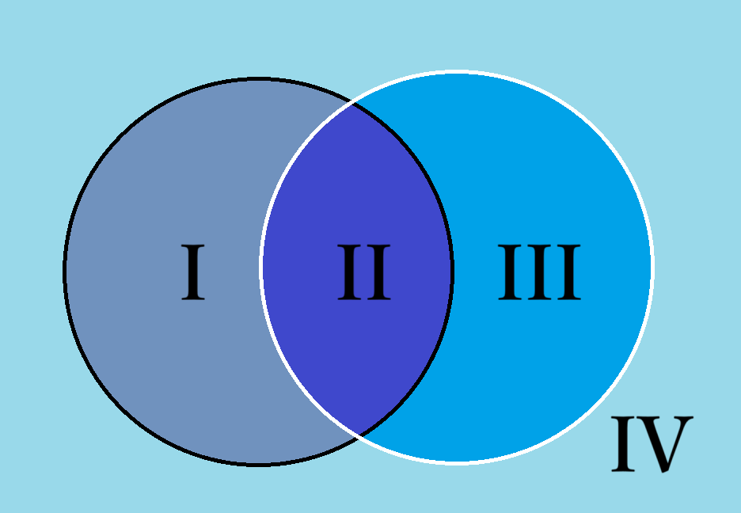
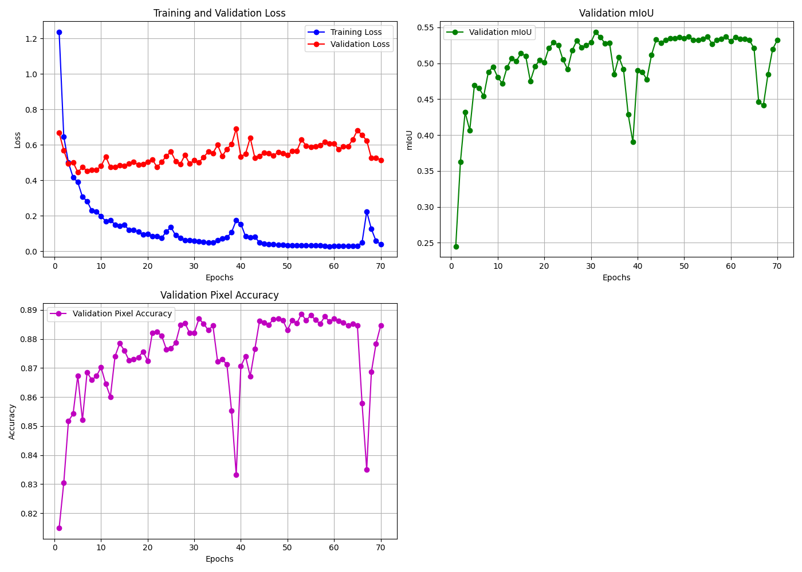

# 图像语义分割和目标检测相关模型复现手记

## 语义分割

### FCN

#### 架构

（其实我本来想直接上 U-Net 的，因为我一开始读 FCN 文章的时候就对这个架构有两个疑点，结果发现 U-Net 都能解决……）

本文主要复现的是 FCN-8s。它的前半截编码器部分是 VGG-16，于是我们又可以快乐地使用 ImageNet 预训练权重了。先回顾一下 VGG-16 的结构：


这里我们取到 `Maxpool 5` 之前的地方就够了，这样 VGG-16 的输出就是一张 `512@7x7` 的低分辨率特征图。然后 FCN 在这里就出现了几个变体（或者说一个演进的过程）：

首先考虑把这个特征图直接上采样到 224x224，我们肯定不能用什么线性插值、立方插值、Lanczos 插值等算法，因为它只是插值而不引入新信息。这就要祭出我们在 DC-GAN 以及 SRCNN 等生成式模型里面见到的 `ConvTranspose2d` 了。之前在分类模型下面没有细讲，这里简要介绍一下：`ConvTranspose2d` 的原理是在原有像素的四周均匀插 0 得到和目标大小一致的大图，然后再在这个大图上面做正常卷积。

于是我们通过步长为 32 的转置卷积一次性将 `512@7x7` 的特征图上采样到 `n@224x224`，得到我们的目标图像。这便是 FCN-32s。这里的 32 就是转置卷积的步长，s 就是 stride 的意思。

很显然，这个 `512@7x7` 的特征图剩下的信息相比于原图已经很少了，而我们的目标是要实现**像素级**的分割，为此，FCN 提出了跳跃连接的概念：既然编码器像一个“漏斗”一样去压榨特征，那么我取压榨之前具有更丰富信息的特征图，和我后面转置卷积上采样得到的特征图一融合，不就行了嘛。这便是 FCN 提出的跳跃连接思想。（其实和 ResNet 的残差连接有点像）

这样，我们就不一次性暴力恢复，而是先利用步长为 2 的转置卷积将 `512@7x7` 的特征图上采样到 `n@14x14`，其中 n 是类别数，也就是和 `Maxpool 4` 的输出尺寸一致。这样，前一个阶段的信息经过一个 1x1 卷积合并通道之后，就可以直接融合了。而这引发了我对于 FCN 架构的第一个疑点——FCN 的论文说是将两个特征图**相加**。但是我认为在通道维直接**拼接**，可能效果更好，因为对于特征图相加之后进行的卷积操作 C1 而言，我们总能设计一个卷积核使得拼接特征图再进行卷积操作 C2 的输出和相加后进行 C1 的输出完全一样，这意味着拼接再卷积作为一个张量到张量的映射集合，其“维度”是大于相加再卷积的，因而有能力承载更多的特征。不过，我们先按照原论文来，进行相加操作，得到 `n@14x14` 的特征图。最后，我们实施一次步长为 16 的转置卷积，上采样到 `n@224x224`，由于这一步步长为 16，所以叫 FCN-16s。

这样，FCN-8s 的意思就很简单了。我们对 `n@14x14` 的特征图进行一次步长为 2 的转置卷积，再同 `Maxpool 3` 的输出特征图相加得到 `n@28x28` 的特征图，再实施一次步长为 8 的转置卷积，上采样到 `n@224x224` 即可。

FCN 的论文只做到 8s，为什么不接着往后面做呢？这就是我的第二个疑点。如果逐层应用跳跃连接，也就是 `n@28x28` 到 `n@56x56` 到 `n@112x112` 再到 `n@224x224`，每一步都以**拼接**的方式实现跳跃连接，那么我们几乎就发明了 U-Net。

下面是 FCN-8s 的架构：

```mermaid
%%{init: {'theme': 'dark', 'themeVariables': { 'darkMode': true, 'primaryColor': '#1e1e2e', 'edgeLabelBackground':'#313244', 'tertiaryColor': '#181825'}}}%%
graph LR
    %% Styling definitions
    classDef box fill:#313244,stroke:#cdd6f4,stroke-width:2px,color:#cdd6f4,radius:8px;
    classDef input fill:#585b70,stroke:#89b4fa,stroke-width:2px,color:#cdd6f4;
    classDef output fill:#313244,stroke:#f38ba8,stroke-width:2px,color:#cdd6f4;
    classDef result fill:#45475a,stroke:#a6e3a1,stroke-width:2px,color:#cdd6f4;
    classDef conv fill:#313244,stroke:#74c7ec,stroke-width:2px,color:#cdd6f4;
    classDef skip fill:#313244,stroke:#cba6f7,stroke-width:2px,color:#cdd6f4;
    classDef upsample fill:#313244,stroke:#f5c2e7,stroke-width:2px,color:#cdd6f4;

    %% Input Layer
    subgraph Input["Input"]
        A[("3 @ 224×224")]
    end
    class Input input;

    %% VGG-16 Backbone (until pool5)
    subgraph Backbone["VGG-16 Backbone"]
        %% Block 1
        subgraph Block1["Block 1"]
            B["Conv 3x64<br>3×3"]
            C["Conv 64x64<br>3×3"]
            D["MaxPool<br>2×2 stride=2"]
        end
        
        %% Block 2
        subgraph Block2["Block 2"]
            E["Conv 64x128<br>3×3"]
            F["Conv 128x128<br>3×3"]
            G["MaxPool<br>2×2 stride=2"]
        end
        
        %% Block 3
        subgraph Block3["Block 3"]
            H["Conv 128x256<br>3×3"]
            I["Conv 256x256<br>3×3"]
            J["Conv 256x256<br>3×3"]
            K["MaxPool<br>2×2 stride=2<br>(pool3)"]
        end
        
        %% Block 4
        subgraph Block4["Block 4"]
            L["Conv 256x512<br>3×3"]
            M["Conv 512x512<br>3×3"]
            N["Conv 512x512<br>3×3"]
            O["MaxPool<br>2×2 stride=2<br>(pool4)"]
        end
        
        %% Block 5
        subgraph Block5["Block 5"]
            P["Conv 512x512<br>3×3"]
            Q["Conv 512x512<br>3×3"]
            R["Conv 512x512<br>3×3"]
            S["MaxPool<br>2×2 stride=2<br>(pool5)"]
        end
    end
    
    A --> B
    B --> C --> D
    D --> E
    E --> F --> G
    G --> H
    H --> I --> J --> K
    K --> L
    L --> M --> N --> O
    O --> P
    P --> Q --> R --> S
    
    class Backbone conv;
    class Block1,Block2,Block3,Block4,Block5 box;

    %% FCN-8s Specific Layers
    subgraph FCN["FCN-8s Head"]
        %% 1x1 Convs to reduce channels to num_classes
        T["1×1 Conv<br>512→n"]
        U["1×1 Conv<br>512→n"]
        V["1×1 Conv<br>256→n"]
        
        %% 2x Upsampling
        W["2x Upsample<br>transposed conv"]
        X["2x Upsample<br>transposed conv"]
        
        %% Skip connections and addition
        Y["Add<br>pool4 + 2x(pool5)"]
        Z["Add<br>pool3 + 2x(combined)"]
        
        %% Final 8x Upsampling
        AA["8x Upsample<br>transposed conv"]
    end
    
    S --> T
    O --> U
    K --> V
    T --> W
    W --> Y
    U --> Y
    Y --> X
    X --> Z
    V --> Z
    Z --> AA
    
    class FCN skip;
    class T,U,V conv;
    class W,X,AA upsample;
    class Y,Z result;

    %% Output Layer
    subgraph Output["Output"]
        AB[("n @ 224×224<br>(Segmentation Mask)")]
    end
    AA --> AB
    class Output output;

    %% Styling
    style A stroke-dasharray: 5 5
    style AB stroke:#a6e3a1,stroke-width:3px
    
    %% Skip connection annotations
    linkStyle 15 stroke:#cba6f7,stroke-width:2px,stroke-dasharray: 5 5;
    linkStyle 16 stroke:#cba6f7,stroke-width:2px,stroke-dasharray: 5 5;
```



#### 指标

先前的图像分类任务里面，我们基本上没有去衡量除了准确率和损失之外的其他指标，但是语义分割和目标检测这一块，我们就不仅要关注类别对不对，更要关注分割/检测是否到位。

让我们来回顾一下概率论课程中的参数推断，里面提到两种错误：**拒真**和**取伪**（或者叫假阳假阴或者第一类错误第二类错误什么的），如果我们把这两种错误的频数和两种正确的频数放到一起，就得到了**混淆矩阵**：

||预测为真|预测为假|总和|
|:-:|:-:|:-:|:-:|
|实际为真|真阳性 TP|假阴性 TN|真样本数 T|
|实际为假|假阳性 FP|真阴性 FN|假样本数 F|
|总和|阳性数 P|阴性数 N|总数 S|

那么我们就可以以此来评估模型性能了：

$$
\begin{align*}
    \mathrm{Acc.}&=\frac{\mathrm{TP}+\mathrm{FN}}{\mathrm{S}}\\
    \mathrm{Prec.}&=\frac{\mathrm{TP}}{\mathrm{P}}=1-\frac{\mathrm{FP}}{\mathrm{P}}\\
    \mathrm{Recall}&=\frac{\mathrm{TP}}{\mathrm{TP}+\mathrm{FN}}
\end{align*}
$$

第一个是**准确率**即预测正确占总数的比例。第二个是**精准率**，越高说明假阴性/假阳性的占比越低。最后一个是**召回率**，可以理解成在预测正确的情况下，模型有多大意愿给出阴性/阳性结果。在语义分割的语境下，我们在单张图片的像素意义上计算这些指标，也就是说我们可以得到像素准确率 PA。



如图，假设黑圈是 ground truth 而白圈是 prediction，那么以上三个率就能可视化了。

如果做的是像 Pascal VOC 这样的多类别语义分割，我们给每个类别都计算 PA，然后求平均，就得到一个总的计算准确率的指标：平均类别像素准确率 mPA。

另一方面，我们其实希望白圈和黑圈尽可能重合，其实就是**相交得更多，不属于相交的部分更少**。为此，我们可以引入一个指标来衡量：交并比 IoU，也就是 II 区域的面积除以 I、II 和 III 区域的面积之和。

$$
\mathrm{IoU}=\dfrac{\mathrm{TP}}{\mathrm{T}+\mathrm{P}-\mathrm{TP}}
$$

同样的，我们可以计算类别平均交并比 mIoU。

下面的代码就实现了基于混淆矩阵计算 PA 和 mIoU。

```python
def compute_metrics(hist):
    pixel_accuracy = np.diag(hist).sum() / hist.sum() # 对角线元素都是预测正确的
    iou = np.diag(hist) / (hist.sum(axis=1) + hist.sum(axis=0) - np.diag(hist))
    # 忽略NaN值（例如某个类别在验证集中从未出现过）
    miou = np.nanmean(iou)
    return pixel_accuracy, miou
```

FCN 的损失函数当简单：其实我们等于是**对一个和原图尺寸一致的像素阵列做独立的分类**，那么和分类任务一样，**直接沿用交叉熵损失即可**！

#### 实现细节

这里的细节主要是来讲 FCN-8s 这个类的具体实现。

```python
class FCN8s(nn.Module):
    def __init__(self, num_classes):
        super(FCN8s, self).__init__()
        # 预训练 VGG16
        vgg = vgg16(weights=VGG16_Weights.IMAGENET1K_V1)
        features = vgg.features
        
        # 提取不同阶段的特征图
        # 在 PyTorch 的实现中，VGG 的连续卷积-池化操作是保存在 vgg.features 这个 list 里面
        # [64, 64, 'M', 128, 128, 'M', 256, 256, 256, 'M', 512, 512, 512, 'M', 512, 512, 512, 'M'] 其中 M 就是 Maxpool
        # 由于这个 list 被封印进 nn.Sequnential 里面，所以可以直接调用，输出就是特征图
        self.pool3_features = features[:17]   # 到 pool3
        self.pool4_features = features[17:24] # 到 pool4
        self.pool5_features = features[24:]   # 到 pool5
        
        # 全连接层改为卷积层（FCN）
        # VGG 的第一个 Linear: 512@7x7 -> 4096@7x7
        # 当然这里为了适应任意宽度的输出，可以使用 GAP
        # 不过我们可以利用上 VGG 的预训练权重，比起重新训效果肯定更好
        self.fc6 = nn.Conv2d(512, 4096, kernel_size=7, padding=3)
        self.relu6 = nn.ReLU(inplace=True)
        self.drop6 = nn.Dropout2d()
        
        # VGG 的第二个 Linear: 4096@7x7 -> 4096@7x7
        # 仍然是拷贝权重然后 reshape 到卷积核
        self.fc7 = nn.Conv2d(4096, 4096, kernel_size=1)
        self.relu7 = nn.ReLU(inplace=True)
        self.drop7 = nn.Dropout2d()
        
        # 仍然是靠 1x1 卷积负责得到一个 num_classes@7x7 的分类得分
        self.score_fr = nn.Conv2d(4096, num_classes, kernel_size=1)
        
        # 通过 1x1 卷积得到 num_classes@HxW 的特征图用于跳跃连接
        self.score_pool3 = nn.Conv2d(256, num_classes, kernel_size=1)
        self.score_pool4 = nn.Conv2d(512, num_classes, kernel_size=1)
        
        # 上采样层
        self.upscore2 = nn.ConvTranspose2d(num_classes, num_classes, kernel_size=4, stride=2, padding=1, bias=False)
        self.upscore_pool4 = nn.ConvTranspose2d(num_classes, num_classes, kernel_size=4, stride=2, padding=1, bias=False)

        # 将 VGG classifier 的 fc6/fc7 预训练权重拷贝到卷积层
        with torch.no_grad():
            # vgg.classifier: [Linear(25088,4096), ReLU, Dropout, Linear(4096,4096), ReLU, Dropout, Linear(4096,1000)]
            # view(4096, 512, 7, 7) 操作就是把 25088x4096 的线性层 reshape 到这个形状的张量
            fc6_w = vgg.classifier[0].weight.view(4096, 512, 7, 7)
            fc6_b = vgg.classifier[0].bias
            self.fc6.weight.copy_(fc6_w)
            self.fc6.bias.copy_(fc6_b)

            # 这里也是同样的操作转换成张量
            fc7_w = vgg.classifier[3].weight.view(4096, 4096, 1, 1)
            fc7_b = vgg.classifier[3].bias
            self.fc7.weight.copy_(fc7_w)
            self.fc7.bias.copy_(fc7_b)

        # 反卷积层用双线性插值进行初始化
        # 反卷积和初始化的细节在后面说明
        with torch.no_grad():
            self.upscore2.weight.copy_(bilinear_kernel(num_classes, num_classes, 4))
            self.upscore_pool4.weight.copy_(bilinear_kernel(num_classes, num_classes, 4))

    def forward(self, x):
        input_size = x.shape[2:] # (B, C, H, W) -> (H, W)
        
        # 直接得到 pool3, pool4, pool5 后的特征图
        pool3 = self.pool3_features(x)
        pool4 = self.pool4_features(pool3)
        pool5 = self.pool5_features(pool4)
        
        # 1x1 卷积得到我们需要的 num_classes@7x7 的特征图
        h = self.relu6(self.fc6(pool5))
        h = self.drop6(h)
        h = self.relu7(self.fc7(h))
        h = self.drop7(h)
        h = self.score_fr(h)

        # 第一次上采样通过转置卷积输出宽高扩张一倍的特征图
        upscore2 = self.upscore2(h)
        
        # 跳连 pool4
        score_pool4 = self.score_pool4(pool4)
        # 这里用双线性插值适应特征图大小
        upscore2 = F.interpolate(upscore2, size=score_pool4.size()[2:], mode='bilinear', align_corners=False)
        fuse_pool4 = upscore2 + score_pool4
        
        # 第二次上采样通过转置卷积输出宽高扩张一倍的特征图
        upscore_pool4 = self.upscore_pool4(fuse_pool4)
        
        # 跳连 pool3
        score_pool3 = self.score_pool3(pool3)
        # 同样使用双线性插值适应大小
        upscore_pool4 = F.interpolate(upscore_pool4, size=score_pool3.size()[2:], mode='bilinear', align_corners=False)
        fuse_pool3 = upscore_pool4 + score_pool3
        
        # 最终上采样到输入尺寸，直接插值，省时高效
        out = F.interpolate(fuse_pool3, size=input_size, mode='bilinear', align_corners=False)
        return out
```

可以看到除开之前提到的整体架构以外，代码还有一些小细节。

首先是**反卷积的双线性插值初始化**。这一部分代码如下：

```python
def bilinear_kernel(in_channels, out_channels, kernel_size):
    """生成双线性插值的反卷积初始化权重"""
    factor = (kernel_size + 1) // 2
    if kernel_size % 2 == 1:
        center = factor - 1
    else:
        center = factor - 0.5
    og = np.ogrid[:kernel_size, :kernel_size] # 生成两个二维数组，分别表示行和列的索引网格。
    filt = (1 - abs(og[0] - center) / factor) * (1 - abs(og[1] - center) / factor)
    weight = np.zeros((in_channels, out_channels, kernel_size, kernel_size), dtype=np.float32)
    for i in range(min(in_channels, out_channels)):
        weight[i, i, :, :] = filt
    return torch.from_numpy(weight)
```

这里关键是 `filt` 的计算，本质上就是卷积核内部计算对应的行到边界的归一化曼哈顿距离乘以对应的列到边界的归一化曼哈顿距离。对于从小图到大图的转置卷积而言，大图里面两个源于小图的像素之间的像素，就可以根据到这两个像素的曼哈顿距离作为比例来混合得到。也就是说即使我们还没有从网络里面学到任何知识，这个卷积核至少还可以不破坏原有信息而直接插值放大。同时本来 FCN 的卷积核就需要对特征图进行放大，这无疑是相比随机初始化更高效的初始化方法。

下面是完整的训练代码，关于数据加载和增强的大量工程性代码就不细讲了。

<details>

<summary> FCN-8s 完整训练代码 </summary>

```python
import os
import torch
import torch.nn as nn
import torch.optim as optim
from torch.utils.data import Dataset, DataLoader
import torchvision.transforms as T
from torchvision.models import vgg16, VGG16_Weights
import torch.nn.functional as F
from PIL import Image
import numpy as np
import matplotlib.pyplot as plt
from tqdm.notebook import tqdm
import time
import warnings
warnings.filterwarnings("ignore", "(Possibly )?corrupt EXIF data", UserWarning)

# --- 配置 ---
DEVICE = "cuda" if torch.cuda.is_available() else "cpu"
DATA_PATH = "/kaggle/input/pascal-voc-2012/VOC2012/"
NUM_CLASSES = 21  # 20类 + 背景
BATCH_SIZE = 16
NUM_WORKERS = 6
LEARNING_RATE = 1e-4
WEIGHT_DECAY = 1e-4
EPOCHS = 25

print(f"Using device: {DEVICE}")

# PASCAL VOC 2012 颜色映射 (RGB)
VOC_COLORMAP = [
    [0, 0, 0], [128, 0, 0], [0, 128, 0], [128, 128, 0], [0, 0, 128],
    [128, 0, 128], [0, 128, 128], [128, 128, 128], [64, 0, 0], [192, 0, 0],
    [64, 128, 0], [192, 128, 0], [64, 0, 128], [192, 0, 128], [64, 128, 128],
    [192, 128, 128], [0, 64, 0], [128, 64, 0], [0, 192, 0], [128, 192, 0],
    [0, 64, 128]
]

# 颜色到类别索引的查表
colormap2label = torch.zeros(256 ** 3, dtype=torch.long)
for i, colormap in enumerate(VOC_COLORMAP):
    colormap2label[(colormap[0] * 256 + colormap[1]) * 256 + colormap[2]] = i

def voc_label_indices(mask, colormap2label):
    """将RGB mask (PIL Image) 转换为类别索引mask (Torch Tensor)"""
    mask_rgb = np.array(mask, dtype=np.int32)
    idx = (mask_rgb[:, :, 0] * 256 + mask_rgb[:, :, 1]) * 256 + mask_rgb[:, :, 2]
    return colormap2label[idx]

class VOCSegmentationDataset(Dataset):
    def __init__(self, root, image_set='train', transforms=None):
        self.root = root
        self.transforms = transforms
        self.image_set = image_set
        
        voc_dir = os.path.join(self.root)
        image_dir = os.path.join(voc_dir, 'JPEGImages')
        mask_dir = os.path.join(voc_dir, 'SegmentationClass')
        
        splits_dir = os.path.join(voc_dir, 'ImageSets', 'Segmentation')
        split_f = os.path.join(splits_dir, image_set.rstrip('\n') + '.txt')
        
        with open(os.path.join(split_f), "r") as f:
            file_names = [x.strip() for x in f.readlines()]
            
        self.images = [os.path.join(image_dir, x + ".jpg") for x in file_names]
        self.masks = [os.path.join(mask_dir, x + ".png") for x in file_names]
        
        assert len(self.images) == len(self.masks)

    def __len__(self):
        return len(self.images)

    def __getitem__(self, idx):
        image = Image.open(self.images[idx]).convert('RGB')
        # 打开 palette mask（不转RGB，后续再处理）
        mask = Image.open(self.masks[idx])
        
        if self.transforms is not None:
            image, target = self.transforms(image, mask)
        else:
            # 兜底转换（通常不会走到这里）
            image = T.functional.to_tensor(image)
            image = T.functional.normalize(image, (0.485, 0.456, 0.406), (0.229, 0.224, 0.225))
            target = torch.from_numpy(np.array(mask, dtype=np.uint8)).long()
        
        return image, target

class SegmentationTransforms:
    def __init__(self, is_train=True, base_size=520, crop_size=480):
        self.is_train = is_train
        self.base_size = base_size
        self.crop_size = crop_size
        self.mean = (0.485, 0.456, 0.406)
        self.std = (0.229, 0.224, 0.225)
    
    def __call__(self, img, mask):  # img, mask: PIL
        # 如果任一边小于 base_size，按短边放大，保持比例
        w, h = img.size
        if w < self.base_size or h < self.base_size:
            if w < h:
                ow = self.base_size
                oh = int(self.base_size * h / w)
            else:
                oh = self.base_size
                ow = int(self.base_size * w / h)
            img = img.resize((ow, oh), Image.BILINEAR)
            mask = mask.resize((ow, oh), Image.NEAREST)

        if self.is_train:
            # 随机裁剪到 crop_size
            x1 = np.random.randint(0, img.width - self.crop_size + 1)
            y1 = np.random.randint(0, img.height - self.crop_size + 1)
            img = img.crop((x1, y1, x1 + self.crop_size, y1 + self.crop_size))
            mask = mask.crop((x1, y1, x1 + self.crop_size, y1 + self.crop_size))
            # 随机水平翻转
            if np.random.rand() > 0.5:
                img = T.functional.hflip(img)
                mask = T.functional.hflip(mask)
        else:
            # 验证集不裁剪，保持整图评估
            pass

        # 转 Tensor 并标准化（仅 image）
        img = T.functional.to_tensor(img)
        img = T.functional.normalize(img, self.mean, self.std)
        
        # mask -> 语义标签索引（使用颜色查表），并恢复边界像素为 255 忽略
        target = voc_label_indices(mask.convert('RGB'), colormap2label)
        mask_np = np.array(mask, dtype=np.uint8)
        border_pixels = (mask_np == 255)
        if border_pixels.any():
            target[torch.from_numpy(border_pixels)] = 255
        
        return img, target

# 数据集与 DataLoader
train_dataset = VOCSegmentationDataset(DATA_PATH, image_set='train', transforms=SegmentationTransforms(is_train=True))
val_dataset = VOCSegmentationDataset(DATA_PATH, image_set='val', transforms=SegmentationTransforms(is_train=False))

train_loader = DataLoader(train_dataset, batch_size=BATCH_SIZE, shuffle=True, num_workers=NUM_WORKERS, pin_memory=True)
# 验证整图评估，batch_size 设为 1
val_loader = DataLoader(val_dataset, batch_size=1, shuffle=False, num_workers=NUM_WORKERS, pin_memory=True)

print(f"训练集样本数: {len(train_dataset)}")
print(f"验证集样本数: {len(val_dataset)}")

def bilinear_kernel(in_channels, out_channels, kernel_size):
    """生成双线性插值的反卷积初始化权重"""
    factor = (kernel_size + 1) // 2
    if kernel_size % 2 == 1:
        center = factor - 1
    else:
        center = factor - 0.5
    og = np.ogrid[:kernel_size, :kernel_size]
    filt = (1 - abs(og[0] - center) / factor) * (1 - abs(og[1] - center) / factor)
    weight = np.zeros((in_channels, out_channels, kernel_size, kernel_size), dtype=np.float32)
    for i in range(min(in_channels, out_channels)):
        weight[i, i, :, :] = filt
    return torch.from_numpy(weight)

class FCN8s(nn.Module):
    def __init__(self, num_classes):
        super(FCN8s, self).__init__()
        # 预训练 VGG16
        vgg = vgg16(weights=VGG16_Weights.IMAGENET1K_V1)
        features = vgg.features
        
        # 提取不同阶段的特征图
        self.pool3_features = features[:17]   # 到 pool3
        self.pool4_features = features[17:24] # 到 pool4
        self.pool5_features = features[24:]   # 到 pool5
        
        # 全连接层改为卷积层（FCN）
        self.fc6 = nn.Conv2d(512, 4096, kernel_size=7, padding=3)
        self.relu6 = nn.ReLU(inplace=True)
        self.drop6 = nn.Dropout2d()
        
        self.fc7 = nn.Conv2d(4096, 4096, kernel_size=1)
        self.relu7 = nn.ReLU(inplace=True)
        self.drop7 = nn.Dropout2d()
        
        self.score_fr = nn.Conv2d(4096, num_classes, kernel_size=1)
        
        # 跳连 1x1
        self.score_pool3 = nn.Conv2d(256, num_classes, kernel_size=1)
        self.score_pool4 = nn.Conv2d(512, num_classes, kernel_size=1)
        
        # 上采样层（反卷积）
        self.upscore2 = nn.ConvTranspose2d(num_classes, num_classes, kernel_size=4, stride=2, padding=1, bias=False)
        self.upscore_pool4 = nn.ConvTranspose2d(num_classes, num_classes, kernel_size=4, stride=2, padding=1, bias=False)

        # 1) 将 VGG classifier 的 fc6/fc7 预训练权重拷贝到卷积层
        with torch.no_grad():
            # vgg.classifier: [Linear(25088,4096), ReLU, Dropout, Linear(4096,4096), ReLU, Dropout, Linear(4096,1000)]
            fc6_w = vgg.classifier[0].weight.view(4096, 512, 7, 7)
            fc6_b = vgg.classifier[0].bias
            self.fc6.weight.copy_(fc6_w)
            self.fc6.bias.copy_(fc6_b)

            fc7_w = vgg.classifier[3].weight.view(4096, 4096, 1, 1)
            fc7_b = vgg.classifier[3].bias
            self.fc7.weight.copy_(fc7_w)
            self.fc7.bias.copy_(fc7_b)

        # 2) 反卷积层用双线性插值进行初始化
        with torch.no_grad():
            self.upscore2.weight.copy_(bilinear_kernel(num_classes, num_classes, 4))
            self.upscore_pool4.weight.copy_(bilinear_kernel(num_classes, num_classes, 4))

    def forward(self, x):
        input_size = x.shape[2:] # H, W
        
        pool3 = self.pool3_features(x)
        pool4 = self.pool4_features(pool3)
        pool5 = self.pool5_features(pool4)
        
        # FC -> Conv
        h = self.relu6(self.fc6(pool5))
        h = self.drop6(h)
        h = self.relu7(self.fc7(h))
        h = self.drop7(h)
        
        h = self.score_fr(h)
        # 第一次上采样 (x2)
        upscore2 = self.upscore2(h)
        
        # 跳连 pool4
        score_pool4 = self.score_pool4(pool4)
        upscore2 = F.interpolate(upscore2, size=score_pool4.size()[2:], mode='bilinear', align_corners=False)
        fuse_pool4 = upscore2 + score_pool4
        
        # 第二次上采样 (x2)
        upscore_pool4 = self.upscore_pool4(fuse_pool4)
        
        # 跳连 pool3
        score_pool3 = self.score_pool3(pool3)
        upscore_pool4 = F.interpolate(upscore_pool4, size=score_pool3.size()[2:], mode='bilinear', align_corners=False)
        fuse_pool3 = upscore_pool4 + score_pool3
        
        # 最终上采样到输入尺寸
        out = F.interpolate(fuse_pool3, size=input_size, mode='bilinear', align_corners=False)
        return out

model = FCN8s(num_classes=NUM_CLASSES).to(DEVICE)

def compute_metrics(hist):
    pixel_accuracy = np.diag(hist).sum() / hist.sum()
    iou = np.diag(hist) / (hist.sum(axis=1) + hist.sum(axis=0) - np.diag(hist))
    miou = np.nanmean(iou)
    return pixel_accuracy, miou

def train_one_epoch(model, optimizer, criterion, data_loader, device, scaler):
    model.train()
    total_loss = 0
    progress_bar = tqdm(data_loader, desc="Training", leave=False)
    for images, targets in progress_bar:
        images = images.to(device)
        targets = targets.to(device)
        
        optimizer.zero_grad()
        with torch.amp.autocast(device_type='cuda'):
            outputs = model(images)
            loss = criterion(outputs, targets)

        scaler.scale(loss).backward()
        scaler.step(optimizer)
        scaler.update()

        total_loss += loss.item()
        progress_bar.set_postfix(loss=f'{loss.item():.4f}')
        
    return total_loss / len(data_loader)

@torch.no_grad()
def evaluate(model, criterion, data_loader, device, num_classes):
    model.eval()
    total_loss = 0
    confusion_matrix = np.zeros((num_classes, num_classes), dtype=np.int64)
    
    progress_bar = tqdm(data_loader, desc="Evaluating", leave=False)
    for images, targets in progress_bar:
        images = images.to(device)
        targets = targets.to(device)
        
        with torch.amp.autocast(device_type='cuda'):
            outputs = model(images)
            loss = criterion(outputs, targets)
        
        total_loss += loss.item()
        
        preds = torch.argmax(outputs, dim=1).cpu().numpy()
        targets_np = targets.cpu().numpy()
        
        # 忽略标签为255的像素
        mask = targets_np != 255
        
        # 更新混淆矩阵（整图评估）
        np.add.at(confusion_matrix, (targets_np[mask], preds[mask]), 1)

    avg_loss = total_loss / len(data_loader)
    pixel_acc, miou = compute_metrics(confusion_matrix)
    return avg_loss, pixel_acc, miou

criterion = nn.CrossEntropyLoss(ignore_index=255)
optimizer = optim.AdamW(model.parameters(), lr=LEARNING_RATE, weight_decay=WEIGHT_DECAY)

# 混合精度
scaler = torch.amp.GradScaler('cuda')

# 记录指标
history = {
    'train_loss': [],
    'val_loss': [],
    'val_pa': [],
    'val_miou': []
}

print("开始训练...")
start_time = time.time()

for epoch in range(EPOCHS):
    train_loss = train_one_epoch(model, optimizer, criterion, train_loader, DEVICE, scaler)
    val_loss, val_pa, val_miou = evaluate(model, criterion, val_loader, DEVICE, NUM_CLASSES)
    
    history['train_loss'].append(train_loss)
    history['val_loss'].append(val_loss)
    history['val_pa'].append(val_pa)
    history['val_miou'].append(val_miou)
    
    print(
        f"Epoch {epoch+1}/{EPOCHS} | "
        f"Train Loss: {train_loss:.4f} | "
        f"Val Loss: {val_loss:.4f} | "
        f"Val Pixel Acc: {val_pa:.4f} | "
        f"Val mIoU: {val_miou:.4f}"
    )

end_time = time.time()
print(f"\n训练完成！总耗时: {(end_time - start_time) / 60:.2f} 分钟")
print("\n--- 最终评估指标 ---")
print(f"最终验证损失: {history['val_loss'][-1]:.4f}")
print(f"最终验证像素准确率: {history['val_pa'][-1]:.4f}")
print(f"最终验证 mIoU: {history['val_miou'][-1]:.4f}")
```

</details>

#### 训练结果


