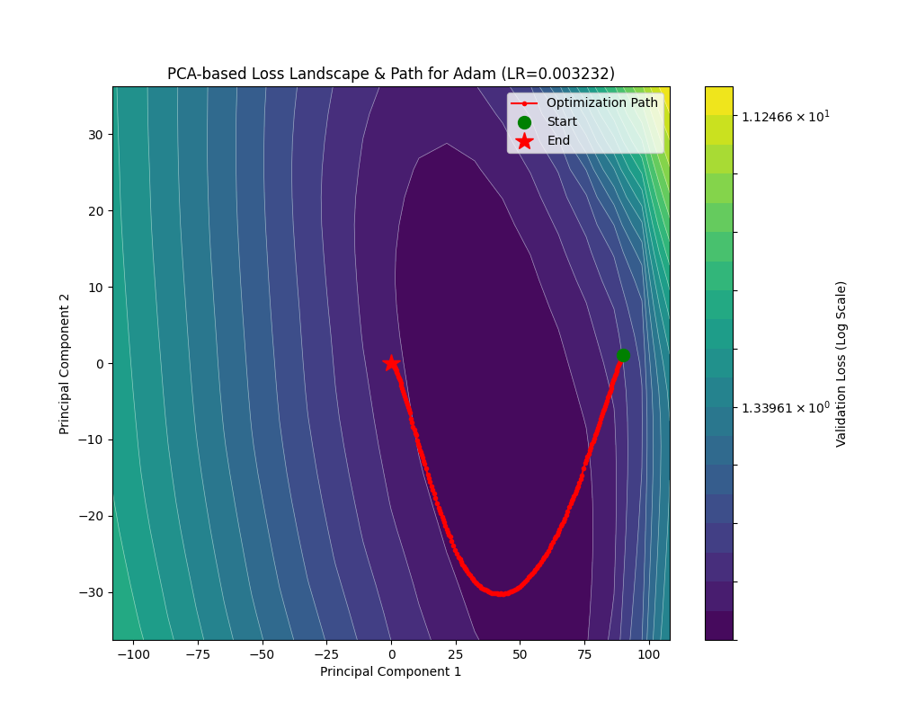
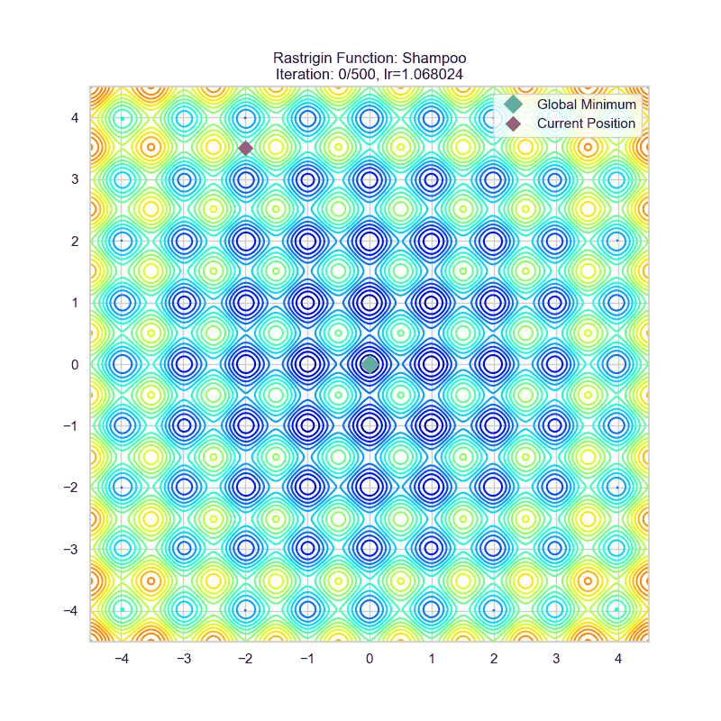
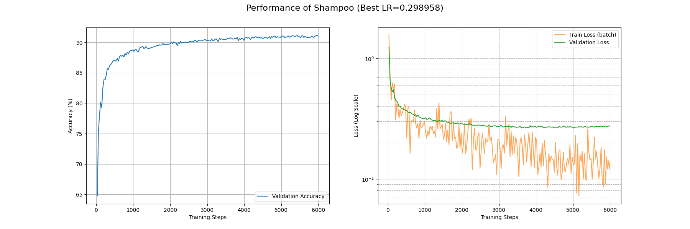

# 自适应学习率改进策略

我没要求你一定得用那种最新最好的 Optimizer，我不是恶魔。

可是，用 SGD 优化 LLM 是什么意思？你才 21 岁吧？再这样下去，你 21 岁用 SGD，42 岁用 SGD with Momentum，84 岁就该问 Who is Adam 了。

作为 $\theta$，我可能真该收敛到鞍点，真的。

## AdaGrad

### 外积近似

AdaGrad 的精髓是拿梯度近似海森矩阵 $H$，以此实现自适应调整。但是这需要我们对损失地形有更多的探索。

这一部分，我主要是参考 arXiv:2304.09871 和[苏剑林的这篇博客](https://kexue.fm/archives/10588)的内容来推导。

在目标参数 $\theta$ 附近取近似解 $\theta_n$，我们可以把梯度做一个一阶近似：$g_n=H(\theta-\theta_n)$

近似解可以随机选取，因此考虑其服从 $N(\theta, \sigma^2 I)$，为了弄出平方我们把它乘上自己的转置：

$$
g_ng_n^\top=H(\theta-\theta_n)(\theta-\theta_n)^\top H^\top
$$

事实上一开始 AdaGrad 就是考虑的采用的这种外积方案，但是计算量过大，我们考虑只取 $H$ 的对角元（这个在 SGD 中已经有效地使用过一次了），并且在期望意义下 $(\theta-\theta_n)(\theta-\theta_n)^\top=E=\sigma^2I$，这样就可以写成

$$
H\approx\dfrac{1}{\sigma}\sqrt{g_n\odot g_n}
$$

由此，便可以祭出 AdaGrad 大法了：

$$
\begin{align*}
    g_n&=\nabla\mathcal{L({x};\theta_{n-1})}\\
    G_{n}&=G_{n-1}+g_n\odot g_n\\
    \theta_n&=\theta_{n-1}-\dfrac{\eta}{\sqrt{\epsilon+G_n}} g_n
\end{align*}
$$

为了防止除零错误，$\epsilon$ 是一个小正数。在实践上也会有把 $\epsilon$ 提到根号外的情况，都是等价的。

下面是 AdaGrad 的轨迹演示：


可见 AdaGrad 对于大梯度有更大的步长，并且随着进入平缓的部分逐渐衰减。但是这仅仅类似于 SGD 加上一个自适应，并没有对 rosenbrock 这种地形做很好的适应，尤其在后期一直在梯度方向横跳。

下面是 AdaGrad 在 Fashion-MNIST 上面的表现，可能是 CNN 和自适应学习率不大对付，这里的一系列算法的 train_loss 都降得比较难。具体可以看这篇论文：arXiv:1705.08292。所以下面比较就在这几个自适应学习率优化器内部比，毕竟存在这么一个不公平，我可用的 GPU 性能也不支持在一个可行的时间内训练多个大参数量的 Transformer 模型……所以大家将就看吧，有新的实验也欢迎补充数据。


可以看到就连 6000 个 Batch 后 train_loss 都没有降到 0.1 左右。不过我们确实看到了 AdaGrad 在努力自适应损失地形，相比 SGD 系列算法，AdaGrad 在开头的下降是相当迅速的。

### AdaGrad 的代码实现

同样让我们看看 `PyTorch` 对这个算法的实现。

<details>

<summary>AdaGrad 的实现</summary>

```python
# _get_value(t: Tensor) -> float: 从单元素张量中提取其浮点数值，类似于 t.item()
# _make_sparse(grad, grad_indices, grad_values): 使用给定的索引和值创建一个新的稀疏张量

def _single_tensor_adagrad(
    params: list[Tensor],
    grads: list[Tensor],
    state_sums: list[Tensor],
    state_steps: list[Tensor],
    grad_scale: Optional[Tensor],
    found_inf: Optional[Tensor],
    *,
    lr: float,
    weight_decay: float,
    lr_decay: float,
    eps: float,
    has_sparse_grad: bool,
    maximize: bool,
    differentiable: bool,
    has_complex: bool,
):
    # 这两个参数与自动混合精度（AMP）的梯度缩放有关，此特定实现不支持，因此断言它们为 None
    assert grad_scale is None and found_inf is None

    # 使用 zip 同时遍历参数、梯度、状态累加和、步数这四个列表
    for param, grad, state_sum, step_t in zip(params, grads, state_sums, state_steps):
        # 更新步数计数器（原地操作）
        step_t += 1
        # 从 Tensor 中获取步数的标量值（例如通过 .item()）
        step = _get_value(step_t)
        # 如果是最大化问题（maximize=True），则反转梯度方向，执行梯度上升
        grad = grad if not maximize else -grad

        # 应用权重衰减（L2 正则化）
        if weight_decay != 0:
            # Adagrad 的权重衰减与稀疏梯度不兼容，因为 add 操作在稀疏张量上定义不同
            if grad.is_sparse:
                raise RuntimeError(
                    "weight_decay option is not compatible with sparse gradients" # 权重衰减选项与稀疏梯度不兼容
                )
            # 对于稠密梯度，将权重衰减项加到梯度上。公式: grad = grad + param * weight_decay
            grad = grad.add(param, alpha=weight_decay)

        # 根据学习率衰减公式，计算当前步骤的有效学习率 (clr)
        # 公式: clr = lr / (1 + (step - 1) * lr_decay)
        clr = lr / (1 + (step - 1) * lr_decay)

        # 根据梯度是稀疏还是稠密，选择不同的更新路径
        if grad.is_sparse:
            # --- 稀疏梯度更新路径 ---
            # 合并稀疏梯度中相同索引的值，确保索引唯一。这对于后续的非线性操作（如平方）是必需的。
            grad = grad.coalesce()
            grad_indices = grad._indices()  # 获取稀疏梯度的非零元素索引
            grad_values = grad._values()   # 获取稀疏梯度的非零元素值

            # 将当前梯度值的平方，以稀疏张量的形式，累加到历史状态 `state_sum` 中
            state_sum.add_(_make_sparse(grad, grad_indices, grad_values.pow(2)))
            # 从 `state_sum` 中仅抽取出与当前梯度非零位置相对应的累积值
            std = state_sum.sparse_mask(grad)
            # 计算分母：对抽出的累积值开方，然后加上 eps 以保证数值稳定性
            std_values = std._values().sqrt_().add_(eps)
            # 更新参数：仅更新梯度中非零索引对应的参数元素
            # 更新公式：param[indices] -= clr * (grad_values / std_values)
            param.add_(
                _make_sparse(grad, grad_indices, grad_values / std_values), alpha=-clr
            )
        else:
            # --- 稠密梯度更新路径 ---
            # 检查参数是否为复数类型
            is_complex = torch.is_complex(param)
            if is_complex:
                # 如果是复数，则将其视为一个实数张量进行后续计算，其形状会增加一个维度2（实部和虚部）
                grad = torch.view_as_real(grad)
                state_sum = torch.view_as_real(state_sum)
                param = torch.view_as_real(param)
            
            # Adagrad 核心步骤：将梯度的平方累加到 state_sum 中（原地操作）
            # 公式: state_sum = state_sum + grad * grad
            state_sum.addcmul_(grad, grad, value=1)
            
            # 计算分母 std = sqrt(state_sum) + eps
            if differentiable:
                # 如果要求整个优化过程可微分，则使用返回新张量的 `+` 操作
                std = state_sum.sqrt() + eps
            else:
                # 否则，使用原地操作 `add_` 以节省内存并可能提高速度
                std = state_sum.sqrt().add_(eps)
            
            # 执行参数更新（原地操作）
            # 公式: param = param - clr * (grad / std)
            param.addcdiv_(grad, std, value=-clr)

            # 如果参数是复数，需要将作为实数视图的变量转换回其复数表示
            if is_complex:
                param = torch.view_as_complex(param)
                state_sum = torch.view_as_complex(state_sum)
```

</details>

AdaGrad 通过累积的 $G$ 来实现对 Hessian 的近似，**按理说**应该具有更加优秀的学习率调度。毕竟，AdaGrad 就是 Adaptive Gradient 的省略嘛！

但是事实上我们可以发现，如果在一个并不好的，梯度很大的初始位置开始进行优化，那累积在 $G_n$ 里面的梯度将会是“一辈子都抹不去的东西”，$G_n$ 的值只会越来越大，即使走出这样的地方，仍然会因为这个“历史包袱”而寸步难行（也就是初始梯度对全局影响过大）。尤其是刚刚的近似只是对靠近最优点能够很有效，有没有办法从梯度能够获得对 Hessian 矩阵的更好估计呢？这就要祭出 RMSprop 了。

## RMSprop

其实我们想要的是一种“窗口平均”，因为 $H\approx\dfrac{1}{\sigma}\sqrt{g_n\odot g_n}$ 是在接近最优点的统计意义下近似的，如果离最优点比较远，那参数更新量大一些也无妨，离最优点比较近，就不要让之前的结果影响到。

这种窗口平均肯定不能直接保存最近 $k$ 个梯度的列表再求平均，这显然太费显存：

$$
G_{n+1}=\frac 1k (kG_n+p_n-p_{n-k})
$$

其中 $p_n = g_n\odot g_n$。不过我们可以把 $p_{n-k}$ 近似成 $G_n$，也就是使用平均值来近似单一值，然后做一个变量替换 $\beta_2=\dfrac{k-1}{k}$ 来使式子好看，这样我们相比于 AdaGrad，就不用增加任何临时存储了！由此得到的是**滑动窗口平均**，即：

$$
G_{n+1} = \beta_2 G_n + (1-\beta_2)g_n\odot g_n
$$

这种平均是不是似曾相识？回想起之前关于动量法的讨论（取 $\beta_3=(1-\beta_1)$ ）：

$$
M_n=(1-\beta_1)g_n+\beta_1M_{n-1}
$$

看，这里的动量计算其实也是在取梯度的滑动窗口平均。

这就得到了 RMSprop 算法了：

$$
\begin{align*}
    g_n&=\nabla\mathcal{L({x};\theta_{n-1})}\\
    G_{n}&=\beta_2 G_n + (1-\beta_2)g_n\odot g_n\\
    \theta_n&=\theta_{n-1}-\dfrac{\eta}{\sqrt{\epsilon+G_n}} g_n
\end{align*}
$$

RMS 指的就是 $\sqrt{\epsilon+G_n}$，既有滑动窗口的平方平均 (Mean Square)，又在最后开了根(Root)。

prop的意思就是传播了。毕竟我们是对神经网络做的优化。

让我们来看看 RMSprop 的轨迹演示：


RMSprop 相比于 AdaGrad 其实只是更改了学习率自适应程度，还是没有逃脱在 rosenbrock 下反复横跳的宿命。这已经不是一般的损失地形了，必须要出重拳（雾）必须要引入动量来调整参数更新方向！——不过这都是后话了，有关讨论敬请参阅 Adam 一节。

下面看看 RMSprop 在 Fashion-MNIST 上面的性能：


在约 5000 个 Batch 后 RMSprop 的 train_loss 降到了 0.1 附近；约 2000 个 Batch 后 acc 升到了 0.9 以上。相比于 AdaGrad 有相当的提升。

### RMSprop 的代码实现

<details>

<summary>RMSprop 的实现</summary>

```python
def _single_tensor_rmsprop(
    params: list[Tensor],
    grads: list[Tensor],
    square_avgs: list[Tensor],
    grad_avgs: list[Tensor],
    momentum_buffer_list: list[Tensor],
    state_steps: list[Tensor],
    *,
    lr: float,
    alpha: float,
    eps: float,
    weight_decay: float,
    momentum: float,
    centered: bool,
    maximize: bool,
    differentiable: bool,
    capturable: bool,
    has_complex: bool,
):
    # 循环遍历每一个参数及其对应的梯度和状态
    for i, param in enumerate(params):
        # 获取当前参数的更新步数
        step = state_steps[i]

        # --- CUDA Graph 捕获相关的检查 ---
        # 如果代码正在被 torch.compile 编译，编译器会处理图捕获的检查。
        # 见 note [torch.compile x capturable]
        if not torch.compiler.is_compiling() and capturable:
            # 获取支持 CUDA Graph 捕获的设备列表（通常是 'cuda'）
            capturable_supported_devices = _get_capturable_supported_devices()
            # 断言：如果启用了 capturable，参数和其状态必须在支持的设备上
            assert (
                param.device.type == step.device.type
                and param.device.type in capturable_supported_devices
            ), f"If capturable=True, params and state_steps must be on supported devices: {capturable_supported_devices}."

        # 获取当前参数的梯度
        grad = grads[i]
        # 如果是最大化问题 (maximize=True)，则反转梯度方向（梯度上升）
        grad = grad if not maximize else -grad
        # 获取当前参数的梯度平方的移动平均值
        square_avg = square_avgs[i]

        # 步数加 1
        step += 1

        # --- 权重衰减 (Weight Decay) ---
        # 如果设置了权重衰减（L2 正则化）
        if weight_decay != 0:
            # 将权重衰减项加到梯度上。公式: grad = grad + param * weight_decay
            # 也就是解耦的权重衰减。
            grad = grad.add(param, alpha=weight_decay)

        # --- 处理复数张量 ---
        # 检查参数是否为复数类型
        is_complex_param = torch.is_complex(param)
        if is_complex_param:
            # 如果是复数，将其视为实数张量进行处理。
            # 例如，一个形状为 [N] 的复数张量会变成形状为 [N, 2] 的实数张量，
            # 最后一维分别代表实部和虚部。
            param = torch.view_as_real(param)
            grad = torch.view_as_real(grad)
            square_avg = torch.view_as_real(square_avg)

        # --- 更新梯度平方的移动平均值 (RMS) ---
        # 公式: square_avg = alpha * square_avg + (1 - alpha) * grad^2
        square_avg.mul_(alpha).addcmul_(grad, grad, value=1 - alpha)

        # --- 计算分母 `avg` ---
        if centered:
            # --- Centered RMSprop ---
            # 获取梯度的移动平均值
            grad_avg = grad_avgs[i]
            if is_complex_param:
                # 同样处理复数情况
                grad_avg = torch.view_as_real(grad_avg)
            
            # 更新梯度的移动平均值。公式: grad_avg = alpha * grad_avg + (1 - alpha) * grad
            grad_avg.lerp_(grad, 1 - alpha)
            
            # 计算分母。公式: avg = sqrt(square_avg - grad_avg^2)
            # 这实际上是梯度的（移动）方差的平方根
            avg = square_avg.addcmul(grad_avg, grad_avg, value=-1).sqrt_()
        else:
            # --- 标准 RMSprop ---
            # 计算分母。公式: avg = sqrt(square_avg)
            avg = square_avg.sqrt()

        # --- 添加 epsilon 以保证数值稳定性 ---
        if differentiable:
            # 如果要求操作可微分，使用 `add` (返回新张量) 而不是 `add_` (原地修改)
            avg = avg.add(eps)
        else:
            # 否则，使用原地操作 `add_` 以提高效率，防止分母为零
            avg = avg.add_(eps)

        # --- 参数更新步骤 ---
        if momentum > 0:
            # --- 带动量的更新 ---
            # 获取动量缓冲
            buf = momentum_buffer_list[i]
            if is_complex_param:
                 # 同样处理复数情况
                buf = torch.view_as_real(buf)
            
            # 更新动量缓冲。公式: buf = momentum * buf + grad / avg
            buf.mul_(momentum).addcdiv_(grad, avg)
            # 使用动量缓冲更新参数。公式: param = param - lr * buf
            param.add_(buf, alpha=-lr)
        else:
            # --- 不带动量的标准更新 ---
            # 直接更新参数。公式: param = param - lr * (grad / avg)
            param.addcdiv_(grad, avg, value=-lr)
```

</details>

代码里面提到了 Centered RMSprop，其实还是为了解决“不在最小值周围”的问题。因为我们在最小值周围选点，梯度的期望是 $0$，但是如果不在周围，梯度的期望就要另行计算，怎么计算呢？和之前的思路一样，同步对梯度做滑动窗口平均即可，然后计算 $G_n$ 的适合，减去这个期望平方值，就相当于做了一次中心化了。

代码里面还提到了“动量缓冲”，可以这样理解：RMSprop 是自适应学习率的 SGD，那么我们用相同的方式给 SGDM 添加自适应学习率，就得到了 RMSprop with Momentum 了，具体实现参考刚刚的代码，其实就是使用动量项 $M_n = \beta_3 M_{n-1} + \dfrac{\eta}{\sqrt{\epsilon+G_n}} g_n$ 再乘以学习率作为参数更新量。

### AdaDelta

让我们回到在 AdaGrad 里面讨论的海森矩阵近似：

$$
H\approx\dfrac{1}{\sigma}\sqrt{g_n\odot g_n}
$$

在 RMSprop 中，我们能够高效计算 $\sqrt{g_n\odot g_n}$，而对于 $\sigma$，我们直接用学习率估计的，但考虑到 $\sigma$ 自身的意义（也就是 $\mathbb{E}[(\theta_n-\theta)(\theta_n-\theta)^\top]$ 即参数离最优解的期望欧几里得距离），如果当前预期参数比较远，$\sigma$ 就该比较大，反之则较小。怎么估计这个距离呢？AdaDelta 提出的方案是使用**参数更新量的滑动窗口平均**。也就是：

$$
\begin{align*}
    g_n&=\nabla\mathcal{L({x};\theta_{n-1})}\\
    G_{n}&=\beta_2 G_n + (1-\beta_2)g_n\odot g_n\\
    X_n&=\beta_4X_{n-1}+(1-\beta_4)\Delta\theta_{n-1}\odot\Delta\theta_{n-1}\\
    \theta_n&=\theta_{n-1}-\dfrac{\sqrt{\epsilon+X_n}}{\sqrt{\epsilon+G_n}} g_n
\end{align*}
$$

可以看到 AdaDelta 已经完全实现了自适应调节，连学习率的估计都实现了自动化调整。

让我们看看轨迹：


可以看到相比于之前的几个 Ada（Adaptive 的省写）优化器，尽管 AdaDelta 的学习率大了好几倍，在参数更新量上面还是偏保守。


在 Fashion-MNIST 上面 AdaDelta 的效果仍然受限于保守的参数更新量，过了 6000 个 batch 后 train_loss 还没收敛到 0.1，不过大概在 3000 个 batch 后 acc 能上 0.9。

下面是 AdaDelta 的代码实现：

<details>

<summary>AdaDelta 的实现</summary>

```python
def _single_tensor_adadelta(
    params: list[Tensor],
    grads: list[Tensor],
    square_avgs: list[Tensor],
    acc_deltas: list[Tensor],
    state_steps: list[Tensor], # 注意：此函数中 state_steps 仅被递增，但未在核心算法中使用
    *,
    lr: float,
    rho: float,
    eps: float,
    weight_decay: float,
    maximize: bool,
    differentiable: bool,
    capturable: bool,
    has_complex: bool,
):
    # --- CUDA Graph 捕获相关的检查 ---
    # 如果代码正在被 torch.compile 编译，编译器会处理图捕获的检查。
    if not torch.compiler.is_compiling() and capturable:
        # 获取支持 CUDA Graph 捕获的设备列表
        capturable_supported_devices = _get_capturable_supported_devices(
            supports_xla=False
        )
        # 断言：如果启用 capturable，所有参数和状态都必须在支持的设备上
        assert all(
            p.device.type == step.device.type
            and p.device.type in capturable_supported_devices
            for p, step in zip(params, state_steps)
        ), f"如果 capturable=True, params 和 state_steps 必须在支持的设备上: {capturable_supported_devices}."

    # 循环遍历每一个参数及其对应的梯度和状态
    for param, grad, square_avg, acc_delta, step in zip(
        params, grads, square_avgs, acc_deltas, state_steps
    ):
        # 步数加 1 (在 Adadelta 核心算法中未使用，但为保持优化器接口一致性而保留)
        step += 1
        # 如果是最大化问题，则反转梯度
        grad = grad if not maximize else -grad

        # --- 应用权重衰减 ---
        if weight_decay != 0:
            grad = grad.add(param, alpha=weight_decay)

        # --- 处理复数张量 ---
        if torch.is_complex(param):
            # 将所有状态和梯度都视为实数张量进行计算
            square_avg = torch.view_as_real(square_avg)
            acc_delta = torch.view_as_real(acc_delta)
            grad = torch.view_as_real(grad)

        # --- Adadelta 算法核心步骤 ---
        
        # 1. 更新梯度平方的移动平均值 E[g^2]_t
        # 公式: E[g^2]_t = rho * E[g^2]_{t-1} + (1 - rho) * g_t^2
        square_avg.mul_(rho).addcmul_(grad, grad, value=1 - rho)
        
        # 2. 计算梯度的均方根 RMS[g]_t
        # 公式: RMS[g]_t = sqrt(E[g^2]_t + eps)
        std = square_avg.add(eps).sqrt_()
        
        # 3. 计算上一步参数更新量的均方根 RMS[Δx]_{t-1}
        # 公式: RMS[Δx]_{t-1} = sqrt(E[Δx^2]_{t-1} + eps)
        # 这里的 acc_delta 存储的是 E[Δx^2]_{t-1}
        delta = acc_delta.add(eps).sqrt_()

        # 为了可微性，如果需要，克隆 delta，以防后续的原地操作破坏计算图
        if differentiable:
            delta = delta.clone()
            
        # 4. 计算当前的参数更新量 Δx_t
        # 公式: Δx_t = (RMS[Δx]_{t-1} / RMS[g]_t) * g_t
        # delta.div_(std) 对应 -> / RMS[g]_t
        # .mul_(grad)    对应 -> * g_t
        # 此时，`delta` 变量存储的是计算出的更新量 Δx_t
        delta.div_(std).mul_(grad)
        
        # 5. 更新参数更新量平方的移动平均值 E[Δx^2]_t，为下一步做准备
        # 公式: E[Δx^2]_t = rho * E[Δx^2]_{t-1} + (1 - rho) * (Δx_t)^2
        # acc_delta 此时仍是 E[Δx^2]_{t-1}
        acc_delta.mul_(rho).addcmul_(delta, delta, value=1 - rho)

        # --- 应用最终更新 ---
        
        # 如果是复数，将计算出的实数更新量转换回复杂的视图
        if torch.is_complex(param):
            delta = torch.view_as_complex(delta)
        
        # 6. 更新参数
        # 公式: x_{t+1} = x_t - lr * Δx_t
        # PyTorch 的实现中保留了 lr 作为缩放系数，默认为 1
        param.add_(delta, alpha=-lr)
```

</details>

回到我们刚刚在 RMSprop 的讨论上，其实我们已经在动量加速和自适应学习率两条道路上走了很远了，那么，有没有一种方法，能够无缝融合，真正集这两家武功之大成呢？有的，这就是接下来要讨论的 Adam 优化器，也就是目前最广泛使用的一个优化器。

## Adam

我们已经知道，通过滑动窗口平均梯度的平方，可以得到学习率的一个自适应调整；通过引入动量，可以让我们有更快的收敛速率。如果我们将自适应学习率调整融入动量法之中，Adam 优化器就自然而然地诞生了。

具体来说，Adam 优化器是这样计算的：

$$
\begin{align*}
    g_n&=\nabla\mathcal{L({x};\theta_{n-1})}\\
    M_n&=(1-\beta_1)g_n+\beta_1M_{n-1}\\
    G_{n}&=\beta_2 G_n + (1-\beta_2)g_n\odot g_n\\
    \hat M_n&=\dfrac{M_n}{1-\beta_1^{n}}\\
    \hat G_n&=\dfrac{G_n}{1-\beta_2^{n}}\\
    \theta_n&=\theta_{n-1}-\dfrac{\eta}{\sqrt{\epsilon+\hat G_n}} \hat M_n
\end{align*}
$$

可以看到，$M_n$ 和 $G_n$ 的计算与先前的优化器并无二致，自适应学习率调整也和 RMSprop 一样。但是 Adam 还额外做了一个**随步数衰减**的缩放，这是因为迭代初期时没有填满滑动窗口导致 $M_n$ 和 $G_n$ 事实上偏小，所以需要这个 $\dfrac{1}{1-\beta^n}$ 来补偿。

现在来看看两个函数下 Adam 优化器的轨迹：


在自适应学习率的基础上引入动量之后，Adam 的性能相比 RMSprop 可以说是突飞猛进！在 rastrigin 地形下通过初始的大学习率找到正确的谷地然后慢慢衰减学习率下降到精确解；在 rosenbrock 地形下不仅不再反复横跳，还能沿着谷底有效前进。

下面看看 Adam 在 Fashion-MNIST 上的表现：




可以看到 Adam 优化器取得了相当优秀的结果：在 3500 个 Batch 后 train_loss 降到了 0.1 附近；900 个 Batch 后 acc 稳定在 0.9 以上。

等着看代码吗？别急，Adam 优化器在提出之后，也是经历了如过山车一般起伏的波折，现在的 Adam 实现早就不是原来那个 Adam 了。

何以见得？且听下回分解。

## Adam 的变体们

### AMSGrad

人怕出名猪怕壮， Adam 自宣布自己拥有 SOTA 级别的收敛效果后，便遭到了许多批评，其中许多不无道理。第一个扔过来的炸弹是收敛性问题，在 [On the Convergence of Adam and Beyond](https://openreview.net/forum?id=ryQu7f-RZ) 这篇文章里，作者认为学习率倒数的差分即

$$
\Gamma_n = \dfrac{\sqrt{G_n}}{\eta}-\dfrac{\sqrt{G_{n+1}}}{\eta}
$$

由于滑动平均的缘故，没法做到像 SGD 和 AdaGrad 一样，让它恒为正。这意味着学习率虽然自适应调整了，但是一会调大一会调小，在这反复横跳，哪来的收敛？？？

不过存在一个简单粗暴的 clip 方案来解决这个问题。既然你嫌弃学习率一会大，一会小，而造成这个出现变动的核心原因就是 $G_n$ 不单调递增，那我直接让 $G_n$ 取目前所有 $G$ 的最大值，也就是只有出现新的最大值才更新 $G_n$，不就完美解决了嘛！

也就是说相对 Adam，AMSGrad 只做了一点小修改：

$$
\begin{align*}
    g_n&=\nabla\mathcal{L({x};\theta_{n-1})}\\
    M_n&=(1-\beta_1)g_n+\beta_1M_{n-1}\\
    G_{n}&=\beta_2 G_n + (1-\beta_2)g_n\odot g_n\\
    \hat M_n&=\dfrac{M_n}{1-\beta_1^n}\\
    \hat G_n&=\max\{\hat G_{n-1},G_n\}\\
    \theta_n&=\theta_{n-1}-\dfrac{\eta}{\sqrt{\epsilon+\hat G_n}} \hat M_n
\end{align*}
$$

也就相当于把 Adam 对 $G_n$ 的修偏估计换成了取极大值，这样不仅解决了嫌 $G_n$ 偏小的问题，还解决了学习率反复横跳的问题，可谓一石二鸟。

### AdamW

不过一波未平一波又起，在 arXiv:1711.05101v1 这篇文章里面，作者揭露了 Adam 优化器和 $L_2$ 正则化一同使用时出现的问题。

让我们回顾一下怎么在 SGD 上面做权重衰减：

$$
\begin{align*}
    g_{n} &= -\eta\nabla\left(\mathcal{L}({x};\theta_{n-1})+\dfrac{\lambda}{2}|\theta_{n-1}|^2\right)\\
    &=-\eta\nabla\mathcal{L}({x};\theta_{n-1})-\eta\lambda\theta_{n-1}\\
    \theta_n&=\theta_{n-1}+g_n\\
    &=(1-\eta\lambda)\theta_{n-1}-\eta\nabla\mathcal{L}(x;\theta_{n-1})
\end{align*}
$$

在 SGD 中，将 $L_2$ 正则化项的梯度（即 $\lambda\theta_{n-1}$）加到损失梯度上，与最后对权重进行乘性衰减（即乘以 $(1-\eta\lambda)$）是等效的。然而，在 Adam 这样的自适应学习率优化器中，这种等效性被打破了。

当时几乎所有的深度学习框架，在实现 Adam 的权重衰减时，都采用了将 $L_2$ 正则项的梯度加到 $\nabla\mathcal{L}$ 上的方式。这意味着，权重衰减项 $\lambda\theta_{n-1}$ 也会被 Adam 的自适应学习率 $\dfrac{\eta}{\sqrt{\epsilon+\hat G_n}}$ 所缩放。这会产生一个意想不到的后果：对于那些历史梯度很大（即 $G_n$ 很大）的权重，它们获得的权重衰减效果会变小；而对于那些不经常更新、历史梯度很小（即 $G_n$ 很小）的权重，它们的权重衰减效果反而更强。这与我们使用权重衰减的初衷——对所有的大权重进行同等惩罚——是相悖的。

AdamW 的提出就是为了解决这个问题。它的核心思想是解耦权重衰减。它不再将权重衰减伪装成 $L_2$ 正则化并加入梯度计算，而是将其从梯度更新中分离出来，直接在参数更新的最后一步实现，就像在 SGD 中那样。

这样我们就得到了 AdamW 即带有**解耦权重衰减**的 Adam 优化器：

$$
\begin{align*}
    g_n&=\nabla\mathcal{L({x};\theta_{n-1})}\\
    M_n&=(1-\beta_1)g_n+\beta_1M_{n-1}\\
    G_{n}&=\beta_2 G_n + (1-\beta_2)g_n\odot g_n\\
    \hat M_n&=\dfrac{M_n}{1-\beta_1^n}\\
    \hat G_n&=\dfrac{G_n}{1-\beta_2^n}\\
    \theta_n&=\theta_{n-1}-\dfrac{\eta}{\sqrt{\epsilon+\hat G_n}} \hat M_n-\eta\lambda\theta_{n-1}
\end{align*}
$$

至此，AdamW 大杀四方，现在已经成为transformer训练中的默认优化器了。

讲了这么多，让我们一窥代码真容：

<details>

<summary> Adam, AMSGrad, AdamW 的实现</summary>

```python
def _single_tensor_adam(
    params: list[Tensor],
    grads: list[Tensor],
    exp_avgs: list[Tensor],             # 一阶矩估计（动量） m_t
    exp_avg_sqs: list[Tensor],          # 二阶矩估计（自适应学习率项） v_t
    max_exp_avg_sqs: list[Tensor],      # AMSGrad 用的历史最大二阶矩
    state_steps: list[Tensor],          # 步数 t
    grad_scale: Optional[Tensor],
    found_inf: Optional[Tensor],
    *,
    amsgrad: bool,                      # 是否启用 AMSGrad
    has_complex: bool,
    beta1: Union[float, Tensor],        # 一阶矩的指数衰减率
    beta2: Union[float, Tensor],        # 二阶矩的指数衰减率
    lr: Union[float, Tensor],           # 学习率
    weight_decay: float,                # 权重衰减系数
    eps: float,                         # 防止除以零的极小值
    maximize: bool,
    capturable: bool,                   # 是否支持 CUDA Graph 捕获
    differentiable: bool,               # 是否要求操作可微分
    decoupled_weight_decay: bool,       # 是否使用 AdamW 的解耦权重衰减
):
    assert grad_scale is None and found_inf is None

    # 如果在 TorchScript (JIT) 环境下，由于 JIT 对类型推断的限制，直接断言超参数为 float
    if torch.jit.is_scripting():
        assert isinstance(lr, float)
        assert isinstance(beta1, float)
        assert isinstance(beta2, float)

    # 为了优化，如果 beta1 是 Tensor，预先将其按设备和类型存入字典，避免循环内重复转换
    if isinstance(beta1, Tensor):
        beta1_dict: Optional[DeviceDtypeDict] = {(beta1.device, beta1.dtype): beta1}
    else:
        beta1_dict = None

    # 循环处理每个参数
    for i, param in enumerate(params):
        grad = grads[i] if not maximize else -grads[i]
        exp_avg = exp_avgs[i]
        exp_avg_sq = exp_avg_sqs[i]
        step_t = state_steps[i]

        # --- CUDA Graph 捕获检查 ---
        if not torch.compiler.is_compiling() and capturable:
            capturable_supported_devices = _get_capturable_supported_devices()
            assert (
                param.device.type == step_t.device.type
                and param.device.type in capturable_supported_devices
            ), f"If capturable=True, params and state_steps must be on supported devices: {capturable_supported_devices}."

        # 步数加 1
        step_t += 1

        # --- 步骤 1: 应用权重衰减 ---
        if weight_decay != 0:
            if decoupled_weight_decay:
                # AdamW: 解耦权重衰减。直接在参数上乘以一个衰减因子。
                # 公式: param_t = param_t * (1 - lr * weight_decay)
                param.mul_(1 - lr * weight_decay)
            else:
                # 标准 Adam: 权重衰减作为 L2 正则化项加入梯度。
                # 公式: grad_t = grad_t + weight_decay * param_{t-1}
                # 嵌套 if 是为了处理可微分和 JIT 的情况
                if differentiable and isinstance(weight_decay, Tensor):
                    if weight_decay.requires_grad:
                        grad = grad.addcmul(param.clone(), weight_decay)
                    else:
                        grad = grad.add(param, alpha=weight_decay)
                else:
                    grad = grad.add(param, alpha=weight_decay)

        # --- 处理复数 ---
        if torch.is_complex(param):
            # 将所有相关张量都视为实数进行计算
            grad = torch.view_as_real(grad)
            exp_avg = torch.view_as_real(exp_avg)
            exp_avg_sq = torch.view_as_real(exp_avg_sq)
            if amsgrad:
                max_exp_avg_sqs[i] = torch.view_as_real(max_exp_avg_sqs[i])
            param = torch.view_as_real(param)

        device = param.device

        # 如果 beta1 是 Tensor，从字典中获取对应设备和类型的版本
        if beta1_dict is not None:
            dtype = param.dtype
            key = (device, dtype)
            if key not in beta1_dict:
                beta1_dict[key] = beta1.to(device=device, dtype=dtype, non_blocking=True)
            device_beta1: Union[float, Tensor] = beta1_dict[key]
        else:
            device_beta1 = beta1

        # --- 步骤 2: 更新一阶和二阶矩估计 ---
        # 更新一阶矩估计 m_t (exp_avg)
        # 公式: m_t = beta1 * m_{t-1} + (1 - beta1) * grad_t
        exp_avg.lerp_(grad, 1 - device_beta1)

        # 更新二阶矩估计 v_t (exp_avg_sq)
        # 公式: v_t = beta2 * v_{t-1} + (1 - beta2) * grad_t^2
        # 同样，嵌套 if 是为了处理可微分情况
        if differentiable and isinstance(beta2, Tensor):
            if beta2.requires_grad:
                # 使用 lerp 实现可微分的更新，数学上等价于下面的 addcmul
                exp_avg_sq.lerp_(torch.square(grad), weight=1 - beta2)
            else:
                exp_avg_sq.mul_(beta2).addcmul_(grad, grad, value=1 - beta2)
        else:
            exp_avg_sq.mul_(beta2).addcmul_(grad, grad, value=1 - beta2)

        # --- 步骤 3: 参数更新 ---
        # capturable 或 differentiable 模式下，所有计算都使用张量操作以保留计算图
        if capturable or differentiable:
            step = step_t

            # --- 计算偏差修正项 ---
            # 嵌套 if 用于处理 beta 是可微张量的情况
            if differentiable and isinstance(beta1, Tensor):
                if beta1.requires_grad:
                    bias_correction1 = 1 - beta1 ** step.clone()
                else:
                    bias_correction1 = 1 - beta1**step
            else:
                bias_correction1 = 1 - beta1**step

            if differentiable and isinstance(beta2, Tensor):
                if beta2.requires_grad:
                    bias_correction2 = 1 - beta2 ** step.clone()
                else:
                    bias_correction2 = 1 - beta2**step
            else:
                bias_correction2 = 1 - beta2**step

            # --- 计算更新步长和分母 ---
            step_size = lr / bias_correction1
            step_size_neg = step_size.neg()
            bias_correction2_sqrt = bias_correction2.sqrt()

            if amsgrad:
                # AMSGrad: 维护历史最大二阶矩
                if differentiable:
                    max_exp_avg_sq = max_exp_avg_sqs[i].clone()
                else:
                    max_exp_avg_sq = max_exp_avg_sqs[i]
                
                torch.maximum(max_exp_avg_sq, exp_avg_sq, out=max_exp_avg_sqs[i])
                
                # 使用最大二阶矩计算分母
                # 这里做了一些数学变换，将 step_size 合并计算，以减少张量读写
                denom = (
                    max_exp_avg_sqs[i].sqrt() / (bias_correction2_sqrt * step_size_neg)
                ).add_(eps / step_size_neg)
            else:
                # 标准 Adam: 使用当前二阶矩计算分母
                denom = (
                    exp_avg_sq.sqrt() / (bias_correction2_sqrt * step_size_neg)
                ).add_(eps / step_size_neg)

            # 执行最终更新
            if differentiable:
                param.addcdiv_(exp_avg.clone(), denom)
            else:
                param.addcdiv_(exp_avg, denom)
        
        # 非 capturable/differentiable 的常规路径（效率更高）
        else:
            step = _get_value(step_t)

            # --- 计算偏差修正项 ---
            bias_correction1 = 1 - beta1**step
            bias_correction2 = 1 - beta2**step

            # --- 计算步长和分母 ---
            step_size = lr / bias_correction1
            bias_correction2_sqrt = bias_correction2**0.5

            if amsgrad:
                # AMSGrad: 更新并使用历史最大二阶矩
                torch.maximum(max_exp_avg_sqs[i], exp_avg_sq, out=max_exp_avg_sqs[i])
                denom = (max_exp_avg_sqs[i].sqrt() / bias_correction2_sqrt).add_(eps)
            else:
                # 标准 Adam: 使用当前二阶矩
                denom = (exp_avg_sq.sqrt() / bias_correction2_sqrt).add_(eps)

            # --- 执行最终更新 ---
            # 公式: param_t = param_{t-1} - step_size * (m_hat / (sqrt(v_hat) + eps))
            param.addcdiv_(exp_avg, denom, value=-step_size)

        # --- 复数转换回来 ---
        # 如果启用了 AMSGrad 并且参数是复数，将 max_exp_avg_sqs 视图转换回来
        if amsgrad and torch.is_complex(params[i]):
            max_exp_avg_sqs[i] = torch.view_as_complex(max_exp_avg_sqs[i])
```

</details>

</details>

### Adamax

先前提到 Adam 由于无法控制 $G_n$ 的单调性而可能陷入无法收敛的状况，并且也介绍了 AMSGrad 提出的 clip 方案。而 Adamax 却提出了一个有所不同的 clip 方案。

Adamax 的思想，最初是想把 $G_n$ 对平均梯度的 $L_2$ 估计（也就是 $g_n\odot g_n$ 项）扩展到 $L_p$ 估计：

$$
G_{n}=\beta_2 G_n + (1-\beta_2)g_n^p\\
\theta_n=\theta_{n-1}-\dfrac{\eta}{G_n^{\frac 1p}} M_n
$$

我们单独把学习率自适应权重 $G_n^{\frac 1p}$ 提取出来展开算：

$$
\begin{align*}
    G_n^{\frac 1p} &= \beta_2 G_n + (1-\beta_2)g_n^p\\
    &=(1-\beta_2)^{\frac 1p}\left(\sum_{i=1}^{n}\beta_2^i g^p_{n-i}\right)^{\frac 1p}
\end{align*}
$$

显然这种推广在任意的 $p$ 下是无法解决任何问题的，但是如果我们让 $p\rightarrow\infty$ 也就是取 $L_\infty$ 范数，就会得到：

$$
\begin{align*}
    \lim_{p\rightarrow\infty}(1-\beta_2)^{\frac 1p}\left(\sum_{i=1}^{n}\beta_2^i g^p_{n-i}\right)^{\frac 1p}&=\lim_{p\rightarrow\infty}\left(\sum_{i=1}^{n}\beta_2^i g^p_{n-i}\right)^{\frac 1p}\\
    &=\max\left\{\beta_2^i |g_{n-i}|\right\}_{i=1\dots n}
\end{align*}
$$

写成递推式子就是

$$
G_n = \max\{\beta_2G_{n-1}, |g_n|\}
$$

因此 Adamax 宣称自己相对 Adam，能够解决不收敛问题，还可以简省计算量。不过这样魔改，真的能对 Hessian 做更好的估计吗……

看它在这两个损失地形上的表现，其实还不错：


再看看实际任务上面的表现：


还是较 Adam 略逊一筹啊，train_loss 降到 0.1 附近要花费接近 6000 个 Batch；acc 升到 0.9 附近需要接近 1500 个 Batch。

还是来看看代码实现吧：

<details>

<summary> Adamax 的实现</summary>

```python
def _single_tensor_adamax(
    params: list[Tensor],
    grads: list[Tensor],
    exp_avgs: list[Tensor],
    exp_infs: list[Tensor],
    state_steps: list[Tensor],
    *,
    eps: float,
    beta1: float,
    beta2: float,
    lr: float,
    weight_decay: float,
    maximize: bool,
    differentiable: bool,
    capturable: bool,
    has_complex: bool,
):
    # 循环处理每个参数
    for i, param in enumerate(params):
        grad = grads[i]
        grad = grad if not maximize else -grad
        exp_avg = exp_avgs[i]  # 一阶矩 m_t
        exp_inf = exp_infs[i]  # 无穷范数 u_t
        step_t = state_steps[i]

        # --- CUDA Graph 捕获检查 ---
        if not torch.compiler.is_compiling() and capturable:
            capturable_supported_devices = _get_capturable_supported_devices()
            assert (
                param.device.type == step_t.device.type
                and param.device.type in capturable_supported_devices
            ), f"If capturable=True, params and state_steps must be on supported devices: {capturable_supported_devices}."

        # 步数加 1
        step_t += 1

        # --- 应用权重衰减 ---
        if weight_decay != 0:
            grad = grad.add(param, alpha=weight_decay)

        # --- 处理复数 ---
        if torch.is_complex(param):
            param = torch.view_as_real(param)
            grad = torch.view_as_real(grad)
            exp_avg = torch.view_as_real(exp_avg)
            exp_inf = torch.view_as_real(exp_inf)

        # --- Adamax 算法核心步骤 ---

        # 1. 更新有偏一阶矩估计 m_t (和 Adam 一样)
        # 公式: m_t = beta1 * m_{t-1} + (1 - beta1) * g_t
        exp_avg.lerp_(grad, 1 - beta1)

        # 2. 更新指数加权无穷范数 u_t
        # 公式: u_t = max(beta2 * u_{t-1}, |g_t|)
        # 注意：PyTorch 的实现中，为了防止 u_t 在梯度为零时也为零，
        # 实际比较的是 `beta2 * u_{t-1}` 和 `|g_t| + eps`。
        if not differentiable:
            # 对于非可微模式，使用 torch.maximum 更高效
            torch.maximum(
                exp_inf.mul_(beta2),      # 计算 beta2 * u_{t-1}
                grad.abs().add_(eps),     # 计算 |g_t| + eps
                out=exp_inf,              # 将结果原地写入 exp_inf
            )
        else:
            # 对于可微模式，需要构建一个可微分的操作序列
            # 将两个要比较的张量在新的维度上拼接起来
            norm_buf = torch.cat(
                [exp_inf.mul_(beta2).unsqueeze(0), grad.abs().add_(eps).unsqueeze_(0)],
                0,
            )
            # 然后使用 amax（等价于 max）在那个新维度上求最大值
            exp_inf.copy_(torch.amax(norm_buf, 0, keepdim=False))

        # --- 步骤 3: 参数更新 ---
        
        # 针对 Capturable 模式的特殊处理路径
        if capturable:
            # 这里的数学变换是为了在 capturable 模式下避免某些操作的限制。
            # 原始公式是: clr = lr / (1 - beta1^t), 更新量是 -clr * (m_t / u_t)
            # 这里计算 neg_bias_correction = beta1^t - 1
            neg_bias_correction = beta1**step_t - 1
            # 然后除以 lr，得到 (beta1^t - 1) / lr
            neg_bias_correction.div_(lr)
            # 分母 denom = u_t * (beta1^t - 1) / lr
            denom = exp_inf * neg_bias_correction
            # 更新: param += m_t / denom = param - lr * m_t / ((1 - beta1^t) * u_t)
            param.addcdiv_(exp_avg, denom)
        else:
            # 常规模式下的更新路径
            # 计算偏差修正项
            bias_correction = 1 - beta1 ** _get_value(step_t)
            # 计算修正后的学习率
            clr = lr / bias_correction
            
            # 执行参数更新
            # 公式: θ_t = θ_{t-1} - (lr / (1 - beta1^t)) * (m_t / u_t)
            # exp_inf 就是分母 u_t
            param.addcdiv_(exp_avg, exp_inf, value=-clr)
```

</details>

### Nadam

读到这里，我相信任何一位读者都可以独立发明出 Nadam，毕竟我们在讲 SGDM 的时候花了大力气推导了 Nesterov 加速的式子，总不可能到了 Adam 这一块就完全不管了吧。是的，Nadam 的 novelty 就在于把 Nesterov 加速梯度引入到了 Adam 的计算之中。
我们考虑直接引入 Nesterov 加速项，也就是权重更新项从 $\dfrac{\eta}{\sqrt{\epsilon+\hat G_n}}\hat M_n$ 换成 $\dfrac{\eta}{\sqrt{\epsilon+\hat G_n}}[\dfrac{\beta_1 M_n}{1-\beta_1^{n-1}}+\dfrac{(1-\beta_1) g_n}{1-\beta_1^{n-1}}]$。这个也是 arXiv/1609.04747 推导出来的的。

但是考虑到 Adam 增加了对梯度二阶矩的估计，因此如果一直使用固定的 $\beta_1$ 的话，其实是偏大的。如果我们看提出 Nadam 的原论文 [Incorporating Nesterov Momentum into Adam](https://openreview.net/forum?id=OM0jvwB8jIp57ZJjtNEZ)，就可以发现它的思路有一定的差异。

在后面一篇论文中，作者并没有固定规定一个 $\beta_1$，而是使用 $\mu_{n}$ 来调整更新比例，也就是它认为动量和权重的更新应该是如下的：

$$
\begin{align*}
    M_n&=\mu_{n}M_{n-1}+\beta_3 g_n\\
    \theta_n&=\theta_{n-1}-(\mu_{n+1}M_n+\beta_3 g_n)
\end{align*}
$$

这里 $\mu_{n+1}$ 代表的就是 Nesterov 加速的前瞻性。下面我们取 $\beta_3=(1-\mu_n)$，由于是对 $\mu_n$ 进行连乘，权重更新项也就变成了 $\dfrac{\eta}{\sqrt{\epsilon+\hat G_n}}[\dfrac{\mu_{n+1} M_n}{1-\prod_{i=1}^{n+1}\mu_i}+\dfrac{(1-\mu_{n}) g_n}{1-\prod_{i=1}^{n}\mu_i}]$

为了解决之前偏大的问题，PyTorch 在 Nadam 的实现里对 $\beta_1$ 采用了衰减的策略。

具体而言，它引入了 $\mu_n=\beta_1 \left(1 - 0.5 \cdot 0.96^{n \cdot d}\right)$ 的估计，那么最后权重的更新方式变成：

$$
\begin{align*}
    g_n&=\nabla\mathcal{L({x};\theta_{n-1})}\\
    M_n&=(1-\beta_1)g_n+\beta_1M_{n-1}\\
    G_{n}&=\beta_2 G_n + (1-\beta_2)g_n\odot g_n\\
    \mu_n&=\beta_1 \left(1 - 0.5 \cdot 0.96^{n \cdot d}\right)\\
    \mu_{n+1}&=\beta_1 \left(1 - 0.5 \cdot 0.96^{(n+1) \cdot d}\right)\\
    \hat \mu_{n+1} &=\hat\mu_n \mu_{n+1}\\
    \hat M_n&=\dfrac{\mu_{n+1}M_n}{1-\hat \mu_{n+1}}\\
    \hat G_n&=\dfrac{G_n}{1-\beta_2^{n-1}}\\
    \theta_n&=\theta_{n-1}-\dfrac{\eta}{\sqrt{\epsilon+\hat G_n}} (\hat M_n+\dfrac{(1-\mu_n)g_n}{1-\hat\mu_n})
\end{align*}
$$

这是优化器的轨迹动图：


看来 Nadam 和 Adam 差不太多，并没有像 SGD 引入 NAG 那样惊艳。还是看看它在真实任务上面的表现吧：


事实上和 Adam 也没有特别大的区别：在约 2900 个 Batch 后 train_loss 降到了 0.1 附近；和 Adam 一样在约 900 个 Batch 后 acc 升到了 0.9。

下面是代码：

<details>

<summary> Nadam 的实现</summary>

```python
def _single_tensor_nadam(
    params: list[Tensor],
    grads: list[Tensor],
    exp_avgs: list[Tensor],
    exp_avg_sqs: list[Tensor],
    mu_products: list[Tensor],
    state_steps: list[Tensor],
    *,
    beta1: float,
    beta2: float,
    lr: float,
    weight_decay: float,
    momentum_decay: float,
    eps: float,
    decoupled_weight_decay: bool,
    maximize: bool,
    capturable: bool,
    differentiable: bool,
    has_complex: bool,
):
    # 循环处理每个参数
    for i, param in enumerate(params):
        grad = grads[i] if not maximize else -grads[i]
        exp_avg = exp_avgs[i]
        exp_avg_sq = exp_avg_sqs[i]
        mu_product = mu_products[i]
        step_t = state_steps[i]

        # --- 处理复数 ---
        if torch.is_complex(param):
            param = torch.view_as_real(param)
            grad = torch.view_as_real(grad)
            exp_avg = torch.view_as_real(exp_avg)
            exp_avg_sq = torch.view_as_real(exp_avg_sq)

        # --- CUDA Graph 捕获检查 ---
        if not torch.compiler.is_compiling() and capturable:
            capturable_supported_devices = _get_capturable_supported_devices()
            assert (
                param.device.type == mu_product.device.type == step_t.device.type
                and param.device.type in capturable_supported_devices
            ), "如果 capturable=True, params, mu_products 和 state_steps 必须在支持的设备上。"

        # 步数加 1
        step_t += 1

        # 根据模式获取步数值（Tensor 或 float）
        if capturable:
            step = step_t
        else:
            step = _get_value(step_t)

        # 计算二阶矩的偏差修正项
        bias_correction2 = 1 - beta2**step

        # --- 应用权重衰减 ---
        if weight_decay != 0:
            if decoupled_weight_decay:
                # NAdamW: 使用解耦权重衰减
                param.mul_(1 - lr * weight_decay)
            else:
                # 标准 NAdam: 将权重衰减作为 L2 正则化加入梯度
                grad = grad.add(param, alpha=weight_decay)

        # --- NAdam 核心步骤 ---

        # 1. 计算当前步(t)和下一步(t+1)的动量衰减调度因子 μ
        # 这个调度使得动量衰减率在训练初期较小，后期接近 beta1
        mu = beta1 * (1.0 - 0.5 * (0.96 ** (step * momentum_decay)))
        mu_next = beta1 * (1.0 - 0.5 * (0.96 ** ((step + 1) * momentum_decay)))

        # 2. 更新动量衰减因子的累积乘积
        # 公式: mu_product_t = mu_product_{t-1} * mu_t
        mu_product *= mu

        # 3. 更新一阶矩 m_t 和二阶矩 v_t (和 Adam 相同)
        # m_t = beta1 * m_{t-1} + (1 - beta1) * g_t
        exp_avg.lerp_(grad, 1 - beta1)
        # v_t = beta2 * v_{t-1} + (1 - beta2) * g_t^2
        exp_avg_sq.mul_(beta2).addcmul_(grad, grad, value=1 - beta2)
        
        # 4. 计算归一化的分母
        # denom = sqrt(v_t / bias_correction2)
        denom = exp_avg_sq.div(bias_correction2).sqrt()

        # --- 步骤 5: 参数更新 ---
        # NAdam 的更新规则可以分解为两部分：一部分与当前梯度有关，一部分与动量有关。
        # 更新公式: param_t = param_{t-1} - lr * ( (1-μ_t)*g_hat_t + μ_{t+1}*m_hat_t ) / (sqrt(v_hat_t) + eps)
        # 其中 g_hat_t 和 m_hat_t 是经过偏差修正的梯度和动量。
        # PyTorch 的实现将这个公式拆分成了两个 addcdiv 操作。

        # 可微分或可捕获模式下的路径
        if differentiable or capturable:
            denom = denom.add(eps)
            # 为了让 Autograd 跟踪操作，直接修改梯度和动量项，而不是作为 addcdiv 的标量值
            mu_product_next = mu_product * mu_next
            # 计算与梯度相关的更新部分
            grad_update_part = grad * (-lr * (1.0 - mu) / (1.0 - mu_product))
            # 计算与动量相关的更新部分
            exp_avg_update_part = exp_avg * (-lr * mu_next / (1.0 - mu_product_next))
            # 应用更新
            param.addcdiv_(grad_update_part, denom)
            param.addcdiv_(exp_avg_update_part, denom)
        else:
            # 常规模式下的路径 (更高效)
            mu_product_next = _get_value(mu_product) * mu_next
            denom.add_(eps)
            # 应用与梯度相关的更新部分
            param.addcdiv_(
                grad, denom, value=(-lr * (1.0 - mu) / (1.0 - _get_value(mu_product)))
            )
            # 应用与动量相关的更新部分
            param.addcdiv_(
                exp_avg, denom, value=(-lr * mu_next) / (1.0 - mu_product_next)
            )
```

</details>

### LAMB

Researchers 的奇怪的命名品味啊……后面我们还能看到 Lion 优化器，不知道是不是专门吃 LAMB 的……无论如何让我们来看看吧。

LAMB 在 Adam 上面的改进点在于对“何时应该多更新参数”的一个先验估计：如果本来参数大，并且算出来的更新量小，那就意味着本来应该优化的参数没有得到有效优化，也就是，如果反过来我们取 $r=\dfrac{|\theta_{n-1}|}{|\Delta\theta|}$ （被称作信任比率）再乘以原来的参数更新量，就可以实现有效优化。具体而言，LAMB 优化器的更新公式是：

$$
\begin{align*}
    g_n&=\nabla\mathcal{L({x};\theta_{n-1})}\\
    M_n&=(1-\beta_1)g_n+\beta_1M_{n-1}\\
    G_{n}&=\beta_2 G_n + (1-\beta_2)g_n\odot g_n\\
    \hat M_n&=\dfrac{M_n}{1-\beta_1^n}\\
    \hat G_n&=\dfrac{G_n}{1-\beta_2^n}\\
    \tilde M_n&=\dfrac{\eta}{\sqrt{\epsilon+\hat G_n}} \hat M_n-\eta\lambda\theta_{n-1}\\
    \theta_n&=\theta_{n-1}-\dfrac{\Phi(\theta_{n-1})}{|\tilde M_n|}\tilde{M}_n
\end{align*}
$$

这里的 $\Phi(x)$ 可以取 $x$ 也可以做裁剪取 $\max{(\min{(x,\gamma_a)},\gamma_b)}$ 来把参数控制在这样一个范围内。

LAMB 的初衷就是解决 Adam 在大批量训练的时候梯度方差过小（就是前面提到的那种情况）导致训不动或者训炸的问题。这样做看来确实比较有用，让我们来看看表现吧：


这里 rosenbrock 疑似参数有些小了。下面是实际任务的测试：


可以看到 LAMB 取得了和 Adam 差不多的水平。在约 4000 个 Batch 后 train_loss 降到了 0.1 附近；约 1000 个 Batch 后 acc 稳定在 0.9 以上。

下面是 `torch_optimizer` 库对 LAMB 的实现：

<details>

<summary> LAMB 优化器的实现 </summary>

```python
import math

import torch
# 从 PyTorch 优化器基类中导入 Optimizer
from torch.optim.optimizer import Optimizer

# 从本地类型定义文件中导入类型提示
from .types import Betas2, OptFloat, OptLossClosure, Params

# 定义当 `from module import *` 时，哪些对象会被导出
__all__ = ('Lamb',)


# 定义 Lamb 优化器类，继承自 Optimizer
class Lamb(Optimizer):
    r"""实现了 Lamb 算法。

    该算法在论文 `Large Batch Optimization for Deep Learning:
    Training BERT in 76 minutes`__ 中被提出。

    参数:
        params: 需要优化的、可迭代的参数，或定义了参数组的字典。
        lr: 学习率 (默认: 1e-3)。
        betas: 用于计算梯度的一阶和二阶矩的运行平均值的系数 (默认: (0.9, 0.999))。
        eps: 为了提高数值稳定性而加到分母上的一项 (默认: 1e-6)。
        weight_decay: 权重衰减 (L2 惩罚项) (默认: 0)。
        clamp_value: 将 weight_norm 裁剪（clamp）在 (0, clamp_value) 范围内 (默认: 10)。
                     可以将其设置为一个很大的值 (例如 10e3) 来避免裁剪。
        adam: 如果为 True，则总是使用 trust_ratio = 1，这会使算法退化为 AdamW。
              这对于进行性能比较很有用。(默认: False)。
        debias: 通过 (1 - beta**step) 来对 Adam 的矩估计进行偏差修正 (默认: False)。
                论文的最终版本没有使用此项。

    示例:
        >>> import torch_optimizer as optim
        >>> optimizer = optim.Lamb(model.parameters(), lr=0.1)
        >>> optimizer.zero_grad()
        >>> loss_fn(model(input), target).backward()
        >>> optimizer.step()

    __ https://arxiv.org/abs/1904.00962

    注意:
        参考代码: https://github.com/cybertronai/pytorch-lamb
    """

    # 类的构造函数
    def __init__(
        self,
        params: Params,
        lr: float = 1e-3,
        betas: Betas2 = (0.9, 0.999),
        eps: float = 1e-6,
        weight_decay: float = 0,
        clamp_value: float = 10,
        adam: bool = False,
        debias: bool = False,
    ) -> None:
        # --- 输入参数合法性检查 ---
        if lr <= 0.0:
            raise ValueError('无效的学习率: {}'.format(lr))
        if eps < 0.0:
            raise ValueError('无效的 epsilon 值: {}'.format(eps))
        if not 0.0 <= betas[0] < 1.0:
            raise ValueError(
                '无效的 beta 参数 (索引 0): {}'.format(betas[0])
            )
        if not 0.0 <= betas[1] < 1.0:
            raise ValueError(
                '无效的 beta 参数 (索引 1): {}'.format(betas[1])
            )
        if weight_decay < 0:
            raise ValueError(
                '无效的 weight_decay 值: {}'.format(weight_decay)
            )
        if clamp_value < 0.0:
            raise ValueError('无效的 clamp 值: {}'.format(clamp_value))

        # 将超参数打包成一个字典，作为默认配置
        defaults = dict(lr=lr, betas=betas, eps=eps, weight_decay=weight_decay)
        # 将 Lamb 特有的参数保存为类的属性
        self.clamp_value = clamp_value
        self.adam = adam
        self.debias = debias

        # 调用父类 (Optimizer) 的构造函数
        super(Lamb, self).__init__(params, defaults)

    # `step` 方法是优化器的核心，`@torch.no_grad()` 装饰器禁用梯度计算
    def step(self, closure: OptLossClosure = None) -> OptFloat:
        r"""执行单步优化。

        参数:
            closure: 一个可以重新评估模型并返回损失的闭包函数 (可选)。
        """
        loss = None
        if closure is not None:
            loss = closure()

        # 遍历所有参数组
        for group in self.param_groups:
            # 遍历当前参数组中的每一个参数 (p)
            for p in group['params']:
                # 如果参数没有梯度，则跳过
                if p.grad is None:
                    continue
                grad = p.grad.data
                # Lamb 算法不支持稀疏梯度
                if grad.is_sparse:
                    msg = (
                        'Lamb 不支持稀疏梯度, '
                        '请考虑使用 SparseAdam'
                    )
                    raise RuntimeError(msg)

                state = self.state[p] # 获取该参数的状态字典

                # --- 状态初始化 (State Initialization) ---
                if len(state) == 0:
                    state['step'] = 0
                    # 梯度的一阶矩（动量）
                    state['exp_avg'] = torch.zeros_like(
                        p, memory_format=torch.preserve_format
                    )
                    # 梯度的二阶矩（未开方的方差）
                    state['exp_avg_sq'] = torch.zeros_like(
                        p, memory_format=torch.preserve_format
                    )

                exp_avg, exp_avg_sq = state['exp_avg'], state['exp_avg_sq']
                beta1, beta2 = group['betas']

                state['step'] += 1

                # --- Adam 核心计算部分 ---
                # 1. 更新梯度的一阶和二阶矩估计
                # 更新一阶矩 (动量): m_t = beta1 * m_{t-1} + (1 - beta1) * g_t
                exp_avg.mul_(beta1).add_(grad, alpha=1 - beta1)
                # 更新二阶矩: v_t = beta2 * v_{t-1} + (1 - beta2) * g_t^2
                exp_avg_sq.mul_(beta2).addcmul_(grad, grad, value=1 - beta2)

                # 2. 偏差修正 (可选)
                # 论文的 v3 版本（最终版）并未使用偏差修正。
                if self.debias:
                    bias_correction = math.sqrt(1 - beta2 ** state['step'])
                    bias_correction /= 1 - beta1 ** state['step']
                else:
                    bias_correction = 1

                # 将偏差修正项和学习率合并，避免后续的广播操作
                step_size = group['lr'] * bias_correction

                # --- LAMB 核心计算部分 ---
                # 3. 计算权重的范数，并进行裁剪
                weight_norm = torch.norm(p.data).clamp(0, self.clamp_value)

                # 4. 计算 Adam 的更新步长 (Adam Step)，并加入解耦权重衰减 (AdamW)
                adam_step = exp_avg / exp_avg_sq.sqrt().add(group['eps'])
                if group['weight_decay'] != 0:
                    adam_step.add_(p.data, alpha=group['weight_decay'])

                # 5. 计算 Adam 更新步长的范数
                adam_norm = torch.norm(adam_step)
                
                # 6. 计算信任比率 (Trust Ratio)
                # 这是 LAMB 算法的精髓：trust_ratio = ||w|| / ||g_update||
                if weight_norm == 0 or adam_norm == 0:
                    trust_ratio = 1  # 避免除以零
                else:
                    trust_ratio = weight_norm / adam_norm
                
                # (可选) 将中间变量存入 state，便于调试
                state['weight_norm'] = weight_norm
                state['adam_norm'] = adam_norm
                state['trust_ratio'] = trust_ratio
                
                # 如果 adam 标志为 True，则强制 trust_ratio=1，使算法退化为 AdamW
                if self.adam:
                    trust_ratio = 1

                # 7. 应用最终更新
                # 更新公式: p_new = p_old - (step_size * trust_ratio) * adam_step
                # 这里的 `trust_ratio` 动态地缩放了每个参数（或每层）的学习率。
                p.data.add_(adam_step, alpha=-step_size * trust_ratio)

        return loss
```

</details>

## Shampoo

让我们回顾那个在最优点附近的 Hessian 近似： $H\approx\dfrac{1}{\sigma^2} \sqrt{GG^\top}$，Shampoo 的思想是选取更精确的近似以逼进 $GG^\top$。

提一嘴，这里的 $GG^\top$ 指的是将 $g$ 展平之后的外积，也就是 $\mathrm{vec}(g)\mathrm{vec}(g)^\top$，鉴于之前我们一直研究的都是 $g$ 的对角线乘积近似，由于简化很多所以没有特别明确这个维度问题，因此在这里明确一下。

Shampoo 优化器的第一步，是考虑现在的多层神经网络内，层之间是相互独立的。因此可以把大型的 $GG^\top$ 给分块对角化，每一个对角块对应某个层的梯度外积。

但是即使这样，单层的参数量也很大，考虑一个 $n\times m$ 的 fc layer，$GG^\top$ 的参数量就来到了 $(mn)\times(nm)$，直接平方。而这就带领我们进入 Shampoo 优化器推导的真正精妙之处。

作者认为，海森矩阵可以由两个小矩阵的 Kronecker 积近似，也就是

$$
H=(GG^\top)^{-1}=L\otimes R
$$

这样一拆开参数量暴降到 $L$ 的 $n^2$ 加上 $R$ 的 $m^2$。可以理解成 $L$ 捕获输入维的信息，$R$ 捕获输出为的信息（不过我觉得有点强行解释了哈哈，因为关键是节省计算量，看一路过来我们都是在寻求尽可能**高效**而不是最有道理的优化器）。

下面推导 $L$ 和 $R$ 的更新式。先介绍 Kronecker 积的几个小性质：$\mathrm{vec}(BXA^\top)=(A\otimes B)\mathrm{vec}(X)$ 和 $(A\otimes B)^{-1}=(A^{-1}\otimes B^{-1})$ （转置亦然）。

取 $B=A=G$， $X = I$ 那么 $\mathrm{vec}(GG^\top)=(G\otimes G)\mathrm{vec}(I)$ 但这和我们期待的结构仍有距离，不过我们可以换成未展平的原矩阵也就是利用：

$$
(g\otimes g)(g\otimes g)^\top=(g\otimes g)(g^\top\otimes g^\top)=gg^\top \otimes g^\top g
$$

来近似 $H^2$。

上述推导非常类似 K-FAC 算法，具体请参考[这个博客](https://blog.csdn.net/xbinworld/article/details/105184601)。

无论如何根据我们之前的经验，这里的 $L$ 和 $R$ 也必然是要取滑动平均的（或者利用类似 AdaGrad 的思路，如果下面 $\beta=1$ 的话），也就是

$$
L_n = \beta L_{n-1} + g_n g_n^\top\\
R_n = \beta R_{n-1} + g_n^\top g_n
$$

那么我们对参数进行更新，就是计算 $H^{-1}g$，展开，并利用 Kronecker 积的性质，得到

$$
H^{-\frac 12}g=L^{- \frac 14}gR^{- \frac 14}
$$

其中 $\frac 14 + \frac 14 = \frac 12$，这样就得到了我们的对单层的更新。

对于 $k-1$ 层的网络（即 $k$ 阶张量），我们需要重复计算 $k$ 次再组合成大的 $H^{-\frac 12}$，那么每一次计算的量就应该是 $H^{-\frac 1{2k}}$。

这里要对张量的情况做一些说明：由于 $g_n$ 是一个张量，所以在这个遍历张量 $k$ 个阶的过程中，要执行展平操作，即 $\mathrm{Flatten}(i;g_n)$ 的意思是取第 $i$ 阶的维度作为矩阵的第一个维度，再把其他阶的维度乘起来作为矩阵的第二个维度，由此将 $k$ 阶张量展平到二维的矩阵。这样就能把二维情况推广到 $k$ 阶张量。

$$
\begin{align*}
g_n&=\nabla\mathcal{L({x};\theta_{n-1})}\\
\tilde{G}_n&:=g_n\\
\mathrm{for}\ i &=1,\dots,k:\\
&L^{(i)}_n = \beta L^{(i)}_{n-1} + \mathrm{Flatten}(i;g_n) \mathrm{Flatten}(i;g_n)^\top\\
&P^{(i)}_{t}=(L^{(i)}_n)^{-\frac 1{2k}}\\
&\tilde{G}_n\ \ = P^{(i)}_{t} \times_i \tilde{G}_n\\
\theta_{n} &= \theta_{n-1} - \eta \tilde{G}_n
\end{align*}
$$

此外，$P^{(i)}_{t} \times_i \tilde{G}_n$ 的意思是 mode-i product，也就是沿着张量 $\tilde G_n$ 的第 $i$ 的维度取出向量分别和 $P^{(i)}_{t}$ 相乘然后放回，这个操作等价于对 $\tilde G_n$ 沿着第 $i$ 个维度展平之后再求乘积再折叠。所以也可以看到二维情况的 $R$ 在这里消失了，因为沿着第二个维度展开计算相当于第一个维度的转置，这样就可以统一记号。

这里下标出现了 $t$ 是因为考虑到取逆 $2k
$ 次根的复杂性，我们不必每一轮迭代都去计算这预条件子 $P_{t}$，而是可以选择在多轮周期之后再更新。

很遗憾的是，`torch_optimizer` 库实现的 Shampoo 优化器慢到了几乎不可用的水平。怎么高效计算这个根呢？答案要等到后面的 Muon 优化器了。

下面是 Shampoo 优化器的轨迹：




可以看到，有了对二阶信息更精确的估计，Shampoo 的效果不输 Adam。在谷底处 Shampoo 基本上没有了横跳现象。不过，我们能不能把参数更新方向再优化一下？欲知如何优化，且看后文“符号梯度下降”。

由于库实现太慢了，跑一个 batch 就要好几秒，这里求逆根采用的是苏剑林[这个博客](https://kexue.fm/archives/11175)提到的 Newton-Schulz 迭代，如果看不明白，可以先去读 Muon 那一章，再去读这个博客即可。




尽管做了优化，这个版本的 Shampoo 仍然跑得非常慢以至于跑满 P100 也只能有 5.6 it/s 的训练速度。它在第 6000 多 batch 后 train_loss 才勉强收敛到 0.1，不过倒是在第 1200 左右 batch 就能让 acc 上升到 0.9 以上。不过损失地形上面优化器倒是出现了奇怪的横跳，不知道是不是实现的问题，感觉没有发挥出理论的潜力啊……

<details>

<summary> Shampoo 的实现（Newton-Schulz 迭代版）</summary>

```python
import torch
from torch.optim.optimizer import Optimizer

# 导入类型提示，兼容不同版本的 PyTorch 和 torch_optimizer
try:
    from torch.optim.optimizer import Params, OptLossClosure, OptFloat
except ImportError:
    from torch_optimizer.types import Params, OptLossClosure, OptFloat

# --- 迭代求逆根算法的预计算系数 ---
# 这是一个硬编码的系数表，用于不同阶数 (r) 的矩阵求逆根的多项式近似。
# 每一行对应一个 r 值 (r=1, 2, 3, ...)。
# 每个元组 (a, b, c) 是多项式 p(x) = a + bx + cx^2 的系数。
# 这是算法的核心“黑魔法”，是预先通过数值优化得到的。
coefs = [
    None,  # r=0 无意义
    # r=1
    [
        (14.2975, -31.2203, 18.9214), (7.12258, -7.78207, 2.35989),
        (6.9396, -7.61544, 2.3195), (5.98456, -6.77016, 2.12571),
        (3.79109, -4.18664, 1.39555), (3, -3, 1),
    ],
    # r=2 (用于四阶张量，如卷积核)
    [
        (7.42487, -18.3958, 12.8967), (3.48773, -2.33004, 0.440469),
        (2.77661, -2.07064, 0.463023), (1.99131, -1.37394, 0.387593),
        (15 / 8, -5 / 4, 3 / 8), # 理论最优系数
    ],
    # r=3
    [
        (5.05052, -13.5427, 10.2579), (2.31728, -1.06581, 0.144441),
        (1.79293, -0.913562, 0.186699), (1.56683, -0.786609, 0.220008),
        (14 / 9, -7 / 9, 2 / 9),
    ],
    # r=4
    [
        (3.85003, -10.8539, 8.61893), (1.80992, -0.587778, 0.0647852),
        (1.50394, -0.594516, 0.121161), (45 / 32, -9 / 16, 5 / 32),
    ],
    # r=5
    [
        (3.11194, -8.28217, 6.67716), (1.5752, -0.393327, 0.0380364),
        (1.3736, -0.44661, 0.0911259), (33 / 25, -11 / 25, 3 / 25),
    ],
]

def abc(r=1, steps=None, scale=1):
    """一个生成器，用于按需提供上述系数。"""
    w, steps = coefs[r], steps or len(coefs[r])
    # 按照迭代步数提供系数，如果步数超过系数表长度，则重复使用最后一个系数
    for a, b, c in w[:steps] + w[-1:] * max(steps - len(w), 0):
        # 根据缩放因子 scale 对系数进行调整
        yield a / scale, b / scale**(r + 1), c / scale**(2 * r + 1)

def _compute_inv_root_iterative(P: torch.Tensor, r: int, eps: float) -> torch.Tensor:
    """使用迭代矩阵乘法方法，高效计算 P^(-1/r)。"""
    s = 1  # 论文中定义的常量
    I = torch.eye(P.shape[0], dtype=P.dtype, device=P.device) # 创建单位矩阵
    
    # 为了数值稳定性，对输入矩阵 P 进行归一化
    t = torch.sqrt((P * P).sum()) # 计算 P 的 Frobenius 范数
    P_norm = P / t + eps * I # 归一化并加上一个小的扰动项
    
    G = I.clone() # G 将会是最终的 P^(-1/r)
    
    # steps=None 会让 abc 使用该阶数下所有可用的系数
    for a, b, c in abc(r, steps=None, scale=1.001): # scale > 1.0 保证收敛
        # 计算多项式 W = a*I + b*P_norm + c*P_norm^2
        W = a * I + b * P_norm + c * (P_norm @ P_norm)
        # 这是一个耦合迭代过程，同时更新 G 和 P_norm
        W1 = torch.linalg.matrix_power(W, s)
        W2 = torch.linalg.matrix_power(W, r)
        G = G @ W1
        P_norm = P_norm @ W2
        
    # 最后，对结果进行反归一化，得到最终的逆根矩阵
    return G * (t ** (-s / r))


class Shampoo(Optimizer):
    r"""实现了 Shampoo 优化器算法。
    
    **注意**: 这个版本被修改为使用一种快速的、基于迭代矩阵乘法的方法来计算矩阵的逆根，
    而不是原始的基于 SVD 的方法。
    """

    def __init__(
        self,
        params: Params,
        lr: float = 1e-1,
        momentum: float = 0.0,
        weight_decay: float = 0.0,
        epsilon: float = 1e-4,     # 用于稳定预处理器 (preconditioner)
        update_freq: int = 1,      # 每隔多少步更新一次逆根矩阵
        iter_eps: float = 1e-5,    # 迭代求逆根算法中的扰动项
    ):
        # --- 输入参数合法性检查 ---
        if lr <= 0.0:
            raise ValueError('无效的学习率: {}'.format(lr))
        if momentum < 0.0:
            raise ValueError('无效的动量值: {}'.format(momentum))
        if weight_decay < 0.0:
            raise ValueError(
                '无效的 weight_decay 值: {}'.format(weight_decay)
            )
        if epsilon < 0.0:
            raise ValueError('无效的 epsilon 值: {}'.format(epsilon))
        if update_freq < 1:
            raise ValueError('无效的 update_freq 值: {}'.format(update_freq))
        if iter_eps < 0.0:
            raise ValueError('无效的 iter_eps 值: {}'.format(iter_eps))

        defaults = dict(
            lr=lr,
            momentum=momentum,
            weight_decay=weight_decay,
            epsilon=epsilon,
            update_freq=update_freq,
            iter_eps=iter_eps, 
        )
        super(Shampoo, self).__init__(params, defaults)

    def step(self, closure: OptLossClosure = None) -> OptFloat:
        loss = None
        if closure is not None:
            loss = closure()

        for group in self.param_groups:
            for p in group['params']:
                if p.grad is None:
                    continue
                grad = p.grad.data
                order = grad.ndimension() # 获取梯度张量的阶数 (维度数量)
                original_size = grad.size()
                state = self.state[p]
                momentum = group['momentum']
                
                # 确定使用的求逆根的阶数 r，最大不超过系数表中定义的最大阶数
                inv_root_order = min(order, len(coefs) - 1)

                # --- 状态初始化 ---
                if len(state) == 0:
                    state['step'] = 0
                    if momentum > 0:
                        state['momentum_buffer'] = grad.clone()
                    # 为张量的每个维度初始化一个预处理器 (preconditioner) 矩阵
                    for dim_id, dim in enumerate(grad.size()):
                        # precond_i 是第 i 维的协方差矩阵
                        state[f'precond_{dim_id}'] = group[
                            'epsilon'
                        ] * torch.eye(dim, dtype=grad.dtype, device=grad.device)
                        # inv_precond_i 是其对应的逆根矩阵
                        state[
                            f'inv_precond_{dim_id}'
                        ] = torch.zeros_like(state[f'precond_{dim_id}'])

                # 1. 应用动量 (Momentum)
                if momentum > 0:
                    if 'momentum_buffer' not in state:
                         buf = state['momentum_buffer'] = grad.clone()
                    else:
                         buf = state['momentum_buffer']
                         buf.mul_(momentum).add_(grad, alpha=1 - momentum)
                    grad = buf # 后续操作在动量缓冲上进行

                # 2. 应用权重衰减 (Weight Decay)
                if group['weight_decay'] > 0:
                    grad.add_(p.data, alpha=group['weight_decay'])

                # --- 核心：逐维度进行预处理 ---
                # 遍历张量的每一个维度
                for dim_id, dim in enumerate(grad.size()):
                    precond = state[f'precond_{dim_id}']
                    inv_precond = state[f'inv_precond_{dim_id}']

                    # a. 将当前维度换到第0维，并将其他维度展平
                    grad = grad.transpose_(0, dim_id).contiguous()
                    transposed_size = grad.size()
                    grad = grad.view(dim, -1)

                    # b. 更新预处理器 (协方差矩阵)
                    # 这是在累积二阶矩信息
                    grad_t = grad.t()
                    precond.add_(grad @ grad_t)
                    
                    # c. 定期更新逆根矩阵 (这是计算成本最高的部分)
                    if state['step'] % group['update_freq'] == 0:
                        inv_precond.copy_(_compute_inv_root_iterative(
                            precond,
                            r=inv_root_order, # 使用与张量阶数匹配的根
                            eps=group['iter_eps']
                        ))

                    # d. 使用逆根矩阵对梯度进行预处理
                    if dim_id == order - 1:
                        # 对于最后一个维度，需要右乘
                        grad = grad_t @ inv_precond
                        grad = grad.view(original_size) # 恢复原始形状
                    else:
                        # 对于其他维度，左乘
                        grad = inv_precond @ grad
                        grad = grad.view(transposed_size) # 恢复转置后的形状

                state['step'] += 1
                # 3. 最后一步：用最终处理过的梯度更新参数
                p.data.add_(grad, alpha=-group['lr'])

        return loss
```

</details>
