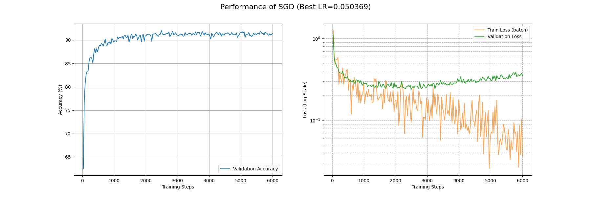
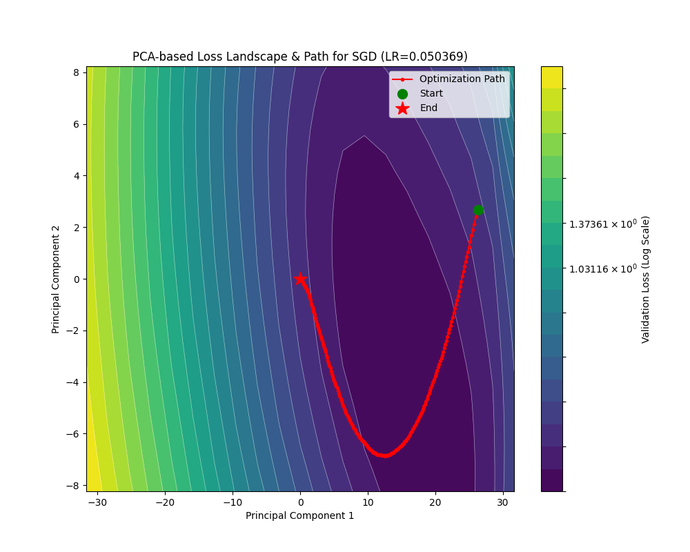
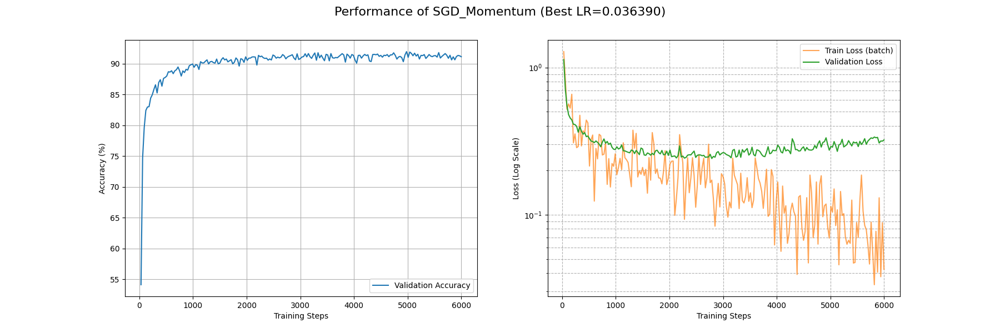
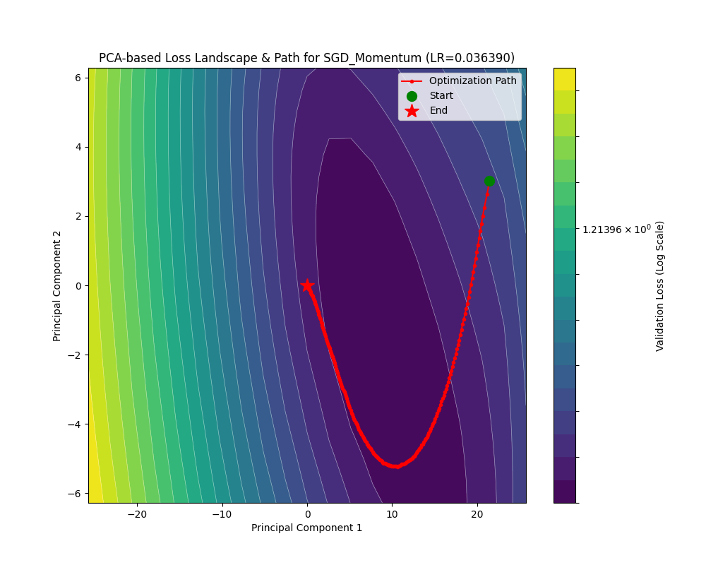
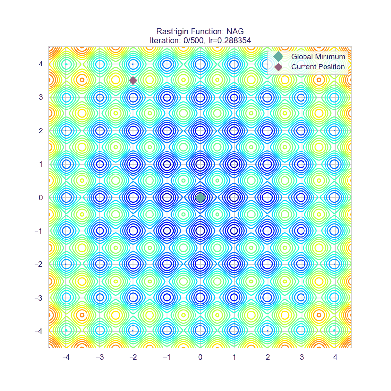
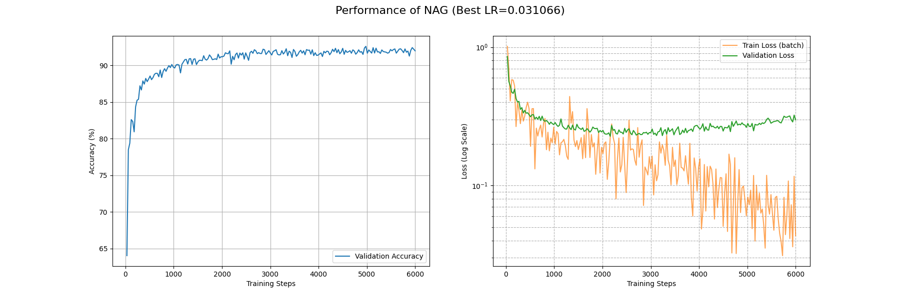

# SGD 系列算法

## 随机梯度下降 SGD

所有的SGD理论讲解都会使用下山的比喻。我们也接着沿用。考虑我们在半山腰，浓雾笼罩，只能看到脚底一片地。如果我们要尽可能快地下山，肯定是**沿着最陡的方向往下**走。

考虑泛函 $\mathcal{L(x; \theta)}$ 是当前的模型 $\theta$ 在某一训练数据 $x$ 下的损失地形。什么地方最陡呢？当然是 $\nabla\mathcal{L(x;\theta)} = \sum_{i=1}^{n} \dfrac{\partial\mathcal{L(x;\theta)}}{\partial \theta_i}\vec{e}_i$ 也就是梯度方向了。证明也很简单，由于各个分量 $\vec{e}_i$ 正交，让每个方向都朝自己的方向变化就可以叠加出最大的变化率。

但是我们不能光看一个数据，那样的话针对性过强了，容易过拟合。那怎么办呢？我们可以一次性取多个数据，具体而言，我们在训练集里面随机取 $|\mathcal{B}|$ 个数据，称作一个 Batch（批量），在这个 Batch 下面我们计算平均梯度 $\dfrac{1}{|\mathcal{B}|}\sum_{i=1}^{|\mathcal{B}|} \nabla\mathcal{L}(x_i;\theta)$，作为“最陡”方向的参考。

下面的问题就是往这个方向走多远的问题了。这是一个我们可以调整的超参数，大了，走得更快，但是容易震荡；小了，收敛又太慢。（此处埋一个伏笔，嘻嘻）这个超参数叫做学习率，用来表征当前的梯度对模型权重进行更新的参考价值。

现在就可以祭出我们的 mini-batch SGD 算法了！对于数据集 $X$ 而言，每次随机抽取 $|\mathcal{B}|$ 条数据 $x$。计算上一代模型 $\theta_{n-1}$ 的更新步长

$$
\begin{align*}
    \Delta \theta &= -\dfrac{\eta}{|\mathcal{B}|}\sum^{|\mathcal{B}|}_{i=1}\nabla\mathcal{L}(x_i;\theta_{n-1})\\
    \theta_n &= \theta_{n-1}+\Delta \theta
\end{align*}
$$

这里加负号意思是“下降”。

这样不仅使用的平均梯度，参考价值较强（而且如果 batch size 更大，对原有数据集分布的估计就更好），更赞的是一个 Batch 里面所有梯度的计算都是独立的，所以天生适合利用 GPU 进行高度并行化的计算！

下面我们来评估一下这个 mini-batch SGD 算法。

- 收敛速率上，对于梯度大的方向收敛快，梯度小的方向收敛慢。如果说损失地形的最低点四周都是很陡的斜坡，那很好，但存在这种混合情况：考虑一个开口向上的椭圆抛物面，并假设我们初始点在椭圆长轴端点附近，这样梯度方向近似和短轴方向平行，模型就一直在前后横跳，真正向下移动（长轴分量）很少。事实上这种情况对应的是一个条件数很大的海森矩阵，相关分析参考后文。
- 寻找全局最小值的能力：在一个平缓的鞍点处算法表现得很“懒”，除非把学习率调大，但是过大的学习率会导致损失不收敛。
- 小学习率当然会使得训练稳定。但是还是那个老生常谈的问题……

为了更直观地理解 SGD 的过程和缺陷，我制作了两个动图，它们是 SGD 在两个二元函数作为损失函数下的运动轨迹。第一个叫做 rosenbrock，解析式为

$$
z=(1 - x)^2 + 100  (y - x^2)^2
$$

它体现为一个香蕉状弯曲的峡谷地形，可以用来观察优化器在面对条件数大的海森矩阵采用的策略。

第二个叫做 rastrigin，解析式为

$$
\begin{align*}
    A &= 10\\
    z &= 2A+ (x^2 - A\cos(2\pi x))+ (y^2 - A\cos(2\pi y))
\end{align*}
$$

它体现为一个鸡蛋托地形，具有很多局部极小值和鞍点。

这是 SGD 在 rosenbrock 函数下的表现：


可以看到确实出现了这种“反复横跳”。

这是 SGD 在 rastrigin 函数下的表现：


可以看到它确实变得很“懒”，陷入离初始点最近的局部最小值了。

我也在 Fashion-MNIST 上面利用 SGD 优化了一个 CNN，这是其损失曲线和损失地形下的优化轨迹：





收敛速度上，大概在第 4500 个 batch 下的 train_loss 能够降到 0.1 的量级，并在第 1000 个 batch 下面 acc 能基本上稳定收敛到 0.9 以上。最终得到的最优解附近的损失地形类似一个具有一定条件数的海森矩阵（后面会讲到），并且相对平坦。

## 动量法随机梯度下降 SGDM

### 动量的引入

人往高处走，水往低处流。我们可以感性体会一下，相比其我们根据坡度（梯度）小心翼翼地下山，从山顶滚落的巨石似乎能比我们更快且更好地找到真正谷底的位置。

让我们对这块石头进行建模。考虑一个单位物体在势场 $U$ 中做带阻尼的自由运动。（带阻尼是为了让物体的动能耗散，以停止在最小值）那么它所受梯度力 $F=-\nabla U$，即 $ma = -\nabla U$。取时间微元 $\beta_3$，则速度更新为 $-v_{n+1} = -\beta_1v_n - \beta_3 a = -\beta_1v_n - \beta_3\dfrac{\nabla U}{m}$，其中 $\beta_1<1$ 表征阻尼损耗，位置更新为 $\theta_{n+1} = \theta_n - \beta_3v_n$。事实上这里 $m$ 表征惯性的大小，惯性大，不易受力移动；惯性小，容易往下移动。这也体现出学习率的一点性质。在更新权重的时候我们可以把时间步长和质量两个参量统一考虑成学习率 $\eta$。现在我们可以把质量乘上去，也就是考虑**动量**：

$$
\begin{align*}
    g_n&=\nabla\mathcal{L({x};\theta_{n-1})}\\
    M_{n}&=\beta_1M_{n-1}+\beta_3g_n\\
    \theta_n&=\theta_{n-1}-\eta M_n
\end{align*}
$$

（若不做特殊说明，$\nabla\mathcal{L({x};\theta_{n-1})}$ 一概指一个 mini-batch 的平均梯度即 $\dfrac{1}{|\mathcal{B}|}\sum^{|\mathcal{B}|}_{i=1}\nabla\mathcal{L}(x_i;\theta_{n-1})$）

这样就得到了**动量法随机梯度下降**即 SGD with Momentum 或 SGDM 算法了。式子里面的 $\beta_1$ 指的是动量衰减因子，可以理解成某种摩擦阻力，要不然就会一直在极小值周围做（近似）的椭圆天体运动不收敛， $\beta_3$ 是梯度的参考系数，而 $\eta$ 就是学习率了。

这是动量法随机梯度下降在之前两个函数的运动轨迹：


可以看见在算法初期，SGDM 的步长较长（因为累积的动量较大），这有利于增大搜索空间，直到进入一个平缓的谷底之后，动量开始衰减并且向最小值靠近。

下面看看 SGDM 在 Fashion-MNIST 下面的表现：





SGDM 在约 4000 个 Batch 后 train_loss 收敛到 0.1 量级，约 1000 个 Batch 后 acc 收敛到 0.9 以上。损失地形平缓。相比于 SGD 可见有更高的收敛速度。

### Nesterov 加速梯度（NAG）

如果把刚刚 SGDM 的式子展开：

$$
\begin{align*}
    g_n&=\nabla\mathcal{L({x};\theta_{n-1})}\\
    \theta_n&=\theta_{n-1}-\eta (\beta_1M_{n-1}+\beta_3g_n)\\
    &=\theta_{n-1}-\eta \beta_1M_{n-1}-\eta\beta_3g_n
\end{align*}
$$

可以看到其实我们对参数进行了**两步**更新，而第二步更新使用的梯度却是更新前参数的梯度。如果我们考虑让第二步更新使用的梯度是**第一步更新后参数的梯度**，也就是让 $g'_n=\nabla\mathcal{L}({x};\theta_{n-1}-\eta \beta_1M_{n-1})$，就得到了 Nesterov 加速优化后的 SGDM。

虽然网上99%对这个的讲解都是停留在这里就完了，但是我们很难对 $\theta_{n-1}-\eta \beta_1M_{n-1}$ 这个前瞻位置的参数直接求一次梯度。为什么？因为我们最后要在代码里面使用 `loss.backward()` 把梯度求出来，但是这个梯度不是前瞻位置的梯度，这不就废了吗，说好的加速，计算量反倒翻倍了……

为此，我们需要寻找无需进行前瞻位置梯度计算的等效形式。

#### 进阶推导

为简便起见，下面的推导统一设 $\beta_3=1$。

让我们从

$$
\theta_n=\theta_{n-1}-\eta \beta_1M_{n-1}-\eta g'_n
$$

入手（其中 $g'_n=\nabla\mathcal{L}({x};\theta_{n-1}-\eta \beta_1M_{n-1})$），为了让这个 $g'_n$ 能够较好地被分离出去，首先在左右两边配上一个 $-\eta \beta_1M_n$，有点类似于去找前瞻位置。然后：

$$
\begin{align*}
    \theta_n-\eta\beta_1M_n&=\theta_{n-1}-\eta(1+\beta_1)M_n\\
    &=\theta_{n-1}-\eta(1+\beta_1)(\beta_1M_{n-1}+g'_n)\\
    &=(\theta_{n-1}-\eta\beta_1M_{n-1})-\eta[(1+\beta_1)g'_n+\beta_1^2M_{n-1}]
\end{align*}
$$

我们可以做一个代换：

$$
\begin{align*}
    \hat\theta_n&=\theta_n-\eta\beta_1M_n\\
    \hat M_n &= (1+\beta_1)g'_n+\beta_1^2M_{n-1}
\end{align*}
$$

这样就有了

$$
\hat\theta_n=\hat\theta_{n-1}-\eta\hat M_n
$$

并且循环带入 $M_n$ 的定义式展开 $\hat M_n$：

$$
\begin{align*}
    \hat M_n &= (1+\beta_1)g'_n+\beta_1^2M_{n-1}\\
    &=(1+\beta_1)g'_n+\beta_1^2g'_{n-1}+\beta_1^3g'_{n-2}+\cdots
\end{align*}
$$

利用高中就学过的错位相减（让 $\hat M_n$ 和  $\beta\hat M_{n-1}$ 相减），我们可以得到 $\hat M_n$ 的递推式：

$$
\hat M_n = \beta_1\hat M_{n-1}+g'_n+\beta_1(g'_n-g'_{n-1})
$$

整理一下我们得到递推公式：

$$
\begin{align*}
    g'_n&=\nabla\mathcal{L({x};\hat\theta_{n-1})}\\
    \hat M_{n}&=\beta_1\hat M_{n-1}+g'_n+\beta_1(g'_n-g'_{n-1})\\
    \hat\theta_n&=\hat\theta_{n-1}-\eta\hat M_n
\end{align*}
$$

由于初始时的 Nesterov 修正项是 $0$，这个递推式可以保证与原来的形式完全等效。

但是我们可以发现，即使这个 $g_n$ 取到原来的梯度，也能通过这种方式（两次迭代的梯度之差）来得到 Nesterov 加速等效的结果。

但是这样做要我们保存两份梯度，有没有更省显存的做法呢？有的。

还是一个和高中数列题很像的思路，我们把在 $\hat M_n$ 的计算中长得比较像的拉到一边去：

$$
\begin{align*}
    \hat M_n - g'_n &= \beta_1 g'_n + \beta_1(\hat M_{n-1} - g'_{n-1})\\
    \dfrac{\hat M_n - g'_n}{\beta_1}&=g'_n + (\hat M_{n-1} - g'_{n-1})
\end{align*}
$$

这里有一个分母 $\beta_1$ 不好看，我们做代换 $\beta_1\tilde M_n = \hat M_n - g'_n$，就有：

$$
\tilde M_n=g'_n+\beta_1\tilde M_{n-1}
$$

整理一下我们得到递推公式：

$$
\begin{align*}
    g'_n&=\nabla\mathcal{L({x};\hat\theta_{n-1})}\\
    \tilde M_n&=g'_n+\beta_1\tilde M_{n-1}\\
    \hat\theta_n&=\hat\theta_{n-1}-\eta(\beta_1\tilde M_n+ g'_n)
\end{align*}
$$

由于我们在整个变换过程中只是使用了变量代换，和一开始的 Nesterov 加速法是等效的，所以对于这个式子而言，我们完全可以这样写：

$$
\begin{align*}
    g_n&=\nabla\mathcal{L({x};\theta_{n-1})}\\
    M_n&=g_n+\beta_1M_{n-1}\\
    \theta_n&=\theta_{n-1}-\eta(\beta_1 M_n+ g_n)
\end{align*}
$$

这样对 Nesterov 加速的实现就非常简单了！只需要把权重更新项从 $\eta M_n$ 换成 $\eta(\beta_1 M_n+ g_n)$ 即可。

当然有的实现会考虑 $\beta_3=(1-\beta_1)$，这个时候权重更新项就变成了 $\eta[\beta_1 M_n+ (1-\beta_1)g_n]$。

### 评述

让我们看看 NAG 的轨迹：




下面是 NAG 在 Fashion-MNIST 下面的表现：




对比一下可以发现 NAG 和朴素的 SGDW 效果有提升，但是提升不大。

SGDM 能够具有更快的收敛速率，尤其对于梯度不对称场景下，能够实现均衡的梯度累积，即减缓前后横跳，加速向下滚动。动量居功至伟。尤其是引入 Nesterov 加速后，动量的针对性更强，收敛速率也更快了。

## 正则化优化

我们考虑一般的 $L_2$ 正则化用以对权重大小进行惩罚限制。在 SGD 场景下：

$$
\begin{align*}
    g_{n} &= -\eta\nabla\left(\mathcal{L}({x};\theta_{n-1})+\dfrac{\lambda}{2}|\theta_{n-1}|^2\right)\\
    &=-\eta\nabla\mathcal{L}({x};\theta_{n-1})-\eta\lambda\theta_{n-1}\\
    \theta_n&=\theta_{n-1}+g_n\\
    &=(1-\eta\lambda)\theta_{n-1}-\eta\nabla\mathcal{L}(x;\theta_{n-1})
\end{align*}
$$

这样我们就可以以数乘代替繁琐且耗时的梯度计算，这被叫做“解耦的权重衰减”（Decoupled Weight Decay）。如果还想解耦更彻底些，可以写成 $(1-\lambda)\theta_{n-1}-\eta\nabla\mathcal{L}(x;\theta_{n-1})$，也就是甚至把学习率和正则化参数解耦。在后面的优化器中（比如 AdamW），我们基本不会直接使用原教旨主义的 $L_2$ 正则化，而是采用这种权重衰减的方式，尽管在更复杂的优化器下，这两者数学上并不等效。

## SGDM 的代码实现

下面，让我们来赏析一下 `torch.optim.SGD` 对 SGDM 的实现。中文注释是我让 Gemini 帮我读代码给出的注解。

<details>

<summary>SGDM 的实现</summary>

```python
def _single_tensor_sgd(
    params: list[Tensor],
    grads: list[Tensor],
    momentum_buffer_list: list[Optional[Tensor]],
    grad_scale: Optional[Tensor],
    found_inf: Optional[Tensor],
    *,
    weight_decay: float,
    momentum: float,
    lr: float,
    dampening: float,
    nesterov: bool,
    maximize: bool,
    has_sparse_grad: bool,
):
    # 这两个参数与自动混合精度（AMP）中的梯度缩放有关，用于跳过无效更新。
    # 此函数是基础实现，不处理这些情况，故断言它们为 None。
    assert grad_scale is None and found_inf is None

    # 循环遍历每一个参数及其对应的梯度和动量缓冲区
    for i, param in enumerate(params):
        # 获取当前参数的梯度。如果目标是最大化（maximize=True），则反转梯度方向。
        grad = grads[i] if not maximize else -grads[i]
        
        # --- 步骤 1: 应用权重衰减 (Weight Decay / L2 正则化) ---
        if weight_decay != 0:
            # 注意: 这里的实现是将权重衰减项加到梯度上，而不是从权重中直接减去（解耦权重衰减）。
            # 这等价于在损失函数中加入了 L2 正则化项 0.5 * weight_decay * param^2。
            # 更新前的梯度 g' = g + w * theta
            
            # 使用嵌套 if 是为了绕过 TorchScript JIT 编译器的规则，并处理可微的 weight_decay。
            if isinstance(weight_decay, Tensor):
                if weight_decay.requires_grad:
                    # 如果 weight_decay 本身是需要计算梯度的张量（例如在元学习中），
                    # 必须克隆 param 来进行乘法，以避免在反向传播中出现原地修改错误。
                    grad = grad.addcmul(param.clone(), weight_decay)
                else:
                    # 如果 weight_decay 是张量但无需梯度，则使用常规的 add 操作。
                    grad = grad.add(param, alpha=weight_decay)
            else:
                # 如果 weight_decay 是一个普通的浮点数，这是最常见的情况。
                grad = grad.add(param, alpha=weight_decay)

        # --- 步骤 2: 计算动量并更新梯度 ---
        if momentum != 0:
            # 获取当前参数的动量缓冲区（momentum buffer），我们称之为 M
            buf = momentum_buffer_list[i]

            if buf is None:
                # 如果是第一次更新该参数，动量缓冲区为空。
                # 初始化动量 M_0 = g' (当前梯度)
                # 使用 clone().detach() 来创建一个不带梯度历史的新张量作为初始动量。
                buf = torch.clone(grad).detach()
                momentum_buffer_list[i] = buf
            else:
                # 如果已有动量，则进行更新。
                # 公式: M_t = momentum * M_{t-1} + (1 - dampening) * g'_t
                # momentum 是动量因子 (β)，dampening 抑制了新梯度对动量的影响。
                # 当 dampening=0 时，这就是标准动量更新公式 M_t = β * M_{t-1} + g'_t
                buf.mul_(momentum).add_(grad, alpha=1 - dampening)

            if nesterov:
                # 如果使用 Nesterov 加速梯度 (NAG):
                # 更新所用的梯度变为: g''_t = g'_t + momentum * M_t
                grad = grad.add(buf, alpha=momentum)
            else:
                # 如果使用标准动量:
                # 更新所用的梯度就是动量本身: g''_t = M_t
                grad = buf
        
        # --- 步骤 3: 使用最终的梯度更新参数 ---
        # 最终更新公式: param_t = param_{t-1} - lr * g''_t
        
        # 同样，使用嵌套 if 来处理 lr 可能是一个需要梯度的张量的情况。
        if isinstance(lr, Tensor):
            if lr.requires_grad:
                # 如果 lr 需要梯度，必须使用 addcmul，它有为所有输入（包括lr）定义的导数。
                # value=-1 实现减法。
                param.addcmul_(grad, lr, value=-1)
            else:
                # 如果 lr 是张量但无需梯度，使用 add_ 和 alpha=-lr。
                param.add_(grad, alpha=-lr)
        else:
            # 如果 lr 是一个普通的浮点数（最常见情况），使用最高效的 add_ 操作。
            param.add_(grad, alpha=-lr)
```

</details>

## 其他讨论

### 梯度与海森矩阵估计

我们回顾一下怎么给一个多元函数 $f({x})$ 做二阶泰勒展开。

在一阶的情况下，很明显有

$$
f({x})\approx f({x_0})+\nabla f({x_0})\cdot ({x-x_0})
$$

类似的，我们可以把求导算子应用到梯度上面，也就是得到梯度的雅可比矩阵，或者叫做**海森矩阵**：

$$
H=\left(\frac{\partial^2}{\partial x_i\partial x_j}\right)_{1\le i,j\le n}=\left(
\begin{matrix}
    \frac{\partial^2}{\partial x_1^2} & \frac{\partial^2}{\partial x_1\partial x_2} & \cdots & \frac{\partial^2}{\partial x_1\partial x_n}\\
    \frac{\partial^2}{\partial x_2\partial x_1} & \frac{\partial^2}{\partial x_2^2} & \cdots & \frac{\partial^2}{\partial x_2\partial x_n}\\
    \vdots & \vdots & \ddots & \vdots\\
    \frac{\partial^2}{\partial x_n\partial x_1} & \frac{\partial^2}{\partial x_n\partial x_2} & \cdots & \frac{\partial^2}{\partial x_n^2}\\
\end{matrix}
\right)
$$

那么二阶的泰勒展开就变成了

$$
f({x})\approx f({x_0})+\nabla f({x_0})({x-x_0})+\dfrac{1}{2}({x-x_0})^\top H f({x_0})({x-x_0})
$$

让我们用熟悉的记号重写一下：

$$
\mathcal{L}(\theta_n+\Delta\theta)\approx \mathcal{L}(\theta_n)+g_n^\top\Delta\theta+\dfrac{1}{2}\Delta\theta^\top H \mathcal{L}(\theta_n)\Delta\theta
$$

在 SGD 场景下，$\Delta\theta=-\eta g_n$，损失函数的改变量为：

$$
\mathcal{L}(\theta_n+\Delta\theta)- \mathcal{L}(\theta_n)\approx -\eta g_n^\top g_n+\dfrac{1}{2}\eta^2g_n^\top H \mathcal{L}(\theta_n)g_n
$$

可见，在 $H$ 较大（尤其是条件数较大，对应之前说的椭圆抛物面）的地方，SGD 的更新是相当低效的。

让我们以另外一个视角观察前面的式子。为了找到最小值，事实上我们是在寻找损失函数**梯度的零点**。这样我们可以挪用数值分析里面找零点相当高效的算法：牛顿迭代法。

回顾一下牛顿法的内容，对于函数 $f(x)$ 和初始估计 $x_{n-1}$，更新方式为：

$$
\Delta x = -\dfrac{f(x_{n-1})}{f'(x_{n-1})}\\
x_n=x_{n-1}+\Delta x
$$

牛顿法的特征就是收敛高效，且是**自适应**的，陡峭的地方下降快，平缓的地方精度高。

在优化器的语境里面，其实就是让参数更新量 $\Delta \theta=-[H\mathcal{L}]^{-1}\nabla \mathcal{L}$。而前面所述的“陡峭”和“平缓”恰巧对应的就是一阶导（梯度）的导数也就是**海森矩阵**！

由于海森矩阵（及其逆矩阵）的计算量非常之大，与其计算它不如用这个时间跑几轮算得快的近似算法。

而 SGD 其实就是取的 $[H\mathcal{L}]^{-1}=\eta I$ 这个估计，相当于抹平各个方向的差异做了统一的更新。

对于海森矩阵而言，有没有更好的估计方式呢？有的！要不然为什么我们会引入动量呢？

让我们考虑一个椭圆抛物面

$$
f({x})=\dfrac 12{x}^\top A{x}+{b}^\top {x}
$$

那么在这个面上的任一点有梯度 $\nabla f=A{x}-{b}$ 以及海森矩阵 $Hf=A$。

令梯度等于 $0$，实质就是求解线性方程组 $H{x}={b}$，为此我们定义残差 ${r}=H{x}-{b}$

在任意一本数值分析教材里面都会讲到求解线性方程组的一百万种方法，包括高斯消元法，雅可比迭代，预条件法等。在其中和先前我们提到的动量法最相关的是**共轭梯度法**。下面简要介绍一下这个方法。

**定义**：若 $A$ 为 $n\times n$ 的对称正定矩阵，$u,v$ 为两个 $n$ 维的向量，则两者的 **$A$-内积** 定义为：

$$
\langle u,v\rangle _A=u^\top Av
$$

特别的，如果 $\langle u, v\rangle _A=0$，则称两个向量关于 $A$ 共轭。

现在我们有一个参数的初始估计 $\theta_n$，得到了梯度 $g_n$ 也就是之前提到的残差。

下面我们需要寻找参数更新量 $M_n$，吸纳之前关于“共轭”的讨论，我们希望各个 $M$ 之间的优化是独立的，也就是 $\langle M_i,M_j\rangle _H=0\quad(i\ne j)$ 成立。

感觉是否很像 Gram-Schmidt 正交化？是的！当然共轭梯度法使用的是一个等效更简单的形式（具体怎么从正交化等式推到这个简单形式比较复杂而且也有点跑题了，我视情况在后面给一个附录进行证明），也就是

$$
\beta_n = \dfrac{g_n^\top g_n}{g_{n-1}^\top g_{n-1}}\\
M_n=g_n+\beta_nM_{n-1}
$$

其实直接用 Gram-Schmidt 正交化也无可厚非（虽然这就涉及到要把 $H$ 纳入计算），因为无论如何我们都要把 $\beta_n$ 估计为一个固定的超参数 $\beta$，我们要的是下面那个动量式子的结构而不是参数的表达式，毕竟参数可以估计。

当然共轭梯度还利用 $\alpha_i=\dfrac{g_n^\top g_n}{M_n^\top H M_n}$ 来计算更新步长，不过这个的计算意义不大，因为我们一是不知道 $H$，二是利用的固定学习率 $\eta$ 来近似替代。

现在我们把 $\beta_i$ 也估计为固定的超参数 $\beta$，那我们就可以下论断了：**动量法随机梯度下降是采用固定参数近似对 $H^{-1}$ 的共轭梯度法求解**。

对于海森矩阵而言，有没有更好的估计方式呢？有的！让我们不要把参数固定死，来一个自适应调节。
