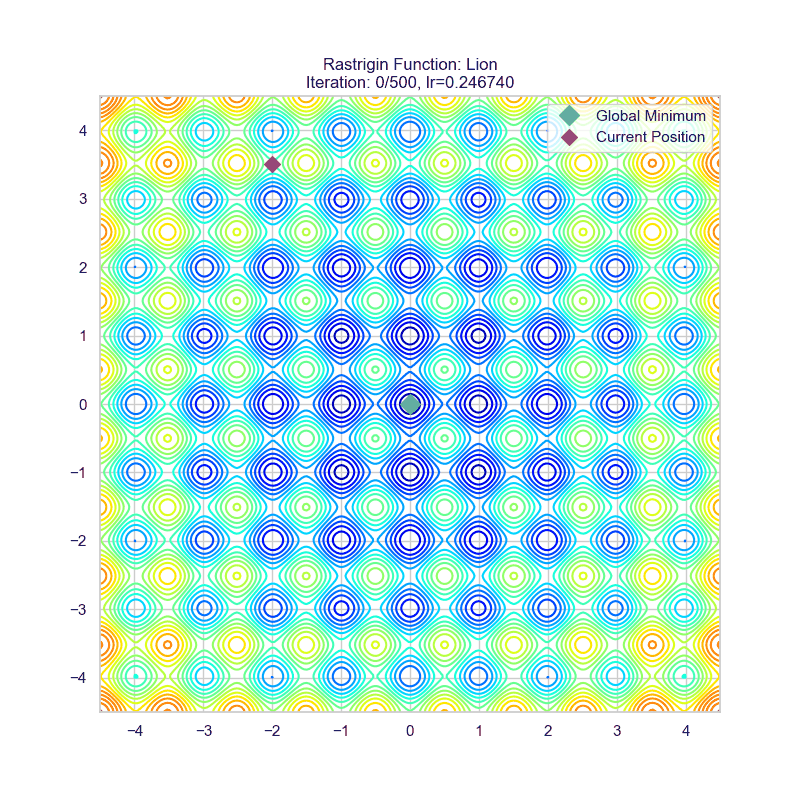
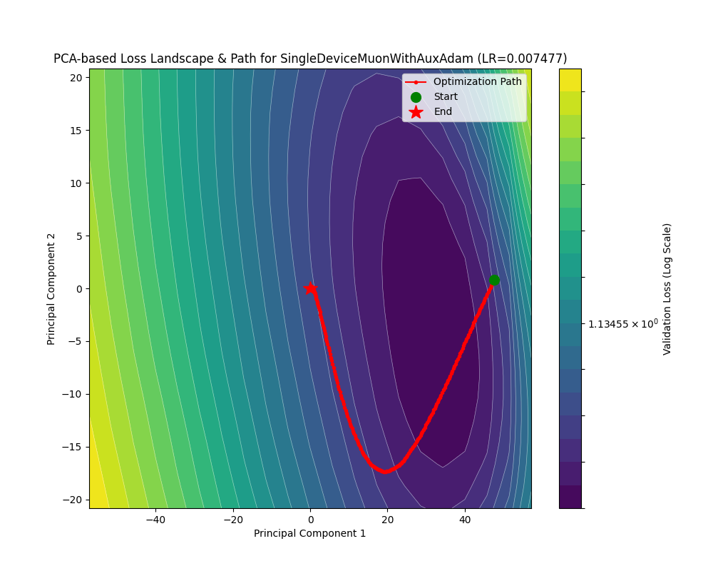

# 符号梯度下降

如果是近似 Hessian 矩阵是优化器理论发展的一条“明线”，那么对梯度取“符号”来计算，则是对应的一条“暗线”。

在接下来的讨论中，我们将看到刚刚讨论的那些优化器是如何在这条“暗线”下走向统一的。同时，这条“暗线”也渐渐越挑越明，逐渐成为大规模神经网络训练优化的新的理论指导。

## Rprop

Rprop 的出现早于 RMSprop，从命名风格就可以看出它们的一脉相承。

回忆一下 RMSprop 的计算，它提供了一个梯度缩放系数 $\sqrt{G_n}$，其中 $G$ 是对 $g^2$ 的平均。

那么最后的参数更新就变成了 $-\eta\dfrac{g}{\sqrt{\bar g^2}}$，如果我们考虑全量（Full batch）更新，也就是让 $\mathcal{|B|}=n$ 即 Batch size 等于样本数量，那么我们甚至可以把这个“平均梯度”的平均去掉。这样实际的更新量就是梯度的**符号函数** $\mathrm{sign}(g)$ 了！

这就是 Rprop 的更新原理。也就是所有符号梯度下降优化器的理论核心：梯度的**方向**相比其在不同方向的**大小**更重要！

回到我们之前讨论的那个椭圆抛物面，如果我们过于依赖梯度大小，就会造成“反复横跳”的问题，因为梯度在我们预期的优化方向的**垂直**方向上，有相当大的大小，这就影响了优化器在 Hessian 矩阵条件数相当大的时候，逃离鞍点的能力。

在看公式之前，先看看 Rprop 的效果吧：


可以看到，如果忽略全量梯度计算这个（大）问题，Rprop 在这两个地形的收敛能力完全可以媲美 Adam！尤其是在 rosenbrock 地形下 Rprop 沿着谷底移动的速度是相当快的。

下面则展示了如果以 mini-batch 方式运行 Rprop 的惨烈效果：


演都不演了，根本收敛不了。

现在让我们来看看 Rprop 的更新公式：

$$
\begin{align*}
    g_n&=\nabla\mathcal{L({x_{\mathrm{full}}};\theta_{n-1})}\\
    \hat g_n&=\mathrm{sign}(g_n)\\
    \theta_n&=\theta_{n-1}-\eta\hat g_n
\end{align*}
$$

由此，就能写出代码了：

<details>

<summary> Rprop 的实现</summary>

```python
def _single_tensor_rprop(
    params: list[Tensor],
    grads: list[Tensor],
    prevs: list[Tensor],
    step_sizes: list[Tensor],
    state_steps: list[Tensor],
    *,
    step_size_min: float,
    step_size_max: float,
    etaminus: float,
    etaplus: float,
    maximize: bool,
    capturable: bool,
    differentiable: bool,
    has_complex: bool,
):
    # 循环处理每个参数
    for i, param in enumerate(params):
        grad = grads[i]
        grad = grad if not maximize else -grad
        prev = prevs[i]
        step_size = step_sizes[i]
        step = state_steps[i]

        # --- CUDA Graph 捕获检查 ---
        if not torch.compiler.is_compiling() and capturable:
            capturable_supported_devices = _get_capturable_supported_devices()
            assert (
                param.device.type == step.device.type
                and param.device.type in capturable_supported_devices
            ), "如果 capturable=True, params 和 state_steps 必须在支持的设备上。"

        step += 1

        # --- 处理复数 ---
        if torch.is_complex(param):
            grad = torch.view_as_real(grad)
            prev = torch.view_as_real(prev)
            param = torch.view_as_real(param)
            step_size = torch.view_as_real(step_size)
        
        # --- Rprop 核心逻辑 ---

        # 1. 计算当前梯度与上一步梯度的乘积的符号
        # sign > 0: 梯度符号相同
        # sign < 0: 梯度符号相反
        # sign = 0: 其中一个梯度为零
        if differentiable:
            # 在可微分模式下，需要克隆 prev 以防原地操作破坏计算图
            sign = grad.mul(prev.clone()).sign()
        else:
            sign = grad.mul(prev).sign()

        # 2. 根据符号 sign 的值，确定步长的更新因子
        # 这里用 sign 张量来存储更新因子 (etaplus, etaminus, 1)
        if capturable:
            # Capturable 模式下使用 torch.where
            sign.copy_(torch.where(sign.gt(0), etaplus, sign))   # 符号相同，更新因子为 etaplus
            sign.copy_(torch.where(sign.lt(0), etaminus, sign))  # 符号相反，更新因子为 etaminus
            sign.copy_(torch.where(sign.eq(0), 1, sign))         # 符号为0，更新因子为 1 (步长不变)
        else:
            # 常规模式下使用索引赋值，通常更高效
            sign[sign.gt(0)] = etaplus
            sign[sign.lt(0)] = etaminus
            sign[sign.eq(0)] = 1

        # 3. 更新步长
        # 用更新因子乘以当前步长，并将其限制在 [step_size_min, step_size_max] 范围内
        step_size.mul_(sign).clamp_(step_size_min, step_size_max)

        # 4. 根据 Rprop 规则修改当前梯度
        # 这是一个 Rprop 的变体规则：如果梯度符号反转 (sign.eq(etaminus))，
        # 则本次更新的梯度设为0，意味着参数在这一步不移动。
        grad = grad.clone(memory_format=torch.preserve_format)
        if capturable:
            grad.copy_(torch.where(sign.eq(etaminus), 0, grad))
        else:
            grad[sign.eq(etaminus)] = 0

        # 5. 更新参数
        # 参数的更新量只取决于当前梯度的符号和更新后的步长
        # 公式: param_t = param_{t-1} - sign(grad_t) * step_size_t
        param.addcmul_(grad.sign(), step_size, value=-1)

        # 6. 保存当前梯度，作为下一步的 "prev"
        prev.copy_(grad)
```

</details>

代码相对刚刚的讲解多了亿点点细节，因为它实现的是名叫 Rprop with weight-backtracking 的算法。这个改进的作用体现在我们之前提过无数次的椭圆抛物面上面，加入 `sign` 项之后，就可以检测到梯度在“反复横跳”，这个时候就不应该放任它跳，而是减少步长才更有希望落到下面。

## Lion

Lion 优化器是 Google 团队搜出来的优化器，尽管不是从某个理论推导下来，Lion 优化器仍然在同等参数量下取得了至少和 AdamW 打平的性能。

具体而言，Lion 优化器的参数更新规则是：

$$
\begin{align*}
    g_n&=\nabla\mathcal{L(x;\theta_{n-1})}\\
    G_n&=\mathrm{sign}(\beta_1 M_{n-1}+(1-\beta_1)g_n)\\
    \theta_n&=\theta_{n-1}+\eta(G_n+\lambda \theta_{n-1})\\
    M_n &= \beta_2 M_{n-1}+(1-\beta_2)g_n
\end{align*}
$$

可以看到，Lion 类似于引入动量的 Rprop，不过只是把动量的更新放到了最后。这里没有使用全量计算，而是使用平均梯度来规避全量计算的复杂度。由于动量的引入，Lion 需要更小的学习率。

让我们看看 Lion 的效果：





可以看见 Lion 也在这两个地形获得了不错的表现。虽然在 rastrigin 地形下面 hyperopt 并没有搜出一个特别好的参数（第一张图太小第二张图太大），但是对于 rosenbrock 地形，Lion 取得了我们目前所见最快的谷底行进速度。


Lion 在这个任务下面相当能打啊。仅需要约 3500 个 batch 就可以将 train_loss 降到 0.1 水平，约 700 个 batch 就可以把 acc 刷上 0.9。

让我们看看 `torch-optimizer` 库的实现：

<details>

<summary> Lion 优化器的实现 </summary>

```python
# 导入 PyTorch 核心库
import torch
# 从 PyTorch 优化器基类中导入 Optimizer，所有自定义优化器都应继承它
from torch.optim.optimizer import Optimizer

# 从本地类型定义文件中导入类型提示，增强代码可读性
# Betas2: 一个包含两个浮点数的元组，如 (0.9, 0.99)
# OptFloat: 可选的浮点数，即 float 或 None
# OptLossClosure: 可选的损失闭包函数
# Params: 可迭代的参数或定义了参数组的字典
from torch_optimizer.types import Betas2, OptFloat, OptLossClosure, Params

# 定义当 `from module import *` 时，哪些对象会被导出
__all__ = ("Lion",)


# 定义 Lion 优化器类，它继承自 PyTorch 的 Optimizer 基类
class Lion(Optimizer):
    r"""实现了 Lion 算法。

    代码改编自 Google 的官方实现: https://github.com/google/automl/tree/master/lion

    Lion - EvoLved SIgn MOmeNtum (演进的符号动量) 算法在
    论文 https://arxiv.org/pdf/2302.06675.pdf 中被提出。
    Lion 的目标是通过只跟踪动量来比 Adam 算法更节省内存。

    注意事项:
    - 如论文中所述，Lion 需要一个更小的学习率 (lr)。
    - 为了维持有效的权重衰减强度，需要一个更大的解耦权重衰减 (decoupled weight decay) 值。
    - Lion 的性能增益会随着批处理大小 (batch size) 的增加而变大。
    - 此外，在一些大型语言模型和文本/图像数据集上，Lion 并未被发现能超越 AdamW。

    参数:
        params: 需要优化的、可迭代的参数，或定义了参数组的字典。
        lr: 学习率 (learning rate)，默认为 1e-4 (注意，论文建议比 Adam 小 3-10 倍)。
        betas: 用于计算梯度及其平方的运行平均值的系数 (默认: (0.9, 0.99))。
               在 Lion 中，beta1 用于插值，beta2 用于动量更新。
        weight_decay: 权重衰减 (L2 惩罚项) (默认: 0)。

    示例:
        >>> import torch_optimizer as optim
        >>> optimizer = optim.Lion(model.parameters(), lr=0.001)
        >>> optimizer.zero_grad()
        >>> loss_fn(model(input), target).backward()
        >>> optimizer.step()
    """

    # 类的构造函数
    def __init__(
        self,
        params: Params,
        lr: float = 1e-4,          # 学习率
        betas: Betas2 = (0.9, 0.99), # beta 参数
        weight_decay: float = 0.0, # 权重衰减系数
    ):
        # --- 输入参数合法性检查 ---
        if lr <= 0.0:
            raise ValueError("无效的学习率: {}".format(lr))
        if not 0.0 <= betas[0] < 1.0:
            raise ValueError(
                "无效的 beta 参数 (索引 0): {}".format(betas[0])
            )
        if not 0.0 <= betas[1] < 1.0:
            raise ValueError(
                "无效的 beta 参数 (索引 1): {}".format(betas[1])
            )
        if weight_decay < 0:
            raise ValueError(
                "无效的 weight_decay 值: {}".format(weight_decay)
            )
        
        # 将超参数打包成一个字典，作为默认配置
        defaults = dict(lr=lr, betas=betas, weight_decay=weight_decay)
        # 调用父类 (Optimizer) 的构造函数，完成初始化
        super().__init__(params, defaults)

    # `@torch.no_grad()` 是一个装饰器，它会禁用此函数内的梯度计算。
    # 这对于优化器是至关重要的，因为我们是在修改参数值，而不是在计算关于这些修改的梯度。
    @torch.no_grad()
    def step(self, closure: OptLossClosure = None) -> OptFloat:
        r"""执行单步优化。

        参数:
            closure: 一个可以重新评估模型并返回损失的闭包函数 (可选)。
        """
        loss = None
        # 如果提供了闭包函数 (closure)，则执行它来计算损失。
        # 这在某些优化算法（如 L-BFGS）中很常见，可以多次评估模型。
        if closure is not None:
            with torch.enable_grad(): # 在闭包内需要确保梯度是开启的
                loss = closure()

        # 遍历所有的参数组 (param_groups)，例如可以为模型的不同部分设置不同的学习率
        for group in self.param_groups:
            # 遍历当前参数组中的每一个参数 (p)
            for p in group["params"]:
                # 如果参数没有梯度 (例如，在冻结层中)，则跳过
                if p.grad is None:
                    continue

                # --- 核心算法开始 ---

                # 1. 执行解耦权重衰减 (Decoupled Weight Decay)
                # 这是一种 L2 正则化的形式，它直接从参数中减去一个与其自身大小成正比的值。
                # 注意这里的衰减量是 `lr * weight_decay`，与 AdamW 不同 (AdamW 是 `weight_decay`)。
                p.data.mul_(1 - group["lr"] * group["weight_decay"])

                grad = p.grad
                state = self.state[p] # 获取该参数的状态字典，用于存储动量等信息

                # 2. 状态初始化 (State Initialization)
                # 如果一个参数第一次被优化，其状态字典 `state` 是空的
                if len(state) == 0:
                    # 初始化动量 (momentum)，命名为 `exp_avg` 以与 Adam 保持一致
                    # 创建一个与参数 p 形状相同、值全为 0 的张量
                    state["exp_avg"] = torch.zeros_like(p)

                # 获取动量和 beta 系数
                exp_avg = state["exp_avg"]
                beta1, beta2 = group["betas"]

                # 3. 计算用于更新的插值 (Interpolation for update)
                # 这一步是 Lion 算法的核心之一。它使用 beta1 来混合（插值）旧的动量和当前的梯度。
                # 公式: c_t = β₁ * m_t + (1 - β₁) * g_t
                update = exp_avg.mul(beta1).add(grad, alpha=1 - beta1)

                # 4. 参数更新 (Parameter Update)
                # 使用 `update` 的符号 (sign) 来更新参数。
                # `torch.sign(update)` 会得到一个由 -1, 0, 1 组成的张量。
                # `p.add_(..., alpha=-lr)` 等价于 `p.data = p.data - lr * torch.sign(update)`。
                # 这是 "Sign Momentum" 名称的由来。
                p.add_(torch.sign(update), alpha=-group["lr"])
                
                # 5. 更新动量 (Momentum Update)
                # 这一步使用 beta2 来更新动量，为下一次迭代做准备。
                # 公式: m_{t+1} = β₂ * m_t + (1 - β₂) * g_t
                # `exp_avg.mul_(beta2)`: 先将旧动量乘以 beta2
                # `.add_(grad, alpha=1 - beta2)`: 再加上 `(1 - beta2) * grad`
                exp_avg.mul_(beta2).add_(grad, alpha=1 - beta2)

        # 返回本次 step 计算的损失值（如果提供了闭包）
        return loss
```

</details>

## Muon

最后让我们祭出 Muon 优化器，也就是 Kimi-K2 模型训练使用的优化器。这一节的撰写，在很大程度上参考了苏剑林的博客。

我们计划从两条路线“包抄”推导 Muon 优化器。

第一条思路是 Lion 优化器的思路，或者说是 Rprop 的思路。最开始对 Rprop 的分析建立在参数更新量是 $-\eta\dfrac{g}{\sqrt{\bar g^2}}$ 的基础上，然后非常武断地认为对于**矩阵**而言 $\dfrac{g}{\sqrt{\bar g^2}}=\mathrm{sign}(g)$，但是如果我们**从表达式本身出发**呢？

让我们回到梦开始的地方，AdaGrad 优化器的初衷是计算 $\dfrac{g}{\sqrt{gg^\top}}$。考虑单个 fc layer（正如我们在 Shampoo 优化器中做的那样），则 $g$ 是一个 $n\times m$ 的矩阵。这启发我们设计这样一个**矩阵符号函数**：$\mathrm{msign}(M)=(MM^\top)^{-\frac 12}M$。

依旧是和 Shampoo 优化器一样，矩阵的逆 $p$ 次方根是通过 SVD 计算（得到推广）的。也就是考虑 $M=U\Sigma V^\top$ 则 $M^{-\frac 1p}=U\Sigma^{-\frac 1p}V^\top$。

对 $M$ 做 SVD 也就是 $M=U\Sigma V^\top$，那么：

$$
\begin{align*}
    \mathrm{msign}(M)&=(U\Sigma V^\top V\Sigma U^\top)^{-\frac 12}(U\Sigma V^\top)\\
    &=(U\Sigma^2U^\top)^{-\frac 12}(U\Sigma V^\top)\\
    &=U\Sigma^{-1}U^\top U\Sigma V^\top\\
    &=U_{[:r]}V_{[:r]}^\top
\end{align*}
$$

其中 $r$ 为 $M$ 的奇异值个数。

利用这个**矩阵符号函数**代替 Rprop 的符号函数，并引入动量（但是，不像 Lion 一样把动量的更新放在最后），就得到 Muon 优化器的更新公式了：

$$
\begin{align*}
    g_n&=\nabla \mathcal{L}(x;\theta_{n-1})\\
    M_n&=\beta M_{n-1}+g_n\\
    \theta_n&=\theta_{n-1}-\eta\mathrm{msign}(M_n+\lambda \theta_{n-1})
\end{align*}
$$

这里和 Lion 不一样的是把正则化解耦到了符号函数里面。

第二条路，如果我们重新审视 Shampoo 优化器在一个 fc layer 的情况：

$$
\begin{align*}
    L_n &= \beta L_{n-1} + g_n g_n^\top\\
R_n &= \beta R_{n-1} + g_n^\top g_n\\
H^{-\frac 12}g&=L^{- \frac 14}g_nR^{- \frac 14}
\end{align*}
$$

在 $\beta=0$ 的时候，我们有：

$$
\begin{align*}
    L^{- \frac 14}gR^{- \frac 14}=(g_n g_n^\top)^{- \frac 14}g_n(g_n^\top g_n)^{- \frac 14}
\end{align*}
$$

对 $g_n$ 做 SVD 即 $g_n=U\Sigma V^\top$，接着推式子：

$$
\begin{align*}
    L^{- \frac 14}gR^{- \frac 14}&=(g_n g_n^\top)^{- \frac 14}g_n(g_n^\top g_n)^{- \frac 14}\\
    &=(U\Sigma V^\top V\Sigma U^\top)^{- \frac 14}(U\Sigma V^\top)(V\Sigma U^\top U\Sigma V^\top)\\
    &=(U\Sigma^2 U^\top)^{- \frac 14}(U\Sigma V^\top)(V\Sigma^2 V^\top)^{- \frac 14}\\
    &=U\Sigma^{- \frac 12}\Sigma \Sigma^{- \frac 12} V^\top\\
    &=\mathrm{msign}(g_n)
\end{align*}
$$

这意味着 Shampoo 也冥冥中使用了 $\mathrm{msign}$ 函数！

反观 Muon 的显存占用和 SGDM 一样，但是理论上打包算出了 $gg^\top$，效果应该会相当赞啊！

我们知道 Shampoo 优化器的目标是使用 Kronecker 积高效优化 Hessian 计算，最终近似 $gg^\top$；而 Muon 一个打包处理，就非常高效地计算出来了……吗？

我们只是得到了参数更新时，如果每一次都要计算 SVD 的话，那代价仍然是不可承担的。这，便是 Muon 最后一个字 N (for Newton-Schulz) 的含义！

我们不使用 SVD，而是采用 $\mathrm{msign}(M)=(MM^\top)^{-\frac 12}M$ 来计算。具体而言，我们要计算 $(MM^\top)^{-\frac 12}$。

Muon 的作者使用 Newton-Schulz 迭代来计算这个矩阵。Newton-Schulz 迭代是一种迭代法矩阵求逆算法，从 $AX=I$ 开始用 Newton 法类似的迭代式子逐步求解 $X=A^{-1}$。

在这里，我们其实是从 $MM^\top=I$ 开始进行迭代。也就是将 $(MM^\top)^{-\frac 12}$ 近似成 $MM^\top-I$ 的多项式。嘿，我知道你在想泰勒展开的事情，但是想想我们最小/大化的是什么？（比如，如果我们想最大化正弦和三次函数的相似度，我们应该使用基于勒让德多项式的傅里叶级数来展开而不是使用泰勒展开……）

所以别急。我们考虑展开到三项，也就是

$$
\mathrm{msign}(M)\approx aM+b(MM^\top)M+c(MM^\top)^2M
$$

我们的优化目标是：尽可能对于所有的 $M$ 都具有最快的收敛速度。

我们对 $M$ 做一下 SVD，也就是

$$
\begin{align*}
    \mathrm{msign}(M)&=aU\Sigma V^\top+b(U\Sigma V^\top V\Sigma U^\top)(U\Sigma V^\top)+c(U\Sigma V^\top V\Sigma U^\top)^2(U\Sigma V^\top)\\
    &=aU\Sigma V^\top+bU\Sigma^3V^\top+cU\Sigma^5V^\top\\
    &=U(a\Sigma+b\Sigma^3+c\Sigma^5)V^\top
\end{align*}
$$

对于奇异值的每一项 $\sigma\in(0,1]$ 而言，我们其实希望 $a\sigma+b\sigma^3+c\sigma^5$ 能够在 $k$ 次迭代中尽量逼近 $1$。

现在我们就可以设计问题了：固定迭代次数 $k$，令 $f(x)=ax+bx^3+cx^5(x\in(0,1])$，然后损失函数使用 MSE：$\mathcal{L}([1-f^{(k)}(x)]^2;a,b,c)$，寻找 $a,b,c$ 使得 $\mathcal{L}$ 最小。我们采用 Adam 来跑一跑。

<details>

<summary> 优化使用的代码</summary>

```python
import torch
import torch.optim as optim
import matplotlib.pyplot as plt
import numpy as np

# --- 1. 设置超参数和固定值 ---
k = 5                # 固定迭代次数
learning_rate = 5e-5 # Adam 优化器的学习率
num_steps = 100000     # 优化步数
batch_size = 2048    # 每步优化中采样的 x 的数量

a = torch.tensor([1.0], requires_grad=True)
b = torch.tensor([-1.0], requires_grad=True)
c = torch.tensor([1.0], requires_grad=True)

# --- 3. 设置优化器 ---
# 使用 Adam 优化器来更新 a, b, c
optimizer = optim.Adam([a, b, c], lr=learning_rate)

# 存储历史记录以供可视化
loss_history = []
a_history, b_history, c_history = [], [], []

print(f"开始优化... k={k}, 初始值 a={a.item():.2f}, b={b.item():.2f}, c={c.item():.2f}")

# --- 4. 优化循环 ---
for step in range(num_steps):
    # 将梯度清零
    optimizer.zero_grad()

    # 定义 f(x)
    def f(x_in):
        return a * x_in + b * x_in**3 + c * x_in**5

    # 在 (0, 1] 区间随机采样一个 mini-batch 的 x
    # torch.rand 生成 [0, 1) 的值，对于我们的目的来说足够了
    x = torch.rand(batch_size, 1)

    # 计算 f^(k)(x)
    y = x
    for _ in range(k):
        y = f(y)
    
    # 最终的输出
    f_k_x = y

    # 定义目标值 (全为 1 的张量)
    target = torch.ones_like(f_k_x)

    # 计算损失函数 (MSE)
    loss = torch.mean((target - f_k_x)**2)

    # 反向传播计算梯度
    loss.backward()

    # 使用优化器更新参数 a, b, c
    optimizer.step()

    # 记录历史数据
    loss_history.append(loss.item())
    a_history.append(a.item())
    b_history.append(b.item())
    c_history.append(c.item())

    # 每 1000 步打印一次进度
    if step % 1000 == 0 or step == num_steps - 1:
        print(f"Step {step:>{len(str(num_steps))}}: Loss = {loss.item():.8f}, "
              f"a = {a.item():.4f}, b = {b.item():.4f}, c = {c.item():.4f}")

# --- 5. 结果展示 ---
print("\n--- 优化完成 ---")
print(f"固定迭代次数 k = {k}")
print(f"最终损失: {loss.item():.8f}")
print(f"优化后的参数: a = {a.item():.4f}, b = {b.item():.4f}, c = {c.item():.4f}")
print(f"参数和 a+b+c = {(a+b+c).item():.4f} (理论上应趋近于 1)")


# --- 6. 可视化 ---

# 绘制损失和参数值的变化过程
plt.style.use('seaborn-v0_8-whitegrid')
fig, (ax1, ax2) = plt.subplots(2, 1, figsize=(12, 10), sharex=True)

# 绘制损失函数
ax1.plot(loss_history, label='Loss (MSE)', color='red')
ax1.set_ylabel('Loss')
ax1.set_title(f'Loss and Parameter Evolution (k={k})')
ax1.set_yscale('log') # 使用对数坐标轴以便观察
ax1.legend()

# 绘制参数 a, b, c
ax2.plot(a_history, label='a', linestyle='-')
ax2.plot(b_history, label='b', linestyle='--')
ax2.plot(c_history, label='c', linestyle=':')
ax2.set_xlabel('Optimization Step')
ax2.set_ylabel('Parameter Value')
ax2.legend()
plt.tight_layout()
plt.show()

# 绘制优化前后的函数 f(x) 和 f^(k)(x)
x_plot = torch.linspace(0.01, 1, 200).unsqueeze(1)

# 优化后的函数
def f_final(x_in):
    return a.detach() * x_in + b.detach() * x_in**3 + c.detach() * x_in**5

# 初始函数
def f_initial(x_in):
    return 1.0 * x_in + (-1.0) * x_in**3 + 1.0 * x_in**5

# 计算 k 次迭代
y_final_k = x_plot
y_initial_k = x_plot
for _ in range(k):
    y_final_k = f_final(y_final_k)
    y_initial_k = f_initial(y_initial_k)

plt.figure(figsize=(12, 8))
plt.plot(x_plot.numpy(), f_initial(x_plot).numpy(), 'b--', label='Initial $f(x) = x-x^3+x^5$')
plt.plot(x_plot.numpy(), f_final(x_plot).numpy(), 'g-', label=f'Optimized $f(x)$ (k={k})')
plt.plot(x_plot.numpy(), y_final_k.numpy(), 'r-', lw=2, label=f'Optimized $f^{{({k})}}(x)$')
plt.plot(x_plot.numpy(), x_plot.numpy(), 'k:', label='$y=x$ (identity)')
plt.axhline(y=1.0, color='gray', linestyle='--', label='Target y=1')
plt.title(f'Comparison of Functions (k={k})')
plt.xlabel('x')
plt.ylabel('f(x) or $f^{(k)}(x)$')
plt.legend()
plt.ylim(-0.1, 1.5)
plt.xlim(0, 1)
plt.show()
```

</details>

这里我选择的初始值是任意选取的 $a=1,b=-1,c=1$ 满足 $a+b+c=1$，下面是（截断的）日志输出：

```text
开始优化... k=5, 初始值 a=1.00, b=-1.00, c=1.00
Step      0: Loss = 0.58154202, a = 1.0000, b = -0.9999, c = 1.0000
Step   1000: Loss = 0.52524936, a = 1.0461, b = -1.0118, c = 0.9704
Step   2000: Loss = 0.46161765, a = 1.0933, b = -1.0257, c = 0.9381
......
Step  99000: Loss = 0.00160778, a = 3.1010, b = -3.4233, c = 1.3183
Step  99999: Loss = 0.00136968, a = 3.1010, b = -3.4236, c = 1.3181

--- 优化完成 ---
固定迭代次数 k = 5
最终损失: 0.00136968
优化后的参数: a = 3.1010, b = -3.4236, c = 1.3181
参数和 a+b+c = 0.9954 (理论上应趋近于 1)
```

MSE 干到了 1e-3 量级。下面是训练过程的损失曲线、参数变化曲线和最终函数的拟合图线：


当然也可以拿牛顿法训，毕竟就三个参数，但是我自己实测训练不大稳定，时不时就训炸了。

相比之下，这是 Muon 作者提出的参数配置：$a=3.4445,b=−4.7750,c=2.0315$


这是 Muon 优化器在这两个损失地形下面的表现：


但是，由于层数和维度比较低，这个地形没有发挥出 Muon 的 Newton-Schulz 迭代真正的潜力！

我们来看看 Muon 在 Fashion-MNIST 上面的性能：

下面是官方参数 $a,b,c=(3.4445,−4.7750,2.0315)$ 的损失曲线、准确率和最优附近的损失地形。




下面是我自己跑出来的参数 $a,b,c=(3.1010, -3.4236, 1.3181)$ 的损失曲线、准确率和最优附近的损失地形。（甚至 Hyperopt 搜出来的学习率都一样）


真的不是同一张图哈，可以自行放大对比一下。

可以看到 Newton-Shculz 迭代需要的这个参数容差还比较大，只要不是特别离谱，有理有据搜索出来的参数基本上效果都差不多。

Muon 在这个任务上面的表现已经到了逆天的水平了。不到 2000 个 batch 就能让 train_loss 降到 0.1 左右，让 acc 上升到 0.9 也只用了大约 500 个 batch。简直干趴下之前一众优化算法。

下面，让我们看看 Muon 的代码（为展示原理这里只给出单设备的）：

<details>

<summary> Muon 优化器的实现 </summary>

```python
import torch
# 导入 PyTorch 分布式训练库
import torch.distributed as dist

# --- 核心数学函数 ---
def zeropower_via_newtonschulz5(G, steps: int):
    """
    使用牛顿-舒尔茨迭代计算矩阵 G 的零次幂，即对 G 进行正交化。
    我们选择使用一个五次迭代，其系数经过精心选择，以最大化在零点处的斜率。
    为了最小化迭代步数，经验表明，即使迭代在区间上不再完全收敛到1，持续增加零点处的斜率也是有效的。
    因此，这个迭代不会精确地产生 UV^T (其中 U 和 V 是正交矩阵)，而是产生类似 US'V^T 的东西，
    其中 S' 是对角矩阵，其对角线元素 S'_{ii} 大约在 Uniform(0.5, 1.5) 分布。
    事实证明，相对于精确的 UV^T，这种近似完全不会损害模型性能。(其中 USV^T = G 是 G 的奇异值分解)。
    """
    # G 的维度必须至少为 2 (即一个矩阵)。支持批处理矩阵。
    assert G.ndim >= 2 
    # 五次迭代的预计算系数
    a, b, c = (3.4445, -4.7750,  2.0315)
    # 为了计算效率和稳定性，将输入矩阵转换为 bfloat16 类型
    X = G.bfloat16()
    
    # 如果矩阵是“高瘦”的 (行数 > 列数)，则进行转置。
    # 矩阵乘法通常在“矮胖”矩阵上更高效。
    if G.size(-2) > G.size(-1):
        X = X.mT

    # 关键步骤：确保谱范数 (spectral norm) 最多为 1。
    # 牛顿-舒尔茨迭代的收敛性要求输入矩阵的谱范数 <= 1。
    # 这里通过除以其谱范数（矩阵的最大奇异值）来进行归一化。
    X = X / (X.norm(dim=(-2, -1), keepdim=True) + 1e-7)

    # 执行指定步数的牛顿-舒尔茨迭代
    for _ in range(steps):
        A = X @ X.mT  # 计算 X * X^T
        # 使用优化的策略计算五次多项式，避免高次幂的直接计算
        B = b * A + c * A @ A 
        # 更新 X，形式为 X_{k+1} = p(X_k @ X_k^T) @ X_k
        X = a * X + B @ X
    
    # 如果之前转置了，现在转置回来
    if G.size(-2) > G.size(-1):
        X = X.mT
    
    # 返回近似正交化的矩阵
    return X


# --- Muon 更新规则 ---
def muon_update(grad, momentum, beta=0.95, ns_steps=5, nesterov=True):
    """计算单步的 Muon 更新量"""
    # 1. 标准的动量更新：momentum = beta * momentum + (1 - beta) * grad
    momentum.lerp_(grad, 1 - beta)
    
    # 2. 计算更新方向：如果使用 Nesterov 动量，则为 grad + beta * momentum；否则就是更新后的动量。
    update = grad.lerp_(momentum, beta) if nesterov else momentum
    
    # 3. 处理卷积核：如果更新对象是4D的卷积核 (out, in, h, w)，
    #    则将其展平为2D矩阵 (out, in*h*w)，以便进行正交化。
    if update.ndim == 4: 
        update = update.view(len(update), -1)
        
    # 4. 核心步骤：将计算出的更新方向进行正交化。
    update = zeropower_via_newtonschulz5(update, steps=ns_steps)
    
    # 5. 尺寸缩放：根据矩阵的形状进行缩放，以保持更新的谱范数单位一致。
    update *= max(1, grad.size(-2) / grad.size(-1))**0.5
    return update

# --- Muon 优化器 (单设备版本) ---
class SingleDeviceMuon(torch.optim.Optimizer):
    """
    用于非分布式设置的 Muon 变体。
    """
        """
    Muon - 通过牛顿-舒尔茨正交化的动量优化器
    
    Muon 内部运行标准的 SGD-momentum, 然后执行一个正交化后处理步骤，
    其中每个 2D 参数的更新被替换为最近的正交矩阵。
    我们使用牛顿-舒尔茨迭代来高效地进行正交化，其优点是可以在 GPU 上稳定地以 bfloat16 运行。

    Muon 只应用于隐藏层的权重。输入嵌入、最终输出层以及任何内部的增益或偏置项
    应使用标准方法（如 AdamW）进行优化。
    隐藏的卷积权重可以通过将其视为 2D 并折叠其最后3个维度来使用 Muon 进行训练。

    参数:
        lr: 学习率，单位是每次更新的谱范数。
        weight_decay: AdamW 风格的权重衰减。
        momentum: 动量系数，通常 0.95 效果不错。
    """
    def __init__(self, params, lr=0.02, weight_decay=0, momentum=0.95):
        defaults = dict(lr=lr, weight_decay=weight_decay, momentum=momentum)
        super().__init__(params, defaults)

    @torch.no_grad()
    def step(self, closure=None):
        loss = None
        if closure is not None:
            with torch.enable_grad():
                loss = closure()

        for group in self.param_groups:
            # 逻辑与分布式版本相同，但没有了复杂的分布式通信代码
            for p in group["params"]:
                if p.grad is None:
                    p.grad = torch.zeros_like(p)
                state = self.state[p]
                if len(state) == 0:
                    state["momentum_buffer"] = torch.zeros_like(p)
                update = muon_update(p.grad, state["momentum_buffer"], beta=group["momentum"])
                p.mul_(1 - group["lr"] * group["weight_decay"])
                p.add_(update.reshape(p.shape), alpha=-group["lr"])

        return loss

# --- Adam 更新规则 (辅助函数) ---
def adam_update(grad, buf1, buf2, step, betas, eps):
    """标准的 Adam 更新规则"""
    # 更新一阶矩 (动量)
    buf1.lerp_(grad, 1 - betas[0])
    # 更新二阶矩 (RMSProp 部分)
    buf2.lerp_(grad.square(), 1 - betas[1])
    # 偏差修正
    buf1c = buf1 / (1 - betas[0]**step)
    buf2c = buf2 / (1 - betas[1]**step)
    # 计算更新量
    return buf1c / (buf2c.sqrt() + eps)

# --- 混合优化器 (单设备版本) ---
class SingleDeviceMuonWithAuxAdam(torch.optim.Optimizer):
    """
    MuonWithAuxAdam 的非分布式版本。
    """
    def __init__(self, param_groups):
        # 初始化逻辑与分布式版本相同
        for group in param_groups:
            assert "use_muon" in group
            if group["use_muon"]:
                group["lr"] = group.get("lr", 0.02)
                group["momentum"] = group.get("momentum", 0.95)
                group["weight_decay"] = group.get("weight_decay", 0)
            else:
                group["lr"] = group.get("lr", 3e-4)
                group["betas"] = group.get("betas", (0.9, 0.95))
                group["eps"] = group.get("eps", 1e-10)
                group["weight_decay"] = group.get("weight_decay", 0)
        super().__init__(param_groups, dict())

    @torch.no_grad()
    def step(self, closure=None):
        loss = None
        if closure is not None:
            with torch.enable_grad():
                loss = closure()

        for group in self.param_groups:
            if group["use_muon"]:
                # 单设备 Muon 更新逻辑
                for p in group["params"]:
                    if p.grad is None:
                        p.grad = torch.zeros_like(p)
                    state = self.state[p]
                    if len(state) == 0:
                        state["momentum_buffer"] = torch.zeros_like(p)
                    update = muon_update(p.grad, state["momentum_buffer"], beta=group["momentum"])
                    p.mul_(1 - group["lr"] * group["weight_decay"])
                    p.add_(update.reshape(p.shape), alpha=-group["lr"])
            else:
                # 单设备 AdamW 更新逻辑
                for p in group["params"]:
                    if p.grad is None:
                        p.grad = torch.zeros_like(p)
                    state = self.state[p]
                    if len(state) == 0:
                        state["exp_avg"] = torch.zeros_like(p)
                        state["exp_avg_sq"] = torch.zeros_like(p)
                        state["step"] = 0
                    state["step"] += 1
                    update = adam_update(p.grad, state["exp_avg"], state["exp_avg_sq"],
                                         state["step"], group["betas"], group["eps"])
                    p.mul_(1 - group["lr"] * group["weight_decay"])
                    p.add_(update, alpha=-group["lr"])

        return loss
```

</details>
