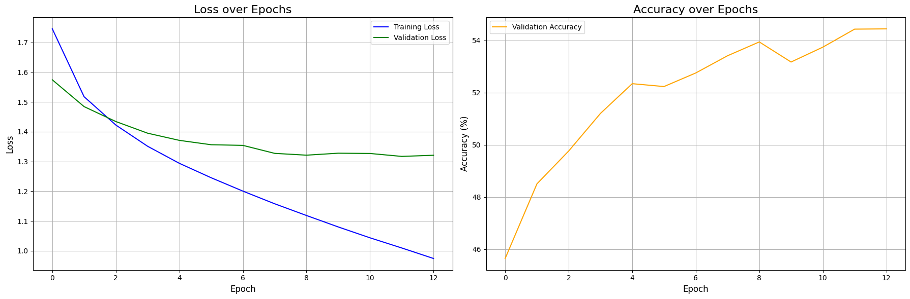
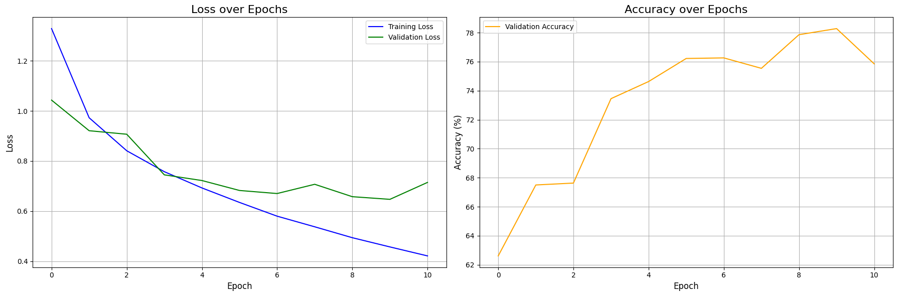

# 图像处理相关模型复现手记

## 复现使用的代码框架

本文的一系列复现基于下面的代码，代码运行在 Kaggle 的 Jupyter Notebook 上面。所以我根据 Notebook 的每一个 Cell 来给出代码。

这个代码框架的大致介绍是：通过模型暴露的一个接口函数获取模型实例，然后使用 hyperopt 框架，在 CIFAR-10 数据集上分割 20% 数据用以对模型进行学习率和训练轮次的早停法调参；获取最优参数后，在全量数据上进行训练，最后收集训练信息得到结果和可视化图像。

下面是每一个 Cell 的代码：

<!-- 这里提供可供复制的折叠代码块模板。
<details>

<summary>  </summary>

```python

```

</details>
-->

<details>

<summary> Cell 1: 引入必要的库以及设置设备 </summary>

```python
import torch
import torch.nn as nn
import torchvision
import torchvision.transforms as transforms
from torch.utils.data import DataLoader, random_split, Subset
import matplotlib.pyplot as plt
import numpy as np
import time

# 导入 hyperopt 用于超参数调优
from hyperopt import fmin, tpe, hp, Trials, STATUS_OK

# 导入 tqdm，在 jupyter 中使用 notebook 版本
from tqdm.notebook import tqdm

# torch.manual_seed(3407) is all you need!
# 为了实验复现性使用的手动种子。
torch.manual_seed(3407)

# 设置设备
device = torch.device('cuda' if torch.cuda.is_available() else 'cpu')
print(f"using device: {device}")
```

</details>


<details>

<summary> Cell 2: 调优和训练使用的参数 </summary>

```python
# --- Hyperopt 调优参数 ---
TUNE_DATA_PERCENT = 0.2     # 使用 20% 的数据进行快速调优
TUNE_MAX_EPOCHS = 50        # 调优时，每个试验最多训练的 epoch 数
PATIENCE = 5                # 早停法：验证损失连续 5 个 epoch 没有改善就停止
MAX_EVALS = 20              # 调优总共尝试的次数
LR_SEARCH_RANGE = (-10, -4) # 学习率对数搜索范围，也就是 exp(-4)~exp(-10) 大概 2e-2 到4e-5 之间

# --- 最终训练参数，这里只是声明，具体值由调优过程决定 ---
BEST_LEARNING_RATE = None
BEST_EPOCHS = None
BATCH_SIZE = 128
```

</details>

<details>

<summary> Cell 3: 绘图和评估相关函数 </summary>

```python
def evaluate_model(model, data_loader, criterion, device):
    """评估模型，返回平均损失和准确率"""
    model.eval()
    total_loss = 0.0
    correct = 0
    total = 0
    with torch.no_grad():
        for images, labels in data_loader:
            images, labels = images.to(device), labels.to(device)
            outputs = model(images)
            loss = criterion(outputs, labels)
            total_loss += loss.item() * images.size(0)
            
            _, predicted = torch.max(outputs.data, 1)
            total += labels.size(0)
            correct += (predicted == labels).sum().item()
            
    avg_loss = total_loss / total
    accuracy = 100 * correct / total
    return avg_loss, accuracy

def count_parameters(model):
    """计算模型的可训练参数数量"""
    return sum(p.numel() for p in model.parameters() if p.requires_grad)

def plot_and_save_history(history, filename="training_curves.png"):
    """绘制并保存训练过程中的损失和准确率曲线"""
    fig, (ax1, ax2) = plt.subplots(1, 2, figsize=(18, 6))
    
    # 绘制损失曲线 (训练 vs 验证/测试)
    ax1.plot(history['train_loss'], label='Training Loss', color='blue')
    if 'val_loss' in history:
        ax1.plot(history['val_loss'], label='Validation Loss', color='green')
    ax1.set_title('Loss over Epochs', fontsize=16)
    ax1.set_xlabel('Epoch', fontsize=12)
    ax1.set_ylabel('Loss', fontsize=12)
    ax1.grid(True)
    ax1.legend()

    # 绘制准确率曲线
    if 'val_accuracy' in history:
        ax2.plot(history['val_accuracy'], label='Validation Accuracy', color='orange')
    ax2.set_title('Accuracy over Epochs', fontsize=16)
    ax2.set_xlabel('Epoch', fontsize=12)
    ax2.set_ylabel('Accuracy (%)', fontsize=12)
    ax2.grid(True)
    ax2.legend()
    
    plt.tight_layout()
    plt.savefig(filename, bbox_inches='tight')
    print(f"Traing curve saved at {filename}")
    plt.show()
```

</details>

<details>

<summary> Cell 4: 定义模型 </summary>

```python
"""
这里使用 MLP 作为示例。为了保证框架和模型解耦，统一只暴露一个 get_model_on_device 的无参数函数用以返回新的模型实例。
"""

# 模型结构参数
INPUT_SIZE = 32 * 32 * 3
HIDDEN_SIZE_1 = 512
HIDDEN_SIZE_2 = 256

class MLP(nn.Module):
    def __init__(self, input_size, hidden_size_1, hidden_size_2, num_classes):
        super(MLP, self).__init__()
        self.network = nn.Sequential(
            nn.Flatten(), # 将 3x32x32 的图像展平成一维向量
            nn.Linear(input_size, hidden_size_1),
            nn.ReLU(),
            nn.Linear(hidden_size_1, hidden_size_2),
            nn.ReLU(),
            nn.Linear(hidden_size_2, num_classes)
        )
        
    def forward(self, x):
        return self.network(x)

# 对外接口，方便后续实验改模型结构
def get_model_on_device():
    return MLP(INPUT_SIZE, HIDDEN_SIZE_1, HIDDEN_SIZE_2, NUM_CLASSES).to(device)
```

</details>

<details>

<summary> Cell 5: 加载并划分数据集 </summary>

```python
# 数据集参数
NUM_CLASSES = 10

# 定义数据预处理
transform = transforms.Compose([
    transforms.ToTensor(),
    transforms.Normalize(
        (0.4914, 0.4822, 0.4465), 
        (0.2023, 0.1994, 0.2010)
    )
])

# 加载完整的 CIFAR-10 训练集
full_train_dataset = torchvision.datasets.CIFAR10(
    root='./data', 
    train=True, 
    transform=transform, 
    download=True
)

# --- 为调优创建小规模数据集 ---
num_total_train = len(full_train_dataset)
tune_subset_size = int(num_total_train * TUNE_DATA_PERCENT)

# 随机抽取 20% 的数据索引
indices = torch.randperm(num_total_train).tolist()
tune_indices = indices[:tune_subset_size]

# 创建一个只包含这 20% 数据的数据集子集
tune_dataset = Subset(full_train_dataset, tune_indices)

# 将这个子集再划分为训练集和验证集 (80% train, 20% val)
num_tune = len(tune_dataset)
val_size_tune = int(num_tune * 0.2)
train_size_tune = num_tune - val_size_tune
train_subset_tune, val_subset_tune = random_split(tune_dataset, [train_size_tune, val_size_tune])

# 创建用于调优的数据加载器
train_loader_tune = DataLoader(dataset=train_subset_tune, batch_size=BATCH_SIZE, shuffle=True)
val_loader_tune = DataLoader(dataset=val_subset_tune, batch_size=BATCH_SIZE, shuffle=False)

print(f"total samples being used for hyperopt: {len(tune_dataset)}")
print(f"Train set size: {len(train_subset_tune)}")
print(f"Validation set size: {len(val_subset_tune)}")
```

</details>

<details>

<summary> Cell 6: 使用 hyperopt 对模型进行超参数搜索 </summary>

```python
def objective(params):
    """Hyperopt 优化的目标函数"""
    lr = params['lr']
    
    model = get_model_on_device()
    criterion = nn.CrossEntropyLoss()
    optimizer = torch.optim.Adam(model.parameters(), lr=lr)
    
    best_val_loss = float('inf')
    epochs_no_improve = 0
    best_epoch = 0
    
    # 使用 tqdm 可视化每个 trial 的 epoch 进度
    epoch_iterator = tqdm(range(TUNE_MAX_EPOCHS), desc=f"LR {lr:.6f}", leave=False)
    for epoch in epoch_iterator:
        model.train()
        for images, labels in train_loader_tune:
            images, labels = images.to(device), labels.to(device)
            optimizer.zero_grad()
            outputs = model(images)
            loss = criterion(outputs, labels)
            loss.backward()
            optimizer.step()
            
        val_loss, val_accuracy = evaluate_model(model, val_loader_tune, criterion, device)
        
        # 更新进度条显示当前验证损失
        epoch_iterator.set_postfix({'val_loss': f'{val_loss:.4f}'})

        if val_loss < best_val_loss:
            best_val_loss = val_loss
            epochs_no_improve = 0
            best_epoch = epoch + 1
        else:
            epochs_no_improve += 1

        if epochs_no_improve == PATIENCE:
            print(f"Early stopping triggered at epoch {epoch + 1}")
            break
            
    return {'loss': best_val_loss, 'status': STATUS_OK, 'best_epoch': best_epoch}

# 定义学习率的搜索空间
space = {'lr': hp.loguniform('lr', *LR_SEARCH_RANGE)}

print("--- Start finding best hyper parameters ---")
trials = Trials()
best_params = fmin(
    fn=objective,
    space=space,
    algo=tpe.suggest,
    max_evals=MAX_EVALS,
    trials=trials,
)

# 从 trials 对象中找到最佳试验的结果
best_trial = trials.best_trial
BEST_LEARNING_RATE = best_params['lr']
BEST_EPOCHS = best_trial['result']['best_epoch']

print("\n--- Best hyper parameters found ---")
print(f"Best LR: {BEST_LEARNING_RATE:.6f}")
print(f"Best epochs: {BEST_EPOCHS}")
```

</details>

<details>

<summary> Cell 7: 在完整训练集上进行训练并监控性能 </summary>

```python
print("\n--- Start training on full training set ---")

# 使用完整的训练数据集 (50000张图片)
full_train_loader = DataLoader(dataset=full_train_dataset, batch_size=BATCH_SIZE, shuffle=True)
# 测试集加载器
test_dataset = torchvision.datasets.CIFAR10(root='./data', train=False, transform=transform)
test_loader = DataLoader(dataset=test_dataset, batch_size=BATCH_SIZE, shuffle=False)

# 重新实例化模型和优化器
final_model = get_model_on_device()
criterion = nn.CrossEntropyLoss()
optimizer = torch.optim.Adam(final_model.parameters(), lr=BEST_LEARNING_RATE)

history = {'train_loss': [], 'val_loss': [], 'val_accuracy': []}

start_time = time.time()

for epoch in range(BEST_EPOCHS):
    # --- 训练 ---
    final_model.train()
    running_loss = 0.0
    
    train_iterator = tqdm(full_train_loader, desc=f"Epoch {epoch+1}/{BEST_EPOCHS}", leave=False)
    for images, labels in train_iterator:
        images, labels = images.to(device), labels.to(device)
        optimizer.zero_grad()
        outputs = final_model(images)
        loss = criterion(outputs, labels)
        loss.backward()
        optimizer.step()
        running_loss += loss.item() * images.size(0)
    
    epoch_train_loss = running_loss / len(full_train_loader.dataset)
    history['train_loss'].append(epoch_train_loss)
    
    # --- 在测试集上评估以监控性能 ---
    epoch_val_loss, epoch_val_accuracy = evaluate_model(final_model, test_loader, criterion, device)
    history['val_loss'].append(epoch_val_loss)
    history['val_accuracy'].append(epoch_val_accuracy)

    print(f"Epoch [{epoch+1}/{BEST_EPOCHS}], Train Loss: {epoch_train_loss:.4f}, Test Loss: {epoch_val_loss:.4f}, Test Accuracy: {epoch_val_accuracy:.2f}%")

end_time = time.time()
training_duration = end_time - start_time

print("--- Over ---")
```

</details>

<details>

<summary> Cell 8: 生成实验的结果报告 </summary>

```python
# 计算最终模型在测试集上的性能
final_test_loss, final_test_accuracy = evaluate_model(final_model, test_loader, criterion, device)

# 计算模型参数量
total_params = count_parameters(final_model)

# 格式化训练时长
mins, secs = divmod(training_duration, 60)
formatted_duration = f"{int(mins)}m {int(secs)}s"

# 绘制并保存性能曲线
report_history = {
    'train_loss': history['train_loss'],
    'val_loss': history['val_loss'],
    'val_accuracy': history['val_accuracy']
}
plot_and_save_history(report_history)

# 打印报告
print("\n" + "="*50)
print(" " * 15 + "Results")
print("="*50)

print("\n[Hyper parameters]")
print(f"  - Best LR: {BEST_LEARNING_RATE:.6f}")
print(f"  - Best epochs: {BEST_EPOCHS} epochs")
print(f"  - Batch size: {BATCH_SIZE}")

print("\n[Model structure]")
print(f"  - Model type: MLP")
print(f"  - Model structure:")
print(final_model)
print(f"  - Total params: {total_params:,}")

print("\n[Training infomation]")
print(f"  - Training duration on full training set: {formatted_duration}")
platform = "Kaggle's free P100, Thank you Google!" if torch.cuda.is_available() else "some poor guy's broken Intel core"
print(f"  - Training device: {device} on {platform}")

print("\n[Benchmarks on test set]")
print(f"  - Test loss: {final_test_loss:.4f}")
print(f"  - Test accuracy: {final_test_accuracy:.2f}%")

print("\n" + "="*50)
```

</details>

## 多层感知机

### MLP 模型的训练结果展示



```text
==================================================
               Results
==================================================

[Hyper parameters]
  - Best LR: 0.000056
  - Best epochs: 13 epochs
  - Batch size: 128

[Model structure]
  - Model type: MLP
  - Model structure:
MLP(
  (network): Sequential(
    (0): Flatten(start_dim=1, end_dim=-1)
    (1): Linear(in_features=3072, out_features=512, bias=True)
    (2): ReLU()
    (3): Linear(in_features=512, out_features=256, bias=True)
    (4): ReLU()
    (5): Linear(in_features=256, out_features=10, bias=True)
  )
)
  - Total params: 1,707,274

[Training infomation]
  - Training duration on full training set: 2m 51s
  - Training device: cuda on Kaggle's free P100, Thank you Google!

[Benchmarks on test set]
  - Test loss: 1.3208
  - Test accuracy: 54.44%

==================================================
```

### 对 MLP 模型的解读和评述

这是一个二层的多层感知机，参数量 1.7M。这点参数量反映下来就是即使是 P100 这种老 GPU 都根本没使劲，倒是 CPU 一直在满负荷发力，搬运数据。

对于图像分类任务而言，MLP 的做法是将其展平成一维向量来丢进矩阵里面跑。我第一次接触的时候就觉得这很没道理，图像本身就有两个维度，这种“平面化”的信息，感觉就被一个 nn.Flatten 给丢弃了。

事实上结果也是这样，

## 卷积神经网络

```python
class CNN(nn.Module):
    def __init__(self, 
                 input_channels=3,
                 num_classes=10,
                 channels=[32, 64, 128],   # 每个卷积块的输出通道数
                 kernel_sizes=[3, 3, 3],   # 每个卷积层的 kernel 大小
                 dropout_rate=0.5,         # dropout 概率
                 use_batchnorm=True):      # 是否使用批归一化
        super(CNN, self).__init__()
        
        # 存储配置参数
        self.config = {
            'input_channels': input_channels,
            'num_classes': num_classes,
            'channels': channels,
            'kernel_sizes': kernel_sizes,
            'dropout_rate': dropout_rate,
            'use_batchnorm': use_batchnorm
        }
        
        # 确保卷积层数量与 kernel 大小数量一致
        assert len(channels) == len(kernel_sizes), \
            "通道数列表与kernel大小列表长度必须一致"
        
        # 构建卷积层
        self.features = nn.Sequential()
        in_channels = input_channels
        
        for i, (out_channels, kernel_size) in enumerate(zip(channels, kernel_sizes)):
            # 卷积层
            self.features.add_module(
                f'conv{i+1}',
                nn.Conv2d(in_channels, out_channels, kernel_size, padding=kernel_size//2)
            )
            
            # 批归一化层（可选）
            if use_batchnorm:
                self.features.add_module(
                    f'bn{i+1}',
                    nn.BatchNorm2d(out_channels)
                )
            
            # 激活函数
            self.features.add_module(f'relu{i+1}', nn.ReLU(inplace=True))
            
            # 池化层
            self.features.add_module(f'pool{i+1}', nn.MaxPool2d(2, 2))
            
            in_channels = out_channels
        
        # 计算卷积层输出后的特征图尺寸
        # CIFAR-10输入为32x32，经过n次池化后尺寸为32/(2^n)
        self.feature_size = in_channels * (32 // (2 ** len(channels))) ** 2
        
        # 构建全连接层
        self.classifier = nn.Sequential(
            nn.Linear(self.feature_size, 512),
            nn.ReLU(inplace=True),
            nn.Dropout(dropout_rate),
            nn.Linear(512, num_classes)
        )

    def forward(self, x):
        x = self.features(x)
        x = x.view(x.size(0), -1)  # 展平特征图
        x = self.classifier(x)
        return x

def get_model_on_device():
    return CNN().to(device)
```



```text
==================================================
               Results
==================================================

[Hyper parameters]
  - Best LR: 0.000565
  - Best epochs: 11 epochs
  - Batch size: 128

[Model structure]
  - Model type: CNN
  - Model structure:
CNN(
  (features): Sequential(
    (conv1): Conv2d(3, 32, kernel_size=(3, 3), stride=(1, 1), padding=(1, 1))
    (bn1): BatchNorm2d(32, eps=1e-05, momentum=0.1, affine=True, track_running_stats=True)
    (relu1): ReLU(inplace=True)
    (pool1): MaxPool2d(kernel_size=2, stride=2, padding=0, dilation=1, ceil_mode=False)
    (conv2): Conv2d(32, 64, kernel_size=(3, 3), stride=(1, 1), padding=(1, 1))
    (bn2): BatchNorm2d(64, eps=1e-05, momentum=0.1, affine=True, track_running_stats=True)
    (relu2): ReLU(inplace=True)
    (pool2): MaxPool2d(kernel_size=2, stride=2, padding=0, dilation=1, ceil_mode=False)
    (conv3): Conv2d(64, 128, kernel_size=(3, 3), stride=(1, 1), padding=(1, 1))
    (bn3): BatchNorm2d(128, eps=1e-05, momentum=0.1, affine=True, track_running_stats=True)
    (relu3): ReLU(inplace=True)
    (pool3): MaxPool2d(kernel_size=2, stride=2, padding=0, dilation=1, ceil_mode=False)
  )
  (classifier): Sequential(
    (0): Linear(in_features=2048, out_features=512, bias=True)
    (1): ReLU(inplace=True)
    (2): Dropout(p=0.5, inplace=False)
    (3): Linear(in_features=512, out_features=10, bias=True)
  )
)
  - Total params: 1,147,914

[Training infomation]
  - Training duration on full training set: 2m 33s
  - Training device: cuda on Kaggle's free P100, Thank you Google!

[Benchmarks on test set]
  - Test loss: 0.7148
  - Test accuracy: 75.85%

==================================================
```

## 在 CIFAR-10 上从零训练 ResNet-18

## 对预训练 ResNet-18 在 CIFAR-10 上进行微调

```python
from torchvision.models import resnet18
class ResNet18(nn.Module):
    def __init__(self, pretrained=False, num_classes=10):
        super(ResNet18, self).__init__()
        # 加载预训练或随机初始化的ResNet-18
        self.resnet = resnet18(pretrained=pretrained)
        
        # 调整第一个卷积层以适应32x32输入
        # 原始ResNet-18的第一个卷积层是7x7, stride=2, padding=3
        # 对于32x32图像，我们改为3x3, stride=1, padding=1
        self.resnet.conv1 = nn.Conv2d(
            3, 64, kernel_size=3, stride=1, padding=1, bias=False
        )
        
        # 调整最大池化层，不需要下采样太多
        self.resnet.maxpool = nn.Identity()  # 移除最大池化层
        
        # 调整最后一个全连接层以适应CIFAR-10的10个类别
        in_features = self.resnet.fc.in_features
        self.resnet.fc = nn.Linear(in_features, num_classes)
        
    def forward(self, x):
        return self.resnet(x)

def get_model_on_device():
    model = ResNet18(pretrained=True)
    return model.to(device)
```

```text
==================================================
               Results
==================================================

[Hyper parameters]
  - Best LR: 0.000330
  - Best epochs: 3 epochs
  - Batch size: 128

[Model structure]
  - Model type: Pretrained ResNet18
  - Model structure:
ResNet18(
  (resnet): ResNet(
    (conv1): Conv2d(3, 64, kernel_size=(3, 3), stride=(1, 1), padding=(1, 1), bias=False)
    (bn1): BatchNorm2d(64, eps=1e-05, momentum=0.1, affine=True, track_running_stats=True)
    (relu): ReLU(inplace=True)
    (maxpool): Identity()
    (layer1): Sequential(
      (0): BasicBlock(
        (conv1): Conv2d(64, 64, kernel_size=(3, 3), stride=(1, 1), padding=(1, 1), bias=False)
        (bn1): BatchNorm2d(64, eps=1e-05, momentum=0.1, affine=True, track_running_stats=True)
        (relu): ReLU(inplace=True)
        (conv2): Conv2d(64, 64, kernel_size=(3, 3), stride=(1, 1), padding=(1, 1), bias=False)
        (bn2): BatchNorm2d(64, eps=1e-05, momentum=0.1, affine=True, track_running_stats=True)
      )
      (1): BasicBlock(
        (conv1): Conv2d(64, 64, kernel_size=(3, 3), stride=(1, 1), padding=(1, 1), bias=False)
        (bn1): BatchNorm2d(64, eps=1e-05, momentum=0.1, affine=True, track_running_stats=True)
        (relu): ReLU(inplace=True)
        (conv2): Conv2d(64, 64, kernel_size=(3, 3), stride=(1, 1), padding=(1, 1), bias=False)
        (bn2): BatchNorm2d(64, eps=1e-05, momentum=0.1, affine=True, track_running_stats=True)
      )
    )
    (layer2): Sequential(
      (0): BasicBlock(
        (conv1): Conv2d(64, 128, kernel_size=(3, 3), stride=(2, 2), padding=(1, 1), bias=False)
        (bn1): BatchNorm2d(128, eps=1e-05, momentum=0.1, affine=True, track_running_stats=True)
        (relu): ReLU(inplace=True)
        (conv2): Conv2d(128, 128, kernel_size=(3, 3), stride=(1, 1), padding=(1, 1), bias=False)
        (bn2): BatchNorm2d(128, eps=1e-05, momentum=0.1, affine=True, track_running_stats=True)
        (downsample): Sequential(
          (0): Conv2d(64, 128, kernel_size=(1, 1), stride=(2, 2), bias=False)
          (1): BatchNorm2d(128, eps=1e-05, momentum=0.1, affine=True, track_running_stats=True)
        )
      )
      (1): BasicBlock(
        (conv1): Conv2d(128, 128, kernel_size=(3, 3), stride=(1, 1), padding=(1, 1), bias=False)
        (bn1): BatchNorm2d(128, eps=1e-05, momentum=0.1, affine=True, track_running_stats=True)
        (relu): ReLU(inplace=True)
        (conv2): Conv2d(128, 128, kernel_size=(3, 3), stride=(1, 1), padding=(1, 1), bias=False)
        (bn2): BatchNorm2d(128, eps=1e-05, momentum=0.1, affine=True, track_running_stats=True)
      )
    )
    (layer3): Sequential(
      (0): BasicBlock(
        (conv1): Conv2d(128, 256, kernel_size=(3, 3), stride=(2, 2), padding=(1, 1), bias=False)
        (bn1): BatchNorm2d(256, eps=1e-05, momentum=0.1, affine=True, track_running_stats=True)
        (relu): ReLU(inplace=True)
        (conv2): Conv2d(256, 256, kernel_size=(3, 3), stride=(1, 1), padding=(1, 1), bias=False)
        (bn2): BatchNorm2d(256, eps=1e-05, momentum=0.1, affine=True, track_running_stats=True)
        (downsample): Sequential(
          (0): Conv2d(128, 256, kernel_size=(1, 1), stride=(2, 2), bias=False)
          (1): BatchNorm2d(256, eps=1e-05, momentum=0.1, affine=True, track_running_stats=True)
        )
      )
      (1): BasicBlock(
        (conv1): Conv2d(256, 256, kernel_size=(3, 3), stride=(1, 1), padding=(1, 1), bias=False)
        (bn1): BatchNorm2d(256, eps=1e-05, momentum=0.1, affine=True, track_running_stats=True)
        (relu): ReLU(inplace=True)
        (conv2): Conv2d(256, 256, kernel_size=(3, 3), stride=(1, 1), padding=(1, 1), bias=False)
        (bn2): BatchNorm2d(256, eps=1e-05, momentum=0.1, affine=True, track_running_stats=True)
      )
    )
    (layer4): Sequential(
      (0): BasicBlock(
        (conv1): Conv2d(256, 512, kernel_size=(3, 3), stride=(2, 2), padding=(1, 1), bias=False)
        (bn1): BatchNorm2d(512, eps=1e-05, momentum=0.1, affine=True, track_running_stats=True)
        (relu): ReLU(inplace=True)
        (conv2): Conv2d(512, 512, kernel_size=(3, 3), stride=(1, 1), padding=(1, 1), bias=False)
        (bn2): BatchNorm2d(512, eps=1e-05, momentum=0.1, affine=True, track_running_stats=True)
        (downsample): Sequential(
          (0): Conv2d(256, 512, kernel_size=(1, 1), stride=(2, 2), bias=False)
          (1): BatchNorm2d(512, eps=1e-05, momentum=0.1, affine=True, track_running_stats=True)
        )
      )
      (1): BasicBlock(
        (conv1): Conv2d(512, 512, kernel_size=(3, 3), stride=(1, 1), padding=(1, 1), bias=False)
        (bn1): BatchNorm2d(512, eps=1e-05, momentum=0.1, affine=True, track_running_stats=True)
        (relu): ReLU(inplace=True)
        (conv2): Conv2d(512, 512, kernel_size=(3, 3), stride=(1, 1), padding=(1, 1), bias=False)
        (bn2): BatchNorm2d(512, eps=1e-05, momentum=0.1, affine=True, track_running_stats=True)
      )
    )
    (avgpool): AdaptiveAvgPool2d(output_size=(1, 1))
    (fc): Linear(in_features=512, out_features=10, bias=True)
  )
)
  - Total params: 11,173,962

[Training infomation]
  - Training duration on full training set: 1m 55s
  - Training device: cuda on Kaggle's free P100, Thank you Google!

[Benchmarks on test set]
  - Test loss: 0.3450
  - Test accuracy: 89.06%

==================================================
```

## ViT

```python
from torch import Tensor
class PatchEmbedding(nn.Module):
    """将图像分割为补丁并进行嵌入"""
    def __init__(self, img_size=32, patch_size=4, in_channels=3, embed_dim=128):
        super().__init__()
        self.img_size = img_size
        self.patch_size = patch_size
        
        # 计算补丁数量
        self.num_patches = (img_size // patch_size) ** 2
        
        # 使用卷积层实现补丁嵌入 (等价于每个补丁应用一个卷积核)
        self.proj = nn.Conv2d(
            in_channels, 
            embed_dim, 
            kernel_size=patch_size, 
            stride=patch_size
        )

    def forward(self, x: Tensor) -> Tensor:
        # x形状: (batch_size, in_channels, img_size, img_size)
        x = self.proj(x)  # 输出形状: (batch_size, embed_dim, num_patches^(1/2), num_patches^(1/2))
        x = x.flatten(2)  # 输出形状: (batch_size, embed_dim, num_patches)
        x = x.transpose(1, 2)  # 输出形状: (batch_size, num_patches, embed_dim)
        return x

class TransformerClassifier(nn.Module):
    """用于CIFAR-10分类的Transformer模型"""
    def __init__(
        self,
        img_size=32,
        patch_size=4,
        in_channels=3,
        num_classes=10,
        embed_dim=128,
        depth=4,          # Transformer编码器层数
        num_heads=4,      # 注意力头数
        mlp_ratio=2.0,    # MLP隐藏层维度比例
        dropout=0.1,      # Dropout概率
    ):
        super().__init__()
        
        # 补丁嵌入
        self.patch_embed = PatchEmbedding(
            img_size=img_size,
            patch_size=patch_size,
            in_channels=in_channels,
            embed_dim=embed_dim
        )
        num_patches = self.patch_embed.num_patches
        
        # 类别令牌 (用于最终分类)
        self.class_token = nn.Parameter(torch.zeros(1, 1, embed_dim))
        
        # 位置嵌入 (可学习)
        self.pos_embed = nn.Parameter(torch.zeros(1, num_patches + 1, embed_dim))
        
        # Dropout层
        self.pos_drop = nn.Dropout(p=dropout)
        
        # Transformer编码器
        encoder_layer = nn.TransformerEncoderLayer(
            d_model=embed_dim,
            nhead=num_heads,
            dim_feedforward=int(embed_dim * mlp_ratio),
            dropout=dropout,
            batch_first=True,  # 批处理维度在前
        )
        self.transformer_encoder = nn.TransformerEncoder(encoder_layer, num_layers=depth)
        
        # 分类头
        self.classifier = nn.Sequential(
            nn.LayerNorm(embed_dim),
            nn.Linear(embed_dim, num_classes)
        )

    def forward(self, x: Tensor) -> Tensor:
        # x形状: (batch_size, 3, 32, 32)
        batch_size = x.shape[0]
        
        # 补丁嵌入
        x = self.patch_embed(x)  # 输出形状: (batch_size, num_patches, embed_dim)
        
        # 扩展类别令牌到批次大小
        class_tokens = self.class_token.expand(batch_size, -1, -1)  # 形状: (batch_size, 1, embed_dim)
        
        # 将类别令牌与补丁嵌入拼接
        x = torch.cat((class_tokens, x), dim=1)  # 形状: (batch_size, num_patches + 1, embed_dim)
        
        # 添加位置嵌入并应用dropout
        x = x + self.pos_embed
        x = self.pos_drop(x)
        
        # Transformer编码
        x = self.transformer_encoder(x)  # 形状: (batch_size, num_patches + 1, embed_dim)
        
        # 使用类别令牌的输出进行分类
        x = x[:, 0]  # 取类别令牌对应的输出，形状: (batch_size, embed_dim)
        x = self.classifier(x)  # 形状: (batch_size, num_classes)
        
        return x

def get_model_on_device():
    model = TransformerClassifier(
        img_size=32,
        patch_size=4,
        in_channels=3,
        num_classes=10,
        embed_dim=192,
        depth=4,
        num_heads=8,
        mlp_ratio=2.0,
        dropout=0.1
    )
    return model.to(device)
```

```text
==================================================
               Results
==================================================

[Hyper parameters]
  - Best LR: 0.000456
  - Best epochs: 11 epochs
  - Batch size: 128

[Model structure]
  - Model type: ViT
  - Model structure:
TransformerClassifier(
  (patch_embed): PatchEmbedding(
    (proj): Conv2d(3, 192, kernel_size=(4, 4), stride=(4, 4))
  )
  (pos_drop): Dropout(p=0.1, inplace=False)
  (transformer_encoder): TransformerEncoder(
    (layers): ModuleList(
      (0-3): 4 x TransformerEncoderLayer(
        (self_attn): MultiheadAttention(
          (out_proj): NonDynamicallyQuantizableLinear(in_features=192, out_features=192, bias=True)
        )
        (linear1): Linear(in_features=192, out_features=384, bias=True)
        (dropout): Dropout(p=0.1, inplace=False)
        (linear2): Linear(in_features=384, out_features=192, bias=True)
        (norm1): LayerNorm((192,), eps=1e-05, elementwise_affine=True)
        (norm2): LayerNorm((192,), eps=1e-05, elementwise_affine=True)
        (dropout1): Dropout(p=0.1, inplace=False)
        (dropout2): Dropout(p=0.1, inplace=False)
      )
    )
  )
  (classifier): Sequential(
    (0): LayerNorm((192,), eps=1e-05, elementwise_affine=True)
    (1): Linear(in_features=192, out_features=10, bias=True)
  )
)
  - Total params: 1,212,490

[Training infomation]
  - Training duration on full training set: 4m 43s
  - Training device: cuda on Kaggle's free P100, Thank you Google!

[Benchmarks on test set]
  - Test loss: 0.8867
  - Test accuracy: 69.90%

==================================================
```