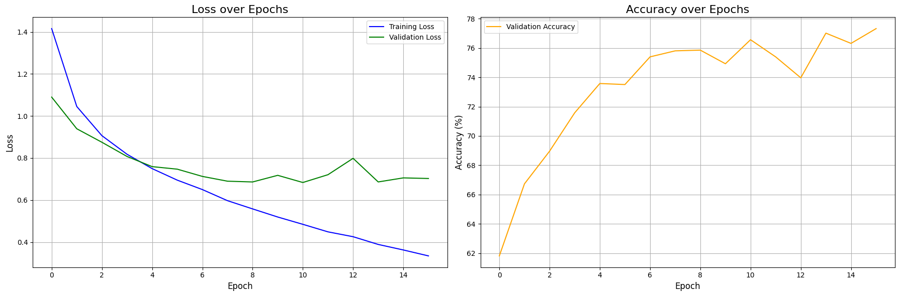

# 图像分类相关模型复现手记

这是模型复现手记的第一篇，主要挑几个经典或者邪门的图像分类模型进行复现。相关模型的架构和理论在网上都有诸多的讨论了，本文就不赘述。

前面的 MLP, CNN, ResNet, ViT 都是经典的图像分类模型，后面准备介绍的是几个邪门的模型，即参考 ViT 思想的 Patch based LSTM 以及两个半监督的生成模型，即 VAE 和 AC-GAN。邪门模型之所以邪门，主要在于它能给我一种 “卧槽这也能编码图像数据” 的感觉，或者仅仅因为其准确率低到可笑。

而本文正是基于笔者对模型架构的认知，针对复现时遇到的许多现象提出自己的理解。因此必然会有值得商榷之处。也欢迎大家在评论区讨论。

## 复现使用的代码框架

本文的一系列复现基于下面的代码，代码运行在 Kaggle 的 Jupyter Notebook 上面。所以我根据 Notebook 的每一个 Cell 来给出代码。

这个代码框架的大致介绍是：通过模型暴露的一个接口函数 `get_model_on_device()` 获取模型实例，然后使用 hyperopt 框架，在 CIFAR-10 数据集上分割 20% 数据用以对模型进行全局学习率和训练轮次的早停法调参；获取最优参数后，在全量数据上进行训练，最后收集训练信息得到结果和部分数据变化的可视化图像。

由于每一次都要花大量时间寻找合适的学习率，笔者花了一天时间研究了一下 muP（[Paper link here](https://arxiv.org/abs/2203.03466)） 的原理以及怎样迁移学习率，结论：在已有数据上（MLP, CNN, ResNet-18）进行的实验和相关理论计算证明，模型架构（残差连接，BN 等）会影响损失地形（[Paper link here](https://arxiv.org/pdf/1712.09913)），导致跨架构的学习率迁移失效。其实很明显，比如微调ResNet就比从零训练ResNet的best LR更低，因为预训练权重已经在一个最小值附近了，损失地形比起随机点位更平坦。所以该花时间调参还得花时间调参。不过，可以考虑在小宽度模型上再 scale up，这样就符合 muP 的初心了。具体的实验过程，还请大家参阅后文。

当然，这个框架也有缺陷，主要是它只能对端到端的网络进行一键式训练和评估，像 VAE 和 AC-GAN 这种标签辅助的生成网络，就需要自行修改了。

下面是每一个 Cell 的代码：

<!-- 这里提供可供复制的折叠代码块模板。
<details>

<summary>  </summary>

```python

```

</details>
-->

<details>

<summary> Cell 1: 引入必要的库以及设置设备 </summary>

```python
import torch
import torch.nn as nn
import torchvision
import torchvision.transforms as transforms
from torch.utils.data import DataLoader, random_split, Subset
import matplotlib.pyplot as plt
import numpy as np
import time

# 导入 hyperopt 用于超参数调优
from hyperopt import fmin, tpe, hp, Trials, STATUS_OK

# 导入 tqdm，在 jupyter 中使用 notebook 版本
from tqdm.notebook import tqdm

# torch.manual_seed(3407) is all you need!
# 为了实验复现性使用的手动种子。
torch.manual_seed(3407)

# 设置设备
device = torch.device('cuda' if torch.cuda.is_available() else 'cpu')
print(f"using device: {device}")
```

</details>

<details>

<summary> Cell 2: 调优和训练使用的参数 </summary>

```python
# --- Hyperopt 调优参数 ---
TUNE_DATA_PERCENT = 0.2     # 使用 20% 的数据进行快速调优
TUNE_MAX_EPOCHS = 50        # 调优时，每个试验最多训练的 epoch 数
PATIENCE = 5                # 早停法：验证损失连续 5 个 epoch 没有改善就停止
MAX_EVALS = 20              # 调优总共尝试的次数
LR_SEARCH_RANGE = (-10, -4) # 学习率对数搜索范围，也就是 exp(-4)~exp(-10) 大概 2e-2 到4e-5 之间

# --- 最终训练参数，这里只是声明，具体值由调优过程决定 ---
BEST_LEARNING_RATE = None
BEST_EPOCHS = None
BATCH_SIZE = 128
```

</details>

<details>

<summary> Cell 3: 绘图和评估相关函数 </summary>

```python
def evaluate_model(model, data_loader, criterion, device):
    """评估模型，返回平均损失和准确率"""
    model.eval()
    total_loss = 0.0
    correct = 0
    total = 0
    with torch.no_grad():
        for images, labels in data_loader:
            images, labels = images.to(device), labels.to(device)
            outputs = model(images)
            loss = criterion(outputs, labels)
            total_loss += loss.item() * images.size(0)
            
            _, predicted = torch.max(outputs.data, 1)
            total += labels.size(0)
            correct += (predicted == labels).sum().item()
            
    avg_loss = total_loss / total
    accuracy = 100 * correct / total
    return avg_loss, accuracy

def count_parameters(model):
    """计算模型的可训练参数数量"""
    return sum(p.numel() for p in model.parameters() if p.requires_grad)

def plot_and_save_history(history, filename="training_curves.png"):
    """绘制并保存训练过程中的损失和准确率曲线"""
    fig, (ax1, ax2) = plt.subplots(1, 2, figsize=(18, 6))
    
    # 绘制损失曲线 (训练 vs 验证/测试)
    ax1.plot(history['train_loss'], label='Training Loss', color='blue')
    if 'val_loss' in history:
        ax1.plot(history['val_loss'], label='Validation Loss', color='green')
    ax1.set_title('Loss over Epochs', fontsize=16)
    ax1.set_xlabel('Epoch', fontsize=12)
    ax1.set_ylabel('Loss', fontsize=12)
    ax1.grid(True)
    ax1.legend()

    # 绘制准确率曲线
    if 'val_accuracy' in history:
        ax2.plot(history['val_accuracy'], label='Validation Accuracy', color='orange')
    ax2.set_title('Accuracy over Epochs', fontsize=16)
    ax2.set_xlabel('Epoch', fontsize=12)
    ax2.set_ylabel('Accuracy (%)', fontsize=12)
    ax2.grid(True)
    ax2.legend()
    
    plt.tight_layout()
    plt.savefig(filename, bbox_inches='tight')
    print(f"Traing curve saved at {filename}")
    plt.show()
```

</details>

<details>

<summary> Cell 4: 定义模型 </summary>

```python
"""
这里使用 MLP 作为示例。为了保证框架和模型解耦，统一只暴露一个 get_model_on_device 的无参数函数用以返回新的模型实例。
"""

# 模型结构参数
INPUT_SIZE = 32 * 32 * 3
HIDDEN_SIZE_1 = 512
HIDDEN_SIZE_2 = 256

class MLP(nn.Module):
    def __init__(self, input_size, hidden_size_1, hidden_size_2, num_classes):
        super(MLP, self).__init__()
        self.network = nn.Sequential(
            nn.Flatten(), # 将 3x32x32 的图像展平成一维向量
            nn.Linear(input_size, hidden_size_1),
            nn.ReLU(),
            nn.Linear(hidden_size_1, hidden_size_2),
            nn.ReLU(),
            nn.Linear(hidden_size_2, num_classes)
        )
        
    def forward(self, x):
        return self.network(x)

# 对外接口，方便后续实验改模型结构
def get_model_on_device():
    return MLP(INPUT_SIZE, HIDDEN_SIZE_1, HIDDEN_SIZE_2, NUM_CLASSES).to(device)
```

</details>

<details>

<summary> Cell 5: 加载并划分数据集 </summary>

```python
# 数据集参数
NUM_CLASSES = 10

# 定义数据预处理
transform = transforms.Compose([
    transforms.ToTensor(),
    transforms.Normalize(
        (0.4914, 0.4822, 0.4465), 
        (0.2023, 0.1994, 0.2010)
    )
])

# 加载完整的 CIFAR-10 训练集
full_train_dataset = torchvision.datasets.CIFAR10(
    root='./data', 
    train=True, 
    transform=transform, 
    download=True
)

# --- 为调优创建小规模数据集 ---
num_total_train = len(full_train_dataset)
tune_subset_size = int(num_total_train * TUNE_DATA_PERCENT)

# 随机抽取 20% 的数据索引
indices = torch.randperm(num_total_train).tolist()
tune_indices = indices[:tune_subset_size]

# 创建一个只包含这 20% 数据的数据集子集
tune_dataset = Subset(full_train_dataset, tune_indices)

# 将这个子集再划分为训练集和验证集 (80% train, 20% val)
num_tune = len(tune_dataset)
val_size_tune = int(num_tune * 0.2)
train_size_tune = num_tune - val_size_tune
train_subset_tune, val_subset_tune = random_split(tune_dataset, [train_size_tune, val_size_tune])

# 创建用于调优的数据加载器
train_loader_tune = DataLoader(dataset=train_subset_tune, batch_size=BATCH_SIZE, shuffle=True)
val_loader_tune = DataLoader(dataset=val_subset_tune, batch_size=BATCH_SIZE, shuffle=False)

print(f"total samples being used for hyperopt: {len(tune_dataset)}")
print(f"Train set size: {len(train_subset_tune)}")
print(f"Validation set size: {len(val_subset_tune)}")
```

</details>

<details>

<summary> Cell 6: 使用 hyperopt 对模型进行超参数搜索 </summary>

```python
def objective(params):
    """Hyperopt 优化的目标函数"""
    lr = params['lr']
    
    model = get_model_on_device()
    criterion = nn.CrossEntropyLoss()
    optimizer = torch.optim.Adam(model.parameters(), lr=lr)
    
    best_val_loss = float('inf')
    epochs_no_improve = 0
    best_epoch = 0
    
    # 使用 tqdm 可视化每个 trial 的 epoch 进度
    epoch_iterator = tqdm(range(TUNE_MAX_EPOCHS), desc=f"LR {lr:.6f}", leave=False)
    for epoch in epoch_iterator:
        model.train()
        for images, labels in train_loader_tune:
            images, labels = images.to(device), labels.to(device)
            optimizer.zero_grad()
            outputs = model(images)
            loss = criterion(outputs, labels)
            loss.backward()
            optimizer.step()
            
        val_loss, val_accuracy = evaluate_model(model, val_loader_tune, criterion, device)
        
        # 更新进度条显示当前验证损失
        epoch_iterator.set_postfix({'val_loss': f'{val_loss:.4f}'})

        if val_loss < best_val_loss:
            best_val_loss = val_loss
            epochs_no_improve = 0
            best_epoch = epoch + 1
        else:
            epochs_no_improve += 1

        if epochs_no_improve == PATIENCE:
            print(f"Early stopping triggered at epoch {epoch + 1}")
            break
            
    return {'loss': best_val_loss, 'status': STATUS_OK, 'best_epoch': best_epoch}

# 定义学习率的搜索空间
space = {'lr': hp.loguniform('lr', *LR_SEARCH_RANGE)}

print("--- Start finding best hyper parameters ---")
trials = Trials()
best_params = fmin(
    fn=objective,
    space=space,
    algo=tpe.suggest,
    max_evals=MAX_EVALS,
    trials=trials,
)

# 从 trials 对象中找到最佳试验的结果
best_trial = trials.best_trial
BEST_LEARNING_RATE = best_params['lr']
BEST_EPOCHS = best_trial['result']['best_epoch']

print("\n--- Best hyper parameters found ---")
print(f"Best LR: {BEST_LEARNING_RATE:.6f}")
print(f"Best epochs: {BEST_EPOCHS}")
```

</details>

<details>

<summary> Cell 7: 在完整训练集上进行训练并监控性能 </summary>

```python
print("\n--- Start training on full training set ---")

# 使用完整的训练数据集 (50000张图片)
full_train_loader = DataLoader(dataset=full_train_dataset, batch_size=BATCH_SIZE, shuffle=True)
# 测试集加载器
test_dataset = torchvision.datasets.CIFAR10(root='./data', train=False, transform=transform)
test_loader = DataLoader(dataset=test_dataset, batch_size=BATCH_SIZE, shuffle=False)

# 重新实例化模型和优化器
final_model = get_model_on_device()
criterion = nn.CrossEntropyLoss()
optimizer = torch.optim.Adam(final_model.parameters(), lr=BEST_LEARNING_RATE)

history = {'train_loss': [], 'val_loss': [], 'val_accuracy': []}

start_time = time.time()

for epoch in range(BEST_EPOCHS):
    # --- 训练 ---
    final_model.train()
    running_loss = 0.0
    
    train_iterator = tqdm(full_train_loader, desc=f"Epoch {epoch+1}/{BEST_EPOCHS}", leave=False)
    for images, labels in train_iterator:
        images, labels = images.to(device), labels.to(device)
        optimizer.zero_grad()
        outputs = final_model(images)
        loss = criterion(outputs, labels)
        loss.backward()
        optimizer.step()
        running_loss += loss.item() * images.size(0)
    
    epoch_train_loss = running_loss / len(full_train_loader.dataset)
    history['train_loss'].append(epoch_train_loss)
    
    # --- 在测试集上评估以监控性能 ---
    epoch_val_loss, epoch_val_accuracy = evaluate_model(final_model, test_loader, criterion, device)
    history['val_loss'].append(epoch_val_loss)
    history['val_accuracy'].append(epoch_val_accuracy)

    print(f"Epoch [{epoch+1}/{BEST_EPOCHS}], Train Loss: {epoch_train_loss:.4f}, Test Loss: {epoch_val_loss:.4f}, Test Accuracy: {epoch_val_accuracy:.2f}%")

end_time = time.time()
training_duration = end_time - start_time

print("--- Over ---")
```

</details>

<details>

<summary> Cell 8: 生成实验的结果报告 </summary>

```python
# 计算最终模型在测试集上的性能
final_test_loss, final_test_accuracy = evaluate_model(final_model, test_loader, criterion, device)

# 计算模型参数量
total_params = count_parameters(final_model)

# 格式化训练时长
mins, secs = divmod(training_duration, 60)
formatted_duration = f"{int(mins)}m {int(secs)}s"

# 绘制并保存性能曲线
report_history = {
    'train_loss': history['train_loss'],
    'val_loss': history['val_loss'],
    'val_accuracy': history['val_accuracy']
}
plot_and_save_history(report_history)

# 打印报告
print("\n" + "="*50)
print(" " * 15 + "Results")
print("="*50)

print("\n[Hyper parameters]")
print(f"  - Best LR: {BEST_LEARNING_RATE:.6f}")
print(f"  - Best epochs: {BEST_EPOCHS} epochs")
print(f"  - Batch size: {BATCH_SIZE}")

print("\n[Model structure]")
print(f"  - Model type: MLP")
print(f"  - Model structure:")
print(final_model)
print(f"  - Total params: {total_params:,}")

print("\n[Training infomation]")
print(f"  - Training duration on full training set: {formatted_duration}")
platform = "Kaggle's free P100, Thank you Google!" if torch.cuda.is_available() else "some poor guy's broken Intel core"
print(f"  - Training device: {device} on {platform}")

print("\n[Benchmarks on test set]")
print(f"  - Test loss: {final_test_loss:.4f}")
print(f"  - Test accuracy: {final_test_accuracy:.2f}%")

print("\n" + "="*50)
```

</details>

## MLP

### MLP 模型的训练结果展示


```text
==================================================
               Results
==================================================

[Hyper parameters]
  - Best LR: 0.000056
  - Best epochs: 13 epochs
  - Batch size: 128

[Model structure]
  - Model type: MLP
  - Model structure:
MLP(
  (network): Sequential(
    (0): Flatten(start_dim=1, end_dim=-1)
    (1): Linear(in_features=3072, out_features=512, bias=True)
    (2): ReLU()
    (3): Linear(in_features=512, out_features=256, bias=True)
    (4): ReLU()
    (5): Linear(in_features=256, out_features=10, bias=True)
  )
)
  - Total params: 1,707,274

[Training infomation]
  - Training duration on full training set: 2m 51s
  - Training device: cuda on Kaggle's free P100, Thank you Google!

[Benchmarks on test set]
  - Test loss: 1.3208
  - Test accuracy: 54.44%

==================================================
```

### 对 MLP 模型的解读和评述

模型结构图：


MLP 是利用 $\mathbb{R}^n\rightarrow\mathbb{R}^m$ 的多重线性映射实现数据的降维，但是单纯的线性映射嵌套仍是 $\mathbb{R}^{d_{in}}\rightarrow\mathbb{R}^{d_{out}}$ 的线性映射，因此需要在层与层之间添加非线性的激活函数引入非线性。这样一个足够宽的两层全连接网络即可拟合任意函数。

在这个任务里面，我们使用一个三层的 MLP，并采用 ReLU 作为层间的激活函数，由于我们对 one-hot 向量进行分类，因此使用交叉熵损失，如果用 MSE 的话，求导之后会发现它是交叉熵的导数乘以权重，这就不适合梯度稳定更新。

输入上是将 3@32x32 的图像展平成 3072 维的向量。当然我觉得这很没道理，图像本身就有两个维度三个通道，这种“平面化”的信息，感觉就被一个 `nn.Flatten` 给丢弃了。虽然说理论上经过足够数据训练之后，一个 fc layer 足够有能力提取各个维度上的相关性（万能拟合定理），但是网络要足够宽，数据要足够多，正则化要足够充分，而如果不引入更多先验知识来捕捉图像信息的特征，训练效率和参数效率都是极其低下的。

这是一个三层的多层感知机，参数量 1.7M。第一次训练下来发现这点参数量反映下来就是即使是 P100 这种老 GPU 都根本没使劲，倒是 CPU 一直在满负荷发力，搬运数据。后来意识到，dataloader 里面可以写上 `num_workers=6` 以及 `pin_memory=True` 来提升访存效率，并且把 batch_size 调大（反正就 2 M不到的模型爆不了显存），训练效率高了很多啊。

经过 13 个 Epoch 的训练之后，模型在 CIFAR-10 只上取得了 54.44% 的准确率。增大模型的宽度和深度理论上可以改善，但是效率太低了。因此需要发掘图像信息的特性，在模型结构上面引入更多先验信息，寻找能够更高效提取信息的架构。所以可以看到现在的网络架构中，MLP 仅仅是作为分类头出现的。

## 卷积神经网络

### CNN

<details>

<summary> CNN 的代码实现 </summary>

```python
class CNN(nn.Module):
    def __init__(self, 
                 input_channels=3,
                 num_classes=10,
                 channels=[32, 64, 128],   # 每个卷积块的输出通道数
                 kernel_sizes=[3, 3, 3],   # 每个卷积层的 kernel 大小
                 dropout_rate=0.5,         # dropout 概率
                 use_batchnorm=True):      # 是否使用批归一化
        super(CNN, self).__init__()
        
        # 存储配置参数
        self.config = {
            'input_channels': input_channels,
            'num_classes': num_classes,
            'channels': channels,
            'kernel_sizes': kernel_sizes,
            'dropout_rate': dropout_rate,
            'use_batchnorm': use_batchnorm
        }
        
        # 确保卷积层数量与 kernel 大小数量一致
        assert len(channels) == len(kernel_sizes), \
            "通道数列表与kernel大小列表长度必须一致"
        
        # 构建卷积层
        self.features = nn.Sequential()
        in_channels = input_channels
        
        for i, (out_channels, kernel_size) in enumerate(zip(channels, kernel_sizes)):
            # 卷积层
            self.features.add_module(
                f'conv{i+1}',
                nn.Conv2d(in_channels, out_channels, kernel_size, padding=kernel_size//2)
            )
            
            # 批归一化层（可选）
            if use_batchnorm:
                self.features.add_module(
                    f'bn{i+1}',
                    nn.BatchNorm2d(out_channels)
                )
            
            # 激活函数
            self.features.add_module(f'relu{i+1}', nn.ReLU(inplace=True))
            
            # 池化层
            self.features.add_module(f'pool{i+1}', nn.MaxPool2d(2, 2))
            
            in_channels = out_channels
        
        # 计算卷积层输出后的特征图尺寸
        # CIFAR-10输入为32x32，经过n次池化后尺寸为32/(2^n)
        self.feature_size = in_channels * (32 // (2 ** len(channels))) ** 2
        
        # 构建全连接层
        self.classifier = nn.Sequential(
            nn.Linear(self.feature_size, 512),
            nn.ReLU(inplace=True),
            nn.Dropout(dropout_rate),
            nn.Linear(512, num_classes)
        )

    def forward(self, x):
        x = self.features(x)
        x = x.view(x.size(0), -1)  # 展平特征图
        x = self.classifier(x)
        return x

def get_model_on_device():
    return CNN().to(device)
```

</details>



```text
==================================================
               Results
==================================================

[Hyper parameters]
  - Best LR: 0.000199
  - Best epochs: 16 epochs
  - Batch size: 128

[Model structure]
  - Model type: CNN
  - Model structure:
CNN(
  (features): Sequential(
    (conv1): Conv2d(3, 32, kernel_size=(3, 3), stride=(1, 1), padding=(1, 1))
    (bn1): BatchNorm2d(32, eps=1e-05, momentum=0.1, affine=True, track_running_stats=True)
    (relu1): ReLU(inplace=True)
    (pool1): MaxPool2d(kernel_size=2, stride=2, padding=0, dilation=1, ceil_mode=False)
    (conv2): Conv2d(32, 64, kernel_size=(3, 3), stride=(1, 1), padding=(1, 1))
    (bn2): BatchNorm2d(64, eps=1e-05, momentum=0.1, affine=True, track_running_stats=True)
    (relu2): ReLU(inplace=True)
    (pool2): MaxPool2d(kernel_size=2, stride=2, padding=0, dilation=1, ceil_mode=False)
    (conv3): Conv2d(64, 128, kernel_size=(3, 3), stride=(1, 1), padding=(1, 1))
    (bn3): BatchNorm2d(128, eps=1e-05, momentum=0.1, affine=True, track_running_stats=True)
    (relu3): ReLU(inplace=True)
    (pool3): MaxPool2d(kernel_size=2, stride=2, padding=0, dilation=1, ceil_mode=False)
  )
  (classifier): Sequential(
    (0): Linear(in_features=2048, out_features=512, bias=True)
    (1): ReLU(inplace=True)
    (2): Dropout(p=0.5, inplace=False)
    (3): Linear(in_features=512, out_features=10, bias=True)
  )
)
  - Total params: 1,147,914

[Training infomation]
  - Training duration on full training set: 4m 7s
  - Training device: cuda on Kaggle's free P100, Thank you Google!

[Benchmarks on test set]
  - Test loss: 0.7026
  - Test accuracy: 77.33%

==================================================
```

### 对 CNN 模型的解读和评述

结构图（请放大观看）：


`conv2d` 就是卷积操作，本质上是从输入张量 `(batch_size, in_channel, H, W)` 到输出张量 `(batch_size, out_channel, H, W)` 的一个利用四维张量 `(in_channel, out_channel, H', W')` 的卷积核进行的卷积操作，具体是对于单张图像的各个通道进行填充后，将自定义的 `in_channel@H'xW'` 的矩阵在其上一一对应进行滑动覆盖，并对覆盖到的区域进行逐元素求积并求和，得到了单个新矩阵，如此共选取 `out_channel` 次自定义矩阵，就得到了输出张量 `(batch_size, out_channel, H, W)` 这是任意一本深度学习教材都会讲解的内容。

CNN 通过先验引入稀疏连接（也就是 `conv2d` ）不仅可以实现对更大规模网络的稀疏近似，满足图像的平移不变性，还具有很好的可解释性（卷积核对应一个小面积的感受野，解决之前提到 MLP 的展平操作的问题，并且不同的卷积核提取不同的特征）。因此相当适合图像处理。当然最后还是得依靠一个 MLP 作为分类头，不过这里的展平操作就合理多了，因为经过多次 `conv2d` 之后，模型提取到的都是空间上弱相关的深层次（抽象）特征了。在这些特征之间进行组合就非常合理且直观了。在很长的一段时间内，CNN 作为高效的特征提取器，一直都是各种 CV 网络的砖石。

这个网络虽然参数量不如先前的 MLP，但是宽度要宽一些（我理解的网络宽度即通道数，因为这决定了模型捕获的特征数量），根据 muP 的理论，学习率可以翻 4 倍（MLP隐藏层维度 512， CNN 最大通道数 128），结论大致符合预期。CNN 的高效性正在于其中，以更低的参数量获得更优的效果。

## ResNet

### ResNet-18 模型的训练结果展示

<details>

<summary> 代码 </summary>

```python
from torchvision.models import resnet18
class ResNet18(nn.Module):
    def __init__(self, pretrained=False, num_classes=10):
        super(ResNet18, self).__init__()
        # 加载预训练或随机初始化的ResNet-18
        self.resnet = resnet18(pretrained=pretrained)
        
        # 调整第一个卷积层以适应32x32输入
        # 原始ResNet-18的第一个卷积层是7x7, stride=2, padding=3
        # 对于32x32图像，我们改为3x3, stride=1, padding=1
        self.resnet.conv1 = nn.Conv2d(
            3, 64, kernel_size=3, stride=1, padding=1, bias=False
        )
        
        # 调整最大池化层，不需要下采样太多
        self.resnet.maxpool = nn.Identity()  # 移除最大池化层
        
        # 调整最后一个全连接层以适应CIFAR-10的10个类别
        in_features = self.resnet.fc.in_features
        self.resnet.fc = nn.Linear(in_features, num_classes)
        
    def forward(self, x):
        return self.resnet(x)

def get_model_on_device():
    model = ResNet18()# pretrained=True 使用预训练权重，反之不使用。
    return model.to(device)
```

</details>

<details>

<summary> 从零训练结果 </summary>

```text

==================================================
               Results
==================================================

[Hyper parameters]
  - Best LR: 0.002787
  - Best epochs: 8 epochs
  - Batch size: 128

[Model structure]
  - Model type: ResNet18 from scrach
  - Model structure:
ResNet18(
  (resnet): ResNet(
    (conv1): Conv2d(3, 64, kernel_size=(3, 3), stride=(1, 1), padding=(1, 1), bias=False)
    (bn1): BatchNorm2d(64, eps=1e-05, momentum=0.1, affine=True, track_running_stats=True)
    (relu): ReLU(inplace=True)
    (maxpool): Identity()
    (layer1): Sequential(
      (0): BasicBlock(
        (conv1): Conv2d(64, 64, kernel_size=(3, 3), stride=(1, 1), padding=(1, 1), bias=False)
        (bn1): BatchNorm2d(64, eps=1e-05, momentum=0.1, affine=True, track_running_stats=True)
        (relu): ReLU(inplace=True)
        (conv2): Conv2d(64, 64, kernel_size=(3, 3), stride=(1, 1), padding=(1, 1), bias=False)
        (bn2): BatchNorm2d(64, eps=1e-05, momentum=0.1, affine=True, track_running_stats=True)
      )
      (1): BasicBlock(
        (conv1): Conv2d(64, 64, kernel_size=(3, 3), stride=(1, 1), padding=(1, 1), bias=False)
        (bn1): BatchNorm2d(64, eps=1e-05, momentum=0.1, affine=True, track_running_stats=True)
        (relu): ReLU(inplace=True)
        (conv2): Conv2d(64, 64, kernel_size=(3, 3), stride=(1, 1), padding=(1, 1), bias=False)
        (bn2): BatchNorm2d(64, eps=1e-05, momentum=0.1, affine=True, track_running_stats=True)
      )
    )
    (layer2): Sequential(
      (0): BasicBlock(
        (conv1): Conv2d(64, 128, kernel_size=(3, 3), stride=(2, 2), padding=(1, 1), bias=False)
        (bn1): BatchNorm2d(128, eps=1e-05, momentum=0.1, affine=True, track_running_stats=True)
        (relu): ReLU(inplace=True)
        (conv2): Conv2d(128, 128, kernel_size=(3, 3), stride=(1, 1), padding=(1, 1), bias=False)
        (bn2): BatchNorm2d(128, eps=1e-05, momentum=0.1, affine=True, track_running_stats=True)
        (downsample): Sequential(
          (0): Conv2d(64, 128, kernel_size=(1, 1), stride=(2, 2), bias=False)
          (1): BatchNorm2d(128, eps=1e-05, momentum=0.1, affine=True, track_running_stats=True)
        )
      )
      (1): BasicBlock(
        (conv1): Conv2d(128, 128, kernel_size=(3, 3), stride=(1, 1), padding=(1, 1), bias=False)
        (bn1): BatchNorm2d(128, eps=1e-05, momentum=0.1, affine=True, track_running_stats=True)
        (relu): ReLU(inplace=True)
        (conv2): Conv2d(128, 128, kernel_size=(3, 3), stride=(1, 1), padding=(1, 1), bias=False)
        (bn2): BatchNorm2d(128, eps=1e-05, momentum=0.1, affine=True, track_running_stats=True)
      )
    )
    (layer3): Sequential(
      (0): BasicBlock(
        (conv1): Conv2d(128, 256, kernel_size=(3, 3), stride=(2, 2), padding=(1, 1), bias=False)
        (bn1): BatchNorm2d(256, eps=1e-05, momentum=0.1, affine=True, track_running_stats=True)
        (relu): ReLU(inplace=True)
        (conv2): Conv2d(256, 256, kernel_size=(3, 3), stride=(1, 1), padding=(1, 1), bias=False)
        (bn2): BatchNorm2d(256, eps=1e-05, momentum=0.1, affine=True, track_running_stats=True)
        (downsample): Sequential(
          (0): Conv2d(128, 256, kernel_size=(1, 1), stride=(2, 2), bias=False)
          (1): BatchNorm2d(256, eps=1e-05, momentum=0.1, affine=True, track_running_stats=True)
        )
      )
      (1): BasicBlock(
        (conv1): Conv2d(256, 256, kernel_size=(3, 3), stride=(1, 1), padding=(1, 1), bias=False)
        (bn1): BatchNorm2d(256, eps=1e-05, momentum=0.1, affine=True, track_running_stats=True)
        (relu): ReLU(inplace=True)
        (conv2): Conv2d(256, 256, kernel_size=(3, 3), stride=(1, 1), padding=(1, 1), bias=False)
        (bn2): BatchNorm2d(256, eps=1e-05, momentum=0.1, affine=True, track_running_stats=True)
      )
    )
    (layer4): Sequential(
      (0): BasicBlock(
        (conv1): Conv2d(256, 512, kernel_size=(3, 3), stride=(2, 2), padding=(1, 1), bias=False)
        (bn1): BatchNorm2d(512, eps=1e-05, momentum=0.1, affine=True, track_running_stats=True)
        (relu): ReLU(inplace=True)
        (conv2): Conv2d(512, 512, kernel_size=(3, 3), stride=(1, 1), padding=(1, 1), bias=False)
        (bn2): BatchNorm2d(512, eps=1e-05, momentum=0.1, affine=True, track_running_stats=True)
        (downsample): Sequential(
          (0): Conv2d(256, 512, kernel_size=(1, 1), stride=(2, 2), bias=False)
          (1): BatchNorm2d(512, eps=1e-05, momentum=0.1, affine=True, track_running_stats=True)
        )
      )
      (1): BasicBlock(
        (conv1): Conv2d(512, 512, kernel_size=(3, 3), stride=(1, 1), padding=(1, 1), bias=False)
        (bn1): BatchNorm2d(512, eps=1e-05, momentum=0.1, affine=True, track_running_stats=True)
        (relu): ReLU(inplace=True)
        (conv2): Conv2d(512, 512, kernel_size=(3, 3), stride=(1, 1), padding=(1, 1), bias=False)
        (bn2): BatchNorm2d(512, eps=1e-05, momentum=0.1, affine=True, track_running_stats=True)
      )
    )
    (avgpool): AdaptiveAvgPool2d(output_size=(1, 1))
    (fc): Linear(in_features=512, out_features=10, bias=True)
  )
)
  - Total params: 11,173,962

[Training infomation]
  - Training duration on full training set: 5m 8s
  - Training device: cuda on Kaggle's free P100, Thank you Google!

[Benchmarks on test set]
  - Test loss: 0.5767
  - Test accuracy: 83.46%

==================================================
```

</details>

<details>

<summary> 微调结果 </summary>

```text
==================================================
               Results
==================================================

[Hyper parameters]
  - Best LR: 0.000330
  - Best epochs: 3 epochs
  - Batch size: 128

[Model structure]
  - Model type: Pretrained ResNet18
  - Model structure:
ResNet18(
  (resnet): ResNet(
    (conv1): Conv2d(3, 64, kernel_size=(3, 3), stride=(1, 1), padding=(1, 1), bias=False)
    (bn1): BatchNorm2d(64, eps=1e-05, momentum=0.1, affine=True, track_running_stats=True)
    (relu): ReLU(inplace=True)
    (maxpool): Identity()
    (layer1): Sequential(
      (0): BasicBlock(
        (conv1): Conv2d(64, 64, kernel_size=(3, 3), stride=(1, 1), padding=(1, 1), bias=False)
        (bn1): BatchNorm2d(64, eps=1e-05, momentum=0.1, affine=True, track_running_stats=True)
        (relu): ReLU(inplace=True)
        (conv2): Conv2d(64, 64, kernel_size=(3, 3), stride=(1, 1), padding=(1, 1), bias=False)
        (bn2): BatchNorm2d(64, eps=1e-05, momentum=0.1, affine=True, track_running_stats=True)
      )
      (1): BasicBlock(
        (conv1): Conv2d(64, 64, kernel_size=(3, 3), stride=(1, 1), padding=(1, 1), bias=False)
        (bn1): BatchNorm2d(64, eps=1e-05, momentum=0.1, affine=True, track_running_stats=True)
        (relu): ReLU(inplace=True)
        (conv2): Conv2d(64, 64, kernel_size=(3, 3), stride=(1, 1), padding=(1, 1), bias=False)
        (bn2): BatchNorm2d(64, eps=1e-05, momentum=0.1, affine=True, track_running_stats=True)
      )
    )
    (layer2): Sequential(
      (0): BasicBlock(
        (conv1): Conv2d(64, 128, kernel_size=(3, 3), stride=(2, 2), padding=(1, 1), bias=False)
        (bn1): BatchNorm2d(128, eps=1e-05, momentum=0.1, affine=True, track_running_stats=True)
        (relu): ReLU(inplace=True)
        (conv2): Conv2d(128, 128, kernel_size=(3, 3), stride=(1, 1), padding=(1, 1), bias=False)
        (bn2): BatchNorm2d(128, eps=1e-05, momentum=0.1, affine=True, track_running_stats=True)
        (downsample): Sequential(
          (0): Conv2d(64, 128, kernel_size=(1, 1), stride=(2, 2), bias=False)
          (1): BatchNorm2d(128, eps=1e-05, momentum=0.1, affine=True, track_running_stats=True)
        )
      )
      (1): BasicBlock(
        (conv1): Conv2d(128, 128, kernel_size=(3, 3), stride=(1, 1), padding=(1, 1), bias=False)
        (bn1): BatchNorm2d(128, eps=1e-05, momentum=0.1, affine=True, track_running_stats=True)
        (relu): ReLU(inplace=True)
        (conv2): Conv2d(128, 128, kernel_size=(3, 3), stride=(1, 1), padding=(1, 1), bias=False)
        (bn2): BatchNorm2d(128, eps=1e-05, momentum=0.1, affine=True, track_running_stats=True)
      )
    )
    (layer3): Sequential(
      (0): BasicBlock(
        (conv1): Conv2d(128, 256, kernel_size=(3, 3), stride=(2, 2), padding=(1, 1), bias=False)
        (bn1): BatchNorm2d(256, eps=1e-05, momentum=0.1, affine=True, track_running_stats=True)
        (relu): ReLU(inplace=True)
        (conv2): Conv2d(256, 256, kernel_size=(3, 3), stride=(1, 1), padding=(1, 1), bias=False)
        (bn2): BatchNorm2d(256, eps=1e-05, momentum=0.1, affine=True, track_running_stats=True)
        (downsample): Sequential(
          (0): Conv2d(128, 256, kernel_size=(1, 1), stride=(2, 2), bias=False)
          (1): BatchNorm2d(256, eps=1e-05, momentum=0.1, affine=True, track_running_stats=True)
        )
      )
      (1): BasicBlock(
        (conv1): Conv2d(256, 256, kernel_size=(3, 3), stride=(1, 1), padding=(1, 1), bias=False)
        (bn1): BatchNorm2d(256, eps=1e-05, momentum=0.1, affine=True, track_running_stats=True)
        (relu): ReLU(inplace=True)
        (conv2): Conv2d(256, 256, kernel_size=(3, 3), stride=(1, 1), padding=(1, 1), bias=False)
        (bn2): BatchNorm2d(256, eps=1e-05, momentum=0.1, affine=True, track_running_stats=True)
      )
    )
    (layer4): Sequential(
      (0): BasicBlock(
        (conv1): Conv2d(256, 512, kernel_size=(3, 3), stride=(2, 2), padding=(1, 1), bias=False)
        (bn1): BatchNorm2d(512, eps=1e-05, momentum=0.1, affine=True, track_running_stats=True)
        (relu): ReLU(inplace=True)
        (conv2): Conv2d(512, 512, kernel_size=(3, 3), stride=(1, 1), padding=(1, 1), bias=False)
        (bn2): BatchNorm2d(512, eps=1e-05, momentum=0.1, affine=True, track_running_stats=True)
        (downsample): Sequential(
          (0): Conv2d(256, 512, kernel_size=(1, 1), stride=(2, 2), bias=False)
          (1): BatchNorm2d(512, eps=1e-05, momentum=0.1, affine=True, track_running_stats=True)
        )
      )
      (1): BasicBlock(
        (conv1): Conv2d(512, 512, kernel_size=(3, 3), stride=(1, 1), padding=(1, 1), bias=False)
        (bn1): BatchNorm2d(512, eps=1e-05, momentum=0.1, affine=True, track_running_stats=True)
        (relu): ReLU(inplace=True)
        (conv2): Conv2d(512, 512, kernel_size=(3, 3), stride=(1, 1), padding=(1, 1), bias=False)
        (bn2): BatchNorm2d(512, eps=1e-05, momentum=0.1, affine=True, track_running_stats=True)
      )
    )
    (avgpool): AdaptiveAvgPool2d(output_size=(1, 1))
    (fc): Linear(in_features=512, out_features=10, bias=True)
  )
)
  - Total params: 11,173,962

[Training infomation]
  - Training duration on full training set: 1m 55s
  - Training device: cuda on Kaggle's free P100, Thank you Google!

[Benchmarks on test set]
  - Test loss: 0.3450
  - Test accuracy: 89.06%

==================================================
```

</details>

### 对 ResNet-18 模型的解读和评述

考虑到笔者使用的 GPU 性能较弱，本次使用的是 ResNet-18 架构，这是一个相对浅的 ResNet，相比于 ResNet-50 等基于 BottleNeck 块的网络，ResNet-18 由稍有不同的 BasicBlock 组成。

ResNet-18 的结构如下所示：


其中，Basic block 1 是不带降采样的残差连接：


Basic block 2 是带降采样的残差连接：


ResNet-18 的结构（在长宽维度）正如一个漏斗一样，除了初始化层和 Layer 1 以外，其余的 Layer 都是 Basic block 2 -> Basic block 1 的结构，也就是归纳特征到提取特征的一个顺序。最后使用自适应性池化来应对不同的输入。因为 torch 提供的 ResNet-18 是基于 ImageNet 设计的，输入是 3@224x224，利用自适应性池化，就可以只用修改对输入的处理了。

除此之外，ResNet 使用了多种技术才使如此深层的网络成为可能。

一是使用 ReLU 激活。其他激活函数如 sigmoid，其导数在 $[-1,1]$ 之间，这就导致梯度向深层流动的时候不断被一个绝对值小于 $1$ 的数乘起来，逐渐消失。ReLU 求导要么 $0$ 要么 $1$，也就是梯度要么在负数输出处停止流动要么就直接原封不动传下去。

二是使用 BatchNorm2d。批归一化试图将数据拉回标准正态分布，这解耦了层与层之间的输入依赖，相当于每一层都只用将一批标准正态数据映射到标准正态数据，独立性大大增强，反映到损失地形上，就是对模型的微扰（也就是优化器带来的参数更新）带来的（可能的）巨大扰动（即崎岖的损失地形）给平坦化了。

当然上面的两点在一般的 CNN 中都有使用，像 GoogLeNet 这种基于 Inception 的网络也只有 22 层，但是基于 ResNet 的网络可以轻松达到成百上千层，关键在于——

三是残差连接。Kaiming 意识到以下对比：考虑一般的神经网络单层

$$
y=\phi (\mathrm{Layer}(x))
$$

其中 $y$ 为输出，$\phi$ 为激活函数，$\mathrm{Layer}$ 为对输入 $x$ 做的操作，比如矩阵乘法或者卷积等。

那么向前传递的梯度为

$$
\dfrac{\partial y}{\partial x}=\dfrac{\partial \mathrm{Layer}}{\partial x}\phi' (\mathrm{Layer}(x))
$$

也就是一个数乘以小于等于 $1$ 的数。但是，如果我们考虑这样的单层：

$$
y=\phi (x+\mathrm{Layer}(x))
$$

那么向前传递的梯度为

$$
\dfrac{\partial y}{\partial x}=(1+\dfrac{\partial \mathrm{Layer}}{\partial x})\phi' (\mathrm{Layer}(x))
$$

嗯，这样传递到的梯度确实变多了，但是还是受制于激活函数的导数啊，感觉……用处不大？

呵呵，事情没有那么简单。要不回头看看网络结构里面**ReLU的位置到底在哪里**呢？

是在两个 conv2d 的中间！也就是说，事实上顺序应该是

$$
y=x+\phi (\mathrm{Layer}(x))
$$

那么向前传递的梯度为

$$
\dfrac{\partial y}{\partial x}=1+\dfrac{\partial \mathrm{Layer}}{\partial x}\phi' (\mathrm{Layer}(x))
$$

这样，不管自己梯度多少，深层的梯度就都能顺畅流动到浅层了。

当然 Kaiming 在论文里面的观点是恒等变换不易学习所以转而学习残差，这样即使什么都没有学到，至少还能保留恒等映射的能力。不过我更喜欢从数学角度推导咯~

最后可以看到 ResNet-18 虽然宽度比 CNN 大一倍，但是居然可以承受比 CNN 大好几个数量级的学习率，原因就在于这几个方案使得损失地形极度平滑，参数更新量即使比较大，也不会有特别大的震荡。然后 muP 的理论在这里就完全失效了，毕竟 muP 研究的是同一模型不同尺度的参数调整规律。

后面我使用 torch 官方提供的在 ImageNet 上预训练的权重，使用更小的学习率就可以得到更加的效果，果然预训练就是最佳的参数初始化策略啊。

可以看到 ResNet 的测试准确率有上了一个台阶。网上也是到处都有 ResNet 爆改 YOLOv8 骨干网络的博客，看来大家都很喜欢残差连接啊。

毕竟参数量够大，Scaling law 持续发力中......不过提到 Scaling law，怎么能不请出我们的 Transformer 模型呢？

## ViT

### ViT 模型的训练结果展示

<details>

<summary> nanoViT 的训练代码</summary>

```python
from torch import Tensor
class PatchEmbedding(nn.Module):
    """将图像分割为补丁并进行嵌入"""
    def __init__(self, img_size=32, patch_size=2, in_channels=3, embed_dim=128):
        super().__init__()
        self.img_size = img_size
        self.patch_size = patch_size
        
        # 计算补丁数量
        self.num_patches = (img_size // patch_size) ** 2
        
        # 使用卷积层实现补丁嵌入 (等价于每个补丁应用一个卷积核)
        self.proj = nn.Conv2d(
            in_channels, 
            embed_dim, 
            kernel_size=patch_size, 
            stride=patch_size
        )

    def forward(self, x: Tensor) -> Tensor:
        # x形状: (batch_size, in_channels, img_size, img_size)
        x = self.proj(x)  # 输出形状: (batch_size, embed_dim, num_patches^(1/2), num_patches^(1/2))
        x = x.flatten(2)  # 输出形状: (batch_size, embed_dim, num_patches)
        x = x.transpose(1, 2)  # 输出形状: (batch_size, num_patches, embed_dim)
        return x

class TransformerClassifier(nn.Module):
    """用于CIFAR-10分类的Transformer模型"""
    def __init__(
        self,
        img_size=32,
        patch_size=2,
        in_channels=3,
        num_classes=10,
        embed_dim=128,
        depth=4,          # Transformer编码器层数
        num_heads=4,      # 注意力头数
        mlp_ratio=2.0,    # MLP隐藏层维度比例
        dropout=0.1,      # Dropout概率
    ):
        super().__init__()
        
        # 补丁嵌入
        self.patch_embed = PatchEmbedding(
            img_size=img_size,
            patch_size=patch_size,
            in_channels=in_channels,
            embed_dim=embed_dim
        )
        num_patches = self.patch_embed.num_patches
        
        # 类别令牌 (用于最终分类)
        self.class_token = nn.Parameter(torch.zeros(1, 1, embed_dim))
        
        # 位置嵌入 (可学习)
        self.pos_embed = nn.Parameter(torch.zeros(1, num_patches + 1, embed_dim))
        
        # Dropout层
        self.pos_drop = nn.Dropout(p=dropout)
        
        # Transformer编码器
        encoder_layer = nn.TransformerEncoderLayer(
            d_model=embed_dim,
            nhead=num_heads,
            dim_feedforward=int(embed_dim * mlp_ratio),
            dropout=dropout,
            batch_first=True,  # 批处理维度在前
        )
        self.transformer_encoder = nn.TransformerEncoder(encoder_layer, num_layers=depth)
        
        # 分类头
        self.classifier = nn.Sequential(
            nn.LayerNorm(embed_dim),
            nn.Linear(embed_dim, num_classes)
        )

    def forward(self, x: Tensor) -> Tensor:
        # x形状: (batch_size, 3, 32, 32)
        batch_size = x.shape[0]
        
        # 补丁嵌入
        x = self.patch_embed(x)  # 输出形状: (batch_size, num_patches, embed_dim)
        
        # 扩展类别令牌到批次大小
        class_tokens = self.class_token.expand(batch_size, -1, -1)  # 形状: (batch_size, 1, embed_dim)
        
        # 将类别令牌与补丁嵌入拼接
        x = torch.cat((class_tokens, x), dim=1)  # 形状: (batch_size, num_patches + 1, embed_dim)
        
        # 添加位置嵌入并应用dropout
        x = x + self.pos_embed
        x = self.pos_drop(x)
        
        # Transformer编码
        x = self.transformer_encoder(x)  # 形状: (batch_size, num_patches + 1, embed_dim)
        
        # 使用类别令牌的输出进行分类
        x = x[:, 0]  # 取类别令牌对应的输出，形状: (batch_size, embed_dim)
        x = self.classifier(x)  # 形状: (batch_size, num_classes)
        
        return x

def get_model_on_device():
    model = TransformerClassifier(
        img_size=32,
        patch_size=2,
        in_channels=3,
        num_classes=10,
        embed_dim=192,
        depth=4,
        num_heads=8,
        mlp_ratio=2.0,
        dropout=0.1
    )
    return model.to(device)
```

</details>

<details>

<summary> ViT-B-16 的微调代码（原理）</summary>

```python
import torch
import torch.nn as nn
import torchvision.models as models
import torchvision.transforms as T
from torchvision.models import ViT_B_16_Weights

class ViT_Cifar10(nn.Module):
    """
    一个真正“即插即用”的ViT-B/16模型，专门用于CIFAR-10。

    这个类会自动处理输入尺寸不匹配的问题：
    1. 内置一个上采样层，在前向传播时自动将输入的32x32图像放大到224x224。
    2. 加载在ImageNet上预训练的ViT-B/16权重。
    3. 将分类头替换为适用于CIFAR-10的10个类别。
    """
    def __init__(self, num_classes: int = 10):
        super().__init__()
        
        # 步骤1: 定义一个上采样/调整大小的层
        # T.Resize 是 torchvision.transforms 中的一个类，它可以作为 nn.Module 使用
        self.upsampler = T.Resize((224, 224), antialias=True)
        
        # 步骤2: 加载预训练的ViT模型
        self.vit = models.vit_b_16(weights=ViT_B_16_Weights.IMAGENET1K_V1)
        
        # 步骤3: 冻结主干网络的所有参数
        for param in self.vit.parameters():
            param.requires_grad = False
            
        # 步骤4: 替换分类头
        in_features = self.vit.heads.head.in_features
        self.vit.heads.head = nn.Linear(in_features=in_features, out_features=num_classes)
        
        # 确保新分类头的参数是可训练的
        for param in self.vit.heads.parameters():
            param.requires_grad = True

    def forward(self, x: torch.Tensor) -> torch.Tensor:
        """
        定义模型的前向传播。
        
        Args:
            x (torch.Tensor): 输入的图像张量，可以是 (B, 3, 32, 32)
        
        Returns:
            torch.Tensor: 模型输出的logits，形状为 (B, num_classes)
        """
        # --- 关键改动 ---
        # 在送入ViT之前，首先将输入图像上采样到224x224
        x = self.upsampler(x)
        
        # 现在，尺寸匹配了，可以安全地调用ViT
        return self.vit(x)
def get_model_on_device():
    """
    实例化ViTForCifar10模型，并将其移动到在主作用域中定义的设备上。
    
    Returns:
        ViTForCifar10: 配置好并移动到设备上的模型实例。
    """
    model = ViT_Cifar10(num_classes=10)
    return model.to(device)
```

</details>

<details>

<summary> nanoViT 的训练结果</summary>

```text
==================================================
               Results
==================================================

[Hyper parameters]
  - Best LR: 0.000232
  - Best epochs: 16 epochs
  - Batch size: 128

[Model structure]
  - Model type: ViT
  - Model structure:
TransformerClassifier(
  (patch_embed): PatchEmbedding(
    (proj): Conv2d(3, 192, kernel_size=(2, 2), stride=(2, 2))
  )
  (pos_drop): Dropout(p=0.1, inplace=False)
  (transformer_encoder): TransformerEncoder(
    (layers): ModuleList(
      (0-3): 4 x TransformerEncoderLayer(
        (self_attn): MultiheadAttention(
          (out_proj): NonDynamicallyQuantizableLinear(in_features=192, out_features=192, bias=True)
        )
        (linear1): Linear(in_features=192, out_features=384, bias=True)
        (dropout): Dropout(p=0.1, inplace=False)
        (linear2): Linear(in_features=384, out_features=192, bias=True)
        (norm1): LayerNorm((192,), eps=1e-05, elementwise_affine=True)
        (norm2): LayerNorm((192,), eps=1e-05, elementwise_affine=True)
        (dropout1): Dropout(p=0.1, inplace=False)
        (dropout2): Dropout(p=0.1, inplace=False)
      )
    )
  )
  (classifier): Sequential(
    (0): LayerNorm((192,), eps=1e-05, elementwise_affine=True)
    (1): Linear(in_features=192, out_features=10, bias=True)
  )
)
  - Total params: 1,242,442

[Training infomation]
  - Training duration on full training set: 19m 55s
  - Training device: cuda on Kaggle's free P100, Thank you Google!

[Benchmarks on test set]
  - Test loss: 0.7802
  - Test accuracy: 73.24%

==================================================
```

</details>

<details>

<summary> ViT-B-16 的微调结果 </summary>

```text
==================================================
               Results
==================================================

[Hyper parameters]
  - Best LR: 0.000308
  - Best epochs: 45 epochs
  - Batch size: 128

[Model structure]
  - Model type: ViT
  - Model structure:
ViT_Cifar10(
  (upsampler): Resize(size=(224, 224), interpolation=bilinear, max_size=None, antialias=True)
  (vit): VisionTransformer(
    (conv_proj): Conv2d(3, 768, kernel_size=(16, 16), stride=(16, 16))
    (encoder): Encoder(
      (dropout): Dropout(p=0.0, inplace=False)
      (layers): Sequential(
        (encoder_layer_0): EncoderBlock(
          (ln_1): LayerNorm((768,), eps=1e-06, elementwise_affine=True)
          (self_attention): MultiheadAttention(
            (out_proj): NonDynamicallyQuantizableLinear(in_features=768, out_features=768, bias=True)
          )
          (dropout): Dropout(p=0.0, inplace=False)
          (ln_2): LayerNorm((768,), eps=1e-06, elementwise_affine=True)
          (mlp): MLPBlock(
            (0): Linear(in_features=768, out_features=3072, bias=True)
            (1): GELU(approximate='none')
            (2): Dropout(p=0.0, inplace=False)
            (3): Linear(in_features=3072, out_features=768, bias=True)
            (4): Dropout(p=0.0, inplace=False)
          )
        )
        (encoder_layer_1): EncoderBlock(
          (ln_1): LayerNorm((768,), eps=1e-06, elementwise_affine=True)
          (self_attention): MultiheadAttention(
            (out_proj): NonDynamicallyQuantizableLinear(in_features=768, out_features=768, bias=True)
          )
          (dropout): Dropout(p=0.0, inplace=False)
          (ln_2): LayerNorm((768,), eps=1e-06, elementwise_affine=True)
          (mlp): MLPBlock(
            (0): Linear(in_features=768, out_features=3072, bias=True)
            (1): GELU(approximate='none')
            (2): Dropout(p=0.0, inplace=False)
            (3): Linear(in_features=3072, out_features=768, bias=True)
            (4): Dropout(p=0.0, inplace=False)
          )
        )
        (encoder_layer_2): EncoderBlock(
          (ln_1): LayerNorm((768,), eps=1e-06, elementwise_affine=True)
          (self_attention): MultiheadAttention(
            (out_proj): NonDynamicallyQuantizableLinear(in_features=768, out_features=768, bias=True)
          )
          (dropout): Dropout(p=0.0, inplace=False)
          (ln_2): LayerNorm((768,), eps=1e-06, elementwise_affine=True)
          (mlp): MLPBlock(
            (0): Linear(in_features=768, out_features=3072, bias=True)
            (1): GELU(approximate='none')
            (2): Dropout(p=0.0, inplace=False)
            (3): Linear(in_features=3072, out_features=768, bias=True)
            (4): Dropout(p=0.0, inplace=False)
          )
        )
        (encoder_layer_3): EncoderBlock(
          (ln_1): LayerNorm((768,), eps=1e-06, elementwise_affine=True)
          (self_attention): MultiheadAttention(
            (out_proj): NonDynamicallyQuantizableLinear(in_features=768, out_features=768, bias=True)
          )
          (dropout): Dropout(p=0.0, inplace=False)
          (ln_2): LayerNorm((768,), eps=1e-06, elementwise_affine=True)
          (mlp): MLPBlock(
            (0): Linear(in_features=768, out_features=3072, bias=True)
            (1): GELU(approximate='none')
            (2): Dropout(p=0.0, inplace=False)
            (3): Linear(in_features=3072, out_features=768, bias=True)
            (4): Dropout(p=0.0, inplace=False)
          )
        )
        (encoder_layer_4): EncoderBlock(
          (ln_1): LayerNorm((768,), eps=1e-06, elementwise_affine=True)
          (self_attention): MultiheadAttention(
            (out_proj): NonDynamicallyQuantizableLinear(in_features=768, out_features=768, bias=True)
          )
          (dropout): Dropout(p=0.0, inplace=False)
          (ln_2): LayerNorm((768,), eps=1e-06, elementwise_affine=True)
          (mlp): MLPBlock(
            (0): Linear(in_features=768, out_features=3072, bias=True)
            (1): GELU(approximate='none')
            (2): Dropout(p=0.0, inplace=False)
            (3): Linear(in_features=3072, out_features=768, bias=True)
            (4): Dropout(p=0.0, inplace=False)
          )
        )
        (encoder_layer_5): EncoderBlock(
          (ln_1): LayerNorm((768,), eps=1e-06, elementwise_affine=True)
          (self_attention): MultiheadAttention(
            (out_proj): NonDynamicallyQuantizableLinear(in_features=768, out_features=768, bias=True)
          )
          (dropout): Dropout(p=0.0, inplace=False)
          (ln_2): LayerNorm((768,), eps=1e-06, elementwise_affine=True)
          (mlp): MLPBlock(
            (0): Linear(in_features=768, out_features=3072, bias=True)
            (1): GELU(approximate='none')
            (2): Dropout(p=0.0, inplace=False)
            (3): Linear(in_features=3072, out_features=768, bias=True)
            (4): Dropout(p=0.0, inplace=False)
          )
        )
        (encoder_layer_6): EncoderBlock(
          (ln_1): LayerNorm((768,), eps=1e-06, elementwise_affine=True)
          (self_attention): MultiheadAttention(
            (out_proj): NonDynamicallyQuantizableLinear(in_features=768, out_features=768, bias=True)
          )
          (dropout): Dropout(p=0.0, inplace=False)
          (ln_2): LayerNorm((768,), eps=1e-06, elementwise_affine=True)
          (mlp): MLPBlock(
            (0): Linear(in_features=768, out_features=3072, bias=True)
            (1): GELU(approximate='none')
            (2): Dropout(p=0.0, inplace=False)
            (3): Linear(in_features=3072, out_features=768, bias=True)
            (4): Dropout(p=0.0, inplace=False)
          )
        )
        (encoder_layer_7): EncoderBlock(
          (ln_1): LayerNorm((768,), eps=1e-06, elementwise_affine=True)
          (self_attention): MultiheadAttention(
            (out_proj): NonDynamicallyQuantizableLinear(in_features=768, out_features=768, bias=True)
          )
          (dropout): Dropout(p=0.0, inplace=False)
          (ln_2): LayerNorm((768,), eps=1e-06, elementwise_affine=True)
          (mlp): MLPBlock(
            (0): Linear(in_features=768, out_features=3072, bias=True)
            (1): GELU(approximate='none')
            (2): Dropout(p=0.0, inplace=False)
            (3): Linear(in_features=3072, out_features=768, bias=True)
            (4): Dropout(p=0.0, inplace=False)
          )
        )
        (encoder_layer_8): EncoderBlock(
          (ln_1): LayerNorm((768,), eps=1e-06, elementwise_affine=True)
          (self_attention): MultiheadAttention(
            (out_proj): NonDynamicallyQuantizableLinear(in_features=768, out_features=768, bias=True)
          )
          (dropout): Dropout(p=0.0, inplace=False)
          (ln_2): LayerNorm((768,), eps=1e-06, elementwise_affine=True)
          (mlp): MLPBlock(
            (0): Linear(in_features=768, out_features=3072, bias=True)
            (1): GELU(approximate='none')
            (2): Dropout(p=0.0, inplace=False)
            (3): Linear(in_features=3072, out_features=768, bias=True)
            (4): Dropout(p=0.0, inplace=False)
          )
        )
        (encoder_layer_9): EncoderBlock(
          (ln_1): LayerNorm((768,), eps=1e-06, elementwise_affine=True)
          (self_attention): MultiheadAttention(
            (out_proj): NonDynamicallyQuantizableLinear(in_features=768, out_features=768, bias=True)
          )
          (dropout): Dropout(p=0.0, inplace=False)
          (ln_2): LayerNorm((768,), eps=1e-06, elementwise_affine=True)
          (mlp): MLPBlock(
            (0): Linear(in_features=768, out_features=3072, bias=True)
            (1): GELU(approximate='none')
            (2): Dropout(p=0.0, inplace=False)
            (3): Linear(in_features=3072, out_features=768, bias=True)
            (4): Dropout(p=0.0, inplace=False)
          )
        )
        (encoder_layer_10): EncoderBlock(
          (ln_1): LayerNorm((768,), eps=1e-06, elementwise_affine=True)
          (self_attention): MultiheadAttention(
            (out_proj): NonDynamicallyQuantizableLinear(in_features=768, out_features=768, bias=True)
          )
          (dropout): Dropout(p=0.0, inplace=False)
          (ln_2): LayerNorm((768,), eps=1e-06, elementwise_affine=True)
          (mlp): MLPBlock(
            (0): Linear(in_features=768, out_features=3072, bias=True)
            (1): GELU(approximate='none')
            (2): Dropout(p=0.0, inplace=False)
            (3): Linear(in_features=3072, out_features=768, bias=True)
            (4): Dropout(p=0.0, inplace=False)
          )
        )
        (encoder_layer_11): EncoderBlock(
          (ln_1): LayerNorm((768,), eps=1e-06, elementwise_affine=True)
          (self_attention): MultiheadAttention(
            (out_proj): NonDynamicallyQuantizableLinear(in_features=768, out_features=768, bias=True)
          )
          (dropout): Dropout(p=0.0, inplace=False)
          (ln_2): LayerNorm((768,), eps=1e-06, elementwise_affine=True)
          (mlp): MLPBlock(
            (0): Linear(in_features=768, out_features=3072, bias=True)
            (1): GELU(approximate='none')
            (2): Dropout(p=0.0, inplace=False)
            (3): Linear(in_features=3072, out_features=768, bias=True)
            (4): Dropout(p=0.0, inplace=False)
          )
        )
      )
      (ln): LayerNorm((768,), eps=1e-06, elementwise_affine=True)
    )
    (heads): Sequential(
      (head): Linear(in_features=768, out_features=10, bias=True)
    )
  )
)
  - Total params: 7,690

[Training infomation]
  - Training duration on full training set: 265m 15s
  - Training device: cuda on Kaggle's free P100, Thank you Google!

[Benchmarks on test set]
  - Test loss: 0.1402
  - Test accuracy: 95.42%

==================================================
```

</details>

### 对 ViT 模型的解读和评述

本次实验仍然是从零训练+微调。从零训练使用展示的一个 nanoViT，微调使用的是 torchvision 提供的预训练权重 `ViT_B_16_Weights.IMAGENET1K_V1`，通过冻结骨干网络替换分类头的方式进行微调。

叫 nanoViT 是为了向 Karpathy 的 nanoGPT 致敬，其他网络都在卷花活的时候，Transformer 真的是大力出奇迹。

下面是 nanoViT 的结构示意，我们从宏观到微观来拆解。


这里利用卷积操作，将 3@32x32 的图像变成 192@16x16 的图像补丁，并将后两个维度展平，就得到 192x256 的矩阵，其中 256 是补丁的个数，192 是通道数（提取的特征数量），也就是每个补丁可以映射到 192 维的嵌入空间里面。选 192 是为了控制参数量在 1M 的数量级，其实应该更大的，具体可见下面的讨论。因此我们将矩阵转置为 256x192，也就是输入序列长度乘以嵌入维数，这就和 TrasformerEncoder 的要求匹配了。选择 2x2 的补丁一方面有受到 ViT 论文标题 An image is worth 16x16 words 的影响，毕竟 32 / 2 = 16，另一方面就是类比卷积神经网络的 3x3 卷积核，所以考虑在 2x2 和 4x4 中间选，因为先前测试过 4x4 的 patch_size 效果不如 2x2 好，于是就定下来是 2x2 了。

我们知道注意力矩阵不包含位置信息，所以需要位置编码来对不同位置的同一个 token 进行区分。ViT 的作者尝试了 1-D, 2-D 固定位置编码以及可学习的位置编码，效果都差不多，因此在这里使用可学习的位置编码。

但是由于我们需要对图像进行有监督分类，单纯对图像进行注意力操作是不会利用到任何标签信息的，所以还需要增加一个单独的 token，这个 token 用来捕获分类的结果。由于 TrasformerEncoder 不会改变输入的形状和位置关系，所以只需要在最后提取这个分类 token，并将其投影到 10 个类别上面即可实现端到端的学习。

下面是每一个 TrasformerEncoder 层的细节实现。值得注意的是两个残差连接，分别跨越了多头注意力模块和前馈神经网络模块。残差连接的作用之前已经详细阐述，此处不必多说。

这里的前馈神经网络实现和一般的 MLP head 不大一样。之前我们看到的 MLP head 都是漏斗型的，这里的 FFN 却是先升维再降维。因为此处 FFN 只是对拼接的多头注意力进行混合，不是压缩而是混合特征，因此需要在高维度区分特征，另一方面是，加入激活函数的 FFN 在升维的时候基本上不会因为 ReLU 或者 GELU 等其他激活函数的死连接而导致信息的损失（也就是降秩）。


下面是多头自注意力每一个头的计算过程。其实我认为这里的头数类似于 conv2d 的通道数，衡量获取特征的多少；但是另一方面又被嵌入维度所限制，因为头数一多，分给每个头的投影维度就少了，信息也变少了。图上面的头数为 8 是我随意设置的，不过苏剑林有一个维度公式 [n > 8.33 log N](https://kexue.fm/archives/8711) 对于注意力机制而言，N 就是预训练的序列长度 T 也就是 256，n 就是每个注意力头的维度，算出来要大于 $8.33 \times \log_2 256\approx 66.64$ 才能够在每个头里面有效定位 token，所以这里的 num_heads 设置成 3 理论上看似会好一点。实际上回到之前的讨论，虽然维度够了，但是提取的特征不够，所以还是差一点，loss = 0.9111 而 acc 很遗憾地只有 69.17%。所以回过头来，如果我们综合刚刚的讨论把 num_heads 设置到 8 而每个头的维度设置成 64……诶，这不就是 ViT-B-16 使用的嵌入维度 768 嘛！


注意力这个词其实很形象，它通过计算得知“图像的哪一部分是重要的”。具体而言，由于我们需要的是自己添加的分类 token，所以让我们可视化一下这个 token 相对整张图片的注意力，也就能够得知“模型靠什么辨认出该标签”：


可以看到底层的注意力提取的信息偏向于明度信息，对较暗的如草坪阴影和狗头等具有较多关注度，后面的层关注点逐渐抽象，开始聚焦身体、四肢和尾巴等的特征。为何模型不再关注背景的草坪呢？考虑同时有两张图片，一张是猫在草坪上另一张是狗在草坪上，如果模型未能分割出草坪，则其就会将两者混为一谈，损失变大，若想降低损失，模型必须要捕获到两者的差别，即猫和狗身形或四肢等的差异，才能正确提取抽象特征进行分类。

总的 TransformerEncoder 计算时间复杂度为 $O(T^2d+kd^2)$。其中 $T$ 是序列长度，$d$ 是嵌入维度而 $k$ 是注意力前的投影，注意力后的 FFN 等多个线性操作带来的倍率因子。在这个场景下序列长度不长，计算时间复杂度可以接受，高分辨率图片或者 LLM 里面的长上下文就难搞咯。

最后训练出来的 nanoViT 在 CIFAR-10 上获得了 73.24% 的准确率，和朴素 CNN 的准确率在一个水平。因为 Transformer 要大量数据投喂，所以不 Scale 怎么能行呢？

于是我选择一个大一点的，在 ImageNet 上已经预训练过的模型进行微调，也就是 `ViT_B_16_Weights.IMAGENET1K_V1` 这个模型权重，[文档在此](https://docs.pytorch.ac.cn/vision/stable/models.html#table-of-all-available-classification-weights)。这个神经网络基本上和刚刚的 nanoViT 完全一样，只不过扩大了对应的参数量，将编码器增加到了 12 个，而 FFN 层间激活函数使用了 GELU 而已。

微调的方法就是先把 32x32 的图像上采样到 224x224，就能和为 ImageNet 预训练的输入匹配了，然后冻结骨干网络，只需要替换分类头，训练好这个 MLP 分类分类头即可。由于这个模型的嵌入维度是 768，所以我们只需要对一个 7690 个参数进行微调就行了，按理说很快，不过……

由于笔者采用的是一个即插即用的端到端网络训练和评估框架，所以我想，定义模型的时候，`__init__`里面声明一下冻结骨干网，替换一下分类头，然后在`forward`里面上采样一下就行了。结果就是，对这 7690 个参数的微调，算上 5 次在训练子集上调参和一次全量数据的微调，一共花（浪费了）10 小时。所以大家不要直接复制上面的那个微调原理代码，会很浪费时间（和电，如果你使用云端收费 GPU 的话还很浪费钱）。

这是怎么回事呢？消耗时间的大头竟是**前向传播**也就是推理！实际上因为每一个 epoch 都需要对全部训练样本都完整走一遍前向过程，所以在找超参数的时候我重复进行了 $\dfrac{1}{5}(52+34+31+91+65)=54.6$ 次全量数据的前向传播，但实际上我们已经冻结了骨干网络，所以只需要走一次全量数据前向传播，得到它们最后输出的 784 维编码向量即可！也就是说整个训练流程其实只需要十来分钟就可以完成的……

无论如何微调结果是相当棒的，准确率达到了 95% 以上，可以 ~~在 osu! 里面拿到 S 评级了~~ 和那些 SOTA 模型坐一桌了。

将图像利用 Patch 来转换成嵌入序列的方式很有意思！既然 Transformer 的注意力计算是 $O(T^2d)$ 的，为何不请出序列数据处理（和线性注意力）的元祖，宝刀未老的 RNN 系列模型呢？（好吧 RNN 因为严重的梯度爆炸/消失问题尚能饭否还得打个问号，我们实际上使用 LSTM）

## Patch based LSTM

### 训练基于 Patch 的 LSTM 使用的代码

```python
import torch
import torch.nn as nn
import torch.nn.functional as F
from torch import Tensor

class PatchEmbedding(nn.Module):
    """将图像分割为补丁并进行嵌入"""
    def __init__(self, img_size=32, patch_size=2, in_channels=3, embed_dim=128):
        super().__init__()
        self.img_size = img_size
        self.patch_size = patch_size
        
        # 计算补丁数量
        self.num_patches = (img_size // patch_size) ** 2
        
        # 使用卷积层实现补丁嵌入 (等价于每个补丁应用一个卷积核)
        self.proj = nn.Conv2d(
            in_channels, 
            embed_dim, 
            kernel_size=patch_size, 
            stride=patch_size
        )

    def forward(self, x: Tensor) -> Tensor:
        # x形状: (batch_size, in_channels, img_size, img_size)
        x = self.proj(x)  # 输出形状: (batch_size, embed_dim, num_patches^(1/2), num_patches^(1/2))
        x = x.flatten(2)  # 输出形状: (batch_size, embed_dim, num_patches)
        x = x.transpose(1, 2)  # 输出形状: (batch_size, num_patches, embed_dim)
        return x

class PatchLSTM(nn.Module):
    def __init__(self, num_classes=10, img_size=32, patch_size=2, 
                 embed_dim=128, hidden_size=256, num_layers=2, 
                 bidirectional=True, dropout=0.1):
        super(PatchLSTM, self).__init__()
        
        # 使用卷积Patch嵌入层
        self.patch_embed = PatchEmbedding(
            img_size=img_size,
            patch_size=patch_size,
            in_channels=3,
            embed_dim=embed_dim
        )
        
        # 计算patch数量
        self.num_patches = (img_size // patch_size) ** 2
        
        # 可学习的位置编码
        self.pos_embed = nn.Parameter(torch.randn(1, self.num_patches, embed_dim))
        
        # Dropout层
        self.dropout = nn.Dropout(dropout)
        
        # RNN主干网络 (使用LSTM)
        self.rnn = nn.LSTM(
            input_size=embed_dim,
            hidden_size=hidden_size,
            num_layers=num_layers,
            batch_first=True,
            bidirectional=bidirectional,
            dropout=dropout if num_layers > 1 else 0
        )
        
        # 分类头
        rnn_output_size = hidden_size * 2 if bidirectional else hidden_size
        self.classifier = nn.Sequential(
            nn.LayerNorm(rnn_output_size),
            nn.Linear(rnn_output_size, hidden_size),
            nn.GELU(),
            nn.Dropout(dropout),
            nn.Linear(hidden_size, num_classes)
        )

    def forward(self, x):
        # x形状: [B, 3, 32, 32]
        
        # 1. 使用卷积层进行patch嵌入
        patch_embeddings = self.patch_embed(x)  # [B, num_patches, embed_dim]
        
        # 2. 添加位置编码
        patch_embeddings = patch_embeddings + self.pos_embed
        
        # 3. 应用dropout
        patch_embeddings = self.dropout(patch_embeddings)
        
        # 4. 通过RNN处理序列
        rnn_output, _ = self.rnn(patch_embeddings)  # [B, num_patches, hidden_size * num_directions]
        
        # 5. 取序列的最后一个输出（考虑了双向信息）
        sequence_representation = rnn_output[:, -1, :]  # [B, hidden_size * num_directions]
        
        # 6. 分类
        logits = self.classifier(sequence_representation)
        return logits

def get_model_on_device():
    # 创建模型实例
    model = PatchLSTM(
        num_classes=10,        # CIFAR-10有10个类别
        img_size=32,           # CIFAR-10图像尺寸
        patch_size=2,          # 2x2的patch
        embed_dim=128,         # 嵌入维度
        hidden_size=256,       # RNN隐藏状态维度
        num_layers=2,          # RNN层数
        bidirectional=True,    # 使用双向RNN
        dropout=0.1            # Dropout率
    )
    
    # 将模型移动到指定设备
    return model.to(device)
```


```text
==================================================
               Results
==================================================

[Hyper parameters]
  - Best LR: 0.000425
  - Best epochs: 20 epochs
  - Batch size: 128

[Model structure]
  - Model type: Patch based LSTM
  - Model structure:
PatchRNN(
  (patch_embed): PatchEmbedding(
    (proj): Conv2d(3, 128, kernel_size=(2, 2), stride=(2, 2))
  )
  (dropout): Dropout(p=0.1, inplace=False)
  (rnn): LSTM(128, 256, num_layers=2, batch_first=True, dropout=0.1, bidirectional=True)
  (classifier): Sequential(
    (0): LayerNorm((512,), eps=1e-05, elementwise_affine=True)
    (1): Linear(in_features=512, out_features=256, bias=True)
    (2): GELU(approximate='none')
    (3): Dropout(p=0.1, inplace=False)
    (4): Linear(in_features=256, out_features=10, bias=True)
  )
)
  - Total params: 2,536,842

[Training infomation]
  - Training duration on full training set: 20m 27s
  - Training device: cuda on Kaggle's free P100, Thank you Google!

[Benchmarks on test set]
  - Test loss: 1.1816
  - Test accuracy: 68.11%

==================================================
```


## VAE

## ACGAN
