# 图像分类相关模型复现手记

这是模型复现手记的第一篇，主要挑几个经典或者邪门的图像分类模型进行复现。相关模型的架构和理论在网上都有诸多的讨论了，本文就不赘述。

前面的 MLP, CNN, ResNet, ViT 都是经典的图像分类模型，后面准备介绍的是几个邪门的模型，即参考 ViT 思想的 Patch based LSTM 以及两个半监督的生成模型，即 VAE 和 AC-GAN。邪门模型之所以邪门，主要在于它能给我一种 “卧槽这也能编码图像数据” 的感觉，或者仅仅因为其准确率低到可笑。

而本文正是基于笔者对模型架构的认知，针对复现时遇到的许多现象提出自己的理解。因此必然会有值得商榷之处。也欢迎大家在评论区讨论。

## 复现使用的代码框架

本文的一系列复现基于下面的代码，代码运行在 Kaggle 的 Jupyter Notebook 上面。所以我根据 Notebook 的每一个 Cell 来给出代码。

这个代码框架的大致介绍是：通过模型暴露的一个接口函数 `get_model_on_device()` 获取模型实例，然后使用 hyperopt 框架，在 CIFAR-10 数据集上分割 20% 数据用以对模型进行全局学习率和训练轮次的早停法调参；获取最优参数后，在全量数据上进行训练，最后收集训练信息得到结果和部分数据变化的可视化图像。

由于每一次都要花大量时间寻找合适的学习率，笔者花了一天时间研究了一下 muP（[Paper link here](https://arxiv.org/abs/2203.03466)） 的原理以及怎样迁移学习率，结论：在已有数据上（MLP, CNN, ResNet-18）进行的实验和相关理论计算证明，模型架构（残差连接，BN 等）会影响损失地形（[Paper link here](https://arxiv.org/pdf/1712.09913)），导致跨架构的学习率迁移失效。其实很明显，比如微调ResNet就比从零训练ResNet的best LR更低，因为预训练权重已经在一个最小值附近了，损失地形比起随机点位更平坦。所以该花时间调参还得花时间调参。不过，可以考虑在小宽度模型上再 scale up，这样就符合 muP 的初心了。具体的实验过程，还请大家参阅后文。

当然，这个框架也有缺陷，主要是它只能对端到端的网络进行一键式训练和评估，像 VAE 和 AC-GAN 这种标签辅助的生成网络，就需要自行修改了。

下面是每一个 Cell 的代码：

<!-- 这里提供可供复制的折叠代码块模板。
<details>

<summary>  </summary>

```python

```

</details>
-->

<details>

<summary> Cell 1: 引入必要的库以及设置设备 </summary>

```python
import torch
import torch.nn as nn
import torchvision
import torchvision.transforms as transforms
from torch.utils.data import DataLoader, random_split, Subset
import matplotlib.pyplot as plt
import numpy as np
import time

# 导入 hyperopt 用于超参数调优
from hyperopt import fmin, tpe, hp, Trials, STATUS_OK

# 导入 tqdm，在 jupyter 中使用 notebook 版本
from tqdm.notebook import tqdm

# torch.manual_seed(3407) is all you need!
# 为了实验复现性使用的手动种子。
torch.manual_seed(3407)

# 设置设备
device = torch.device('cuda' if torch.cuda.is_available() else 'cpu')
print(f"using device: {device}")
```

</details>

<details>

<summary> Cell 2: 调优和训练使用的参数 </summary>

```python
# --- Hyperopt 调优参数 ---
TUNE_DATA_PERCENT = 0.2     # 使用 20% 的数据进行快速调优
TUNE_MAX_EPOCHS = 50        # 调优时，每个试验最多训练的 epoch 数
PATIENCE = 5                # 早停法：验证损失连续 5 个 epoch 没有改善就停止
MAX_EVALS = 20              # 调优总共尝试的次数
LR_SEARCH_RANGE = (-10, -4) # 学习率对数搜索范围，也就是 exp(-4)~exp(-10) 大概 2e-2 到4e-5 之间

# --- 最终训练参数，这里只是声明，具体值由调优过程决定 ---
BEST_LEARNING_RATE = None
BEST_EPOCHS = None
BATCH_SIZE = 128
```

</details>

<details>

<summary> Cell 3: 绘图和评估相关函数 </summary>

```python
def evaluate_model(model, data_loader, criterion, device):
    """评估模型，返回平均损失和准确率"""
    model.eval()
    total_loss = 0.0
    correct = 0
    total = 0
    with torch.no_grad():
        for images, labels in data_loader:
            images, labels = images.to(device), labels.to(device)
            outputs = model(images)
            loss = criterion(outputs, labels)
            total_loss += loss.item() * images.size(0)
            
            _, predicted = torch.max(outputs.data, 1)
            total += labels.size(0)
            correct += (predicted == labels).sum().item()
            
    avg_loss = total_loss / total
    accuracy = 100 * correct / total
    return avg_loss, accuracy

def count_parameters(model):
    """计算模型的可训练参数数量"""
    return sum(p.numel() for p in model.parameters() if p.requires_grad)

def plot_and_save_history(history, filename="training_curves.png"):
    """绘制并保存训练过程中的损失和准确率曲线"""
    fig, (ax1, ax2) = plt.subplots(1, 2, figsize=(18, 6))
    
    # 绘制损失曲线 (训练 vs 验证/测试)
    ax1.plot(history['train_loss'], label='Training Loss', color='blue')
    if 'val_loss' in history:
        ax1.plot(history['val_loss'], label='Validation Loss', color='green')
    ax1.set_title('Loss over Epochs', fontsize=16)
    ax1.set_xlabel('Epoch', fontsize=12)
    ax1.set_ylabel('Loss', fontsize=12)
    ax1.grid(True)
    ax1.legend()

    # 绘制准确率曲线
    if 'val_accuracy' in history:
        ax2.plot(history['val_accuracy'], label='Validation Accuracy', color='orange')
    ax2.set_title('Accuracy over Epochs', fontsize=16)
    ax2.set_xlabel('Epoch', fontsize=12)
    ax2.set_ylabel('Accuracy (%)', fontsize=12)
    ax2.grid(True)
    ax2.legend()
    
    plt.tight_layout()
    plt.savefig(filename, bbox_inches='tight')
    print(f"Traing curve saved at {filename}")
    plt.show()
```

</details>

<details>

<summary> Cell 4: 定义模型 </summary>

```python
"""
这里使用 MLP 作为示例。为了保证框架和模型解耦，统一只暴露一个 get_model_on_device 的无参数函数用以返回新的模型实例。
"""

# 模型结构参数
INPUT_SIZE = 32 * 32 * 3
HIDDEN_SIZE_1 = 512
HIDDEN_SIZE_2 = 256

class MLP(nn.Module):
    def __init__(self, input_size, hidden_size_1, hidden_size_2, num_classes):
        super(MLP, self).__init__()
        self.network = nn.Sequential(
            nn.Flatten(), # 将 3x32x32 的图像展平成一维向量
            nn.Linear(input_size, hidden_size_1),
            nn.ReLU(),
            nn.Linear(hidden_size_1, hidden_size_2),
            nn.ReLU(),
            nn.Linear(hidden_size_2, num_classes)
        )
        
    def forward(self, x):
        return self.network(x)

# 对外接口，方便后续实验改模型结构
def get_model_on_device():
    return MLP(INPUT_SIZE, HIDDEN_SIZE_1, HIDDEN_SIZE_2, NUM_CLASSES).to(device)
```

</details>

<details>

<summary> Cell 5: 加载并划分数据集 </summary>

```python
# 数据集参数
NUM_CLASSES = 10

# 定义数据预处理
transform = transforms.Compose([
    transforms.ToTensor(),
    transforms.Normalize(
        (0.4914, 0.4822, 0.4465), 
        (0.2023, 0.1994, 0.2010)
    )
])

# 加载完整的 CIFAR-10 训练集
full_train_dataset = torchvision.datasets.CIFAR10(
    root='./data', 
    train=True, 
    transform=transform, 
    download=True
)

# --- 为调优创建小规模数据集 ---
num_total_train = len(full_train_dataset)
tune_subset_size = int(num_total_train * TUNE_DATA_PERCENT)

# 随机抽取 20% 的数据索引
indices = torch.randperm(num_total_train).tolist()
tune_indices = indices[:tune_subset_size]

# 创建一个只包含这 20% 数据的数据集子集
tune_dataset = Subset(full_train_dataset, tune_indices)

# 将这个子集再划分为训练集和验证集 (80% train, 20% val)
num_tune = len(tune_dataset)
val_size_tune = int(num_tune * 0.2)
train_size_tune = num_tune - val_size_tune
train_subset_tune, val_subset_tune = random_split(tune_dataset, [train_size_tune, val_size_tune])

# 创建用于调优的数据加载器
train_loader_tune = DataLoader(dataset=train_subset_tune, batch_size=BATCH_SIZE, shuffle=True)
val_loader_tune = DataLoader(dataset=val_subset_tune, batch_size=BATCH_SIZE, shuffle=False)

print(f"total samples being used for hyperopt: {len(tune_dataset)}")
print(f"Train set size: {len(train_subset_tune)}")
print(f"Validation set size: {len(val_subset_tune)}")
```

</details>

<details>

<summary> Cell 6: 使用 hyperopt 对模型进行超参数搜索 </summary>

```python
def objective(params):
    """Hyperopt 优化的目标函数"""
    lr = params['lr']
    
    model = get_model_on_device()
    criterion = nn.CrossEntropyLoss()
    optimizer = torch.optim.Adam(model.parameters(), lr=lr)
    
    best_val_loss = float('inf')
    epochs_no_improve = 0
    best_epoch = 0
    
    # 使用 tqdm 可视化每个 trial 的 epoch 进度
    epoch_iterator = tqdm(range(TUNE_MAX_EPOCHS), desc=f"LR {lr:.6f}", leave=False)
    for epoch in epoch_iterator:
        model.train()
        for images, labels in train_loader_tune:
            images, labels = images.to(device), labels.to(device)
            optimizer.zero_grad()
            outputs = model(images)
            loss = criterion(outputs, labels)
            loss.backward()
            optimizer.step()
            
        val_loss, val_accuracy = evaluate_model(model, val_loader_tune, criterion, device)
        
        # 更新进度条显示当前验证损失
        epoch_iterator.set_postfix({'val_loss': f'{val_loss:.4f}'})

        if val_loss < best_val_loss:
            best_val_loss = val_loss
            epochs_no_improve = 0
            best_epoch = epoch + 1
        else:
            epochs_no_improve += 1

        if epochs_no_improve == PATIENCE:
            print(f"Early stopping triggered at epoch {epoch + 1}")
            break
            
    return {'loss': best_val_loss, 'status': STATUS_OK, 'best_epoch': best_epoch}

# 定义学习率的搜索空间
space = {'lr': hp.loguniform('lr', *LR_SEARCH_RANGE)}

print("--- Start finding best hyper parameters ---")
trials = Trials()
best_params = fmin(
    fn=objective,
    space=space,
    algo=tpe.suggest,
    max_evals=MAX_EVALS,
    trials=trials,
)

# 从 trials 对象中找到最佳试验的结果
best_trial = trials.best_trial
BEST_LEARNING_RATE = best_params['lr']
BEST_EPOCHS = best_trial['result']['best_epoch']

print("\n--- Best hyper parameters found ---")
print(f"Best LR: {BEST_LEARNING_RATE:.6f}")
print(f"Best epochs: {BEST_EPOCHS}")
```

</details>

<details>

<summary> Cell 7: 在完整训练集上进行训练并监控性能 </summary>

```python
print("\n--- Start training on full training set ---")

# 使用完整的训练数据集 (50000张图片)
full_train_loader = DataLoader(dataset=full_train_dataset, batch_size=BATCH_SIZE, shuffle=True)
# 测试集加载器
test_dataset = torchvision.datasets.CIFAR10(root='./data', train=False, transform=transform)
test_loader = DataLoader(dataset=test_dataset, batch_size=BATCH_SIZE, shuffle=False)

# 重新实例化模型和优化器
final_model = get_model_on_device()
criterion = nn.CrossEntropyLoss()
optimizer = torch.optim.Adam(final_model.parameters(), lr=BEST_LEARNING_RATE)

history = {'train_loss': [], 'val_loss': [], 'val_accuracy': []}

start_time = time.time()

for epoch in range(BEST_EPOCHS):
    # --- 训练 ---
    final_model.train()
    running_loss = 0.0
    
    train_iterator = tqdm(full_train_loader, desc=f"Epoch {epoch+1}/{BEST_EPOCHS}", leave=False)
    for images, labels in train_iterator:
        images, labels = images.to(device), labels.to(device)
        optimizer.zero_grad()
        outputs = final_model(images)
        loss = criterion(outputs, labels)
        loss.backward()
        optimizer.step()
        running_loss += loss.item() * images.size(0)
    
    epoch_train_loss = running_loss / len(full_train_loader.dataset)
    history['train_loss'].append(epoch_train_loss)
    
    # --- 在测试集上评估以监控性能 ---
    epoch_val_loss, epoch_val_accuracy = evaluate_model(final_model, test_loader, criterion, device)
    history['val_loss'].append(epoch_val_loss)
    history['val_accuracy'].append(epoch_val_accuracy)

    print(f"Epoch [{epoch+1}/{BEST_EPOCHS}], Train Loss: {epoch_train_loss:.4f}, Test Loss: {epoch_val_loss:.4f}, Test Accuracy: {epoch_val_accuracy:.2f}%")

end_time = time.time()
training_duration = end_time - start_time

print("--- Over ---")
```

</details>

<details>

<summary> Cell 8: 生成实验的结果报告 </summary>

```python
# 计算最终模型在测试集上的性能
final_test_loss, final_test_accuracy = evaluate_model(final_model, test_loader, criterion, device)

# 计算模型参数量
total_params = count_parameters(final_model)

# 格式化训练时长
mins, secs = divmod(training_duration, 60)
formatted_duration = f"{int(mins)}m {int(secs)}s"

# 绘制并保存性能曲线
report_history = {
    'train_loss': history['train_loss'],
    'val_loss': history['val_loss'],
    'val_accuracy': history['val_accuracy']
}
plot_and_save_history(report_history)

# 打印报告
print("\n" + "="*50)
print(" " * 15 + "Results")
print("="*50)

print("\n[Hyper parameters]")
print(f"  - Best LR: {BEST_LEARNING_RATE:.6f}")
print(f"  - Best epochs: {BEST_EPOCHS} epochs")
print(f"  - Batch size: {BATCH_SIZE}")

print("\n[Model structure]")
print(f"  - Model type: MLP")
print(f"  - Model structure:")
print(final_model)
print(f"  - Total params: {total_params:,}")

print("\n[Training infomation]")
print(f"  - Training duration on full training set: {formatted_duration}")
platform = "Kaggle's free P100, Thank you Google!" if torch.cuda.is_available() else "some poor guy's broken Intel core"
print(f"  - Training device: {device} on {platform}")

print("\n[Benchmarks on test set]")
print(f"  - Test loss: {final_test_loss:.4f}")
print(f"  - Test accuracy: {final_test_accuracy:.2f}%")

print("\n" + "="*50)
```

</details>

## MLP

### MLP 模型的训练结果展示

<details>

<summary> MLP 的训练结果 </summary>

```text
==================================================
               Results
==================================================

[Hyper parameters]
  - Best LR: 0.000056
  - Best epochs: 13 epochs
  - Batch size: 128

[Model structure]
  - Model type: MLP
  - Model structure:
MLP(
  (network): Sequential(
    (0): Flatten(start_dim=1, end_dim=-1)
    (1): Linear(in_features=3072, out_features=512, bias=True)
    (2): ReLU()
    (3): Linear(in_features=512, out_features=256, bias=True)
    (4): ReLU()
    (5): Linear(in_features=256, out_features=10, bias=True)
  )
)
  - Total params: 1,707,274

[Training infomation]
  - Training duration on full training set: 2m 51s
  - Training device: cuda on Kaggle's free P100, Thank you Google!

[Benchmarks on test set]
  - Test loss: 1.3208
  - Test accuracy: 54.44%

==================================================
```

</details>

训练代码已经放在前面了，这里就不给出了。

### 对 MLP 模型的解读和评述

模型结构图：


MLP 是利用 $\mathbb{R}^n\rightarrow\mathbb{R}^m$ 的多重线性映射实现数据的降维，但是单纯的线性映射嵌套仍是 $\mathbb{R}^{d_{in}}\rightarrow\mathbb{R}^{d_{out}}$ 的线性映射，因此需要在层与层之间添加非线性的激活函数引入非线性。这样一个足够宽的两层全连接网络即可拟合任意函数。

在这个任务里面，我们使用一个三层的 MLP，并采用 ReLU 作为层间的激活函数，由于我们对 one-hot 向量进行分类，因此使用交叉熵损失，如果用 MSE 的话，求导之后会发现它是交叉熵的导数乘以权重，这就不适合梯度稳定更新。

输入上是将 3@32x32 的图像展平成 3072 维的向量。当然我觉得这很没道理，图像本身就有两个维度三个通道，这种“平面化”的信息，感觉就被一个 `nn.Flatten` 给丢弃了。虽然说理论上经过足够数据训练之后，一个 fc layer 足够有能力提取各个维度上的相关性（万能拟合定理），但是网络要足够宽，数据要足够多，正则化要足够充分，而如果不引入更多先验知识来捕捉图像信息的特征，训练效率和参数效率都是极其低下的。

这是一个三层的多层感知机，参数量 1.7M。第一次训练下来发现这点参数量反映下来就是即使是 P100 这种老 GPU 都根本没使劲，倒是 CPU 一直在满负荷发力，搬运数据。后来意识到，dataloader 里面可以写上 `num_workers=6` 以及 `pin_memory=True` 来提升访存效率，并且把 batch_size 调大（反正就 2 M不到的模型爆不了显存），训练效率高了很多啊。

经过 13 个 Epoch 的训练之后，模型在 CIFAR-10 只上取得了 54.44% 的准确率。增大模型的宽度和深度理论上可以改善，但是效率太低了。因此需要发掘图像信息的特性，在模型结构上面引入更多先验信息，寻找能够更高效提取信息的架构。所以可以看到现在的网络架构中，MLP 仅仅是作为分类头出现的。

## CNN

### CNN 模型的训练结果展示

<details>

<summary> CNN 的代码实现 </summary>

```python
class CNN(nn.Module):
    def __init__(self, 
                 input_channels=3,
                 num_classes=10,
                 channels=[32, 64, 128],   # 每个卷积块的输出通道数
                 kernel_sizes=[3, 3, 3],   # 每个卷积层的 kernel 大小
                 dropout_rate=0.5,         # dropout 概率
                 use_batchnorm=True):      # 是否使用批归一化
        super(CNN, self).__init__()
        
        # 存储配置参数
        self.config = {
            'input_channels': input_channels,
            'num_classes': num_classes,
            'channels': channels,
            'kernel_sizes': kernel_sizes,
            'dropout_rate': dropout_rate,
            'use_batchnorm': use_batchnorm
        }
        
        # 确保卷积层数量与 kernel 大小数量一致
        assert len(channels) == len(kernel_sizes), \
            "通道数列表与kernel大小列表长度必须一致"
        
        # 构建卷积层
        self.features = nn.Sequential()
        in_channels = input_channels
        
        for i, (out_channels, kernel_size) in enumerate(zip(channels, kernel_sizes)):
            # 卷积层
            self.features.add_module(
                f'conv{i+1}',
                nn.Conv2d(in_channels, out_channels, kernel_size, padding=kernel_size//2)
            )
            
            # 批归一化层（可选）
            if use_batchnorm:
                self.features.add_module(
                    f'bn{i+1}',
                    nn.BatchNorm2d(out_channels)
                )
            
            # 激活函数
            self.features.add_module(f'relu{i+1}', nn.ReLU(inplace=True))
            
            # 池化层
            self.features.add_module(f'pool{i+1}', nn.MaxPool2d(2, 2))
            
            in_channels = out_channels
        
        # 计算卷积层输出后的特征图尺寸
        # CIFAR-10输入为32x32，经过n次池化后尺寸为32/(2^n)
        self.feature_size = in_channels * (32 // (2 ** len(channels))) ** 2
        
        # 构建全连接层
        self.classifier = nn.Sequential(
            nn.Linear(self.feature_size, 512),
            nn.ReLU(inplace=True),
            nn.Dropout(dropout_rate),
            nn.Linear(512, num_classes)
        )

    def forward(self, x):
        x = self.features(x)
        x = x.view(x.size(0), -1)  # 展平特征图
        x = self.classifier(x)
        return x

def get_model_on_device():
    return CNN().to(device)
```

</details>

<details>

<summary> CNN 的训练结果 </summary>

```text
==================================================
               Results
==================================================

[Hyper parameters]
  - Best LR: 0.000199
  - Best epochs: 16 epochs
  - Batch size: 128

[Model structure]
  - Model type: CNN
  - Model structure:
CNN(
  (features): Sequential(
    (conv1): Conv2d(3, 32, kernel_size=(3, 3), stride=(1, 1), padding=(1, 1))
    (bn1): BatchNorm2d(32, eps=1e-05, momentum=0.1, affine=True, track_running_stats=True)
    (relu1): ReLU(inplace=True)
    (pool1): MaxPool2d(kernel_size=2, stride=2, padding=0, dilation=1, ceil_mode=False)
    (conv2): Conv2d(32, 64, kernel_size=(3, 3), stride=(1, 1), padding=(1, 1))
    (bn2): BatchNorm2d(64, eps=1e-05, momentum=0.1, affine=True, track_running_stats=True)
    (relu2): ReLU(inplace=True)
    (pool2): MaxPool2d(kernel_size=2, stride=2, padding=0, dilation=1, ceil_mode=False)
    (conv3): Conv2d(64, 128, kernel_size=(3, 3), stride=(1, 1), padding=(1, 1))
    (bn3): BatchNorm2d(128, eps=1e-05, momentum=0.1, affine=True, track_running_stats=True)
    (relu3): ReLU(inplace=True)
    (pool3): MaxPool2d(kernel_size=2, stride=2, padding=0, dilation=1, ceil_mode=False)
  )
  (classifier): Sequential(
    (0): Linear(in_features=2048, out_features=512, bias=True)
    (1): ReLU(inplace=True)
    (2): Dropout(p=0.5, inplace=False)
    (3): Linear(in_features=512, out_features=10, bias=True)
  )
)
  - Total params: 1,147,914

[Training infomation]
  - Training duration on full training set: 4m 7s
  - Training device: cuda on Kaggle's free P100, Thank you Google!

[Benchmarks on test set]
  - Test loss: 0.7026
  - Test accuracy: 77.33%

==================================================
```

</details>


### 对 CNN 模型的解读和评述

结构图（请放大观看）：


`conv2d` 就是卷积操作，本质上是从输入张量 `(batch_size, in_channel, H, W)` 到输出张量 `(batch_size, out_channel, H, W)` 的一个利用四维张量 `(in_channel, out_channel, H', W')` 的卷积核进行的卷积操作，具体是对于单张图像的各个通道进行填充后，将自定义的 `in_channel@H'xW'` 的矩阵在其上一一对应进行滑动覆盖，并对覆盖到的区域进行逐元素求积并求和，得到了单个新矩阵，如此共选取 `out_channel` 次自定义矩阵，就得到了输出张量 `(batch_size, out_channel, H, W)` 这是任意一本深度学习教材都会讲解的内容。

CNN 通过先验引入稀疏连接（也就是 `conv2d` ）不仅可以实现对更大规模网络的稀疏近似，满足图像的平移不变性，还具有很好的可解释性（卷积核对应一个小面积的感受野，解决之前提到 MLP 的展平操作的问题，并且不同的卷积核提取不同的特征）。因此相当适合图像处理。当然最后还是得依靠一个 MLP 作为分类头，不过这里的展平操作就合理多了，因为经过多次 `conv2d` 之后，模型提取到的都是空间上弱相关的深层次（抽象）特征了。在这些特征之间进行组合就非常合理且直观了。在很长的一段时间内，CNN 作为高效的特征提取器，一直都是各种 CV 网络的砖石。

这个网络虽然参数量不如先前的 MLP，但是宽度要宽一些（我理解的网络宽度即通道数，因为这决定了模型捕获的特征数量），根据 muP 的理论，学习率可以翻 4 倍（MLP隐藏层维度 512， CNN 最大通道数 128），结论大致符合预期。CNN 的高效性正在于其中，以更低的参数量获得更优的效果。

## ResNet

### ResNet-18 模型的训练结果展示

<details>

<summary> 代码 </summary>

```python
from torchvision.models import resnet18
class ResNet18(nn.Module):
    def __init__(self, pretrained=False, num_classes=10):
        super(ResNet18, self).__init__()
        # 加载预训练或随机初始化的ResNet-18
        self.resnet = resnet18(pretrained=pretrained)
        
        # 调整第一个卷积层以适应32x32输入
        # 原始ResNet-18的第一个卷积层是7x7, stride=2, padding=3
        # 对于32x32图像，我们改为3x3, stride=1, padding=1
        self.resnet.conv1 = nn.Conv2d(
            3, 64, kernel_size=3, stride=1, padding=1, bias=False
        )
        
        # 调整最大池化层，不需要下采样太多
        self.resnet.maxpool = nn.Identity()  # 移除最大池化层
        
        # 调整最后一个全连接层以适应CIFAR-10的10个类别
        in_features = self.resnet.fc.in_features
        self.resnet.fc = nn.Linear(in_features, num_classes)
        
    def forward(self, x):
        return self.resnet(x)

def get_model_on_device():
    model = ResNet18()# pretrained=True 使用预训练权重，反之不使用。
    return model.to(device)
```

</details>

<details>

<summary> 从零训练结果 </summary>

```text

==================================================
               Results
==================================================

[Hyper parameters]
  - Best LR: 0.002787
  - Best epochs: 8 epochs
  - Batch size: 128

[Model structure]
  - Model type: ResNet18 from scrach
  - Model structure:
ResNet18(
  (resnet): ResNet(
    (conv1): Conv2d(3, 64, kernel_size=(3, 3), stride=(1, 1), padding=(1, 1), bias=False)
    (bn1): BatchNorm2d(64, eps=1e-05, momentum=0.1, affine=True, track_running_stats=True)
    (relu): ReLU(inplace=True)
    (maxpool): Identity()
    (layer1): Sequential(
      (0): BasicBlock(
        (conv1): Conv2d(64, 64, kernel_size=(3, 3), stride=(1, 1), padding=(1, 1), bias=False)
        (bn1): BatchNorm2d(64, eps=1e-05, momentum=0.1, affine=True, track_running_stats=True)
        (relu): ReLU(inplace=True)
        (conv2): Conv2d(64, 64, kernel_size=(3, 3), stride=(1, 1), padding=(1, 1), bias=False)
        (bn2): BatchNorm2d(64, eps=1e-05, momentum=0.1, affine=True, track_running_stats=True)
      )
      (1): BasicBlock(
        (conv1): Conv2d(64, 64, kernel_size=(3, 3), stride=(1, 1), padding=(1, 1), bias=False)
        (bn1): BatchNorm2d(64, eps=1e-05, momentum=0.1, affine=True, track_running_stats=True)
        (relu): ReLU(inplace=True)
        (conv2): Conv2d(64, 64, kernel_size=(3, 3), stride=(1, 1), padding=(1, 1), bias=False)
        (bn2): BatchNorm2d(64, eps=1e-05, momentum=0.1, affine=True, track_running_stats=True)
      )
    )
    (layer2): Sequential(
      (0): BasicBlock(
        (conv1): Conv2d(64, 128, kernel_size=(3, 3), stride=(2, 2), padding=(1, 1), bias=False)
        (bn1): BatchNorm2d(128, eps=1e-05, momentum=0.1, affine=True, track_running_stats=True)
        (relu): ReLU(inplace=True)
        (conv2): Conv2d(128, 128, kernel_size=(3, 3), stride=(1, 1), padding=(1, 1), bias=False)
        (bn2): BatchNorm2d(128, eps=1e-05, momentum=0.1, affine=True, track_running_stats=True)
        (downsample): Sequential(
          (0): Conv2d(64, 128, kernel_size=(1, 1), stride=(2, 2), bias=False)
          (1): BatchNorm2d(128, eps=1e-05, momentum=0.1, affine=True, track_running_stats=True)
        )
      )
      (1): BasicBlock(
        (conv1): Conv2d(128, 128, kernel_size=(3, 3), stride=(1, 1), padding=(1, 1), bias=False)
        (bn1): BatchNorm2d(128, eps=1e-05, momentum=0.1, affine=True, track_running_stats=True)
        (relu): ReLU(inplace=True)
        (conv2): Conv2d(128, 128, kernel_size=(3, 3), stride=(1, 1), padding=(1, 1), bias=False)
        (bn2): BatchNorm2d(128, eps=1e-05, momentum=0.1, affine=True, track_running_stats=True)
      )
    )
    (layer3): Sequential(
      (0): BasicBlock(
        (conv1): Conv2d(128, 256, kernel_size=(3, 3), stride=(2, 2), padding=(1, 1), bias=False)
        (bn1): BatchNorm2d(256, eps=1e-05, momentum=0.1, affine=True, track_running_stats=True)
        (relu): ReLU(inplace=True)
        (conv2): Conv2d(256, 256, kernel_size=(3, 3), stride=(1, 1), padding=(1, 1), bias=False)
        (bn2): BatchNorm2d(256, eps=1e-05, momentum=0.1, affine=True, track_running_stats=True)
        (downsample): Sequential(
          (0): Conv2d(128, 256, kernel_size=(1, 1), stride=(2, 2), bias=False)
          (1): BatchNorm2d(256, eps=1e-05, momentum=0.1, affine=True, track_running_stats=True)
        )
      )
      (1): BasicBlock(
        (conv1): Conv2d(256, 256, kernel_size=(3, 3), stride=(1, 1), padding=(1, 1), bias=False)
        (bn1): BatchNorm2d(256, eps=1e-05, momentum=0.1, affine=True, track_running_stats=True)
        (relu): ReLU(inplace=True)
        (conv2): Conv2d(256, 256, kernel_size=(3, 3), stride=(1, 1), padding=(1, 1), bias=False)
        (bn2): BatchNorm2d(256, eps=1e-05, momentum=0.1, affine=True, track_running_stats=True)
      )
    )
    (layer4): Sequential(
      (0): BasicBlock(
        (conv1): Conv2d(256, 512, kernel_size=(3, 3), stride=(2, 2), padding=(1, 1), bias=False)
        (bn1): BatchNorm2d(512, eps=1e-05, momentum=0.1, affine=True, track_running_stats=True)
        (relu): ReLU(inplace=True)
        (conv2): Conv2d(512, 512, kernel_size=(3, 3), stride=(1, 1), padding=(1, 1), bias=False)
        (bn2): BatchNorm2d(512, eps=1e-05, momentum=0.1, affine=True, track_running_stats=True)
        (downsample): Sequential(
          (0): Conv2d(256, 512, kernel_size=(1, 1), stride=(2, 2), bias=False)
          (1): BatchNorm2d(512, eps=1e-05, momentum=0.1, affine=True, track_running_stats=True)
        )
      )
      (1): BasicBlock(
        (conv1): Conv2d(512, 512, kernel_size=(3, 3), stride=(1, 1), padding=(1, 1), bias=False)
        (bn1): BatchNorm2d(512, eps=1e-05, momentum=0.1, affine=True, track_running_stats=True)
        (relu): ReLU(inplace=True)
        (conv2): Conv2d(512, 512, kernel_size=(3, 3), stride=(1, 1), padding=(1, 1), bias=False)
        (bn2): BatchNorm2d(512, eps=1e-05, momentum=0.1, affine=True, track_running_stats=True)
      )
    )
    (avgpool): AdaptiveAvgPool2d(output_size=(1, 1))
    (fc): Linear(in_features=512, out_features=10, bias=True)
  )
)
  - Total params: 11,173,962

[Training infomation]
  - Training duration on full training set: 5m 8s
  - Training device: cuda on Kaggle's free P100, Thank you Google!

[Benchmarks on test set]
  - Test loss: 0.5767
  - Test accuracy: 83.46%

==================================================
```

</details>

<details>

<summary> 微调结果 </summary>

```text
==================================================
               Results
==================================================

[Hyper parameters]
  - Best LR: 0.000330
  - Best epochs: 3 epochs
  - Batch size: 128

[Model structure]
  - Model type: Pretrained ResNet18
  - Model structure:
ResNet18(
  (resnet): ResNet(
    (conv1): Conv2d(3, 64, kernel_size=(3, 3), stride=(1, 1), padding=(1, 1), bias=False)
    (bn1): BatchNorm2d(64, eps=1e-05, momentum=0.1, affine=True, track_running_stats=True)
    (relu): ReLU(inplace=True)
    (maxpool): Identity()
    (layer1): Sequential(
      (0): BasicBlock(
        (conv1): Conv2d(64, 64, kernel_size=(3, 3), stride=(1, 1), padding=(1, 1), bias=False)
        (bn1): BatchNorm2d(64, eps=1e-05, momentum=0.1, affine=True, track_running_stats=True)
        (relu): ReLU(inplace=True)
        (conv2): Conv2d(64, 64, kernel_size=(3, 3), stride=(1, 1), padding=(1, 1), bias=False)
        (bn2): BatchNorm2d(64, eps=1e-05, momentum=0.1, affine=True, track_running_stats=True)
      )
      (1): BasicBlock(
        (conv1): Conv2d(64, 64, kernel_size=(3, 3), stride=(1, 1), padding=(1, 1), bias=False)
        (bn1): BatchNorm2d(64, eps=1e-05, momentum=0.1, affine=True, track_running_stats=True)
        (relu): ReLU(inplace=True)
        (conv2): Conv2d(64, 64, kernel_size=(3, 3), stride=(1, 1), padding=(1, 1), bias=False)
        (bn2): BatchNorm2d(64, eps=1e-05, momentum=0.1, affine=True, track_running_stats=True)
      )
    )
    (layer2): Sequential(
      (0): BasicBlock(
        (conv1): Conv2d(64, 128, kernel_size=(3, 3), stride=(2, 2), padding=(1, 1), bias=False)
        (bn1): BatchNorm2d(128, eps=1e-05, momentum=0.1, affine=True, track_running_stats=True)
        (relu): ReLU(inplace=True)
        (conv2): Conv2d(128, 128, kernel_size=(3, 3), stride=(1, 1), padding=(1, 1), bias=False)
        (bn2): BatchNorm2d(128, eps=1e-05, momentum=0.1, affine=True, track_running_stats=True)
        (downsample): Sequential(
          (0): Conv2d(64, 128, kernel_size=(1, 1), stride=(2, 2), bias=False)
          (1): BatchNorm2d(128, eps=1e-05, momentum=0.1, affine=True, track_running_stats=True)
        )
      )
      (1): BasicBlock(
        (conv1): Conv2d(128, 128, kernel_size=(3, 3), stride=(1, 1), padding=(1, 1), bias=False)
        (bn1): BatchNorm2d(128, eps=1e-05, momentum=0.1, affine=True, track_running_stats=True)
        (relu): ReLU(inplace=True)
        (conv2): Conv2d(128, 128, kernel_size=(3, 3), stride=(1, 1), padding=(1, 1), bias=False)
        (bn2): BatchNorm2d(128, eps=1e-05, momentum=0.1, affine=True, track_running_stats=True)
      )
    )
    (layer3): Sequential(
      (0): BasicBlock(
        (conv1): Conv2d(128, 256, kernel_size=(3, 3), stride=(2, 2), padding=(1, 1), bias=False)
        (bn1): BatchNorm2d(256, eps=1e-05, momentum=0.1, affine=True, track_running_stats=True)
        (relu): ReLU(inplace=True)
        (conv2): Conv2d(256, 256, kernel_size=(3, 3), stride=(1, 1), padding=(1, 1), bias=False)
        (bn2): BatchNorm2d(256, eps=1e-05, momentum=0.1, affine=True, track_running_stats=True)
        (downsample): Sequential(
          (0): Conv2d(128, 256, kernel_size=(1, 1), stride=(2, 2), bias=False)
          (1): BatchNorm2d(256, eps=1e-05, momentum=0.1, affine=True, track_running_stats=True)
        )
      )
      (1): BasicBlock(
        (conv1): Conv2d(256, 256, kernel_size=(3, 3), stride=(1, 1), padding=(1, 1), bias=False)
        (bn1): BatchNorm2d(256, eps=1e-05, momentum=0.1, affine=True, track_running_stats=True)
        (relu): ReLU(inplace=True)
        (conv2): Conv2d(256, 256, kernel_size=(3, 3), stride=(1, 1), padding=(1, 1), bias=False)
        (bn2): BatchNorm2d(256, eps=1e-05, momentum=0.1, affine=True, track_running_stats=True)
      )
    )
    (layer4): Sequential(
      (0): BasicBlock(
        (conv1): Conv2d(256, 512, kernel_size=(3, 3), stride=(2, 2), padding=(1, 1), bias=False)
        (bn1): BatchNorm2d(512, eps=1e-05, momentum=0.1, affine=True, track_running_stats=True)
        (relu): ReLU(inplace=True)
        (conv2): Conv2d(512, 512, kernel_size=(3, 3), stride=(1, 1), padding=(1, 1), bias=False)
        (bn2): BatchNorm2d(512, eps=1e-05, momentum=0.1, affine=True, track_running_stats=True)
        (downsample): Sequential(
          (0): Conv2d(256, 512, kernel_size=(1, 1), stride=(2, 2), bias=False)
          (1): BatchNorm2d(512, eps=1e-05, momentum=0.1, affine=True, track_running_stats=True)
        )
      )
      (1): BasicBlock(
        (conv1): Conv2d(512, 512, kernel_size=(3, 3), stride=(1, 1), padding=(1, 1), bias=False)
        (bn1): BatchNorm2d(512, eps=1e-05, momentum=0.1, affine=True, track_running_stats=True)
        (relu): ReLU(inplace=True)
        (conv2): Conv2d(512, 512, kernel_size=(3, 3), stride=(1, 1), padding=(1, 1), bias=False)
        (bn2): BatchNorm2d(512, eps=1e-05, momentum=0.1, affine=True, track_running_stats=True)
      )
    )
    (avgpool): AdaptiveAvgPool2d(output_size=(1, 1))
    (fc): Linear(in_features=512, out_features=10, bias=True)
  )
)
  - Total params: 11,173,962

[Training infomation]
  - Training duration on full training set: 1m 55s
  - Training device: cuda on Kaggle's free P100, Thank you Google!

[Benchmarks on test set]
  - Test loss: 0.3450
  - Test accuracy: 89.06%

==================================================
```

</details>

### 对 ResNet-18 模型的解读和评述

考虑到笔者使用的 GPU 性能较弱，本次使用的是 ResNet-18 架构，这是一个相对浅的 ResNet，相比于 ResNet-50 等基于 BottleNeck 块的网络，ResNet-18 由稍有不同的 BasicBlock 组成。

ResNet-18 的结构如下所示：


其中，Basic block 1 是不带降采样的残差连接：


Basic block 2 是带降采样的残差连接：


ResNet-18 的结构（在长宽维度）正如一个漏斗一样，除了初始化层和 Layer 1 以外，其余的 Layer 都是 Basic block 2 -> Basic block 1 的结构，也就是归纳特征到提取特征的一个顺序。最后使用自适应性池化来应对不同的输入。因为 torch 提供的 ResNet-18 是基于 ImageNet 设计的，输入是 3@224x224，利用自适应性池化，就可以只用修改对输入的处理了。

除此之外，ResNet 使用了多种技术才使如此深层的网络成为可能。

一是使用 ReLU 激活。其他激活函数如 sigmoid，其导数在 $[-1,1]$ 之间，这就导致梯度向深层流动的时候不断被一个绝对值小于 $1$ 的数乘起来，逐渐消失。ReLU 求导要么 $0$ 要么 $1$，也就是梯度要么在负数输出处停止流动要么就直接原封不动传下去。

二是使用 BatchNorm2d。批归一化试图将数据拉回标准正态分布，这解耦了层与层之间的输入依赖，相当于每一层都只用将一批标准正态数据映射到标准正态数据，独立性大大增强，反映到损失地形上，就是对模型的微扰（也就是优化器带来的参数更新）带来的（可能的）巨大扰动（即崎岖的损失地形）给平坦化了。

当然上面的两点在一般的 CNN 中都有使用，像 GoogLeNet 这种基于 Inception 的网络也只有 22 层，但是基于 ResNet 的网络可以轻松达到成百上千层，关键在于——

三是残差连接。Kaiming 意识到以下对比：考虑一般的神经网络单层

$$
y=\phi (\mathrm{Layer}(x))
$$

其中 $y$ 为输出，$\phi$ 为激活函数，$\mathrm{Layer}$ 为对输入 $x$ 做的操作，比如矩阵乘法或者卷积等。

那么向前传递的梯度为

$$
\dfrac{\partial y}{\partial x}=\dfrac{\partial \mathrm{Layer}}{\partial x}\phi' (\mathrm{Layer}(x))
$$

也就是一个数乘以小于等于 $1$ 的数。但是，如果我们考虑这样的单层：

$$
y=\phi (x+\mathrm{Layer}(x))
$$

那么向前传递的梯度为

$$
\dfrac{\partial y}{\partial x}=(1+\dfrac{\partial \mathrm{Layer}}{\partial x})\phi' (\mathrm{Layer}(x))
$$

嗯，这样传递到的梯度确实变多了，但是还是受制于激活函数的导数啊，感觉……用处不大？

呵呵，事情没有那么简单。要不回头看看网络结构里面**ReLU的位置到底在哪里**呢？

是在两个 conv2d 的中间！也就是说，事实上顺序应该是

$$
y=x+\phi (\mathrm{Layer}(x))
$$

那么向前传递的梯度为

$$
\dfrac{\partial y}{\partial x}=1+\dfrac{\partial \mathrm{Layer}}{\partial x}\phi' (\mathrm{Layer}(x))
$$

这样，不管自己梯度多少，深层的梯度就都能顺畅流动到浅层了。

当然 Kaiming 在论文里面的观点是恒等变换不易学习所以转而学习残差，这样即使什么都没有学到，至少还能保留恒等映射的能力。不过我更喜欢从数学角度推导咯~

最后可以看到 ResNet-18 虽然宽度比 CNN 大一倍，但是居然可以承受比 CNN 大好几个数量级的学习率，原因就在于这几个方案使得损失地形极度平滑，参数更新量即使比较大，也不会有特别大的震荡。然后 muP 的理论在这里就完全失效了，毕竟 muP 研究的是同一模型不同尺度的参数调整规律。

后面我使用 torch 官方提供的在 ImageNet 上预训练的权重，使用更小的学习率就可以得到更加的效果，果然预训练就是最佳的参数初始化策略啊。

可以看到 ResNet 的测试准确率有上了一个台阶。网上也是到处都有 ResNet 爆改 YOLOv8 骨干网络的博客，看来大家都很喜欢残差连接啊。

毕竟参数量够大，Scaling law 持续发力中......不过提到 Scaling law，怎么能不请出我们的 Transformer 模型呢？

## ViT

### ViT 模型的训练结果展示

<details>

<summary> nanoViT 的训练代码</summary>

```python
from torch import Tensor
class PatchEmbedding(nn.Module):
    """将图像分割为补丁并进行嵌入"""
    def __init__(self, img_size=32, patch_size=2, in_channels=3, embed_dim=128):
        super().__init__()
        self.img_size = img_size
        self.patch_size = patch_size
        
        # 计算补丁数量
        self.num_patches = (img_size // patch_size) ** 2
        
        # 使用卷积层实现补丁嵌入 (等价于每个补丁应用一个卷积核)
        self.proj = nn.Conv2d(
            in_channels, 
            embed_dim, 
            kernel_size=patch_size, 
            stride=patch_size
        )

    def forward(self, x: Tensor) -> Tensor:
        # x形状: (batch_size, in_channels, img_size, img_size)
        x = self.proj(x)  # 输出形状: (batch_size, embed_dim, num_patches^(1/2), num_patches^(1/2))
        x = x.flatten(2)  # 输出形状: (batch_size, embed_dim, num_patches)
        x = x.transpose(1, 2)  # 输出形状: (batch_size, num_patches, embed_dim)
        return x

class TransformerClassifier(nn.Module):
    """用于CIFAR-10分类的Transformer模型"""
    def __init__(
        self,
        img_size=32,
        patch_size=2,
        in_channels=3,
        num_classes=10,
        embed_dim=128,
        depth=4,          # Transformer编码器层数
        num_heads=4,      # 注意力头数
        mlp_ratio=2.0,    # MLP隐藏层维度比例
        dropout=0.1,      # Dropout概率
    ):
        super().__init__()
        
        # 补丁嵌入
        self.patch_embed = PatchEmbedding(
            img_size=img_size,
            patch_size=patch_size,
            in_channels=in_channels,
            embed_dim=embed_dim
        )
        num_patches = self.patch_embed.num_patches
        
        # 类别令牌 (用于最终分类)
        self.class_token = nn.Parameter(torch.zeros(1, 1, embed_dim))
        
        # 位置嵌入 (可学习)
        self.pos_embed = nn.Parameter(torch.zeros(1, num_patches + 1, embed_dim))
        
        # Dropout层
        self.pos_drop = nn.Dropout(p=dropout)
        
        # Transformer编码器
        encoder_layer = nn.TransformerEncoderLayer(
            d_model=embed_dim,
            nhead=num_heads,
            dim_feedforward=int(embed_dim * mlp_ratio),
            dropout=dropout,
            batch_first=True,  # 批处理维度在前
        )
        self.transformer_encoder = nn.TransformerEncoder(encoder_layer, num_layers=depth)
        
        # 分类头
        self.classifier = nn.Sequential(
            nn.LayerNorm(embed_dim),
            nn.Linear(embed_dim, num_classes)
        )

    def forward(self, x: Tensor) -> Tensor:
        # x形状: (batch_size, 3, 32, 32)
        batch_size = x.shape[0]
        
        # 补丁嵌入
        x = self.patch_embed(x)  # 输出形状: (batch_size, num_patches, embed_dim)
        
        # 扩展类别令牌到批次大小
        class_tokens = self.class_token.expand(batch_size, -1, -1)  # 形状: (batch_size, 1, embed_dim)
        
        # 将类别令牌与补丁嵌入拼接
        x = torch.cat((class_tokens, x), dim=1)  # 形状: (batch_size, num_patches + 1, embed_dim)
        
        # 添加位置嵌入并应用dropout
        x = x + self.pos_embed
        x = self.pos_drop(x)
        
        # Transformer编码
        x = self.transformer_encoder(x)  # 形状: (batch_size, num_patches + 1, embed_dim)
        
        # 使用类别令牌的输出进行分类
        x = x[:, 0]  # 取类别令牌对应的输出，形状: (batch_size, embed_dim)
        x = self.classifier(x)  # 形状: (batch_size, num_classes)
        
        return x

def get_model_on_device():
    model = TransformerClassifier(
        img_size=32,
        patch_size=2,
        in_channels=3,
        num_classes=10,
        embed_dim=192,
        depth=4,
        num_heads=8,
        mlp_ratio=2.0,
        dropout=0.1
    )
    return model.to(device)
```

</details>

<details>

<summary> ViT-B-16 的微调代码（原理）</summary>

```python
import torch
import torch.nn as nn
import torchvision.models as models
import torchvision.transforms as T
from torchvision.models import ViT_B_16_Weights

class ViT_Cifar10(nn.Module):
    """
    一个真正“即插即用”的ViT-B/16模型，专门用于CIFAR-10。

    这个类会自动处理输入尺寸不匹配的问题：
    1. 内置一个上采样层，在前向传播时自动将输入的32x32图像放大到224x224。
    2. 加载在ImageNet上预训练的ViT-B/16权重。
    3. 将分类头替换为适用于CIFAR-10的10个类别。
    """
    def __init__(self, num_classes: int = 10):
        super().__init__()
        
        # 步骤1: 定义一个上采样/调整大小的层
        # T.Resize 是 torchvision.transforms 中的一个类，它可以作为 nn.Module 使用
        self.upsampler = T.Resize((224, 224), antialias=True)
        
        # 步骤2: 加载预训练的ViT模型
        self.vit = models.vit_b_16(weights=ViT_B_16_Weights.IMAGENET1K_V1)
        
        # 步骤3: 冻结主干网络的所有参数
        for param in self.vit.parameters():
            param.requires_grad = False
            
        # 步骤4: 替换分类头
        in_features = self.vit.heads.head.in_features
        self.vit.heads.head = nn.Linear(in_features=in_features, out_features=num_classes)
        
        # 确保新分类头的参数是可训练的
        for param in self.vit.heads.parameters():
            param.requires_grad = True

    def forward(self, x: torch.Tensor) -> torch.Tensor:
        """
        定义模型的前向传播。
        
        Args:
            x (torch.Tensor): 输入的图像张量，可以是 (B, 3, 32, 32)
        
        Returns:
            torch.Tensor: 模型输出的logits，形状为 (B, num_classes)
        """
        # --- 关键改动 ---
        # 在送入ViT之前，首先将输入图像上采样到224x224
        x = self.upsampler(x)
        
        # 现在，尺寸匹配了，可以安全地调用ViT
        return self.vit(x)
def get_model_on_device():
    """
    实例化ViTForCifar10模型，并将其移动到在主作用域中定义的设备上。
    
    Returns:
        ViTForCifar10: 配置好并移动到设备上的模型实例。
    """
    model = ViT_Cifar10(num_classes=10)
    return model.to(device)
```

</details>

<details>

<summary> nanoViT 的训练结果</summary>

```text
==================================================
               Results
==================================================

[Hyper parameters]
  - Best LR: 0.000232
  - Best epochs: 16 epochs
  - Batch size: 128

[Model structure]
  - Model type: ViT
  - Model structure:
TransformerClassifier(
  (patch_embed): PatchEmbedding(
    (proj): Conv2d(3, 192, kernel_size=(2, 2), stride=(2, 2))
  )
  (pos_drop): Dropout(p=0.1, inplace=False)
  (transformer_encoder): TransformerEncoder(
    (layers): ModuleList(
      (0-3): 4 x TransformerEncoderLayer(
        (self_attn): MultiheadAttention(
          (out_proj): NonDynamicallyQuantizableLinear(in_features=192, out_features=192, bias=True)
        )
        (linear1): Linear(in_features=192, out_features=384, bias=True)
        (dropout): Dropout(p=0.1, inplace=False)
        (linear2): Linear(in_features=384, out_features=192, bias=True)
        (norm1): LayerNorm((192,), eps=1e-05, elementwise_affine=True)
        (norm2): LayerNorm((192,), eps=1e-05, elementwise_affine=True)
        (dropout1): Dropout(p=0.1, inplace=False)
        (dropout2): Dropout(p=0.1, inplace=False)
      )
    )
  )
  (classifier): Sequential(
    (0): LayerNorm((192,), eps=1e-05, elementwise_affine=True)
    (1): Linear(in_features=192, out_features=10, bias=True)
  )
)
  - Total params: 1,242,442

[Training infomation]
  - Training duration on full training set: 19m 55s
  - Training device: cuda on Kaggle's free P100, Thank you Google!

[Benchmarks on test set]
  - Test loss: 0.7802
  - Test accuracy: 73.24%

==================================================
```

</details>

<details>

<summary> ViT-B-16 的微调结果 </summary>

```text
==================================================
               Results
==================================================

[Hyper parameters]
  - Best LR: 0.000308
  - Best epochs: 45 epochs
  - Batch size: 128

[Model structure]
  - Model type: ViT
  - Model structure:
ViT_Cifar10(
  (upsampler): Resize(size=(224, 224), interpolation=bilinear, max_size=None, antialias=True)
  (vit): VisionTransformer(
    (conv_proj): Conv2d(3, 768, kernel_size=(16, 16), stride=(16, 16))
    (encoder): Encoder(
      (dropout): Dropout(p=0.0, inplace=False)
      (layers): Sequential(
        (encoder_layer_0): EncoderBlock(
          (ln_1): LayerNorm((768,), eps=1e-06, elementwise_affine=True)
          (self_attention): MultiheadAttention(
            (out_proj): NonDynamicallyQuantizableLinear(in_features=768, out_features=768, bias=True)
          )
          (dropout): Dropout(p=0.0, inplace=False)
          (ln_2): LayerNorm((768,), eps=1e-06, elementwise_affine=True)
          (mlp): MLPBlock(
            (0): Linear(in_features=768, out_features=3072, bias=True)
            (1): GELU(approximate='none')
            (2): Dropout(p=0.0, inplace=False)
            (3): Linear(in_features=3072, out_features=768, bias=True)
            (4): Dropout(p=0.0, inplace=False)
          )
        )
        (encoder_layer_1): EncoderBlock(
          (ln_1): LayerNorm((768,), eps=1e-06, elementwise_affine=True)
          (self_attention): MultiheadAttention(
            (out_proj): NonDynamicallyQuantizableLinear(in_features=768, out_features=768, bias=True)
          )
          (dropout): Dropout(p=0.0, inplace=False)
          (ln_2): LayerNorm((768,), eps=1e-06, elementwise_affine=True)
          (mlp): MLPBlock(
            (0): Linear(in_features=768, out_features=3072, bias=True)
            (1): GELU(approximate='none')
            (2): Dropout(p=0.0, inplace=False)
            (3): Linear(in_features=3072, out_features=768, bias=True)
            (4): Dropout(p=0.0, inplace=False)
          )
        )
        (encoder_layer_2): EncoderBlock(
          (ln_1): LayerNorm((768,), eps=1e-06, elementwise_affine=True)
          (self_attention): MultiheadAttention(
            (out_proj): NonDynamicallyQuantizableLinear(in_features=768, out_features=768, bias=True)
          )
          (dropout): Dropout(p=0.0, inplace=False)
          (ln_2): LayerNorm((768,), eps=1e-06, elementwise_affine=True)
          (mlp): MLPBlock(
            (0): Linear(in_features=768, out_features=3072, bias=True)
            (1): GELU(approximate='none')
            (2): Dropout(p=0.0, inplace=False)
            (3): Linear(in_features=3072, out_features=768, bias=True)
            (4): Dropout(p=0.0, inplace=False)
          )
        )
        (encoder_layer_3): EncoderBlock(
          (ln_1): LayerNorm((768,), eps=1e-06, elementwise_affine=True)
          (self_attention): MultiheadAttention(
            (out_proj): NonDynamicallyQuantizableLinear(in_features=768, out_features=768, bias=True)
          )
          (dropout): Dropout(p=0.0, inplace=False)
          (ln_2): LayerNorm((768,), eps=1e-06, elementwise_affine=True)
          (mlp): MLPBlock(
            (0): Linear(in_features=768, out_features=3072, bias=True)
            (1): GELU(approximate='none')
            (2): Dropout(p=0.0, inplace=False)
            (3): Linear(in_features=3072, out_features=768, bias=True)
            (4): Dropout(p=0.0, inplace=False)
          )
        )
        (encoder_layer_4): EncoderBlock(
          (ln_1): LayerNorm((768,), eps=1e-06, elementwise_affine=True)
          (self_attention): MultiheadAttention(
            (out_proj): NonDynamicallyQuantizableLinear(in_features=768, out_features=768, bias=True)
          )
          (dropout): Dropout(p=0.0, inplace=False)
          (ln_2): LayerNorm((768,), eps=1e-06, elementwise_affine=True)
          (mlp): MLPBlock(
            (0): Linear(in_features=768, out_features=3072, bias=True)
            (1): GELU(approximate='none')
            (2): Dropout(p=0.0, inplace=False)
            (3): Linear(in_features=3072, out_features=768, bias=True)
            (4): Dropout(p=0.0, inplace=False)
          )
        )
        (encoder_layer_5): EncoderBlock(
          (ln_1): LayerNorm((768,), eps=1e-06, elementwise_affine=True)
          (self_attention): MultiheadAttention(
            (out_proj): NonDynamicallyQuantizableLinear(in_features=768, out_features=768, bias=True)
          )
          (dropout): Dropout(p=0.0, inplace=False)
          (ln_2): LayerNorm((768,), eps=1e-06, elementwise_affine=True)
          (mlp): MLPBlock(
            (0): Linear(in_features=768, out_features=3072, bias=True)
            (1): GELU(approximate='none')
            (2): Dropout(p=0.0, inplace=False)
            (3): Linear(in_features=3072, out_features=768, bias=True)
            (4): Dropout(p=0.0, inplace=False)
          )
        )
        (encoder_layer_6): EncoderBlock(
          (ln_1): LayerNorm((768,), eps=1e-06, elementwise_affine=True)
          (self_attention): MultiheadAttention(
            (out_proj): NonDynamicallyQuantizableLinear(in_features=768, out_features=768, bias=True)
          )
          (dropout): Dropout(p=0.0, inplace=False)
          (ln_2): LayerNorm((768,), eps=1e-06, elementwise_affine=True)
          (mlp): MLPBlock(
            (0): Linear(in_features=768, out_features=3072, bias=True)
            (1): GELU(approximate='none')
            (2): Dropout(p=0.0, inplace=False)
            (3): Linear(in_features=3072, out_features=768, bias=True)
            (4): Dropout(p=0.0, inplace=False)
          )
        )
        (encoder_layer_7): EncoderBlock(
          (ln_1): LayerNorm((768,), eps=1e-06, elementwise_affine=True)
          (self_attention): MultiheadAttention(
            (out_proj): NonDynamicallyQuantizableLinear(in_features=768, out_features=768, bias=True)
          )
          (dropout): Dropout(p=0.0, inplace=False)
          (ln_2): LayerNorm((768,), eps=1e-06, elementwise_affine=True)
          (mlp): MLPBlock(
            (0): Linear(in_features=768, out_features=3072, bias=True)
            (1): GELU(approximate='none')
            (2): Dropout(p=0.0, inplace=False)
            (3): Linear(in_features=3072, out_features=768, bias=True)
            (4): Dropout(p=0.0, inplace=False)
          )
        )
        (encoder_layer_8): EncoderBlock(
          (ln_1): LayerNorm((768,), eps=1e-06, elementwise_affine=True)
          (self_attention): MultiheadAttention(
            (out_proj): NonDynamicallyQuantizableLinear(in_features=768, out_features=768, bias=True)
          )
          (dropout): Dropout(p=0.0, inplace=False)
          (ln_2): LayerNorm((768,), eps=1e-06, elementwise_affine=True)
          (mlp): MLPBlock(
            (0): Linear(in_features=768, out_features=3072, bias=True)
            (1): GELU(approximate='none')
            (2): Dropout(p=0.0, inplace=False)
            (3): Linear(in_features=3072, out_features=768, bias=True)
            (4): Dropout(p=0.0, inplace=False)
          )
        )
        (encoder_layer_9): EncoderBlock(
          (ln_1): LayerNorm((768,), eps=1e-06, elementwise_affine=True)
          (self_attention): MultiheadAttention(
            (out_proj): NonDynamicallyQuantizableLinear(in_features=768, out_features=768, bias=True)
          )
          (dropout): Dropout(p=0.0, inplace=False)
          (ln_2): LayerNorm((768,), eps=1e-06, elementwise_affine=True)
          (mlp): MLPBlock(
            (0): Linear(in_features=768, out_features=3072, bias=True)
            (1): GELU(approximate='none')
            (2): Dropout(p=0.0, inplace=False)
            (3): Linear(in_features=3072, out_features=768, bias=True)
            (4): Dropout(p=0.0, inplace=False)
          )
        )
        (encoder_layer_10): EncoderBlock(
          (ln_1): LayerNorm((768,), eps=1e-06, elementwise_affine=True)
          (self_attention): MultiheadAttention(
            (out_proj): NonDynamicallyQuantizableLinear(in_features=768, out_features=768, bias=True)
          )
          (dropout): Dropout(p=0.0, inplace=False)
          (ln_2): LayerNorm((768,), eps=1e-06, elementwise_affine=True)
          (mlp): MLPBlock(
            (0): Linear(in_features=768, out_features=3072, bias=True)
            (1): GELU(approximate='none')
            (2): Dropout(p=0.0, inplace=False)
            (3): Linear(in_features=3072, out_features=768, bias=True)
            (4): Dropout(p=0.0, inplace=False)
          )
        )
        (encoder_layer_11): EncoderBlock(
          (ln_1): LayerNorm((768,), eps=1e-06, elementwise_affine=True)
          (self_attention): MultiheadAttention(
            (out_proj): NonDynamicallyQuantizableLinear(in_features=768, out_features=768, bias=True)
          )
          (dropout): Dropout(p=0.0, inplace=False)
          (ln_2): LayerNorm((768,), eps=1e-06, elementwise_affine=True)
          (mlp): MLPBlock(
            (0): Linear(in_features=768, out_features=3072, bias=True)
            (1): GELU(approximate='none')
            (2): Dropout(p=0.0, inplace=False)
            (3): Linear(in_features=3072, out_features=768, bias=True)
            (4): Dropout(p=0.0, inplace=False)
          )
        )
      )
      (ln): LayerNorm((768,), eps=1e-06, elementwise_affine=True)
    )
    (heads): Sequential(
      (head): Linear(in_features=768, out_features=10, bias=True)
    )
  )
)
  - Total params: 7,690

[Training infomation]
  - Training duration on full training set: 265m 15s
  - Training device: cuda on Kaggle's free P100, Thank you Google!

[Benchmarks on test set]
  - Test loss: 0.1402
  - Test accuracy: 95.42%

==================================================
```

</details>

### 对 ViT 模型的解读和评述

本次实验仍然是从零训练+微调。从零训练使用展示的一个 nanoViT，微调使用的是 torchvision 提供的预训练权重 `ViT_B_16_Weights.IMAGENET1K_V1`，通过冻结骨干网络替换分类头的方式进行微调。

叫 nanoViT 是为了向 Karpathy 的 nanoGPT 致敬，其他网络都在卷花活的时候，Transformer 真的是大力出奇迹。

下面是 nanoViT 的结构示意，我们从宏观到微观来拆解。


这里利用卷积操作，将 3@32x32 的图像变成 192@16x16 的图像补丁，并将后两个维度展平，就得到 192x256 的矩阵，其中 256 是补丁的个数，192 是通道数（提取的特征数量），也就是每个补丁可以映射到 192 维的嵌入空间里面。选 192 是为了控制参数量在 1M 的数量级，其实应该更大的，具体可见下面的讨论。因此我们将矩阵转置为 256x192，也就是输入序列长度乘以嵌入维数，这就和 TrasformerEncoder 的要求匹配了。选择 2x2 的补丁一方面有受到 ViT 论文标题 An image is worth 16x16 words 的影响，毕竟 32 / 2 = 16，另一方面就是类比卷积神经网络的 3x3 卷积核，所以考虑在 2x2 和 4x4 中间选，因为先前测试过 4x4 的 patch_size 效果不如 2x2 好，于是就定下来是 2x2 了。

我们知道注意力矩阵不包含位置信息，所以需要位置编码来对不同位置的同一个 token 进行区分。ViT 的作者尝试了 1-D, 2-D 固定位置编码以及可学习的位置编码，效果都差不多，因此在这里使用可学习的位置编码。

但是由于我们需要对图像进行有监督分类，单纯对图像进行注意力操作是不会利用到任何标签信息的，所以还需要增加一个单独的 token，这个 token 用来捕获分类的结果。由于 TrasformerEncoder 不会改变输入的形状和位置关系，所以只需要在最后提取这个分类 token，并将其投影到 10 个类别上面即可实现端到端的学习。

下面是每一个 TrasformerEncoder 层的细节实现。值得注意的是两个残差连接，分别跨越了多头注意力模块和前馈神经网络模块。残差连接的作用之前已经详细阐述，此处不必多说。

这里的前馈神经网络实现和一般的 MLP head 不大一样。之前我们看到的 MLP head 都是漏斗型的，这里的 FFN 却是先升维再降维。因为此处 FFN 只是对拼接的多头注意力进行混合，不是压缩而是混合特征，因此需要在高维度区分特征，另一方面是，加入激活函数的 FFN 在升维的时候基本上不会因为 ReLU 或者 GELU 等其他激活函数的死连接而导致信息的损失（也就是降秩）。


下面是多头自注意力每一个头的计算过程。其实我认为这里的头数类似于 conv2d 的通道数，衡量获取特征的多少；但是另一方面又被嵌入维度所限制，因为头数一多，分给每个头的投影维度就少了，信息也变少了。图上面的头数为 8 是我随意设置的，不过苏剑林有一个维度公式 [n > 8.33 log N](https://kexue.fm/archives/8711) 对于注意力机制而言，N 就是预训练的序列长度 T 也就是 256，n 就是每个注意力头的维度，算出来要大于 $8.33 \times \log_2 256\approx 66.64$ 才能够在每个头里面有效定位 token，所以这里的 num_heads 设置成 3 理论上看似会好一点。实际上回到之前的讨论，虽然维度够了，但是提取的特征不够，所以还是差一点，训练出来 loss = 0.9111 而 acc 很遗憾地只有 69.17%。所以回过头来，如果我们综合刚刚的讨论把 num_heads 设置到 8 而每个头的维度设置成 64……诶，这不就接近 ViT-B-16 使用的嵌入维度 768 嘛！


注意力这个词其实很形象，它通过计算得知“图像的哪一部分是重要的”。具体而言，由于我们需要的是自己添加的分类 token，所以让我们可视化一下这个 token 相对整张图片的注意力，也就能够得知“模型靠什么辨认出该标签”：


可以看到底层的注意力提取的信息偏向于明度信息，对较暗的如草坪阴影和狗头等具有较多关注度，后面的层关注点逐渐抽象，开始聚焦身体、四肢和尾巴等的特征。为何模型不再关注背景的草坪呢？考虑同时有两张图片，一张是猫在草坪上另一张是狗在草坪上，如果模型未能分割出草坪，则其就会将两者混为一谈，损失变大，若想降低损失，模型必须要捕获到两者的差别，即猫和狗身形或四肢等的差异，才能正确提取抽象特征进行分类。

总的 TransformerEncoder 计算时间复杂度为 $O(T^2d+kd^2)$。其中 $T$ 是序列长度，$d$ 是嵌入维度而 $k$ 是注意力前的投影，注意力后的 FFN 等多个线性操作带来的倍率因子。在这个场景下序列长度不长，计算时间复杂度可以接受，高分辨率图片或者 LLM 里面的长上下文就难搞咯。

最后训练出来的 nanoViT 在 CIFAR-10 上获得了 73.24% 的准确率，和朴素 CNN 的准确率在一个水平。因为 Transformer 要大量数据投喂，所以不 Scale 怎么能行呢？

于是我选择一个大一点的，在 ImageNet 上已经预训练过的模型进行微调，也就是 `ViT_B_16_Weights.IMAGENET1K_V1` 这个模型权重，[文档在此](https://docs.pytorch.ac.cn/vision/stable/models.html#table-of-all-available-classification-weights)。这个神经网络基本上和刚刚的 nanoViT 完全一样，只不过扩大了对应的参数量，将编码器增加到了 12 个，而 FFN 层间激活函数使用了 GELU 而已。

微调的方法就是先把 32x32 的图像上采样到 224x224，就能和为 ImageNet 预训练的输入匹配了，然后冻结骨干网络，只需要替换分类头，训练好这个 MLP 分类分类头即可。由于这个模型的嵌入维度是 768，所以我们只需要对一个 7690 个参数进行微调就行了，按理说很快，不过……

由于笔者采用的是一个即插即用的端到端网络训练和评估框架，所以我想，定义模型的时候，`__init__`里面声明一下冻结骨干网，替换一下分类头，然后在`forward`里面上采样一下就行了。结果就是，对这 7690 个参数的微调，算上 5 次在训练子集上调参和一次全量数据的微调，一共花（浪费了）10 小时。所以大家不要直接复制上面的那个微调原理代码，会很浪费时间（和电，如果你使用云端收费 GPU 的话还很浪费钱）。

这是怎么回事呢？消耗时间的大头竟是**前向传播**也就是推理！实际上因为每一个 epoch 都需要对全部训练样本都完整走一遍前向过程，所以在找超参数的时候我重复进行了 $\dfrac{1}{5}(52+34+31+91+65)=54.6$ 次全量数据的前向传播，但实际上我们已经冻结了骨干网络，所以只需要走一次全量数据前向传播，得到它们最后输出的 784 维编码向量即可！也就是说整个训练流程其实只需要十来分钟就可以完成的……

无论如何微调结果是相当棒的，准确率达到了 95% 以上，可以 ~~在 osu! 里面拿到 S 评级了~~ 和那些 SOTA 模型坐一桌了。

将图像利用 Patch 来转换成嵌入序列的方式很有意思！既然 Transformer 的注意力计算是 $O(T^2d)$ 的，为何不请出序列数据处理（和线性注意力）的元祖，宝刀未老的 RNN 系列模型呢？（好吧 RNN 因为严重的梯度爆炸/消失问题尚能饭否还得打个问号，我们实际上使用 LSTM）

## Patch based LSTM

### Patch based LSTM 训练结果展示

<details>

<summary> 训练使用的代码 </summary>

```python
import torch
import torch.nn as nn
import torch.nn.functional as F
from torch import Tensor

class PatchEmbedding(nn.Module):
    """将图像分割为补丁并进行嵌入"""
    def __init__(self, img_size=32, patch_size=2, in_channels=3, embed_dim=128):
        super().__init__()
        self.img_size = img_size
        self.patch_size = patch_size
        
        # 计算补丁数量
        self.num_patches = (img_size // patch_size) ** 2
        
        # 使用卷积层实现补丁嵌入 (等价于每个补丁应用一个卷积核)
        self.proj = nn.Conv2d(
            in_channels, 
            embed_dim, 
            kernel_size=patch_size, 
            stride=patch_size
        )

    def forward(self, x: Tensor) -> Tensor:
        # x形状: (batch_size, in_channels, img_size, img_size)
        x = self.proj(x)  # 输出形状: (batch_size, embed_dim, num_patches^(1/2), num_patches^(1/2))
        x = x.flatten(2)  # 输出形状: (batch_size, embed_dim, num_patches)
        x = x.transpose(1, 2)  # 输出形状: (batch_size, num_patches, embed_dim)
        return x

class PatchLSTM(nn.Module):
    def __init__(self, num_classes=10, img_size=32, patch_size=2, 
                 embed_dim=128, hidden_size=256, num_layers=2, 
                 bidirectional=True, dropout=0.1):
        super(PatchLSTM, self).__init__()
        
        # 使用卷积Patch嵌入层
        self.patch_embed = PatchEmbedding(
            img_size=img_size,
            patch_size=patch_size,
            in_channels=3,
            embed_dim=embed_dim
        )
        
        # 计算patch数量
        self.num_patches = (img_size // patch_size) ** 2
        
        # 可学习的位置编码
        self.pos_embed = nn.Parameter(torch.randn(1, self.num_patches, embed_dim))
        
        # Dropout层
        self.dropout = nn.Dropout(dropout)
        
        # RNN主干网络 (使用LSTM)
        self.rnn = nn.LSTM(
            input_size=embed_dim,
            hidden_size=hidden_size,
            num_layers=num_layers,
            batch_first=True,
            bidirectional=bidirectional,
            dropout=dropout if num_layers > 1 else 0
        )
        
        # 分类头
        rnn_output_size = hidden_size * 2 if bidirectional else hidden_size
        self.classifier = nn.Sequential(
            nn.LayerNorm(rnn_output_size),
            nn.Linear(rnn_output_size, hidden_size),
            nn.GELU(),
            nn.Dropout(dropout),
            nn.Linear(hidden_size, num_classes)
        )

    def forward(self, x):
        # x形状: [B, 3, 32, 32]
        
        # 1. 使用卷积层进行patch嵌入
        patch_embeddings = self.patch_embed(x)  # [B, num_patches, embed_dim]
        
        # 2. 添加位置编码
        patch_embeddings = patch_embeddings + self.pos_embed
        
        # 3. 应用dropout
        patch_embeddings = self.dropout(patch_embeddings)
        
        # 4. 通过RNN处理序列
        rnn_output, _ = self.rnn(patch_embeddings)  # [B, num_patches, hidden_size * num_directions]
        
        # 5. 取序列的最后一个输出（考虑了双向信息）
        sequence_representation = rnn_output[:, -1, :]  # [B, hidden_size * num_directions]
        
        # 6. 分类
        logits = self.classifier(sequence_representation)
        return logits

def get_model_on_device():
    # 创建模型实例
    model = PatchLSTM(
        num_classes=10,        # CIFAR-10有10个类别
        img_size=32,           # CIFAR-10图像尺寸
        patch_size=2,          # 2x2的patch
        embed_dim=128,         # 嵌入维度
        hidden_size=256,       # RNN隐藏状态维度
        num_layers=2,          # RNN层数
        bidirectional=True,    # 使用双向RNN
        dropout=0.1            # Dropout率
    )
    
    # 将模型移动到指定设备
    return model.to(device)
```

</details>

<details>

<summary> Patch based LSTM 的训练结果 </summary>

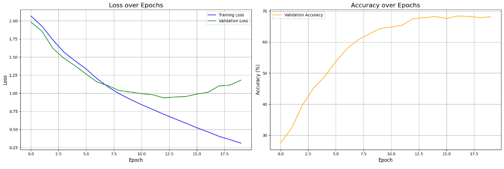

```text
==================================================
               Results
==================================================

[Hyper parameters]
  - Best LR: 0.000425
  - Best epochs: 20 epochs
  - Batch size: 128

[Model structure]
  - Model type: Patch based LSTM
  - Model structure:
PatchRNN(
  (patch_embed): PatchEmbedding(
    (proj): Conv2d(3, 128, kernel_size=(2, 2), stride=(2, 2))
  )
  (dropout): Dropout(p=0.1, inplace=False)
  (rnn): LSTM(128, 256, num_layers=2, batch_first=True, dropout=0.1, bidirectional=True)
  (classifier): Sequential(
    (0): LayerNorm((512,), eps=1e-05, elementwise_affine=True)
    (1): Linear(in_features=512, out_features=256, bias=True)
    (2): GELU(approximate='none')
    (3): Dropout(p=0.1, inplace=False)
    (4): Linear(in_features=256, out_features=10, bias=True)
  )
)
  - Total params: 2,536,842

[Training infomation]
  - Training duration on full training set: 20m 27s
  - Training device: cuda on Kaggle's free P100, Thank you Google!

[Benchmarks on test set]
  - Test loss: 1.1816
  - Test accuracy: 68.11%

==================================================
```

</details>

### 对 Patch based LSTM 的解读和评述

下面是总的模型结构图，使用了双层的双向 LSTM 作为编码器。其实双向仍然在提取位置关系上还是不够充分的，因为尽管图像 Patch 化了，其关联仍然不是纯线性序列的，所以还是加上了可学习的位置编码。这里的结构其实就是类似于把 nanoViT 的四个 TransformerEncoder 换成了基于 LSTM 的 RNN Encoder。至于为什么输入序列维度 128 过了这个编码器之后就变成 512 了呢？且看后面对这个编码器的拆解。

```mermaid
%%{init: {'theme': 'dark', 'themeVariables': { 'darkMode': true, 'primaryColor': '#1e1e2e', 'edgeLabelBackground':'#313244', 'tertiaryColor': '#181825'}}}%%
graph LR
    %% Styling definitions
    classDef box fill:#313244,stroke:#cdd6f4,stroke-width:2px,color:#cdd6f4,radius:8px;
    classDef input fill:#585b70,stroke:#89b4fa,stroke-width:2px,color:#cdd6f4;
    classDef output fill:#313244,stroke:#f38ba8,stroke-width:2px,color:#cdd6f4;
    classDef conv fill:#313244,stroke:#74c7ec,stroke-width:2px,color:#cdd6f4;
    classDef rnn fill:#313244,stroke:#f9e2af,stroke-width:2px,color:#cdd6f4;

    %% Input Layer
    subgraph Input["Input"]
        A[("3@32×32")]
    end
    class Input input;

    %% Patch Embedding
    subgraph PatchEmbed["Patch Embedding"]
        B["Conv2d<br> 3x128 x 2×2 / 2"]
    end
    A -->|Image| B
    class PatchEmbed conv;

    %% Positional Encoding
    subgraph PosEnc["Positional Encoding"]
        S["Parameter Matrix<br>256 x 128"]
    end
    class PosEnc conv;

    D[("+")]
    S --> D
    B -->|256 patches<br>128 dim per patch| D

    %% Dropout
    T["Dropout<br>p=0.1"]
    D --> T

    %% RNN Encoder
    subgraph RnnEncoder["RNN Encoder"]
        E["2-Layer Bi-LSTM<br>hidden=256"]
    end
    T -->|256x128| E
    class RnnEncoder rnn;

    %% Extract Last Output
    I["Extract Last<br>Time Step's Output"]
    E -->|Sequence Output<br>256x512| I

    %% Classification Head
    subgraph Classifier["MLP Head"]
        J["LayerNorm<br>512 dim"]
        K["Linear<br>512x256"]
        L["GELU"]
        M["Dropout<br>p=0.1"]
        N["Linear<br>256x10"]
    end
    I -->|Vector<br>512 dim| J --> K --> L --> M --> N
    class Classifier box;

    %% Output Layer
    subgraph OutputLayer["Output"]
        O[("10")]
    end
    N --> O
    class OutputLayer output;

    %% Styling
    style A stroke-dasharray: 5 5
    style O stroke:#a6e3a1,stroke-width:3px
```

下面是具体的编码器架构。输入序列是一个长度 256，嵌入维度 128 的序列，分别输入到正向和反向的 LSTM 里面，取输出也就是隐藏层状态 $h$，在嵌入维度上拼到一起，得到新的序列，也就是隐藏层的维度 256，然后再过一遍正反向 LSTM，维度再翻一倍，得到输出的维度 512。所以双向 LSTM 输出维度是隐藏状态维度的两倍。

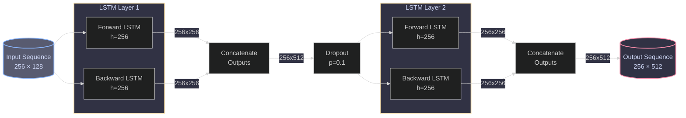

下面是 LSTM 的具体结构。


可以看到每一个时间步下，先将输入和隐藏状态拼接，由这个 384 维的拼接向量经过一个 4 倍隐藏维度的投影层，很自然的就可以把投影向量分成四份。每一份是都对当前状态和当前隐藏状态的特征进行映射的向量。这些向量要负责结合细胞状态来控制状态的更新和输出。其实这一步很像优化器的流程，事实上已经有关于 RNN 和优化器的一些对比讨论了。

首先来看第一个投影向量 $f_t$，经过 Sigmoid 激活后，将其与细胞状态 $c_{t-1}$ 相乘，也就是通过 $f_t$ 来控制哪些分量应该忘掉，也就是激活后得到 0 的位置。

既然有遗忘，那也需要记忆。这就交给 $i_t$ 和 $g_t$。由于 $i_t$ 是特征经过 Sigmoid 激活的结果，恒为正，因此可以作为纯输入的信息。而 $g_t$ 经过的是 tanh 激活，有正有负，和 $i_t$ 相乘之后，一方面可以说是增加网络的宽度，另一方面也对输入信息提供合理的抑制，防止其单调递增。最后和遗忘门的结果加起来，就可以得到新的细胞状态 $c_t$ 了。这里的细胞状态通过门控决定自己应该保留多少、更新多少，作用就和朴素 RNN 的隐藏状态是一致的。

但是 LSTM 里面也出现了一个隐藏状态，按我的理解，其实 LSTM 区分细胞状态和隐藏状态是一种对 RNN 隐藏状态的功能解耦。因为一方面，隐藏状态要负责记忆先前的序列信息，另一方面，隐藏状态还要肩负起提取序列特征输出的作用，所以 LSTM 采用了细胞状态记忆序列信息，而和输入一起丢进来的那个所谓的隐藏状态，起到的就是提取特征的作用。何以见得？让我们看看输出的计算。

这里仍然是特征经过 Sigmoid 激活后得到向量 $o_t$，然后需要和 tanh 激活后的新细胞状态相乘——也就是说，为了得到新的隐藏状态，需要参考目前的记忆，来选择性提取当前输入带来的特征。

因此 LSTM 也可以解决 RNN 的梯度爆炸/消失的问题。RNN 因为是对记忆的全量更新，很容易遗忘早期信息，同时也在这种全量更新上累积梯度，成了等比数列；而 LSTM 只不过引入门控来限制更新，就可以增强记忆力而缓解梯度问题。

当然最后训练出来一个参数量 2M 的 LSTM，还是没能打败 nanoViT。毕竟二维的注意力矩阵，对长距离/空间上的特征依赖效果必然好于仅靠一两个隐藏状态建模记忆力的 LSTM 好。不过，我们也没有必要勉强它，毕竟，图像任务从来都不是擅长序列建模的 RNN 的强项。至少我们证明了，在图像分类任务上使用 RNN 是可行的。

## VAE

这里笔者使用了三种利用 VAE （准确说是 β-VAE）进行图像分类的方法， ~~让我们按照从夯到拉的顺序评鉴一下~~ 思路各异：

- 在隐空间进行 K-means 聚类，按标签投票成为该聚类的标签。
- CVAE，即拼接图像和标签，再给隐空间加个标签维度，这样甚至可以带标签生成。
- 还是 CVAE 的思路，但是借用编码器的特征提取器，训练一个分类头，将分类损失缩放一个比例掺到总损失里面（或许可以叫 γ-C-β-VAE？），其实有点类似用 VAE 给编码器做正则化。

由于 CIFAR-10 的训练集风格差异很大且数据量也不够，所以在介绍将 VAE 接入分类任务之前，先让我们尝试一下 VAE 的本门功夫——图像生成。

### 动漫风格头像生成 a.k.a. 画老婆

本次使用的数据集是 Kaggle 上面的 Anime Face Dataset，是基于 Danbooru 的一个 63k 张图像的子集，但是 GitHub 上的数据貌似因为版权原因被拿下了。不过我本来一直都在 Kaggle 的 GPU 上面训练所以也没多大影响。

数据集是不带标签的 3@64x64 图像，下面是一些样本：


（第五排从左往右第三个是 galgame "Island" 的女主御原凛音的立绘，大家都来玩啊~ ~~现在知道为什么这个数据集在GitHub上因为版权问题被拿下了吧~~ ）

我们现在的任务就是根据已经有的头像，画出新的头像。也就是 $y=f(x)$ 其中 $y$ 是我们的生成图片， $x$ 是原始图片。为了避免乱生成，其实需要最小化 $y$ 和 $x$ 的偏差。——这不是 ResNet 干的活吗？因此在这里我们需要澄清一点：

我们并不是取学习某一张图片，而是所有训练图片构成的**概率分布**！了解了这个概率分布的形状之后，我们就可以在里面采样，得到生成的图片了。而 ResNet 只会把输入数据原样返回。

我们假设输入的数据为 $x$ 而概率分布为 $p(x)$，我们需要找到一个方式去（近似）描述 $p(x)$。由于数据维度很高，且维度之间有复杂的相互关联，因此直接寻找是相当复杂的，那怎么办呢？

诶，当我们需要在复杂任务里面找规律的时候，第一时间想到的是什么？降维！具体而言，就是考虑这个目标分布是输入通过编码再解码的结果，而编码的过程，就是对特征和规律进行降维、压缩、提取的过程：

$$
p(x)\approx q(x)=\int q(x|z)q(z)\mathrm d z
$$

这里，$x$ 是输入，$q(x)$ 是我们对目标函数 $p(x)$ 的拟合尝试，$z$ 是降维后的**隐变量**，$q(z)$ 就是隐变量的分布，而 $q(x|z)$  就是从隐变量生成图片的解码器。这个式子很好理解，里面的等式就是全概率公式。

下面我们要解决这样几个问题：

- 怎么获取编码器，也就是从原始的图像得到隐变量的分布？
- 怎么衡量两个分布的近似程度来得到损失函数？

第一个问题比较核心，也涉及到 VAE 的生图风格，我们等会再聊。第二个问题，大家基本上都能脱口而出——使用 KL 散度不就行了吗。

但是这里如果计算 $p(x)$ 和 $q(x)$ 的 KL 散度，其实很不方便，因为一是这些式子都比较原子化拆不开就不好化简（更何况 $p(x)$ 都不知道，没办法算），二是刚刚费力引入的 $z$ 没用上。

因此我们考虑对联合分布 $p(x,z)$ 和 $q(x,z)$ 计算 KL 散度，也就是说利用隐变量相对 $p$ 与 $q$ 的关系：（推导略长但是不难，下面有 Hint）

$$
\begin{align*}
  KL\left(p(x,z)||q(x,z)\right)&=\int\int p(x,z) \log \dfrac{p(x,z)}{q(x,z)} \mathrm d x \mathrm d z\\
  &= \int\int p(x)p(z|x) \log\dfrac{p(x)p(z|x)}{q(x,z)} \mathrm d z \mathrm d x\\
  &=\int p(x)[\int p(z|x)\log\dfrac{p(x)p(z|x)}{q(x,z)} \mathrm d z]\mathrm d x\\
  &=\mathbb E_{x\sim p(x)}[\int p(z|x)[\log p(x) + \log p(z|x)- \log q(x,z)] \mathrm d z]\\
  &=\mathbb E_{x\sim p(x)}[\log p(x)+\int p(z|x)\log\dfrac{p(z|x)}{q(z)q(x|z)}\mathrm d z]\\
  &=\mathbb E_{x\sim p(x)}[\log p(x)-\int p(z|x)\log q(x|z)\mathrm d z+\int p(z|x)\log\dfrac{p(z|x)}{q(z)}\mathrm d z]\\
  &=\mathbb E_{x\sim p(x)}[\log p(x)-\mathbb E_{z\sim p(z|x)}[\log q(x|z)]+\int p(z|x)\log\dfrac{p(z|x)}{q(z)}\mathrm d z]\\
  &=\mathbb E_{x\sim p(x)}[\log p(x)-\mathbb E_{z\sim p(z|x)}[\log q(x|z)]+KL(p(z|x) || q(z))]\\
  &=\mathbb E_{x\sim p(x)}[\log p(x)]+\mathbb E_{x\sim p(x)}[-\mathbb E_{z\sim p(z|x)}[\log q(x|z)]+KL(p(z|x) || q(z))]\\
  &=\mathrm{Constant.}+\mathbb E_{x\sim p(x)}[-ELBO]
\end{align*}
$$

这就是我们得到的损失函数。推导时应用了期望的性质和条件概率公式以及 KL 散度的定义，第五行消掉第一项的 $p(z|x)$ 是用的概率的归一化性质。事实上，这一联合分布的 KL 散度恒大于之前提到的边际分布的 KL 散度，所以这个条件甚至更强。里面的 $ELBO$ 这个马甲的意思叫 Evidence Lower Bound，即证据下界，其实就是对近似程度的衡量，简单说就是要最大化的量。整个推导的目标很明确，尽量不要让含有 $p$ 的函数参与到最后的式子里面，利用好已有的 $q$ 相关的函数。而且要让结果靠近对“编码器”和“解码器”的损失计算。于是乎，我们只需要最大化 $ELBO$ 即可。关于 $ELBO$，可以拆开：

$$
\begin{align*}
  ELBO&=\mathbb E_{z\sim p(z|x)}[\log q(x|z)]-KL(p(z|x) || q(z))
\end{align*}
$$

第一项的意思是是**重构误差**，衡量解码器 $q(x|z)$ 的结果对原图 $x$ 的差异程度；第二项的意思是**衡量编码器对隐变量分布的近似程度**。

实际上我们可以将两项解耦，来分配不同的权重，也就是可以写成

$$
\begin{align*}
  ELBO&=\mathbb E_{z\sim p(z|x)}[\log q(x|z)]-\beta KL(p(z|x) || q(z))
\end{align*}
$$

这叫做 β-VAE，后面我们会看到这样做的理由和意义。

为了计算 $ELBO$，$q(x|z)$ 自然是对隐变量 $z$ 解码到 $x$ 上的神经网络，而 VAE 的作者对隐变量分布 $q(z)$ 和编码器 $p(z|x)$ 给了个很激进的方案：默认它们是正态分布！这似乎听起来有点理由但又有点武断，其实后面我们将会看到，对 VAE 而言，成也正态分布，败也正态分布。

具体而言，对 $q(z)$ 我们可以直接假定为标准正态分布 $N(0,I)$，但是 $p(z|x)$ 是个条件分布，怎么搞呢？事实上回忆一下多元正态函数的定义：

$$
p(z|x)=\dfrac{\exp{\left(-0.5\left |\dfrac{z-\mu}{\sigma}\right |^2\right)}}{\prod \sqrt{2\pi\sigma_i^2}}
$$

这里的 $\mu$ 和 $\sigma$ 都是和隐变量 $z$ 维度一致的向量，也就是说可以用神经网络来压缩！

那么 KL 散度项就可以很轻松解决了：

$$
\begin{align*}
  KL &= \int p(z|x)\log\dfrac{p(z|x)}{q(z)}\mathrm d z\\
  &=\mathbb{E}_{z\sim p(z|x)}[\log \dfrac{p(z|x)}{q(z)}]\\
  &=\mathbb{E}_{z\sim p(z|x)}[\log\dfrac{\exp{\left(-0.5\left |\dfrac{z-\mu}{\sigma}\right |^2\right)}}{\prod \sqrt{2\pi\sigma_i^2}}\times \dfrac{\prod \sqrt{2\pi}}{\exp{(-0.5 |z|^2)}}]\\
  &=\mathbb{E}_{z\sim p(z|x)}[0.5|z|^2-0.5\left |\dfrac{z-\mu}{\sigma}\right |^2-\sum \log \sigma_i]\\
  &=\dfrac 12 \sum \sigma_i^2 +\mu_i^2-1-\log \sigma_i
\end{align*}
$$

最后一步使用了正态分布二阶矩的性质：$\mathbb{E}[x^2]=\mu^2+\sigma^2$。

对于重构误差项，我们可能会想到利用 MSE 来衡量重构误差，但是这样做是否有理论依据呢？事实上如果考虑解码器 $q(x|z)$ 和编码器一样服从正态分布，也就是：

$$
\begin{align*}
  \mathbb E_{z\sim p(z|x)}[\log q(x|z)]&=\mathbb E_{z\sim p(z|x)}[\log \dfrac{\exp{\left(-0.5\left |\dfrac{x-\mu'}{\sigma'}\right |^2\right)}}{\prod \sqrt{2\pi{\sigma'}_i^2}}]\\
  &=-\dfrac{1}{2|\sigma'|^2}|x-\mu'|^2-\sum\log \sqrt{2\pi{\sigma'}_i^2}
\end{align*}
$$

这里的 $\mu'$ 即解码的均值其实就是输出的图像的均值。如果取 $\sigma'$ 是固定的向量，那就得到 MSE 了。事实上，这里 $\sigma'$ 的大小估计就和 β-VAE 的思想等价，都是来调控两种损失的比例的。因此我们就估计出了最终的损失函数：

$$
\begin{align*}
  \mathcal{L}&=-\mathbb E_{x\sim p(x)}[ELBO]\\
  &=-\mathbb E_{x\sim p(x)}[\mathbb E_{z\sim p(z|x)}[\log q(x|z)]-\beta KL(p(z|x) || q(z))]\\
  &=\mathbb E_{x\sim p(x)}[\dfrac{1}{2}|x-\mu'|^2-\beta\dfrac 12 \sum \sigma_i^2 +\mu_i^2-1-\log \sigma_i]\\
  &=\mathbb E_{x\sim p(x)}[MSE -\beta KLD]\\
  &=\dfrac 1n \sum_i^n (MSE_{x_i}-\beta KLD_{x_i})
\end{align*}
$$

最后一步，就是通过采样近似期望。实际上我们进行的是批量训练，因此，每次只需要对输入采样一个隐变量 $z$ 即可。也就是说最终我们得到了可以计算的损失函数！

$$
\mathcal{L(x)}=MSE_{x}-\beta KLD_{x}
$$

但是还有一个问题：虽然这是可以计算的，但 $\mu$ 和 $\sigma$ 的值会随着参数的变化而变化，进而影响到分布 $q(z)$，也就是说带参数的正态分布是无法直接进行微分来反向传播的。这一问题有一个很好的解决方案：重参数化。

也就是从分布 $N(\mu,\sigma^2)$ 采样其实就是一个平移加缩放，只需要在标准分布 $N(0,1)$ 里面采样 $y$，然后计算 $y'=\mu+\sigma y$ 就可以得到从分布 $N(\mu,\sigma^2)$ 采样的结果了。由于线性变换可微，就可以交给优化器做更新了。

现在回顾一下整个 VAE 的训练流程：

- 输入 $x$ 通过编码器得到两个和 $z$ 维度一致的向量 $\mu$ 和 $\sigma$。
- 在标准正态分布下采样向量 $\epsilon$ 然后计算 $z=\mu + \epsilon\odot\sigma$。
- 将 $z$ 输入到解码器得到重构图像 $x'$。
- 根据 $\mu$、$\sigma$ 和 $x$ 以及 $x'$，使用损失函数 $\mathcal{L(x)}=MSE_{x}-\beta KLD_{x}$ 计算梯度并反向传播更新参数。

如此，通往 VAE 的道路已经铺好，让我们编写代码吧。

<details>

<summary> 加载数据集使用的代码 </summary>

```python
import os
import torch
from torch.utils.data import Dataset, DataLoader
from torchvision import transforms
from PIL import Image
import matplotlib.pyplot as plt
import torchvision.utils as vutils
import numpy as np

# 数据集所在的路径
DATA_DIR = '/kaggle/input/animefacedataset/images/'

# 定义超参数
IMAGE_SIZE = 64    # 图像将被调整到的大小
BATCH_SIZE = 256   # 每个批次加载的图像数量，最好和下面训练的 bs 一致
NUM_WORKERS = 6    # 加载数据的工作进程数，虽然 Kaggle 会报 warning 但是实测 6 比 4 好。

# 定义图像预处理/变换
# 1. Resize: 缩放到 IMAGE_SIZE
# 2. ToTensor: 转换为 PyTorch Tensor，并将像素值从 [0, 255] 归一化到 [0.0, 1.0]
# 3. Normalize: 将 [0.0, 1.0] 的数据标准化到 [-1.0, 1.0]，这是训练 GAN 的标准做法
transform = transforms.Compose([
    transforms.Resize(IMAGE_SIZE),
    transforms.CenterCrop(IMAGE_SIZE),
    transforms.ToTensor(),
    transforms.Normalize(mean=(0.5, 0.5, 0.5), std=(0.5, 0.5, 0.5))
])

class AnimeFaceDataset(Dataset):
    """自定义动漫人脸数据集"""
    def __init__(self, root_dir, transform=None):
        self.root_dir = root_dir
        self.transform = transform
        self.image_files = [f for f in os.listdir(root_dir)]

    def __len__(self):
        return len(self.image_files)

    def __getitem__(self, idx):
        img_path = os.path.join(self.root_dir, self.image_files[idx])
        image = Image.open(img_path).convert('RGB')
        
        if self.transform:
            image = self.transform(image)
            
        return image

print("loading dataset")
# 实例化数据集
anime_dataset = AnimeFaceDataset(root_dir=DATA_DIR, transform=transform)
print(f"Dataset size: {len(anime_dataset)} pictures.")

# 实例化 DataLoader
dataloader = DataLoader(
    dataset=anime_dataset,
    batch_size=BATCH_SIZE,
    shuffle=True,
    num_workers=NUM_WORKERS,
    pin_memory=True
)
real_batch = next(iter(dataloader))

# 设置绘图
plt.figure(figsize=(8, 8))
plt.axis("off")
plt.title("Training Images")

grid = vutils.make_grid(real_batch[:64], padding=2, normalize=True)
plt.imshow(np.transpose(grid.cpu(), (1, 2, 0))) # 从 (C, H, W) 转为 (H, W, C)
plt.show()
```

</details>

默认一发 64 抽，可以看看抽出来的有没有认识的（）

下面就可以愉快训练了。

<details>

<summary> 训练使用的代码</summary>

```python
import torch
import torch.nn as nn
import torch.nn.functional as F
import torch.optim as optim
from torch.utils.data import DataLoader
from torchvision.utils import make_grid
import numpy as np
import matplotlib.pyplot as plt
from tqdm import tqdm
import os

config = {
"METHOD_NAME": "VAE",
"LATENT_DIM": 128,
"BATCH_SIZE": 256,
"EPOCHS": 30,
"LR": 1e-4,
"BETA": 1.5,
"DEVICE": "cuda" if torch.cuda.is_available() else "cpu",
"DATA_PATH": "./data",
"OUTPUT_PATH": "./output"
}
output_dir = os.path.join(config["OUTPUT_PATH"], config["METHOD_NAME"])
os.makedirs(output_dir, exist_ok=True)
print(f"Using device: {config['DEVICE']}")
print(f"Running with Beta = {config['BETA']}")

train_loader = dataloader

# --- 2. 模型定义 ---
class VAE(nn.Module):
    def __init__(self, latent_dim):
        super(VAE, self).__init__()
        self.latent_dim = latent_dim
        
        # Encoder (64x64 -> 8x8)
        self.encoder_features = nn.Sequential(
            nn.Conv2d(3, 64, 3, 1, 1), nn.BatchNorm2d(64), nn.ReLU(True), nn.MaxPool2d(2, 2),
            nn.Conv2d(64, 128, 3, 1, 1), nn.BatchNorm2d(128), nn.ReLU(True), nn.MaxPool2d(2, 2),
            nn.Conv2d(128, 256, 3, 1, 1), nn.BatchNorm2d(256), nn.ReLU(True), nn.MaxPool2d(2, 2)
        )
        self.fc_mu = nn.Linear(256 * 8 * 8, latent_dim)
        self.fc_log_var = nn.Linear(256 * 8 * 8, latent_dim)
        
        # Decoder (latent_dim -> 64x64)
        self.decoder_fc = nn.Linear(latent_dim, 256 * 8 * 8)
        self.decoder_conv = nn.Sequential(
            nn.ConvTranspose2d(256, 128, 4, 2, 1), nn.BatchNorm2d(128), nn.ReLU(True),
            nn.ConvTranspose2d(128, 64, 4, 2, 1), nn.BatchNorm2d(64), nn.ReLU(True),
            nn.ConvTranspose2d(64, 3, 4, 2, 1),
            nn.Tanh() # 输出范围 [-1, 1]，匹配数据归一化
        )

    def encode(self, x):
        h = self.encoder_features(x)
        h = h.view(h.size(0), -1)
        return self.fc_mu(h), self.fc_log_var(h)

    def reparameterize(self, mu, log_var):
        std = torch.exp(0.5 * log_var)
        eps = torch.randn_like(std)
        return mu + eps * std

    def decode(self, z):
        h = self.decoder_fc(z)
        h = h.view(h.size(0), 256, 8, 8)
        return self.decoder_conv(h)

    def forward(self, x):
        mu, log_var = self.encode(x)
        z = self.reparameterize(mu, log_var)
        return self.decode(z), mu, log_var

# --- 3. 损失函数 ---
def vae_loss_function(recon_x, x, mu, log_var):
    MSE = F.mse_loss(recon_x, x, reduction='sum')
    KLD = -0.5 * torch.sum(1 + log_var - mu.pow(2) - log_var.exp())
    return MSE, KLD

# 用于存储指标的字典
metrics = {
    'MSE loss': [],
    'KLD loss': [],
    'Total loss': [],
}

# --- 4. 训练循环 ---
def train(model, train_loader, optimizer, epoch):
    model.train()
    total_loss, tot_mse, tot_kld = 0, 0, 0
    pbar = tqdm(train_loader, desc=f"Epoch {epoch+1}/{config['EPOCHS']}")
    for data in pbar:
        data = data.to(config["DEVICE"])
        optimizer.zero_grad()
        recon_batch, mu, log_var = model(data)
        mse_loss, kld_loss = vae_loss_function(recon_batch, data, mu, log_var)
        loss = mse_loss + config["BETA"] * kld_loss
        loss.backward()
        optimizer.step()
        total_loss += loss.item()
        tot_mse += mse_loss.item()
        tot_kld += kld_loss.item()
        pbar.set_postfix(loss=loss.item() / len(data))
    avg_loss = total_loss / len(train_loader.dataset)
    avg_mse = tot_mse / len(train_loader.dataset)
    avg_kld = tot_kld / len(train_loader.dataset)
    metrics["Total loss"].append(avg_loss)
    metrics["MSE loss"].append(avg_mse)
    metrics["KLD loss"].append(avg_kld)
    print(f'====> Epoch: {epoch+1} Average MSE loss:{avg_mse:.4f}, KLD loss:{avg_kld:.4f}, total loss: {avg_loss:.4f}')

# --- 5. 生成函数  ---
def generate_and_save_images(model, save_path, n_samples=64):
    model.eval()
    with torch.no_grad():
        noise = torch.randn(n_samples, config["LATENT_DIM"]).to(config["DEVICE"])
        generated_images = model.decode(noise).cpu()
        grid = make_grid(generated_images, nrow=8, padding=2, normalize=True)
        plt.figure(figsize=(8, 8))
        plt.imshow(grid.permute(1, 2, 0))
        plt.axis("off")
        plt.title("Generated Images from VAE")
        plt.savefig(save_path)
        plt.show()

# --- 6. 训练指标绘图 ---
def loss_visualization():
    # 训练完成后绘制指标图表
    plt.figure(figsize=(10, 6))

    plt.plot(metrics['MSE loss'], label='MSE Loss', color='blue')
    plt.plot(metrics['KLD loss'], label='KL Divergence Loss', color='red')
    plt.plot(metrics['Total loss'], label='Total Loss', color='green')
    
    plt.title(f'MSE, KLD and total Loss, beta = {config["BETA"]}')
    plt.xlabel('Epoch')
    plt.ylabel('Loss')

    plt.legend()
    plt.show()

# --- 主程序 ---
if __name__ == "__main__":
    model = VAE(latent_dim=config["LATENT_DIM"]).to(config["DEVICE"])
    optimizer = optim.Adam(model.parameters(), lr=config["LR"])
    
    print("--- Training VAE Model ---")
    for epoch in range(config["EPOCHS"]):
        train(model, train_loader, optimizer, epoch)
    
    print("\n--- Generating Images from Trained VAE ---")
    gen_save_path = os.path.join(output_dir, "generated_images.png")
    generate_and_save_images(model, gen_save_path)
    loss_visualization()
```

</details>

这是 VAE 的总的架构，这里把 KL 取了个负号所以最后是加法：

```mermaid
%%{init: {'theme': 'dark', 'themeVariables': { 'darkMode': true, 'primaryColor': '#1e1e2e', 'edgeLabelBackground':'#313244', 'tertiaryColor': '#181825'}}}%%
graph LR
    %% Styling definitions
    classDef box fill:#313244,stroke:#cdd6f4,stroke-width:2px,color:#cdd6f4,radius:8px;
    classDef input fill:#585b70,stroke:#89b4fa,stroke-width:2px,color:#cdd6f4;
    classDef output fill:#313244,stroke:#f38ba8,stroke-width:2px,color:#cdd6f4;
    classDef conv fill:#313244,stroke:#74c7ec,stroke-width:2px,color:#cdd6f4;
    classDef latent fill:#313244,stroke:#f5c2e7,stroke-width:2px,color:#cdd6f4;
    classDef loss fill:#313244,stroke:#f2cdcd,stroke-width:2px,color:#cdd6f4;

    %% Input
    subgraph InputGraph["Input"]
        A[("Image<br>3@64x64")]
    end
    class InputGraph input;

    %% Encoder
    subgraph Encoder["Encoder"]
        B["Feature Extractor<br>map: 3@64x64→latent dim"]
    end
    A --> B
    class Encoder conv;

    %% Latent Space Distribution
    subgraph LatentDistribution["Latent Distribution"]
        mu["μ <br>latent dim"]
        logvar["log(σ²)<br>latent dim"]
    end
    B -->|latent dim vector| mu
    B -->|latent dim vector| logvar
    class LatentDistribution latent;
    
    %% Reparameterization Trick
    subgraph ReparamTrick["Reparameterization"]
        C["z = μ + ε * σ<br>ε~N(0,I)"]
    end
    mu --> C
    logvar --> C
    class ReparamTrick latent;
    
    %% Decoder
    subgraph Decoder["Decoder"]
        D["Latent vector decoder"]
    end
    C --> |sample vector z<br>latent dim| D
    class Decoder conv;

    %% Output
    subgraph OutputGraph["Output"]
        E[("Reconstructed Image<br>3@64x64")]
    end
    D --> E
    class OutputGraph output;

    %% Loss Calculation
    subgraph LossCalc["Loss Calculation"]
        L["Loss = MSE + β * KLD"]
        M["MSE"]
        N["KLD"]
    end
    E --> |Reconstruction| M
    A --> |Original| M
    mu --> |Distribution| N
    logvar --> |Distribution| N
    M --> L
    N --> L
    class LossCalc loss;
```

其中，编码器使用三层的卷积神经网络：

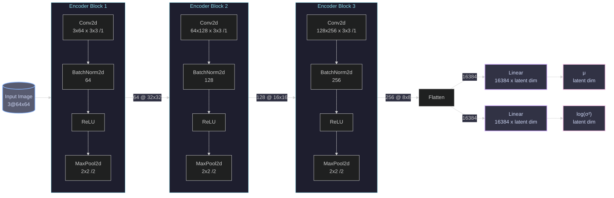

解码器和编码器的配置基本上一致，只不过使用了反卷积。

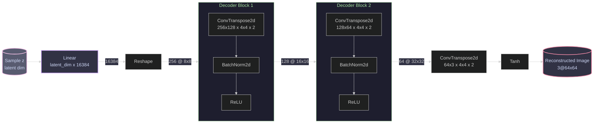

经过一段时间的等待之后，就可以看到生成的图像了，有的还是挺像模像样的。让我们调整 β 多试几次：

|| β = 1.5 | β = 1 | β = 0.5 |
|:--:|:--:|:--:|:--:|
|生成图像|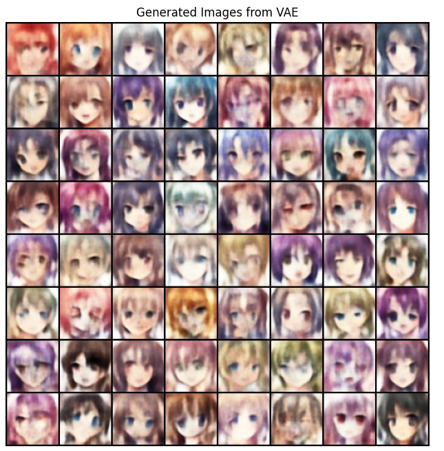|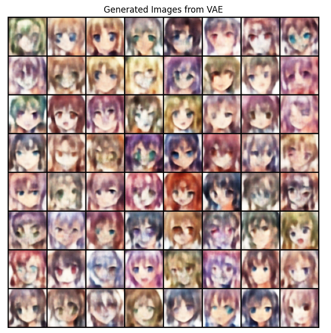|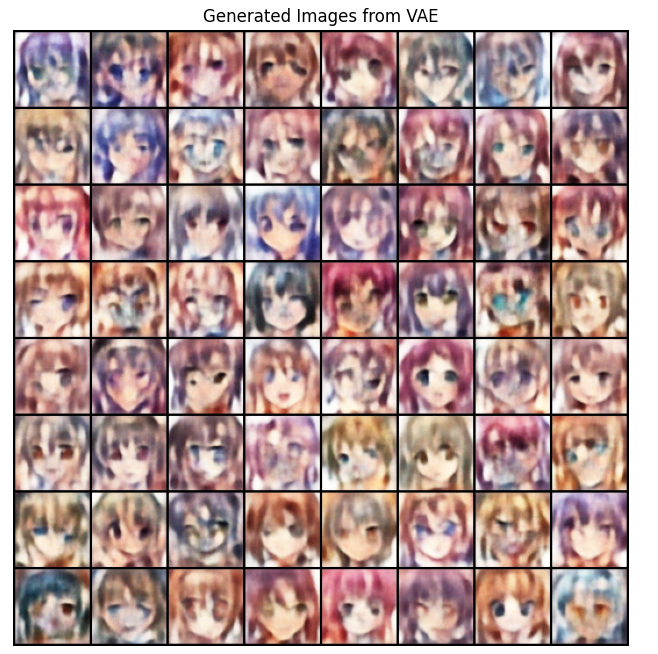|
|损失变化|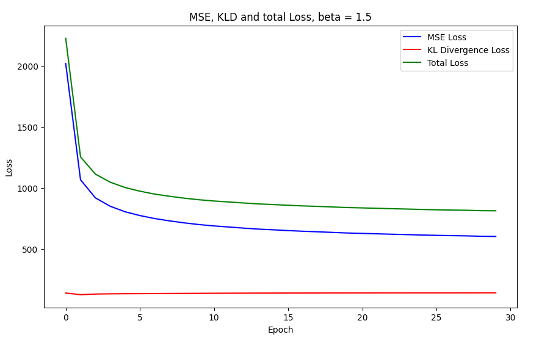||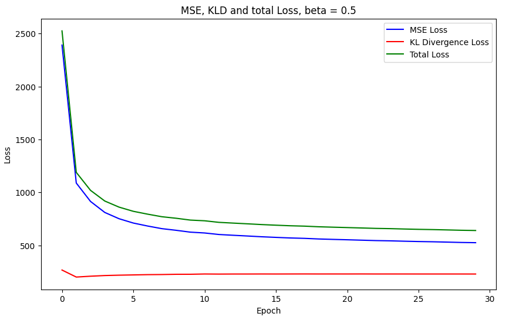|

可以看到其实 MSE 和 KLD 是按下葫芦浮起瓢的关系，因为 MSE 对应解码器的重构误差，KLD 对应编码器的建模误差，因此两边都能得到有效的训练。

对比 β = 1.5 的情况，β = 1 时确实有一点点更清晰了，但是图片更脏了。网上很多讨论说降低 β 可以提升清晰度，其实这并不一定对。事实上我降低了 β 貌似可以进一步改善 MSE 损失提升重建相似度，但其实在这个训练数据下 MSE 损失相比于 KLD 损失更容易下降，所以可以看到 β = 1 相比 β = 1.5，MSE 虽然略有下降但是 KLD 涨了一大截。而 β = 0.5 的时候，KLD 直接就翻倍了。

可以看到，当 β 比较大的时候，图像倒是有鼻子有眼，就是很糊；β 比较小，图像又开始脏起来了，变得不可名状。

我们思考 β 的作用：β 可以衡量输出图像的方差，β 越大则 KL 散度项占比越大，这就对应增大重构误差的方差估计，也就是说大 β 会让编码器的输出尽可能平滑，从而导致图像能够找到所有人脸的共同特征，但是没法生成具体的精细特征，简单说就是糊；而小 β 对应的就是不那么糊的图片，但是一直被重构误差牵着走，虽然重构误差小能够让图像更清晰，但却也没法对输入进行特别有效的编码，从而导致特征混起来了，输出就会比较脏。

所以说朴素的 VAE 糊，主要还是因为这些原因：

- 对隐变量、编码器和解码器的建模太武断，既然为了推导使用了正态分布，就要吃这个带来的后果。
- 压缩太严重。建模时极其容易平滑掉图像的高频信息。

介绍了 VAE 的本门功夫——图像生成之后，我们来看看怎么拿 VAE 进行邪修，也就是做图像分类。

### 无监督聚类

第一个想法相当自然，既然我们使用隐变量分布 $q(z)$ 来对原有图像做压缩之后的表征，那么我们只需要对每一个输入 $x$，计算其对应的隐变量分布 $q(z)$ 的均值 $\mu$，就可以将输入压缩到隐空间内。按理说，这个空间是提取了 $x$ 的特征信息的，因此在这个空间里面做无监督的聚类，就可以进行分类了。

具体而言，我们使用 K-means 作为聚类手段，对每个类别进行投票，得票最高的标签代表本类别的标签。最后，对得到的隐空间做 t-SNE 可视化。下面是结果：

|  | β = 0.1 | β = 1 | β = 10|
|--|:--:|:--:|:--:|
|准确率|23.59%|24.64%|24.01%|
|t-SNE可视化|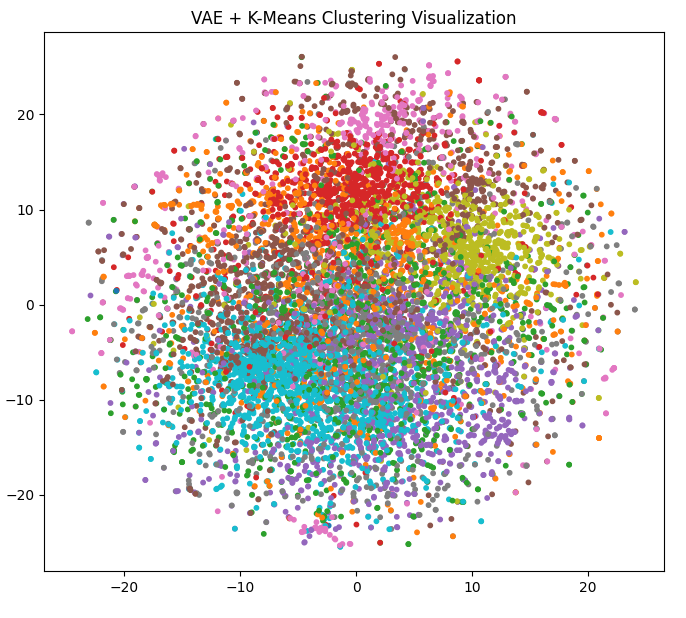||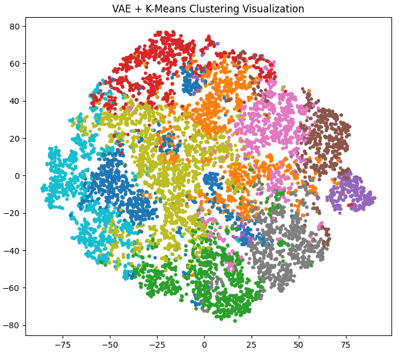|
|生成图像|||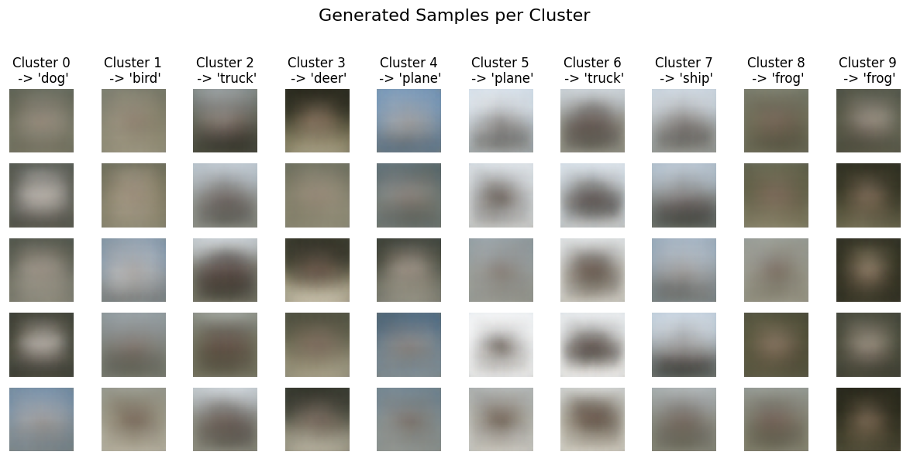|

准确率大概是 24% 左右，还是很合理的，因为标签信息只占了图像语义信息的一小部分，因此聚类得到的边界基本上是多种语义特征的混合（举例：我不仅可以按物体类别聚类，还可以按照背景色调聚类，既然没有标签带来的分类惩罚，我就可以随心所欲），自然不能和标签信息完全对应。

可以看到，β 基本上对准确率没有影响，因为我们是不带标签信息完全无监督地进行训练的，但是越大的 β 可视化出来的簇越集中，这就意味着增大 KL 散度项的权重，相当有利于数据降维压缩，但是对应图像也越糊，因为这一压缩过程是不可逆的，输出也被过度平滑了。

<details>

<summary> 无监督聚类 VAE 使用的代码 </summary>

```python
import torch
import torch.nn as nn
import torch.nn.functional as F
import torch.optim as optim
from torchvision import datasets, transforms
from torch.utils.data import DataLoader

import numpy as np
import matplotlib.pyplot as plt
from sklearn.cluster import KMeans
from sklearn.manifold import TSNE
from tqdm import tqdm
import os
from scipy.stats import mode

# --- 1. 配置参数 ---
config = {
    "METHOD_NAME": "VAE",
    "LATENT_DIM": 128,
    "NUM_CLUSTERS": 10,
    "BATCH_SIZE": 128,
    "EPOCHS": 30,
    "LR": 1e-3,
    "BETA": 0.1,
    "DEVICE": "cuda" if torch.cuda.is_available() else "cpu",
    "DATA_PATH": "./data",
    "OUTPUT_PATH": "./output"
}

output_dir = os.path.join(config["OUTPUT_PATH"], config["METHOD_NAME"])
os.makedirs(output_dir, exist_ok=True)
print(f"Using device: {config['DEVICE']}")
print(f"Running with Beta = {config['BETA']}")

# --- 2. 数据加载 ---
transform = transforms.Compose([transforms.ToTensor()])
train_dataset = datasets.CIFAR10(root=config["DATA_PATH"], train=True, transform=transform, download=True)
test_dataset = datasets.CIFAR10(root=config["DATA_PATH"], train=False, transform=transform, download=True)
train_loader = DataLoader(train_dataset, batch_size=config["BATCH_SIZE"], shuffle=True, pin_memory=True, num_workers=4)
test_loader = DataLoader(test_dataset, batch_size=config["BATCH_SIZE"], shuffle=False)
classes = ('plane', 'car', 'bird', 'cat', 'deer', 'dog', 'frog', 'horse', 'ship', 'truck')

# --- 3. 模型定义: VAE ---
class VAE(nn.Module):
    def __init__(self, latent_dim):
        super(VAE, self).__init__()
        self.latent_dim = latent_dim
        self.encoder_features = nn.Sequential(
            nn.Conv2d(3, 64, 3, 1, 1), nn.BatchNorm2d(64), nn.ReLU(True), nn.MaxPool2d(2, 2),
            nn.Conv2d(64, 128, 3, 1, 1), nn.BatchNorm2d(128), nn.ReLU(True), nn.MaxPool2d(2, 2),
            nn.Conv2d(128, 256, 3, 1, 1), nn.BatchNorm2d(256), nn.ReLU(True), nn.MaxPool2d(2, 2)
        )
        self.fc_mu = nn.Linear(256 * 4 * 4, latent_dim)
        self.fc_log_var = nn.Linear(256 * 4 * 4, latent_dim)
        self.decoder_fc = nn.Linear(latent_dim, 256 * 4 * 4)
        self.decoder_conv = nn.Sequential(
            nn.ConvTranspose2d(256, 128, 4, 2, 1), nn.BatchNorm2d(128), nn.ReLU(True),
            nn.ConvTranspose2d(128, 64, 4, 2, 1), nn.BatchNorm2d(64), nn.ReLU(True),
            nn.ConvTranspose2d(64, 3, 4, 2, 1), nn.Sigmoid()
        )

    def encode(self, x):
        h = self.encoder_features(x)
        h = h.view(h.size(0), -1)
        return self.fc_mu(h), self.fc_log_var(h)

    def reparameterize(self, mu, log_var):
        std = torch.exp(0.5 * log_var)
        eps = torch.randn_like(std)
        return mu + eps * std

    def decode(self, z):
        h = self.decoder_fc(z)
        h = h.view(h.size(0), 256, 4, 4)
        return self.decoder_conv(h)

    def forward(self, x):
        mu, log_var = self.encode(x)
        z = self.reparameterize(mu, log_var)
        return self.decode(z), x, mu, log_var

# --- 4. 损失函数 ---
def vae_loss_function(recon_x, x, mu, log_var):
    MSE = F.mse_loss(recon_x, x, reduction='sum')
    KLD = -0.5 * torch.sum(1 + log_var - mu.pow(2) - log_var.exp())
    return MSE + config["BETA"] * KLD 

# --- 5. 训练循环 ---
def train(model, train_loader, optimizer, epoch):
    model.train()
    total_loss = 0
    pbar = tqdm(train_loader, desc=f"Epoch {epoch+1}/{config['EPOCHS']}")
    for data, _ in pbar:
        data = data.to(config["DEVICE"])
        optimizer.zero_grad()
        recon_batch, _, mu, log_var = model(data)
        loss = vae_loss_function(recon_batch, data, mu, log_var)
        loss.backward()
        optimizer.step()
        total_loss += loss.item()
        pbar.set_postfix(loss=loss.item() / len(data))
    avg_loss = total_loss / len(train_loader.dataset)
    print(f'====> Epoch: {epoch+1} Average loss: {avg_loss:.4f}')

def calculate_and_show_accuracy(cluster_labels, true_labels):
    cluster_map = {}
    for i in range(config["NUM_CLUSTERS"]):
        labels_in_cluster = true_labels[cluster_labels == i]
        if len(labels_in_cluster) == 0:
            cluster_map[i] = 0 
            continue
        most_common_label = mode(labels_in_cluster, keepdims=False)[0]
        cluster_map[i] = most_common_label
    predicted_labels = np.array([cluster_map[c] for c in cluster_labels])
    accuracy = np.mean(predicted_labels == true_labels)
    print(f"Clustering Accuracy: {accuracy * 100:.2f}%")
    print("\nCluster to Label Mapping:")
    for i in range(config["NUM_CLUSTERS"]):
        print(f"  Cluster {i} -> '{classes[cluster_map[i]]}'")
    return cluster_map

def cluster_and_visualize_kmeans(model, data_loader):
    model.eval()
    all_latents, all_true_labels = [], []
    with torch.no_grad():
        for data, labels in tqdm(data_loader, desc="Encoding data for clustering"):
            data = data.to(config["DEVICE"])
            mu, _ = model.encode(data)
            all_latents.append(mu.cpu().numpy())
            all_true_labels.append(labels.numpy())
    all_latents = np.concatenate(all_latents, axis=0)
    all_true_labels = np.concatenate(all_true_labels, axis=0)

    print("Performing K-Means clustering...")
    kmeans = KMeans(n_clusters=config["NUM_CLUSTERS"], random_state=42, n_init='auto')
    cluster_labels = kmeans.fit_predict(all_latents)
    cluster_map = calculate_and_show_accuracy(cluster_labels, all_true_labels)
    
    print("Performing t-SNE...")
    tsne = TSNE(n_components=2, random_state=42)
    latents_2d = tsne.fit_transform(all_latents)
    plt.figure(figsize=(8, 7))
    plt.scatter(latents_2d[:, 0], latents_2d[:, 1], c=cluster_labels, cmap='tab10', s=10)
    plt.title('VAE + K-Means Clustering Visualization')
    plt.savefig(os.path.join(output_dir, "cluster_visualization.png"))
    plt.show()
    return kmeans, cluster_map

def generate_labeled_images_kmeans(model, kmeans, cluster_map, save_path, n_samples=5):
    model.eval()
    centers = torch.from_numpy(kmeans.cluster_centers_).float().to(config["DEVICE"])
    fig, axes = plt.subplots(n_samples, config["NUM_CLUSTERS"], figsize=(12, 6))
    fig.suptitle("Generated Samples per Cluster", fontsize=16)
    with torch.no_grad():
        for i in range(config["NUM_CLUSTERS"]):
            center_i = centers[i].unsqueeze(0).repeat(n_samples, 1)
            noise = torch.randn_like(center_i) * 0.5
            samples = center_i + noise
            generated_images = model.decode(samples).cpu()
            label_name = classes[cluster_map[i]]
            axes[0, i].set_title(f"Cluster {i}\n -> '{label_name}'")
            for j in range(n_samples):
                img = generated_images[j].permute(1, 2, 0).numpy()
                axes[j, i].imshow(img)
                axes[j, i].axis("off")
    plt.tight_layout(rect=[0, 0, 1, 0.96])
    plt.savefig(save_path)
    plt.show()

if __name__ == "__main__":
    model = VAE(latent_dim=config["LATENT_DIM"]).to(config["DEVICE"])
    optimizer = optim.Adam(model.parameters(), lr=config["LR"])
    
    print("--- Training VAE Model ---")
    for epoch in range(config["EPOCHS"]):
        train(model, train_loader, optimizer, epoch)
    
    print("\n--- Clustering, Visualization, and Accuracy ---")
    kmeans_model, cluster_to_label_map = cluster_and_visualize_kmeans(model, test_loader)

    print("\n--- Generating Labeled Images ---")
    gen_save_path = os.path.join(output_dir, "generated_labeled_images.png")
    generate_labeled_images_kmeans(model, kmeans_model, cluster_to_label_map, gen_save_path)
```

</details>

### CVAE

CVAE 即条件 VAE。CVAE 的目标本不是解决分类任务，而是利用标签来限定生成。为此，首先需要输入带标签的训练数据——这个简单，只需要提取输入特征之后，拼接上标签向量即可，然后压缩到 $\mu$ 和 $\sigma$ 的分布上。然后解码器部分，对隐变量 $z$ 也拼接上标签向量。就完了。

为何？我们最开始是对隐变量 $z$ 进行随机采样的，这就意味着 $z$ 不带有任何标签信息，如果我们给它加上标签信息，也就是说，我们给定标签 $y$，要重建的是基于这个标签的条件分布 $q(z|y)$。对于编码器而言，因为标签 $y$ 已知，所以直接利用联合条件分布 $p(z|x,y)$ 来压缩到 $z$ 上，而对解码器而言，也是一个联合的条件分布 $q(x|z,y)$ 来从隐变量的条件分布来输出服从标签的条件分布。也就是下面的 $ELBO$。

$$
\begin{align*}
  ELBO&=\mathbb E_{z\sim p(z|x)}[\log q(x|z,y)]-\beta KL(p(z|x,y) || q(z|y))
\end{align*}
$$

而分类方案就是对单个样本取所有标签，计算损失最小的那一个。

CVAE 利用标签的效率好不好呢？让我们看看下面的结果。

|  | β = 0.1 | β = 1 | β = 10|
|--|:--:|:--:|:--:|
|准确率变化|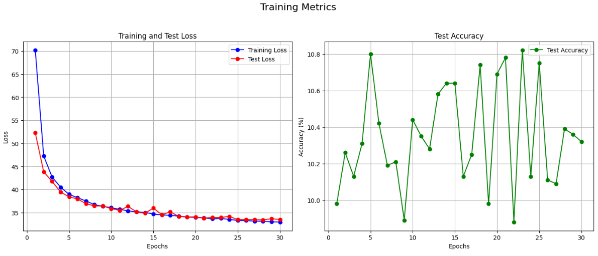||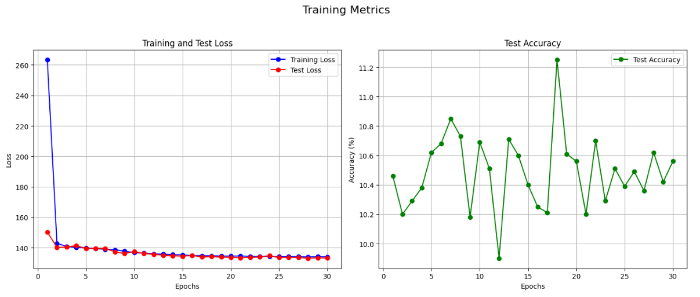|
|生成图像||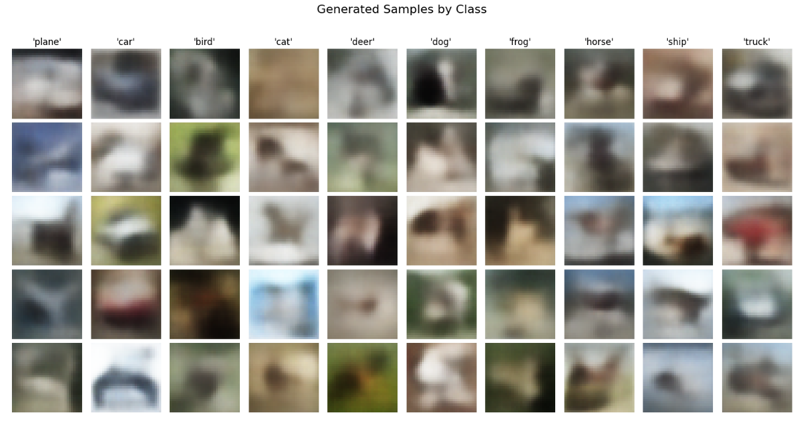||

可以看到不管 β 调多少，基本上只能比随机基线的 10% 高一丢丢，说明标签在其中的贡献相当小！这说明模型基本上忽略了条件信息，基本上没有将其参与进图像重构中。换句话说，就是原来的 VAE 提供的信息和损失已经足够丰富，使得模型可以基本上直接无视分类的条件。事实上，这就是 VAE 的一个缺陷——当解码器过于强大，它会直接无视隐变量提供的信息来生成（类似于编码器退化掉，解码器变成 GAN 的生成器而重构误差项就是判别器），这被称作**后验崩塌**。

VQ-VAE 可以缓解这一问题。由于这不是本文的主题，仅在此简单介绍：VQ-VAE 抛弃了对隐空间 $q(z)$ 的过强的正态分布假设，它过度平滑，因此考虑使用一个 `d @ m x m` 的张量（被称作码表），或者说是 $m \times m$ 个排成矩阵的 $d$ 维向量，来对隐空间做离散的建模，这样，CNN 输出的特征图 $z$ 就可以和这个张量做映射，具体而言是抽取某个像素位置的所有通道特征得到一个 $d$ 维向量，然后找到之前那个张量里面和这个 $d$ 维向量最接近的那个 $d$ 维向量，进行替换，也就是用码表去近似特征。然后替换后得到的特征图 $z_q$ 就可以使用反卷积进行解码了。VQ-VAE 另一个创新就是在码表替换的时候，由于这一过程无法求梯度，于是作者设计了这样的损失项

$$
\mathcal L=|x-D(z+\mathrm{sg}[z_q-z])|^2 + \gamma |z-\mathrm{sg}[z_q]|^2+\beta |z_q-\mathrm{sg}[z]|^2
$$

这里 $\mathrm{sg}[z]$ 的意思是，前向传播照常计算，反向传播丢弃梯度（stop gradient），这样前向传播的时候，就通过 $z_q$ 进行生成，而反向传播的时候，重构误差依靠 $z$ 计算梯度，而为了让梯度正常更新，又需要 $z_q$ 尽量接近 $z$，就有了后面两项，通过参数大小来分配码表和编码器的参数更新，这就对应 VAE 里面的 KLD，只不过这次我们没有强制对齐到正态分布了。

这里跑题挺远，扯回正题，下面是代码：

<details>

<summary> CVAE 的代码 </summary>

```python
import torch
import torch.nn as nn
import torch.nn.functional as F
import torch.optim as optim
from torchvision import datasets, transforms
from torch.utils.data import DataLoader

import numpy as np
import matplotlib.pyplot as plt
from sklearn.manifold import TSNE
from tqdm import tqdm
import os

# --- 1. 配置参数 ---
config = {
    "METHOD_NAME": "CVAE",
    "LATENT_DIM": 128,
    "NUM_CLASSES": 10,
    "BATCH_SIZE": 128,
    "EPOCHS": 30,
    "LR": 1e-3,
    "BETA": 0.1,
    "DEVICE": "cuda" if torch.cuda.is_available() else "cpu",
    "DATA_PATH": "./data",
    "OUTPUT_PATH": "./output"
}

output_dir = os.path.join(config["OUTPUT_PATH"], config["METHOD_NAME"])
os.makedirs(output_dir, exist_ok=True)
print(f"Using device: {config['DEVICE']}")
print(f"Running with Beta = {config['BETA']}")

# --- 2. 数据加载 ---
transform = transforms.Compose([transforms.ToTensor()])
train_dataset = datasets.CIFAR10(root=config["DATA_PATH"], train=True, transform=transform, download=True)
test_dataset = datasets.CIFAR10(root=config["DATA_PATH"], train=False, transform=transform, download=True)
train_loader = DataLoader(train_dataset, batch_size=config["BATCH_SIZE"], shuffle=True, pin_memory=True, num_workers=4)
test_loader = DataLoader(test_dataset, batch_size=config["BATCH_SIZE"], shuffle=False)
classes = ('plane', 'car', 'bird', 'cat', 'deer', 'dog', 'frog', 'horse', 'ship', 'truck')

# --- 3. 模型定义: CVAE ---
class CVAE(nn.Module):
    def __init__(self, latent_dim, num_classes):
        super(CVAE, self).__init__()
        self.latent_dim = latent_dim
        self.num_classes = num_classes
        
        self.encoder_features = nn.Sequential(
            nn.Conv2d(3, 64, 3, 1, 1), nn.BatchNorm2d(64), nn.ReLU(True), nn.MaxPool2d(2, 2),
            nn.Conv2d(64, 128, 3, 1, 1), nn.BatchNorm2d(128), nn.ReLU(True), nn.MaxPool2d(2, 2),
            nn.Conv2d(128, 256, 3, 1, 1), nn.BatchNorm2d(256), nn.ReLU(True), nn.MaxPool2d(2, 2)
        )
        
        self.fc_mu = nn.Linear(256 * 4 * 4 + num_classes, latent_dim)
        self.fc_log_var = nn.Linear(256 * 4 * 4 + num_classes, latent_dim)
        
        self.decoder_fc = nn.Linear(latent_dim + num_classes, 256 * 4 * 4)
        self.decoder_conv = nn.Sequential(
            nn.ConvTranspose2d(256, 128, 4, 2, 1), nn.BatchNorm2d(128), nn.ReLU(True),
            nn.ConvTranspose2d(128, 64, 4, 2, 1), nn.BatchNorm2d(64), nn.ReLU(True),
            nn.ConvTranspose2d(64, 3, 4, 2, 1), nn.Sigmoid()
        )

    def encode(self, x, y_onehot):
        h = self.encoder_features(x)
        h_flat = h.view(h.size(0), -1)
        h_combined = torch.cat([h_flat, y_onehot], dim=1)
        return self.fc_mu(h_combined), self.fc_log_var(h_combined)

    def reparameterize(self, mu, log_var):
        std = torch.exp(0.5 * log_var)
        eps = torch.randn_like(std)
        return mu + eps * std

    def decode(self, z, y_onehot):
        z_combined = torch.cat([z, y_onehot], dim=1)
        h = self.decoder_fc(z_combined)
        h = h.view(h.size(0), 256, 4, 4)
        return self.decoder_conv(h)

    def forward(self, x, y_onehot):
        mu, log_var = self.encode(x, y_onehot)
        z = self.reparameterize(mu, log_var)
        recon_x = self.decode(z, y_onehot)
        return recon_x, x, mu, log_var

# --- 4. 损失函数 ---
def cvae_loss_function(recon_x, x, mu, log_var):
    MSE = F.mse_loss(recon_x, x, reduction='sum')
    KLD = -0.5 * torch.sum(1 + log_var - mu.pow(2) - log_var.exp())
    return MSE + config["BETA"] * KLD

# --- 5. 训练与测试循环 ---
def train(model, train_loader, optimizer, epoch):
    model.train()
    total_loss = 0
    pbar = tqdm(train_loader, desc=f"Train Epoch {epoch+1}/{config['EPOCHS']}")
    for data, labels in pbar:
        data = data.to(config["DEVICE"])
        labels_onehot = F.one_hot(labels, num_classes=config["NUM_CLASSES"]).float().to(config["DEVICE"])
        
        optimizer.zero_grad()
        recon_batch, _, mu, log_var = model(data, labels_onehot)
        loss = cvae_loss_function(recon_batch, data, mu, log_var)
        loss.backward()
        optimizer.step()
        
        total_loss += loss.item()
        pbar.set_postfix(loss=loss.item() / len(data))
        
    avg_loss = total_loss / len(train_loader.dataset)
    print(f'====> Train Epoch: {epoch+1} | Avg Loss: {avg_loss:.4f}')
    return avg_loss

def test(model, test_loader, epoch):
    model.eval()
    test_loss = 0
    correct = 0
    
    pbar = tqdm(test_loader, desc=f"Test Epoch {epoch+1}/{config['EPOCHS']}")
    with torch.no_grad():
        for data, labels in pbar:
            data, labels = data.to(config["DEVICE"]), labels.to(config["DEVICE"])
            batch_size = data.size(0)
            
            # 存储每个样本在每个候选类别下的损失
            losses_per_class = torch.zeros(batch_size, config["NUM_CLASSES"]).to(config["DEVICE"])
            
            # 遍历所有可能的类别
            for c in range(config["NUM_CLASSES"]):
                # 为整个batch创建同一个类别的one-hot标签
                class_labels = torch.full_like(labels, c)
                class_onehot = F.one_hot(class_labels, num_classes=config["NUM_CLASSES"]).float()
                
                # 计算损失
                recon_batch, _, mu, log_var = model(data, class_onehot)
                loss = cvae_loss_function(recon_batch, data, mu, log_var)
                
                # VAE损失是整个batch的总和，我们需要每个样本的损失
                # 这里用平均损失进行近似
                losses_per_class[:, c] = loss / batch_size

            # 找到每个样本损失最小的类别作为预测结果
            pred = losses_per_class.argmin(dim=1)
            correct += pred.eq(labels).sum().item()
            
            # 计算测试损失时，我们使用真实标签
            true_labels_onehot = F.one_hot(labels, num_classes=config["NUM_CLASSES"]).float()
            recon_true, _, mu_true, log_var_true = model(data, true_labels_onehot)
            test_loss += cvae_loss_function(recon_true, data, mu_true, log_var_true).item()
            
            pbar.set_postfix(acc=f"{100. * correct / len(test_loader.dataset):.2f}%")

    avg_loss = test_loss / len(test_loader.dataset)
    accuracy = 100. * correct / len(test_loader.dataset)
    
    print(f'====> Test set | Avg Loss: {avg_loss:.4f} | Accuracy: {accuracy:.2f}%')
    return avg_loss, accuracy


# --- 6. 可视化函数 ---
def visualize_latent_space(model, data_loader):
    model.eval()
    all_latents, all_labels = [], []
    with torch.no_grad():
        for data, labels in tqdm(data_loader, desc="Encoding data for visualization"):
            data = data.to(config["DEVICE"])
            labels_onehot = F.one_hot(labels, num_classes=config["NUM_CLASSES"]).float().to(config["DEVICE"])
            mu, _ = model.encode(data, labels_onehot)
            all_latents.append(mu.cpu().numpy())
            all_labels.append(labels.numpy())
    
    all_latents = np.concatenate(all_latents, axis=0)
    all_labels = np.concatenate(all_labels, axis=0)
    
    print("Performing t-SNE...")
    tsne = TSNE(n_components=2, random_state=42, n_iter=300, n_jobs=-1)
    latents_2d = tsne.fit_transform(all_latents)
    
    plt.figure(figsize=(12, 10))
    scatter = plt.scatter(latents_2d[:, 0], latents_2d[:, 1], c=all_labels, cmap='tab10', s=10)
    plt.colorbar(scatter, ticks=range(10))
    plt.title('t-SNE of Latent Space (Colored by True Class)')
    plt.savefig(os.path.join(output_dir, "latent_space_true_labels.png"))
    plt.show()
    
def generate_images_by_class(model, n_samples=5):
    model.eval()
    fig, axes = plt.subplots(n_samples, config["NUM_CLASSES"], figsize=(15, 8))
    fig.suptitle("Generated Samples by Class", fontsize=16)
    
    with torch.no_grad():
        for class_idx in range(config["NUM_CLASSES"]):
            class_onehot = F.one_hot(torch.tensor([class_idx]), num_classes=config["NUM_CLASSES"]).float()
            class_onehot = class_onehot.repeat(n_samples, 1).to(config["DEVICE"])
            z = torch.randn(n_samples, config["LATENT_DIM"]).to(config["DEVICE"])
            generated_images = model.decode(z, class_onehot).cpu()
            axes[0, class_idx].set_title(f"'{classes[class_idx]}'")
            for sample_idx in range(n_samples):
                img = generated_images[sample_idx].permute(1, 2, 0).numpy()
                axes[sample_idx, class_idx].imshow(img)
                axes[sample_idx, class_idx].axis("off")
    
    plt.tight_layout(rect=[0, 0, 1, 0.96])
    plt.savefig(os.path.join(output_dir, "generated_images_by_class.png"))
    plt.show()

def plot_curves(train_losses, test_losses, test_accuracies):
    epochs = range(1, len(train_losses) + 1)
    
    plt.figure(figsize=(14, 6))
    plt.subplot(1, 2, 1)
    plt.plot(epochs, train_losses, 'bo-', label='Training Loss')
    plt.plot(epochs, test_losses, 'ro-', label='Test Loss')
    plt.title('Training and Test Loss')
    plt.xlabel('Epochs')
    plt.ylabel('Loss')
    plt.legend()
    plt.grid(True)

    plt.subplot(1, 2, 2)
    plt.plot(epochs, test_accuracies, 'go-', label='Test Accuracy')
    plt.title('Test Accuracy')
    plt.xlabel('Epochs')
    plt.ylabel('Accuracy (%)')
    plt.legend()
    plt.grid(True)
    
    plt.suptitle('Training Metrics', fontsize=16)
    plt.tight_layout(rect=[0, 0, 1, 0.95])
    plt.savefig(os.path.join(output_dir, "training_curves.png"))
    plt.show()


# --- 主程序 ---
if __name__ == "__main__":
    model = CVAE(latent_dim=config["LATENT_DIM"], num_classes=config["NUM_CLASSES"]).to(config["DEVICE"])
    optimizer = optim.Adam(model.parameters(), lr=config["LR"])
    
    train_losses, test_losses, test_accuracies = [], [], []

    print("--- Training Pure CVAE Model for Classification ---")
    for epoch in range(config["EPOCHS"]):
        train_loss = train(model, train_loader, optimizer, epoch)
        test_loss, test_acc = test(model, test_loader, epoch)
        
        train_losses.append(train_loss)
        test_losses.append(test_loss)
        test_accuracies.append(test_acc)
        print("-" * 50)
    
    print("\n--- Plotting Training Curves ---")
    
    plot_curves(train_losses, test_losses, test_accuracies)

    print("\n--- Visualizing Latent Space ---")
    visualize_latent_space(model, test_loader)

    print("\n--- Generating Images by Class ---")
    generate_images_by_class(model)
```

</details>

### CVAE 接分类头

最后一个方案比较工程，既然我们的编码器已经实现了一个特征提取器，为什么不直接在这个特征提取器上面训练分类头，最后将分类损失和 VAE 的损失汇总呢？也就是

$$
\mathcal L= \gamma CE-ELBO
$$

但是我们也可以换个视角，我们不将其看作是 CVAE 的魔改，而是一个 CNN 的魔改：对一个 CNN 接了个 CVAE 的支线，这样 $-ELBO$ 就是对 CNN 原有交叉熵损失函数的正则化项！而这样的正则化极其有道理——我们并不是像 $L_2$ 正则化一样约束参数大小，而是基于其图像本身和预测类别，来进一步约束特征提取器。当然，我们可以通过调节 $\beta$ 和 $\gamma$ 来控制正则化惩罚的强度。

这是目前三种尝试里面最好的效果，能够达到分类准确率 82% 以上，这还只是一个简单的 3 层 CNN，效果就已经接近之前从零训练的 ResNet-18 了。

|  | β = 0.1 | β = 1 | β = 10|
|--|:--:|:--:|:--:|
|训练指标曲线|  |  |  |
|生成图像||| |

<details>

<summary> 带分类头的 CVAE 的训练代码 </summary>

```python
import torch
import torch.nn as nn
import torch.nn.functional as F
import torch.optim as optim
from torchvision import datasets, transforms
from torch.utils.data import DataLoader

import numpy as np
import matplotlib.pyplot as plt
from sklearn.manifold import TSNE
from tqdm import tqdm
import os

# --- 1. 配置参数 ---
config = {
    "METHOD_NAME": "CVAE_Classifier",
    "LATENT_DIM": 128,
    "NUM_CLASSES": 10,
    "BATCH_SIZE": 128,
    "EPOCHS": 30,
    "LR": 1e-3,
    "BETA": 0.1,
    "GAMMA": 50,
    "DEVICE": "cuda" if torch.cuda.is_available() else "cpu",
    "DATA_PATH": "./data",
    "OUTPUT_PATH": "./output"
}

output_dir = os.path.join(config["OUTPUT_PATH"], config["METHOD_NAME"])
os.makedirs(output_dir, exist_ok=True)
print(f"Using device: {config['DEVICE']}")
print(f"Running with Beta = {config['BETA']}, Gamma = {config['GAMMA']}")

# --- 2. 数据加载 ---
transform = transforms.Compose([transforms.ToTensor()])
train_dataset = datasets.CIFAR10(root=config["DATA_PATH"], train=True, transform=transform, download=True)
test_dataset = datasets.CIFAR10(root=config["DATA_PATH"], train=False, transform=transform, download=True)
train_loader = DataLoader(train_dataset, batch_size=config["BATCH_SIZE"], shuffle=True, pin_memory=True, num_workers=4)
test_loader = DataLoader(test_dataset, batch_size=config["BATCH_SIZE"], shuffle=False)
classes = ('plane', 'car', 'bird', 'cat', 'deer', 'dog', 'frog', 'horse', 'ship', 'truck')

# --- 3. 模型定义: CVAE + 分类器 ---
class CVAE(nn.Module):
    def __init__(self, latent_dim, num_classes):
        super(CVAE, self).__init__()
        self.latent_dim = latent_dim
        self.num_classes = num_classes
        
        # 编码器
        self.encoder_features = nn.Sequential(
            nn.Conv2d(3, 64, 3, 1, 1), nn.BatchNorm2d(64), nn.ReLU(True), nn.MaxPool2d(2, 2),
            nn.Conv2d(64, 128, 3, 1, 1), nn.BatchNorm2d(128), nn.ReLU(True), nn.MaxPool2d(2, 2),
            nn.Conv2d(128, 256, 3, 1, 1), nn.BatchNorm2d(256), nn.ReLU(True), nn.MaxPool2d(2, 2)
        )
        
        # 分类头从图像特征直接进行分类
        self.classifier = nn.Linear(256 * 4 * 4, num_classes)
        
        # VAE部分
        self.fc_mu = nn.Linear(256 * 4 * 4 + num_classes, latent_dim)
        self.fc_log_var = nn.Linear(256 * 4 * 4 + num_classes, latent_dim)
        
        # 解码器
        self.decoder_fc = nn.Linear(latent_dim + num_classes, 256 * 4 * 4)
        self.decoder_conv = nn.Sequential(
            nn.ConvTranspose2d(256, 128, 4, 2, 1), nn.BatchNorm2d(128), nn.ReLU(True),
            nn.ConvTranspose2d(128, 64, 4, 2, 1), nn.BatchNorm2d(64), nn.ReLU(True),
            nn.ConvTranspose2d(64, 3, 4, 2, 1), nn.Sigmoid()
        )

    def encode(self, x, y_onehot):
        # 提取图像特征
        h = self.encoder_features(x)
        h_flat = h.view(h.size(0), -1)
        
        # --- 分类预测 ---
        logits = self.classifier(h_flat)
        
        # 将图像特征与标签信息拼接用于VAE
        h_combined = torch.cat([h_flat, y_onehot], dim=1)
        mu, log_var = self.fc_mu(h_combined), self.fc_log_var(h_combined)
        return mu, log_var, logits

    def reparameterize(self, mu, log_var):
        std = torch.exp(0.5 * log_var)
        eps = torch.randn_like(std)
        return mu + eps * std

    def decode(self, z, y_onehot):
        # 将潜在变量与标签信息拼接
        z_combined = torch.cat([z, y_onehot], dim=1)
        h = self.decoder_fc(z_combined)
        h = h.view(h.size(0), 256, 4, 4)
        return self.decoder_conv(h)

    def forward(self, x, y_onehot):
        mu, log_var, logits = self.encode(x, y_onehot)
        z = self.reparameterize(mu, log_var)
        recon_x = self.decode(z, y_onehot)
        return recon_x, x, mu, log_var, logits

# --- 4. 损失函数 ---
def loss_function(recon_x, x, mu, log_var, logits, labels):
    # VAE损失
    MSE = F.mse_loss(recon_x, x, reduction='sum')
    KLD = -0.5 * torch.sum(1 + log_var - mu.pow(2) - log_var.exp())
    vae_loss = MSE + config["BETA"] * KLD
    
    # 分类损失
    class_loss = F.cross_entropy(logits, labels, reduction='sum')
    
    # 总损失
    total_loss = vae_loss + config["GAMMA"] * class_loss
    
    return total_loss, vae_loss, class_loss

# --- 5. 训练与测试循环 ---
def train(model, train_loader, optimizer, epoch):
    model.train()
    total_loss, total_vae_loss, total_class_loss = 0, 0, 0
    correct = 0
    total_samples = 0
    
    pbar = tqdm(train_loader, desc=f"Train Epoch {epoch+1}/{config['EPOCHS']}")
    for data, labels in pbar:
        data, labels = data.to(config["DEVICE"]), labels.to(config["DEVICE"])
        
        # 创建one-hot标签
        labels_onehot = F.one_hot(labels, num_classes=config["NUM_CLASSES"]).float()
        
        optimizer.zero_grad()
        recon_batch, _, mu, log_var, logits = model(data, labels_onehot)
        
        # 计算损失
        t_loss, v_loss, c_loss = loss_function(recon_batch, data, mu, log_var, logits, labels)
        
        t_loss.backward()
        optimizer.step()
        
        # 累加损失和正确分类数
        total_loss += t_loss.item()
        total_vae_loss += v_loss.item()
        total_class_loss += c_loss.item()
        
        pred = logits.argmax(dim=1, keepdim=True)
        correct += pred.eq(labels.view_as(pred)).sum().item()
        total_samples += len(data)
        
        pbar.set_postfix(
            loss=t_loss.item() / len(data), 
            acc=f"{100. * correct / total_samples:.2f}%"
        )
        
    avg_loss = total_loss / len(train_loader.dataset)
    avg_vae_loss = total_vae_loss / len(train_loader.dataset)
    avg_class_loss = total_class_loss / len(train_loader.dataset)
    accuracy = 100. * correct / len(train_loader.dataset)
    
    print(f'====> Train Epoch: {epoch+1} | Avg Loss: {avg_loss:.4f} | VAE Loss: {avg_vae_loss:.4f} | Class Loss: {avg_class_loss:.4f} | Accuracy: {accuracy:.2f}%')
    return avg_loss, accuracy

def test(model, test_loader, epoch):
    model.eval()
    total_loss, total_vae_loss, total_class_loss = 0, 0, 0
    correct = 0
    
    with torch.no_grad():
        for data, labels in test_loader:
            data, labels = data.to(config["DEVICE"]), labels.to(config["DEVICE"])
            labels_onehot = F.one_hot(labels, num_classes=config["NUM_CLASSES"]).float()
            
            recon_batch, _, mu, log_var, logits = model(data, labels_onehot)
            t_loss, v_loss, c_loss = loss_function(recon_batch, data, mu, log_var, logits, labels)

            total_loss += t_loss.item()
            total_vae_loss += v_loss.item()
            total_class_loss += c_loss.item()
            
            pred = logits.argmax(dim=1, keepdim=True)
            correct += pred.eq(labels.view_as(pred)).sum().item()

    avg_loss = total_loss / len(test_loader.dataset)
    avg_vae_loss = total_vae_loss / len(test_loader.dataset)
    avg_class_loss = total_class_loss / len(test_loader.dataset)
    accuracy = 100. * correct / len(test_loader.dataset)
    
    print(f'====> Test set | Avg Loss: {avg_loss:.4f} | VAE Loss: {avg_vae_loss:.4f} | Class Loss: {avg_class_loss:.4f} | Accuracy: {accuracy:.2f}%')
    return avg_loss, accuracy

# --- 6. 可视化函数 ---
def visualize_latent_space(model, data_loader):
    model.eval()
    all_latents, all_labels, all_preds = [], [], []
    with torch.no_grad():
        for data, labels in tqdm(data_loader, desc="Encoding data for visualization"):
            data = data.to(config["DEVICE"])
            labels_onehot = F.one_hot(labels, num_classes=config["NUM_CLASSES"]).float().to(config["DEVICE"])
            
            mu, _, logits = model.encode(data, labels_onehot)
            
            all_latents.append(mu.cpu().numpy())
            all_labels.append(labels.numpy())
            all_preds.append(logits.argmax(dim=1).cpu().numpy())
    
    all_latents = np.concatenate(all_latents, axis=0)
    all_labels = np.concatenate(all_labels, axis=0)
    all_preds = np.concatenate(all_preds, axis=0)
    
    print("Performing t-SNE...")
    tsne = TSNE(n_components=2, random_state=42, n_iter=300, n_jobs=-1)
    latents_2d = tsne.fit_transform(all_latents)
    
    # 按真实标签可视化
    plt.figure(figsize=(12, 10))
    scatter = plt.scatter(latents_2d[:, 0], latents_2d[:, 1], c=all_labels, cmap='tab10', s=10)
    plt.colorbar(scatter, ticks=range(10))
    plt.title('t-SNE of Latent Space (Colored by True Class)')
    plt.savefig(os.path.join(output_dir, "latent_space_true_labels.png"))
    plt.show()

    # 按预测标签可视化
    plt.figure(figsize=(12, 10))
    scatter = plt.scatter(latents_2d[:, 0], latents_2d[:, 1], c=all_preds, cmap='tab10', s=10)
    plt.colorbar(scatter, ticks=range(10))
    plt.title('t-SNE of Latent Space (Colored by Predicted Class)')
    plt.savefig(os.path.join(output_dir, "latent_space_predicted_labels.png"))
    plt.show()
    
def generate_images_by_class(model, n_samples=5):
    model.eval()
    fig, axes = plt.subplots(n_samples, config["NUM_CLASSES"], figsize=(15, 8))
    fig.suptitle("Generated Samples by Class", fontsize=16)
    
    with torch.no_grad():
        for class_idx in range(config["NUM_CLASSES"]):
            class_onehot = F.one_hot(torch.tensor([class_idx]), num_classes=config["NUM_CLASSES"]).float()
            class_onehot = class_onehot.repeat(n_samples, 1).to(config["DEVICE"])
            
            z = torch.randn(n_samples, config["LATENT_DIM"]).to(config["DEVICE"])
            generated_images = model.decode(z, class_onehot).cpu()
            
            axes[0, class_idx].set_title(f"'{classes[class_idx]}'")
            
            for sample_idx in range(n_samples):
                img = generated_images[sample_idx].permute(1, 2, 0).numpy()
                axes[sample_idx, class_idx].imshow(img)
                axes[sample_idx, class_idx].axis("off")
    
    plt.tight_layout(rect=[0, 0, 1, 0.96])
    plt.savefig(os.path.join(output_dir, "generated_images_by_class.png"))
    plt.show()

# --- 绘制训练曲线的函数 ---
def plot_curves(train_losses, test_losses, train_accuracies, test_accuracies):
    epochs = range(1, len(train_losses) + 1)
    
    # 创建一个figure，包含两个子图
    plt.figure(figsize=(14, 6))

    # 子图1: 损失曲线
    plt.subplot(1, 2, 1)
    plt.plot(epochs, train_losses, 'bo-', label='Training Loss')
    plt.plot(epochs, test_losses, 'ro-', label='Test Loss')
    plt.title('Training and Test Loss')
    plt.xlabel('Epochs')
    plt.ylabel('Loss')
    plt.legend()
    plt.grid(True)

    # 子图2: 准确率曲线
    plt.subplot(1, 2, 2)
    plt.plot(epochs, train_accuracies, 'bo-', label='Training Accuracy')
    plt.plot(epochs, test_accuracies, 'ro-', label='Test Accuracy')
    plt.title('Training and Test Accuracy')
    plt.xlabel('Epochs')
    plt.ylabel('Accuracy (%)')
    plt.legend()
    plt.grid(True)
    
    plt.suptitle('Training Metrics', fontsize=16)
    plt.tight_layout(rect=[0, 0, 1, 0.95])
    plt.savefig(os.path.join(output_dir, "training_curves.png"))
    plt.show()

if __name__ == "__main__":
    model = CVAE(latent_dim=config["LATENT_DIM"], num_classes=config["NUM_CLASSES"]).to(config["DEVICE"])
    optimizer = optim.Adam(model.parameters(), lr=config["LR"])
    
    # 用于记录历史数据
    train_losses, test_losses = [], []
    train_accuracies, test_accuracies = [], []

    print("--- Training CVAE with Classifier ---")
    for epoch in range(config["EPOCHS"]):
        train_loss, train_acc = train(model, train_loader, optimizer, epoch)
        test_loss, test_acc = test(model, test_loader, epoch)
        
        # 记录数据
        train_losses.append(train_loss)
        train_accuracies.append(train_acc)
        test_losses.append(test_loss)
        test_accuracies.append(test_acc)
        print("-" * 50)
    
    print("\n--- Plotting Training Curves ---")
    plot_curves(train_losses, test_losses, train_accuracies, test_accuracies)

    print("\n--- Visualizing Latent Space ---")
    visualize_latent_space(model, test_loader)

    print("\n--- Generating Images by Class ---")
    generate_images_by_class(model)
```

</details>

## GAN

### 拿 DC-GAN 画老婆


|Epoch|5|10|20|30|40|50|
|:--:|:--:|:--:|:--:|:--:|:--:|:--:|
|生成图像|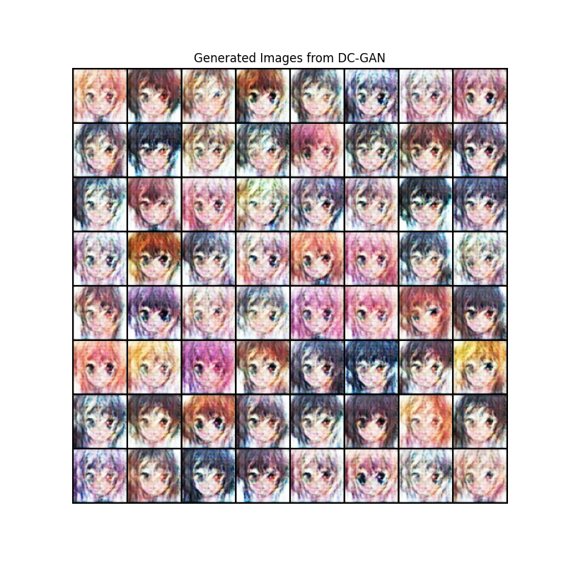|||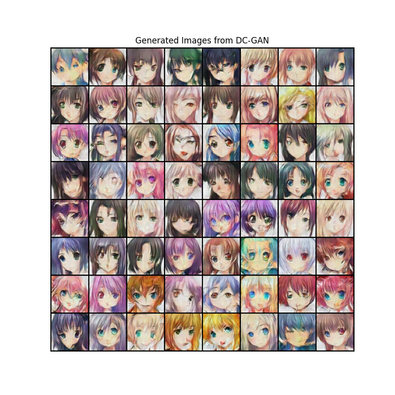|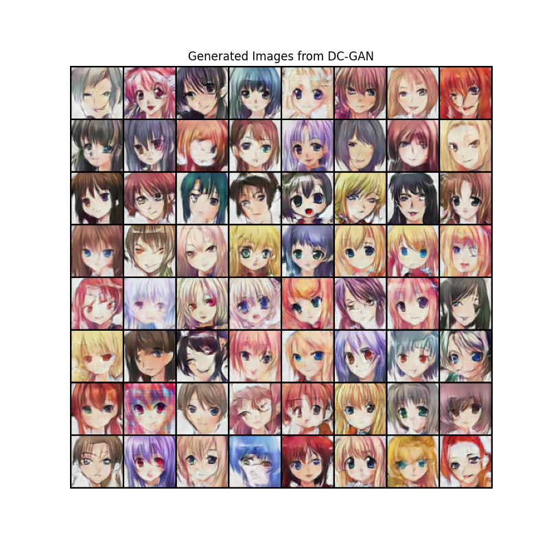||


### AC-GAN 分类
