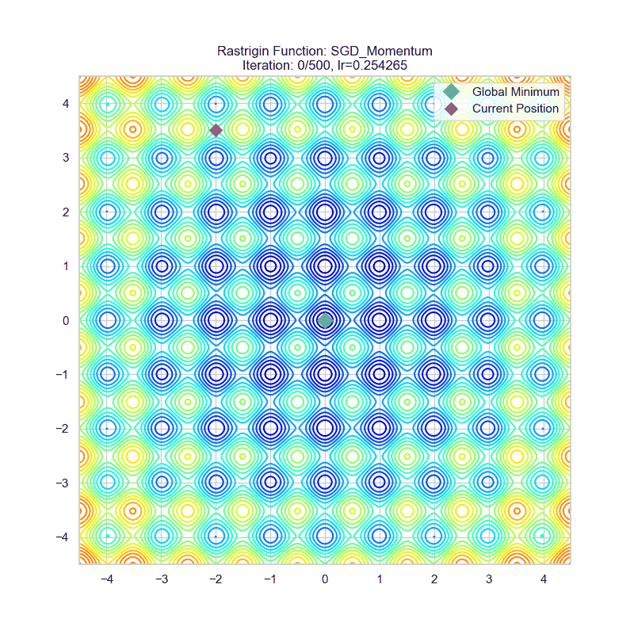
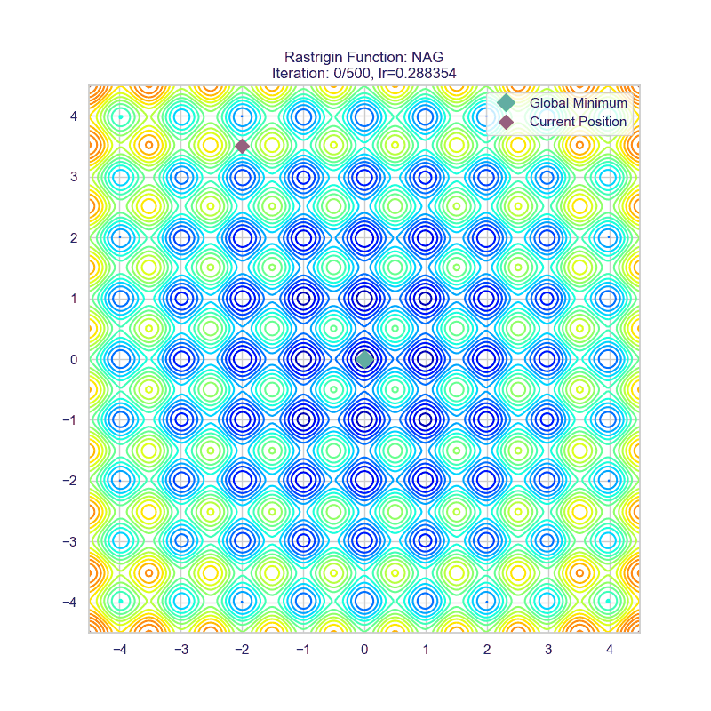
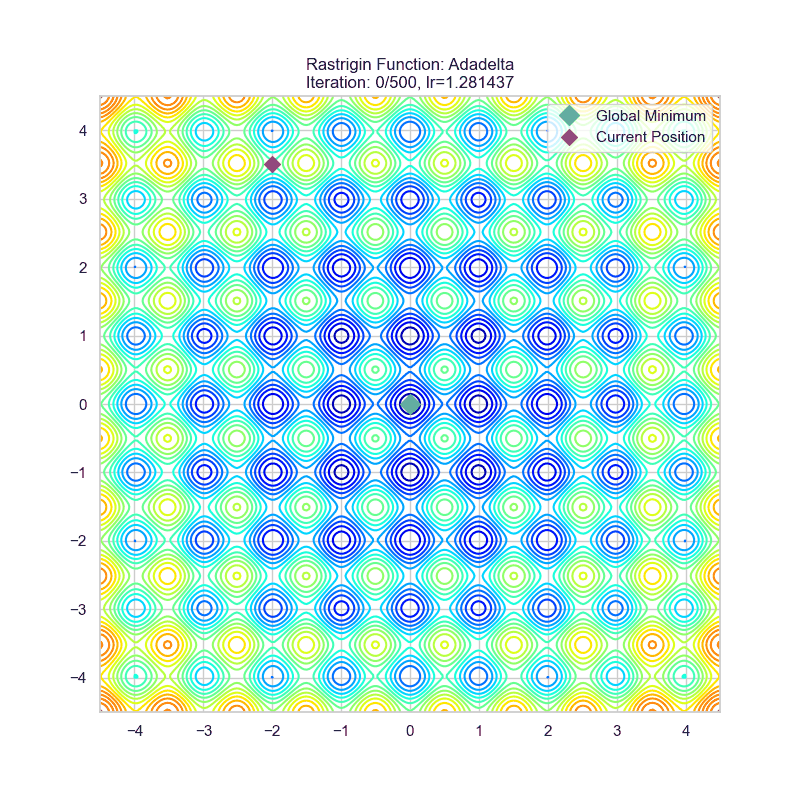
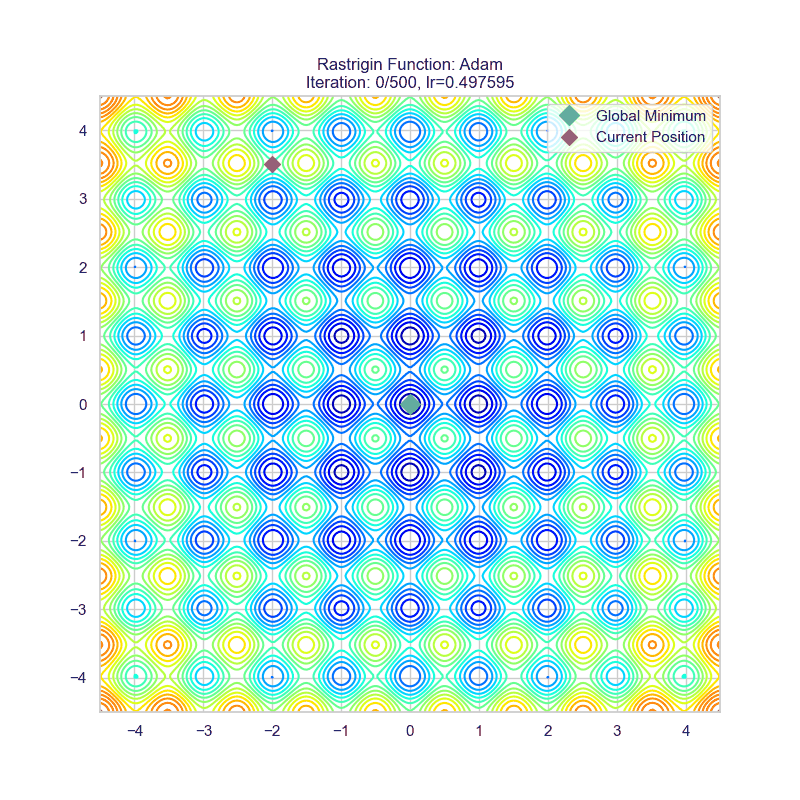
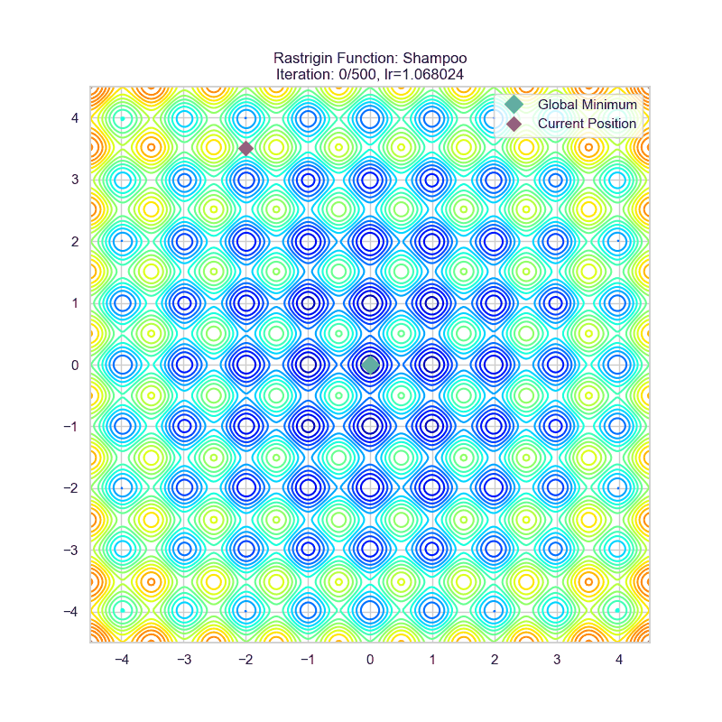

# 神经网络优化器概述

## 写在前面

本文试图对 1951(SGD) 到 2024 (Muon) 的大部分主流优化器发展史做一个简单的概述。尽管“简单”，但也已经达到了上万字的规模。这是因为我并不满足于市面上大部分博客对优化器的介绍仅限于简单的罗列公式，相反，我更希望找出优化器进化的一两条贯穿整个历史长河的伏笔与线索（~~比如优化器里面有一堆 αβδη 什么的说明作者们都喜欢玩osu!mania还是段位吃~~），从而希望能够给列位看官一点启发。行笔仓促，错误在所难免，恳请大家批评指正。

本文的可视化借助了 `pytorch-optimizer` 库的 `viz_optimizers.py`，然后魔改了一下使其能适应较新的库版本，并支持生成动图。代码如下：

<details>

<summary> viz_optimizers_animated.py</summary>

```python
import glob
import math
import os
import shutil
import subprocess
import time

import matplotlib
matplotlib.use('Agg')

import imageio
import matplotlib.pyplot as plt
import numpy as np
import seaborn as sns
import torch
from hyperopt import fmin, hp, tpe

import torch_optimizer as optim

sns.set_theme(style="whitegrid")

def rosenbrock(tensor):
    x, y = tensor
    return (1 - x) ** 2 + 100 * (y - x**2) ** 2

def rastrigin(tensor, lib=torch):
    x, y = tensor
    A = 10
    f = (A * 2 + (x**2 - A * lib.cos(x * math.pi * 2)) + (y**2 - A * lib.cos(y * math.pi * 2)))
    return f

def execute_steps(func, initial_state, optimizer_class, optimizer_config, num_iter=500):
    x = torch.Tensor(initial_state).requires_grad_(True)
    optimizer = optimizer_class([x], **optimizer_config)
    steps = np.zeros((2, num_iter + 1))
    steps[:, 0] = np.array(initial_state)
    for i in range(1, num_iter + 1):
        optimizer.zero_grad()
        f = func(x)
        f.backward(create_graph=True, retain_graph=True)
        torch.nn.utils.clip_grad_norm_(x, 1.0)
        optimizer.step()
        steps[:, i] = x.detach().numpy()
    return steps

def objective_rastrigin(params):
    optimizer_config = dict(lr=params["lr"])
    steps = execute_steps(rastrigin, (-2.0, 3.5), params["optimizer_class"], optimizer_config, 100)
    minimum = (0, 0)
    return (steps[0][-1] - minimum[0]) ** 2 + (steps[1][-1] - minimum[1]) ** 2

def objective_rosenbrock(params):
    optimizer_config = dict(lr=params["lr"])
    steps = execute_steps(rosenbrock, (-2.0, 2.0), params["optimizer_class"], optimizer_config, 100)
    minimum = (1.0, 1.0)
    return (steps[0][-1] - minimum[0]) ** 2 + (steps[1][-1] - minimum[1]) ** 2


def plot_static_image(steps, func_name, optimizer_name, lr, X, Y, Z, minimum):
    fig, ax = plt.subplots(figsize=(8, 8))
    if func_name == "rosenbrock":
        ax.contour(X, Y, Z, np.logspace(-0.5, 3.5, 20, base=10), cmap="jet")
    else:
        ax.contour(X, Y, Z, 20, cmap="jet")
    iter_x, iter_y = steps[0, :], steps[1, :]
    ax.plot(iter_x, iter_y, "r-x", label="Optimizer Path")
    ax.plot(iter_x[0], iter_y[0], 'go', markersize=10, label='Start')
    ax.plot(iter_x[-1], iter_y[-1], "rD", markersize=10, label="End")
    ax.plot(*minimum, "gD", markersize=10, label="Global Minimum")
    ax.legend()
    ax.set_title(f"{func_name.capitalize()} Function: {optimizer_name}\n{len(iter_x)-1} iterations, lr={lr:.6f}")
    output_path = f"docs/{func_name}_{optimizer_name}.png"
    plt.savefig(output_path)
    plt.close(fig)


def create_animation_with_fading_tail(
    steps, func_name, optimizer_name, lr, X, Y, Z, minimum,
    gif_resolution=256, tail_length=20, fade_length=30
):
    fig_size_inches = 8
    dpi = gif_resolution / fig_size_inches
    num_frames = steps.shape[1]
    images = []

    print(f"    - Step 1/3: Rendering {num_frames} frames into memory (with fading tail)...")
    for i in range(num_frames):
        fig, ax = plt.subplots(figsize=(fig_size_inches, fig_size_inches), dpi=dpi)
        
        if func_name == "rosenbrock":
            ax.contour(X, Y, Z, np.logspace(-0.5, 3.5, 20, base=10), cmap="jet")
        else:
            ax.contour(X, Y, Z, 20, cmap="jet")
        ax.plot(*minimum, "gD", markersize=10, label="Global Minimum")

        start_solid = max(0, i - tail_length)
        solid_path = steps[:, start_solid : i + 1]
        ax.plot(solid_path[0], solid_path[1], "r-", lw=1.5)
        ax.plot(solid_path[0], solid_path[1], "rx", markersize=4)

        start_fade = max(0, start_solid - fade_length)
        for j in range(start_solid - 1, start_fade - 1, -1):
            age = start_solid - j
            alpha = 1.0 - (age / fade_length)
            
            segment = steps[:, j : j + 2]
            ax.plot(segment[0], segment[1], color='red', lw=1.5, alpha=alpha)
        
        ax.plot(steps[0, i], steps[1, i], "rD", markersize=8, label="Current Position")
        
        ax.legend()
        ax.set_title(f"{func_name.capitalize()} Function: {optimizer_name}\nIteration: {i}/{num_frames-1}, lr={lr:.6f}")

        fig.canvas.draw()
        argb_buffer = fig.canvas.tostring_argb()
        image_argb = np.frombuffer(argb_buffer, dtype='uint8').reshape(fig.canvas.get_width_height()[::-1] + (4,))
        image_rgb = image_argb[:, :, 1:]
        images.append(image_rgb)
        plt.close(fig)

        print(f"\r      Rendered frame {i + 1}/{num_frames}", end="")
    print()

    output_path = f"gifs/{func_name}_{optimizer_name}.gif"
    
    print(f"    - Step 2/3: Creating initial GIF with imageio...")
    imageio.mimsave(output_path, images, fps=25)
    size_before = os.path.getsize(output_path) / 1024
    print(f"      Initial GIF saved ({size_before:.1f} KB).")

    print(f"    - Step 3/3: Compressing GIF with gifsicle...")
    try:
        subprocess.run(
            ["gifsicle", "-O2", "--colors", "256", "-o", output_path, output_path],
            check=True, capture_output=True, text=True
        )
        size_after = os.path.getsize(output_path) / 1024
        reduction = (1 - size_after / size_before) * 100 if size_before > 0 else 0
        print(f"      GIF compressed successfully. Size reduced by {reduction:.1f}% to {size_after:.1f} KB.")
    except (subprocess.CalledProcessError, FileNotFoundError) as e:
        print("\n      [WARNING] Gifsicle compression failed.")
        print("      Please ensure 'gifsicle' is installed and in your system's PATH.")
        if isinstance(e, subprocess.CalledProcessError):
            print(f"      Gifsicle stderr: {e.stderr}")


def execute_experiments(optimizers, objective, func, func_name, plot_params, initial_state, gif_config, seed=1):
    total_optimizers = len(optimizers)
    print("=" * 60)
    print(f"STARTING EXPERIMENTS FOR: {func_name.capitalize()} Function")
    print(f"Total optimizers to test: {total_optimizers}")
    print("=" * 60)
    
    if not os.path.exists("docs"): os.makedirs("docs")
    if not os.path.exists("gifs"): os.makedirs("gifs")
        
    x = np.linspace(plot_params['xlim'][0], plot_params['xlim'][1], 250)
    y = np.linspace(plot_params['ylim'][0], plot_params['ylim'][1], 250)
    X, Y = np.meshgrid(x, y)
    Z = func([X, Y], lib=np) if func_name == 'rastrigin' else func([X, Y])

    for i, item in enumerate(optimizers):
        optimizer_class, lr_low, lr_hi = item
        optimizer_name = optimizer_class.__name__
        
        print(f"\n[{i + 1}/{total_optimizers}] PROCESSING: {optimizer_name}")
        print("-" * 40)
        
        print("  1. Finding best learning rate with Hyperopt...")
        start_time = time.time()
        space = {"optimizer_class": hp.choice("optimizer_class", [optimizer_class]), "lr": hp.loguniform("lr", lr_low, lr_hi)}
        best = fmin(fn=objective, space=space, algo=tpe.suggest, max_evals=100, rstate=np.random.default_rng(seed), verbose=0)
        end_time = time.time()
        print(f"    - Best LR found: {best['lr']:.6f} (search took {end_time - start_time:.2f}s)")

        print("  2. Generating full optimization path...")
        steps = execute_steps(func, initial_state, optimizer_class, {"lr": best["lr"]}, num_iter=500)
        print("    - Path generated.")

        print("  3. Creating and saving static image...")
        plot_static_image(steps, func_name, optimizer_name, best['lr'], X, Y, Z, plot_params['minimum'])
        print(f"    - Static image saved to docs/{func_name}_{optimizer_name}.png")

        print("  4. Creating and saving animated GIF with fading tail...")
        start_time = time.time()
        create_animation_with_fading_tail(
            steps, func_name, optimizer_name, best['lr'], X, Y, Z, plot_params['minimum'],
            gif_resolution=gif_config['resolution'],
            tail_length=gif_config['tail_length'],
            fade_length=gif_config['fade_length']
        )
        end_time = time.time()
        print(f"    - Animation created successfully in {end_time - start_time:.2f} seconds.")
        
        print(f"--- Finished processing {optimizer_name} ---")


def LookaheadYogi(*a, **kw):
    base = optim.Yogi(*a, **kw)
    return optim.Lookahead(base)

if __name__ == "__main__":
    GIF_CONFIG = {
        "resolution": 800,
        "tail_length": 20,
        "fade_length": 30
    }

    optimizers_to_test = [
        (torch.optim.Adamax, -8, 0.5), (torch.optim.Adagrad, -8, 0.5),
        (torch.optim.Adadelta, -8, 0.5), (torch.optim.RMSprop, -8, -2),
        (torch.optim.Rprop, -8, 0.5), (torch.optim.NAdam, -8, -1)
    ]

    plot_params_rastrigin = {'xlim': (-4.5, 4.5), 'ylim': (-4.5, 4.5), 'minimum': (0, 0)}
    execute_experiments(
        optimizers_to_test, objective_rastrigin, rastrigin, 'rastrigin', 
        plot_params_rastrigin, initial_state=(-2.0, 3.5), gif_config=GIF_CONFIG
    )

    plot_params_rosenbrock = {'xlim': (-2, 2), 'ylim': (-1, 3), 'minimum': (1.0, 1.0)}
    execute_experiments(
        optimizers_to_test, objective_rosenbrock, rosenbrock, 'rosenbrock', 
        plot_params_rosenbrock, initial_state=(-2.0, 2.0), gif_config=GIF_CONFIG
    )

    print("\n" + "="*60)
    print("ALL EXPERIMENTS COMPLETE!")
    print("Check the 'docs' directory for static images and 'gifs' for animations.")
    print("="*60)
```

</details>

## 何以优化

神经网络的目的是在训练数据集上实现**结构风险最小化**以获得良好的拟合和泛化能力。简单说，如果我们在训练集 $X$ 上有一个定义明确的损失函数 $\mathcal{L}(X;\theta)$（表示我们的结构风险），那么所有优化器的目的都是设计一个算法来寻找合适的 $\theta$ 以获得 $\mathrm{argmin}_\theta\ \mathcal{L}(X;\theta)$。

## 寻找最小值

让我们回忆熟悉的极（小）值寻找方法。对于二次函数而言，我们可以很容易获得极小值的闭型表达式。且这一极小值是全局的。

对于更复杂的一元函数，我们很容易可以证明那些前 $2k-1(k = 1,2,\cdots)$ 阶导数为 $0$，且第 $2k$ 阶导数不为 $0$ 的点为一个极值点。（证明不难，反复进行泰勒展开即可）。

可是神经网络的损失函数是一个极为复杂的多元参数求极小值的过程。我们几乎无法找到一个表达式来表述这个极小值。

但是，我们仍有能力去研究这个极小值附近的数学性质。换言之，如果我们想要下山，即便我们不知道山谷的具体位置，但是向下走一定能走到真正的谷底。唯一的区别就是我们的用时、路径和结果位置不一样罢了。这样，就引入了我们评判优化器的几个核心指标。

## 什么样的优化器是好的优化器？

还是沿用下山的比喻。

- 我们希望尽可能快速地下山。也就是我们希望优化器的收敛速率尽可能快。
- 我们希望我们不会困在小山沟里面，而是深入真正的谷底。也就是我们希望优化器不会困于一些很坏的点，比如说对于做传统算法的同学而言比较熟悉的局部最优点（e.g. 例如一些性质不好的贪心）或者现在主流研究的鞍点（梯度平缓的非极值点），而是有走出去寻找全局最小值的能力。事实上，现在主流的研究方向并非关系**全局**最小，而是鞍点逃逸。毕竟前者只轻微影响训练效果，而后者在更大程度上影响训练速度。
- 我们希望不要指错路，不要乱指路。也就是我们希望在快速收敛的情况下训练稳定，不要出现损失尖峰或是大幅度震荡。

## SGD 系列算法

### 随机梯度下降 SGD

所有的SGD理论讲解都会使用下山的比喻。我们也接着沿用。考虑我们在半山腰，浓雾笼罩，只能看到脚底一片地。如果我们要尽可能快地下山，肯定是**沿着最陡的方向往下**走。

考虑泛函 $\mathcal{L(x; \theta)}$ 是当前的模型 $\theta$ 在某一训练数据 $x$ 下的损失地形。什么地方最陡呢？当然是 $\nabla\mathcal{L(x;\theta)} = \sum_{i=1}^{n} \dfrac{\partial\mathcal{L(x;\theta)}}{\partial \theta_i}\vec{e}_i$ 也就是梯度方向了。证明也很简单，由于各个分量 $\vec{e}_i$ 正交，让每个方向都朝自己的方向变化就可以叠加出最大的变化率。

但是我们不能光看一个数据，那样的话针对性过强了，容易过拟合。那怎么办呢？我们可以一次性取多个数据，具体而言，我们在训练集里面随机取 $|\mathcal{B}|$ 个数据，称作一个 Batch（批量），在这个 Batch 下面我们计算平均梯度 $\dfrac{1}{|\mathcal{B}|}\sum_{i=1}^{|\mathcal{B}|} \nabla\mathcal{L}(x_i;\theta)$，作为“最陡”方向的参考。

下面的问题就是往这个方向走多远的问题了。这是一个我们可以调整的超参数，大了，走得更快，但是容易震荡；小了，收敛又太慢。（此处埋一个伏笔，嘻嘻）这个超参数叫做学习率，用来表征当前的梯度对模型权重进行更新的参考价值。

现在就可以祭出我们的 mini-batch SGD 算法了！对于数据集 $X$ 而言，每次随机抽取 $|\mathcal{B}|$ 条数据 $x$。计算上一代模型 $\theta_{n-1}$ 的更新步长

$$
\begin{align*}
    \Delta \theta &= -\dfrac{\eta}{|\mathcal{B}|}\sum^{|\mathcal{B}|}_{i=1}\nabla\mathcal{L}(x_i;\theta_{n-1})\\
    \theta_n &= \theta_{n-1}+\Delta \theta
\end{align*}
$$

这里加负号意思是“下降”。

这样不仅使用的平均梯度，参考价值较强（而且如果 batch size 更大，对原有数据集分布的估计就更好），更赞的是一个 Batch 里面所有梯度的计算都是独立的，所以天生适合利用 GPU 进行高度并行化的计算！

下面我们来评估一下这个 mini-batch SGD 算法。

- 收敛速率上，对于梯度大的方向收敛快，梯度小的方向收敛慢。如果说损失地形的最低点四周都是很陡的斜坡，那很好，但存在这种混合情况：考虑一个开口向上的椭圆抛物面，并假设我们初始点在椭圆长轴端点附近，这样梯度方向近似和短轴方向平行，模型就一直在前后横跳，真正向下移动（长轴分量）很少。事实上这种情况对应的是一个条件数很大的海森矩阵，相关分析参考后文。
- 寻找全局最小值的能力：在一个平缓的鞍点处算法表现得很“懒”，除非把学习率调大，但是过大的学习率会导致损失不收敛。
- 小学习率当然会使得训练稳定。但是还是那个老生常谈的问题……

为了更直观地理解 SGD 的过程和缺陷，我制作了两个动图，它们是 SGD 在两个二元函数作为损失函数下的运动轨迹。第一个叫做 rosenbrock，解析式为

$$
z=(1 - x)^2 + 100  (y - x^2)^2
$$

它体现为一个香蕉状弯曲的峡谷地形，可以用来观察优化器在面对条件数大的海森矩阵采用的策略。

第二个叫做 rastrigin，解析式为

$$
\begin{align*}
    A &= 10\\
    z &= 2A+ (x^2 - A\cos(2\pi x))+ (y^2 - A\cos(2\pi y))
\end{align*}
$$

它体现为一个鸡蛋托地形，具有很多局部极小值和鞍点。

这是 SGD 在 rosenbrock 函数下的表现：


可以看到确实出现了这种“反复横跳”。

这是 SGD 在 rastrigin 函数下的表现：


可以看到它确实变得很“懒”，陷入离初始点最近的局部最小值了。

### 动量法随机梯度下降 SGDM

#### 动量的引入

人往高处走，水往低处流。我们可以感性体会一下，相比其我们根据坡度（梯度）小心翼翼地下山，从山顶滚落的巨石似乎能比我们更快且更好地找到真正谷底的位置。

让我们对这块石头进行建模。考虑一个单位物体在势场 $U$ 中做带阻尼的自由运动。（带阻尼是为了让物体的动能耗散，以停止在最小值）那么它所受梯度力 $F=-\nabla U$，即 $ma = -\nabla U$。取时间微元 $\beta_3$，则速度更新为 $-v_{n+1} = -\beta_1v_n - \beta_3 a = -\beta_1v_n - \beta_3\dfrac{\nabla U}{m}$，其中 $\beta_1<1$ 表征阻尼损耗，位置更新为 $\theta_{n+1} = \theta_n - \beta_3v_n$。事实上这里 $m$ 表征惯性的大小，惯性大，不易受力移动；惯性小，容易往下移动。这也体现出学习率的一点性质。在更新权重的时候我们可以把时间步长和质量两个参量统一考虑成学习率 $\eta$。现在我们可以把质量乘上去，也就是考虑**动量**：

$$
\begin{align*}
    g_n&=\nabla\mathcal{L({x};\theta_{n-1})}\\
    M_{n}&=\beta_1M_{n-1}+\beta_3g_n\\
    \theta_n&=\theta_{n-1}-\eta M_n
\end{align*}
$$

（若不做特殊说明，$\nabla\mathcal{L({x};\theta_{n-1})}$ 一概指一个 mini-batch 的平均梯度即 $\dfrac{1}{|\mathcal{B}|}\sum^{|\mathcal{B}|}_{i=1}\nabla\mathcal{L}(x_i;\theta_{n-1})$）

这样就得到了**动量法随机梯度下降**即 SGD with Momentum 或 SGDM 算法了。式子里面的 $\beta_1$ 指的是动量衰减因子，可以理解成某种摩擦阻力，要不然就会一直在极小值周围做（近似）的椭圆天体运动不收敛， $\beta_3$ 是梯度的参考系数，而 $\eta$ 就是学习率了。

这是动量法随机梯度下降在之前两个函数的运动轨迹：




可以看见在算法初期，SGDM 的步长较长（因为累积的动量较大），这有利于增大搜索空间，直到进入一个平缓的谷底之后，动量开始衰减并且向最小值靠近。

#### Nesterov 加速

如果把刚刚 SGDM 的式子展开：

$$
\begin{align*}
    g_n&=\nabla\mathcal{L({x};\theta_{n-1})}\\
    \theta_n&=\theta_{n-1}-\eta (\beta_1M_{n-1}+\beta_3g_n)\\
    &=\theta_{n-1}-\eta \beta_1M_{n-1}-\eta\beta_3g_n
\end{align*}
$$

可以看到其实我们对参数进行了**两步**更新，而第二步更新使用的梯度却是更新前参数的梯度。如果我们考虑让第二步更新使用的梯度是**第一步更新后参数的梯度**，也就是让 $g'_n=\nabla\mathcal{L}({x};\theta_{n-1}-\eta \beta_1M_{n-1})$，就得到了 Nesterov 加速优化后的 SGDM。

虽然网上99%对这个的讲解都是停留在这里就完了，但是我们很难对 $\theta_{n-1}-\eta \beta_1M_{n-1}$ 这个前瞻位置的参数直接求一次梯度。为什么？因为我们最后要在代码里面使用 `loss.backward()` 把梯度求出来，但是这个梯度不是前瞻位置的梯度，这不就废了吗，说好的加速，计算量反倒翻倍了……

为此，我们需要寻找无需进行前瞻位置梯度计算的等效形式。

##### 进阶推导

为简便起见，下面的推导统一设 $\beta_3=1$。

让我们从

$$
\theta_n=\theta_{n-1}-\eta \beta_1M_{n-1}-\eta g'_n
$$

入手（其中 $g'_n=\nabla\mathcal{L}({x};\theta_{n-1}-\eta \beta_1M_{n-1})$），为了让这个 $g'_n$ 能够较好地被分离出去，首先在左右两边配上一个 $-\eta \beta_1M_n$，有点类似于去找前瞻位置。然后：

$$
\begin{align*}
    \theta_n-\eta\beta_1M_n&=\theta_{n-1}-\eta(1+\beta_1)M_n\\
    &=\theta_{n-1}-\eta(1+\beta_1)(\beta_1M_{n-1}+g'_n)\\
    &=(\theta_{n-1}-\eta\beta_1M_{n-1})-\eta[(1+\beta_1)g'_n+\beta_1^2M_{n-1}]
\end{align*}
$$

我们可以做一个代换：

$$
\begin{align*}
    \hat\theta_n&=\theta_n-\eta\beta_1M_n\\
    \hat M_n &= (1+\beta_1)g'_n+\beta_1^2M_{n-1}
\end{align*}
$$

这样就有了

$$
\hat\theta_n=\hat\theta_{n-1}-\eta\hat M_n
$$

并且循环带入 $M_n$ 的定义式展开 $\hat M_n$：

$$
\begin{align*}
    \hat M_n &= (1+\beta_1)g'_n+\beta_1^2M_{n-1}\\
    &=(1+\beta_1)g'_n+\beta_1^2g'_{n-1}+\beta_1^3g'_{n-2}+\cdots
\end{align*}
$$

利用高中就学过的错位相减（让 $\hat M_n$ 和  $\beta\hat M_{n-1}$ 相减），我们可以得到 $\hat M_n$ 的递推式：

$$
\hat M_n = \beta_1\hat M_{n-1}+g'_n+\beta_1(g'_n-g'_{n-1})
$$

整理一下我们得到递推公式：

$$
\begin{align*}
    g'_n&=\nabla\mathcal{L({x};\hat\theta_{n-1})}\\
    \hat M_{n}&=\beta_1\hat M_{n-1}+g'_n+\beta_1(g'_n-g'_{n-1})\\
    \hat\theta_n&=\hat\theta_{n-1}-\eta\hat M_n
\end{align*}
$$

由于初始时的 Nesterov 修正项是 $0$，这个递推式可以保证与原来的形式完全等效。

但是我们可以发现，即使这个 $g_n$ 取到原来的梯度，也能通过这种方式（两次迭代的梯度之差）来得到 Nesterov 加速等效的结果。

但是这样做要我们保存两份梯度，有没有更省显存的做法呢？有的。

还是一个和高中数列题很像的思路，我们把在 $\hat M_n$ 的计算中长得比较像的拉到一边去：

$$
\begin{align*}
    \hat M_n - g'_n &= \beta_1 g'_n + \beta_1(\hat M_{n-1} - g'_{n-1})\\
    \dfrac{\hat M_n - g'_n}{\beta_1}&=g'_n + (\hat M_{n-1} - g'_{n-1})
\end{align*}
$$

这里有一个分母 $\beta_1$ 不好看，我们做代换 $\beta_1\tilde M_n = \hat M_n - g'_n$，就有：

$$
\tilde M_n=g'_n+\beta_1\tilde M_{n-1}
$$

整理一下我们得到递推公式：

$$
\begin{align*}
    g'_n&=\nabla\mathcal{L({x};\hat\theta_{n-1})}\\
    \tilde M_n&=g'_n+\beta_1\tilde M_{n-1}\\
    \hat\theta_n&=\hat\theta_{n-1}-\eta(\beta_1\tilde M_n+ g'_n)
\end{align*}
$$

由于我们在整个变换过程中只是使用了变量代换，和一开始的 Nesterov 加速法是等效的，所以对于这个式子而言，我们完全可以这样写：

$$
\begin{align*}
    g_n&=\nabla\mathcal{L({x};\theta_{n-1})}\\
    M_n&=g_n+\beta_1M_{n-1}\\
    \theta_n&=\theta_{n-1}-\eta(\beta_1 M_n+ g_n)
\end{align*}
$$

这样对 Nesterov 加速的实现就非常简单了！只需要把权重更新项从 $\eta M_n$ 换成 $\eta(\beta_1 M_n+ g_n)$ 即可。

当然有的实现会考虑 $\beta_3=(1-\beta_1)$，这个时候权重更新项就变成了 $\eta[\beta_1 M_n+ (1-\beta_1)g_n]$。

#### 评述

让我们看看 NAG 的轨迹：




SGDM 能够具有更快的收敛速率，尤其对于梯度不对称场景下，能够实现均衡的梯度累积，即减缓前后横跳，加速向下滚动。动量居功至伟。尤其是引入 Nesterov 加速后，动量的针对性更强，收敛速率也更快了。

### 正则化优化

我们考虑一般的 $L_2$ 正则化用以对权重大小进行惩罚限制。在 SGD 场景下：

$$
\begin{align*}
    g_{n} &= -\eta\nabla\left(\mathcal{L}({x};\theta_{n-1})+\dfrac{\lambda}{2}|\theta_{n-1}|^2\right)\\
    &=-\eta\nabla\mathcal{L}({x};\theta_{n-1})-\eta\lambda\theta_{n-1}\\
    \theta_n&=\theta_{n-1}+g_n\\
    &=(1-\eta\lambda)\theta_{n-1}-\eta\nabla\mathcal{L}(x;\theta_{n-1})
\end{align*}
$$

这样我们就可以以数乘代替繁琐且耗时的梯度计算，这被叫做“解耦的权重衰减”（Decoupled Weight Decay）。如果还想解耦更彻底些，可以写成 $(1-\lambda)\theta_{n-1}-\eta\nabla\mathcal{L}(x;\theta_{n-1})$，也就是甚至把学习率和正则化参数解耦。在后面的优化器中（比如 AdamW），我们基本不会直接使用原教旨主义的 $L_2$ 正则化，而是采用这种权重衰减的方式，尽管在更复杂的优化器下，这两者数学上并不等效。

### SGDM 的代码实现

下面，让我们来赏析一下 `torch.optim.SGD` 对 SGDM 的实现。中文注释是我让 Gemini 帮我读代码给出的注解。

<details>

<summary>SGDM 的实现</summary>

```python
def _single_tensor_sgd(
    params: list[Tensor],
    grads: list[Tensor],
    momentum_buffer_list: list[Optional[Tensor]],
    grad_scale: Optional[Tensor],
    found_inf: Optional[Tensor],
    *,
    weight_decay: float,
    momentum: float,
    lr: float,
    dampening: float,
    nesterov: bool,
    maximize: bool,
    has_sparse_grad: bool,
):
    # 这两个参数与自动混合精度（AMP）中的梯度缩放有关，用于跳过无效更新。
    # 此函数是基础实现，不处理这些情况，故断言它们为 None。
    assert grad_scale is None and found_inf is None

    # 循环遍历每一个参数及其对应的梯度和动量缓冲区
    for i, param in enumerate(params):
        # 获取当前参数的梯度。如果目标是最大化（maximize=True），则反转梯度方向。
        grad = grads[i] if not maximize else -grads[i]
        
        # --- 步骤 1: 应用权重衰减 (Weight Decay / L2 正则化) ---
        if weight_decay != 0:
            # 注意: 这里的实现是将权重衰减项加到梯度上，而不是从权重中直接减去（解耦权重衰减）。
            # 这等价于在损失函数中加入了 L2 正则化项 0.5 * weight_decay * param^2。
            # 更新前的梯度 g' = g + w * theta
            
            # 使用嵌套 if 是为了绕过 TorchScript JIT 编译器的规则，并处理可微的 weight_decay。
            if isinstance(weight_decay, Tensor):
                if weight_decay.requires_grad:
                    # 如果 weight_decay 本身是需要计算梯度的张量（例如在元学习中），
                    # 必须克隆 param 来进行乘法，以避免在反向传播中出现原地修改错误。
                    grad = grad.addcmul(param.clone(), weight_decay)
                else:
                    # 如果 weight_decay 是张量但无需梯度，则使用常规的 add 操作。
                    grad = grad.add(param, alpha=weight_decay)
            else:
                # 如果 weight_decay 是一个普通的浮点数，这是最常见的情况。
                grad = grad.add(param, alpha=weight_decay)

        # --- 步骤 2: 计算动量并更新梯度 ---
        if momentum != 0:
            # 获取当前参数的动量缓冲区（momentum buffer），我们称之为 M
            buf = momentum_buffer_list[i]

            if buf is None:
                # 如果是第一次更新该参数，动量缓冲区为空。
                # 初始化动量 M_0 = g' (当前梯度)
                # 使用 clone().detach() 来创建一个不带梯度历史的新张量作为初始动量。
                buf = torch.clone(grad).detach()
                momentum_buffer_list[i] = buf
            else:
                # 如果已有动量，则进行更新。
                # 公式: M_t = momentum * M_{t-1} + (1 - dampening) * g'_t
                # momentum 是动量因子 (β)，dampening 抑制了新梯度对动量的影响。
                # 当 dampening=0 时，这就是标准动量更新公式 M_t = β * M_{t-1} + g'_t
                buf.mul_(momentum).add_(grad, alpha=1 - dampening)

            if nesterov:
                # 如果使用 Nesterov 加速梯度 (NAG):
                # 更新所用的梯度变为: g''_t = g'_t + momentum * M_t
                grad = grad.add(buf, alpha=momentum)
            else:
                # 如果使用标准动量:
                # 更新所用的梯度就是动量本身: g''_t = M_t
                grad = buf
        
        # --- 步骤 3: 使用最终的梯度更新参数 ---
        # 最终更新公式: param_t = param_{t-1} - lr * g''_t
        
        # 同样，使用嵌套 if 来处理 lr 可能是一个需要梯度的张量的情况。
        if isinstance(lr, Tensor):
            if lr.requires_grad:
                # 如果 lr 需要梯度，必须使用 addcmul，它有为所有输入（包括lr）定义的导数。
                # value=-1 实现减法。
                param.addcmul_(grad, lr, value=-1)
            else:
                # 如果 lr 是张量但无需梯度，使用 add_ 和 alpha=-lr。
                param.add_(grad, alpha=-lr)
        else:
            # 如果 lr 是一个普通的浮点数（最常见情况），使用最高效的 add_ 操作。
            param.add_(grad, alpha=-lr)
```

</details>

### 其他讨论

#### 梯度与海森矩阵估计

我们回顾一下怎么给一个多元函数 $f({x})$ 做二阶泰勒展开。

在一阶的情况下，很明显有

$$
f({x})\approx f({x_0})+\nabla f({x_0})\cdot ({x-x_0})
$$

类似的，我们可以把求导算子应用到梯度上面，也就是得到梯度的雅可比矩阵，或者叫做**海森矩阵**：

$$
H=\left(\frac{\partial^2}{\partial x_i\partial x_j}\right)_{1\le i,j\le n}=\left(
\begin{matrix}
    \frac{\partial^2}{\partial x_1^2} & \frac{\partial^2}{\partial x_1\partial x_2} & \cdots & \frac{\partial^2}{\partial x_1\partial x_n}\\
    \frac{\partial^2}{\partial x_2\partial x_1} & \frac{\partial^2}{\partial x_2^2} & \cdots & \frac{\partial^2}{\partial x_2\partial x_n}\\
    \vdots & \vdots & \ddots & \vdots\\
    \frac{\partial^2}{\partial x_n\partial x_1} & \frac{\partial^2}{\partial x_n\partial x_2} & \cdots & \frac{\partial^2}{\partial x_n^2}\\
\end{matrix}
\right)
$$

那么二阶的泰勒展开就变成了

$$
f({x})\approx f({x_0})+\nabla f({x_0})({x-x_0})+\dfrac{1}{2}({x-x_0})^\top H f({x_0})({x-x_0})
$$

让我们用熟悉的记号重写一下：

$$
\mathcal{L}(\theta_n+\Delta\theta)\approx \mathcal{L}(\theta_n)+g_n^\top\Delta\theta+\dfrac{1}{2}\Delta\theta^\top H \mathcal{L}(\theta_n)\Delta\theta
$$

在 SGD 场景下，$\Delta\theta=-\eta g_n$，损失函数的改变量为：

$$
\mathcal{L}(\theta_n+\Delta\theta)- \mathcal{L}(\theta_n)\approx -\eta g_n^\top g_n+\dfrac{1}{2}\eta^2g_n^\top H \mathcal{L}(\theta_n)g_n
$$

可见，在 $H$ 较大（尤其是条件数较大，对应之前说的椭圆抛物面）的地方，SGD 的更新是相当低效的。

让我们以另外一个视角观察前面的式子。为了找到最小值，事实上我们是在寻找损失函数**梯度的零点**。这样我们可以挪用数值分析里面找零点相当高效的算法：牛顿迭代法。

回顾一下牛顿法的内容，对于函数 $f(x)$ 和初始估计 $x_{n-1}$，更新方式为：

$$
\Delta x = -\dfrac{f(x_{n-1})}{f'(x_{n-1})}\\
x_n=x_{n-1}+\Delta x
$$

牛顿法的特征就是收敛高效，且是**自适应**的，陡峭的地方下降快，平缓的地方精度高。

在优化器的语境里面，其实就是让参数更新量 $\Delta \theta=-[H\mathcal{L}]^{-1}\nabla \mathcal{L}$。而前面所述的“陡峭”和“平缓”恰巧对应的就是一阶导（梯度）的导数也就是**海森矩阵**！

由于海森矩阵（及其逆矩阵）的计算量非常之大，与其计算它不如用这个时间跑几轮算得快的近似算法。

而 SGD 其实就是取的 $[H\mathcal{L}]^{-1}=\eta I$ 这个估计，相当于抹平各个方向的差异做了统一的更新。

对于海森矩阵而言，有没有更好的估计方式呢？有的！要不然为什么我们会引入动量呢？

让我们考虑一个椭圆抛物面

$$
f({x})=\dfrac 12{x}^\top A{x}+{b}^\top {x}
$$

那么在这个面上的任一点有梯度 $\nabla f=A{x}-{b}$ 以及海森矩阵 $Hf=A$。

令梯度等于 $0$，实质就是求解线性方程组 $H{x}={b}$，为此我们定义残差 ${r}=H{x}-{b}$

在任意一本数值分析教材里面都会讲到求解线性方程组的一百万种方法，包括高斯消元法，雅可比迭代，预条件法等。在其中和先前我们提到的动量法最相关的是**共轭梯度法**。下面简要介绍一下这个方法。

**定义**：若 $A$ 为 $n\times n$ 的对称正定矩阵，$u,v$ 为两个 $n$ 维的向量，则两者的 **$A$-内积** 定义为：

$$
\langle u,v\rangle _A=u^\top Av
$$

特别的，如果 $\langle u, v\rangle _A=0$，则称两个向量关于 $A$ 共轭。

现在我们有一个参数的初始估计 $\theta_n$，得到了梯度 $g_n$ 也就是之前提到的残差。

下面我们需要寻找参数更新量 $M_n$，吸纳之前关于“共轭”的讨论，我们希望各个 $M$ 之间的优化是独立的，也就是 $\langle M_i,M_j\rangle _H=0\quad(i\ne j)$ 成立。

感觉是否很像 Gram-Schmidt 正交化？是的！当然共轭梯度法使用的是一个等效更简单的形式（具体怎么从正交化等式推到这个简单形式比较复杂而且也有点跑题了，我视情况在后面给一个附录进行证明），也就是

$$
\beta_n = \dfrac{g_n^\top g_n}{g_{n-1}^\top g_{n-1}}\\
M_n=g_n+\beta_nM_{n-1}
$$

其实直接用 Gram-Schmidt 正交化也无可厚非（虽然这就涉及到要把 $H$ 纳入计算），因为无论如何我们都要把 $\beta_n$ 估计为一个固定的超参数 $\beta$，我们要的是下面那个动量式子的结构而不是参数的表达式，毕竟参数可以估计。

当然共轭梯度还利用 $\alpha_i=\dfrac{g_n^\top g_n}{M_n^\top H M_n}$ 来计算更新步长，不过这个的计算意义不大，因为我们一是不知道 $H$，二是利用的固定学习率 $\eta$ 来近似替代。

现在我们把 $\beta_i$ 也估计为固定的超参数 $\beta$，那我们就可以下论断了：**动量法随机梯度下降是采用固定参数近似对 $H^{-1}$ 的共轭梯度法求解**。

对于海森矩阵而言，有没有更好的估计方式呢？有的！让我们不要把参数固定死，来一个自适应调节。

## 自适应学习率改进策略

我没要求你一定得用那种最新最好的 Optimizer，我不是恶魔。

可是，用 SGD 优化 LLM 是什么意思？你才 21 岁吧？再这样下去，你 21 岁用 SGD，42 岁用 SGD with Momentum，84 岁就该问 Who is Adam 了。

作为 $\theta$，我可能真该收敛到鞍点，真的。

### AdaGrad

#### 外积近似

AdaGrad 的精髓是拿梯度近似海森矩阵 $H$，以此实现自适应调整。但是这需要我们对损失地形有更多的探索。

这一部分，我主要是参考 arXiv:2304.09871 和[苏剑林的这篇博客](https://kexue.fm/archives/10588)的内容来推导。

在目标参数 $\theta$ 附近取近似解 $\theta_n$，我们可以把梯度做一个一阶近似：$g_n=H(\theta-\theta_n)$

近似解可以随机选取，因此考虑其服从 $N(\theta, \sigma^2 I)$，为了弄出平方我们把它乘上自己的转置：

$$
g_ng_n^\top=H(\theta-\theta_n)(\theta-\theta_n)^\top H^\top
$$

事实上一开始 AdaGrad 就是考虑的采用的这种外积方案，但是计算量过大，我们考虑只取 $H$ 的对角元（这个在 SGD 中已经有效地使用过一次了），并且在期望意义下 $(\theta-\theta_n)(\theta-\theta_n)^\top=E=\sigma^2I$，这样就可以写成

$$
H\approx\dfrac{1}{\sigma}\sqrt{g_n\odot g_n}
$$

由此，便可以祭出 AdaGrad 大法了：

$$
\begin{align*}
    g_n&=\nabla\mathcal{L({x};\theta_{n-1})}\\
    G_{n}&=G_{n-1}+g_n\odot g_n\\
    \theta_n&=\theta_{n-1}-\dfrac{\eta}{\sqrt{\epsilon+G_n}} g_n
\end{align*}
$$

为了防止除零错误，$\epsilon$ 是一个小正数。在实践上也会有把 $\epsilon$ 提到根号外的情况，都是等价的。

下面是 AdaGrad 的轨迹演示：


可见 AdaGrad 对于大梯度有更大的步长，并且随着进入平缓的部分逐渐衰减。但是这仅仅类似于 SGD 加上一个自适应，并没有对 rosenbrock 这种地形做很好的适应，尤其在后期一直在梯度方向横跳。

#### AdaGrad 的代码实现

同样让我们看看 `PyTorch` 对这个算法的实现。

<details>

<summary>AdaGrad 的实现</summary>

```python
# _get_value(t: Tensor) -> float: 从单元素张量中提取其浮点数值，类似于 t.item()
# _make_sparse(grad, grad_indices, grad_values): 使用给定的索引和值创建一个新的稀疏张量

def _single_tensor_adagrad(
    params: list[Tensor],
    grads: list[Tensor],
    state_sums: list[Tensor],
    state_steps: list[Tensor],
    grad_scale: Optional[Tensor],
    found_inf: Optional[Tensor],
    *,
    lr: float,
    weight_decay: float,
    lr_decay: float,
    eps: float,
    has_sparse_grad: bool,
    maximize: bool,
    differentiable: bool,
    has_complex: bool,
):
    # 这两个参数与自动混合精度（AMP）的梯度缩放有关，此特定实现不支持，因此断言它们为 None
    assert grad_scale is None and found_inf is None

    # 使用 zip 同时遍历参数、梯度、状态累加和、步数这四个列表
    for param, grad, state_sum, step_t in zip(params, grads, state_sums, state_steps):
        # 更新步数计数器（原地操作）
        step_t += 1
        # 从 Tensor 中获取步数的标量值（例如通过 .item()）
        step = _get_value(step_t)
        # 如果是最大化问题（maximize=True），则反转梯度方向，执行梯度上升
        grad = grad if not maximize else -grad

        # 应用权重衰减（L2 正则化）
        if weight_decay != 0:
            # Adagrad 的权重衰减与稀疏梯度不兼容，因为 add 操作在稀疏张量上定义不同
            if grad.is_sparse:
                raise RuntimeError(
                    "weight_decay option is not compatible with sparse gradients" # 权重衰减选项与稀疏梯度不兼容
                )
            # 对于稠密梯度，将权重衰减项加到梯度上。公式: grad = grad + param * weight_decay
            grad = grad.add(param, alpha=weight_decay)

        # 根据学习率衰减公式，计算当前步骤的有效学习率 (clr)
        # 公式: clr = lr / (1 + (step - 1) * lr_decay)
        clr = lr / (1 + (step - 1) * lr_decay)

        # 根据梯度是稀疏还是稠密，选择不同的更新路径
        if grad.is_sparse:
            # --- 稀疏梯度更新路径 ---
            # 合并稀疏梯度中相同索引的值，确保索引唯一。这对于后续的非线性操作（如平方）是必需的。
            grad = grad.coalesce()
            grad_indices = grad._indices()  # 获取稀疏梯度的非零元素索引
            grad_values = grad._values()   # 获取稀疏梯度的非零元素值

            # 将当前梯度值的平方，以稀疏张量的形式，累加到历史状态 `state_sum` 中
            state_sum.add_(_make_sparse(grad, grad_indices, grad_values.pow(2)))
            # 从 `state_sum` 中仅抽取出与当前梯度非零位置相对应的累积值
            std = state_sum.sparse_mask(grad)
            # 计算分母：对抽出的累积值开方，然后加上 eps 以保证数值稳定性
            std_values = std._values().sqrt_().add_(eps)
            # 更新参数：仅更新梯度中非零索引对应的参数元素
            # 更新公式：param[indices] -= clr * (grad_values / std_values)
            param.add_(
                _make_sparse(grad, grad_indices, grad_values / std_values), alpha=-clr
            )
        else:
            # --- 稠密梯度更新路径 ---
            # 检查参数是否为复数类型
            is_complex = torch.is_complex(param)
            if is_complex:
                # 如果是复数，则将其视为一个实数张量进行后续计算，其形状会增加一个维度2（实部和虚部）
                grad = torch.view_as_real(grad)
                state_sum = torch.view_as_real(state_sum)
                param = torch.view_as_real(param)
            
            # Adagrad 核心步骤：将梯度的平方累加到 state_sum 中（原地操作）
            # 公式: state_sum = state_sum + grad * grad
            state_sum.addcmul_(grad, grad, value=1)
            
            # 计算分母 std = sqrt(state_sum) + eps
            if differentiable:
                # 如果要求整个优化过程可微分，则使用返回新张量的 `+` 操作
                std = state_sum.sqrt() + eps
            else:
                # 否则，使用原地操作 `add_` 以节省内存并可能提高速度
                std = state_sum.sqrt().add_(eps)
            
            # 执行参数更新（原地操作）
            # 公式: param = param - clr * (grad / std)
            param.addcdiv_(grad, std, value=-clr)

            # 如果参数是复数，需要将作为实数视图的变量转换回其复数表示
            if is_complex:
                param = torch.view_as_complex(param)
                state_sum = torch.view_as_complex(state_sum)
```

</details>

AdaGrad 通过累积的 $G$ 来实现对 Hessian 的近似，**按理说**应该具有更加优秀的学习率调度。毕竟，AdaGrad 就是 Adaptive Gradient 的省略嘛！

但是事实上我们可以发现，如果在一个并不好的，梯度很大的初始位置开始进行优化，那累积在 $G_n$ 里面的梯度将会是“一辈子都抹不去的东西”，$G_n$ 的值只会越来越大，即使走出这样的地方，仍然会因为这个“历史包袱”而寸步难行（也就是初始梯度对全局影响过大）。尤其是刚刚的近似只是对靠近最优点能够很有效，有没有办法从梯度能够获得对 Hessian 矩阵的更好估计呢？这就要祭出 RMSprop 了。

### RMSprop

其实我们想要的是一种“窗口平均”，因为 $H\approx\dfrac{1}{\sigma}\sqrt{g_n\odot g_n}$ 是在接近最优点的统计意义下近似的，如果离最优点比较远，那参数更新量大一些也无妨，离最优点比较近，就不要让之前的结果影响到。

这种窗口平均肯定不能直接保存最近 $k$ 个梯度的列表再求平均，这显然太费显存：

$$
G_{n+1}=\frac 1k (kG_n+p_n-p_{n-k})
$$

其中 $p_n = g_n\odot g_n$。不过我们可以把 $p_{n-k}$ 近似成 $G_n$，也就是使用平均值来近似单一值，然后做一个变量替换 $\beta_2=\dfrac{k-1}{k}$ 来使式子好看，这样我们相比于 AdaGrad，就不用增加任何临时存储了！由此得到的是**滑动窗口平均**，即：

$$
G_{n+1} = \beta_2 G_n + (1-\beta_2)g_n\odot g_n
$$

这种平均是不是似曾相识？回想起之前关于动量法的讨论（取 $\beta_3=(1-\beta_1)$ ）：

$$
M_n=(1-\beta_1)g_n+\beta_1M_{n-1}
$$

看，这里的动量计算其实也是在取梯度的滑动窗口平均。

这就得到了 RMSprop 算法了：

$$
\begin{align*}
    g_n&=\nabla\mathcal{L({x};\theta_{n-1})}\\
    G_{n}&=\beta_2 G_n + (1-\beta_2)g_n\odot g_n\\
    \theta_n&=\theta_{n-1}-\dfrac{\eta}{\sqrt{\epsilon+G_n}} g_n
\end{align*}
$$

RMS 指的就是 $\sqrt{\epsilon+G_n}$，既有滑动窗口的平方平均 (Mean Square)，又在最后开了根(Root)。

prop的意思就是反向传播了。毕竟我们是对神经网络做的优化。


让我们来看看 RMSprop 的轨迹演示：


RMSprop 相比于 AdaGrad 其实只是更改了学习率自适应程度，还是没有逃脱在 rosenbrock 下反复横跳的宿命。这已经不是一般的损失地形了，必须要~~出重拳~~引入动量来调整参数更新方向！——不过这都是后话了，有关讨论敬请参阅 Adam 一节。

#### RMSprop 的代码实现

<details>

<summary>RMSprop 的实现</summary>

```python
def _single_tensor_rmsprop(
    params: list[Tensor],
    grads: list[Tensor],
    square_avgs: list[Tensor],
    grad_avgs: list[Tensor],
    momentum_buffer_list: list[Tensor],
    state_steps: list[Tensor],
    *,
    lr: float,
    alpha: float,
    eps: float,
    weight_decay: float,
    momentum: float,
    centered: bool,
    maximize: bool,
    differentiable: bool,
    capturable: bool,
    has_complex: bool,
):
    # 循环遍历每一个参数及其对应的梯度和状态
    for i, param in enumerate(params):
        # 获取当前参数的更新步数
        step = state_steps[i]

        # --- CUDA Graph 捕获相关的检查 ---
        # 如果代码正在被 torch.compile 编译，编译器会处理图捕获的检查。
        # 见 note [torch.compile x capturable]
        if not torch.compiler.is_compiling() and capturable:
            # 获取支持 CUDA Graph 捕获的设备列表（通常是 'cuda'）
            capturable_supported_devices = _get_capturable_supported_devices()
            # 断言：如果启用了 capturable，参数和其状态必须在支持的设备上
            assert (
                param.device.type == step.device.type
                and param.device.type in capturable_supported_devices
            ), f"If capturable=True, params and state_steps must be on supported devices: {capturable_supported_devices}."

        # 获取当前参数的梯度
        grad = grads[i]
        # 如果是最大化问题 (maximize=True)，则反转梯度方向（梯度上升）
        grad = grad if not maximize else -grad
        # 获取当前参数的梯度平方的移动平均值
        square_avg = square_avgs[i]

        # 步数加 1
        step += 1

        # --- 权重衰减 (Weight Decay) ---
        # 如果设置了权重衰减（L2 正则化）
        if weight_decay != 0:
            # 将权重衰减项加到梯度上。公式: grad = grad + param * weight_decay
            # 也就是解耦的权重衰减。
            grad = grad.add(param, alpha=weight_decay)

        # --- 处理复数张量 ---
        # 检查参数是否为复数类型
        is_complex_param = torch.is_complex(param)
        if is_complex_param:
            # 如果是复数，将其视为实数张量进行处理。
            # 例如，一个形状为 [N] 的复数张量会变成形状为 [N, 2] 的实数张量，
            # 最后一维分别代表实部和虚部。
            param = torch.view_as_real(param)
            grad = torch.view_as_real(grad)
            square_avg = torch.view_as_real(square_avg)

        # --- 更新梯度平方的移动平均值 (RMS) ---
        # 公式: square_avg = alpha * square_avg + (1 - alpha) * grad^2
        square_avg.mul_(alpha).addcmul_(grad, grad, value=1 - alpha)

        # --- 计算分母 `avg` ---
        if centered:
            # --- Centered RMSprop ---
            # 获取梯度的移动平均值
            grad_avg = grad_avgs[i]
            if is_complex_param:
                # 同样处理复数情况
                grad_avg = torch.view_as_real(grad_avg)
            
            # 更新梯度的移动平均值。公式: grad_avg = alpha * grad_avg + (1 - alpha) * grad
            grad_avg.lerp_(grad, 1 - alpha)
            
            # 计算分母。公式: avg = sqrt(square_avg - grad_avg^2)
            # 这实际上是梯度的（移动）方差的平方根
            avg = square_avg.addcmul(grad_avg, grad_avg, value=-1).sqrt_()
        else:
            # --- 标准 RMSprop ---
            # 计算分母。公式: avg = sqrt(square_avg)
            avg = square_avg.sqrt()

        # --- 添加 epsilon 以保证数值稳定性 ---
        if differentiable:
            # 如果要求操作可微分，使用 `add` (返回新张量) 而不是 `add_` (原地修改)
            avg = avg.add(eps)
        else:
            # 否则，使用原地操作 `add_` 以提高效率，防止分母为零
            avg = avg.add_(eps)

        # --- 参数更新步骤 ---
        if momentum > 0:
            # --- 带动量的更新 ---
            # 获取动量缓冲
            buf = momentum_buffer_list[i]
            if is_complex_param:
                 # 同样处理复数情况
                buf = torch.view_as_real(buf)
            
            # 更新动量缓冲。公式: buf = momentum * buf + grad / avg
            buf.mul_(momentum).addcdiv_(grad, avg)
            # 使用动量缓冲更新参数。公式: param = param - lr * buf
            param.add_(buf, alpha=-lr)
        else:
            # --- 不带动量的标准更新 ---
            # 直接更新参数。公式: param = param - lr * (grad / avg)
            param.addcdiv_(grad, avg, value=-lr)
```

</details>

代码里面提到了 Centered RMSprop，其实还是为了解决“不在最小值周围”的问题。因为我们在最小值周围选点，梯度的期望是 $0$，但是如果不在周围，梯度的期望就要另行计算，怎么计算呢？和之前的思路一样，同步对梯度做滑动窗口平均即可，然后计算 $G_n$ 的适合，减去这个期望平方值，就相当于做了一次中心化了。

代码里面还提到了“动量缓冲”，可以这样理解：RMSprop 是自适应学习率的 SGD，那么我们用相同的方式给 SGDM 添加自适应学习率，就得到了 RMSprop with Momentum 了，具体实现参考刚刚的代码，其实就是使用动量项 $M_n = \beta_3 M_{n-1} + \dfrac{\eta}{\sqrt{\epsilon+G_n}} g_n$ 再乘以学习率作为参数更新量。

#### AdaDelta

让我们回到在 AdaGrad 里面讨论的海森矩阵近似：

$$
H\approx\dfrac{1}{\sigma}\sqrt{g_n\odot g_n}
$$

在 RMSprop 中，我们能够高效计算 $\sqrt{g_n\odot g_n}$，而对于 $\sigma$，我们直接用学习率估计的，但考虑到 $\sigma$ 自身的意义（也就是 $\mathbb{E}[(\theta_n-\theta)(\theta_n-\theta)^\top]$ 即参数离最优解的期望欧几里得距离），如果当前预期参数比较远，$\sigma$ 就该比较大，反之则较小。怎么估计这个距离呢？AdaDelta 提出的方案是使用**参数更新量的滑动窗口平均**。也就是：

$$
\begin{align*}
    g_n&=\nabla\mathcal{L({x};\theta_{n-1})}\\
    G_{n}&=\beta_2 G_n + (1-\beta_2)g_n\odot g_n\\
    X_n&=\beta_4X_{n-1}+(1-\beta_4)\Delta\theta_{n-1}\odot\Delta\theta_{n-1}\\
    \theta_n&=\theta_{n-1}-\dfrac{\sqrt{\epsilon+X_n}}{\sqrt{\epsilon+G_n}} g_n
\end{align*}
$$

可以看到 AdaDelta 已经完全实现了自适应调节，连学习率的估计都实现了自动化调整。

让我们看看轨迹：




可以看到相比于之前的几个 Ada（Adaptive 的省写）优化器，尽管 AdaDelta 的学习率大了好几倍，在参数更新量上面还是偏保守。

下面是 AdaDelta 的代码实现：

<details>

<summary>AdaDelta 的实现</summary>

```python
def _single_tensor_adadelta(
    params: list[Tensor],
    grads: list[Tensor],
    square_avgs: list[Tensor],
    acc_deltas: list[Tensor],
    state_steps: list[Tensor], # 注意：此函数中 state_steps 仅被递增，但未在核心算法中使用
    *,
    lr: float,
    rho: float,
    eps: float,
    weight_decay: float,
    maximize: bool,
    differentiable: bool,
    capturable: bool,
    has_complex: bool,
):
    # --- CUDA Graph 捕获相关的检查 ---
    # 如果代码正在被 torch.compile 编译，编译器会处理图捕获的检查。
    if not torch.compiler.is_compiling() and capturable:
        # 获取支持 CUDA Graph 捕获的设备列表
        capturable_supported_devices = _get_capturable_supported_devices(
            supports_xla=False
        )
        # 断言：如果启用 capturable，所有参数和状态都必须在支持的设备上
        assert all(
            p.device.type == step.device.type
            and p.device.type in capturable_supported_devices
            for p, step in zip(params, state_steps)
        ), f"如果 capturable=True, params 和 state_steps 必须在支持的设备上: {capturable_supported_devices}."

    # 循环遍历每一个参数及其对应的梯度和状态
    for param, grad, square_avg, acc_delta, step in zip(
        params, grads, square_avgs, acc_deltas, state_steps
    ):
        # 步数加 1 (在 Adadelta 核心算法中未使用，但为保持优化器接口一致性而保留)
        step += 1
        # 如果是最大化问题，则反转梯度
        grad = grad if not maximize else -grad

        # --- 应用权重衰减 ---
        if weight_decay != 0:
            grad = grad.add(param, alpha=weight_decay)

        # --- 处理复数张量 ---
        if torch.is_complex(param):
            # 将所有状态和梯度都视为实数张量进行计算
            square_avg = torch.view_as_real(square_avg)
            acc_delta = torch.view_as_real(acc_delta)
            grad = torch.view_as_real(grad)

        # --- Adadelta 算法核心步骤 ---
        
        # 1. 更新梯度平方的移动平均值 E[g^2]_t
        # 公式: E[g^2]_t = rho * E[g^2]_{t-1} + (1 - rho) * g_t^2
        square_avg.mul_(rho).addcmul_(grad, grad, value=1 - rho)
        
        # 2. 计算梯度的均方根 RMS[g]_t
        # 公式: RMS[g]_t = sqrt(E[g^2]_t + eps)
        std = square_avg.add(eps).sqrt_()
        
        # 3. 计算上一步参数更新量的均方根 RMS[Δx]_{t-1}
        # 公式: RMS[Δx]_{t-1} = sqrt(E[Δx^2]_{t-1} + eps)
        # 这里的 acc_delta 存储的是 E[Δx^2]_{t-1}
        delta = acc_delta.add(eps).sqrt_()

        # 为了可微性，如果需要，克隆 delta，以防后续的原地操作破坏计算图
        if differentiable:
            delta = delta.clone()
            
        # 4. 计算当前的参数更新量 Δx_t
        # 公式: Δx_t = (RMS[Δx]_{t-1} / RMS[g]_t) * g_t
        # delta.div_(std) 对应 -> / RMS[g]_t
        # .mul_(grad)    对应 -> * g_t
        # 此时，`delta` 变量存储的是计算出的更新量 Δx_t
        delta.div_(std).mul_(grad)
        
        # 5. 更新参数更新量平方的移动平均值 E[Δx^2]_t，为下一步做准备
        # 公式: E[Δx^2]_t = rho * E[Δx^2]_{t-1} + (1 - rho) * (Δx_t)^2
        # acc_delta 此时仍是 E[Δx^2]_{t-1}
        acc_delta.mul_(rho).addcmul_(delta, delta, value=1 - rho)

        # --- 应用最终更新 ---
        
        # 如果是复数，将计算出的实数更新量转换回复杂的视图
        if torch.is_complex(param):
            delta = torch.view_as_complex(delta)
        
        # 6. 更新参数
        # 公式: x_{t+1} = x_t - lr * Δx_t
        # PyTorch 的实现中保留了 lr 作为缩放系数，默认为 1
        param.add_(delta, alpha=-lr)
```

</details>

回到我们刚刚在 RMSprop 的讨论上，其实我们已经在动量加速和自适应学习率两条道路上走了很远了，那么，有没有一种方法，能够无缝融合，真正集这两家武功之大成呢？有的，这就是接下来要讨论的 Adam 优化器，也就是目前最广泛使用的一个优化器。

### Adam

我们已经知道，通过滑动窗口平均梯度的平方，可以得到学习率的一个自适应调整；通过引入动量，可以让我们有更快的收敛速率。如果我们将自适应学习率调整融入动量法之中，Adam 优化器就自然而然地诞生了。

具体来说，Adam 优化器是这样计算的：

$$
\begin{align*}
    g_n&=\nabla\mathcal{L({x};\theta_{n-1})}\\
    M_n&=(1-\beta_1)g_n+\beta_1M_{n-1}\\
    G_{n}&=\beta_2 G_n + (1-\beta_2)g_n\odot g_n\\
    \hat M_n&=\dfrac{M_n}{1-\beta_1^{n}}\\
    \hat G_n&=\dfrac{G_n}{1-\beta_2^{n}}\\
    \theta_n&=\theta_{n-1}-\dfrac{\eta}{\sqrt{\epsilon+\hat G_n}} \hat M_n
\end{align*}
$$

可以看到，$M_n$ 和 $G_n$ 的计算与先前的优化器并无二致，自适应学习率调整也和 RMSprop 一样。但是 Adam 还额外做了一个**随步数衰减**的缩放，这是因为迭代初期时没有填满滑动窗口导致 $M_n$ 和 $G_n$ 事实上偏小，所以需要这个 $\dfrac{1}{1-\beta^n}$ 来补偿。

现在来看看两个函数下 Adam 优化器的轨迹：




在自适应学习率的基础上引入动量之后，Adam 的性能相比 RMSprop 可以说是突飞猛进！在 rastrigin 地形下通过初始的大学习率找到正确的谷地然后慢慢衰减学习率下降到精确解；在 rosenbrock 地形下不仅不再反复横跳，还能沿着谷底有效前进。

等着看代码吗？别急，Adam 优化器在提出之后，也是经历了如过山车一般起伏的波折，现在的 Adam 实现早就不是原来那个 Adam 了。

何以见得？且听下回分解。

### Adam 的变体们

#### AMSGrad

人怕出名猪怕壮， Adam 自宣布自己拥有 SOTA 级别的收敛效果后，便遭到了许多批评，其中许多不无道理。第一个扔过来的炸弹是收敛性问题，在 [On the Convergence of Adam and Beyond](https://openreview.net/forum?id=ryQu7f-RZ) 这篇文章里，作者认为学习率倒数的差分即

$$
\Gamma_n = \dfrac{\sqrt{G_n}}{\eta}-\dfrac{\sqrt{G_{n+1}}}{\eta}
$$

由于滑动平均的缘故，没法做到像 SGD 和 AdaGrad 一样，让它恒为正。这意味着学习率虽然自适应调整了，但是一会调大一会调小，在这反复横跳，哪来的收敛？？？

不过存在一个简单粗暴的 clip 方案来解决这个问题。既然你嫌弃学习率一会大，一会小，而造成这个出现变动的核心原因就是 $G_n$ 不单调递增，那我直接让 $G_n$ 取目前所有 $G$ 的最大值，也就是只有出现新的最大值才更新 $G_n$，不就完美解决了嘛！

也就是说相对 Adam，AMSGrad 只做了一点小修改：

$$
\begin{align*}
    g_n&=\nabla\mathcal{L({x};\theta_{n-1})}\\
    M_n&=(1-\beta_1)g_n+\beta_1M_{n-1}\\
    G_{n}&=\beta_2 G_n + (1-\beta_2)g_n\odot g_n\\
    \hat M_n&=\dfrac{M_n}{1-\beta_1^n}\\
    \hat G_n&=\max\{\hat G_{n-1},G_n\}\\
    \theta_n&=\theta_{n-1}-\dfrac{\eta}{\sqrt{\epsilon+\hat G_n}} \hat M_n
\end{align*}
$$

也就相当于把 Adam 对 $G_n$ 的修偏估计换成了取极大值，这样不仅解决了嫌 $G_n$ 偏小的问题，还解决了学习率反复横跳的问题，可谓一石二鸟。

#### AdamW

不过一波未平一波又起，在 arXiv:1711.05101v1 这篇文章里面，作者揭露了 Adam 优化器和 $L_2$ 正则化一同使用时出现的问题。

让我们回顾一下怎么在 SGD 上面做权重衰减：

$$
\begin{align*}
    g_{n} &= -\eta\nabla\left(\mathcal{L}({x};\theta_{n-1})+\dfrac{\lambda}{2}|\theta_{n-1}|^2\right)\\
    &=-\eta\nabla\mathcal{L}({x};\theta_{n-1})-\eta\lambda\theta_{n-1}\\
    \theta_n&=\theta_{n-1}+g_n\\
    &=(1-\eta\lambda)\theta_{n-1}-\eta\nabla\mathcal{L}(x;\theta_{n-1})
\end{align*}
$$

在 SGD 中，将 $L_2$ 正则化项的梯度（即 $\lambda\theta_{n-1}$）加到损失梯度上，与最后对权重进行乘性衰减（即乘以 $(1-\eta\lambda)$）是等效的。然而，在 Adam 这样的自适应学习率优化器中，这种等效性被打破了。

当时几乎所有的深度学习框架，在实现 Adam 的权重衰减时，都采用了将 $L_2$ 正则项的梯度加到 $\nabla\mathcal{L}$ 上的方式。这意味着，权重衰减项 $\lambda\theta_{n-1}$ 也会被 Adam 的自适应学习率 $\dfrac{\eta}{\sqrt{\epsilon+\hat G_n}}$ 所缩放。这会产生一个意想不到的后果：对于那些历史梯度很大（即 $G_n$ 很大）的权重，它们获得的权重衰减效果会变小；而对于那些不经常更新、历史梯度很小（即 $G_n$ 很小）的权重，它们的权重衰减效果反而更强。这与我们使用权重衰减的初衷——对所有的大权重进行同等惩罚——是相悖的。

AdamW 的提出就是为了解决这个问题。它的核心思想是解耦权重衰减。它不再将权重衰减伪装成 $L_2$ 正则化并加入梯度计算，而是将其从梯度更新中分离出来，直接在参数更新的最后一步实现，就像在 SGD 中那样。

这样我们就得到了 AdamW 即带有**解耦权重衰减**的 Adam 优化器：

$$
\begin{align*}
    g_n&=\nabla\mathcal{L({x};\theta_{n-1})}\\
    M_n&=(1-\beta_1)g_n+\beta_1M_{n-1}\\
    G_{n}&=\beta_2 G_n + (1-\beta_2)g_n\odot g_n\\
    \hat M_n&=\dfrac{M_n}{1-\beta_1^n}\\
    \hat G_n&=\dfrac{G_n}{1-\beta_2^n}\\
    \theta_n&=\theta_{n-1}-\dfrac{\eta}{\sqrt{\epsilon+\hat G_n}} \hat M_n-\eta\lambda\theta_{n-1}
\end{align*}
$$

至此，AdamW 大杀四方，现在已经成为transformer训练中的默认优化器了。

讲了这么多，让我们一窥代码真容：

<details>

<summary> Adam, AMSGrad, AdamW 的实现</summary>

```python
def _single_tensor_adam(
    params: list[Tensor],
    grads: list[Tensor],
    exp_avgs: list[Tensor],             # 一阶矩估计（动量） m_t
    exp_avg_sqs: list[Tensor],          # 二阶矩估计（自适应学习率项） v_t
    max_exp_avg_sqs: list[Tensor],      # AMSGrad 用的历史最大二阶矩
    state_steps: list[Tensor],          # 步数 t
    grad_scale: Optional[Tensor],
    found_inf: Optional[Tensor],
    *,
    amsgrad: bool,                      # 是否启用 AMSGrad
    has_complex: bool,
    beta1: Union[float, Tensor],        # 一阶矩的指数衰减率
    beta2: Union[float, Tensor],        # 二阶矩的指数衰减率
    lr: Union[float, Tensor],           # 学习率
    weight_decay: float,                # 权重衰减系数
    eps: float,                         # 防止除以零的极小值
    maximize: bool,
    capturable: bool,                   # 是否支持 CUDA Graph 捕获
    differentiable: bool,               # 是否要求操作可微分
    decoupled_weight_decay: bool,       # 是否使用 AdamW 的解耦权重衰减
):
    assert grad_scale is None and found_inf is None

    # 如果在 TorchScript (JIT) 环境下，由于 JIT 对类型推断的限制，直接断言超参数为 float
    if torch.jit.is_scripting():
        assert isinstance(lr, float)
        assert isinstance(beta1, float)
        assert isinstance(beta2, float)

    # 为了优化，如果 beta1 是 Tensor，预先将其按设备和类型存入字典，避免循环内重复转换
    if isinstance(beta1, Tensor):
        beta1_dict: Optional[DeviceDtypeDict] = {(beta1.device, beta1.dtype): beta1}
    else:
        beta1_dict = None

    # 循环处理每个参数
    for i, param in enumerate(params):
        grad = grads[i] if not maximize else -grads[i]
        exp_avg = exp_avgs[i]
        exp_avg_sq = exp_avg_sqs[i]
        step_t = state_steps[i]

        # --- CUDA Graph 捕获检查 ---
        if not torch.compiler.is_compiling() and capturable:
            capturable_supported_devices = _get_capturable_supported_devices()
            assert (
                param.device.type == step_t.device.type
                and param.device.type in capturable_supported_devices
            ), f"If capturable=True, params and state_steps must be on supported devices: {capturable_supported_devices}."

        # 步数加 1
        step_t += 1

        # --- 步骤 1: 应用权重衰减 ---
        if weight_decay != 0:
            if decoupled_weight_decay:
                # AdamW: 解耦权重衰减。直接在参数上乘以一个衰减因子。
                # 公式: param_t = param_t * (1 - lr * weight_decay)
                param.mul_(1 - lr * weight_decay)
            else:
                # 标准 Adam: 权重衰减作为 L2 正则化项加入梯度。
                # 公式: grad_t = grad_t + weight_decay * param_{t-1}
                # 嵌套 if 是为了处理可微分和 JIT 的情况
                if differentiable and isinstance(weight_decay, Tensor):
                    if weight_decay.requires_grad:
                        grad = grad.addcmul(param.clone(), weight_decay)
                    else:
                        grad = grad.add(param, alpha=weight_decay)
                else:
                    grad = grad.add(param, alpha=weight_decay)

        # --- 处理复数 ---
        if torch.is_complex(param):
            # 将所有相关张量都视为实数进行计算
            grad = torch.view_as_real(grad)
            exp_avg = torch.view_as_real(exp_avg)
            exp_avg_sq = torch.view_as_real(exp_avg_sq)
            if amsgrad:
                max_exp_avg_sqs[i] = torch.view_as_real(max_exp_avg_sqs[i])
            param = torch.view_as_real(param)

        device = param.device

        # 如果 beta1 是 Tensor，从字典中获取对应设备和类型的版本
        if beta1_dict is not None:
            dtype = param.dtype
            key = (device, dtype)
            if key not in beta1_dict:
                beta1_dict[key] = beta1.to(device=device, dtype=dtype, non_blocking=True)
            device_beta1: Union[float, Tensor] = beta1_dict[key]
        else:
            device_beta1 = beta1

        # --- 步骤 2: 更新一阶和二阶矩估计 ---
        # 更新一阶矩估计 m_t (exp_avg)
        # 公式: m_t = beta1 * m_{t-1} + (1 - beta1) * grad_t
        exp_avg.lerp_(grad, 1 - device_beta1)

        # 更新二阶矩估计 v_t (exp_avg_sq)
        # 公式: v_t = beta2 * v_{t-1} + (1 - beta2) * grad_t^2
        # 同样，嵌套 if 是为了处理可微分情况
        if differentiable and isinstance(beta2, Tensor):
            if beta2.requires_grad:
                # 使用 lerp 实现可微分的更新，数学上等价于下面的 addcmul
                exp_avg_sq.lerp_(torch.square(grad), weight=1 - beta2)
            else:
                exp_avg_sq.mul_(beta2).addcmul_(grad, grad, value=1 - beta2)
        else:
            exp_avg_sq.mul_(beta2).addcmul_(grad, grad, value=1 - beta2)

        # --- 步骤 3: 参数更新 ---
        # capturable 或 differentiable 模式下，所有计算都使用张量操作以保留计算图
        if capturable or differentiable:
            step = step_t

            # --- 计算偏差修正项 ---
            # 嵌套 if 用于处理 beta 是可微张量的情况
            if differentiable and isinstance(beta1, Tensor):
                if beta1.requires_grad:
                    bias_correction1 = 1 - beta1 ** step.clone()
                else:
                    bias_correction1 = 1 - beta1**step
            else:
                bias_correction1 = 1 - beta1**step

            if differentiable and isinstance(beta2, Tensor):
                if beta2.requires_grad:
                    bias_correction2 = 1 - beta2 ** step.clone()
                else:
                    bias_correction2 = 1 - beta2**step
            else:
                bias_correction2 = 1 - beta2**step

            # --- 计算更新步长和分母 ---
            step_size = lr / bias_correction1
            step_size_neg = step_size.neg()
            bias_correction2_sqrt = bias_correction2.sqrt()

            if amsgrad:
                # AMSGrad: 维护历史最大二阶矩
                if differentiable:
                    max_exp_avg_sq = max_exp_avg_sqs[i].clone()
                else:
                    max_exp_avg_sq = max_exp_avg_sqs[i]
                
                torch.maximum(max_exp_avg_sq, exp_avg_sq, out=max_exp_avg_sqs[i])
                
                # 使用最大二阶矩计算分母
                # 这里做了一些数学变换，将 step_size 合并计算，以减少张量读写
                denom = (
                    max_exp_avg_sqs[i].sqrt() / (bias_correction2_sqrt * step_size_neg)
                ).add_(eps / step_size_neg)
            else:
                # 标准 Adam: 使用当前二阶矩计算分母
                denom = (
                    exp_avg_sq.sqrt() / (bias_correction2_sqrt * step_size_neg)
                ).add_(eps / step_size_neg)

            # 执行最终更新
            if differentiable:
                param.addcdiv_(exp_avg.clone(), denom)
            else:
                param.addcdiv_(exp_avg, denom)
        
        # 非 capturable/differentiable 的常规路径（效率更高）
        else:
            step = _get_value(step_t)

            # --- 计算偏差修正项 ---
            bias_correction1 = 1 - beta1**step
            bias_correction2 = 1 - beta2**step

            # --- 计算步长和分母 ---
            step_size = lr / bias_correction1
            bias_correction2_sqrt = bias_correction2**0.5

            if amsgrad:
                # AMSGrad: 更新并使用历史最大二阶矩
                torch.maximum(max_exp_avg_sqs[i], exp_avg_sq, out=max_exp_avg_sqs[i])
                denom = (max_exp_avg_sqs[i].sqrt() / bias_correction2_sqrt).add_(eps)
            else:
                # 标准 Adam: 使用当前二阶矩
                denom = (exp_avg_sq.sqrt() / bias_correction2_sqrt).add_(eps)

            # --- 执行最终更新 ---
            # 公式: param_t = param_{t-1} - step_size * (m_hat / (sqrt(v_hat) + eps))
            param.addcdiv_(exp_avg, denom, value=-step_size)

        # --- 复数转换回来 ---
        # 如果启用了 AMSGrad 并且参数是复数，将 max_exp_avg_sqs 视图转换回来
        if amsgrad and torch.is_complex(params[i]):
            max_exp_avg_sqs[i] = torch.view_as_complex(max_exp_avg_sqs[i])
```

</details>

</details>

#### Adamax

先前提到 Adam 由于无法控制 $G_n$ 的单调性而可能陷入无法收敛的状况，并且也介绍了 AMSGrad 提出的 clip 方案。而 Adamax 却提出了一个有所不同的 clip 方案。

Adamax 的思想，最初是想把 $G_n$ 对平均梯度的 $L_2$ 估计（也就是 $g_n\odot g_n$ 项）扩展到 $L_p$ 估计：

$$
G_{n}=\beta_2 G_n + (1-\beta_2)g_n^p\\
\theta_n=\theta_{n-1}-\dfrac{\eta}{G_n^{\frac 1p}} M_n
$$

我们单独把学习率自适应权重 $G_n^{\frac 1p}$ 提取出来展开算：

$$
\begin{align*}
    G_n^{\frac 1p} &= \beta_2 G_n + (1-\beta_2)g_n^p\\
    &=(1-\beta_2)^{\frac 1p}\left(\sum_{i=1}^{n}\beta_2^i g^p_{n-i}\right)^{\frac 1p}
\end{align*}
$$

显然这种推广在任意的 $p$ 下是无法解决任何问题的，但是如果我们让 $p\rightarrow\infty$ 也就是取 $L_\infty$ 范数，就会得到：

$$
\begin{align*}
    \lim_{p\rightarrow\infty}(1-\beta_2)^{\frac 1p}\left(\sum_{i=1}^{n}\beta_2^i g^p_{n-i}\right)^{\frac 1p}&=\lim_{p\rightarrow\infty}\left(\sum_{i=1}^{n}\beta_2^i g^p_{n-i}\right)^{\frac 1p}\\
    &=\max\left\{\beta_2^i |g_{n-i}|\right\}_{i=1\dots n}
\end{align*}
$$

写成递推式子就是

$$
G_n = \max\{\beta_2G_{n-1}, |g_n|\}
$$

因此 Adamax 宣称自己相对 Adam，能够解决不收敛问题，还可以简省计算量。不过这样魔改，真的能对 Hessian 做更好的估计吗……

看它在这两个损失地形上的表现，其实还不错：


还是来看看代码实现吧：

<details>

<summary> Adamax 的实现</summary>

```python
def _single_tensor_adamax(
    params: list[Tensor],
    grads: list[Tensor],
    exp_avgs: list[Tensor],
    exp_infs: list[Tensor],
    state_steps: list[Tensor],
    *,
    eps: float,
    beta1: float,
    beta2: float,
    lr: float,
    weight_decay: float,
    maximize: bool,
    differentiable: bool,
    capturable: bool,
    has_complex: bool,
):
    # 循环处理每个参数
    for i, param in enumerate(params):
        grad = grads[i]
        grad = grad if not maximize else -grad
        exp_avg = exp_avgs[i]  # 一阶矩 m_t
        exp_inf = exp_infs[i]  # 无穷范数 u_t
        step_t = state_steps[i]

        # --- CUDA Graph 捕获检查 ---
        if not torch.compiler.is_compiling() and capturable:
            capturable_supported_devices = _get_capturable_supported_devices()
            assert (
                param.device.type == step_t.device.type
                and param.device.type in capturable_supported_devices
            ), f"If capturable=True, params and state_steps must be on supported devices: {capturable_supported_devices}."

        # 步数加 1
        step_t += 1

        # --- 应用权重衰减 ---
        if weight_decay != 0:
            grad = grad.add(param, alpha=weight_decay)

        # --- 处理复数 ---
        if torch.is_complex(param):
            param = torch.view_as_real(param)
            grad = torch.view_as_real(grad)
            exp_avg = torch.view_as_real(exp_avg)
            exp_inf = torch.view_as_real(exp_inf)

        # --- Adamax 算法核心步骤 ---

        # 1. 更新有偏一阶矩估计 m_t (和 Adam 一样)
        # 公式: m_t = beta1 * m_{t-1} + (1 - beta1) * g_t
        exp_avg.lerp_(grad, 1 - beta1)

        # 2. 更新指数加权无穷范数 u_t
        # 公式: u_t = max(beta2 * u_{t-1}, |g_t|)
        # 注意：PyTorch 的实现中，为了防止 u_t 在梯度为零时也为零，
        # 实际比较的是 `beta2 * u_{t-1}` 和 `|g_t| + eps`。
        if not differentiable:
            # 对于非可微模式，使用 torch.maximum 更高效
            torch.maximum(
                exp_inf.mul_(beta2),      # 计算 beta2 * u_{t-1}
                grad.abs().add_(eps),     # 计算 |g_t| + eps
                out=exp_inf,              # 将结果原地写入 exp_inf
            )
        else:
            # 对于可微模式，需要构建一个可微分的操作序列
            # 将两个要比较的张量在新的维度上拼接起来
            norm_buf = torch.cat(
                [exp_inf.mul_(beta2).unsqueeze(0), grad.abs().add_(eps).unsqueeze_(0)],
                0,
            )
            # 然后使用 amax（等价于 max）在那个新维度上求最大值
            exp_inf.copy_(torch.amax(norm_buf, 0, keepdim=False))

        # --- 步骤 3: 参数更新 ---
        
        # 针对 Capturable 模式的特殊处理路径
        if capturable:
            # 这里的数学变换是为了在 capturable 模式下避免某些操作的限制。
            # 原始公式是: clr = lr / (1 - beta1^t), 更新量是 -clr * (m_t / u_t)
            # 这里计算 neg_bias_correction = beta1^t - 1
            neg_bias_correction = beta1**step_t - 1
            # 然后除以 lr，得到 (beta1^t - 1) / lr
            neg_bias_correction.div_(lr)
            # 分母 denom = u_t * (beta1^t - 1) / lr
            denom = exp_inf * neg_bias_correction
            # 更新: param += m_t / denom = param - lr * m_t / ((1 - beta1^t) * u_t)
            param.addcdiv_(exp_avg, denom)
        else:
            # 常规模式下的更新路径
            # 计算偏差修正项
            bias_correction = 1 - beta1 ** _get_value(step_t)
            # 计算修正后的学习率
            clr = lr / bias_correction
            
            # 执行参数更新
            # 公式: θ_t = θ_{t-1} - (lr / (1 - beta1^t)) * (m_t / u_t)
            # exp_inf 就是分母 u_t
            param.addcdiv_(exp_avg, exp_inf, value=-clr)
```

</details>

#### Nadam

读到这里，我相信任何一位读者都可以独立发明出 Nadam，毕竟我们在讲 SGDM 的时候花了大力气推导了 Nesterov 加速的式子，总不可能到了 Adam 这一块就完全不管了吧。是的，Nadam 的 novelty 就在于把 Nesterov 加速梯度引入到了 Adam 的计算之中。
我们考虑直接引入 Nesterov 加速项，也就是权重更新项从 $\dfrac{\eta}{\sqrt{\epsilon+\hat G_n}}\hat M_n$ 换成 $\dfrac{\eta}{\sqrt{\epsilon+\hat G_n}}[\dfrac{\beta_1 M_n}{1-\beta_1^{n-1}}+\dfrac{(1-\beta_1) g_n}{1-\beta_1^{n-1}}]$。这个也是 arXiv/1609.04747 推导出来的的。

但是考虑到 Adam 增加了对梯度二阶矩的估计，因此如果一直使用固定的 $\beta_1$ 的话，其实是偏大的。如果我们看提出 Nadam 的原论文 [Incorporating Nesterov Momentum into Adam](https://openreview.net/forum?id=OM0jvwB8jIp57ZJjtNEZ)，就可以发现它的思路有一定的差异。

在后面一篇论文中，作者并没有固定规定一个 $\beta_1$，而是使用 $\mu_{n}$ 来调整更新比例，也就是它认为动量和权重的更新应该是如下的：

$$
\begin{align*}
    M_n&=\mu_{n}M_{n-1}+\beta_3 g_n\\
    \theta_n&=\theta_{n-1}-(\mu_{n+1}M_n+\beta_3 g_n)
\end{align*}
$$

这里 $\mu_{n+1}$ 代表的就是 Nesterov 加速的前瞻性。下面我们取 $\beta_3=(1-\mu_n)$，由于是对 $\mu_n$ 进行连乘，权重更新项也就变成了 $\dfrac{\eta}{\sqrt{\epsilon+\hat G_n}}[\dfrac{\mu_{n+1} M_n}{1-\prod_{i=1}^{n+1}\mu_i}+\dfrac{(1-\mu_{n}) g_n}{1-\prod_{i=1}^{n}\mu_i}]$

为了解决之前偏大的问题，PyTorch 在 Nadam 的实现里对 $\beta_1$ 采用了衰减的策略。

具体而言，它引入了 $\mu_n=\beta_1 \left(1 - 0.5 \cdot 0.96^{n \cdot d}\right)$ 的估计，那么最后权重的更新方式变成：

$$
\begin{align*}
    g_n&=\nabla\mathcal{L({x};\theta_{n-1})}\\
    M_n&=(1-\beta_1)g_n+\beta_1M_{n-1}\\
    G_{n}&=\beta_2 G_n + (1-\beta_2)g_n\odot g_n\\
    \mu_n&=\beta_1 \left(1 - 0.5 \cdot 0.96^{n \cdot d}\right)\\
    \mu_{n+1}&=\beta_1 \left(1 - 0.5 \cdot 0.96^{(n+1) \cdot d}\right)\\
    \hat \mu_{n+1} &=\hat\mu_n \mu_{n+1}\\
    \hat M_n&=\dfrac{\mu_{n+1}M_n}{1-\hat \mu_{n+1}}\\
    \hat G_n&=\dfrac{G_n}{1-\beta_2^{n-1}}\\
    \theta_n&=\theta_{n-1}-\dfrac{\eta}{\sqrt{\epsilon+\hat G_n}} (\hat M_n+\dfrac{(1-\mu_n)g_n}{1-\hat\mu_n})
\end{align*}
$$

这是优化器的轨迹动图：


看来 Nadam 和 Adam 差不太多，并没有像 SGD 引入 NAG 那样惊艳。

下面是代码：

<details>

<summary> Nadam 的实现</summary>

```python
def _single_tensor_nadam(
    params: list[Tensor],
    grads: list[Tensor],
    exp_avgs: list[Tensor],
    exp_avg_sqs: list[Tensor],
    mu_products: list[Tensor],
    state_steps: list[Tensor],
    *,
    beta1: float,
    beta2: float,
    lr: float,
    weight_decay: float,
    momentum_decay: float,
    eps: float,
    decoupled_weight_decay: bool,
    maximize: bool,
    capturable: bool,
    differentiable: bool,
    has_complex: bool,
):
    # 循环处理每个参数
    for i, param in enumerate(params):
        grad = grads[i] if not maximize else -grads[i]
        exp_avg = exp_avgs[i]
        exp_avg_sq = exp_avg_sqs[i]
        mu_product = mu_products[i]
        step_t = state_steps[i]

        # --- 处理复数 ---
        if torch.is_complex(param):
            param = torch.view_as_real(param)
            grad = torch.view_as_real(grad)
            exp_avg = torch.view_as_real(exp_avg)
            exp_avg_sq = torch.view_as_real(exp_avg_sq)

        # --- CUDA Graph 捕获检查 ---
        if not torch.compiler.is_compiling() and capturable:
            capturable_supported_devices = _get_capturable_supported_devices()
            assert (
                param.device.type == mu_product.device.type == step_t.device.type
                and param.device.type in capturable_supported_devices
            ), "如果 capturable=True, params, mu_products 和 state_steps 必须在支持的设备上。"

        # 步数加 1
        step_t += 1

        # 根据模式获取步数值（Tensor 或 float）
        if capturable:
            step = step_t
        else:
            step = _get_value(step_t)

        # 计算二阶矩的偏差修正项
        bias_correction2 = 1 - beta2**step

        # --- 应用权重衰减 ---
        if weight_decay != 0:
            if decoupled_weight_decay:
                # NAdamW: 使用解耦权重衰减
                param.mul_(1 - lr * weight_decay)
            else:
                # 标准 NAdam: 将权重衰减作为 L2 正则化加入梯度
                grad = grad.add(param, alpha=weight_decay)

        # --- NAdam 核心步骤 ---

        # 1. 计算当前步(t)和下一步(t+1)的动量衰减调度因子 μ
        # 这个调度使得动量衰减率在训练初期较小，后期接近 beta1
        mu = beta1 * (1.0 - 0.5 * (0.96 ** (step * momentum_decay)))
        mu_next = beta1 * (1.0 - 0.5 * (0.96 ** ((step + 1) * momentum_decay)))

        # 2. 更新动量衰减因子的累积乘积
        # 公式: mu_product_t = mu_product_{t-1} * mu_t
        mu_product *= mu

        # 3. 更新一阶矩 m_t 和二阶矩 v_t (和 Adam 相同)
        # m_t = beta1 * m_{t-1} + (1 - beta1) * g_t
        exp_avg.lerp_(grad, 1 - beta1)
        # v_t = beta2 * v_{t-1} + (1 - beta2) * g_t^2
        exp_avg_sq.mul_(beta2).addcmul_(grad, grad, value=1 - beta2)
        
        # 4. 计算归一化的分母
        # denom = sqrt(v_t / bias_correction2)
        denom = exp_avg_sq.div(bias_correction2).sqrt()

        # --- 步骤 5: 参数更新 ---
        # NAdam 的更新规则可以分解为两部分：一部分与当前梯度有关，一部分与动量有关。
        # 更新公式: param_t = param_{t-1} - lr * ( (1-μ_t)*g_hat_t + μ_{t+1}*m_hat_t ) / (sqrt(v_hat_t) + eps)
        # 其中 g_hat_t 和 m_hat_t 是经过偏差修正的梯度和动量。
        # PyTorch 的实现将这个公式拆分成了两个 addcdiv 操作。

        # 可微分或可捕获模式下的路径
        if differentiable or capturable:
            denom = denom.add(eps)
            # 为了让 Autograd 跟踪操作，直接修改梯度和动量项，而不是作为 addcdiv 的标量值
            mu_product_next = mu_product * mu_next
            # 计算与梯度相关的更新部分
            grad_update_part = grad * (-lr * (1.0 - mu) / (1.0 - mu_product))
            # 计算与动量相关的更新部分
            exp_avg_update_part = exp_avg * (-lr * mu_next / (1.0 - mu_product_next))
            # 应用更新
            param.addcdiv_(grad_update_part, denom)
            param.addcdiv_(exp_avg_update_part, denom)
        else:
            # 常规模式下的路径 (更高效)
            mu_product_next = _get_value(mu_product) * mu_next
            denom.add_(eps)
            # 应用与梯度相关的更新部分
            param.addcdiv_(
                grad, denom, value=(-lr * (1.0 - mu) / (1.0 - _get_value(mu_product)))
            )
            # 应用与动量相关的更新部分
            param.addcdiv_(
                exp_avg, denom, value=(-lr * mu_next) / (1.0 - mu_product_next)
            )
```

</details>

### Shampoo

让我们回顾那个在最优点附近的 Hessian 近似： $H\approx\dfrac{1}{\sigma^2} \sqrt{GG^\top}$，Shampoo 的思想是选取更精确的近似以逼进 $GG^\top$。

提一嘴，这里的 $GG^\top$ 指的是将 $g$ 展平之后的外积，也就是 $\mathrm{vec}(g)\mathrm{vec}(g)^\top$，鉴于之前我们一直研究的都是 $g$ 的对角线乘积近似，由于简化很多所以没有特别明确这个维度问题，因此在这里明确一下。

Shampoo 优化器的第一步，是考虑现在的多层神经网络内，层之间是相互独立的。因此可以把大型的 $GG^\top$ 给分块对角化，每一个对角块对应某个层的梯度外积。

但是即使这样，单层的参数量也很大，考虑一个 $n\times m$ 的 fc layer，$GG^\top$ 的参数量就来到了 $(mn)\times(nm)$，直接平方。而这就带领我们进入 Shampoo 优化器推导的真正精妙之处。

作者认为，海森矩阵可以由两个小矩阵的 Kronecker 积近似，也就是

$$
H=(GG^\top)^{-1}=L\otimes R
$$

这样一拆开参数量暴降到 $L$ 的 $n^2$ 加上 $R$ 的 $m^2$。可以理解成 $L$ 捕获输入维的信息，$R$ 捕获输出为的信息（不过我觉得有点强行解释了哈哈，因为关键是节省计算量，看一路过来我们都是在寻求尽可能**高效**而不是最有道理的优化器）。

下面推导 $L$ 和 $R$ 的更新式。先介绍 Kronecker 积的几个小性质：$\mathrm{vec}(BXA^\top)=(A\otimes B)\mathrm{vec}(X)$ 和 $(A\otimes B)^{-1}=(A^{-1}\otimes B^{-1})$ （转置亦然）。

取 $B=A=G$， $X = I$ 那么 $\mathrm{vec}(GG^\top)=(G\otimes G)\mathrm{vec}(I)$ 但这和我们期待的结构仍有距离，不过我们可以换成未展平的原矩阵也就是利用：

$$
(g\otimes g)(g\otimes g)^\top=(g\otimes g)(g^\top\otimes g^\top)=gg^\top \otimes g^\top g
$$

来近似 $H^2$。

上述推导非常类似 K-FAC 算法，具体请参考[这个博客](https://blog.csdn.net/xbinworld/article/details/105184601)。

无论如何根据我们之前的经验，这里的 $L$ 和 $R$ 也必然是要取滑动平均的（或者利用类似 AdaGrad 的思路，如果下面 $\beta=1$ 的话），也就是

$$
L_n = \beta L_{n-1} + g_n g_n^\top\\
R_n = \beta R_{n-1} + g_n^\top g_n
$$

那么我们对参数进行更新，就是计算 $H^{-1}g$，展开，并利用 Kronecker 积的性质，得到

$$
H^{-\frac 12}g=L^{- \frac 14}gR^{- \frac 14}
$$

其中 $\frac 14 + \frac 14 = \frac 12$，这样就得到了我们的对单层的更新。

对于 $k-1$ 层的网络（即 $k$ 阶张量），我们需要重复计算 $k$ 次再组合成大的 $H^{-\frac 12}$，那么每一次计算的量就应该是 $H^{-\frac 1{2k}}$。

这里要对张量的情况做一些说明：由于 $g_n$ 是一个张量，所以在这个遍历张量 $k$ 个阶的过程中，要执行展平操作，即 $\mathrm{Flatten}(i;g_n)$ 的意思是取第 $i$ 阶的维度作为矩阵的第一个维度，再把其他阶的维度乘起来作为矩阵的第二个维度，由此将 $k$ 阶张量展平到二维的矩阵。这样就能把二维情况推广到 $k$ 阶张量。

$$
\begin{align*}
g_n&=\nabla\mathcal{L({x};\theta_{n-1})}\\
\tilde{G}_n&:=g_n\\
\mathrm{for}\ i &=1,\dots,k:\\
&L^{(i)}_n = \beta L^{(i)}_{n-1} + \mathrm{Flatten}(i;g_n) \mathrm{Flatten}(i;g_n)^\top\\
&P^{(i)}_{t}=(L^{(i)}_n)^{-\frac 1{2k}}\\
&\tilde{G}_n\ \ = P^{(i)}_{t} \times_i \tilde{G}_n\\
\theta_{n} &= \theta_{n-1} - \eta \tilde{G}_n
\end{align*}
$$

此外，$P^{(i)}_{t} \times_i \tilde{G}_n$ 的意思是 mode-i product，也就是沿着张量 $\tilde G_n$ 的第 $i$ 的维度取出向量分别和 $P^{(i)}_{t}$ 相乘然后放回，这个操作等价于对 $\tilde G_n$ 沿着第 $i$ 个维度展平之后再求乘积再折叠。所以也可以看到二维情况的 $R$ 在这里消失了，因为沿着第二个维度展开计算相当于第一个维度的转置，这样就可以统一记号。

这里下标出现了 $t$ 是因为考虑到取逆 $2k
$ 次根的复杂性，我们不必每一轮迭代都去计算这预条件子 $P_{t}$，而是可以选择在多轮周期之后再更新。

下面是 Shampoo 优化器的轨迹：




可以看到，有了对二阶信息更精确的估计，Shampoo 的效果甚至比 Adam 更加惊艳。在谷底处 Shampoo 基本上没有了横跳现象。不过，我们能不能把参数更新方向再优化一下？欲知如何优化，且看后文“符号梯度下降”。

有了之前的讨论，我们就看得懂 `torch-optimizer` 库的实现了：

<details>

<summary> Shampoo 的实现</summary>

```python
import torch
from torch.optim.optimizer import Optimizer
# 导入一些此实现的类型别名
from typing import Any, Callable, Dict, Iterable, Optional, Tuple, Union
Params = Union[Iterable[torch.Tensor], Iterable[Dict[str, Any]]]
OptLossClosure = Callable[[], float]
OptFloat = Optional[float]


def _matrix_power(matrix: torch.Tensor, power: float) -> torch.Tensor:
    """计算矩阵的幂。用于计算预条件矩阵的负根。"""
    # 为了加速SVD计算，将矩阵移动到CPU上执行
    device = matrix.device
    matrix = matrix.cpu()
    # 对矩阵进行奇异值分解 (SVD)
    u, s, v = torch.svd(matrix)
    # 计算 s 的 power 次幂，然后重构矩阵: u @ diag(s^power) @ v^T
    # @ 是矩阵乘法, .t() 是转置
    return (u @ s.pow_(power).diag() @ v.t()).to(device)


class Shampoo(Optimizer):
    r"""实现 Shampoo 优化器算法。

    在论文 `Shampoo: Preconditioned Stochastic Tensor Optimization` 中被提出。

    参数:
        params: 需要优化的参数的迭代器或定义了参数组的字典。
        lr: 学习率 (默认: 1e-1)
        momentum: 动量因子 (默认: 0)
        weight_decay: 权重衰减 (L2 惩罚) (默认: 0)
        epsilon: 为保证数值稳定性加到对角线上的小值 (默认: 1e-4)
        update_freq: 计算预条件矩阵逆的频率 (默认: 1)
    """

    def __init__(
        self,
        params: Params,
        lr: float = 1e-1,
        momentum: float = 0.0,
        weight_decay: float = 0.0,
        epsilon: float = 1e-4,
        update_freq: int = 1,
    ):
        # --- 参数校验 ---
        if lr <= 0.0:
            raise ValueError("无效的学习率: {}".format(lr))
        if momentum < 0.0:
            raise ValueError("无效的动量值: {}".format(momentum))
        if weight_decay < 0.0:
            raise ValueError("无效的权重衰减值: {}".format(weight_decay))
        if epsilon < 0.0:
            raise ValueError("无效的 epsilon 值: {}".format(epsilon))
        if update_freq < 1:
            raise ValueError("无效的更新频率: {}".format(update_freq))

        defaults = dict(
            lr=lr,
            momentum=momentum,
            weight_decay=weight_decay,
            epsilon=epsilon,
            update_freq=update_freq,
        )
        super(Shampoo, self).__init__(params, defaults)

    def step(self, closure: OptLossClosure = None) -> OptFloat:
        """执行单步优化。"""
        loss = None
        if closure is not None:
            loss = closure()

        for group in self.param_groups:
            for p in group["params"]:
                if p.grad is None:
                    continue
                grad = p.grad.data
                order = grad.ndimension()  # 获取梯度的阶数（维度数量）
                original_size = grad.size()
                state = self.state[p]
                momentum = group["momentum"]
                weight_decay = group["weight_decay"]

                # --- 状态初始化 ---
                if len(state) == 0:
                    state["step"] = 0
                    if momentum > 0:
                        state["momentum_buffer"] = grad.clone()
                    # 为每个维度初始化预条件矩阵和其逆矩阵
                    for dim_id, dim in enumerate(grad.size()):
                        # 预条件矩阵 state["precond_{dim_id}"] 初始化为单位矩阵乘以 epsilon
                        state["precond_{}".format(dim_id)] = group[
                            "epsilon"
                        ] * torch.eye(dim, out=grad.new(dim, dim))
                        # 逆预条件矩阵初始化为零矩阵
                        state[
                            "inv_precond_{}".format(dim_id)
                        ] = grad.new(dim, dim).zero_()

                # --- 应用动量和权重衰减 ---
                if momentum > 0:
                    # 这不是标准的动量，而是对梯度的平滑
                    grad.mul_(1 - momentum).add_(
                        state["momentum_buffer"], alpha=momentum
                    )

                if weight_decay > 0:
                    grad.add_(p.data, alpha=group["weight_decay"])

                # --- Shampoo 核心：计算和应用预条件矩阵 ---
                # 详细过程见论文中的算法2
                # 循环处理每个维度
                for dim_id, dim in enumerate(grad.size()):
                    precond = state["precond_{}".format(dim_id)]
                    inv_precond = state["inv_precond_{}".format(dim_id)]

                    # --- 1. 重塑梯度以隔离当前维度 ---
                    # 将当前维度 dim_id 换到第0维
                    grad = grad.transpose_(0, dim_id).contiguous()
                    transposed_size = grad.size()
                    # 将梯度重塑为 (dim, -1) 的二维矩阵
                    grad = grad.view(dim, -1)

                    # --- 2. 更新预条件矩阵 ---
                    grad_t = grad.t()
                    # 累加 g * g^T 到预条件矩阵中
                    precond.add_(grad @ grad_t)
                    
                    # --- 3. (周期性地) 计算逆预条件矩阵 ---
                    # 每隔 update_freq 步，计算一次预条件矩阵的 -1/order 次幂
                    if state["step"] % group["update_freq"] == 0:
                        inv_precond.copy_(_matrix_power(precond, -1.0 / order))

                    # --- 4. 应用预条件 ---
                    # 将梯度与逆预条件矩阵相乘
                    if dim_id == order - 1:
                        # 如果是最后一个维度，为了效率，梯度先转置再乘
                        grad = grad_t @ inv_precond
                        # 将预条件化后的梯度恢复到原始形状
                        grad = grad.view(original_size)
                    else:
                        # 如果不是最后一个维度，直接左乘
                        grad = inv_precond @ grad
                        # 恢复到转置后的形状，准备处理下一个维度
                        grad = grad.view(transposed_size)

                state["step"] += 1
                # 更新动量缓冲（用的是预条件化后的梯度）
                state["momentum_buffer"] = grad
                # --- 更新参数 ---
                p.data.add_(grad, alpha=-group["lr"])

        return loss
```

</details>

## 符号梯度下降

如果是近似 Hessian 矩阵是优化器理论发展的一条“明线”，那么对梯度取“符号”来计算，则是对应的一条“暗线”。

在接下来的讨论中，我们将看到刚刚讨论的那些优化器是如何在这条“暗线”下走向统一的。同时，这条“暗线”也渐渐越挑越明，逐渐成为大规模神经网络训练优化的新的理论指导。

### Rprop

Rprop 的出现早于 RMSprop，从命名风格就可以看出它们的一脉相承。

回忆一下 RMSprop 的计算，它提供了一个梯度缩放系数 $\sqrt{G_n}$，其中 $G$ 是对 $g^2$ 的平均。

那么最后的参数更新就变成了 $-\eta\dfrac{g}{\sqrt{\bar g^2}}$，如果我们考虑全量（Full batch）更新，也就是让 $\mathcal{|B|}=n$ 即 Batch size 等于样本数量，那么我们甚至可以把这个“平均梯度”的平均去掉。这样实际的更新量就是梯度的**符号函数** $\mathrm{sign}(g)$ 了！

这就是 Rprop 的更新原理。也就是所有符号梯度下降优化器的理论核心：梯度的**方向**相比其在不同方向的**大小**更重要！

回到我们之前讨论的那个椭圆抛物面，如果我们过于依赖梯度大小，就会造成“反复横跳”的问题，因为梯度在我们预期的优化方向的**垂直**方向上，有相当大的大小，这就影响了优化器在 Hessian 矩阵条件数相当大的时候，逃离鞍点的能力。

在看公式之前，先看看 Rprop 的效果吧：


可以看到，如果忽略全量梯度计算这个（大）问题，Rprop 在这两个地形的收敛能力完全可以媲美 Adam！尤其是在 rosenbrock 地形下 Rprop 沿着谷底移动的速度是相当快的。

现在让我们来看看 Rprop 的更新公式：

$$
\begin{align*}
    g_n&=\nabla\mathcal{L({x_{\mathrm{full}}};\theta_{n-1})}\\
    \hat g_n&=\mathrm{sign}(g_n)\\
    \theta_n&=\theta_{n-1}-\eta\hat g_n
\end{align*}
$$

由此，就能写出代码了：

<details>

<summary> Rprop 的实现</summary>

```python
def _single_tensor_rprop(
    params: list[Tensor],
    grads: list[Tensor],
    prevs: list[Tensor],
    step_sizes: list[Tensor],
    state_steps: list[Tensor],
    *,
    step_size_min: float,
    step_size_max: float,
    etaminus: float,
    etaplus: float,
    maximize: bool,
    capturable: bool,
    differentiable: bool,
    has_complex: bool,
):
    # 循环处理每个参数
    for i, param in enumerate(params):
        grad = grads[i]
        grad = grad if not maximize else -grad
        prev = prevs[i]
        step_size = step_sizes[i]
        step = state_steps[i]

        # --- CUDA Graph 捕获检查 ---
        if not torch.compiler.is_compiling() and capturable:
            capturable_supported_devices = _get_capturable_supported_devices()
            assert (
                param.device.type == step.device.type
                and param.device.type in capturable_supported_devices
            ), "如果 capturable=True, params 和 state_steps 必须在支持的设备上。"

        step += 1

        # --- 处理复数 ---
        if torch.is_complex(param):
            grad = torch.view_as_real(grad)
            prev = torch.view_as_real(prev)
            param = torch.view_as_real(param)
            step_size = torch.view_as_real(step_size)
        
        # --- Rprop 核心逻辑 ---

        # 1. 计算当前梯度与上一步梯度的乘积的符号
        # sign > 0: 梯度符号相同
        # sign < 0: 梯度符号相反
        # sign = 0: 其中一个梯度为零
        if differentiable:
            # 在可微分模式下，需要克隆 prev 以防原地操作破坏计算图
            sign = grad.mul(prev.clone()).sign()
        else:
            sign = grad.mul(prev).sign()

        # 2. 根据符号 sign 的值，确定步长的更新因子
        # 这里用 sign 张量来存储更新因子 (etaplus, etaminus, 1)
        if capturable:
            # Capturable 模式下使用 torch.where
            sign.copy_(torch.where(sign.gt(0), etaplus, sign))   # 符号相同，更新因子为 etaplus
            sign.copy_(torch.where(sign.lt(0), etaminus, sign))  # 符号相反，更新因子为 etaminus
            sign.copy_(torch.where(sign.eq(0), 1, sign))         # 符号为0，更新因子为 1 (步长不变)
        else:
            # 常规模式下使用索引赋值，通常更高效
            sign[sign.gt(0)] = etaplus
            sign[sign.lt(0)] = etaminus
            sign[sign.eq(0)] = 1

        # 3. 更新步长
        # 用更新因子乘以当前步长，并将其限制在 [step_size_min, step_size_max] 范围内
        step_size.mul_(sign).clamp_(step_size_min, step_size_max)

        # 4. 根据 Rprop 规则修改当前梯度
        # 这是一个 Rprop 的变体规则：如果梯度符号反转 (sign.eq(etaminus))，
        # 则本次更新的梯度设为0，意味着参数在这一步不移动。
        grad = grad.clone(memory_format=torch.preserve_format)
        if capturable:
            grad.copy_(torch.where(sign.eq(etaminus), 0, grad))
        else:
            grad[sign.eq(etaminus)] = 0

        # 5. 更新参数
        # 参数的更新量只取决于当前梯度的符号和更新后的步长
        # 公式: param_t = param_{t-1} - sign(grad_t) * step_size_t
        param.addcmul_(grad.sign(), step_size, value=-1)

        # 6. 保存当前梯度，作为下一步的 "prev"
        prev.copy_(grad)
```

</details>

代码相对刚刚的讲解多了亿点点细节，因为它实现的是名叫 Rprop with weight-backtracking 的算法。这个改进的作用体现在我们之前提过无数次的椭圆抛物面上面，加入 `sign` 项之后，就可以检测到梯度在“反复横跳”，这个时候就不应该放任它跳，而是减少步长才更有希望落到下面。

### Lion

Lion 优化器是 Google 团队搜出来的优化器，尽管不是从某个理论推导下来，Lion 优化器仍然在同等参数量下取得了至少和 AdamW 打平的性能。

具体而言，Lion 优化器的参数更新规则是：

$$
\begin{align*}
    g_n&=\nabla\mathcal{L(x;\theta_{n-1})}\\
    G_n&=\mathrm{sign}(\beta_1 M_{n-1}+(1-\beta_1)g_n)\\
    \theta_n&=\theta_{n-1}+\eta(G_n+\lambda \theta_{n-1})\\
    M_n &= \beta_2 M_{n-1}+(1-\beta_2)g_n
\end{align*}
$$

可以看到，Lion 类似于引入动量的 Rprop，不过只是把动量的更新放到了最后。这里没有使用全量计算，而是使用平均梯度来规避全量计算的复杂度。由于动量的引入，Lion 需要更小的学习率。

让我们看看 Lion 的效果：


可以看见 Lion 也在这两个地形获得了不错的表现。虽然在 rastrigin 地形下面 hyperopt 并没有搜出一个特别好的参数，但是对于 rosenbrock 地形，Lion 取得了我们目前所见最快的谷底行进速度。

让我们看看 `torch-optimizer` 库的实现：

<details>

<summary> Lion 优化器的实现 </summary>

```python
# 导入 PyTorch 核心库
import torch
# 从 PyTorch 优化器基类中导入 Optimizer，所有自定义优化器都应继承它
from torch.optim.optimizer import Optimizer

# 从本地类型定义文件中导入类型提示，增强代码可读性
# Betas2: 一个包含两个浮点数的元组，如 (0.9, 0.99)
# OptFloat: 可选的浮点数，即 float 或 None
# OptLossClosure: 可选的损失闭包函数
# Params: 可迭代的参数或定义了参数组的字典
from torch_optimizer.types import Betas2, OptFloat, OptLossClosure, Params

# 定义当 `from module import *` 时，哪些对象会被导出
__all__ = ("Lion",)


# 定义 Lion 优化器类，它继承自 PyTorch 的 Optimizer 基类
class Lion(Optimizer):
    r"""实现了 Lion 算法。

    代码改编自 Google 的官方实现: https://github.com/google/automl/tree/master/lion

    Lion - EvoLved SIgn MOmeNtum (演进的符号动量) 算法在
    论文 https://arxiv.org/pdf/2302.06675.pdf 中被提出。
    Lion 的目标是通过只跟踪动量来比 Adam 算法更节省内存。

    注意事项:
    - 如论文中所述，Lion 需要一个更小的学习率 (lr)。
    - 为了维持有效的权重衰减强度，需要一个更大的解耦权重衰减 (decoupled weight decay) 值。
    - Lion 的性能增益会随着批处理大小 (batch size) 的增加而变大。
    - 此外，在一些大型语言模型和文本/图像数据集上，Lion 并未被发现能超越 AdamW。

    参数:
        params: 需要优化的、可迭代的参数，或定义了参数组的字典。
        lr: 学习率 (learning rate)，默认为 1e-4 (注意，论文建议比 Adam 小 3-10 倍)。
        betas: 用于计算梯度及其平方的运行平均值的系数 (默认: (0.9, 0.99))。
               在 Lion 中，beta1 用于插值，beta2 用于动量更新。
        weight_decay: 权重衰减 (L2 惩罚项) (默认: 0)。

    示例:
        >>> import torch_optimizer as optim
        >>> optimizer = optim.Lion(model.parameters(), lr=0.001)
        >>> optimizer.zero_grad()
        >>> loss_fn(model(input), target).backward()
        >>> optimizer.step()
    """

    # 类的构造函数
    def __init__(
        self,
        params: Params,
        lr: float = 1e-4,          # 学习率
        betas: Betas2 = (0.9, 0.99), # beta 参数
        weight_decay: float = 0.0, # 权重衰减系数
    ):
        # --- 输入参数合法性检查 ---
        if lr <= 0.0:
            raise ValueError("无效的学习率: {}".format(lr))
        if not 0.0 <= betas[0] < 1.0:
            raise ValueError(
                "无效的 beta 参数 (索引 0): {}".format(betas[0])
            )
        if not 0.0 <= betas[1] < 1.0:
            raise ValueError(
                "无效的 beta 参数 (索引 1): {}".format(betas[1])
            )
        if weight_decay < 0:
            raise ValueError(
                "无效的 weight_decay 值: {}".format(weight_decay)
            )
        
        # 将超参数打包成一个字典，作为默认配置
        defaults = dict(lr=lr, betas=betas, weight_decay=weight_decay)
        # 调用父类 (Optimizer) 的构造函数，完成初始化
        super().__init__(params, defaults)

    # `@torch.no_grad()` 是一个装饰器，它会禁用此函数内的梯度计算。
    # 这对于优化器是至关重要的，因为我们是在修改参数值，而不是在计算关于这些修改的梯度。
    @torch.no_grad()
    def step(self, closure: OptLossClosure = None) -> OptFloat:
        r"""执行单步优化。

        参数:
            closure: 一个可以重新评估模型并返回损失的闭包函数 (可选)。
        """
        loss = None
        # 如果提供了闭包函数 (closure)，则执行它来计算损失。
        # 这在某些优化算法（如 L-BFGS）中很常见，可以多次评估模型。
        if closure is not None:
            with torch.enable_grad(): # 在闭包内需要确保梯度是开启的
                loss = closure()

        # 遍历所有的参数组 (param_groups)，例如可以为模型的不同部分设置不同的学习率
        for group in self.param_groups:
            # 遍历当前参数组中的每一个参数 (p)
            for p in group["params"]:
                # 如果参数没有梯度 (例如，在冻结层中)，则跳过
                if p.grad is None:
                    continue

                # --- 核心算法开始 ---

                # 1. 执行解耦权重衰减 (Decoupled Weight Decay)
                # 这是一种 L2 正则化的形式，它直接从参数中减去一个与其自身大小成正比的值。
                # 注意这里的衰减量是 `lr * weight_decay`，与 AdamW 不同 (AdamW 是 `weight_decay`)。
                p.data.mul_(1 - group["lr"] * group["weight_decay"])

                grad = p.grad
                state = self.state[p] # 获取该参数的状态字典，用于存储动量等信息

                # 2. 状态初始化 (State Initialization)
                # 如果一个参数第一次被优化，其状态字典 `state` 是空的
                if len(state) == 0:
                    # 初始化动量 (momentum)，命名为 `exp_avg` 以与 Adam 保持一致
                    # 创建一个与参数 p 形状相同、值全为 0 的张量
                    state["exp_avg"] = torch.zeros_like(p)

                # 获取动量和 beta 系数
                exp_avg = state["exp_avg"]
                beta1, beta2 = group["betas"]

                # 3. 计算用于更新的插值 (Interpolation for update)
                # 这一步是 Lion 算法的核心之一。它使用 beta1 来混合（插值）旧的动量和当前的梯度。
                # 公式: c_t = β₁ * m_t + (1 - β₁) * g_t
                update = exp_avg.mul(beta1).add(grad, alpha=1 - beta1)

                # 4. 参数更新 (Parameter Update)
                # 使用 `update` 的符号 (sign) 来更新参数。
                # `torch.sign(update)` 会得到一个由 -1, 0, 1 组成的张量。
                # `p.add_(..., alpha=-lr)` 等价于 `p.data = p.data - lr * torch.sign(update)`。
                # 这是 "Sign Momentum" 名称的由来。
                p.add_(torch.sign(update), alpha=-group["lr"])
                
                # 5. 更新动量 (Momentum Update)
                # 这一步使用 beta2 来更新动量，为下一次迭代做准备。
                # 公式: m_{t+1} = β₂ * m_t + (1 - β₂) * g_t
                # `exp_avg.mul_(beta2)`: 先将旧动量乘以 beta2
                # `.add_(grad, alpha=1 - beta2)`: 再加上 `(1 - beta2) * grad`
                exp_avg.mul_(beta2).add_(grad, alpha=1 - beta2)

        # 返回本次 step 计算的损失值（如果提供了闭包）
        return loss
```

</details>

### Muon

最后让我们祭出 Muon 优化器，也就是 Kimi-K2 模型训练使用的优化器。这一节的撰写，在很大程度上参考了苏剑林的这几篇博客：

我们计划从两条路线“包抄”推导 Muon 优化器。

## 非梯度参数优化

### L-BFGS

### 模拟退火

### 遗传算法

## 超参数优化

### 网格搜索

### 贝叶斯搜索

### Optuna 框架

## 优化器的逆向思考（对抗攻击）
