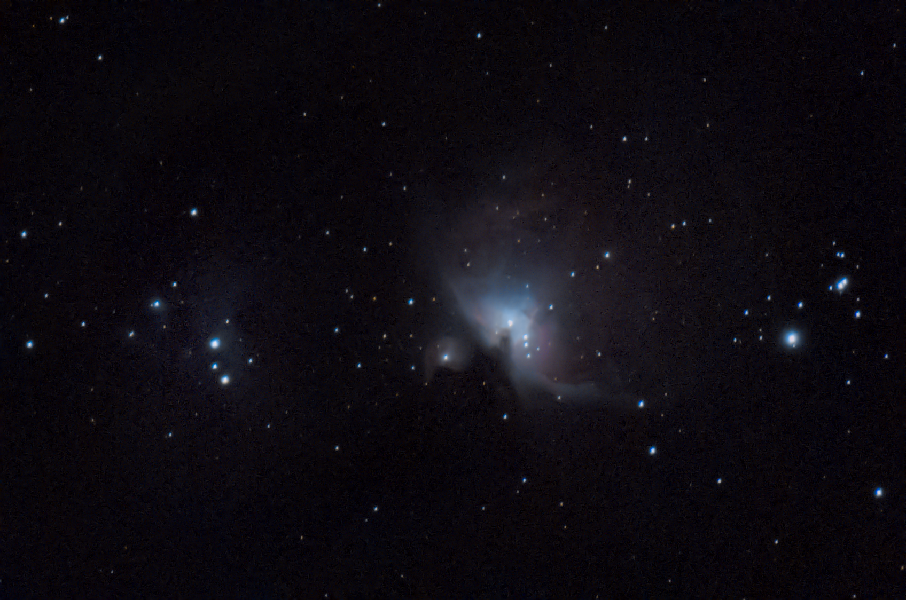

# 深空影集

## M42

深空三俗之一。亮，好拍，不容易拍好。

### 2026 年 1 月 6 日

本次拍摄算是正式给整个相机-赤道仪系统开光了。

拍摄地点在信息学部操场，光污染地图显示波特尔九级光害，实测肉眼能看到的最暗星都亮于 1 等，感觉光害都爆表了。本次拍摄仅作测试用。参数：

- 亮场 18 张 累计 9min 曝光，iso = 400，暗场 = 1/2 亮场，另有平场偏置场若干。
- 使用 Nikon Z30 与 Nikkor Z DX 50-250mm f4.5-6.3 镜头的 250mm 端
- 小然赤道仪，使用我写的盲对极轴工具快速对极轴，后续未精调，精度已经够用。

本次拍摄闹了个小乌龙，就是相机快装板的螺丝没有锁紧导致相机往下掉，头几张拉线严重。我差点以为我的对极轴工具出问题了。不过这次拍摄算是完整走了一遍搭器材——拍摄——后期的流程。虽然结果一般，但是至少验证了整个系统对深空拍摄的可行性。

### 2026 年 1 月 9 日

（一些不同风味的后期）

拍摄参数同上，但是累计 1h。

能堆栈出比较暗的云气细节，但是没有改机因此红色的Hα没有怎么显现。同时背景噪点也比较重。感觉可能是偏置场和暗场没有拍好，以及堆栈时间还是太短了。

能检测到的背景最暗的星等是 15.07，也就是说面亮度高于此的都可以进行拍摄。
