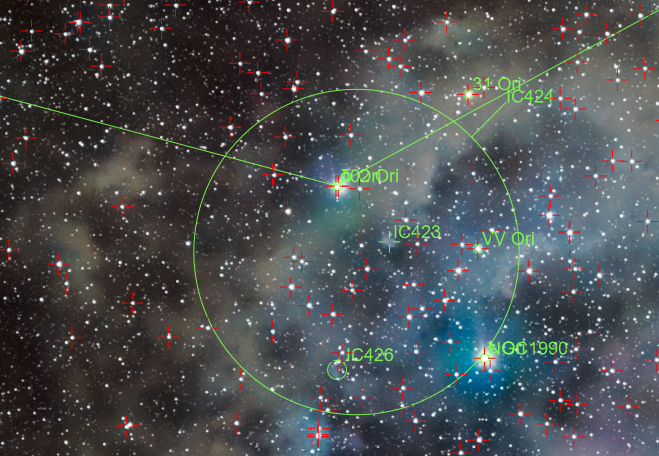

# 深空影集

## M42

深空三俗之一。亮，好拍，不容易拍好。

### 2026 年 1 月 6 日

本次拍摄算是正式给整个相机-赤道仪系统开光了。

拍摄地点在信息学部操场，光污染地图显示波特尔九级光害，实测肉眼能看到的最暗星都亮于 1 等，感觉光害都爆表了。本次拍摄仅作测试用。参数：

- 亮场 18 张 累计 9min 曝光，iso = 400，暗场 = 1/2 亮场，另有平场偏置场若干。
- 使用 Nikon Z30 与 Nikkor Z DX 50-250mm f4.5-6.3 镜头的 250mm 端
- 小然赤道仪，使用我写的盲对极轴工具快速对极轴，后续未精调，精度已经够用。

本次拍摄闹了个小乌龙，就是相机快装板的螺丝没有锁紧导致相机往下掉，头几张拉线严重。我差点以为我的对极轴工具出问题了。不过这次拍摄算是完整走了一遍搭器材——拍摄——后期的流程。虽然结果一般，但是至少验证了整个系统对深空拍摄的可行性。

### 2026 年 1 月 9 日

（一些不同风味的后期）

拍摄参数同上，但是累计 1h。

能堆栈出比较暗的云气细节，但是没有改机因此红色的Hα没有怎么显现。同时背景噪点也比较重。感觉可能是偏置场和暗场没有拍好，以及堆栈时间还是太短了。

### 2026 年 1 月 10 日

晚上拍废了很多，因为镜头起雾了。看来除雾带确实是必要的。

学习了使用 siril 进行多夜晚图像叠加的操作。简单说就是把各晚上的数据分别进行归一化之后再将输出的 pp_lights_*.fit 文件进行叠加。上面这张是前面几次拍摄的叠加，一共的曝光时间是 5850s。看起来云气的细节都保留了很多啊。看有没有时间把它整合成一个单独的siril脚本。

### 2026 年 1 月 11 日

现在总积分时间来到 2h。SNR 进一步提高。

还有一个小惊喜就是在去除光污染之后拍到了 IC 434 的暗红色云气，这意味着后续打野目标+1。虽然在九级区我预计可能需要10+h的累计积分时间，但是在寒假我可以积极对其进行拍摄。

### 2026 年 1 月 13 日

总积分时间突破 2.5h。 IC 434 的红色已经比较明显，虽然彗差毁了一切。

另一个小惊喜是拍到了 NGC 1924。以后当有人问我这一套系统能拍多远，我将会回答：1.3亿光年。

看一月下旬天气，如果可以的话，我会用唯卓仕那颗 56mm 镜头拍摄猎户座广域，看看能不能拉出分子云复合体的细节。

现在认为使用每一晚图片自己对齐，再对每一晚图片做对齐是不可行的，因为 Siril 在堆栈时，会参考最锐利的图像做对齐，而堆栈后就星点这些就变大甚至对不齐了，效果很不好，倒不是因为做强度归一化麻烦。此外还得补拍其他三个场，感觉素材不够，出彩色条纹了。

后面抽时间学习一下 StarNet 和 PI，看看有没有其他处理方式。

而且现在我感觉不改机也能拍发射星云，就是效率低罢了。实在不行用更快的镜头算了。

### 2026 年 1 月 14 日

现在积分时间达到 3.525h，NGC 1977 中央的红色终于能堆出来了。

SNR 提升最明显的感受就是每一次不用像上次一样通过暴力拉伸就能获得相同的对比度。

补拍平场感觉对彩条抑制有改善，但是感觉改善又没那么大。

用 GraXpert 的 AI 降噪功能做了下去噪，效果感觉不错。

另外刷小红书的时候看到有人说这个黑斑和彩条是机内矫正导致的，下次关了之后再试试。

### 2026 年 1 月 23 日

来到了扎西宗乡，绝妙的二级光污染区。镜头上我选用了 Viltrox 56mm f1.7 Z Air 镜头。更低的光污染、更高的海拔带来的视宁度提升加上更快的镜头带来了巨大的 SNR 提升。这就展示了丰富的猎户座分子云复合体。让我们看看局部：

M42 附近，过曝比较严重，不过宽容度是足够的，因为相对的动态范围比较大导致这里细节缺失比较严重……

M78 附近，暗云气细节很丰富。

IC 434 附近。

参宿二星云和一些明显的小星云。

女巫头星云 IC 2118 非常明显。

在巴纳德环上的星团 NGC 2112，由于我在后期时做了消星导致成片里面这个星团不明显，但是在 starmask 里面能够很清楚看到这一个亮区。

## M45

深空三俗之一。

### 2026 年 1 月 21 日

在拉萨简单拍摄的昴星团。这次把矫正关完了，感觉效果好一些。

高原稀薄的空气带来了绝佳的视宁度；干燥的大气使得北极星清晰可见。尽管如此，我将设备运输回来之后也遭遇了一系列乌龙，先是赤快装板没有锁紧，然后对极轴工具出现问题，最后发现赤道仪在运输的碰撞中调成了南半球模式……不过好在问题一一解决，我用短曝光拍摄了多张图像，堆叠过程中星点圆度也非常高。