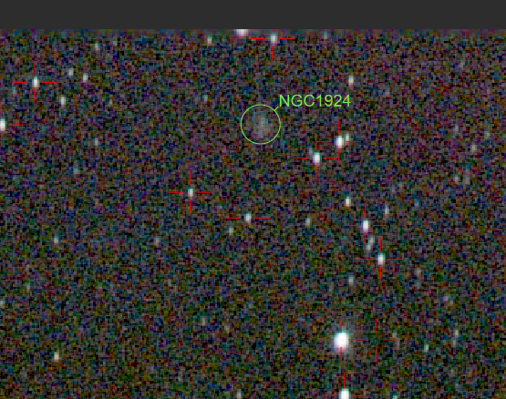

# 深空影集

## M42

深空三俗之一。亮，好拍，不容易拍好。

### 2026 年 1 月 6 日

本次拍摄算是正式给整个相机-赤道仪系统开光了。

拍摄地点在信息学部操场，光污染地图显示波特尔九级光害，实测肉眼能看到的最暗星都亮于 1 等，感觉光害都爆表了。本次拍摄仅作测试用。参数：

- 亮场 18 张 累计 9min 曝光，iso = 400，暗场 = 1/2 亮场，另有平场偏置场若干。
- 使用 Nikon Z30 与 Nikkor Z DX 50-250mm f4.5-6.3 镜头的 250mm 端
- 小然赤道仪，使用我写的盲对极轴工具快速对极轴，后续未精调，精度已经够用。

本次拍摄闹了个小乌龙，就是相机快装板的螺丝没有锁紧导致相机往下掉，头几张拉线严重。我差点以为我的对极轴工具出问题了。不过这次拍摄算是完整走了一遍搭器材——拍摄——后期的流程。虽然结果一般，但是至少验证了整个系统对深空拍摄的可行性。

### 2026 年 1 月 9 日

（一些不同风味的后期）

拍摄参数同上，但是累计 1h。

能堆栈出比较暗的云气细节，但是没有改机因此红色的Hα没有怎么显现。同时背景噪点也比较重。感觉可能是偏置场和暗场没有拍好，以及堆栈时间还是太短了。

能检测到的背景最暗的星等是 15.07，也就是说面亮度高于此的都可以进行拍摄。

### 2026 年 1 月 10 日

晚上拍废了很多，因为镜头起雾了。看来除雾带确实是必要的。

学习了使用 siril 进行多夜晚图像叠加的操作。简单说就是把各晚上的数据分别进行归一化之后再将输出的 pp_lights_*.fit 文件进行叠加。上面这张是前面几次拍摄的叠加，一共的曝光时间是 5850s。看起来云气的细节都保留了很多啊。看有没有时间把它整合成一个单独的siril脚本。

### 2026 年 1 月 11 日

现在总积分时间来到 2h。SNR 进一步提高。

还有一个小惊喜就是在去除光污染之后拍到了 IC 434 的暗红色云气，这意味着后续打野目标+1。虽然在九级区我预计可能需要10+h的累计积分时间，但是在寒假我可以积极对其进行拍摄。

### 2026 年 1 月 13 日

总积分时间突破 2.5h。 IC 434 的红色已经比较明显，虽然彗差毁了一切。

另一个小惊喜是拍到了 NGC 1924。以后当有人问我这一套系统能拍多远，我将会回答：1.3亿光年。

看一月下旬天气，如果可以的话，我会用唯卓仕那颗 56mm 镜头拍摄猎户座广域，看看能不能拉出分子云复合体的细节。

现在认为使用每一晚图片自己对齐，再对每一晚图片做对齐是不可行的，因为 Siril 在堆栈时，会参考最锐利的图像做对齐，而堆栈后就星点这些就变大甚至对不齐了，效果很不好，倒不是因为做强度归一化麻烦。此外还得补拍其他三个场，感觉素材不够，出彩色条纹了。

后面抽时间学习一下 StarNet 和 PixelInsight，看看有没有其他处理方式。

而且现在我感觉不改机也能拍发射星云，就是效率低罢了。实在不行用更快的镜头算了。
