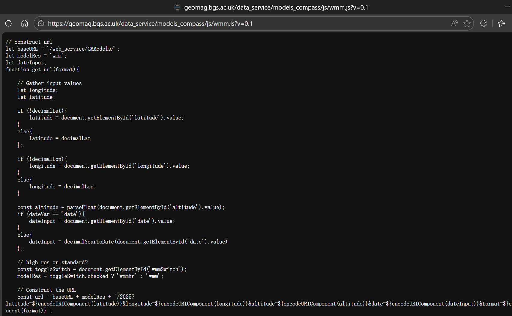

# 看不见北极星怎么办

> 本文介绍一种非常简单快速的盲对极轴方法。

## 原理

对极轴的原理很简单，只需要让赤道仪的旋转轴和地球的自转轴平行即可。理论上我们需要粗略地让赤道仪指向北极星那一片天空，然后再慢慢调整俯仰角和方位角，甚至还需要借助极轴镜，直到赤道仪的转轴延长线指向真正的北天极。

但是我们经常会遇到一个问题，要么就是北极星的地方有点云被挡了，要么就是被山或者建筑物挡了，或者就是光污染太强导致肉眼看不到北极星……不管怎么样，反正你就是看不到北极星了。

但是看不到北极星不代表找不到北天极。我们考虑我们在地球上这一点的切平面，也就是重力对应的法平面，在这个平面上取正北方向的向量，不就正好是和地球自转轴平行了吗？

这就是一个很经典的结论：北天极的方位是正北方，俯仰角和当地纬度是一致的。

于是现在问题就变成了：

- 如何将俯仰角调到和当地纬度一致
- 如何确定正北方（真北）

解决这两个问题的方法很简单，不需要额外的工具，只需要一台能接受 GPS 信号，并且连上网的手机。（如果你提前知道拍摄地点的话那这两者也可以不需要了）

### 调整俯仰角

我们知道手机有加速度计，这个加速度计可以测量三个维度方向受到的加速度。当我们把手机平放在桌面上时，一般而言手机受到的重力加速度是垂直向下的，也就是说 z 轴有一个负的 g 值。

如果我们俯仰手机，那么这个加速度就会在手机的 yz 轴上留下投影，把投影的数值相除再反正切，就可以计算出俯仰角了。

这就是用手机测量俯仰角的原理，也是手机水平仪的原理。但是现在手机的摄像头模组都有突出的部分，所以平放的时候，手机本身其实是倾斜的。

为了解决这个问题，我们可以采取两个方案：可以在平地先做一个归零操作，用来抵消摄像头模组突出带来的影响；或者我们换一个平整的面来测量。

这两者实现也都不难。

现在我们就可以把手机按稳在纬度调节座上，看手机显示的俯仰角和当前纬度是否一致了。或者如果预知拍摄地点的话，就可以提前进行纬度调节。

### 调整方位角

调整方位角就不一样了，需要现场调节。

我们知道手机有指南针，尤其是 iOS 的手机指南针可以在设置里面调整，使其指向正北方。因为一般手机的指南针是通过磁力计来测量地磁从而确定南北的，但这样测量到的是磁北极而不是真北极。

更何况我用的还是 Android 手机呢……我们需要一个安卓的确定真北的方法。

回忆中学物理教材，里面提到有个叫沈约的人发现了磁偏角，这个夹角就是磁北极和真北极的夹角。也就是说如果我们获得了当地的磁偏角，并且用它来修正手机指南针的结果不就行了！

由于地磁情况复杂，我们需要一个模型来进行磁偏角的计算，这个模型叫做 WMM，世界地磁模型。我们不必手动进行计算，因为很多气象局等机构都提供在线的计算器，只需提供经纬度、海拔和日期就可以计算出磁偏角。

当然我不想搞这么复杂，于是我简单翻了一下[英国地质调查局](https://geomag.bgs.ac.uk/)的这个[磁偏角计算器](https://geomag.bgs.ac.uk/data_service/models_compass/wmm_calc.html)，简单翻了一下源代码，找到了这个：

当时我的本意是找一下这个模型的参数，结果点进去这个 js 一看：

也就是说直接给这个网址发 GET 请求就可以了，甚至连鉴权都没有。

那我还能说什么呢，感谢 BGS 的程序员老哥哦~

所以我们只需要写一个网页来调取磁力计数据，确定磁北，然后再利用这个 API 获取当地目前的磁偏角即可！

## 使用

基于上面的原理，我们就可以写两个网页来辅助我们盲对极轴了~

为什么采用网页形式呢？因为刚好就部署在我的博客上，我自己需要的时候也方便找。

当然网页本体是 Gemini 帮我写的，放在下面：

[方位调节工具](https://dicaeopolis.github.io/astronomy/%E6%96%B9%E4%BD%8D%E8%B0%83%E8%8A%82/)

[纬度调节工具](https://dicaeopolis.github.io/astronomy/%E7%BA%AC%E5%BA%A6%E8%B0%83%E8%8A%82/)

都按指示手机紧贴赤道仪即可，这种方式尤其适合整体呈方形的赤道仪。

## 效果

我用 250mm 镜头（等效全画幅 375mm）跟踪的结果如下，目标是木星：

当晚的星图：

对比（我把星图反色了然后做了一个减淡叠加）：

可以看到 30s 不拉线是非常轻松了。后续也可能进行更长时间的测试。
