# 《离散数学》课程作业与笔记归档

供存档和复习用。

## 第一次作业

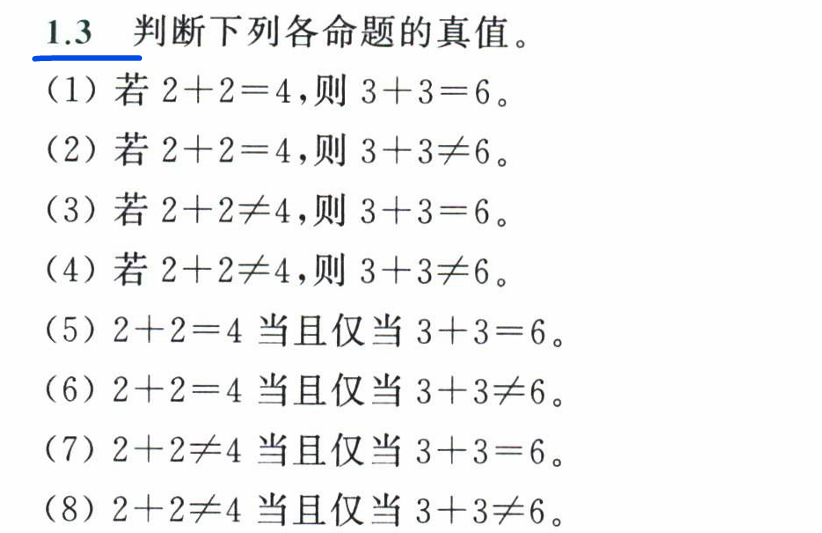

记 2 + 2 = 4 为 p，3 + 3 = 6 为 q。

- (1) $p\rightarrow q$, 真
- (2) $p\rightarrow \neg q$，假
- (3) $\neg p\rightarrow q$，真
- (4) $\neg p\rightarrow \neg q$，真
- (5) $p\leftrightarrow q$，真
- (6) $p\leftrightarrow \neg q$，假
- (7) $\neg p\leftrightarrow q$，假
- (8) $\neg p\leftrightarrow \neg q$，真

其实就是考察两个联结词的真值表。

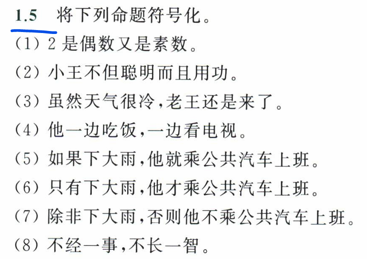

- (1) 记 “2 是偶数” 为 p，记 “2 是素数” 为 q，则命题符号化为 $p\land q$
- (2) 记 “小王聪明” 为 p，记 “小王用功” 为 q，则命题符号化为 $p\land q$
- (3) 记 “天气很冷” 为 p，记 “老王来了” 为 q，则命题符号化为 $p\land q$
- (4) 记 “他吃饭” 为 p，记 “他看电视” 为 q，则命题符号化为 $p\land q$
- (5) 记 “下大雨” 为 p，记 “他乘公共汽车上班” 为 q，则命题符号化为 $p\rightarrow q$
- (6) 记 “下大雨” 为 p，记 “他乘公共汽车上班” 为 q，则命题符号化为 $q\rightarrow p$
- (7) 记 “下大雨” 为 p，记 “他乘公共汽车上班” 为 q，则命题符号化为 $q\rightarrow p$
- (8) 记 “经一事” 为 p，记 “长一智” 为 q，则命题符号化为 $q\rightarrow p$

不……不 = 出发……否则不 = 只有……才

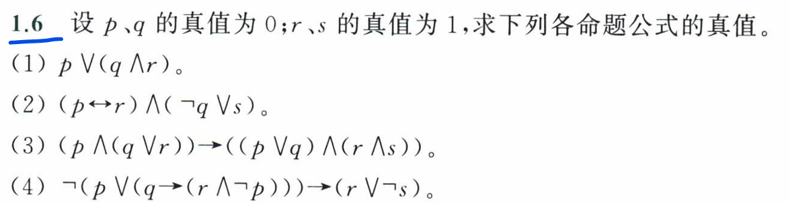

- (1) $p\lor (q\land r)=0\lor (0\land 1)=0$
- (2) $(p\leftrightarrow r)\land (\neg q\lor s)=(0\leftrightarrow 1)\land (\neg q\lor s)=0$ 这里可以直接利用 $\land$ 的短路特性
- (3) $(p\land (q\lor r))\rightarrow ((p\lor q)\land(r\land s))=(0\land (0\lor 1))\rightarrow ((0\lor 0)\land(1\land 1))=1$ 同样是利用蕴含符号左边 $\land$ 的短路特性得到那一坨是 $0$ 然后再利用蕴含符号本身的短路特性得到结果
- (4) $\neg (p\lor (q\rightarrow (r\land \neg p)))\rightarrow (r\lor \neg s)=\neg (0\lor (0\rightarrow (r\land \neg p)))\rightarrow (1\lor \neg 1)=1\rightarrow 1=1$

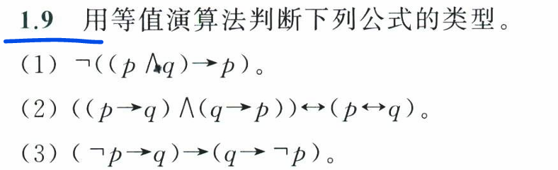

- (1) $\neg((p \land q) \to p)=\neg (\neg (p \land q)\lor p)=(p \land q)\land \neg p=q\land( p\land\neg p)=0$ 为矛盾式。
- (2) $((p \to q) \land (q \to p)) \leftrightarrow (p \leftrightarrow q)=(p \leftrightarrow q)\leftrightarrow(p \leftrightarrow q)=1$ 为重言式。
- (3) $(\neg p \to q) \to (q \to \neg p)=(\neg(\neg p) \lor q)\to (\neg q \lor \neg p)$
$=(p \lor q)\to \neg(q \land p)=\neg(p \lor q)\lor \neg(q \land p)=\neg(p \lor q\land q \land p)=\neg(p\land q)$ 为可满足式。

## 第二次作业

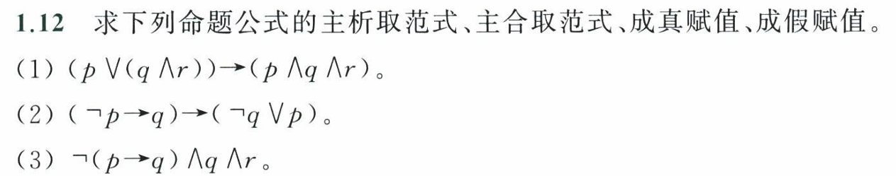

(1)
主析取范式：

$$
\begin{align*}
    (p\lor(q\land r))\to (p\land q\land r)&\Leftrightarrow \neg(p\lor(q\land r))\lor (p\land q\land r)\\
    &\Leftrightarrow(\neg p \land (\neg q\lor \neg r))\lor (p\land q\land r)\\
    &\Leftrightarrow(\neg p\neg q(r\lor\neg r)\lor\neg p\neg r(q\lor\neg q))\lor(pqr)\\
    &\Leftrightarrow(\neg p\land \neg q\land r)\lor(\neg p\land \neg q\land \neg r)\lor(\neg p\land q\land \neg r)\lor (p\land q\land r)
\end{align*}
$$

由此得到成真赋值和成假赋值：

$$
pqr_{\mathrm{成真赋值}} = \{000, 001, 010, 111\}\\
pqr_{\mathrm{成假赋值}} = \{011, 100, 101, 110\}
$$

主合取范式可由成假赋值直接得到：

$$
(p\lor(q\land r))\to (p\land q\land r)\Leftrightarrow(\neg p\lor q\lor r)\land(p\lor \neg q\land \neg r)\land(p\lor \neg q\lor r)\land (p\lor q\lor \neg r)
$$

(2)
主析取范式：

$$
\begin{align*}
    (\neg p\to q)\to(\neg q\lor p)&\Leftrightarrow\neg(p\lor q)\lor(\neg q\lor p)\\
    &\Leftrightarrow(\neg p\land \neg q)\lor(\neg q\lor p)\\
    &\Leftrightarrow(\neg p\land \neg q)\lor(\neg q\land(p\lor \neg p)\lor p\land(q\lor \neg q))\\
    &\Leftrightarrow(\neg p\land \neg q)\lor(p\land \neg q)\lor(p\land q)
\end{align*}
$$

由此得到成真赋值和成假赋值：

$$
pq_{\mathrm{成真赋值}} = \{00,10,11\}\\
pq_{\mathrm{成假赋值}} = \{01\}
$$

主合取范式可由成假赋值直接得到：

$$
(\neg p\to q)\to(\neg q\lor p)\Leftrightarrow p\land\neg q
$$

(3)
主析取范式：

$$
\begin{align*}
    \neg (p\to q)\land q\land r&\Leftrightarrow \neg (\neg p\lor q)\land q\land r\\
    &\Leftrightarrow(p\land \neg q)\land q\land r\\
    &\Leftrightarrow0
\end{align*}
$$

由此得到成真赋值和成假赋值：

$$
pq_{\mathrm{成真赋值}} = \{\}\\
pq_{\mathrm{成假赋值}} = \{000,001,010,011,100,101,110,111\}
$$

主合取范式可由成假赋值直接得到：

$$
\neg (p\to q)\land q\land r\Leftrightarrow\\
(p \lor q \lor r) \land (p \lor q \lor \neg r) \land (p \lor \neg q \lor r) \land (p \lor \neg q \lor \neg r) \land (\neg p \lor q \lor r) \land (\neg p \lor q \lor \neg r) \land (\neg p \lor \neg q \lor r) \land (\neg p \lor \neg q \lor \neg r)
$$

## 第三次作业

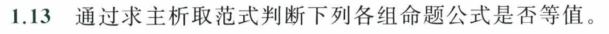

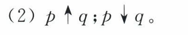

$$
\begin{align*}
    p\uparrow q &\iff \neg(p\land q)\\
    &\iff \neg p \lor \neg q\\
    &\iff \neg p(q\lor\neg q)\lor \neg q(p\lor \neg p)\\
    &\iff (\neg p\land q) \lor (p\land\neg q) \lor (\neg p\land\neg q)
\end{align*}
$$

$$
\begin{align*}
    p\downarrow q &\iff \neg(p\lor q)\\
    &\iff \neg p \land \neg q\\
    &\iff \neg p(q\lor\neg q)\land \neg q\\
    &\iff (\neg p\land \neg q)
\end{align*}
$$

因此不等值。

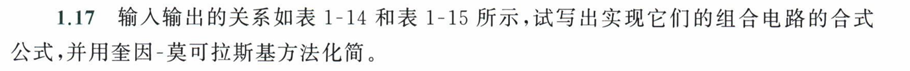

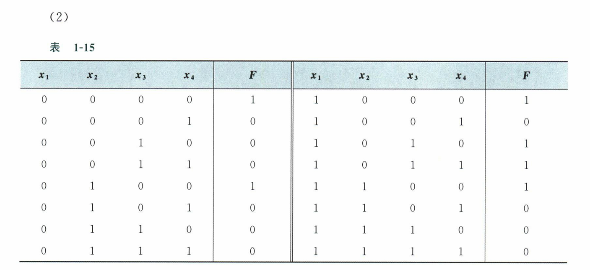

直接求成真赋值：


化简：

首先分组，然后进行合并：

- 0 个 1: 0000
- 1 个 1: 1000, 0100 => -000, 0-00 => 0-00
- 2 个 1: 1010, 1100 => 10-0, -100 => 10-0, --00
- 3 个 1: 1011 => 101-

这样得到了主蕴含项，然后列覆盖表：

```text
     0 4 8 10 11 12
0-00 x x
10-0     x x  
--00 x x x       x
101-       x  x
```

可见 --00 + 101- 可以完全覆盖，因此化简得到

$$
\begin{align*}
    F=&\quad (\neg x_1\land\neg x_2\land\neg x_3\land\neg x_4)\\
    &\lor (\neg x_1\land x_2\land\neg x_3\land\neg x_4)\\
    &\lor ( x_1\land\neg x_2\land\neg x_3\land\neg x_4)\\
    &\lor (x_1\land \neg x_2\land x_3\land \neg x_4)\\
    &\lor ( x_1\land\neg x_2\land x_3\land x_4)\\
    &\lor (x_1\land x_2\land\neg x_3\land\neg x_4)\\
    =&\quad (\neg x_3\land \neg x_4)\lor(x_1\land \neg x_2\land x_3)
\end{align*}
$$

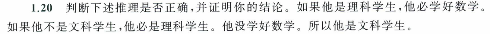

Notation:

$L$：他是理科学生；$S$：他学好数学；$W$：他是文科学生。

推理即：

$$
\begin{align*}
    (L\to S)\land(\neg W\to L)\land(\neg S)\to(W)&\iff (\neg L\lor S)\land(W\lor L)\land(\neg S)\to(W)\\
    &\iff (\neg L)\land (W\lor L)\to W\\
    &\iff W\to W
\end{align*}
$$

为重言式，因此推理正确。

## 第四次作业

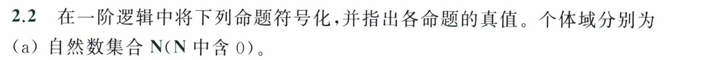

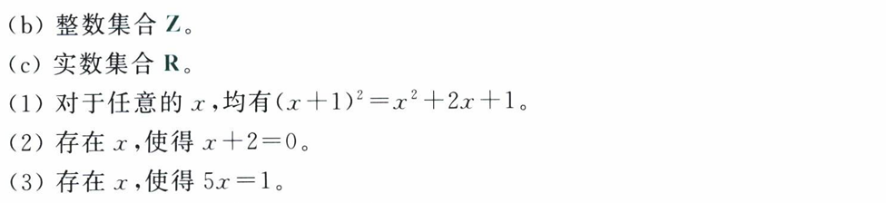

Notations:

$F(x):=(x+1)^2=x^2+2x+1$，$G(x):=x+2=0$，$H(x):=5x=1$

(1)

$$
\forall x F(x)
$$

在 (a), (b), (c) 中都为真。

(2)

$$
\exists xG(x)
$$

在 (a) 中为假，在 (b), (c) 中为真。

(3)

$$
\exists xH(x)
$$

在 (a), (b) 中为假，在 (c) 中为真。

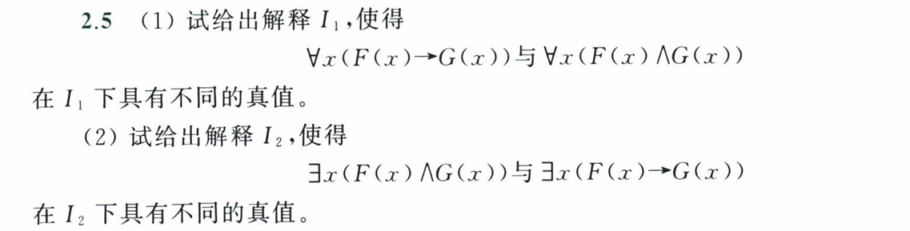

(1)

我们知道假命题蕴含真命题为真但是假命题合取真命题结果为假，因此我们可以构造 $I_1$ 如下：

- 个体域：$\{0\}$
- 谓词 $F(0)=0, G(0)=1$

这样两个式子就变成了

$F(0)\to G(0)=1$ 和 $F(0)\land G(0)=0$ 是具有不同的真值。

(2)

易得 $I_1$ 也满足 (2) 的条件，直接可以当成 $I_2$：

- 个体域：$\{0\}$
- 谓词 $F(0)=0, G(0)=1$

这样两个式子就变成了

$F(0)\to G(0)=1$ 和 $F(0)\land G(0)=0$ 是具有不同的真值。

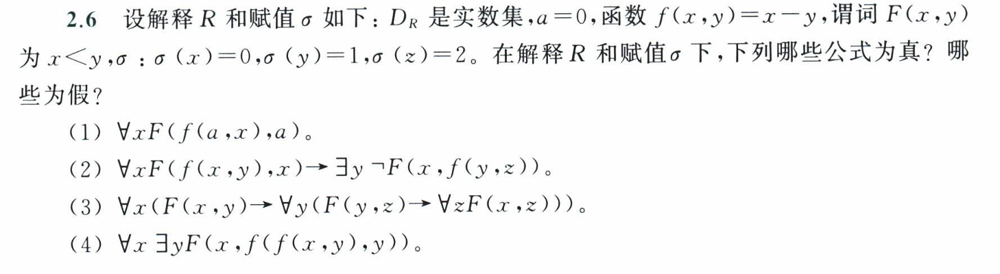

(1)

$$
\begin{align*}
    \forall xF(f(a,x),a)&\iff \forall x(a-x <a)\\
    &\iff \forall x(x>0)\\
    &\iff 0>0\\
    &\iff 0
\end{align*}
$$

(2)

$$
\begin{align*}
    \forall xF(f(x,y),x)\to\exists y\neg F(x,f(y,z))&\iff \forall x(x-y<x)\to\exists y\neg (x<y-z)\\
    &\iff y>0 \to \exists y\neg(0<y-2)\\
    &\iff 1\to 1\quad (y=1)\\
    &\iff 1
\end{align*}
$$

(3)

$$
\begin{align*}
    \forall x(F(x,y)\to\forall y(F(y,z)\to\forall zF(x,z)))&\iff \forall x((x<y)\to\forall y((y<z)\to\forall z(x<z)))\\
    &\iff \forall x((x<y)\to\forall y((y<z)\to 0))\\
    &\iff \forall x((x<y)\to 0)\\
    &\iff 0
\end{align*}
$$

(4)

$$
\begin{align*}
    \forall x\exists yF(x,f(f(x,y),y))&\iff\forall x\exists y(x<x-y-y)\\
    &\iff\forall x\exists y(y<0)\\
    &\iff\forall x 1\\
    &\iff 1
\end{align*}
$$

## 第五次作业

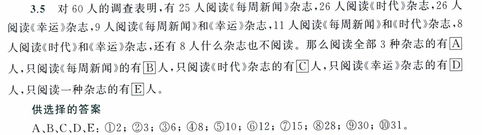

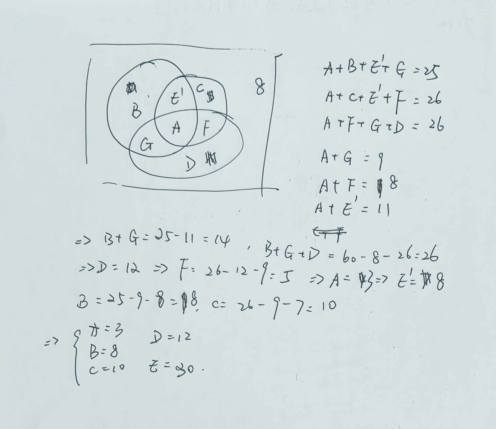

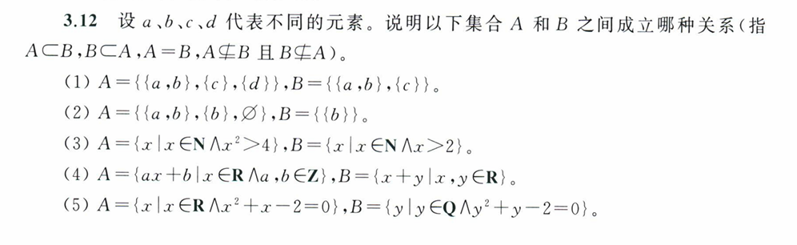


(1) (2) $B\subset A$

(3) $A=B$

(4) $A=B=\mathbb{R}$，取 $a=1,b=0,y=0$ 即可。

(5) $B=A$ 因为解是有理数

(6) $B=\{1,0.5\}$ 因此 $B\subset A$

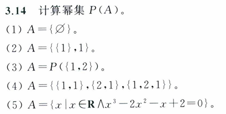

(1) $\{\varnothing,\{\varnothing\}\}$

(2) $\{\varnothing,1,\{1\},\{1,\{1\}\}\}$

(3) $\{\varnothing,P(\{1,2\})\}=\{\varnothing,\{\varnothing,1,2,\{1,2\}\}\}$

(4) $\{\varnothing,\{1,1\},\{2,1\},\{1,2,1\},\{\{1,1\},\{2,1\}\},\{\{2,1\},\{1,2,1\}\},\{\{1,1\},\{1,2,1\}\},\{\{1,1\},\{2,1\},\{1,2,1\}\}\}$

然后我们进行同一元素的归并： $\{\varnothing,\{1\},\{2,1\},\{\{1\},\{2,1\}\},\{\{1\},\{2,1\}\}\}$

(5) $A=\{1,-1,2\}$

幂集为：

$$
\{\varnothing,1,-1,2,\{1,-1\},\{1,2\},\{-1,2\},\{1,-1,2\}\}
$$

## 第六次作业

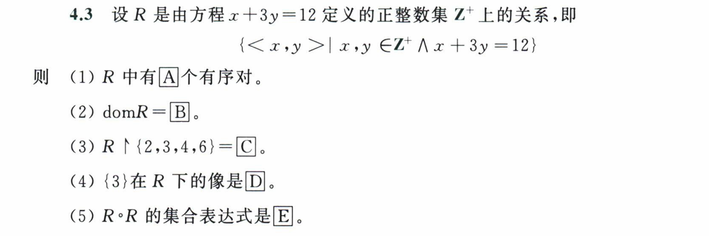

(1) 我们可以直接解这个方程得到：

|x|y|
|-|-|
|3|3|
|6|2|
|9|1|

共 3 个有序对。

(2) $\mathrm{dom}R=\{3,6,9\}$

(3) $R \upharpoonright\{2,3,4,6\}=\{<3,3>,<6,2>\}$

(4) 注意是集合。 $\{3\}$

(5) 只有 $3$ 既在值域也在定义域里面，因此得到 $\{<3,3>\}$

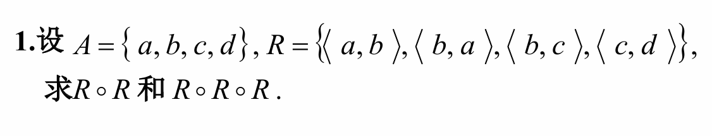

先把 $R$ 写成矩阵：

$$
\left[
\begin{matrix}
    0&1&0&0\\
    1&0&1&0\\
    0&0&0&1\\
    0&0&0&0\\
\end{matrix}
\right]
$$

然后 `np.matmul` 即可解决：

$$
R\circ R=\left[
\begin{matrix}
    1&0&1&0\\
    0&1&0&1\\
    0&0&0&0\\
    0&0&0&0\\
\end{matrix}
\right]
$$

以及

$$
R\circ R\circ R=\left[
\begin{matrix}
    0&1&0&1\\
    1&0&1&0\\
    0&0&0&0\\
    0&0&0&0\\
\end{matrix}
\right]
$$

## 第七次作业


$$
R_1=\left[
\begin{matrix}
    1&1&0\\
    1&1&1\\
    1&0&1\\
\end{matrix}
\right]
$$

自反的，选择 4.

$$
R_2=\left[
\begin{matrix}
    1&0&1\\
    1&1&0\\
    0&1&0\\
\end{matrix}
\right]
$$

反对称的，选择 8.

$$
R_3=\left[
\begin{matrix}
    0&1&0\\
    1&0&1\\
    0&1&0\\
\end{matrix}
\right]
$$

对称的，反自反的，选择 9.

$$
R_4=\left[
\begin{matrix}
    1&1&0\\
    0&0&0\\
    0&0&0\\
\end{matrix}
\right]
$$

反对称的，传递的，选择 5.

$$
R_5=I_3
$$

恒等满足 10.

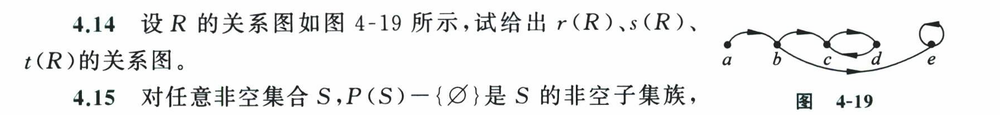


## 第八次作业


极小元 = 最小元 = 1，极大元 = 最大元 = 24


极小元 = 最小元 = 1，极大元 = 8,6,9,5,7，无最大元。


(1)

$$
f(x):A\rightarrow B=2^x\quad f^{-1}(y):B\rightarrow A=\log_2 y
$$

(2)

$$
f(x):A\rightarrow B=\dfrac{2}{\pi}x-2\quad f^{-1}(y):B\rightarrow A=\dfrac{\pi}{2}(y+2)
$$

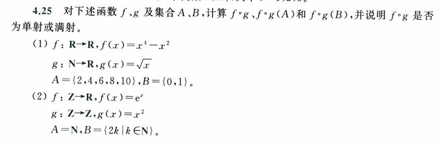

(1)

$$
f\circ g:\mathbb{N}\rightarrow\mathbb{R}=x^2-x
$$

$$
f\circ g(A)=\{2,12,30,56,90\}\quad f\circ g(B)=\{0\}
$$

由于 $\mathbb{R}$ 的势大于 $\mathbb{N}$ 因此不是满射，因为 $B$ 中两个元素都被映射到了 $0$ 所以不是单射。

(2)

$$
f\circ g:\mathbb{Z}\rightarrow\mathbb{R}=\mathrm{e}^{x^2}
$$

$$
f\circ g(A) = \{\mathrm{e}^{n^2}|n\in \mathbb{N}\}\quad f\circ g(B) = \{\mathrm{e}^{4k^2}|k\in \mathbb{N}\}
$$

由于 $\mathbb{R}$ 的势大于 $\mathbb{Z}$ 因此不是满射，因为任意 $k,-k\in\mathbb{Z}$ 这两个元素都被映射到了 $\mathrm{e}^{k^2}$ 所以不是单射。

## 第九次作业


## 第十次作业


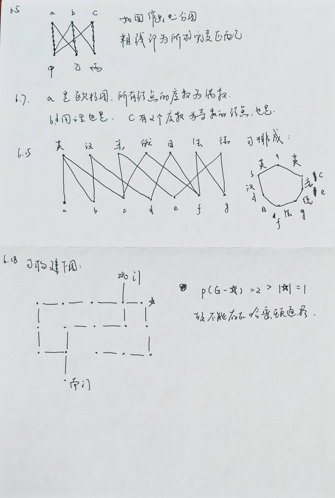

## 第十一次作业

