# 《概率论与数理统计》课程作业与笔记归档

供存档和复习用。

## 第一次作业


i. A, B 互不相容，即 AB 无交集，也就是 A 一定在 B 的补集里面。$P(A\bar B)=P(A)=1/2$

ii. 由 $P(A)=P(AB)+P(A\bar B)$ 可得 $P(A\bar B)=3/8$


11 取 7 排列，这个 7 字母词有两个 i 以及两个 b 可以互换都满足条件，所以

$$
P=\dfrac{2\times2}{A^7_{11}}=\dfrac{2\times2}{5\times6\times7\times8\times9\times10\times11}=\dfrac{1}{415800}
$$


我们分成四个区域


$$
P=\dfrac{B\cap (A\cup \bar B)}{A\cup \bar B}=\dfrac{\mathrm{II}}{\mathrm{I+II+IV}}=\dfrac{0.2}{0.5+0.2+0.1}=\dfrac{1}{4}
$$

## 第二次作业


(1)

第一次取分为两个步骤：选箱子+选零件。

$$
P(A)=\dfrac{1}{2}\times\dfrac{10}{50}+\dfrac{1}{2}\times\dfrac{18}{30}=\dfrac{2}{5}
$$

(2)

根据条件概率公式：

$$
P(B|A)=\dfrac{P(AB)}{P(A)}
$$

其中

$$
P(AB)=\dfrac{1}{2}\times\dfrac{10}{50}\times\dfrac{9}{49}+\dfrac{1}{2}\times\dfrac{18}{30}\times\dfrac{17}{29}=\dfrac{276}{1421}
$$

则

$$
P(B|A)=\dfrac{276}{1421}\times\dfrac{5}{2}=\dfrac{690}{1421}
$$


(1) 和 (2) 必然假。 $P(AB)=P(A)P(B)=0$ 与 $P(A)>0, P(B)>0$ 矛盾

(3) 必然假。 若 $B$ 与 $A$ 不相容则必然 $P(B)<1-P(A)$，这就矛盾。

(4) 可能对。考虑随机变量 $x$ 服从一个 $[0,1]$ 上的均匀分布。

成立的情形：

$$
P(A)=P(0<x<0.6)\\
P(B)=P(0.24<x<0.84)
$$

则 $P(AB)=P(A)P(B)=0.36$

不成立的情形：

$$
P(A)=P(0<x<0.6)\\
P(B)=P(0.4<x<1)
$$

则 $P(AB)=0.2\neq P(A)P(B)=0.36$


$$
P(B)=\underbrace{0.8\times(1-2\%)^3}_{P(BA_1)}+\underbrace{0.15\times(1-10\%)^3}_{P(BA_2)}+\underbrace{0.05\times(1-90\%)^3}_{P(BA_3)}=0.8623536\\
$$

拿 Python 算了一下数值解：

$$
\begin{align*}
    P(A_1|B)=\dfrac{P(BA_1)}{P(B)}&=0.8731378868250795\\
P(A_2|B)=\dfrac{P(BA_2)}{P(B)}&=0.12680413231880752\\
P(A_3|B)=\dfrac{P(BA_3)}{P(B)}&=0.00005798085611285204\\
\end{align*}
$$

什么是随机变量：如果一个变量 $x$ 在每一次观测时的值不能被完全先验地确定则称其为一个随机变量。

## 第三次作业

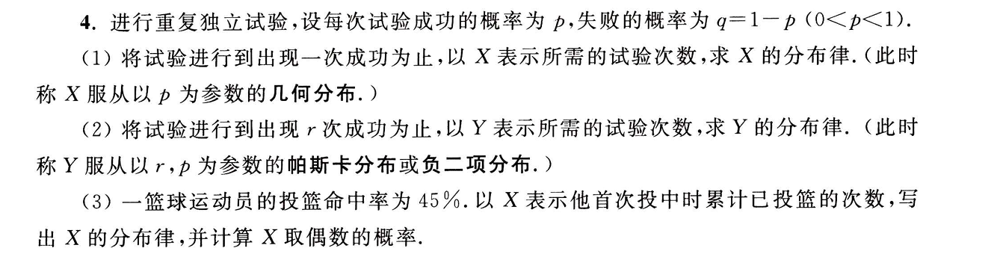

(1)

$$
X\sim Ge(p)\Leftrightarrow P(X=n)=p(1-p)^{n-1}
$$

也就是在前 $n-1$ 次尝试都失败了，最后一次成功就收手。

(2)

$$
P(X=n)=C_{n-1}^{r-1} p^r(1-p)^{n-r}
$$

最后一次尝试必须成功然后收手，前面的 $n-1$ 次尝试里面可以任意安排 $r-1$ 次成功尝试的位置。

(3)

和 (1) 一样的几何分布。

$$
P(X=n) = p(1-p)^{n-1}
$$

由此

$$
\begin{align*}
    P(x\in\mathrm{Even.})&=\sum_{i=1}^\infty P(X=2i)\\
    &=p[(1-p)^1+(1-p)^3+\cdots]\\
    &=p\times\dfrac{1-p}{1-(1-p)^2}\\
    &=\dfrac{1-p}{2-p}
\end{align*}
$$

带入即可得到值为 $0.3548387096774194$

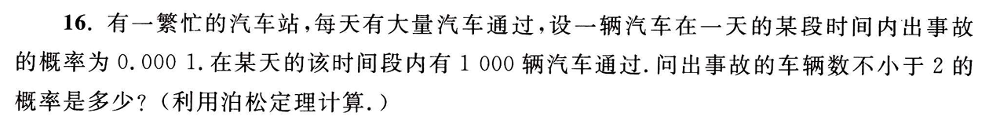

题目是要让我们用泊松分布近似二项分布。出事故的车辆数 $X$ 满足：

$$
X\sim B(1000,0.0001)
$$

近似即

$$
X\sim Po(0.1)
$$

由泊松分布公式：$P(x=k) =\dfrac{\lambda^k\mathrm{e}^{-\lambda}}{k!}$ 可得：

$$
\begin{align*}
    P(X\ge 2)&=1-P(x=1)-P(x=0)\\
    &=1-\dfrac{0.1^1\exp(-0.1)}{1!}-\dfrac{0.1^0\exp(-0.1)}{0!}\\
    &=1-1.1\exp(-0.1)\\
    &=0.00467884016044440
\end{align*}
$$

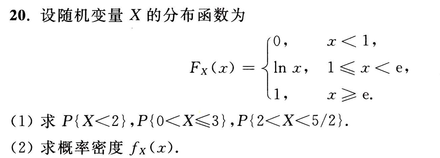

(1)

根据定义：

$$
\begin{align*}
    P(x<2)&=F(2)=\ln 2\\
    P(0<x\le 3)&=F(3)-F(0)=1\\
    P(2<x<5/2)&=F(5/2)-F(2)=\ln 5-2\ln 2
\end{align*}
$$

(2)

直接求导即可：

$$
f(x)=
\begin{cases}
    0,&x<1,x\ge \mathrm{e}\\
    \dfrac{1}{x},&1\le x<\mathrm{e}\\
\end{cases}
$$

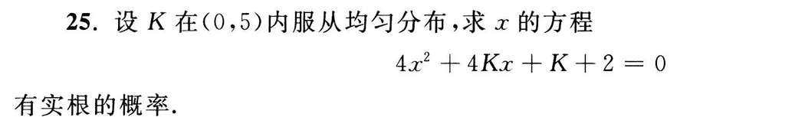

几何概型。成立的事件域为：

$$
\begin{align*}
    (4K)^2-4\times4\times(K+2)\ge 0&\iff K^2-K-2\ge 0\\
    &\iff (K-2)(K+1)\ge 0\\
    &\iff K\in (2,5)
\end{align*}
$$

因此 $P=3/5$

## 第四次作业

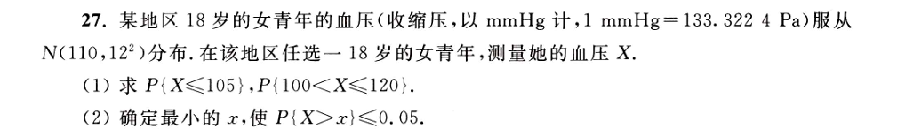

我们直接写程序计算即可：

```python
from scipy import stats

# X~N(a,b^2) P(X in (M, N))
def Gaussian_prob(a, b, M, N):
    return stats.norm(loc=a, scale=b).cdf(N) - stats.norm(loc=a, scale=b).cdf(M)

print(stats.norm(loc=110, scale=12).cdf(105))
print(Gaussian_prob(110, 12, 100, 120))

def f(x):
    return 0.05 - (1-stats.norm(loc=110, scale=12).cdf(x))

from scipy.optimize import brentq
print(brentq(f, 70, 150))
```

计算得

$$
\begin{align*}
    P(X\le 105)&=0.33846111951068963\\
    P(100<X\le 120)&=0.5953432380727137\\
    X&=129.73824352341765
\end{align*}
$$

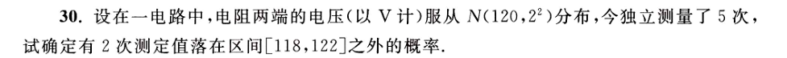

我们直接写程序计算即可：

```python
p1=1-Gaussian_prob(120, 2, 118, 122)
p=(1-p1)**3 * p1**2 * 10
print(p)
```

得到

$$
P = 0.3203602052597432
$$

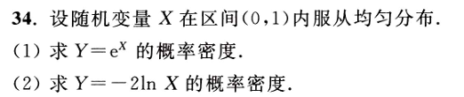

(1)

概率密度积分 $F(X)=X,X\in (0,1)$，由 $X=\ln Y$ 可得 $F(Y)=\ln Y,Y\in (1,e)$，求导可得密度：

$$
P(Y)=
\begin{cases}
    \dfrac{1}{Y},&Y\in(1,e)\\
    0,&\mathrm{otherwise}
\end{cases}
$$

(2)

概率密度积分 $F(X)=X,X\in (0,1)$，由 $X=\exp(-\dfrac 12 Y)$ 可得 $F(Y)=\exp(-\dfrac 12 Y),Y\in (0,+\infty)$，求导可得密度：

$$
P(Y)=
\begin{cases}
    \dfrac 12\exp(-\dfrac 12 Y),&Y\in(0,+\infty)\\
    0,&\mathrm{otherwise}
\end{cases}
$$

## 第五次作业

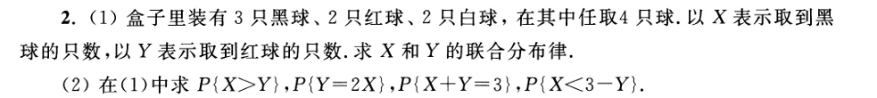

(1)

$$
C_7^4=35
$$

可列分布律如下：

|   |X=0|X=1|X=2|X=3|
|---|---|---|---|---|
|Y=0| $0$ | $0$ | $\frac{3}{35}$ | $\frac{2}{35}$ |
|Y=1| $0$ | $\frac{6}{35}$ | $\frac{12}{35}$ | $\frac{2}{35}$ |
|Y=2| $\frac{1}{35}$ | $\frac{6}{35}$ | $\frac{3}{35}$ | $0$ |

(2)

$$
\begin{align*}
    P(X>Y)&=\dfrac{1}{35}(3+2+12+2)=\dfrac{19}{35}\\
    P(Y=2X)&=\dfrac{6}{35}\\
    P(X+Y=3)&=\dfrac{1}{35}(6+12+2)=\dfrac{20}{35}\\
    P(X<3-Y)&=\dfrac{1}{35}(3+6+1)=\dfrac{10}{35}
\end{align*}
$$

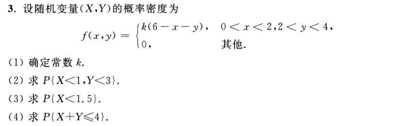

$$
6-x-y=0\implies x+y=6
$$

则需要归一化条件：

$$
\begin{align*}
    \iint_{\mathbb{R}^2}f(x,y)\mathrm{d}x\mathrm{d}y&=k\int_0^2\int_2^4(6-x-y)\mathrm{d}y\mathrm{d}x\\
    &=k\int_0^2 2(6-x)-6\mathrm{d}x\\
    &=8k\\
    &=1\\
    &\implies k = \dfrac{1}{8}
\end{align*}
$$

$$
\begin{align*}
    P(X<1,Y<3)&=k\int_0^1\int_2^3(6-x-y)\mathrm{d}y\mathrm{d}x\\
    &=3k\\
    &=\dfrac{3}{8}
\end{align*}
$$

$$
\begin{align*}
    P(X<1.5)&=k\int_0^\frac{3}{2}\int_2^4(6-x-y)\mathrm{d}y\mathrm{d}x\\
    &=\dfrac{27}{4}k\\
    &=\dfrac{27}{32}
\end{align*}
$$

$$
\begin{align*}
    P(X+Y\le 4)&=k\int_0^2\int_2^{4-x}(6-x-y)\mathrm{d}y\mathrm{d}x\\
    &=(\dfrac{8}{6}+4)k\\
    &=\dfrac{2}{3}
\end{align*}
$$

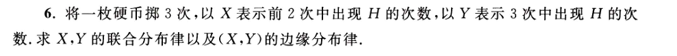

枚举结果并计数即可。

|   |X=0|X=1|X=2|
|---|---|---|---|
|Y=0| $\frac{1}{8}$ | $0$ | $0$ |
|Y=1| $\frac{1}{8}$ | $\frac{1}{4}$ | $0$ |
|Y=2| $0$ | $\frac{1}{4}$ | $\frac{1}{8}$ |
|Y=3| $0$ | $0$ | $\frac{1}{8}$ |

|   |X=0|X=1|X=2|
|---|---|---|---|
|P| $\frac{1}{4}$ | $\frac{1}{2}$ | $\frac{1}{4}$ |

|   |Y=0|Y=1|Y=2|Y=3|
|---|---|---|---|---|
|P| $\frac{1}{8}$ | $\frac{3}{8}$ | $\frac{3}{8}$ | $\frac{1}{8}$ |

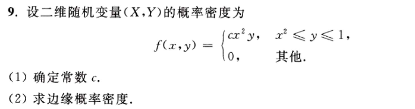

$$
\begin{align*}
    \iint_{\mathbb{R}^2}f(x,y)\mathrm{d}x\mathrm{d}y&=c\int_{-1}^1\int^1_{x^2}x^2y\mathrm{d}y\mathrm{d}x\\
    &=c\int_{-1}^1 \frac{1}{2}x^2(1-x^4)\mathrm{d}x\\
    &=\dfrac{4}{21}c\\
    &=1\\
    &\implies c = \dfrac{21}{4}
\end{align*}
$$

$$
\begin{align*}
    P(x)&=c\int_{x^2}^1x^2y\mathrm{d}y=c\frac{1}{2}x^2(1-x^4)\\
    \implies P(x)&=\
        \begin{cases}
            \frac{21}{8}x^2(1-x^4),&x\in[-1,1]\\
            0,&\mathrm{otherwise}
        \end{cases}
\end{align*}
$$

$$
\begin{align*}
    P(y)&=c\int_{-\sqrt y}^{\sqrt{y}}x^2y\mathrm{d}y=c\frac{2}{3}y^{\frac{5}{2}}\\
    \implies P(y)&=\
        \begin{cases}
            \frac{7}{2}y^{\frac{5}{2}},&y\in[0,1]\\
            0,&\mathrm{otherwise}
        \end{cases}
\end{align*}
$$

## 第六次


## 第七次


## 第八次


## 第九次


## 第十次


