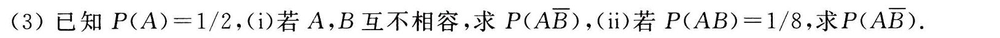
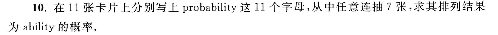
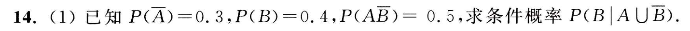
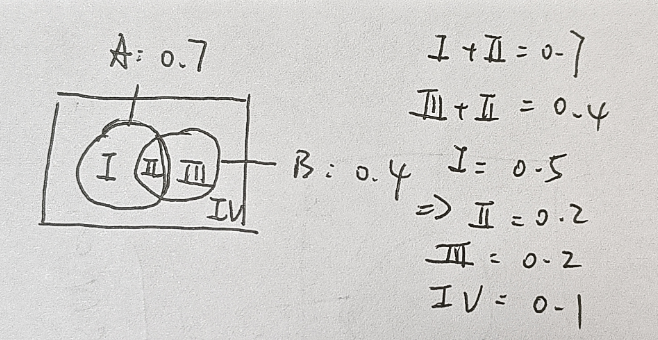
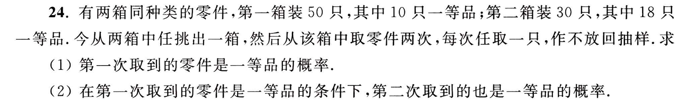
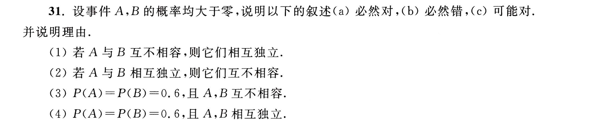
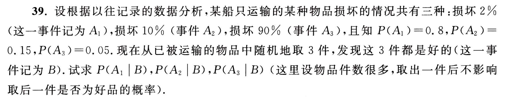

# 《概率论与数理统计》课程作业与笔记归档

供存档和复习用。

## 第一周作业

i. A, B 互不相容，即 AB 无交集，也就是 A 一定在 B 的补集里面。$P(A\bar B)=P(A)=1/2$

ii. 由 $P(A)=P(AB)+P(A\bar B)$ 可得 $P(A\bar B)=3/8$

11 取 7 排列，这个 7 字母词有两个 i 以及两个 b 可以互换都满足条件，所以

$$
P=\dfrac{2\times2}{A^7_{11}}=\dfrac{2\times2}{5\times6\times7\times8\times9\times10\times11}=\dfrac{1}{415800}
$$

我们分成四个区域

$$
P=\dfrac{B\cap (A\cup \bar B)}{A\cup \bar B}=\dfrac{\mathrm{II}}{\mathrm{I+II+IV}}=\dfrac{0.2}{0.5+0.2+0.1}=\dfrac{1}{4}
$$

## 第二周作业

(1)

第一次取分为两个步骤：选箱子+选零件。

$$
P(A)=\dfrac{1}{2}\times\dfrac{10}{50}+\dfrac{1}{2}\times\dfrac{18}{30}=\dfrac{2}{5}
$$

(2)

根据条件概率公式：

$$
P(B|A)=\dfrac{P(AB)}{P(A)}
$$

其中

$$
P(AB)=\dfrac{1}{2}\times\dfrac{10}{50}\times\dfrac{9}{49}+\dfrac{1}{2}\times\dfrac{18}{30}\times\dfrac{17}{29}=\dfrac{276}{1421}
$$

则

$$
P(B|A)=\dfrac{276}{1421}\times\dfrac{5}{2}=\dfrac{690}{1421}
$$

(1) 和 (2) 必然假。 $P(AB)=P(A)P(B)=0$ 与 $P(A)>0, P(B)>0$ 矛盾

(3) 必然假。 若 $B$ 与 $A$ 不相容则必然 $P(B)<1-P(A)$，这就矛盾。

(4) 可能对。考虑随机变量 $x$ 服从一个 $[0,1]$ 上的均匀分布。

成立的情形：

$$
P(A)=P(0<x<0.6)\\
P(B)=P(0.24<x<0.84)
$$

则 $P(AB)=P(A)P(B)=0.36$

不成立的情形：

$$
P(A)=P(0<x<0.6)\\
P(B)=P(0.4<x<1)
$$

则 $P(AB)=0.2\neq P(A)P(B)=0.36$

$$
P(B)=\underbrace{0.8\times(1-2\%)^3}_{P(BA_1)}+\underbrace{0.15\times(1-10\%)^3}_{P(BA_2)}+\underbrace{0.05\times(1-90\%)^3}_{P(BA_3)}=0.8623536\\
P(A_1|B)=\dfrac{P(BA_1)}{P(B)}=0.8731378868250795\\
P(A_2|B)=\dfrac{P(BA_2)}{P(B)}=0.12680413231880752\\
P(A_3|B)=\dfrac{P(BA_3)}{P(B)}=0.00005798085611285204\\
$$

什么是随机变量：如果一个变量 $x$ 在每一次观测时的值不能被完全先验地确定则称其为一个随机变量。
