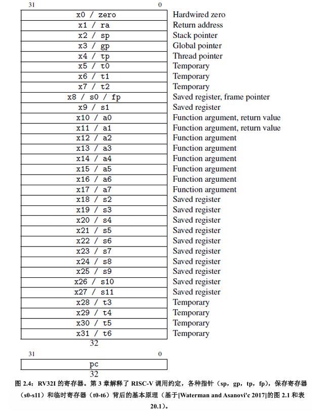
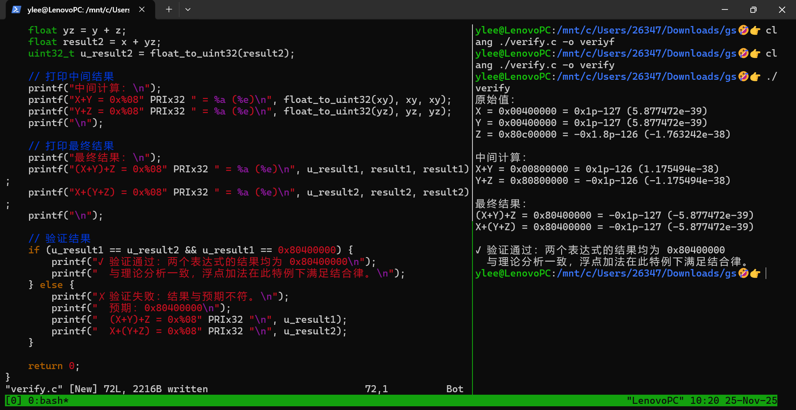
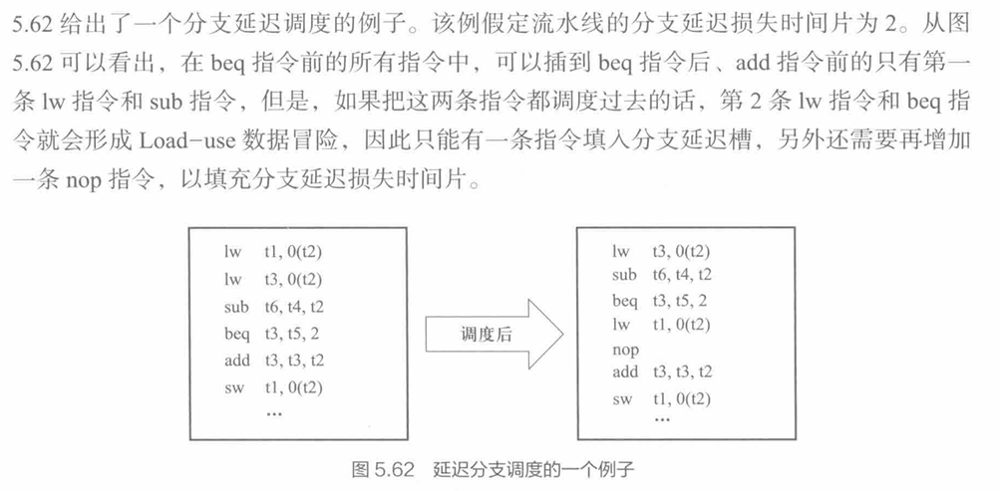
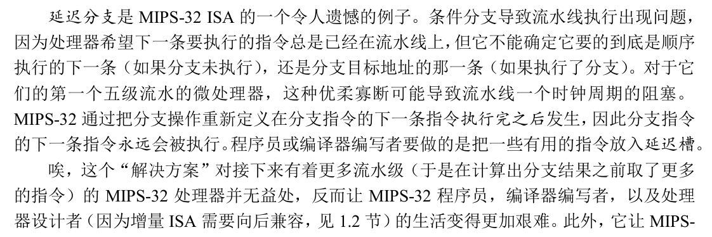
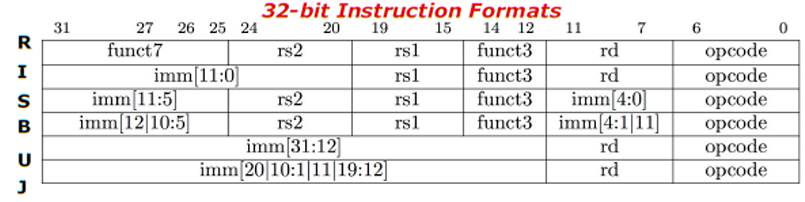
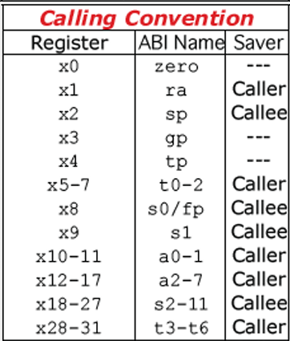
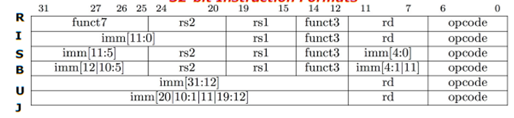

# 《计算机组成与设计》部分历年题目题解

本文参考了中文版 RISC-V 手册的内容。[在这里](http://staff.ustc.edu.cn/~llxx/cod/reference_books/RISC-V-Reader-Chinese-v2p12017.pdf)获取 RISC-V 手册。

感谢 syx 学长整理的试卷资料🤗

## 19-20年

**观前提示，题目是基于MIPS的，我做了部分改动以适应 RV32I。**

### 一、选择题（共 10 小题，每小题 3 分，共 30 分）

1.以下 RV32I 寄存器中，用来存放返回地址的寄存器是：（）

   A、`a0-a7`

   B、`a0-a1`

   C、`ra`

   D、`sp`

> C。`ra` 寄存器是存放返回地址的寄存器，常配合 `jal` 指令使用。
>
> `a0`-`a7` 为**参数寄存器**，用于存放调用函数的**参数**
>
> `a0`-`a1` 同时也为**值寄存器**，用于存放函数的**返回值**。
>
> `sp` 为**栈指针**，指向栈顶。
>
> 具体各个寄存器的用处见下图。



2.假定执行一条指令最多划分为 IF、ID、EX、MEM、WB 等 5 个阶段，各阶段时间分别为：IF 阶段 180ps，ID 阶段 150ps，EX 阶段 200ps，MEM 阶段 220ps，WB 阶段 150ps，对于指令 addi `t1, t2, 20`，分别按照单周期方式、多周期方式、流水线方式执行，则执行该单条指令花费总时间最少的方式是：（）

   A、单周期方式

   B、多周期方式

   C、流水线方式

   D、不确定

> B。
>
> 单周期方式：总执行时间由**耗时最长的数据通路决定**，因此尽管没有从内存读数，仍然要计算 MEM 段的时间，耗时为 180+150+200+220+150=900ps。
>
> 多周期方式：每一个阶段对应一个周期，周期时间为也是耗时最长的数据通路也就是 MEM 段，但是 add 没有这个操作因此只需要 4 个周期也就是 880ps。
>
> 流水线方式：周期时间为耗时最长的数据通路，因此耗时为 220*5=1100ps
>
> 注意本题说的是执行单条指令，因此流水线的优势无法体现。

3.采用组合逻辑实现多周期 CPU 的有限状态机时，其输出与输入关系为：（）

   A、输出控制信号仅与当前状态有关

   B、输出控制信号与当前状态和输入 OP 有关

   C、下一状态仅与当前输入 OP 有关

   D、下一状态与当前状态和输入 OP 有关

> A。
>
> **题目问的是输出和输入的关系**，不选 CD，有限状态机的输出控制信号就是状态，只和当前状态有关，不理解的看下图：


4.以下指令，理论上跳转范围最大的为：（）

   A、J 指令

   B、JAL 指令

   C、JR 指令

   D、BEQ 指令

> C。
>
> 本题看起来需要记忆 rv32i 的指令集格式，实际上确实要记，不过不用那么麻烦。
>
> `j` 指令和 `jal` 指令一样，因为 `j imm` 就是 `jal x0, imm` 的简写。支持的跳转范围就是 imm*2 也就是 2^20 bytes
>
> `jr` 指令就是 `jalr x0, rs1, 0` 的简写。支持的跳转范围是字长的范围，也就是 2^32 bytes
>
> `beq x0, x1, imm` 里面，imm 更短只有 12 bits，因此支持的跳转范围是 2^13 bytes

5.以下属于不挥发型存储器的为：（）

   A、SDRAM

   B、SRAM

   C、DRAM

   D、FLASH

> D。
>
> SDRAM 就是一种 DRAM，原理都是电容，需要上电刷新。掉电数据丢失。
>
> SRAM 依靠触发器高电平锁存数据，需要上电。
>
> FLASH 也就是闪存，依靠的是门阵列的动态烧录，掉电数据不丢失。

6.在读某个虚拟地址单元时，发生 TLB 缺失、页表命中、Cache 命中，则访问该单元全过程共需访问主存次数为：（）

   A、1

   B、2

   C、3

   D、4

> A。
>
> 见下图即可。


7.关于流水线冒险检测的说法，正确的为：（）

   A、冒险检测机制可以避免阻塞

   B、冒险检测机制主要通过旁路以减少流水线气泡

   C、冒险检测机制主要是检测分支冒险

   D、冒险检测机制可以通过阻塞或清除手段避免指令序列出错

> D。
>
> A 项，对 Load-Use 冒险而言，检测机制不能避免阻塞。
>
> B 项，说的是转发机制。
>
> C 项，冒险检测主要检测数据冒险。分支冒险不需要检测。

8.磁盘上记录面 N 的磁道 M 存储数据已满时，如需继续存放，以下哪种方式比较合理：（）

   A、存放到记录面 N 的 M+1 磁道

   B、存放到记录面 N 的随机磁道

   C、存放到记录面 N+1 的 M 磁道

   D、存放到随机记录面的随机磁道

> C。
>
> 根据局部性原则，肯定不选 B 或者 D。由于 A 要移动磁头，而 C 无需移动磁头，时间更短。

9.计算机将外设端口与存储器进行统一编址时会导致：（）

   A、需设置单独指令访问外设端口空间

   B、存储器地址空间减少

   C、外设端口可以直接访问存储单元

   D、访问外设端口速度更快

> B。
>
> A 项，说的是独立编址。
>
> B 项，由于统一编址会占用编址空间，留给存储器的地址空间自然变小了。
>
> C 项，说的是 DMA。
>
> D 项，由于统一编址要过一遍片选，可能会更慢。

10.在某指令 K 执行时检测到外部中断事件后，以下正确的说法为：（）

   A、执行完该指令后进入中断处理

   B、外部中断事件是不可屏蔽的

   C、外部中断处理是不可嵌套的

   D、外部中断处理完后返回指令 K 继续执行

> A。
>
> B 项，不可屏蔽的外部中断很少，比如电源问题等。其他设备发出的外部中断，加入一个逻辑门就可以屏蔽。
>
> C 项，显然可以。
>
> D 项，正确的说法是 A 项。

### 二、计算题（共 4 小题，20 分）

1.（共 6 分）某程序 P 在机器 A 上编译执行，花费总时间为 15 秒。现对 A 进行改造如下：时钟频率增加 25%，同时更换编译器使得执行程序的指令总数减少 25%，平均 CPI 增加 20%，功耗增加 10%。请问：

   （1）程序 P 在改造后的机器 A 上执行时间为多少秒？

   （2）改造后较之改造前机器性能加速比为多少？

> （1）考虑有 $x$ 条指令需要 $c$ 个周期完成，CPI = $c/x$，那么改造后需要的时间周期数为 $0.75x\times 1.2c/x=0.9c$，而时间计算得到 $0.9c \times 15 / c \times 1/1.25=10.8$s.

> （2）加速比=原始执行时间 / 改进后执行时间 = $15/10.8 = 138.9\%$

2.（共 7 分）若有如下 3 个 IEEE 单精度数，分别为：X=0x00400000，Y=0x00400000，Z=0x80C00000，请分别计算：

   （1）(X+Y) + Z

   （2）X + (Y+Z)

> IEEE float32 = S1 E8 M23 我们拆开：
>
> x = y = 0 | 000 0000 0 | 100 0000 0000 0000 0000 0000 = **0**.5 * 2^-126 = 1 * 2^-127 是非规格化数
>
> z = 1 | 000 0000 1 | 100 0000 0000 0000 0000 0000 = -1.5 * 2^-126
>
> (1) 先计算 X+Y = 1 * 2^-126，再加上 Z 得到 -0.5 * 2^-126 结果为 -X 也就是 0x80400000
>
> (2) 没有大数吃小数也没有舍入误差，因此结果不变。
>
> 代码验证如下：



3.（共 7 分）假定 CPU 时钟频率为 2GHz，配备了 2 级缓存，其中 L1Cache 的命中访问时间为 1 时钟周期，命中率 90%，L2Cache 的命中访问时间为 10 时钟周期，命中率 80%，主存访问时间 300 时钟周期。请问：

   （1）该缓存系统的总体命中率是多少？

> 90% 的指令在 L1 级命中，剩下的 10% 里面，80% 在 L2 级命中。总的命中率是 98%。

   （2）单次访存缓存系统的平均时间是多少（以纳秒为单位）？

> 90% * 1 + 8% * (10+1) + 2% * (300+10+1) = 8 Cycs，由于周期 2 GHz 也就是一个周期 0.5 ns，所以期望时间为 4ns

   （3）采用二级缓存与仅采用一级缓存的加速比是多少？

> 仅采用一级缓存，需要 90% * 1 + 10% * (300+1) = 31 Cycs，加速比为 31 / 8 = 3.875

### 三、分析解答题（共 4 小题，50 分）

1.（共 10 分）在指令存储器如下地址处有以下指令，假定 x12 初值为 0xAABBCCDD，请填空：

   （1）20000H：bne x8, x8, 2000H，则该指令执行完后，后续指令的地址为：（）

> x8 恒等于 x8，所以 bne 不跳转， pc = pc + 4。后续为 20004H
>
> 此外在汇编上，为了方便这里的立即数就是跳转偏移量，不需要移位。

   （2）20004H：beq x7, x7, 1000H，则该指令执行完后，后续指令的地址为：（）

> beq 要跳转，pc = pc + imm = 20004H + 1000H = 21004H

   （3）30008H：j 10000H，则该指令的跳转目标地址为：（）

> j = jal x0, imm，因此目标是地址 30008H + 10000H = 40008H

   （4）40008H：addi x9, x0, 500H，则该指令执行完后，寄存器 x9 值为：（）

> x9 = x0 + imm = 0 + 500H = 500H

   （5）

   50008H：sw x12, 4(x13)

   5000CH：lb x12, 4(x13)，则该指令执行完后，寄存器 x12 值为：（）

> lb = Load Byte，加载字节，从地址上看，其实就是 x12 的低位字节，即 0xFFFFFFDD

   50010H：addi x12, x12, 0x56，则该指令执行完后，寄存器 x12 值为：（）

> 0xDD+0x56 = 0x33 (模256)，因此结果是 0x00000033

（6）60008H：slli x9, x8, 4，该指令格式属于（）型指令，其机器码对应 rs2、rs1、rd 字段分别为：（）、（）、（）。

> slli = Shift Left Logical Immediate 是 I 型指令。rd = 9, rs1 = 8, rs2 = 0（其实对应的是 shamt 字段，因为是 I 型指令。）
>
> 关于指令的分型依据：


### 2、（共 10 分）

假设下列 RV32I 代码在一个 5 级流水的处理器上运行，该流水线有冒险检测、有到 ID 与 EX 级的完全旁路。假设在 ID 级执行分支，采用延迟槽而且在延迟槽中的指令是分支指令的后续相邻指令，解答以下问题。

**尽管我们的教材介绍了延迟槽技术，但现代的 RISC-V 实现一般不使用这一技术。**




**并且 RISC-V 手册对其进行了抨击：**



**由于原试题是基于 MIPS 的，并且教材里面有，因此本题也保留。**

```
lw    t2, 4(t1)           # I1
LAB1: 
beq   t0, t2, LAB2        # I2, 第一次不发生跳转，然后发生跳转
add   t2, t4, t1          # I3
beq   t3, t2, LAB1        # I4, 发生跳转
lw    t1, 8(t3)           # I5
LAB2: 
sw    t1, 12(t2)          # I6
add   t1, t2, 4           # I7
```

（1）画出该指令序列的流水线执行图；

```text
   1  2  3  4  5  6  7  8  9  10 11 12 13 14 15 16
I1 IF ID EX M  WB
I2    IF ID ID ID EX M  WB                           # 由于没有 M 阶段的旁路，需要等到 WB 段后才能 EX
I3       IF IF IF ID EX M  WB
I4                IF ID ID EX M  WB                   # ID 阶段等待 R2 结果转发
I5                   IF IF ID EX M  WB
I2                         IF ID EX M  WB
I3                            IF ID EX M  WB          # ID 段已经可以执行分支
I6                               IF ID EX M  WB
I7                                  IF ID EX M  WB
```

（2）指出执行过程中哪些位置用到何种旁路；

> EX/M 到 ID 级和 EX/M 到 EX 级的转发。

（3）总的执行时间是多少周期。

> 如上图，16 周期。

### 3、（共 18 分）

对于一个 4 路组相联映射的 Cache，采用下面的 32 位主存地址格式来访问 Cache。

| Block Tag | Set Index | Byte Offset inside Block |
| --------- | --------- | ------------------------ |
| 31-11     | 10-5      | 4-0                      |

（1）该 Cache 共有多少数据块，可划分为多少组，所有数据块的总容量是多大？（单位:Byte）

> 每个 block 有 2^5 = 32 bytes，一共 2^6 = 64 组，每一组 4 块。一共就是 256 块。容量是 256 * 32 = 8192 Bytes

（2）为方便 Cache 访问，请为该 Cache 设计合理的标签（tag）、有效位（vf）、理想替换位（rf）、脏位（df）等附加信息域，形成一个完整的 Cache 结构，并计算该完整 Cache 的总体容量（单位：bit）；

> vf 用来冷启动 cache，df 用来写回主存，这俩标志位只需要 1 个 bit；rf 需要覆盖到每一组的所有路，也就需要 2 bits。那么每一个 block 就需要 21(tag) + 1(vf) + 1(df) + 2(rf) = 25 位的附加信息，以及 32*8 = 256 bits 的数据，一共的容量就是 256 * (256 + 25) = 71936 bits

（3）从上电开始给出如下 10 个字节地址：0、2049、30、200、300、6144、4095、4096、208、8193，试分析该地址序列的访问过程，并按照 LRU 算法，说明有哪些 Cache 块被替换？总的块命中率是多少？

```text
0:    tag = 0, set = 0  0        miss
2049: tag = 1, set = 0  1,0      miss
30:   tag = 0, set = 0  0,1      hit
200:  tag = 0, set = 6  0,1      miss
300:  tag = 0, set = 9  0,1      miss
6144: tag = 3, set = 0  3,0,1    miss
4095: tag = 1, set = 63 3,0,1    miss
4096: tag = 2, set = 0  2,3,0,1  miss
208:  tag = 0, set = 6  2,3,0,1  hit
8193: tag = 4, set = 0  4,2,3,0  miss, 替换 tag = 1
```

> 替换 Set = 0, tag = 1 的块，命中率 20%

### 4、（共 12 分）

考虑一个采用 5 位校验位来保护 8 位数据信息的汉明码 SEC/DED，并假设编码的位编号是从 MSB（Most Significant Bit）向 LSB（Least Significant Bit）方向增大。如果接收方接收到的值为 0x1E54，请判断该编码是否有错，并说明判断依据？如果有错，请指出错误位置并纠正，还原为正确的汉明码并提取 8 位原始数据信息。

``` 
0x1E54 = (MSB)0001 1110 0101 0100(LSB)
码字排列： P5 M8 M7 M6 M5 P4 M4 M3 M2 P3 M1 P2 P1
映射一下： 0  0  1  0  1  0  1  0  0  1  1  1  1
校验码为：00001，也就是 P1 出错。
因此原始数据是01011001
```

## 21-22年

**观前提示，题目是基于MIPS的，我做了部分改动以适应 RV32I。**

### 一、选择题(共10小题,每小题2分,共20分)

1、假设将系统中的某一部件处理速度加快到10倍,且该部件在原处理时间中占40%,则采用加速措施后,整个系统的性能能提高到( )倍｡

A. 1

B. 1.56

C. 2

D. 2.5

> B。
> 
> 一开始的执行时间是 0.4 + 0.6 = 1s，加速后执行时间是 0.04 + 0.6 = 0.64s，性能提高到 1 / 0.64 = 1.56 倍。

2、某计算机主频为1.2GHz,其指令分为4类,它们在基准程序中所占比例及CPI如下｡

| 指令类型 | 所占比例 | CPI |
| --- | --- | --- |
| A | 50% | 2 |
| B | 20% | 3 |
| C | 10% | 4 |
| D | 20% | 5 |

则该机的MIPS数是:( )

A. 100

B. 200

C. 400

D. 600

> C。
> 
> MIPS = Million Instructions Per Second. 该程序平均 CPI 为 1 + 0.6 + 0.4 + 1 = 3，也就是说：1s 执行 1.2G 个周期，平均每个指令要花 3 个周期，也就是说 1s 执行 400M 个指令。

3、已知带符号整数用补码表示,变量x、y、Z的机器数分别为FFFDH、FFDFH、7FFCH下列结论中,正确的是( )

A. 若x、y和Z为无符号整数,则 $z<x<y$

B. 若x、y和Z为无符号整数,则 $x<y<z$

C. 若x、y和Z为带符号整数,则 $x<y<z$

D. 若x、y和Z为带符号整数,则 $y<x<z$

> D。
> 
> 如果是无符号，我们直接按字面大小比较即可：$z<y<x$
>
> 如果是有符号，首先 $z>0,x,y<0$，划定正负性之后，同号数的比较和字面大小的比较是**一致**的。因为负数补码字面量转换成原数字只需要减去一个固定的偏移量即可。

4、对于指令`bne t0, s5, Exit`, 当前指令的地址为80008(十进制), 当前指令的 RV32I 机器码为 0x01529463,那么该条指令发生跳转时,会跳转到下列哪个地址?( )

A. 80012

B. 80020

C. 80016

D. 80024

> C。

```
31     24    19     14   11     6      0
 0000 0001 0101 0010 1001 0100 0110 0011
imm[12|10:5] = 000000
rs2 = 01010
rs1 = 10010
funct3 = 1001
imm[4:1|11] = 01000
opcode = 1100011
则 imm = 00000000000100 = 4
imm << 2 = 8, 地址为 80016
```



> 本题目从 MIPS 改编到 RV32I，原题目答案是 B 但是我改了数据所以选 C，不要盲信答案，程序验证如下（从0x08到0x10跳了8 bytes）：


5、下列寄存器中,汇编语言程序员可见的是( )
I.指令寄存器 II. 微指令寄存器 III. 基址寄存器 IV. 标志/状态寄存器

A. 仅I、II

B. 仅I、IV

C. 仅II、IV

D. 仅III、IV

> D。
>
> IF 阶段取指令到指令寄存器，无论如何都不会把这个寄存器暴露出来。
>
> 微指令寄存器更为底层了，也用不上。
>
> 基址寄存器就是 x86-64 的 rbp 寄存器，然后坐我旁边的某个传奇盘姓 pwn 手把这个选漏了。
>
> 标志/状态寄存器间接可见，比如说 `test` 之后再 `jz` 就用到了 ZF 标志位。
>
> （怎么全是 x86 汇编啊……）

6、由于在数据通路中存在多个源部件向单个部件发送数据,可能会导致冲突,因此需在基本结构上添加多路选择器,这些多路选择器如何选择哪条通路应该由什么来决定?( )

A. 指令寄存器

B. 程序计数器

C. 算术运算器

D. 控制器

> D。
>
> 前三个有点离谱。

7、下列关于数据通路的叙述中,错误的是 ( )

A. 数据通路包含ALU等组合逻辑(操作)元件

B. 数据通路包含寄存器等时序逻辑(状态)元件

C. 数据通路不包含用于异常事件检测及响应的电路

D. 数据通路中的数据流动路径由控制信号进行控制

> C。
>
> 除 0 异常就需要在数据通路中检测。

8、下列选项中, 能引起外部中断的事件是( )

A. 键盘输入

B. 除数为0

C. 浮点运算下溢

D. 访存缺页

> A。
>
> 定义。

9、假定执行一条指令最多划分为IF、ID、EX、MEM、WB等5个阶段,各阶段时间分别为:IF阶段180ps,ID阶段150ps,EX阶段200ps,MEM阶段220ps,WB阶段150ps,对于指令addi t1, t2, 20,分别按照单周期方式、多周期方式、流水线方式执行,则执行该单条指令花费总时间最少的方式是:( )

A. 单周期方式

B. 多周期方式

C. 流水线方式

D. 不确定

> B。
>
> 原题，不解释。

10、某机器具备2级缓存,其中L1 Cache命中率为90%,访问时间1T;L2 Cache命中率为80%,访问时间10T;主存访问时间100T｡则该2级缓存总的有效访问时间是:( )
A.1.9T

B.3.7T

C.4.0T

D.5.5T

> C。
> 
> 1 + 0.1 * 10 + 0.02 * 100 = 4

### 二、指令设计题(共15分)

假定计算机M字长为16位,按字节编址,连接CPU和主存的系统总线中地址线为20位、数据线为8位,采用16位定长指令字,指令格式及其说明如下:

| 格式 | 6位 | 2位 | 2位 | 2位 | 4位 |
| --- | --- | --- | --- | --- | --- |
| R型 | 000000 | rs2 | rs1 | rd | op1 |
| I型 | op2 | rs2 | rs1 | imm | - |
| J型 | op3 | target | - | - | - |

指令功能或指令类型说明：

- R型：R[rd]<- R[rs1] op1 R[rs2]
- I型、J型：含ALU运算、条件转移和访存操作3类指令

其中,op1~op3为操作码,rs、rt、和rd为通用寄存器编号,R[r]表示寄存器r的内容,imm为立即数,target为转移目标的形式地址｡请回答下列问题｡

(1) ALU的宽度是多少位?可寻址主存空间大小为多少字节?指令寄存器、主存地址寄存器(MAR)和主存数据寄存器(MDR)分别应有多少位?(4分)

> ALU 的单位和通用寄存器的单位一致，也就是一个机器字长，即 16位。
>
> 可寻址主存空间就是地址线能表达的地址范围，因此是 2^20 字节。
>
> 指令寄存器的宽度就是每一条指令的宽度，16 位。
>
> MAR 和 MDR 的宽度和对应数据线的位宽一致，分别是 20 位和 8 位。

(2) R型格式最多可定义多少种操作?I型和J型格式总共最多可定义多少种操作?通用寄存器最多有多少个?(3分)

> 根据 op 码的宽度决定。R 型 2^4 = 16 个，I 型和 J 型 2^6-1 = 63 个（扣除 R 型的那个）。通用寄存器的数量由预留给它的宽度决定：2^2 = 4 个。

(3) 假定op1为0010和0011时,分别表示带符号整数减法和带符号整数乘法指令,则指令01B2H的功能是什么(参考上述指令功能说明的格式进行描述)?若1、2、3号通用寄存器当前内容分别为B052H、0008H、0020H,则分别执行指令01B2H和01B3H后,3号通用寄存器内容各是什么?各自结果是否溢出?(6分)

```
01B2 =
0000 0001 1011 0010
000000 01 10 11 0010 
     = sub x3, x2, x1
01B3 = mul x3, x2, x1

即，01B2H 执行的操作是 R[3] <- R[2] - R[1]
减出来是负数，绝对值是B04A，转成补码就是 4FB6H，没有溢出。
再执行 01B3H，由于 B052 * 8 肯定大于 16 位，出现溢出，结果是8290H。
```

(4) 若采用I型格式的访存指令中imm(偏移量)为带符号整数,则地址计算时应对imm进行零扩展还是符号扩展?(1分)

> 符号扩展。因为我们可能涉及到正/负方向的偏移。

(5) 无条件转移指令可以采用上述哪种指令格式?(1分)

> I 型（jalr）或者 J 型（jal）格式。

### 三、计算题(共25分)

1、若 $X=9.625$ ,以IEEE754单精度数表示, $Y=-67$ ,以32位整形补码表示｡

(1) 若依次将X、Y以大数端存放方式写入从起始地址2020H开始的内存区域,请以图示方式描述出X和Y在内存中的十六进制形式｡(6分)

```
X = 1001.101 = 1.001101 * 2^3
S = 0
E = 1000 0010
M = 0011 0100 0000 0000 0000 000
X = 0100 0001 0001 1010 0000 0000 0000 0000
  = 41 1A 00 00
-Y = 67 = 0100 0011
Y = 1011 1101 = BD
由于是 32 位因此需要符号扩展为 FF FF FF BD
+----+----+----+----+----+----+----+----+
|2020|2021|2022|2023|2024|2025|2026|2027|
+----+----+----+----+----+----+----+----+
| 41 | 1A | 00 | 00 | FF | FF | FF | BD |
+----+----+----+----+----+----+----+----+
```

(2) 若某程序进行了 $Z=X+Y$ 计算,请按照浮点运算方法计算出 $Z$,结果以十六进制形式表示｡(6分)

```
Z=X+Y = -57.375 = -111001.011 = - 1.11001011 * 2^5
当然写过程还是要对阶再规格化，这里因为数据都在 float32 范围内能准确表示，就简化了一下过程。
S = 1
E = 1000 0100
M = 110 0101 1000 0000 0000 0000
X = 1100 0010 0110 0101 1000 0000 0000 0000
  = C2 65 80 00
```

2、假定一个磁盘的转速为7200RPM,磁盘的平均寻道时间为8ms,内部数据传输率为4MB/s,不考虑排队等待时间,则读一个512B扇区的平均时间大约为多少毫秒?结果保留两位小数｡(6分)

> 计算方法：磁头就位（磁头寻道时间）+盘片就位（期望的旋转时间）+数据就位（传输时间）+主控、排队等其他开销。
>
> 磁头：8ms
>
> 盘片：期望转 1/2 转转到，因此时间是 1/2 * 1/7200 min = 1/2 * 1/120 s = 1000/240 ms = 4.17ms
>
> 数据：4MB/s 对应 4KB/ms 而 512B = 0.5KB，仅需 0.125ms
>
> 总耗时：8+4.17+0.13 = 12.30 ms

3、假定主存地址为32位,按字节编址,主存和Cache之间采用直接映射方式,主存块大小为4个字,每字32位,采用回写方式,则能存放4K字数据的Cache的总容量按位计算至少是多少?(7分)

> 每个块是 4 个字，也就是 16 字节，需要 4 bits 的偏移位，Cache 一共 1K 行，每一行需要 10 bits 的 index 位，所以 tag 需要 32 - 10 - 4 = 18 位，同时需要 1 bit 的有效位和 1 bit 的脏位。因为是直接映射，没有组相联，因此不需要设计LRU计数位，这样元数据就需要 20 bits，而数据是 4 * 32 = 128 bits，每一行 Cache 的宽度就是 148 bits，因此至少需要 148 * 1024 = 151552 bits 的容量。

### 四、编码设计题(共8分)

为保证在小于1位错情况下8位数据的可靠传输,为之设计海明校验码SEC(1位纠错),要求海明位编号是从MSB(Most Significant Bit)向LSB(Least Significant Bit)方向增大｡请问答:

(1) 需要设置多少校验位才能实现该海明校验码SEC,并给出原因｡(2分)

(2) 针对该海明码,如果接收端收到的编码为0x945,判断是否出错?若有错误,请指出正确的数据信息,并给出计算过程｡(6分)

> 单纠错码设计，就是经典的海明码，高位向低位增大，编码如下：

```
index:  1  2  3  4  5  6  7  8  9 10 11 12
data : P1 P2 M1 P3 M2 M3 M4 P4 M5 M6 M7 M8
bin  :  0  0  0  0  0  0  0  1  1  1  1  1
     :  0  0  0  1  1  1  1  0  0  0  0  1
     :  0  1  1  0  0  1  1  0  0  1  1  0
     :  1  0  1  0  1  0  1  0  1  0  1  0
P1 = M1 ⊕ M2 ⊕ M4 ⊕ M5 ⊕ M7
P2 = M1 ⊕ M3 ⊕ M4 ⊕ M6 ⊕ M7
P3 = M2 ⊕ M3 ⊕ M4 ⊕ M8
P4 = M5 ⊕ M6 ⊕ M7 ⊕ M8
0x945 = 1  0  0  1  0  1  0  0  0  1  0  1
P1 = 1 P1' = 0
P2 = 0 P2' = 0
P3 = 1 P3' = 0
P4 = 0 P4' = 0
S = 0101 -> M2 出错
正确的数据信息是 1001 1100 0101 即 0x9C5
```

### 五、处理器设计题(共20分)

以下是一段 RV32I 指令序列:
```
1 loop: add t1, s3, s3 
2       add t1, t1, t1 
3       add t1, t1, s6 
4       lw t0, 0(t1) 
5 exit: bne t0, s5, exit 
6       add s3, s3, s4 
7       j loop
```
假定在一个采用“取指、译码/取数、执行、访存、写回”的五段流水线中执行上述指令序列,该流水线数据通路中寄存器写口和寄存器读口分别安排在一个时钟周期的前、后半周期内独立工作｡要求回答以下问题:

(1) 哪些指令之间发生数据相关?请以“第x条指令与第y条指令关于z相关”的形式描述数据相关｡(5分)

> I1 和 I2 关于寄存器 t1 相关。
>
> I2 和 I3 关于寄存器 t1 相关。
>
> I3 和 I4 关于寄存器 t1 相关。
>
> I4 和 I5 关于寄存器 t0 相关。
>
> I6 和 I1 关于寄存器 s3 相关。

(2) 哪些指令执行会发生控制相关?(2分)

> 两条跳转指令打乱了 PC 的值，因此是 I5 和 I7。

(3) 如果不采用“转发”技术进行数据冒险处理,那么应该在何处、加入几条nop指令才能避免数据冒险?(3分)

```
IF ID EX M  WB           # 结果可被EX用
   IF ID EX M   WB       # nop
      IF ID EX  M  WB    # nop
         IF ID  EX M  WB # 新指令
```

> 看上图，上一条指令 WB 后，再下一条指令是 nop 的 WB 段，再下面是 nop 的 M 段，再下才是新指令的 EX 段，因此需要在 I1, I2, I3, I4 三条指令后插入两条 nop 指令；I6 和 I1 的数据冒险，将会在第 6 问解决 j 指令的控制冒险的时候一并解决。

(4) 假定采用“转发”技术,是否可以完全解决冒险?如果不行,需要在发生数据相关的指令前加几条nop指令,才能使这段指令的执行消除数据冒险?(3分)

> 不可以，I4 和 I5 之间发生 Load-Use 冒险，需再加一条 nop 才能消除，其他的指令都可以通过转发解决冒险。

(5) 对于第5条分支指令引起的控制冒险,假定将检测结果是否为“零”并更新PC的操作放在“访存(Mem)”阶段进行,在何处加入几条nop指令可以消除分支冒险?若将检测结果是否为“零”并更新PC的操作放在“执行(Ex)”阶段进行,则在何处加入几条nop指令可以消除分支冒险?(3分)

> 参考上面的流水线图，M 段前面积累了三条指令的内容，如果填充为 nop 就可以在下一条指令直接放入对应的指令 IF 段，也就是消除了分支冒险；类似地如果是 EX 段则只需要 2 个 nop 指令。
>
> 这其实就是软件实现分支延迟槽的设计。

(6) 对于第7条指令,假定更新PC的操作在“执行(EX)”阶段进行,则流水线会被阻塞几个时钟周期?假定更新PC的操作在“译码(ID)”阶段进行,流水线又将被阻塞几个时钟周期?(4分)

> 和上面一问类似，只不过这一问考察硬件层面的流水线阻塞，原理是类似地，只不过把软件 nop 指令换成硬件流水线阻塞了，计算方式是一样滴，就是算把下一条指令的 IF 挪到 PC 更新后的那个段需要几个周期：EX 段阻塞 2 周期，ID 段阻塞 1 周期。

### 六、虚拟存储器分析题(共12分)

某计算机采用页式虚拟存储管理方式,按字节编址,虚拟地址为32位,物理地址为24位,页大小为4KB;TLB采用全相联映射;Cache数据区大小为64KB,Cache数据块大小为128B,按2路组相联方式组织｡存储访问过程的示意图如下。


部分页表内容:

| 虚拟页号 | 有效位 | 物理页号 |
| --- | --- | --- |
| ... | ... | ... |
| 0x12345 | 1 | 0x012 |
| 0x12346 | 1 | 0x123 |
| 0x12347 | 0 | 0x088 |
| ... | ... | ... |

请回答下列问题｡

(1) 图中字段A~G的位数各是多少? (7分)

> CPU 进行访存首先将虚拟地址拆成 vtag 和 vindex，再利用 vtag 在 TLB 里面找到物理页框号，和 vindex 拼接成真实物理地址，这个物理地址再拆成 tag, index 和 block offset，送入组相联 cache。
>
> 由于 vindex 的范围是 4KB，因此 vtag 需要 20 bits 的宽度，也就是 A 和 B 的宽度；而 C+D 的宽度和物理地址一致，则 C 需要 12 bits 的宽度，D 和 vindex 的宽度一致，需要 12 bits。cache 的每一组是 2 块，块内偏移量是 128 = 2^7 B，也就是说偏移需要 7bits，一共每一组 256 B，则 cache 一共 256 组，也就是说组索引需要 8bits，剩下的 24 - 7 - 8 = 9 bits 是 tag 位。也就是说 E 的宽度是 9 位，F 的宽度是 8 位，G 的宽度是 7 位。

(2) 虚拟地址0x12346789所在的页面是否在主存中?若在主存中,则该虚拟地址对应的物理地址是什么?将该主存块装入到Cache中时,所映射的Cache组号是多少?(5分)

> 该地址的 vtag 为 0x12346，在 TLB 中查询到有效位是 1，因此在主存中，直接拼接为 0x123789 的物理地址。
>
> 0x123789 = 0001 0010 0 | 011 0111 1 | 000 1001
>
> Set idex = 0110 1111 = 0x6F

## 复习参考题

### 一、选择题

1. 将高级语言源程序转换为可执行目标文件的主要过程是( )。
   - A、预处理￫编译￫汇编￫链接
   - B、预处理￫汇编￫编译￫链接
   - C、预处理￫编译￫链接￫汇编
   - D、预处理￫汇编￫链接￫编译

> A。
> 
> 以 C 为例，预处理阶段会展开所有宏，编译阶段(cc)会把代码翻译成汇编或者经过一道领域无关的 IR 之后再翻译成汇编，汇编阶段(as)会把汇编代码翻译成机器码，链接阶段(ld)会把程序和库间的调用链接起来。

2. 某计算机主频为1GHz，程序P运行过程中，共执行了10000条指令，其中，80%的指令执行平均需1个时钟周期，20%的指令执行平均需10个时钟周期。程序P的平均CPI和CPU执行时间分别是( )。
   - A、2.8，28μs
   - B、28，28μs
   - C、2.8，28ms
   - D、28，28ms

> A。
> 
> 1 * 0.8 + 10 * 0.2 = 2.8 Cycs Per Inst.
>
> 2.8 Cycs Per Inst * 10000 Inst = 2.8 * 10^4 Cycs in 2.8 * 10^-5 s = 28μs

3. 假定有int型变量i和float型变量f1、f2，它们取值都不等于NaN和无穷大，判断以下C语言关系式哪个在32位机器上运行时为永真。
   - A、i==(int)(float)i
   - B、f1==(float)(int)f1
   - C、f1==(float)(double)f1
   - D、(f1+f2)-f1==f2

> C
>
> A: i = 0x7fffffff 附近时，浮点数精度不够只有 23 位，int 转 float 丢精度。
>
> B: f1 是小数时，转 int 必有丢失。
>
> C: double 是 float 的超集。
>
> D: f2 + f1 有效数字大于 23 位时就会出现舍入误差。

4. 对于补码表示的8位有符号数：`x=0xb6`，`y=0x8a`，在8位运算器中进行运算，以下正确的为：
   - A、x<y
   - B、x+y的结果溢出
   - C、x-y的结果溢出
   - D、x+y产生了进位

> B/D。
> 
> x = 0xb6 = 1011 0110
> 
> y = 0x8a = 1000 1010
>
> A: 两者符号一致，可以直接按照字面量大小比较，有 x > y
>
> B: 显然最高位溢出了
>
> C: 显然没有
>
> D: 显然发生了进位

5. 两个无符号数x、y进行运算，正确的说法为：
   - A、若$x+y$后$of=1$，说明结果发生了溢出
   - B、若$x+y$后$sf=1$，说明结果发生了溢出
   - C、若$x-y$后$cf=1$，说明$x<y$
   - D、若$x-y$后$sf=1$，说明$x<y$

> C
>
> A: 无符号数运算不会对 OF 做标记。
> 
> B: sf=1 只能说明结果比较大。
>
> D: 取 x = 0, y = 1, -y = 0xffffffff 为反例。

6. 下列选项中，属于指令集体系结构(ISA)规定的内容是( )。
   - Ⅰ. 指令字格式和指令类型
   - Ⅱ. CPU的时钟周期
   - Ⅲ. 通用寄存器个数和位数
   - Ⅳ. 加法器的进位方式
   - A、仅Ⅰ、Ⅱ
   - B、仅Ⅰ、Ⅲ
   - C、仅Ⅱ、Ⅳ
   - D、仅Ⅰ、Ⅲ、Ⅳ

> B
> 
> 可以考虑 risc-v 规定了哪些东西。显然 risc-v 没有规定处理器的主频是多少 GHz 或者加法器是超前进位还是行波进位。因此 I, III 是对的。

7. 设计某指令系统时，假设采用16位定长指令字格式，操作码使用扩展编码方式，地址码为6位，包含零地址、一地址和二地址3种格式的指令。若二地址指令有12条，一地址指令有254条，则零地址指令的条数最多为( )。
   - A、0
   - B、2
   - C、64
   - D、128

> D
> 
> 12 * 2^12 + 254 * 2^6 + x = 2^16
> x = 128

8. 请给出C语句“`int x=8191`”对应的RISC-V汇编代码，假设编译器将x分配在$x5$寄存器。( )
   - A、lui x5, 1 addi x5, x5, -1
   - B、lui x5, 2 addi x5, x5, -1
   - C、lui x5, 1 ori x5, x5, -1
   - D、lui x5, 2 ori x5, x5, -1

> B
>
> lui 指令是 U 型指令，现在把试卷翻到第五大题，它给出了 lui 指令的立即数宽度。也就是说他会把给出的立即数填到高 31~12 位上。
>
> 8191 = 2^13 - 1, 13-12 = 1, 2^1 = 2，也就是说 lui 的立即数是 2，然后给它减去 1 即可。


9. 构成数据通路的各主体部件操作时间如下：指令存储器和数据存储器(200ps)，ALU和加法器(170ps)，寄存器堆(150ps)，其它部件时间忽略。一条指令最多经历取指、指令译码与读寄存器、运算、访问存储器、写回结果等5个步骤，以下说法正确的为：
   - A、单周期方式处理器，周期设置为1000ps；
   - B、多周期方式处理器，周期设置为200ps；
   - C、多周期方式处理器，一条指令最多执行时间为870ps；
   - D、流水线方式处理器，周期设置为1000ps

> B
> 
> 单周期：最长的数据通路耗时：200+150+170+200+150=870ps
>
> 多周期处理器周期应该根据耗时最长的指令段决定，也就是 200ps
>
> 同时最多执行的时间也是 200 * 5 = 1000 ps
>
> 流水线方式的周期也应为 200 ps。

10. 根据RISC-V寄存器使用约定，当无嵌套调用时，以下哪个寄存器由被调用过程保存？( )
    - A、t1
    - B、a0
    - C、a7
    - D、s0

> D
> 
> 如图，助记一下：被调用过程保存的是 s 段的寄存器(sp, s0~s11)，因为这和调用栈(stack)有关，调用过程保存的是 a 和 t 段的寄存器（ra, a0~7, t0~6），因为它们都比较临时(temporary)



### 二、数据表示
某程序中定义了变量x、i，其中x是float型变量，i是16位short型变量(补码表示)。
1. 若$x=-0.75$，$i=126$，且x、i被依次连续写入主存，写入起始地址(按字节编址)是40。请分别画出在采用小端存放时，变量x、i的每个字节在主存中的存放位置。
2. 若x是规格化数，其最大值可表示多少？
3. i能表示的最小值是多少？

```
x = -1 * 3 * 2^-2 = - 1.1 * 2^-3
FP32 = S1 E8 M 23
S: 1
E: 0111 1100
M: 1000 .....
x = 1011 1110 0100 0000 0000 0000 0000 0000
i = 0000 0000 0111 1110
+----+----+----+----+----+----+
| 40 | 41 | 42 | 43 | 44 | 45 |
+----+----+----+----+----+----+
| 00 | 00 | 60 | BE | 7E | 00 |
+----+----+----+----+----+----+
|         x         |    i    |
+-------------------+---------+

x_max = (1.111...11) << 127 = (2^24 - 1) * 2^(127 - 24) = 2*127 - 2*103

i_min = -32768
```

### 三、数据运算
与单精度数格式类似，IEEE754还定义了一种半精度数，包含16位二进制：1位符号S、5位阶码E、10位尾数M，其规格化数对应的数值为$(-1)^S ×2^{E-15} ×1.M$。请用半精度数格式计算0.625+1026，要求写出浮点运算的步骤和规格化结果。浮点运算过程中采用3位附加位(Guard、Round、Sticky)来保证中间运算结果的精度，最终采用就近舍入到偶数方式进行舍入。运算结果可采用二进制或十六进制形式表示的机器码，并写出其对应的十进制数值。

```
0.625 = 0.5 + 0.125 = 0.101 = 1.01 * 2^-1
S = 0, E = 01110, M = 01 0000 0000
1026 = 1024 + 2 = 0010 0000 0010 = 1.0000 0001 * 2^10
S = 0, E = 11001, M = 00 0000 0010


首先对阶：
1.01 0000 0000 000 * 2^-1 = 
0.00 0000 0000 101 * 2^10
加起来得：
1.00 0000 0100 101 * 2^10
由于舍入到偶数，则不发生进位，结果为
1.00 0000 0100     * 2^10
也就是 1026。
```

### 四、指令格式
某C语言源程序中的一个while语句为“while (save[i]==k) i+=1;”，若对其编译时，编译器将i和k分别分配在寄存器s3和s5中，数组save的基址存放在s2中，则生成的RV32I汇编代码段如下：
```asm
loop: slli t1, s3, 2        # R[t1] <- R[s3]<<2，即R[t1]=i×4
      add t1, t1, s2        # R[t1] <- R[t1]+R[s2]，即R[t1]=address of save[i]
      lw t2, 0(t1)          # R[t2] <- M[R[t1]+0]，即R[t2]=save[i]
      bne t2, s5, exit      # if R[t2]≠R[s5]=k then goto exit
      addi s3, s3, 1        # R[s3] <- R[s3]+1，即i=i+1
      j loop                # goto loop
exit:
```
假设从loop处开始的指令存放在内存20000处，上述循环对应的RV32I机器码如下图所示，图中数据都为十进制形式。请回答：

#### 题四图(a) RV32I 指令机器码
| 地址   | 第31-25位 | 第24-20位 | 第19-15位 | 第14-12位 | 第11-7位 | 第6-0位 |
| ------ | --------- | --------- | --------- | --------- | -------- | -------- |
| 20000  | 0         | 2         | 19        | 1         | 6        | 19       |
| 20004  | 0         | 18        | 6         | 0         | 6        | 51       |
| 20008  | 0         |           | 6         | 2         | 7        | 3        |
| 20012  | 0         | 21        | 7         | 1         | 12       | 99       |
| 20016  |           |           | 19        | 0         | 19       | 19       |
| 20020  |           | 1043967   |           |           | 0        | 111      |

#### 题四图(b) RV32I 指令格式



1. RISC-V的编址单位是多少？数组save每个元素占几个字节？

> 字节。读前两行汇编可知，寻址时偏移量是 4 字节，所以 save 每个元素占 4 字节。

2. 为什么指令“slli t1, s3, 2”能实现4×i的功能？

> slli = Shift Left Logic Imm，属于 I 型指令，slli rd, rs1, Imm 的意思是将 rs1 寄存器的值左移 Imm 位并存储在 rd 里面。由于 s3 保存了寄存器 i 的值，所以原来指令的意思是把 i 左移两位也就是乘以四之后的值放进 t1 里面。

3. 该指令序列中，哪些指令是R型？哪些是I型？哪些是B型？哪些是J型？

> R: I2(add)
>
> I: I1(slli), I3(lw), I5(addi)
>
> B: I4(bne)
>
> J: I6(j)

4. t2和s2的编号各为多少？

> 读I3，t2 是 rd，对应的值是7，读I2，s2 是 rs2，对应的值是 18。

5. 指令“j loop”是哪条指令的伪指令？其操作码的二进位表示是什么？

> jal x0, loop。opcode = 110 1111 （注意111是十进制）

6. 标号exit的值是多少？如何根据20012处的指令计算得到？

> 31-25 : 0 000000
>
> 11-7:   0110 0
>
> imm = 0000 0000 0000 1100 = 12
>
> 12 + 20012 = 20024 = exit

### 五、编码设计
为保证在不超过1位错情况下7位数据$M_7M_6M_5M_4M_3M_2M_1$的可靠传输，为之设计SEC海明校验码(1位纠错)，要求海明位编号是从LSB(Least Significant Bit)向MSB(Most Significant Bit)方向增大。请回答：
1. 需要设置多少校验位才能实现该海明校验码SEC，并给出原因。
2. 请计算给出7位数据0x46的SEC编码。
3. 说明SEC码检测数据位$M_3$传输是否正确的方法。

```text
0x46 = (M7)100 0110(M1)
根据题意，LSB->MSB的话，应该如下排列码位：
 P1 P2 M1 P3 M2 M3 M4 P4 M5 M6 M7
 0  0  0  0  0  0  0  1  1  1  1
 0  0  0  1  1  1  1  0  0  0  0
 0  1  1  0  0  1  1  0  0  1  1
 1  0  1  0  1  0  1  0  1  0  1
 *  *  0  *  1  1  0  *  0  0  1
然后计算*处的值：P1 = 0 + 1 + 0 + 0 + 1 = 0, P2 = 0 + 1 + 0 + 0 + 1 = 0, P3 = 1 + 1 + 0 = 0, P4 = 0 + 0 + 1 = 1
因此 SEC 编码为： 0000 1101 001 = 000 0110 1001 == 0x069
检测 M3 是否传输正确，只需要重新计算校验位，看 P2* 和 P3* 在传递后的值是否为 0.
```

### 六、处理器分析
某32位计算机初始状态为：寄存器$t1=0x0000 0100$，存储单元$[0×00000100]=0×00000100$，$[0×00000400]=0x00000400$。有如下RV32I代码序列：
```asm
slli t1, t1, 2         # I1
lw t2, 0(t1)           # I2
bt1: beq t1, t2, bt2   # I3
addi t1, t1, -2048     # I4
bt2: ori t2, t1, -2048 # I5
bne t1, t2, bt1        # I6
sw t1, -2048(t1)       # I7
nop                    # I8
```
请解答以下问题：
1. 请以指令序列“Ii Ij……”的形式指出该程序的实际执行顺序。

> 1. I1: 将 t1 寄存器的值逻辑左移两位，将结果保存到 t1 里面，此时 t1 存储的数据为 0x0000 0400
> 
> 2. I2: 将地址 [t1+0] 即地址 [0x0000 0400] 的数据加载到 t2 里面，此时 t2 存储的数据为 0x0000 0400
>
> 3. I3: 由于此时 t1 和 t2 的值相等，跳转到 bt2 标签的位置，也就是 I5.
>
> 4. I5: 将 t1 的值和 -2048 (=0xFFFF F800) 进行逻辑或操作，得到 0xFFFF FC00 并将结果存到 t2.
>
> 5. I6: 此时 t1 和 t2 不相等，因此跳到 bt1 去，也就是 I3.
>
> 6. I3: 仍然是比较，但这次不进行跳转了。
>
> 7. I4: 给 t1 的值加上 -2048，在刚刚或操作的时候大家注意到没有加法进位的可能性，所以现在 t1 = t2了。
>
> 8. I5: A OR B OR B = A OR B，利用这个性质可以知道 t2 的值没有改变。
>
> 9. I6: 由于 t1 = t2，我们不进行跳转，继续往下进入 I7
>
> 10. I7: 保存 t1，具体保存到哪我们就不管了，后面题目也没有问。
>
> 11. I8: 空指令。

2. 若该指令序列在一个5级流水的处理器上运行，寄存器堆能在1个周期内先写后读。按照指令实际执行顺序，分析该指令序列中存在的数据冒险，若指令$I_j$依赖于指令Ik的数据tx，记为“$I_j-I_k:tx$”，请按此形式，结合时间顺序依次描述数据冒险。

> I1-I2: t1，因为 I1 需要先更新 t1 才能让 I2 计算出正确地址。
>
> I2-I3: t2，I2 的 t2 需要先加载才能交给 beq 作比较。也就是 Load-Use。
>
> I3 到 I5 没有数据冒险，因为 I3 没有写回。
>
> I5-I6: t2，同理需要先计算 t2
>
> I6 到 I3 没有数据冒险。
>
> I3 到 I4 没有数据冒险。
>
> I4-I5: t1
>
> I5-I6: t2
>
> 后面几条指令就都没有数据冒险了。

3. 在题目(2)的流水线中，如果有load-use冒险检测及硬件阻塞机制，有到EX级的完全旁路，在EX级执行分支(分支条件判断、目标地址计算及写回PC)，采用静态分支预测(总是不转移)方式预取指令。请按照下图方式，补充完善该指令序列执行完第12周期的流水线执行图，各周期依次记为cc1、cc2、cc3...cc12。

```
|           | cc1 | cc2 | cc3 | cc4 | cc5 | cc6 | cc7 | cc8 | cc9 | cc10 | cc11 | cc12 |
| --------- | --- | --- | --- | --- | --- | --- | --- | --- | --- | ---- | ---- | ---- |
| I1        | IF  | ID  | EX  | M   | WB  |     |     |     |     |      |      |      |
| I2        |     | IF  | ID  | EX  | M   | WB  |     |     |     |      |      |      |
| I3(stall) |     |     | IF  | ID  | ID  | EX  | M   | WB  |     |      |      |      | 在 ID 段检测出 Load-Use 冒险，因此需要等到 WB 的时候，先写回结果，再读到 EX 里面。
| I4        |     |     |     | IF  | IF  | ID  | -   |     |     |      |      |      | 预测 not taken，因此在 EX 段计算出结果之后，冲刷流水线读入 I5
| I5        |     |     |     |     |     |     | IF  | ID  | EX  | M    |  WB  |      |
| I6        |     |     |     |     |     |     |     | IF  | ID  | EX   |  M   |  WB  |
| I7        |     |     |     |     |     |     |     |     | IF  | ID   |  -   |      |
| I3        |     |     |     |     |     |     |     |     |     |      |  IF  |  ID  |
| I4        |     |     |     |     |     |     |     |     |     |      |      |  IF  |
```

1. 下图为一种带load-use冒险检测与硬件阻塞机制的流水线结构，同时在发生分支冒险时，提供指令清除机制。图中各控制信号si定义为：
   - s1：PCwrite，置1时可写；
   - s2：IF/ID.write，置1时可写；
   - s3：stall；
   - s4：branch，置1时表示分支指令；
   - s5：IF/ID.flush，置1时清除；
   - s6：ID/EX.flush，置1时清除。

#### 题六图(b) 流水线结构示意图


请回答：
   a) 在检测到load-use冒险时，load指令应处于图中流水线的哪个阶段？此时，为处理该冒险，应采用以上哪些控制信号，并说明所用信号如何取值？

> 等到 use 的 ID 段我们才能知道是 use，根据流水线的一般步骤，load 指令比它先一个身位，也就是在 EX 段，此时应该： a. 停止读入新的指令也就是 s1 = 0，b. 停止改变 ID 的值也就是 s2 = 0，c. 发出阻塞信号也就是 s3 = 1.

   b) 分支指令执行到流水线哪个阶段时，才能确定跳转目标地址？此时，若发生跳转，为保证指令正确执行，应采用以上哪些控制信号，并说明所用信号如何取值？

> 只有计算出条件是否成立时才会跳转，也就是在 EX 段后才能确定。如果发生跳转，首先需要清除 IF 和 ID 里面的数据 也就是 s5 = s6 = 1，并进行分支跳转，也就是 s4 = 1.

### 七、存储器系统分析
某计算机存储器按字节编址，虚拟(逻辑)地址空间大小为8MB，主存(物理)地址空间大小为512KB，页面大小为4KB；TLB采用4路组相联方式，共有16个页表项。Cache采用直接映射方式，共16行，主存与Cache之间交换的块大小为4B。在系统运行到某一时刻时，TLB、页表和Cache中的部分内容如下图(a)(b)(c)所示。图中数据都为十六进制形式。请回答下列问题。

#### 题七图(a) TLB(4路组相联)：4组、16个页表项

| 组号 | 标记 | 页框号 | 有效位 | 标记 | 页框号 | 有效位 | 标记 | 页框号 | 有效位 | 标记 | 页框号 | 有效位 |
| ---- | ---- | ------ | ------ | ---- | ------ | ------ | ---- | ------ | ------ | ---- | ------ | ------ |
| 0    | 003  | -      | 0      | 109  | 0D     | 1      | 100  | -      | 0      | 107  | 02     | 1      |
| 1    | 113  | 2D     | 1      | 003  | 60     | 1      | 104  | -      | 0      | 10A  | -      | 0      |
| 2    | 002  | -      | 0      | 008  | -      | 0      | 006  | -      | 0      | 003  | -      | 0      |
| 3    | 107  | -      | 0      | 163  | 01     | 1      | 00A  | 34     | 1      | 072  | -      | 0      |

#### 题七图(b) 部分页表(开始16项)

| 虚页号 | 页框号 | 有效位 |
| ------ | ------ | ------ |
| 00     | 08     | 1      |
| 01     | 03     | 1      |
| 02     | 14     | 1      |
| 03     | 02     | 1      |
| 04     | -      | 0      |
| 05     | 16     | 1      |
| 06     | -      | 0      |
| 07     | 07     | 1      |
| 08     | 73     | 1      |
| 09     | 17     | 1      |
| 0A     | 09     | 1      |
| 0B     | -      | 0      |
| 0C     | 19     | 1      |
| 0D     | 60     | 1      |
| 0E     | 11     | 1      |
| 0F     | 0D     | 1      |

#### 题七图(c) Cache：直接映射，共16行，块大小为4B

| 行索引 | 标记   | 有效位 | 字节0 | 字节1 | 字节2 | 字节3 |
| ------ | ------ | ------ | ------ | ------ | ------ | ------ |
| 0      | 0719   | 1      | 12     | 56     | C9     | AC     |
| 1      | -      | 0      | -      | -      | -      | -      |
| 2      | 1E1B   | 1      | 03     | 45     | 12     | CD     |
| 3      | -      | 0      | -      | -      | -      | -      |
| 4      | 1A32   | 1      | 23     | 34     | C2     | 2A     |
| 5      | 0B0D   | 1      | 46     | 67     | 23     | 3D     |
| 6      | -      | 0      | -      | -      | -      | -      |
| 7      | 1816   | 1      | 12     | 54     | 65     | DC     |
| 8      | 0524   | 1      | 23     | 62     | 12     | 3A     |
| 9      | -      | 0      | -      | -      | -      | -      |
| A      | 132D   | 1      | 43     | 62     | 12     | C3     |
| B      | -      | 0      | -      | -      | -      | -      |
| C      | 1C12   | 1      | 76     | 83     | 21     | 35     |
| D      | 0D16   | 1      | A3     | F4     | 23     | 11     |
| E      | 0933   | 1      | 2D     | 4A     | 45     | 55     |
| F      | -      | 0      | -      | -      | -      | -      |

1. 虚拟地址共有几位，哪几位表示虚页号？物理地址共有几位，哪几位表示页框号(页号)？
2. 虚页号中哪几位表示TLB标记？哪几位表示TLB索引？
3. 主存物理地址如何划分成标记字段、行索引字段和块内地址字段？
4. 假设该存储系统所在计算机采用小端方式，CPU执行某指令过程中要求访问一个16位数据，给出的逻辑地址为0x00D59E，说明访存过程，以及访问到的16位数据是多少？

> 首先分析主存结构。虚拟空间 8MB = 2^(3 + 20) Bytes，也就是 23bits 宽的虚拟地址长度，主存大小 512KB 也就是 19bits 宽的物理地址。由于单页的大小是 4KB，因此页内偏移是 12bits 的宽度，所以虚拟页号是虚拟地址高 11 位，页框号是物理地址高 7 位。由于 TLB 有 4 行，所以TLB索引占2bits，标记占9bits。
>
> 然后看cache结构。cache 是 16 行，所以中间行索引 4 bits，低位块内偏移 2 位，剩下的 13bits 物理地址高位就是标记。
>
> 首先拆虚拟地址：0x00D59E = 000 0000 11 | 01 | 0101 1001 1110
>
> 去 TLB 里面组号为 1 的行找 tag = 3 的项，发现命中了，寻得页框号为 60 = 110 0000
>
> 拼接得物理地址 = 110 0000 0101 1001 1110 = 1 1000 0001 1001 | 0111 | 10
>
> 于是去 cache 里面找行索引为 7 的行，其 tag 为 1816 发现命中，于是找字节 2 为 65，为低 8 位，高 8 位为字节 3 也就是 DC，因此最后结果是 0xDC65。

## 23-24

### 一．选择题（共15小题，每小题2分，共30分）

1、以下度量方式中，最能够综合反映计算机执行程序的性能指标为：（）。

A、CPI

B、时钟频率

C、MIPS

D、执行时间

> D。完成相同的任务，我管你其他指标好不好，快就是好。

2、主频为1GHZ的计算机执行某程序，该程序包含20%浮点指令，30%访存指令，40%整数指令和10%的其他指令，以上各类指令对应CPI分别为4、3、2、1，则平均每条指令执行时间为：（）

A、2.5ns

B、2.6ns

C、5.0ns

D、5.2ns

> B。加权平均。 4 * 0.2 + 3 * 0.3 + 2 * 0.4 + 1 * 0.1 = 0.8 + 0.9 + 0.8 + 0.1 = 2.6 Cycs = 2.6ns

3、在单周期计算机中，假定`lw s0, 4(s1)`指令的地址计算和访存时间分别占整个指令执行时间的30%和40%；若将指令改为`lw s0, (s1)`形式，使得地址计算操作可以去掉，其它步骤时间不变，则该改变导致该指令执行加速比为：（）

A、1.0

B、1.43

C、1.67

D、3.33

> B. 假设一开始需要 1ns 执行所有指令，那么算地址需要 0.3 ns，其他需要 0.7 ns，现在你说不需要算地址了，加速比为 1 / 0.7 约为  1.43。

4、RV32I 指令`j ra`的含义是：（）

A、保存子程序返回值到$ra

B、保存返回地址到$ra

C、为子程序传递参数到$ra

D、跳转到$ra指定的地址执行指令

> D. 这里为适应 RV32I 做了一点改编。

5、若$t1=0x00000019，则以下 RV32I 指令执行时会出错的是：（）

A、`lw t2,2(t1)`

B、`sw t2,3(t1)`

C、`lb t2,4(t1)`

D、`lh t2,5(t1)`

> A. RV32I 访存 x 个字节就需要对齐 x 字节，也就是说 lw 需要四字节对齐，lh 需要双字节对齐，lb就不需要对齐了。

6、可以实现将 s0 的值入栈并修改栈顶指针的 RV32I 指令序列是：（）

A、`addi sp, sp, 4;    sw s0, 0(sp)`

B、`sw s0, 4(sp)`

C、`addi sp, sp, -4;   sw s0, 0(sp)`

D、`sw s0, -4(sp)`

> C. 栈由高地址向低地址增长，所以用减号。

7、一个C语言程序在一台32位机器上运行。程序中定义了三个变量x、y、z，其中x和z为int型，y为short型。当x=127，y=-9时，执行赋值语句`z = x + y`后，x、y和z的值分别是多少？（）

A、x = 0000007FH，y = FFF9H，z = 00000076H

B、x = 0000007FH，y = FFF9H，z = FFFF0076H

C、x = 0000007FH，y = FFF7H，z = FFFF0076H

D、x = 0000007FH，y = FFF7H，z = 00000076H

> D。y 在这个运算里面被提升为 int, 所以最后 z 的值就是 127 - 9 = 118。

8、下图是一个乘法器硬件，初始时乘数存放在什么地方？（）


A、存放在A

B、存放在B

C、存放在C

D、存放在D

> C. 乘数和被乘数拼接，然后根据低位的乘数的最低一位决定是否做加法。

9、以下哪条指令在执行时不需要进行符号扩展操作：（）
A、`ori $t1,$t2,4`
B、`addi $t1,$t2,4`
C、`beq $t1,$t2,4`
D、`slti $t1,$t2,4`

10、MIPS指令的执行过程通常可分为多个执行步骤，假定各步骤及耗费时间为：取指令180ps，指令译码120ps，运算器计算150ps，访存200ps，写回结果150ps。则对于SW指令，在多周期方式下的执行时间为（）ps。
A、200
B、650
C、800
D、1000

11、以下关于多周期计算机的说法，正确的有：（）
A、通常需要在主功能部件之间设置一些附加的中间寄存器如IR、MDR、ALUout等；
B、通常在指令译码周期产生执行某指令所需的所有控制信号；
C、需具备独立的指令存储器和数据存储器；
D、对于一条指令的执行过程，能且仅能写一次PC值。

12、在MIPS指令发生异常时，用来保存返回地址的寄存器是：（）
A、Cause
B、Status
C、$ra
D、EPC

13、在读某个虚拟地址单元时，发生TLB缺失、页表命中、Cache缺失，则访问该单元全过程共需访问主存次数为：（）。
A、1
B、2
C、3
D、4

14、某存储器容量为64KB，按字节编址，地址4000H~5FFFH为ROM区，其余为RAM区。若采用8K×4位的SRAM芯片进行设计，则需要该芯片的数量是（）。
A、7
B、8
C、14
D、16

15、假定一个磁盘的转速为7200RPM，磁盘的平均寻道时间为8ms，内部数据传输率为4MB/s，不考虑排队等待时间，则读一个512B扇区的平均时间大约为（）。
A、12.16ms
B、12.29ms
C、16.32ms
D、16.46ms


### 二、（共10分）
程序用值x来近似地表示十进制数0.1，x只考虑这个序列的二进制小数点右边的头23位：x = 0.00011001100110011001100（二进制）。
（1）0.1 - x的二进制表示是什么？（4分）
（2）十进制数0.2表示为一个标准的10位浮点数是如何表示的？该10位浮点数，符合IEEE 754标准，指数部分4位，小数部分5位。该表示对应的十进制真值是多少？（小数点后四位即可）（6分）


### 三、（共10分）分析设计一位错纠正/两位错检测（SEC/DED）的海明码。
（1）如果要对128位字采用SEC/DED编码进行保护，最少需要多少位的奇偶校验位？（3分）
（2）考虑一个采用5位奇偶校验位来保护8位字的SEC/DED。海明位编号是从MSB（Most Significant Bit）向LSB（Least Significant Bit）方向增大。若读出13位编码值为0x6EA，请问1）传输是否正确，若有错发生了几位错？2）若能够纠正错误，说明应传输的13位数据是什么？若不能纠正错误，说明原因。（7分）


### 四、（共30分）处理器分析题。
某5级流水线计算机结构如下：
在该流水线中执行以下指令序列。
①`ADD R1, R2, R3`
②`LW R2, 8(R1)`
③`OR R4, R1, R2`
④`BEQ R1, R1, TARGET`
⑤`ADDU R1, R2, R3`
⑥`TARGET: SLT R1, R2, R2`

如果从指令①开始执行时对时钟周期计数，各周期依次记为CC1、CC2、CC3…，回答以下问题。
（1）如何计算指令②访问存储器的地址？指令④中的TARGET值为多少？指令⑥执行完后R1的值为多少。说明指令①与指令⑤执行时的共同点与区别。（5分）
（2）若在图中去掉旁路单元，其它硬件不变，如何保障该指令序列的正确执行？（4分）
（3）分析该指令序列中存在的数据冒险，以“指令I与指令J存在对数据R的依赖”形式（I和J为指令的编号，I > J）进行描述。针对检测到的各个数据冒险，分别指出可以采取图中（A~D）哪些旁路来获取数据，从而避免不必要的阻塞。（6分）
（4）在第几周期，流水线的哪个部件将检测出第一次数据冒险？作为数据冒险检测所需的输入，请为图中E~H给出合适的信号名称，并简要说明其含义；在此基础上描述检测第一次数据冒险的方法。（9分）
（5）假定在ID级进行分支决策。图中还需要增加哪些部件来辅助ID级的分支决策？没有采用预测机制时，执行该指令序列所需的总周期数为多少？采用预测机制且总是预测分支发生，则执行该指令序列所需的总周期数为多少？（6分）


### 五、（共20分）Cache设计分析题。
下面是一个32位存储器地址引用的列表，给出的是以字编址的地址。
3，180，43，2，191，88，190，14，181，44

对已知的访问序列来优化Cache设计。这里有三种直接映射的Cache设计方案，每个容量都为8个字：C1块大小为1个字，C2块大小为2个字，C3块大小为4个字。

（1）完成下表空格（1）-（24）部分。（12分）

| 字地址 | 标记 | Cache1       |        | Cache2       |        | Cache3       |        |
|--------|------|--------------|--------|--------------|--------|--------------|--------|
|        |      | 索引         | 是否命中 | 索引         | 是否命中 | 索引         | 是否命中 |
| 3      | 0    | 3            | 否     | 1            | 否     | 0            | 否     |
| 180    | 22   | 4            | 否     | 2            | 否     | 1            | 否     |
| 43     | 5    | 3            | 否     | 1            | 否     | 0            | 否     |
| 2      | 0    | 2            | 否     | 1            | 否     | 0            | 否     |
| 191    | 23   | 7            | 否     | 3            | 否     | 1            | 否     |
| 88     | 11   | 0            | 否     | 0            | 否     | 0            | 否     |
| 190    | （1） | （5） | 否     | （11） | （15） | （19） | （23） |
| 14     | （2） | （6） | 否     | （12） | （16） | （20） | （24） |
| 181    | （3） | （7） | （9） | （13） | （17） | （21） | 否     |
| 44     | （4） | （8） | （10） | （14） | （18） | （22） | 否     |

（2）计算三种Cache方案的缺失率，并说明哪种Cache方案是最好的。（4分）
（3）如果缺失阻塞时间为25个周期，C1的访问时间为2个周期，C2为3个周期，C3为5个周期，计算三种Cache方案下各自的访问总时间，并说明哪种Cache方案是最好的。（4分）