# 《计算机组成原理》理论课程作业与笔记归档

供存档和复习用。

## 第一次作业

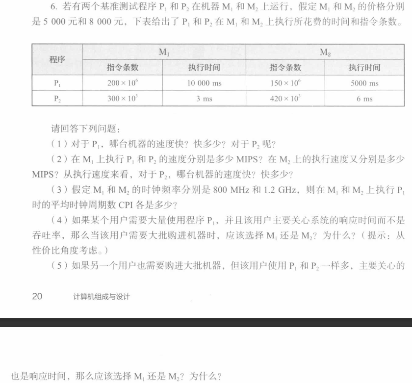


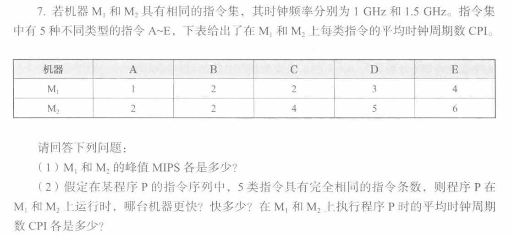

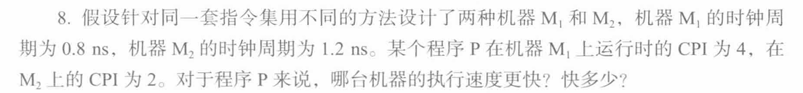

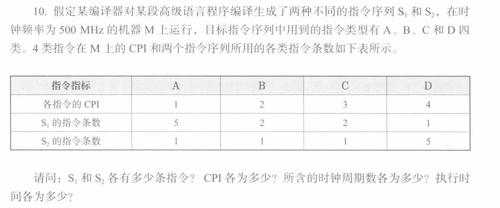

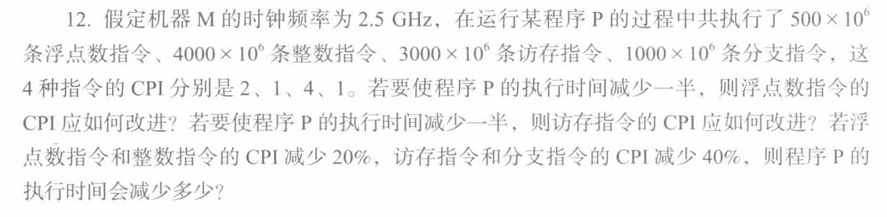


## 第二次作业

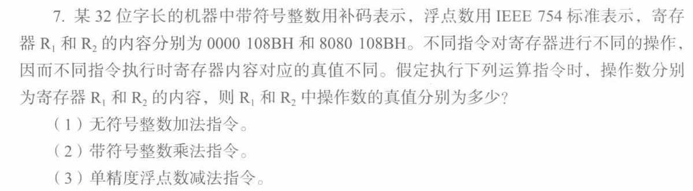

这个题并不需要我们进行具体的运算。只需要按规则译码即可。

(1) 无符号整数，直接原码译码： $R_1: 108B_{16}=4235_{10}$，$R_2: 8080108B_{16}=2155876491_{10}$

(2) 有符号整数，按补码译码： $R_1: 108B_{16}=4235_{10}$，$R_2$ 直接模运算： $2155876491-4294967296=-2139090805$

(3) FP32: S1E8M23, FP64: S1E11M52，首先写成二进制并且把符号位，阶码，尾数断开：

```text
R1: 0000 0000 0000 0000 0001 0000 1000 1011
  = 0 00000000 00000000001000010001011 是一个非规格化浮点数。
  = (-1)^0 * 2^(0-126) * 0.00000000001000010001011

R2: 1000 0000 1000 0000 0001 0000 1000 1011
  = 1 00000001 00000000001000010001011
  = (-1)^1 * 2^(1-127) * 1.00000000001000010001011
```

得到：

$$
R_1 = 0.00000000001000010001011_2 \times 2^{-126}\\
R_2 = -1.00000000001000010001011_2 \times 2^{-126}
$$

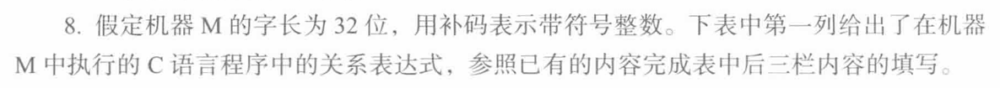

为简便，使用十六进制表记。

| 关系表达式                | 运算类型   | 结果 | 说明                                   |
|:------------------------:|:---------:|:----:|:--------------------------------------:|
| 0==0U                     | 无符号整数 |  1   | 0000 0000H = 0000 0000H |
| -1 < 0                    | 带符号整数 | 1 | FFFF FFFFH(-1) < 0000 0000H(0) |
| -1 < 0U                   | 无符号整数 |  0   | 11…1B（2³²-1）>00…0B（0）|
| 2147483647 > -2147483647 - 1 | 带符号整数 |  1   | 011…1B（2³¹-1）>100…0B（-2³¹）|
| 2147483647U > -2147483647 - 1 |无符号整数 |  0   | 7FFF FFFFH(2³¹-1) < 8000 0000H (2³¹) |
| 2147483647 > (int)2147483648U | 带符号整数 |  1   | 7FFF FFFFH > 8000 0000H (-2³¹) |
| -1 > -2                   | 带符号整数 |  1   | FFFF FFFF(-1) > FFFF FFFE(-2) |
| (unsigned)-1 > -2         | 无符号整数 | 1 | FFFF FFFF(2³²-1) > FFFF FFFE(2³²-2) |

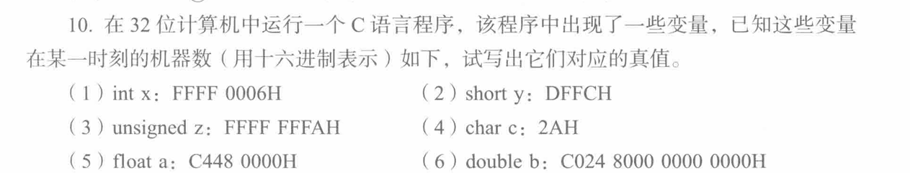

```text
(1)
x = -FFFAH = -65530

(2)
y = -2004H = -8196

(3)
z = 4294967296 - 6 = 4294967290

(4)
c = 2*16+10 = 42 = '*'

(5)
a = 1100 0100 0100 1000 0000 0000 0000 0000
  = -1 * (10001000) * 1.10010000000000000000000
  = -1 * 2^9 * (1 + 2^-1 + 2^-4)
  = -1 * (512 + 256 + 32)
  = -800

(6)
b = 1100 0000 0010 0100 1000 0000 .... 0000
  = -1 * (100 0000 0010) * 1.01001
  = -1 * 2^3 * (1 + 2^-2 + 2^-5)
  = -1 * (8 + 2 + 0.25)
  = -10.25
```

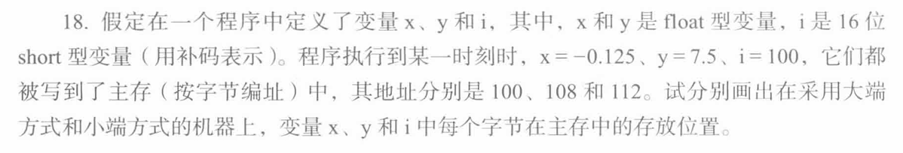

我们首先得到数据的字节型表示：

```text
x = -0.125 = -1 * 2^(-3) * 1.0 = -1 * 2^(124-127) * 1.0
  = 1 0111 1100 0000 .... 0000
  = 1011 1110 0000 0000 .... 0000
  = BF 00 00 00
y = 7.5 = 1 * 2^(2) * 1.111
  = 0 1000 0001 1110 0000 .... 0000
  = 0100 0000 1111 0000 0000 .... 0000
  = 40 F0 00 00
i = 100 = 64 + 32 + 4 = 0000 0000 0110 0100 = 00 64
```

在小端序机器上面：

```text
  00 00 00 BF ** ** ** ** 00 00 F0 40 64 00
 |     x     |           |     y     |  i  |
 100         104         108         112   
```

在大端序机器上面：

```text
  BF 00 00 00 ** ** ** ** 40 F0 00 00 00 64
 |     x     |           |     y     |  i  |
 100         104         108         112  
```

## 第三次作业

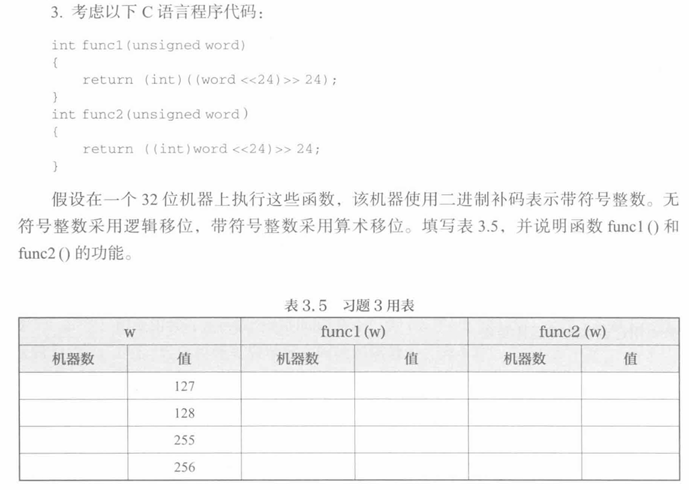

| w        |          | func1(w) |          | func2(w) |          |
|----------|----------|----------|----------|----------|----------|
| 机器数   | 值       | 机器数   | 值       | 机器数   | 值       |
| 0000 007F | 127      | 0000 007F | 127 | 0000 007F | 127 |
| 0000 0080 | 128      | 0000 0080 | 128 | FFFF FF80 | -128 |
| 0000 00FF | 255      | 0000 00FF | 255 | FFFF FFFF | -1 |
| 0000 0100 | 256      | 0000 0000 | 0 | 0000 0000 | 0 |

关键点是逻辑移位不补零，算术移位补零，以及整数移位的截断。

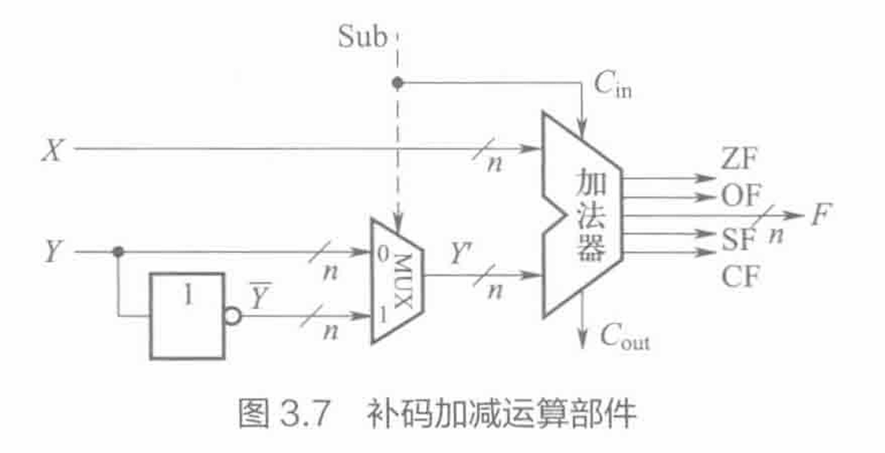

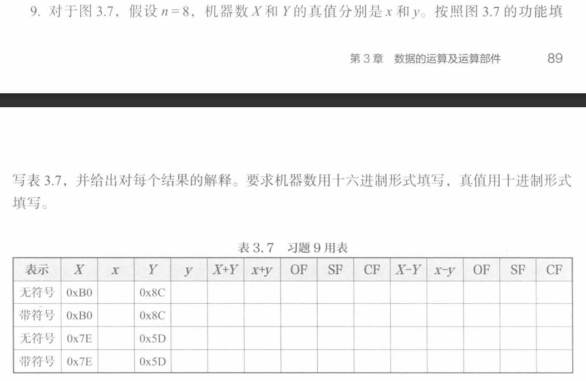

| 表示   | X    | x  | Y    |  y    | X+Y | x+y  | OF | SF | CF | X-Y | x-y | OF | SF | CF |
|-------|------|-----|------|------|------|------|----|----|----|-----|-----|----|----|----|
| 无符号 | 0xB0 | 176 | 0x8C | 140  | 0x3C | 316  | 1 | 0  | 1  | 0x24 | 36 | 0  | 0  |  0 |
| 带符号 | 0xB0 | -80 | 0x8C | -116 | 0x3C | -196 | 1 | 0  | 1  | 0x24 | 36 | 0  | 0  |  0 |

从硬件角度理解，$OF = C_{out} \oplus C_{n-1}$, $SF = F_{n}$, $CF = C_{out} \oplus Sub$。

加法时，$C_{out}=1,C_{n-1}=0,F_{n}=0,Sub=0$，根据上述计算规则可得各标志位值。

减法时，$C_{out}=1,C_{n-1}=1,F_{n}=0,Sub=1$，根据上述计算规则可得各标志位值。

从意义上理解，加法时结果为正数，出现溢出且最高位产生进位；减法时结果也为正数，未出现溢出或产生最高位的进位。

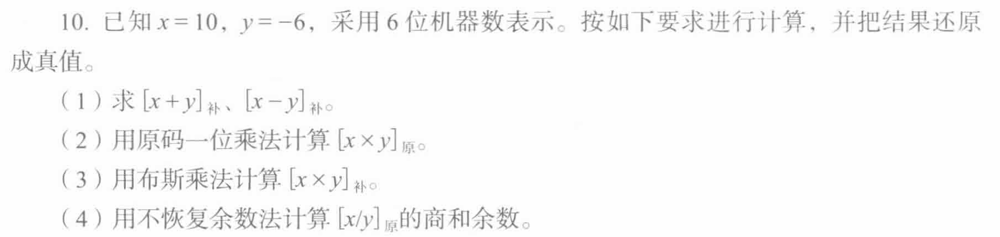

```text
(1)
补码：
 x=001010
 y=111010
-y=000110
x+y = 000100 = 4
x-y = 010000 = 16

(2)
原码：符号位 1
x=001010
y=000110

       001010
    x  000110
---------------
      001010
     001010
---------------
  00000111100
x*y = 111100 = 28

(3)
 y=111010
-y=000110

Q      A      Q_{0}Q_{-1}
000000 001010 00
000000 000101
000110 000101 10
000011 000010
111101 000010 01
111110 100001
000100 100001 10
000010 010000
111100 010000 01
111110 001000
111111 000100 00

x*y = -60

(4)
原码：符号位 1
 x=001010
 y=000110
-y=111010
S R      Q
0 000000 001010
0 000000 01010_
1 000110 01010_
1 000110 010100
1 001100 10100_
1 000110 10100_
1 000110 101000
1 001011 01000_
1 000101 01000_
1 000101 010000
1 001010 10000_
1 000100 10000_
1 000100 100000
1 000111 00000_
1 000001 00000_
1 000001 000000
1 000010 00000_
0 000100 00000_
0 000100 000001
R = 4, Q = -1
```

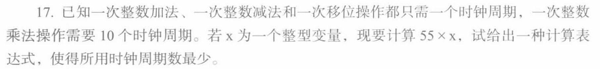

如果移动 n 位需要 n 个clk:

55 = 56 - 1, 56 = 7 * 8 = (8 - 1) * 8，由此可以构造：

```c
55 * x == (((x << 3) - x) << 3) - x
```

仅需 3 + 1 + 3 + 1 = 8 个 clk.

如果移位操作只需要一个 clk:

```c
55 * x = (x << 4) - (x << 3) - x
```

仅需要 3 个 clk.

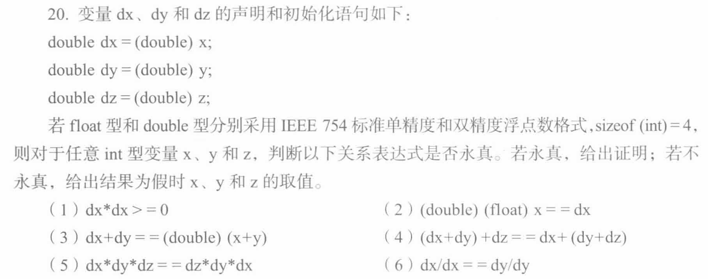

(1) 永真。int 转 double 不会出现 INF 或者 NaN，因此无论如何都是大于零的。

(2) float 在 x 接近 INT_MAX 的时候，粒度会变稀到小于 1（因为尾数只有 23 bits，无论如何不能覆盖 32 bits 的 int）。因此当 x = 2146483647 时为假。

(3) 显然 x+y 溢出时两者不等。取 x = 2146483647, y = 1 即可。

(4) 永真。这里没有大数吃小数的问题，因为 double 在 int 的粒度足够。

(5) 永真，理由同上。

(6) 取 x = 0, y = 1，这样 dx/dx = -nan。

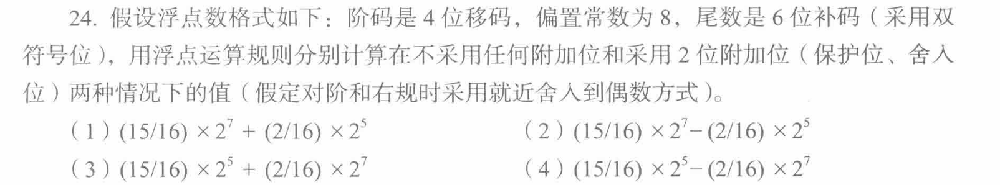

E4M6，规格化的浮点数指数范围是 -7 ~ 7。

(1)

```text
15/16 * 2^7 = 0.1111 * 2^7 = 1.111000 * 2^6
2/16 * 2^5 = 4 = 1.000000 * 2^2
对阶：
1.000000 * 2^2 = 0.000100 * 2^6
相加：
= 1.111100 * 2^6
结果是规格化数且不存在精度误差，因此无需重新规格化，添加保护位的结果不变。
= 1.111100 * 2^6 = 0 1110 111100
```

(2)

```text
15/16 * 2^7 = 0.1111 * 2^7 = 1.111000 * 2^6
-2/16 * 2^5 = -4 = 11 1.000000 * 2^2
对阶：
1.000000 * 2^2 = 1.111100 * 2^6
相减（补码相加）：
= 00 1.110100 * 2^6
结果是规格化数且不存在精度误差，因此无需重新规格化，添加保护位的结果不变。
= 1.110100 * 2^6 = 0 1110 110100
```

(3)

```text
15/16 * 2^5 = 0.1111 * 2^5 = 00 1.111000 * 2^4
2/16 * 2^7 = 16 = 00 1.000000 * 2^4
对阶：
已经对好。
相加：
= 00 10.111000 * 2^4
由于最后一位是0所以是否添加保护位都不会影响结果。
右规：
= 1.011100 * 2^5 = 0 1101 011100
```

(4)

```text
15/16 * 2^5 = 0.1111 * 2^5 = 00 1.111000 * 2^4
-2/16 * 2^7 = -16 = 11 1.000000 * 2^4
对阶：
已经对好。
相减（补码相加）：
= 00 0.111000 * 2^4
由于没有进行右规所以是否添加保护位都不会影响结果。
左规：
= 1.110000 * 2^3 = 0 1011 110000
```

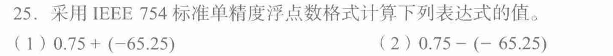

FP32: S1E8M23

(1)

```text
0.75 = 3/4 = 0.11 = 1.1 * 2^-1
S = 0
E = 0111 1111
M = 1000 0000 .... 0000

65.25 = 64 + 1 + 0.25 = 1000001.01 = 1.00000101 * 2^6
-65.25:
S = 1
E = 1000 0110
M = 1111 1011 0000 .... 0000

对阶:
1.1 * 2^-1 = 0.0000 0011 * 2^6

相加：
S = 1
E = 1000 0110
M = 1111 1110 0000 .... 0000
 = -1.0000 0010 * 2^6
也就是 -64.5
```

(2)

```text
0.75 = 3/4 = 0.11 = 1.1 * 2^-1
S = 0
E = 0111 1111
M = 1000 0000 .... 0000

65.25 = 64 + 1 + 0.25 = 1000001.01 = 1.00000101 * 2^6
减去负数就是加上补码的补码也就是加上正数。
65.25:
S = 0
E = 1000 0110
M = 0000 0101 0000 .... 0000

对阶:
1.1 * 2^-1 = 0.0000 0011 * 2^6

相加：
S = 0
E = 1000 0110
M = 0000 1000 0000 .... 0000
 = 1.0000 1000 * 2^6
也就是 66
```

## 第四次作业

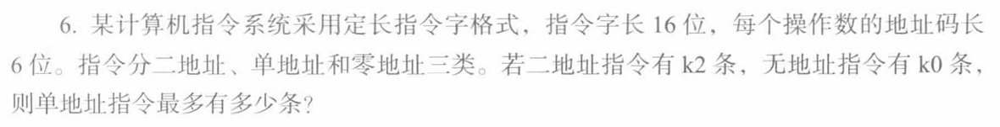

零地址指令、单地址指令和二地址指令满足

$$
k_0+2^6 k_1+2^{12}k_2=2^{16}
$$

我们没有必要像课件那样考虑怎么分配前缀才能使得编码不混淆，因为只要满足上面的等式，就必然能够不重不漏地为这三种编码分配编码空间。于是

$$
k_1=2^{10}-2^6k_2-\dfrac{k_0}{2^6}
$$

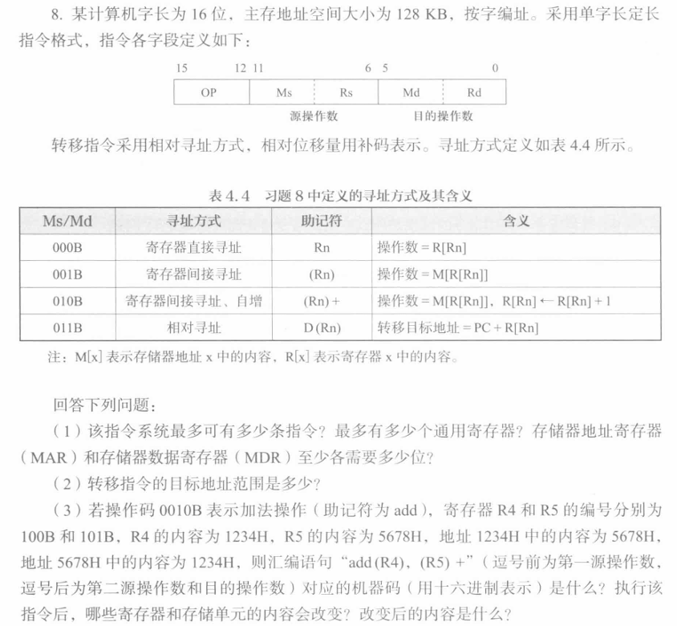

(1) OP 占 12 到 15 位，一共 4 bits，支持 $2^4=16$ 条指令；单个操作数 6 bits，其中前 3 bits 拿来定义寻址方式，后 3 bits 就应该是寄存器编号，支持 $2^3=8$ 个通用寄存器。由于主存 128KiB，也就是 $2^{16}$ 个字长（1 word = 2 bytes），因此需要 16 bits 的地址寄存器 MAR，由于机器字长 16 bits，因此需要 16 bits 的数据寄存器 MDR。

(2) 转移采用补码也就是 $[PC-32767,PC+32768]$。

(3)
机器码如下：

```text
0010 001 100 010 101
 ADD  ()  R4 ()+  R5
0010 0011 0001 0101B = 0x2315
```

按指令执行，取 R4 内容 1234H 指向的地址内容 5678H，取 R5 内容 5678H 指向的地址内容 1234H，相加之后将结果 68ACH 存到地址 5678H 内（**第一处改变**），然后 R5 寄存器自增 1 就是 5679H（**第二处改变**）。

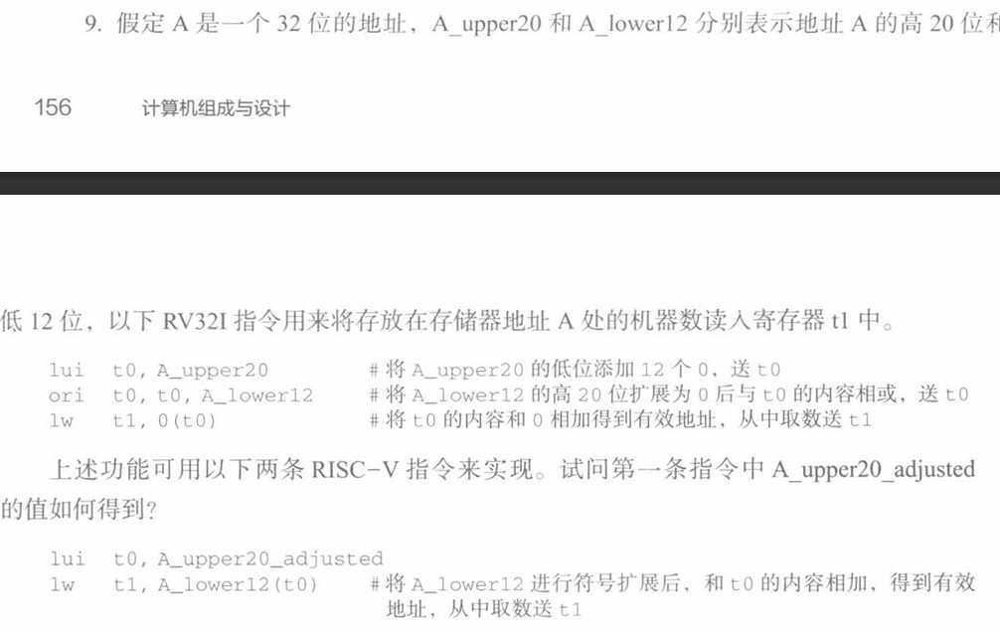

这里的关键是 A_lower_12 进行符号扩展之后，如果 A_lower_12 的最高位是 1 就会出问题，扩展之后高 20 位全部都变成 1 了，因此这个时候我们要在高20位最后一位多加一个 1，就能把刚刚的符号扩展“翻回来”。即：

```text
A_upper20_adjusted = A_upper20 + A_lower12[11]
```

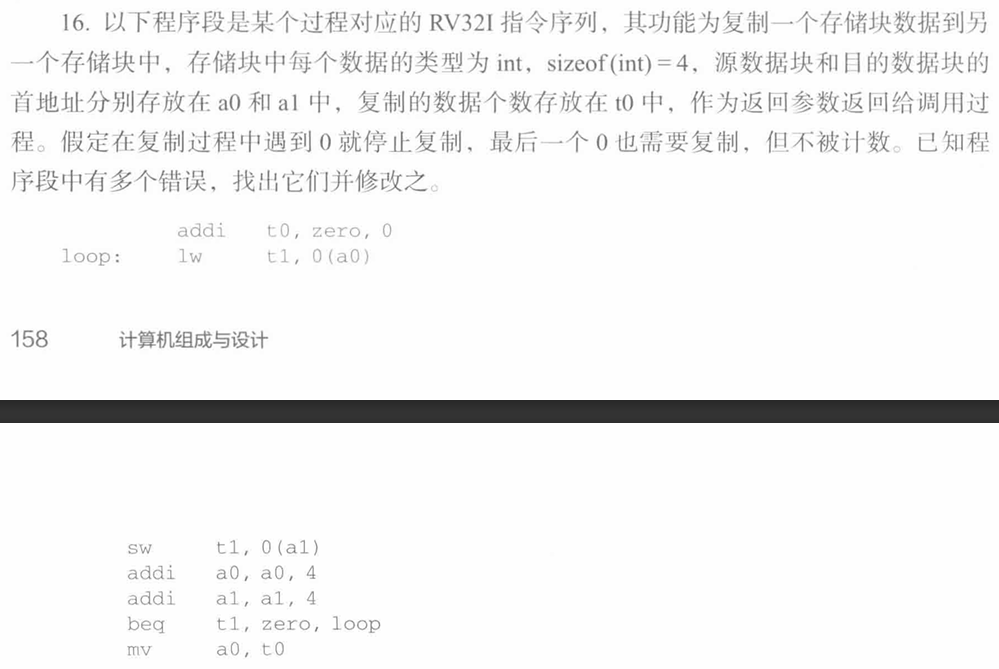

首先需要指出题目设计的这个算法的 Bug，如果 a0 和 a1 中间没有 0，那这个算法就会越界访问内存。

```asm
        addi    t0, zero, 0     ;初始化 t0 <- 0
loop:   lw      t1, 0(a0)       ;t1 存放 a0 内容

        sw      t1, 0(a1)       ;将 t1 的值（a0的内容）存在 a1 里面，也就是拷贝
        addi    a0, a0, 4       ;a0 往后挪 1 个 int
        addi    a1, a1, 4       ;a1 往后挪 1 个 int 
        beq     t1, zero, loop  ;若 t1 = 0 则跳回 loop
        mv      a0, t0          ;把 t0 放到 a0
```

首先我们可以大体上知道这个代码想干什么但是失败了，我把这个意图用 C 语言简单写一下：

```c
int memcpy_0(void* src, void* dst)// a0 -> src, a1 -> dst
{
  int cnt = 0; //t0 <- 0
  //loop:
  while(*src != 0)
  //lw t1, 0(a0); t1 = *src
  //beq t1, zero, ret; *src !=0 then loop otherwise jump to ret
  {
    *dst = *src;//sw t1, 0(a1)
    ++src;//addi a0, a0, 4
    ++dst;//addi a1, a1, 4
    ++cnt;//addi t0, t0, 1
    //j loop
  }
  //ret: mv a0, t0
  return cnt;
}
```

翻译成汇编如下：

```asm
      addi  t0, zero, 0
loop: lw    t1, 0(a0)
      beq   t1, zero, ret
      sw    t1, 0(a1)
      addi  a0, a0, 4
      addi  a1, a1, 4
      addi  t0, t0, 1
      j     loop
ret:  mv    a0, t0
```

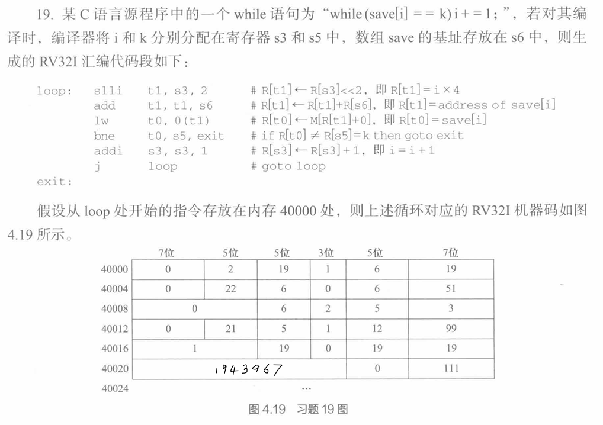

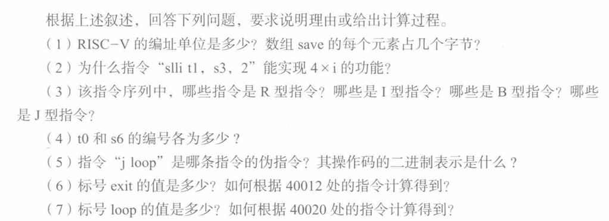

(1) 8位或者说一个字节，数组每个元素 4 字节。因为第一行 R[t1] = i * 4 说明一个 int 占 4 字节，这样就能正确算出基于字节地址的偏移量。

(2) i 放在 s3 里面，左移两位就是 i * 4，然后放进 t1 备用。

(3) R 型指令对应三个操作数的加减位运算，opcode = 0110011B = 51，也就是第二条位于内存 40004 处的指令。

I 型指令对应立即数和两个操作数的加减位运算，opcode = 0010011B = 19，也就是第一条位于内存 40000 处的指令和第五条位于内存 40016 处的指令，以及 lw 指令，opcode = 0000011B = 3 也就是第三条位于内存 40008 处的指令。

B 型指令就是以 B 打头的指令也就是第四条位于内存 40012 处的指令。

J 型指令为最后一条位于内存 40020 处的指令。

(4) 由 lw t0, 0(t1) 对应的机器码可知 t0 的编号是 5，由 add t1, t1, s6 对应的机器码可知 s6 的编号是 22。

(5) jal x0, loop。操作码为 1101111

(6) 如下：

```text
0=0000000 = 0 | 000000
12=01100 = 0110 | 0
offset = 0 0 0000 0110 0 = 12
exit = PC + offset = 40024
```

(7) 按理说应该是 40000 也就是带 loop 标号的内存地址的，按机器码如下：

```text
偏移量 -20 bytes => 最后 imm = -10
-10 = 1 11111111 1 1111110110
重组: 1 1111110110 11111111 1
11111110110111111111 = 1043967（???）
```

我怀疑本题数据有 typo，应该是 1043967，证据如下：

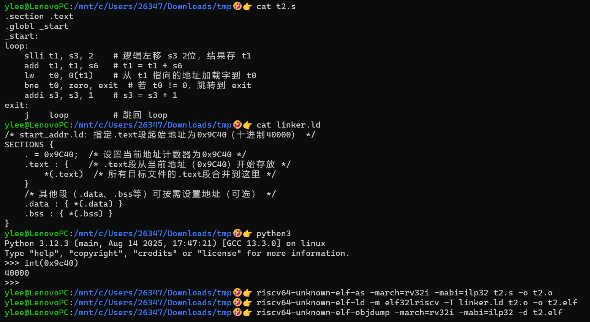

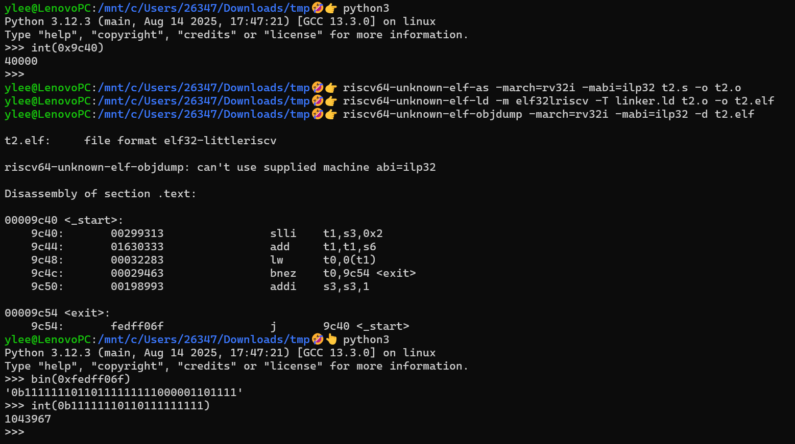

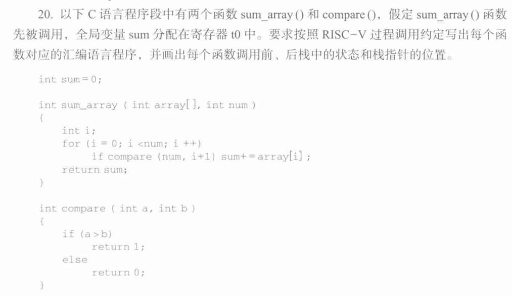

首先处理 `compare` 函数，这是一个叶子函数所以可以不用特意分配栈帧：

```c
int compare(int a, int b)
// a0 <- a, a1 <- b, ret -> a0
{
  //blt a1, a0, ret1
  if (a > b)
    return 1; // ret1 :addi a0, zero, 1; ret
  else
    return 0; // addi a0, zero, 0; ret
}
```

组织一下：

```asm
compare:
  blt a1, a0, ret1
  addi a0, zero 0
  ret

ret1:
  addi a0, zero, 1
  ret
```

然后看一下 `sum_array`：

```c
int sum = 0; //t0 <- sum
int sum_array ( int array[], int num )
// a0 <- array, a1 <- num
{
    // Registers needed to save: s0 for array, s1 for num, s2 for i. We also need to save ra. We will also call `compare` so 
    /*
    Prologue:
    addi sp, sp, -20
    sw ra, 16(sp)
    sw s0, 12(sp)
    sw s1, 8(sp)
    sw s2, 4(sp)
    ...
    Epilogue:
    lw s2, 4(sp)
    lw s1, 8(sp)
    lw s0, 12(sp)
    lw ra, 16(sp)
    addi sp, sp, 20
    */
    int i;
    /*
    Initialization:
    save parameters:
    addi s0, a0, 0
    addi s1, a1, 0
    num = 0: addi t0, zero, 0
    i = 0:   addi s2, zero, 0
    */
    for (i = 0; i < num; i++)
    //if i >= num, jump to ret: bge s2, s1, ret
    //loop:
    /*
    Now we will call `compare`.
    `compare` take num(s1) as a0, i+1(s2) as a1
    so we generate arguments:
    addi a0, s1, 0
    addi a1, s2, 1
    also, we need to save t0
    sw t0, 0(sp)
    then call compare.
    now resume t0: lw t0, 0(sp)
    now a0 = compare (num, i+1)
    if a0 = 0 we just skip sum += array[i]: beq a0, zero, skip
    */
        if compare (num, i+1) sum += array[i];
    /*
    now we calculate sum += array[i].
    firstly we get the address array + i:
    slli t1, s2, 2
    addi t1, s0, t1
    then we load array[i] = *(array + i):
    lw t2, 0(t1)
    finally we add it to sum:
    addi t0, t0, t2
    */
    //skip: addi s2, s2, 1
    //j loop
    //ret: addi a0, t0, 0
    return sum;
}
```

```asm
sum_array:
    ;Prologue
    addi sp, sp, -20
    sw ra, 16(sp)
    sw s0, 12(sp)
    sw s1, 8(sp)
    sw s2, 4(sp)

    ;Initialization
    addi s0, a0, 0
    addi s1, a1, 0
    addi t0, zero, 0
    addi s2, zero, 0

loop:
    bge s2, s1, ret

    addi a0, s1, 0
    addi a1, s2, 1

    sw t0, 0(sp)
    
    jal compare

    lw t0, 0(sp)

    beq a0, zero, skip

    slli t1, s2, 2
    add t1, s0, t1
    lw t2, 0(t1)
    add t0, t0, t2
skip:
    addi s2, s2, 1
    j loop

ret:
    addi a0, t0, 0
    ;Epilogue
    lw s2, 4(sp)
    lw s1, 8(sp)
    lw s0, 12(sp)
    lw ra, 16(sp)
    addi sp, sp, 20
    
    ret
```

因此调用 sum_array 前，其栈空间里面没有东西：

```text
高地址->低地址，每一格 4 bytes。
----+----+
... |    |
----+----+
      ↑sp
```

调用 sum_array 后，调用 compare 前后：

```text
高地址->低地址，每一格 4 bytes。
----+----+----+----+----+----+
... | ra | s0 | s1 | s2 | t0 |
----+----+----+----+----+----+
                          ↑sp
```

因为 compare 特别简单不涉及栈上操作，因此栈状态不变。

调用 sum_array 后，释放栈空间：

```text
高地址->低地址，每一格 4 bytes。
----+----+
... |    |
----+----+
      ↑sp
```

## 第五次作业


(4) 单周期处理器的 CPI 是 1。时钟周期由耗时最长的数据通路也就是 lw 指令决定。由于顺序执行导致各个组件空闲时间长，因此性能差。

(5) 把指令执行分成多个阶段，每个阶段在单个时钟周期内完成，每个阶段只能进行一次访存。因为不同指令的包含的阶段不一样，比如 jmp 直接利用 adder 修改 pc，阶段少；lw 指令涉及对内存的取址和寄存器堆的访存，阶段长。因此不同指令的 CPI 不同。

(9) 流水线下，一条指令的处理时间不可能缩短，而且流水段间的数据传送也需要时间，并且由于处理冒险，对简单指令以及分支指令而言，处理时间还可能更长。但是由于组件利用效率更高，时钟频率更快，程序运行时间一般短得多。

(10) 时钟周期仍旧由最复杂的 lw 指令来决定。也就是分成五级流水线，或者说五个阶段：

- IF: 取指令并更新 PC (PC <- PC+4)。
- ID: 译码指令并从源寄存器取数。
- EX: 在 ALU 执行指令。对 lw 而言是计算地址
- M : 读取存储器内容。
- WB: 结果写回目标寄存器。

让每个阶段在一个时钟周期内完成，就可以得到流水线 CPU 的时钟周期。

由于一个时钟周期只有一条指令完成流水线执行，因此 CPI = 1。

(13) 原因是不同流水段需要的控制信号不一样。但是各流水段所需寄存器宽度不同。比如 EX 段以前需要传递 ALUSrc 和 ALUOp 来确定 ALU 需要执行的操作，但 EX 段之后，这俩就不需要了。


图在这：


这个 CPU 支持的九条指令如下：

```text
add  rd,  rs1, rs2
slt  rd,  rs1, rs2
sltu rd,  rs1, rs2
ori  rd,  rs1, imm12
lui  rd,  imm20
lw   rd,  rs1, imm12
sw   rs1, rs2, imm12
beq  rs1, rs2, imm12
jal  rd,  imm20
```

- RegWr: 为 0 表征无法将结果写入寄存器。这使得 `add`, `slt`, `sltu`, `ori`, `lui`, `lw` 和 `jal` 指令无法正常执行，因为它们都有一个 `rd` 寄存器用来写回结果。
- ALUAsrc: 为 0 表征只能从寄存器获取 ALU 的数据源，也就是无法计算 PC + ... 的值，影响 `beq` 和 `jal` 指令。
- Branch: 当该信号为 0 时，意味着 `ZF & Branch` 恒为 0，也就是说 `bne` 指令完全无法进行跳转。
- Jump: 只影响 `jal` 指令，也是导致无法进行跳转。
- MemWr: 只有 `sw` 涉及到对内存的写，因此会使得无法向内存写入任何数据。
- MemtoReg: 无法将内存数据写入寄存器，也就是让 `lw` 指令无法接受来自内存的数据，只能接受 ALU 的运算结果。


图在这：

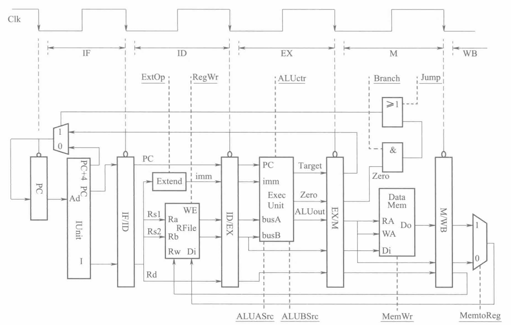

(1) 显然不行。时钟周期的长度由最长段决定，在这里是访存的 M 段，所以尽管 EX 段加快了，也只是增加了在单个时钟周期的空闲时间而已。

(2) 无影响。EX 段减慢 20% 也就是执行耗时变为 180 ps，仍然不是起到决定性的最长段。

(3) 此时 EX 段耗时来到 210 ps，成为最长段，导致时钟周期也变成 210 ps，导致运行时间增加 5% 也就是性能降低 5%。

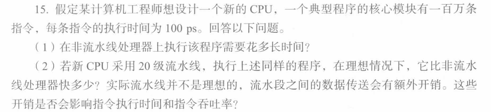

(1)

$$
10^6\times100\times 10^{-12}=10^{-4} \mathrm{s}=100 \mathrm{\mu s}
$$

(2)

采用 20 级流水线，理想情况下每个流水段时间相等，20 个流水段时间之和为单条指令执行时间，则单个流水段执行时间只需要 5ps。这就是单个时钟周期长度，而理想情况下 CPI=1，则：

$$
10^6\times5\times 10^{-12}=10^{-4} \mathrm{s}=5 \mathrm{\mu s}
$$

流水段中的数据传送会导致单个流水段均摊的耗时增大，也就使得单条指令执行时间变长，吞吐率下降。

## 第六次作业


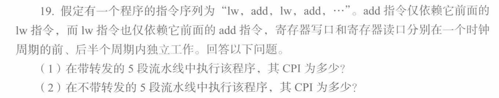


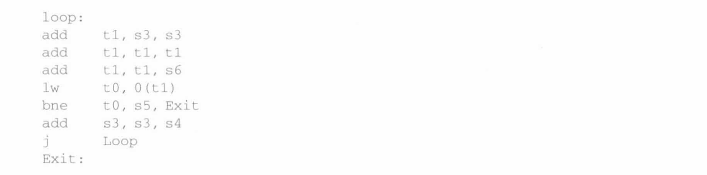

参考上面那个题的流水线时间图，`bne` 指令的EX段执行完之后，在流水线上的是下一条指令的ID段和下下条指令的IF段，因此延迟槽宽度为2。

由于存在转发，因此我们只考虑 Load-Use，也就是 `lw` 指令存在 1 个周期的阻塞。


列表如下：

|正确/总数|(1)|(2)|(3)|(4)|
|:------:|:--:|:--:|:--:|:--:|
|分支指令1|3/3|0/3|3/3|3/3|
|分支指令2|0/3|4/4|3/4|3/4|
|分支指令3|3/6|3/6|1/6|3/6|
|分支指令4|4/5|1/5|3/5|4/5|
|分支指令5|5/7|2/7|3/7|5/7|
|合计准确率|15/25|10/25|13/25|18/25|