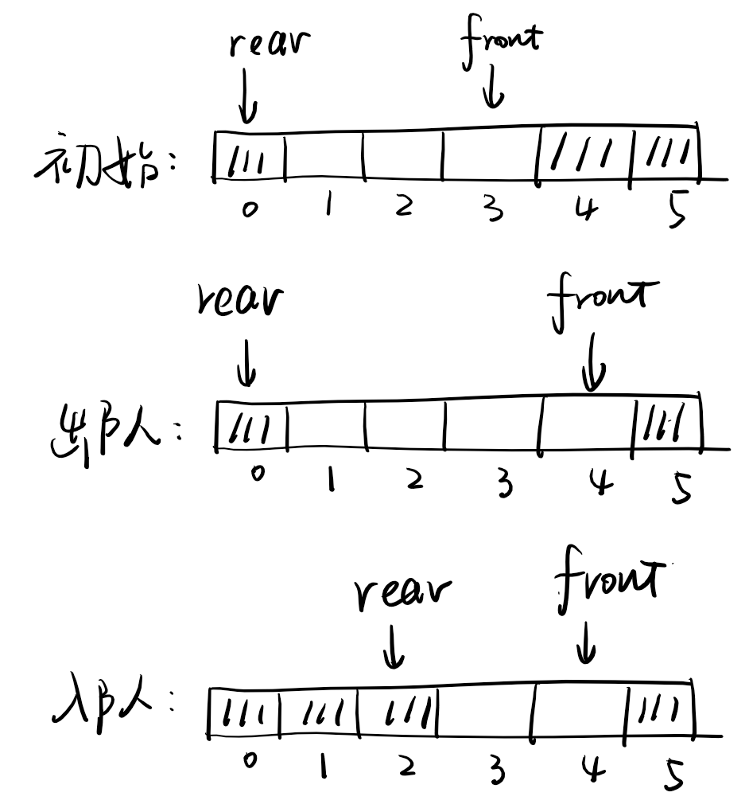

# 《数据结构》期末复习题题解

## 第五版第一套题目
### 单项选择题

1. **数据结构是指**______。  
   A. 一种数据类型  
   B. 数据的存储结构  
   C. 一组性质相同的数据元素的集合  
   D. 相互之间存在一种或多种特定关系的数据元素的集合  

<details>

<summary> 答案 </summary>

<p></p>

<b>答案：D。</b> 三短一长选最长好吧。其实数据结构的精妙之处就是利用好数据之间的相互关系来组织数据，以获得更佳的性能。ABC选项描述都没有抓住“数据间相互关系”这个关键词。

<p></p>

</details>

2. **以下算法的时间复杂度为**______。  
   ```c
   void fun(int n)
   {  int i = 1, s = 0;
      while (i <= n)
      {  s += i + 100; i++;  }
   }
   ```  
   A. $O(n)$  
   B. $O(\sqrt{n})$  
   C. $O(n\log_2 n)$  
   D. $O(\log_2 n)$  

<details>

<summary> 答案 </summary>

<p></p>

<b>答案：A。</b> 本题 s 是一个障眼法，决定循环次数的只有 i 和 n。根据代码，i 从 1 开始，每一次循环 i 都增加 1，直到 i 的值增加到 n 为止。因此一共执行了 n 次循环，选A。

<p></p>

<b>变体：如果把循环条件改成 `s <= n`，则应该选哪个选项呢？</b>

<details>
<summary>点击查看解答</summary>
<p></p>

考虑循环执行了 x 次，则
$$
s=\sum_{i=1}^{x}100+i = 100x+\dfrac{x(x-1)}{2}
$$
也就是 s 增长率在 x^2 量级，由于循环条件为 s<=n，就可以得出 x=O(√n)。
<p></p>
当然也可以利用上式把 x 关于 n 的精确表达式解出来再做分析，原理是一样的。
<p></p>
原书给的答案是B，其实想考的是这个，但是出题人有点草台班子，弄巧成拙了。

<p></p>
</details>

<p></p>

</details>

3. **在一个长度为$n$的有序顺序表中删除第一个元素值为$x$的元素时，在查找元素$x$时采用二分查找方法，此时删除算法的时间复杂度为**______。  
   A. $O(n)$  
   B. $O(n\log_2 n)$  
   C. $O(n^2)$  
   D. $O(\sqrt{n})$  


<details>

<summary> 答案 </summary>

<p></p>

<b>答案：A。</b> 这里删除算法分两步：第一步找到待删除的第一个元素，这一步由于原来的表是有序的，所以可以使用二分法，每次排除一半的区间，时间复杂度为 O(log_2 n)，第二步是把这个元素删除，由于采用线性表存储所以时间复杂度是 O(n)。两步加起来，由于第一步相比第二步用时太短，几乎可以忽略不计，所以总的时间复杂度为 O(n)。

<details>
<summary>为什么线性表随机删除单个元素的时间复杂度是 O(n) ?</summary>
<p></p>

随机删除元素，则任一下标 i (为方便书写，从 1 开始)的元素被选中的概率都是 1/n，删除操作需要把后面的 (n-i) 个元素都往前移动一位，因此移动次数的期望值为：

$$
E=\sum_1^{n}\dfrac {n-i}{n}= \dfrac{n-1}2
$$

是 O(n) 级别的操作。
<p></p>
延伸讨论：链表呢？有没有其他数据结构能够做到查找-删除操作比 O(n) 更快？
<p></p>
1. 对链表而言，虽然删除操作可以简单通过改变前后指针指向实现 O(1) 的复杂度，但是查找对应元素却需要 O(n) 的时间。
<p></p>
2. 当然有。比如各种平衡树。参考：https://oi-wiki.org/ds/bst/本质上平衡树就是为了减少这一操作的复杂度而利用了树形结构并且引入各种结构调整操作来限制树的深度，以防止出现最坏效率。当然，除了树形结构可以利用分治优化，链式结构也可以，比如跳表:https://oi-wiki.org/ds/skiplist/。

<p></p>
</details>

<p></p>
</details>

4. **若一个栈采用数组$s[0..n-1]$存放其元素，初始时栈顶指针为$n$，则以下元素$x$进栈的操作正确的是**______。  
   A. $\text{top}++;\ s[\text{top}] = x;$  
   B. $s[\text{top}] = x;\ \text{top}++;$  
   C. $\text{top}--;\ s[\text{top}] = x;$  
   D. $s[\text{top}] = x;\ \text{top}--;$  

<details>

<summary> 答案 </summary>

<p></p>

<b>答案：C。</b> 其实本题考虑到ABD选项都会造成数组下标越界访问就可以解出。但这个题本意是说从这个数组的尾端向前装数据，也能构成一个栈。这么做可以和一个从前往后装数据的栈组合成一个对顶栈。

<p></p>
</details>


5. **设环形队列中数组的下标为$0\sim N-1$，其队头、队尾指针分别为$\text{front}$和$\text{rear}$（$\text{front}$指向队列中队头元素的前一个位置，$\text{rear}$指向队尾元素的位置），则其元素个数为**______。  
   A. $\text{rear} - \text{front}$  
   B. $\text{rear} - \text{front} - 1$  
   C. $(\text{rear} - \text{front})\%N + 1$  
   D. $(\text{rear} - \text{front} + N)\%N$  

<details>

<summary> 答案 </summary>

<p></p>

<b>答案：D。</b> 因为这是一个循环队列，如果 rear 的下标大于 front，那么可以直接相减，但是也可能出现小于的情况，所以需要加上 N 来保证结果是正数，由于可能大于 N，所以要取模。

<p></p>
</details>

6. **若用一个大小为6的数组来实现环形队列，队头指针$\text{front}$指向队列中队头元素的前一个位置，队尾指针$\text{rear}$指向队尾元素的位置。若当前$\text{rear}$和$\text{front}$的值分别为0和3，当从队列中删除一个元素，再加入两个元素后，$\text{rear}$和$\text{front}$的值分别为**______。  
   A. 1和5  
   B. 2和4  
   C. 4和2  
   D. 5和1

<details>

<summary> 答案 </summary>

<p></p>


<b>答案：B。</b> 看图：
<p>
</img>
</p>

<p></p>
</details>

7. **一棵高度为$h$（$h\geq1$）的完全二叉树至少有**______个结点。  
   A. $2^{h-1}$  
   B. $2^h$  
   C. $2^h + 1$  
   D. $2^{h-1} + 1$  

8. **设一棵哈夫曼树中有999个结点，该哈夫曼树用于对**______个字符进行编码。  
   A. 999  
   B. 499  
   C. 500  
   D. 501  

9. **一个含有$n$个顶点的无向连通图采用邻接矩阵存储，则该矩阵一定是**______。  
   A. 对称矩阵  
   B. 非对称矩阵  
   C. 稀疏矩阵  
   D. 稠密矩阵  

10. **设无向连通图有$n$个顶点、$e$条边，若满足**______，则图中一定有回路。  
    A. $e\geq n$  
    B. $e < n-1$  
    C. $e = n-1$  
    D. $2e\geq n$  

11. **如果从无向图的任一顶点出发进行一次广度优先遍历即可访问所有顶点，则该图一定是**______。  
    A. 完全图  
    B. 连通图  
    C. 有回路  
    D. 一棵树  

12. **设有100个元素的有序表，在用折半查找时，不成功查找时最大的比较次数是**______。  
    A. 25  
    B. 50  
    C. 10  
    D. 7  

13. **从100个元素确定的顺序表中查找某个元素（关键字为正整数），如果最多只进行5次元素之间的比较，则采用的查找方法只可能是**______。  
    A. 折半查找  
    B. 顺序查找  
    C. 哈希查找  
    D. 二叉排序树查找  

14. **有一个含有$n$（$n>1000$）个元素的数据序列，某人采用了一种排序方法对其按关键字递增排序，该排序方法需要关键字比较，其平均时间复杂度接近最好的情况，空间复杂度为$O(1)$，该排序方法可能是**______。  
    A. 快速排序  
    B. 堆排序  
    C. 二路归并排序  
    D. 基数排序  

15. **对一个线性序列进行排序，该序列采用单链表存储，最好采用**______方法。  
    A. 直接插入排序  
    B. 希尔排序  
    C. 快速排序  
    D. 都不适合
