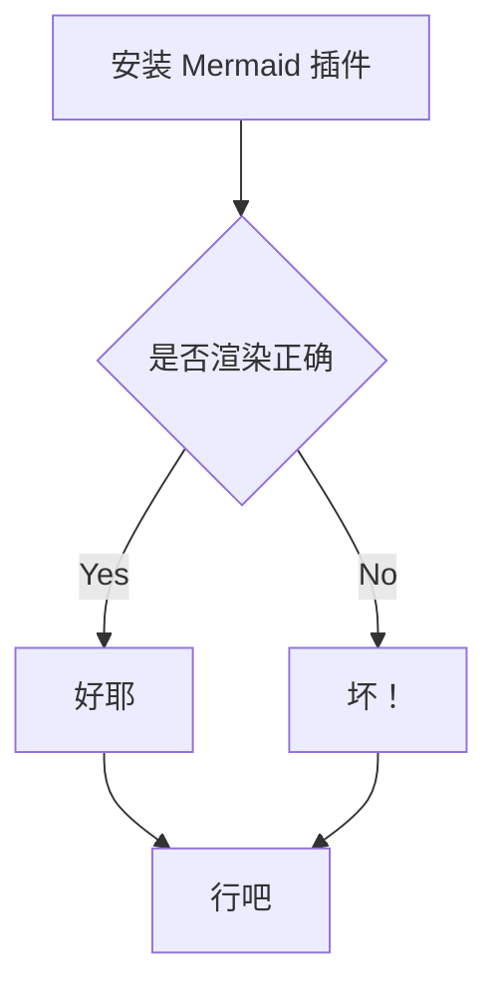

# 功能测试页面

代码块：

```cpp
auto index = static_cast<int>(std::distance(vec.begin(), std::lower_bound(vec.begin(), vec.end(), val));
```

公式：

$$
\lim_{n\rightarrow \infty}\sum^n_{i = 1}\dfrac{1}{i^2} = \dfrac{\pi^2}{6}
$$

mermaid 框图：


